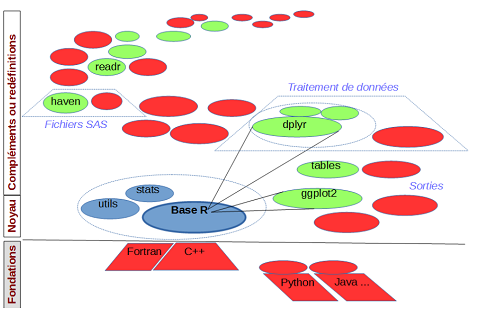
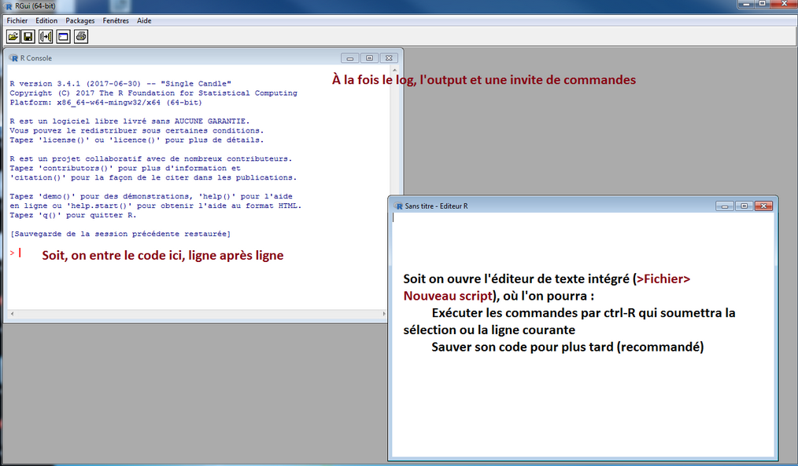
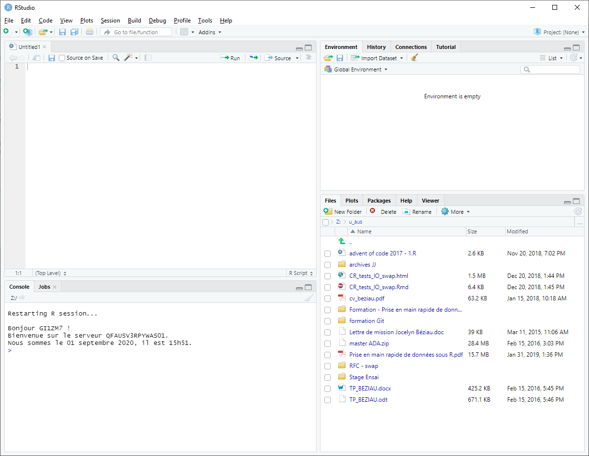
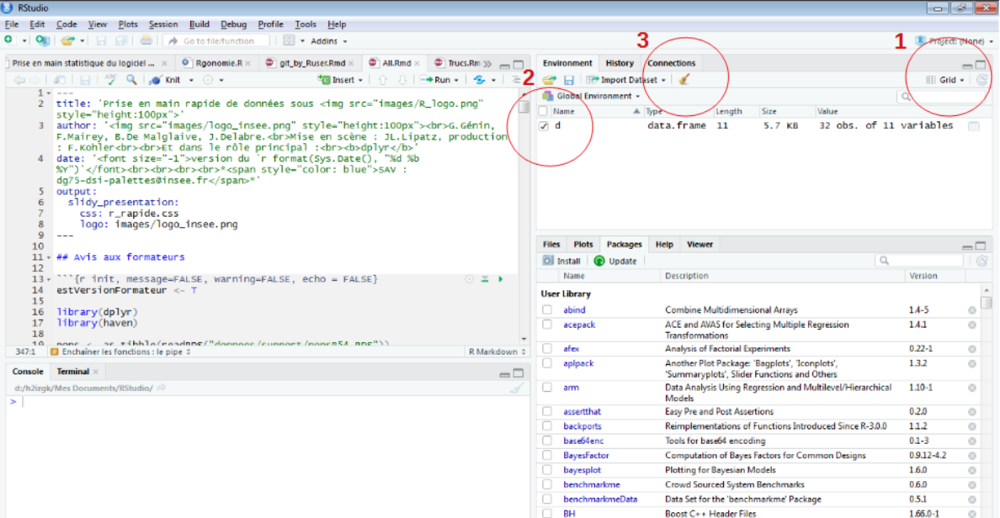
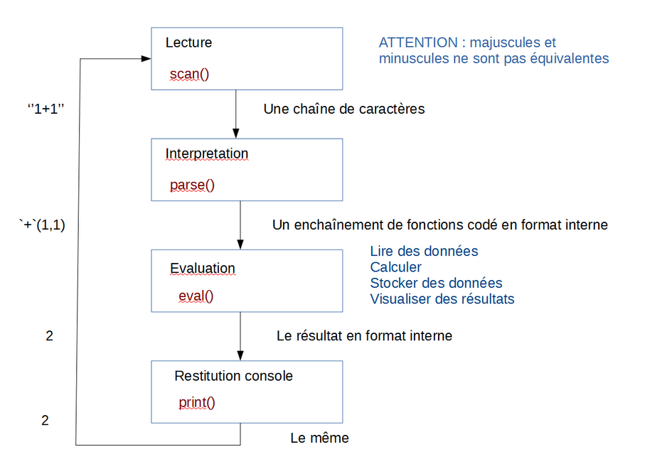

## Demandez le programme !

```{r init, message = FALSE, echo = FALSE, warning = FALSE}

library(tidyverse)
library(tibble)
library(haven)
library(rio)

pops <- as_tibble(readRDS("donnees/support/popsR54.RDS"))
tab_naissances <- import("donnees/support/tab_naissances5.sas7bdat")

knitr::knit_hooks$set(optipng = knitr::hook_optipng)
knitr::opts_chunk$set(echo = TRUE, eval = TRUE, cache = TRUE)

set.seed(42)
options(width = 100, 
        repos = "https://cran.rstudio.com/", 
        scipen = 6
        )

```

<!-- mettre à jour sommaire avec noms/numéros des séquences et n° de diapo-->

Séquence | Page | 
---------|------|------------------------------------------------------------|
1 | 3  | Travailler en R : RStudio, packages, trouver de l’aide
2 | 13 | Prise en main de données
3 | 21 | Premiers pas sur la table
4 | 29 | Création de variables
5 | 41 | Statistiques simples et pondérées
6 | 48 | Statistiques par modalités
7 | 60 | Chaînes de caractères
8 | 62 | Dates
8 | 69 | Fusion de tables
10| 79 | Import/Export
11| 83 | Transposition
12| 89 | Mise en forme des résultats
13| 97 | Graphiques
14| 122| Bases de données
15| 129| Partager et diffuser ses résultats
16| 132| Bonnes pratiques, ressources et communautés R dans le SSP

# Séquence 1 - Travailler en R


## Principes généraux (1/2)

R est un langage de programmation complet

* scientifique
* multi-paradigme
* programmable


## Principes généraux (2/2)

R est constitué d'un noyau constitué d'opérations de base et de fonctions travaillant généralement en RAM

On peut le complèter par des "packages", bibliothèques de fonctions à charger en tant que de besoin

* des domaines d'application variés (stats, graphiques, SGBD, sites interactifs, ...)
* complexité, efficacité et documentation hétérogènes
* grand nombre d'auteurs : pas de logique d'ensemble, recouvrements, ...


## Pas seuls dans l'univeRs

Une galaxie de `r (n <- signif(nrow(available.packages()), 2))` packages, près de `r signif(17 * n, 3)` fonctions, pour :

* ajouter des fonctionnalités
* remplacer des parties du noyau par des alternatives plus efficaces ou ergonomiques
* interfacer R avec d'autres langages de programmation




## Travailler avec R : une question de mémoire

En SAS, le mode de travail habituel consiste à **appeler successivement des procédures**, qui prennent chacune **en entrée des fichiers de données** pour produire **des fichiers de données en sortie**. Ce qui se passe entre les deux est paramétré par l'utilisateur mais est assimilable à une boîte noire.

À l'inverse, R donne un maximum de contrôle sur la façon de traiter les données, qui sont des objets chargés en mémoire (RAM) et non des fichiers stockés sur le disque. 

La taille de la mémoire disponible peut donc devenir décisive pour les traitements.


### À L'Insee, trois environnements peuvent être mobilisés

* Le poste de travail individuel
* AUS (accès aux données sécurisées)
* Le [SSPCloud](https://www.sspcloud.fr/)


## L'interface de base : RGui

Quoique minimaliste, cette interface permet d'utiliser toute la puissance du langage R




## L'environnement de développement : Rstudio

Cette interface facilite la vie du statisticien et du développeur
C'est dans cet environnement que nous allons principalement travailler




## Prise en main de RStudio

Utiliser la console pour obtenir le résultat de 6 fois 9

Ouvrir une nouvelle fenêtre de script (*File > New File > R script* ou *CTRL + maj + N*) et y soumettre le même calcul (saisir le code, puis le sélectionner et cliquer sur le bouton *Run*)


## L'environnement : tout ce qui existe est un objet

Supprimer des objets de l'environnement




## L'invite de commandes : tout ce qui se produit est un appel de fonction



# Séquence 2 - Prise en main de données

## Charger un package

On peut utiliser la fonction `import()` du package **rio** pour récupérer des données dans R

L'utilisation d'un package nécessite deux étapes :

* **l'installation** du package depuis un dépôt (CRAN ou mirroir interne Insee) vers le disque dur. Une seule fois par package (hors upgrade) et par version de R

```{r eval = FALSE}
install.packages("rio")
```

* **le chargement en mémoire**, pour indiquer à R que l'on a besoin des fonctions de ce package. À chaque session R

```{r eval = FALSE}
library(rio)
```

Pour installer et charger en mémoire TOUS les packages utilisés dans cette formation :

```{r eval = FALSE}
liste_packages_formation <- c("gtools", "readODS", "tidyverse", "rio", "skimr",
                 "tidymodels", "ggformula", "plotly", "DT", "questionr",
                 "RPostgres", "tables", "Hmisc", "RSQLite", "zoo", "ggformula")
# install.packages(liste_packages_formation)
sapply(liste_packages_formation, FUN = require, character.only = TRUE)
```


## Lire un fichier avec le package rio

Chaque type de fichier possède ses spécificités, et possède en général un package ou une fonction dédiée pour son import dans R. Le package **rio** encapsule ces différentes fonctions pour n'avoir à appeler qu'une unique fonction "couteau-suisse" (qui appelle ensuite la fonction ad hoc selon le type de fichier en entrée)


```{r eval = FALSE}
library(rio)
p <- import("poplegale_6815.RDS")
p <- import("poplegale_6815.csv")
p <- import("poplegale_6815.sas7bdat")
```

Pour un import plus fin (numéro d'une feuille excel, colonnes à lire dans une table SAS, ...) ou en cas de problème, on peut toujours appeler directement la fonction utilisée par `import()` et lui passer des arguments supplémentaires.

Attention à charger le package en mémoire, sinon les fonctions associées sont inutilisables et produisent une erreur de la forme :

```{r echo = FALSE}
unloadNamespace("rio")
tryCatch(p <- import("donnees/support/popsR54.RDS"), error = function(e) message(e$message),
         finally = library(rio))

```

## Notion de fonction

Dans R, **tout ce qui existe est un objet** et **tout ce qui se produit est un appel de fonction**.

Une fonction est donc un objet qui :

* réalise une tâche prédéfinie
* se base sur des informations fournies en entrée (e.g. pour `import()`, le nom du fichier à charger), appelées **arguments** ou paramètres de la fonction
* produit un **résultat** en sortie (e.g. pour `import()`, un objet R contenant les données du fichier importé)

On peut affecter une fonction à un autre objet pour créer des alias :

```{r eval = FALSE}
lire <- import
lire("donnees/support/popsR54.RDS")
```

ou définir de nouvelles fonctions :

```{r eval = FALSE}
lire <- function(x) import(x, setclass = "tibble")
```

## Les paramètres d'une fonction

- sont définis par le programmeur de la fonction et ne sont pas forcément tous à alimenter lors de l'appel (par exemple la fonction `import` a été construite avec un nombre variable de paramètres alors qu'on n'en a utilisé qu'un seul). Le comportement de la fonction s'adapte à ce qui est effectivement passé soit en testant si le paramètre a été alimenté, soit en utilisant des valeurs par défaut.
- ont systématiquement un nom qu'on peut ou pas utiliser en fournissant dans ce dernier cas les arguments dans l'ordre attendu par la fonction (comme pour les macros de SAS).<br> R admet en outre que les noms fournis soient des abréviations non ambiguës des noms exacts. Les écritures suivantes sont équivalentes :
```{r eval = FALSE}
help("import") 
help(topic="import")     # (facultatif) Le premier paramètre s'appelle 'topic'
```

Ainsi que :

```{r eval = FALSE}
help(package="rio")      # (obligatoire) 'package' n'est pas le premier paramètre 
help(p="rio") 
```

Des formations sont consacrées à la construction de fonctions dans R, mais dépassent le cadre de la prise en main.

## Arguments d'une fonction

**Tous les arguments d'une fonction** possèdent un nom, défini par le programmeur de la fonction, et sont documentés dans l'aide de la fonction

**Certains arguments d'une fonction** peuvent être facultatifs (s'ils possèdent une valeur par défaut)

Lors de l'appel de la fonction, le nom des arguments peut être omis s'ils sont listés exactement dans le bon ordre (comme pour les macros de SAS). On peut également utiliser des noms abrégés s'ils ne sont pas ambigus pour la fonction.

## Obtenir de l'aide sur une fonction ou un package

La fonction `help()` affiche l'aide en ligne pour une fonction (si le package la contenant est chargé en mémoire) ou un package (s'il est installé)

On peut utiliser `?` suivi du nom de la fonction pour afficher l'aide correspondante, ou `??` suivi d'un mot-clef pour rechercher les pages d'aide le contenant

```{r eval = FALSE}
help("import") 
help(package = "rio")
?import
??SAS
```


## Ne pas confondre '=' et '<-'

Les fonctions peuvent être appelées en cascade
```{r}
round(mean(1:10))
```
L'assignation (`<-`) est également une fonction.
Son appel peut donc être inclus dans n'importe quel appel de fonction

```{r eval = FALSE}
df <- import(file <- file.choose())
df <- import(file = file.choose())
```

Ces deux lignes **ne sont pas tout à fait équivalentes** : dans le premier cas, on crée en plus un objet `file` contenant le chemin menant au fichier sélectionné. Cela peut être utile pour éviter de refaire la recherche du fichier ultérieurement

# Séquence 3 - Premiers pas sur la table

## Premières observations sur la table de données

### Dans les fenêtres de RStudio

* L'objet `tab_naissances` apparaît dans le panneau en haut à droite
* Le bouton bleu en forme de flèche affiche la liste des variables composant cet objet
* Cliquer sur le nom de la table l'ouvre dans le panneau en haut à gauche (cette opération peut être chronophage selon le nombre de lignes et de colonnes de l'objet)

### En ligne de commande

```{r eval = FALSE}
ls() # liste des objets en mémoire
str(tab_naissances) # liste des variables composant l'objet tab_naissances
View(tab_naissances) # affiche l'objet dans le panneau en haut à gauche
head(tab_naissances, 5) # les 5 premières lignes de la table
tail(tab_naissances, 1) # la dernière ligne de la table
```


## Enchaîner les fonctions : le pipe

Le résultat (sortie) d'une fonction peut être utilisé en argument (entrée) d'une autre fonction. 
Dans la syntaxe R de base, cet enchaînement se présente sous une forme logique mais peu lisible pour décrire l'enchaînement chronologique des opérations :

`digerer(manger(cuisiner(recette_tajine)))`

L'opérateur `%>%` (pipe), introduit par le package **magrittr** et repris par **dplyr**, facilite la lecture de cet enchaînement d'opérations :

```{r eval = FALSE}
library(dplyr)
recette_tajine %>% 
    cuisiner() %>% # les parenthèses sont optionnelles
    manger() %>% 
    digerer()
```

Les commandes suivantes sont équivalentes :

```{r eval = FALSE}
tab_naissances %>% head %>% tail(1)
tab_naissances %>% head() %>% tail(1)

# écriture "R de base"
tail(head(tab_naissances), 1)

# écriture "hybride", pour les gens à l'esprit embrouillé
tail(tab_naissances %>% head(), 1)
head(tab_naissances) %>% tail(1)
```


## Sélectionner des colonnes : `select()`

Une première syntaxe, similaire à SQL, permet de conserver une liste de colonnes de la table

```{r eval = TRUE}
tab_naissances %>% select(sexe, jumeau, agemere) %>% head()
```

Remarque : chaque étape de cet enchaînement crée une nouvelle table, mais à moins d'assigner celle-ci à un objet, elle n'est pas réutilisable par la suite.


## Lister les modalités d'une colonne : `distinct()`

La fonction `distinct()` retourne une table sans doublons. Elle peut être utile pour récupérer l'ensemble des modalités observées pour une variable passée en argument

```{r}
# toutes les modalités prises par la variable csm (PCS de la mère)
tab_naissances %>% distinct(csm)
```

C'est l'équivalent de l'instruction SQL :

```{r engine = "sql", cache = FALSE, eval = FALSE}
SELECT DISTINCT csm FROM tab_naissances
```

Sans argument, la fonction `distinct()` renvoie une table purgée des lignes en double

```{r}
tab_naissances %>% distinct()
```

C'est l'équivalent de l'instruction SQL :

```{r engine = "sql", cache = FALSE, eval = FALSE}
SELECT DISTINCT * FROM tab_naissances
```


## Le point sur les guillemets

On ne met rien autour de notre paramètre lorsqu'on s'intéresse au *contenu* de celui-ci, à ce qui se cache derrière ce symbole (une fonction, une table, ...)

Lorsqu'on ne veut pas que notre paramètre soit interprété comme un objet R, il faut l'encadrer par des quotes (simples : `'chaîne_de_caractères'` ou doubles : `"chaîne_de_caractères"`)

```{r eval = FALSE}
import("NAIS06.sas7bdat")
```
```{r eval = FALSE}
import(NAIS06.sas7bdat) 
```

```{r echo = FALSE}
tryCatch(import(NAIS06.sas7bdat), error = function(e) message(e$message))
```

Les quotes sont parfois optionnelles : par exemple, le comportement des fonctions `help()` et `library()` reste le même que l'on mette des quotes ou non

Il existe par ailleurs des exceptions (évaluation non standard : NSE), où il **ne faut pas** mettre de quotes pour obtenir le bon résultat. Les fonctions du package **dplyr** en sont un bon exemple : les noms de colonnes doivent être laissés sans quotes. D'une certaine façon, **dplyr** considère que c'est le contenu de la colonne qui nous intéresse


## Exercice

1) Afficher le contenu de la 11ème observation de *tab_naissances*

2) Quel est le contenu de la variable *amar* de cette 11ème observation?

3) Quelles sont les trois premières modalités différentes rencontrées pour la variable *agemere*, les trois dernières?

## Solution 

```{r eval = TRUE}
# 1
tab_naissances %>% head(11) %>% tail(1)
# 2
tab_naissances %>% head(11) %>% tail(1) %>% select(amar)
# 3
tab_naissances %>% distinct(agemere) %>% head(3)
tab_naissances %>% distinct(agemere) %>% tail(3)
```

# Séquence 4 - Création de variables

## Modifier un objet de R, récupérer le dernier résultat

<span style="color: red">En règle quasi générale, **il est impossible de modifier un objet de R**.</span>

Fonctionnellement, si on veut faire une modification à une table associée à un symbole `<symbole>` donné :

- on construit une copie modifiée de la table
- on associe la copie modifiée au symbole `<symbole>`
- la précédente table associée au symbole `<symbole>` est alors perdue parce que plus référençable (sauf si on l'avait associée à un deuxième symbole).

En pratique, c'est R qui se charge de minimiser le nombre de réelles copies et de supprimer de la mémoire les objets "perdus" (non référençables).

Par exemple, pour trier sur la région de naissance *regnais*, on utilisera la fonction `arrange()` :
```{r eval = FALSE}
tab_naissances %>% arrange(regnais)
```

A la sortie il y a le résultat, une table triée, qui est juste affiché mais aussi la table originale, non triée, qui est toujours associée au symbole *tab_naissances*. Sur le moment, et en interactif seulement, on peut récupérer son oubli en utilisant la variable spéciale `.Last.value` qui contient le dernier résultat d'évaluation, donc la table triée :
```{r eval = FALSE}
tab_naissances <- .Last.value
```

Mais le mieux est bien sûr de le faire en une seule fois, selon l'une des syntaxes :
```{r eval = FALSE}
tab_naissances <- tab_naissances %>% arrange(regnais)
tab_naissances %>% arrange(regnais) -> tab_naissances
```


## Ajouter, modifier une colonne : `mutate()`

L'indicateur de naissance était en format texte. Pour faire des calculs, il nous faut le convertir en numérique dans une nouvelle colonne. La fonction `mutate` permet de créer une nouvelle colonne à partir d'une formule de calcul arbitrairement compliquée pouvant mobiliser les autres colonnes de la table.
```{r}
tab_naissances %>% as_tibble() -> tab_naissances # Changement de type pour un affichage enrichi
tab_naissances %>%  mutate(jumeau_ = as.numeric(jumeau)) %>% head(1)
```
Ou en réutilisant le même nom (c'est bien une nouvelle variable, elle n'a pas le même type) :
```{r}
tab_naissances %>%  mutate(jumeau2 = jumeau) %>% mutate(jumeau = as.numeric(jumeau2)) %>% head(1) 
```

REMARQUE : La syntaxe ci-dessous est également valide mais son comportement est différent quand on accède à des bases de données, elle est donc à proscrire.
```{r eval = FALSE}
tab_naissances %>%  mutate(jumeau2 = jumeau, jumeau = as.numeric(jumeau2))
```

## Les types de données en R

Les conversions vers un type de donnée `<type>` se font systématiquement avec une fonction qui se nomme `as.<type>()` et peut se tester avec une fonction `is.<type>()`. Il existe potentiellement un nombre infini de types de données car on peut en définir de nouveaux. Les plus fréquents sont :

nom R          | Exemple     |
-------------- | ----------- | -----
**double**     | 42          | virgule flottante double précision
**integer**    | 42L         | entier
**numeric**    |             | un des deux cas précédents
**character**  | "42"        | chaîne de caractères de longueur variable
**logical**    | TRUE, FALSE | booléen

...ainsi que **data.frame** : une table de données (comme *tab_naissances*) et **tibble** qui en est un sous-type.


## Recoder des variables : `ifelse()`

Syntaxe :

* `ifelse(condition)`,
* `valeur_si_vrai`,
* `valeur_si_faux)`

```{r}
tab_naissances %>%  mutate(sexe_ = ifelse(sexe == '1', "garçon", "fille"))
```


## Travailler avec des données manquantes

Les valeurs manquantes sont le principal point d'incompatibilité avec SAS et leur traitement nécessite de redoubler d'attention quand on convertit un programme car le fonctionnement est radicalement différent en R :

* Chaque type dispose de sa propre valeur manquante `NA` (pour "Not Available"). Ceci est vrai pour les nombres mais aussi pour les chaînes de caractères (vide n'est pas manquant), les booléens (vrai, faux et "je ne sais pas"), et le reste...

* Sur les nombres, il ne faut pas confondre `NA` et `NaN` (pour "Not A Number"). Le résultat d'un calcul impossible (comme une division par zéro), ne produit pas une valeur manquante mais bien un résultat numérique de valeur `NaN`. De plus, R connaît les nombres complexes.

* Toute opération impliquant une valeur manquante produit une valeur manquante, en particulier les comparaisons :
<span style="color: red"> 
`NA` n'est ni vrai, ni faux (il est faux en SAS).
`NA` n'est pas ordonné (il est plus petit que tout en SAS)</span>

Dans les calculs statistiques (par exemple avec les fonctions appelées par `summarise`), il y a généralement un argument supplémentaire `na.rm` (pour "remove") qui permet de ne pas tenir compte des valeurs manquantes, mais son positionnement par défaut est souvent à "faux" (`FALSE`).

* Le test d'égalité avec valeur manquante (`... == NA`) renvoie systématiquement "valeur manquante", y compris vis-à-vis de "valeur manquante". La seule façon de faire le test est de recourir à la fonction `is.na()`.

## Travailler avec des données manquantes : `is.na()`

Exemple de recodage d'une valeur manquante (dans l'exemple précédent, si *sexe* était à valeur manquante, la comparaison avec '1' ne donne ni vrai, ni faux, et donc on ne prend aucune des deux branches du `ifelse`) :
```{r include = TRUE, echo = TRUE, warning = FALSE, message = FALSE, eval = FALSE}
tab_naissances %>% 
  mutate(sexe_ = ifelse(is.na(sexe_),"inconnu",sexe_))
```
**dplyr** propose aussi :
```{r include = TRUE, echo = TRUE, warning = FALSE, message = FALSE, eval = FALSE}
tab_naissances %>% 
  mutate(sexe_ = coalesce(sexe_, "inconnu"))
```


## Recoder des variables : `case_when()`
Syntaxe :

`case_when(condition1 ~ valeur1`,
`          condition2 ~ valeur2`,
`          ...`,
`          conditionN ~ valeur2`,
`          TRUE       ~ valeur_par_défaut)`

Les conditions sont explorées successivement jusqu'à ce qu'une d'entre elles donne `TRUE`, elles ne sont donc pas nécessairement exclusives l'une de l'autre. La dernière ligne "voiture balai" (qui n'est pas obligatoire) exploite cette fonctionnalité.

Décodons la variable `sexe` :
```{r include = TRUE, echo = TRUE, warning = FALSE, message = FALSE, eval = FALSE}
tab_naissances %>% 
  mutate(sexe_ = case_when(sexe == '1' ~ "garçon",
                           sexe == '2' ~ "fille",
                           is.na(sexe) ~ "inconnu"))
```

## Décoder, regrouper avec case_when()
On a 32 modalités de catégories socioprofessionnelles (csm et csp), ce qui constitue un niveau trop fin, on souhaite alors les regrouper en un nombre plus réduit.

```{r include = TRUE, echo = TRUE, warning = FALSE, message = FALSE, eval = FALSE}
# liste des modalités
tab_naissances %>% distinct(csm)

# regroupement
tab_naissances %>% mutate(
	csm_ = case_when(                                         # On crée une nouvelle colone 'csm_',
		substr(csm, 1, 1) == '1' ~ "agriculteurs",              # en regardant le contenu de la colonne 'csm' :
		substr(csm, 1, 1) == '2' ~ "chefs d'entreprise",        # la sous-chaine allant du caractère no 1 au caractère no 1
		substr(csm, 1, 1) == '3' ~ "cadres",
		substr(csm, 1, 1) == '4' ~ "professions intermédiaires",
		substr(csm, 1, 1) == '5' ~ "employés",
		substr(csm, 1, 1) == '6' ~ "ouvriers",                  # les modalités 1 à 6 sont recodées explicitement
		activp            <= '2' ~ "chômeurs ou inactifs",      # pour les autres cas on regarde si 'activp' vaut 2
		TRUE                     ~ "indéterminé"))              # et si tout échoue...

```

## Exercice

1) Créer une nouvelle colonne "jweekend_" booléenne qui donne `TRUE` si *jsemaine* tombe un weekend et `FALSE` dans le cas contraire. On pourra utiliser `ifelse()`, `case_when()`... ou aucun des deux!

2) Discrétiser l'âge de la mère : moins de 18, [18,25[ , [25,35[ , [35,45[ , 45 et +

## Solution de l'exercice (A)

### Avec case_when et l'appartenance à une liste
```{r}
tab_naissances %>% 
  mutate(
    jweekend_ = case_when(jsemaine %in% c("samedi", "dimanche") ~ TRUE,
                           TRUE                                 ~ FALSE
                          )
  )
```
`c()` est une fonction de base qui construit un objet fondamental de R : un **vecteur**, si fondamental qu'en fait **il n'y a pas de données scalaires en R**, et `sexe == "1"` aurait pu s'écrire `sexe %in% "1"`. En R, il faut toujours commencer par raisonner en termes d'opérations sur des ensembles.

## Solution de l'exercice (B)
### Avec un calcul booléen
```{r}
tab_naissances %>% 
  mutate(jweekend_ = (jsemaine %in% c("samedi", "dimanche")))
```

```{r}
tab_naissances %>%
    mutate(age_ = case_when(agemere < 18 ~ 1,
                            agemere < 25 ~ 2,
                            agemere < 35 ~ 3,
                            agemere < 45 ~ 4,
                            TRUE       ~ 5
    ))
```

# Séquence 5 - Statistiques simples et pondérées

## Calculer un effectif

Nombre de lignes de la table
```{r}
tab_naissances %>%  count()
# ou bien (même résultat) :
tab_naissances %>%  summarise(nombre_de_naissances = n())
```

Total des naissances gémellaires
```{r}
tab_naissances %>% summarise(nombre_de_naissances_multiples = sum(jumeau == "1"))
```

`summarise()` propose aussi un ensemble de statistiques simples :
* nombre, somme : `n(), n_distinct(), sum()`
* indicateurs centraux : `mean(), median()`
* indicateurs de dispersion : `min(), max(), quantile(), sd(), var()`
* position : `first(), last(), nth()`

## Calculer plusieurs statistiques à la fois
```{r}
tab_naissances %>% 
  summarise(q1_mere      = quantile(agemere, 0.25),
            mediane_mere = quantile(agemere, 0.5),
            q3_mere      = quantile(agemere, 0.75))
```

Et les extrêmes :
```{r}
tab_naissances %>% 
  summarise(min_mere = min(agemere),
            max_mere = max(agemere))
```

## Calculer des statistiques pondérées

Les fonctions utilisant des pondérations se trouvent dans le package **Hmisc**, elles utilisent un argument supplémentaire `w` qui permet de passer la colonne contenant les pondérations. Il s'agit de :

- wtd.mean : la moyenne
- wtd.var : la variance (en déduire l'écart type si besoin)
- wtd.quantile : un quantile

Jeu d'essai : 
```{r echo = FALSE}
df <- as.tibble(data.frame(poids = c(1,1,1,1,3),
                 age = c(20,30,40,50,60)))
df
```

```{r message = FALSE}
library(Hmisc)
df %>% summarise(premier_quartile = wtd.quantile(age, w = poids, probs = .25),
                 mediane = wtd.quantile(age, w = poids, probs = .5),
                 moyenne = wtd.mean(age, w = poids)
                 )
```

## Travailler sur un sous-ensemble de lignes : la fonction `filter()`

La table concerne la France entière. Si nous souhaitons étudier une région seule, on peut utiliser un filtre (condition).

Par exemple, on souhaite connaître le nombre de naissances en Nouvelle Aquitaine et de mère française.

```{r include = TRUE, echo= TRUE, warning = FALSE, message = FALSE, eval = FALSE}
tab_naissances %>% 
  filter(regnais == '75' & indnatm == '1') %>% 
  summarise(nombre_naissances_aquitaine = n())
```

Si on a plusieurs conditions, on les réunit avec les opérateurs logiques :

& et (<span style="color: green">`and`</span>), | ou (<span style="color: green">`or`</span>), ! négation (<span style="color: green">`not`</span>)

Les opérateurs de comparaison sont :

* **`==`** (<span style="color: green">`EQ`</span>), **`!=`** (<span style="color: green">`NE`</span>)
* **`> >= < <=`**
* **`%in%`** est contenu dans une liste (<span style="color: green">`in`</span>)

<span style="color: red">Attention à la priorité des opérateurs. Par exemple `!1+2` renvoie `FAUX`  en R, mais `!(1+2)` renvoie `VRAI`</span>

## Exercice

1) Calculer le nombre de naissances qui remplissent toutes les conditions suivantes :
* la naissance a lieu dans le département d'Ille-et-Vilaine (*depnais* == 35)
* la mère a plus de 40 ans (*agemere* > 40)
* la naissance a lieu hors mariage (année de mariage *amar* = "0000")
* le bébé est une fille (*sexe* = "2")

2) Même chose pour les départements de Loire-Atlantique (44) et du Mainte-et-Loire (49)

## Solution de l'exercice

```{r}
tab_naissances %>%
  filter((depnais == "35") &
        (agemere > 40) &
        (amar == "0000") &
        (sexe == "2")) %>% count()
```

```{r}
tab_naissances %>%
  filter(((depnais == "44") | (depnais == "49")) &
        (agemere > 40) &
        (amar == "0000") &
        (sexe == "2")) %>% count()
```


# Séquence 6 - Statistiques par modalités

## Regrouper selon une catégorie : `group_by()` (1/2)

Nous avons compté le nombre de naissances en France entière. Maintenant, nous souhaitons avoir une répartition par région.

On peut simplement indiquer la variable de regroupement en paramètre de `count()`.
Mais cela n'est possible que pour un comptage simple.

```{r include = TRUE, echo = TRUE, warning = FALSE, message = FALSE, eval = FALSE}
# tout simplement :
tab_naissances %>% count(regnais)

# ou bien :
tab_naissances %>% 
    summarise(nombre_naissances = n())
```

## Regrouper selon une catégorie : `group_by()` (2/2)

* Lorsqu'on utilise un regroupement, on perd toutes les variables détail, ne restent que la ou les variables de regroupement et les calculs.

* Pour faire des statistiques sur modalités croisées, il suffit de mettre plusieurs variables de regroupement.

```{r include = TRUE, echo = TRUE, warning = FALSE, message = FALSE, eval = FALSE}
tab_naissances %>% 
  group_by(regnais, sexe) %>% 
  summarise(nombre_naissances = n())
```

## Entre `filter()` et `summarise()`

Il est possible de filtrer sur une condition impliquant une statistique, en redescendant le résultat d'un calcul sur un groupe de lignes au niveau de chacune des lignes. Par exemple pour sélectionner les communes ayant la plus forte population de leur département  :

```{r cache = TRUE, message = FALSE, warning = FALSE}
p <- import("donnees/support/poplegale_6815.sas7bdat")
p %>% group_by(D) %>% 
    filter(PMUN15 == max(PMUN15))
```

Question : Pourquoi uniquement 11 départements (la table initiale contient 98 départements) ?

---- 

<!--Réponse : Le maximum d'un vecteur contenant des valeurs manquantes... est une valeur manquante. Ainsi, tous les départements pour lesquels au moins une commune n'a pas de valeur renseignée pour `PMUN15` ont leur maximum à `NA`. La comparaison entre cette valeur et la population de chaque commune renvoie alors `NA` et non `TRUE`. Ces départements ne sont donc pas inclus dans le résultat de `filter()`.-->

```{r}
p %>% group_by(D) %>% 
    summarise(pmax = max(PMUN15)) %>%
    arrange(desc(pmax)) %>% 
    head(15)
```

Pour obtenir le maximum parmi les valeurs renseignées, on peut utiliser l'argument `na.rm = TRUE` dans la fonction `max()` :

```{r warning = FALSE, message = FALSE}
p %>% group_by(D) %>% 
    summarise(pmax = max(PMUN15, na.rm = TRUE)) %>%
    arrange(desc(pmax)) %>% 
    head(15)
```

## Entre `mutate()` et `summarise()`

Il est possible de créer une nouvelle colonne impliquant une statistique, en redescendant le résultat d'un calcul fait sur un groupe de lignes au niveau de chacune des lignes du groupe :
```{r echo = TRUE, warning = FALSE, message = FALSE}
p %>% group_by(D) %>%
    mutate (PMUN15max = max(PMUN15, na.rm = TRUE))
```


## Tris : `arrange()`

Lorsqu'on utilise un regroupement, le résultat est trié en majeur selon ce regroupement.

Si on souhaite effectuer un autre tri, on utilise la fonction `arrange()`.

```{r echo = TRUE, warning = FALSE, message = FALSE, eval = FALSE}
tab_naissances %>% 
    group_by(regnais) %>%                     # Par région...
    summarise(nombre_naissances = n()) %>%    # on calcule le nombre de naissances
    arrange(nombre_naissances)                # et on trie le tout par ordre croissant des naissances
```

## Accéder à une ligne particulière d'un groupe : `row_number()`

A l'intérieur de chaque groupe, le numéro d'ordre de la ligne/observation est accessible par la fonction `row_number` de **dplyr** :

```{r eval = FALSE}
poplegale_6815 %>%                     
    group_by(D) %>%                           # Par département
    arrange(desc(PMUN15)) %>%                 #   on range par ordre décroissant, au sein de chaque département
    filter(row_number() ==  1)                   # on ne garde que la première commune
```

## La fonction `ungroup()`

Le regroupement de modalités par `group_by()` produit une table qui a en attribut la liste des variables de regroupement. Lorsqu'il y en a plusieurs, la fonction `summarise()` n'enlève que la dernière variable : la table produite reste groupée sur les premières variables.


```{r eval = FALSE}
tab_naissances %>%                     
  group_by(regnais, depnais) %>%            # Par département (et région pour garder celle ci)
  summarise(nombre_naissances = n()) -> a   # on calcule le nombre de naissances
                                            # et on sauve dans 'a'
a %>%
  filter(nombre_naissances == max(nombre_naissances))   
```
Et on récupère le département ayant le plus grand nombre de naissances, dans chaque région.

Pour supprimer l'ensemble des regroupements, utiliser `ungroup()`. Pour le département qui a le plus de naissances, France entière :
````{r eval = FALSE}
a %>%                     
  ungroup() %>%                               
  filter(nombre_naissances == max(nombre_naissances))   
```

## Exercice

1) Calculer le nombre de naissances par département. Quel est le département qui a le plus de naissances?

2) Calculer le nombre de naissances par commune. Par département, quelles sont les communes qui ont le plus de naissances ?

3) Calculer le nombre de naissances par jour de la semaine. En recodant le jour de la semaine, réordonner les résultats (lundi le 1er, mardi le 2ème...)

## Solution de l'exercice (1/2)

```{r}
tab_naissances %>%
    group_by(depnais) %>% 
    summarise(n = n()) %>%
    filter(n == max(n))

tab_naissances %>% 
    group_by(depnais, comnais) %>%
    summarise(n = n()) %>%
    filter(n == max(n))
```

## Solution de l'exercice (2/2)
```{r}
tab_naissances %>% 
    mutate(j = case_when(jsemaine == "lundi"    ~ 1,
                         jsemaine == "mardi"    ~ 2,
                         jsemaine == "mercredi" ~ 3,
                         jsemaine == "jeudi"    ~ 4,
                         jsemaine == "vendredi" ~ 5,
                         jsemaine == "samedi"   ~ 6,
                         jsemaine == "dimanche" ~ 7)) %>%
    group_by(j, jsemaine) %>% 
    summarise(n = n())
```


# Séquence 7 - Chaînes de caractères

## Aide-mémoire

**Cas d'utilisation**          |        **Fonction**                    
------------------------------ |----------------------------------------- | 
Concaténation                  | paste0(str~1~,str~2~,str~3~)             |
Nombre de caractères           | str_length(str)                          |
Extraction d'une sous-chaîne   | str_sub(str, pos, pos+len-1)             |
Extraction de la fin           | str_sub(str, pos)                        |
Remplacement de la fin         | str_sub(var, pos) <- new_chaine          | Peut rallonger la chaîne
Réduction des espaces          | str_squish(str)                          |
Elimination des espaces en fin | str_trim(str, side = "right")            |
Elimination des espaces en debut | str_trim(str, side = "left")           |
Mise en majuscules             | str_to_upper(str)                        |
Mise en minuscules             | str_to_lower(str)                        |
Remplacement de caractères     | str_replace_all(old, new, str)           | 
Recherche d'un motif           | str_locate(str,str~2~)                   | Position
"                              | str_detect(str,str~2~)                   | Vrai/Faux
"                              | str_extract(str,str~2~)                  | Chaîne
Retournement                   | stri_reverse(str)                        | {stringi}
Distance                       | stringdist(str,str~2~)                   | {stringdist}


# Séquence 8 - Dates

## Problématique

Utiliser R pour travailler sur des données datées (annuelles, trimestrielles, journalières, ...) peut se faire de différentes façons, l'une d'entre elles est le package **lubridate**

```{r message = FALSE}
library(lubridate)
```

Notre jeu d'exemple : ce fichier fictif d'emploi par département
```{r}
fichier_date <- readRDS("donnees/support/fichier_date.RDS")
fichier_date
```

## Transformer une chaîne de caractères en date

Pour convertir en Date une chaîne de caractères, on peut essayer `as_date()`, mais si le format de la chaîne de caractères n'est pas standard, elle peut ne pas être reconnue. Des fonctions ad hoc comme `ydm()` et `ymd()` existent pour traduire les formats (année/jour/mois) et (année/mois/jour) respectivement

```{r}
fichier_date <- fichier_date %>% mutate(Date = ymd(Date_string))
fichier_date %>% head
```

Selon le format, d'autres commandes existent. Citons en particulier les deux commandes suivantes. 

Si la chaîne de caractères est de la forme "23/02/2022", on peut utiliser `dmy()`.

Si la chaîne de caractères est "2020 T3", pour le troisième trimestre de 2020, on peut utiliser `yq`.
```{r include = TRUE, echo = TRUE, warning = FALSE, message = FALSE}
yq("2020 T3")
```
## Extraire des composants de la date

Exemple :
```{r}
fichier_date %>% mutate(
  Annee = year(Date),
  Trimestre = quarter(Date),
  Mois = month(Date),
  Jour = day(Date)
) %>% as.data.frame %>% head
```

## Filtrer une plage de dates

```{r}
date_debut <- ymd("2011-05-01")
date_fin <- ymd("2013-01-03")
intervalle <- interval(date_debut, date_fin)

fichier_date %>% filter(Date %within% intervalle)
```
## Exercice

* Calculer l'effectif national par trimestre dans `fichier_dates`
* Calculer ensuite l'évolution trimestrielle de l'emploi


## Solution de l'exercice

```{r}
fichier_date <- readRDS("donnees/support/fichier_date.RDS")

fichier_date %>% 
  mutate(Date = ymd(Date_string)) %>%
  mutate(Annee = year(Date),
         Trimestre = quarter(Date)) %>%
  group_by(Annee, Trimestre) %>%
  summarise(Effectif_random = sum(Effectif_random)) %>%
  ungroup() %>%
  # head() # effectif national par trimestre
  arrange(Annee, Trimestre) %>%
  mutate(Evol_trim = 100*(Effectif_random - lag(Effectif_random))/
                             lag(Effectif_random)) %>% 
  head() # évolution relative de l'emploi de trimestre en trimestre
```


# Séquence 9 - Fusion de tables

## Jeux d'exemple
```{r include = TRUE, eval = TRUE}
superheros <- tribble(~nom, ~type, ~sexe, ~editeur,
                      "Magneto",       "mechant",   "homme",            "Marvel",
                      "Storm",        "gentil",   "femme",            "Marvel",
                      "Mystique",       "mechant",   "femme",            "Marvel",
                      "Batman",        "gentil",   "homme",                "DC",
                      "Joker",       "mechant",   "homme",                "DC",
                      "Catwoman",       "mechant",   "femme",                "DC",
                      "Hellboy",        "gentil",   "homme", "Dark Horse Comics")

editeurs <- tribble( ~editeur, ~annee_creation,
                     "DC",       1934,
                     "Marvel",       1939,
                     "Image",       1992)

```

## Fusion verticale (ajouter des colonnes)

```{r include = TRUE, eval = TRUE, echo = TRUE}
random_value <- data.frame(alea = runif(nrow(superheros), 1, 10))
superheros %>% bind_cols(random_value)
```

## Fusion horizontale (ajouter des lignes)

```{r include = TRUE, eval = TRUE, echo = TRUE}
(a <- superheros %>% filter(editeur=="Marvel") %>% select(nom,sexe,type))
(b <- superheros %>% filter(editeur=="DC"))
a %>% bind_rows(b)
```

## Fusion selon une clef de jointure
(sans préciser le `by`, la fonction utilise l'ensemble des variables dont le nom est commun aux deux tables)

```{r include = TRUE, eval = TRUE, echo = TRUE}
inner_join(superheros, editeurs, by = "editeur")
```

## Conserver uniquement les lignes présentes dans la première table

```{r include = TRUE, eval = TRUE, echo = TRUE}
left_join(superheros, editeurs, by = "editeur")
```

## Conserver toutes les lignes des deux tables
```{r include = TRUE, eval = TRUE, echo = TRUE}
full_join(superheros, editeurs, by = "editeur")
```

## Conserver uniquement les lignes communes aux deux tables
```{r include = TRUE, eval = TRUE, echo = TRUE}
inner_join(superheros, editeurs)
```

## Récupérer toutes les lignes de la première table qui ne sont pas présentes dans la seconde
```{r include = TRUE, eval = TRUE, echo = TRUE}
anti_join(editeurs, superheros, by= "editeur")
```

## En résumé
* `bind_rows()` : ajouter des lignes (à partir d'une table contenant les mêmes variables)
* `bind_cols()` : ajouter des colonnes (à partir d'une table contenant autant de lignes)
* `left_join()` : toutes les lignes présentes dans la première table, enrichies des variables observées dans la seconde
* `right_join()` : toutes les lignes présentes dans la seconde table, enrichies des variables observées dans la première
* `full_join()` : toutes les lignes présentes dans l'une ou l'autre table, enrichies mutuellement des variables observées
* `inner_join()` : uniquement les lignes présentes dans les deux tables, enrichies mutuellement des variables observées
* `anti_join()` : toutes les lignes de la première table qui n'ont pas de correspondance dans la seconde
* `semi_join()` : toutes les lignes de la première table qui ont une correspondance dans la seconde


# Séquence 10 - Import/Export

## Import

Pour la plupart des formats de fichiers (xlsx, ods, csv, txt, sas7bdat, parquet, feather, ...), on peut utiliser `rio::import("nom_du_fichier.extension")` pour en faire un objet R manipulable dans notre environnement.

C'est une surcouche autour des fonctions d'import des packages ad hoc (`data.table::fread()` pour les csv, `readODS::read_ods()` pour les ods, ...)

<!--arrow/disk.frame à la place de feather/fstplyr-->

## Export

De façon symétrique, `rio::export(objetR, "nom_du_fichier.extension")` permet de sauver sur le disque un objet de l'environnement R, à partir des fonctions ad hoc appelées de façon transparente comme pour l'import.

## Stockage intermédiaire

`saveRDS(objetR, "nom_du_fichier.RDS")` pour sauver sur le disque un objet de l'environnement R

`readRDS("nom_du_fichier.RDS")` pour charger cet objet dans l'environnement par la suite. Attention, cela écrase sans préavis tout objet R pré-existant qui porte le même nom que l'objet chargé depuis le .RDS

`save(objetR1, objetR2, ..., file = "nom_du_fichier.RData")` pour sauvegarder plusieurs objets R dans un seul fichier

`load("nom_du_fichier.RData")` pour charger dans l'environnement tous les objets R contenus dans ce fichier. Attention, cela écrasera sans préavis tous les objets R pré-existants qui portent le même nom que l'un des objets chargés depuis le .RData

# Séquence 11 - Transposition

## Transposition : pivot_longer() et pivot_wider()

Remarque : ces fonctions remplacent leurs ancêtres dépréciées `gather()` et `spread()` à partir de la version 1.0 du package **tidyr**

Dans une table R, le contenu d'une cellule peut servir à définir un nom de variable, et vice-versa.

Selon l'utilisation des données, on peut choisir alternativement entre ces représentations

```{r eval = TRUE, echo = FALSE}
Metro_x_Quarter <- tribble(
  ~Metropole, ~Q1_2000, ~Q1_2002,	~Q1_2004,	~Q1_2006,
  "Boston" ,	  148, 189, 234, 272,
  "Phil"   ,	  150, 170,	180, 186,
  "SanFran",  	111, 132, 164, 219
)

Metro_x_Quarter

```

Une ligne par ville, avec une colonne par date de référence, et dans les cellules l'indice du loyer correspondant : cette représentation est facilement lisible par un humain.

Elle ne permet cependant pas de représenter directement l'évolution comparée des loyers au cours du temps : notamment, les fonctions de ggplot2 auront besoin d'une colonne contenant les différentes périodes de référence pour servir d'axe de temps.

## Quand les noms de variables sont eux-mêmes des variables d'intérêt : `pivot_longer()`

```{r eval = FALSE, echo = TRUE}
pivot_longer(df,
             cols = selection_des_colonnes_a_pivoter,
             names_to = "nom_de_la_colonne_a_creer_depuis_les_noms_de_variables",
             value_to = "nom_de_la_colonne_a_creer_depuis_les_cellules")

```

L'argument `cols` liste toutes les variables concernées par le pivot (toutes celles dont le nom contient une information variable, comme ici la date de référence, sont de bonnes candidates !)

Les arguments `names_to` et `values_to` permettent de renseigner respectivement le nom de la colonne contenant l'ensemble des variables "transformées en valeurs" (ici, la période de référence), et le nom de la colonne contenant l'ensemble des valeurs correspondant (ici le prix du loyer par ville à chaque période de référence)

## Résultat de la transposition

```{r eval = TRUE, echo = TRUE}
Metro_x_Quarter_long <- Metro_x_Quarter %>% 
  pivot_longer(cols = -Metropole,
               names_to = "Periode",
               values_to = "Prix_loyer") %>% 
  rename(Ville = Metropole)
Metro_x_Quarter_long %>% head(4)

```

## Graphique 

Cette représentation des données est cette fois adaptée pour réaliser le graphique qui nous intéresse

```{r eval = TRUE, echo = FALSE}
Metro_x_Quarter_long %>% ggplot() +
  aes(x = Periode, y = Prix_loyer, 
      group = Ville, 
      color = Ville) +
  geom_line()
```

## Quand on veut rendre plus "présentable" une table longue : `pivot_wider()`

Si l'on a besoin de regrouper des cellules dans une colonne synthétique (généralement pour présenter le tableau à un lecteur humain, ou pour des fonctions qui requièrent un format particulier en entrée) :

```{r echo = TRUE, eval = FALSE}
pivot_wider(df,
            names_from = column_to_pivot_into_new_column,
            values_from =   column_with_measurement_values  )

```

Comme pour `pivot_longer()`, on retrouve des arguments `names_` et `values_`, mais cette fois dans l'autre sens (`from` au lieu de `to`). Cela illustre l'aspect réciproque de ces deux fonctions.


# Séquence 12 - Mise en forme des résultats 

## `DT::datatables()`

```{r echo = TRUE, eval = TRUE}
library(DT)  
poplegale_6815 <- read_sas("donnees/support/poplegale_6815.sas7bdat", encoding = "UTF-8") %>% filter(REGION == "52")
datatable(poplegale_6815)
```

## Enlever le numéro des lignes
```{r}
datatable(poplegale_6815, rownames = FALSE)
```


## Modifier le nom de certaines colonnes uniquement à l'affichage
```{r}
datatable(poplegale_6815, colnames = c("Département" = "D","Région" = "REGION"))
```


## Ajouter un titre
```{r}
datatable(poplegale_6815, caption = "Ca n'existe plus le Poitou-Charentes!!!")
```


## Ajouter la possibilité de filtrer l'affichage
```{r}
datatable(poplegale_6815, filter = "bottom") # ou "none
```

## Changer le format d'affichage des nombres
```{r}
datatable(EuStockMarkets, rownames = TRUE) %>%  formatCurrency(1:4,              # Concerne uniquement les colonnes 1 à 4
                                                              '\U20AC',          # L'unité est l'euro (c'est le signe unicode de l'euro)
                                                              digits = 2,        # on garde deux décimales
                                                              before = FALSE,    # l'unité ne se place pas avant le nombre (contrairement au $)
                                                                mark = '\U2009', # Signe utilisé comme séparateur de millier
                                                            dec.mark = ',')      # signe du séparateur entre nombre entier et décimal, la virgule
```

## Documentation sur DT
- sur le package : https://rstudio.github.io/DT/<br>
- sur les options : https://datatables.net/reference/option/<br>
- sur les styles : https://datatables.net/manual/styling/classes<br>


# Séquence 13 - Graphiques

```{r echo = FALSE}
knitr::opts_chunk$set(echo = TRUE, eval = TRUE, cache = TRUE)
```

## Galerie

[Quelques exemples...](https://r-graph-gallery.com/)

## Les graphiques avec R

Il est possible de créer des graphiques de différentes manières avec R :  
- en utilisant les fonctions de base,
- en utilisant le package **ggplot2**, qui offre une grammaire cohérente pour les différents types de graphiques possibles,
- en utilisant d'autres packages existant comme **lattice**, **ggvis** ou **htmlwidgets**...

On fait le choix ici d'utiliser le package **ggformula**, qui offre une interface au package **ggplot2**. Le package **ggformula** permet de créer un graphique en utilisant des **formules** plutôt que d'utiliser les fonctions spécifiques de **ggplot2**.


## ggplot2
**ggplot2** est un package écrit par Hadley Wickham et qui s'appuie sur une grammaire unique permettant de décrire en détail une large gamme de graphiques.

Cette grammaire comporte :  
- Des données (data.frame et les variables utilisées)
- Un système de coordonnées (par défaut, un repère cartésien)
- Une fonction permettant de transformer les données en marqueurs visuels
- Eventuellement des options.


## ggformula
**ggformula** est un package écrit par Danny Kaplan et Randall Pruim, qui offre une surcouche à **ggplot2**, permettant d'associer une syntaxe légère et une interface de type 'formulaire' à la puissance de **ggplot2**

Par interface 'formulaire', on entend que les fonctions du package **ggformula** pour créer les graphiques seront de la forme  **objectif**(**y** ~ **x**, data = **mes_donnees**)

Noter que, comme dans le package **tables**, la table en entrée n'est pas le premier paramètre : ceci provient de la possibilité d'utiliser uniquement des vecteurs dans la formule et de se passer de table de données.


## Afficher la distribution d'une variable discrète : la fonction `gf_bar()`
On va travailler sur la table *diamonds*, incluse dans le package **ggplot2**.  
Pour cela, on va charger les librairies **dplyr**, **ggplot2** et **ggformula** (**dplyr** est optionnel mais permettra de vérifier que les graphiques sont corrects) et on va examiner la table *diamonds* :

```{r include = TRUE, echo = TRUE, warning = FALSE, message = FALSE}
library(ggplot2)
library(ggformula)
head(diamonds, n = 1)
```

Les fonctions de création de graphiques sont préfixées par *gf_*.  

On va travailler sur la variable *cut* de la table *diamonds*, variable qualitative qui indique la qualité de la taille d'un diamant.

Pour représenter une unique variable qualitative ou discrète, on va utiliser un **diagramme en barre**, défini par la fonction `gf_bar` et en utilisant la formule `~ cut` vu qu'il n'y a qu'une variable :

```{r include = TRUE, echo = TRUE, warning = FALSE,message = FALSE, eval = FALSE}
diamonds %>% 
  gf_bar(~cut)
```

Le graphique obtenu doit correspondre aux résultats d'un tableau de comptage :

```{r}
diamonds %>% 
  select(cut) %>% 
  table()
```

```{r gf_bar, echo = FALSE}
diamonds %>% 
  gf_bar(~cut)
```


## Afficher la distribution d'une variable continue (1/2) : la fonction `gf_histogram`
On va s'intéresser à la variable *price* de la table *diamonds*, variable quantitative continue donnant le prix en dollars d'un diamant.  

On va utiliser un **histogramme**, défini par la fonction `gf_histogram` :

```{r}
diamonds %>% 
  gf_histogram(~price)
```

## Afficher la distribution d'une variable continue (2/2) : la fonction `gf_dens`
On peut aussi représenter la distribution (ou densité) lissée de la variable, définie par la fonction `gf_dens`.  

Attention ! Dans ce cas, R fait une estimation par noyau de la densité de probabilité. Il faut donc s'assurer de bien savoir ce que R fait et comment bien gérer les paramètres.

```{r echo = TRUE, eval = TRUE}
diamonds %>% 
  gf_dens(~price)
```

## Afficher un nuage de points : la fonction `gf_point`
On va s'intéresser aux variables *price* et *carat* de la table *diamonds*.  

On va utiliser un **nuage de points**, défini par la fonction `gf_point` :

```{r echo = TRUE}
diamonds %>% 
  gf_point(carat ~ price)
```

La variable à droite du tilde `~` définit les abscisses, la variable à gauche les ordonnées

## Afficher les distributions d'un ensemble de variables continues (1/2) : la fonction `gf_boxplot`
<p>On va s'intéresser à la variable *price* en fonction des modalités de *cut*, de la table *diamonds*.  
On peut utiliser une **boîte à moustache** ou box-plot, définie par la fonction `gf_boxplot` :<p>
```{r eval = TRUE}
diamonds %>% 
  gf_boxplot(carat ~ cut)
```

**Attention** : la variable à droite du tilde est la variable discrète.

## Afficher les distributions d'un ensemble de variables continues (1/2) : la fonction `gf_violin`
On peut également utiliser une représentation en violon, qui illustre une estimation lissée de la distribution des variables.  

**Attention** : les mêmes précautions que pour la représentation de la densité s'appliquent.

```{r eval = TRUE}
diamonds %>% 
  gf_violin(carat ~ cut)
```
Les résultats devront être compatibles avec ce qu'on peut trouver en calculant la moyenne par modalité discrète
```{r}
diamonds %>% 
  group_by(cut) %>% 
  summarise(avg = mean(price))
```

## Représentation d'une série chronologique
On va maintenant utiliser la table *economics* et les variables *date* et *unemploy*. 

On veut illustrer l'évolution du nombre de chômeurs au cours du temps.
```{r}
head(economics, n = 3)
```
```{r eval = TRUE}
economics %>% 
  gf_line(unemploy ~ date)
```

## Jouer avec le thème
Le thème permet d'utiliser un ensemble d'options graphiques pré-définies en une seule commande. Le package **ggformula** offre un certain nombre de thèmes de base, mais il est possible de définir les siens. Ce dernier point est en dehors du périmètre de cette formation.

```{r eval = FALSE}
diamonds %>% gf_bar(~cut) %>% gf_theme(theme_bw()) # fond blanc, quadrillage gris
diamonds %>% gf_bar(~cut) %>% gf_theme(theme_gray()) # fond gris, quadrillage blanc
diamonds %>% gf_bar(~cut) %>% gf_theme(theme_dark()) # fond gris, quadrillage gris foncé
diamonds %>% gf_bar(~cut) %>% gf_theme(theme_minimal()) # fond blanc, quadrillage gris, axes non affichés
```

```{r}
diamonds %>% 
  gf_bar(~cut) %>% 
  gf_theme(theme_dark())
```


## Jouer avec les formes et les couleurs
Reprenons la table *economics* et l'évolution du nombre de chômeurs.

```{r eval = FALSE}
economics %>% 
  gf_area(unemploy ~ date)
```

----

On peut modifier les couleurs sans ajouter d'information.

```{r eval = TRUE}
economics %>% 
  gf_area(unemploy ~ date, colour = 'black', fill = 'blue', alpha = 0.1)
```

- colour : couleur du contour
- fill : couleur de l'aire intérieure
- alpha : transparence de l'aire intérieure (entre 0 et 1)

----

On peut également modifier les couleurs en ajoutant de l'information.  

Reprenons la table *diamonds*, en utilisant uniquement 500 observations pour des questions de lisibilité. On considère les variables *price* et *carat*.

```{r eval = FALSE}
diamonds %>% 
  sample_n(size = 500)
```

On a déjà défini les coordonnées x et y par *price* et *carat*. On peut ajouter une information supplémentaire avec la variable *cut*. On spécifie que la couleur est une variable en ajoutant un tilde devant.

```{r eval = TRUE}
diamonds %>% 
  sample_n(size = 500) %>% 
  gf_point(carat ~ price, colour = ~cut)
```

----

On peut aussi faire varier la forme des points.
```{r eval = FALSE}
diamonds %>% 
  sample_n(size = 500) %>% 
  gf_point(carat ~ price, shape = ~cut)
```

Ou même les deux, si on utilise une quatrième variable, la variable *color*.
```{r eval = TRUE, warning = FALSE}
diamonds %>% 
  sample_n(size = 500) %>% 
  gf_point(carat ~ price, 
           colour = ~color,
           shape = ~cut)
```


## La fonction `gf_labs` : changer le titre
On peut modifier le titre d'un graphique avec la fonction `gf_labs` :

```{r}
diamonds %>% 
  sample_n(size = 500) %>% 
  gf_point(carat ~ price) %>%
  gf_labs(title = "Lien entre prix et carat des diamants")
```

## La fonction `gf_labs` : changer le nom des axes
On peut modifier le nom des axes :
```{r}
diamonds %>% 
  sample_n(size = 500) %>% 
  gf_point(carat ~ price) %>%
  gf_labs(x = "Prix en dollars",
          y = "Taille en carat")
```

## Changer les limites des axes : la fonction `gf_lims`
On peut modifier l'intervalle des axes, pour des variables continues :

```{r warning = TRUE}
diamonds %>% 
  sample_n(size = 500) %>% 
  gf_point(carat ~ price) %>%
  gf_lims(x = c(10000, 20000),
          y = c(1,2))
```

Certaines observations sont en dehors de la fenêtre représentée sur le graphique : R ne les affiche pas, mais nous prévient qu'il manque des observations sur le graphique.

## La fonction `gf_refine` : changer les graduations des axes
On peut modifier les graduations d'une variable continue avec les fonctions `gf_refine` et `scale_x_continuous`  ou `scale_y_continuous` :
```{r eval = TRUE}
diamonds %>% 
  sample_n(size = 500) %>% 
  gf_point(carat ~ price) %>%
  gf_refine(scale_x_continuous(breaks = c(0,9000,18000)))
```

## La fonction `gf_refine` : changer l'ordre des modalités des axes
On peut également modifier l'ordre des modalités quand on travaille sur une variable discrète, avec `scale_x_discrete` ou `scale_y_discrete` et l'argument `limits` :

```{r eval = TRUE}
diamonds %>% 
  gf_bar(~ cut) %>%
  gf_refine(scale_x_discrete(limits = c("Ideal", "Premium", "Very Good", "Good", "Fair")))
```

## La fonction `gf_refine` : changer le nom des modalités des axes
On peut modifier les noms des modalités avec l'argument `labels` :
```{r eval = TRUE}
diamonds %>% 
  gf_bar(~ cut) %>%
  gf_refine(scale_x_discrete(labels = c("Juste", "Bon", "Très bon", "Premier choix", "Idéal")))
```

## Exercice

Reproduire le graphique suivant à partir du fichier `donnees/support/fichier_date.RDS` :

```{r echo = FALSE, eval = TRUE}
library(rio)
library(tidyverse)
library(lubridate)
library(ggformula)

fichier_date <- import("donnees/support/fichier_date.RDS")

fichier_date %>% 
  mutate(Date = ymd(Date_string)) %>% 
  group_by(Date) %>% 
  summarise(Eff_total = sum(Effectif_random)) %>%
  gf_point(Eff_total ~ Date) %>%
  gf_line(Eff_total ~ Date) %>%
  gf_labs(title = "Evolution de l'emploi en France",
          x = "Année",
          y = "Effectif France (hors Mayotte)")
```

## Solution

```{r echo = TRUE, eval = FALSE}
library(rio)
library(ggformula)
library(dplyr)

fichier_date <- import("donnees/support/fichier_date.RDS")

fichier_date %>% 
  mutate(Date = ymd(Date_string)) %>% 
  group_by(Date) %>% 
  summarise(Eff_total = sum(Effectif_random)) %>%
  gf_point(Eff_total ~ Date) %>%
  gf_line(Eff_total ~ Date) %>%
  gf_labs(title = "Evolution de l'emploi en France",
          x = "Année",
          y = "Effectif France (hors Mayotte)")
```


# Séquence 14 - Bases de données

## Travailler sur une base de données PostgreSQL avec le langage SQL

* Récupérer un **driver** adapté au moteur de bases de données qu'on va utiliser.<br>
* Récupérer un **identifiant de connexion** vers la base ciblée avec le driver récupéré.

```{r echo = TRUE, eval = FALSE}
library(RPostgreSQL)                          
driver <- dbDriver("PostgreSQL")
base <- dbConnect(driver, dbname = "postgres", host = "localhost", port = 5432, user = "h2izgk", password = params$password)
```

* Travailler sur la base...
* Et terminer en se déconnectant de la base :
```{r eval = FALSE, echo = TRUE}
dbDisconnect(base)
```

## Explorer le contenu de la base
```{r echo = TRUE, eval = FALSE}
dbGetQuery(base, "SELECT schema_name FROM information_schema.schemata") # liste des schémas de la base
dbListTables(base)                                    # liste des tables du schéma public

dbListFields(base,"pays")                             # liste des colonnes d'une table du schéma public (schéma par défaut)
dbListFields(base,c("formation","poplegale_6815"))    # liste des colonnes d'une table du schéma 'formation'
```

## Récupérer le résultat d'une requête SQL

```{r eval = FALSE}
dbGetQuery(base,"SELECT * FROM formation.poplegale_6815
                   WHERE pmun15>300000")
```


## Travailler sur une table PostgreSQL comme sur une table R

La fonction `dbplyr::tbl()` permet d'établir une connexion à une table spécifique

```{r echo = TRUE, eval = FALSE}
library(dbplyr)

pops <- tbl(base, in_schema("formation", "poplegale_6815"))
class(pops) # tbl_dbi, tbl_sql, tbl_lazy, tbl

str(pops) # liste : connecteur PostgreSQL + descripteur de la table

pops %>% filter(PMUN15 < 1000)

pops %>% filter(PMUN15 > 1000) %>% 
    collect() %>% 
    summarise(across(where(is.numeric), sum, na.rm = TRUE))
```

## Précautions d'usage pour les requêtes sur base de données depuis R

* `dplyr::collect()` récupère le résultat de la requête dans la session R : selon la requête, l'objet peut être très gros !
* Les traitements R soumis à la base de données via `dbplyr` sont traduits dans une langue que comprend le SGBD, mais la traduction n'est pas toujours adéquate (préférer `%like%` à `stringr::str_detect()` par exemple).
* `dbplyr::sql_query_explain()` permet d'afficher la traduction du traitement R qui est effectivement soumise à la base de données

## Base de données locale avec SQLite

```{r echo = TRUE, eval = FALSE}
library(RSQLite)
driver <- dbDriver("SQLite")
base_temporaire <- dbConnect(driver, "") # pas de nom de fichier => base détruite à la fin de la session
base_en_ram <- dbConnect(driver, ":memory:") # nom de fichier = ":memory:" => base créée en mémoire et non sur le disque
```


# Séquence 15 - Partager et diffuser ses résultats

## RMarkdown

Dans RStudio, cliquer sur `"File" > "New File" > "RMarkdown..."` ou `"R Notebook"` (le R Notebook étant un RMarkdown enrichi).

On pourra ensuite partager le document avec des collègues, un chef de projet, un stagiaire, ... afin qu'ils puissent consulter les résultats, reproduire l'analyse ou l'adapter pour leur propre compte.

Le corps d'un document RMarkdown se compose de trois types de contenus : du code, des sorties, des commentaires.

* les blocs de code permettent d'importer nos packages, de travailler nos données et de produire des analyses reproductibles comme le ferait un script R
* les sorties sont générées par les blocs de code et placées chacune à la suite de celui qui les génère
* les commentaires sont du texte rédigé dans le formalisme Markdown, en dehors des blocs de code

Les blocs de code sont ajoutés avec le raccourci clavier `CTRL + ALT + I` (ou à la main avec trois accents graves avant et après le code).

Ce corps est précédé d'une en-tête (YAML) pour le format d'export et la titraille. On peut y ajouter des éléments dynamiques comme la date de compilation du document ou des paramètres utilisables par le code du corps du document (définis dans le champ `params:`, puis invocables dans les blocs de code avec `params$`).

Le document RMarkdown peut être tissé pour produire la sortie (selon les outputs définis dans l'en-tête) avec le raccourci `CTRL + MAJ + K` (ou le bouton `Knit` au-dessus du panneau de script dans RStudio)

Aller plus loin : 

* [Tutoriel RMarkdown par RStudio ](https://rmarkdown.rstudio.com/lesson-1.html) (en anglais)
* [Exemples de documents, diaporamas et sites web statiques réalisés avec RMarkdown](https://rmarkdown.rstudio.com/gallery.html)

## Shiny

Package dédié au développement d'applications web interactives (dashboards, data viz, ...)

Voir la [gallerie](https://shiny.rstudio.com/gallery/)

Il existe une formation Insee dédiée à Shiny

# Séquence 16 - Bonnes pratiques et communautés R dans le SSP

## Ressources 

* [Langage_R](https://matrix.to/#/#RdIezwNF:agent.finances.tchap.gouv.fr)
* [SSPCloud (discussions/entraide)](https://matrix.to/#/#SSPCloudXDpAw6v:agent.finances.tchap.gouv.fr)
* [SSPCloud (formations)](https://www.sspcloud.fr/formation)
* [Utilitr](https://www.pratiques.utilitr.org/)
* [Formation R+Git Insee](https://collaboratif-git-formation-insee.netlify.app/)

# Récapitulons

## Principes fondamentaux

R est un langage de programmation open-source dédié à la statistique, qui travaille en mémoire vive

Tout ce qui existe en R est un objet

Tout ce qui se produit est le résultat d'un appel de fonctions

Les fonctions peuvent être enrichies par des packages

Les packages s'installent depuis un dépôt (par exemple, le CRAN)

Un package installé doit être chargé en mémoire à chaque nouvelle session

Appuyer sur F1 pour ouvrir l'aide de la fonction sélectionnée (ou exécuter `?nom_fonction`)

## Tour d'horizon du tidyverse
<!-- voir reveal.js dédié si le temps le permet -->

[tidyverse](https://www.tidyverse.org/packages/)

Packages chargés par défaut lors de `library(tidyverse)` : 

* `ggplot2`
* `dplyr` 
* `tidyr` 
* `readr`
* `purrr`
* `tibble`
* `stringr`
* `forcats`

Tidyverse "étendu" (packages à charger séparément) :

* `lubridate`
* `dbplyr`
* `hms`
* `blob`
* `dtplyr`
* `magrittr`
* `glue` 
* `tidymodels`
  
Satellites : DBI/haven/httr/readxl/googlesheets4/googledrive/rvest/jsonlite/xml2

## Glossaire

* R : langage de programmation open-source dédié à la statistique
* RStudio : IDE open source, avec version propriétaire payante
* Rshiny : framework open source d'applications web
* CRAN : dépôt de référence des packages R
* vignette : une documentation liée à un package pour expliquer en pratique comment s'en servir (sans devoir passer par l'étape rubik's cube qui consiste à lire le catalogue des fonctions et deviner comment elles sont supposées s'enchaîner pour répondre à notre cas d'utilisation)

## Et pour finir...

Des questions ? Remarques ? Doutes ?

... Merci pour votre attention !
