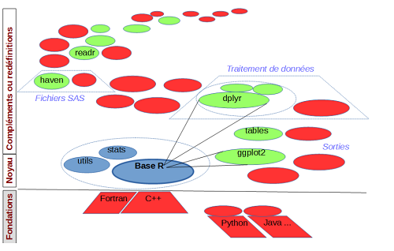
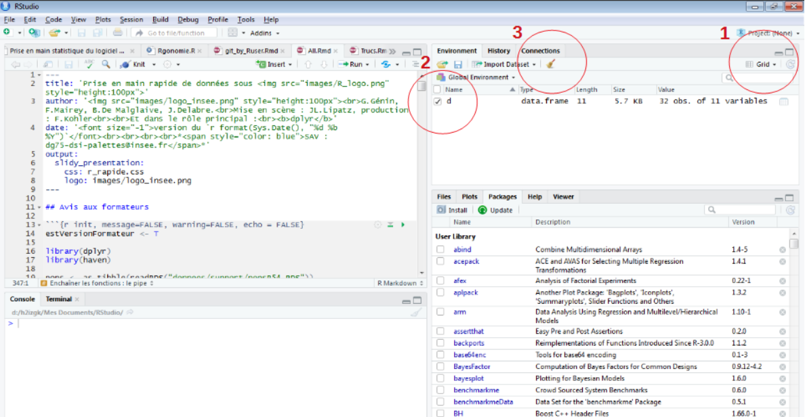
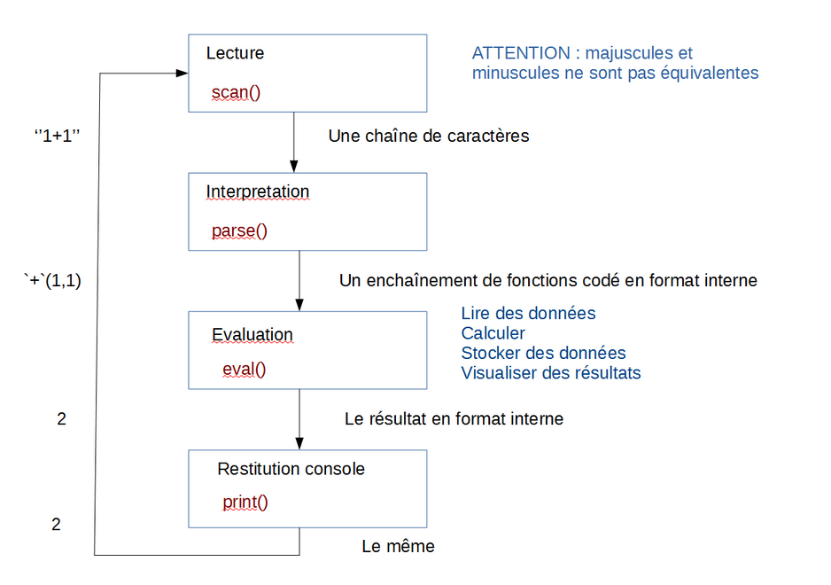

Prise en main rapide de données sous

================
Jocelyn Béziau (Insee) et Céline Técher (Dreets)

Version du 04 mai 2022

## Demandez le programme !

<!-- mettre à jour sommaire avec noms/numéros des séquences et n° de diapo-->

| Séquence | Page |                                                           |
|----------|------|-----------------------------------------------------------|
| 1        | 3    | Travailler en R : RStudio, packages, trouver de l’aide    |
| 2        | 13   | Prise en main de données                                  |
| 3        | 21   | Premiers pas sur la table                                 |
| 4        | 29   | Création de variables                                     |
| 5        | 41   | Statistiques simples et pondérées                         |
| 6        | 48   | Statistiques par modalités                                |
| 7        | 60   | Chaînes de caractères                                     |
| 8        | 62   | Dates                                                     |
| 8        | 69   | Fusion de tables                                          |
| 10       | 79   | Import/Export                                             |
| 11       | 83   | Transposition                                             |
| 12       | 89   | Mise en forme des résultats                               |
| 13       | 97   | Graphiques                                                |
| 14       | 122  | Bases de données                                          |
| 15       | 129  | Partager et diffuser ses résultats                        |
| 16       | 132  | Bonnes pratiques, ressources et communautés R dans le SSP |

# Séquence 1 - Travailler en R

## Principes généraux (1/2)

R est un langage de programmation complet

-   scientifique
-   multi-paradigme
-   programmable

## Principes généraux (2/2)

R est constitué d’un noyau constitué d’opérations de base et de
fonctions travaillant généralement en RAM

On peut le complèter par des “packages”, bibliothèques de fonctions à
charger en tant que de besoin

-   des domaines d’application variés (stats, graphiques, SGBD, sites
    interactifs, …)
-   complexité, efficacité et documentation hétérogènes
-   grand nombre d’auteurs : pas de logique d’ensemble, recouvrements, …

## Pas seuls dans l’univeRs

Une galaxie de 19000 packages, près de 323000 fonctions, pour :

-   ajouter des fonctionnalités
-   remplacer des parties du noyau par des alternatives plus efficaces
    ou ergonomiques
-   interfacer R avec d’autres langages de programmation



## Travailler avec R : une question de mémoire

En SAS, le mode de travail habituel consiste à **appeler successivement
des procédures**, qui prennent chacune **en entrée des fichiers de
données** pour produire **des fichiers de données en sortie**. Ce qui se
passe entre les deux est paramétré par l’utilisateur mais est
assimilable à une boîte noire.

À l’inverse, R donne un maximum de contrôle sur la façon de traiter les
données, qui sont des objets chargés en mémoire (RAM) et non des
fichiers stockés sur le disque.

La taille de la mémoire disponible peut donc devenir décisive pour les
traitements.

### À L’Insee, trois environnements peuvent être mobilisés

-   Le poste de travail individuel
-   AUS (accès aux données sécurisées)
-   Le [SSPCloud](https://www.sspcloud.fr/)

## L’interface de base : RGui

Quoique minimaliste, cette interface permet d’utiliser toute la
puissance du langage R


## L’environnement de développement : Rstudio

Cette interface facilite la vie du statisticien et du développeur C’est
dans cet environnement que nous allons principalement travailler


## Prise en main de RStudio

Utiliser la console pour obtenir le résultat de 6 fois 9

Ouvrir une nouvelle fenêtre de script (*File \> New File \> R script* ou
*CTRL + maj + N*) et y soumettre le même calcul (saisir le code, puis le
sélectionner et cliquer sur le bouton *Run*)

## L’environnement : tout ce qui existe est un objet

Supprimer des objets de l’environnement



## L’invite de commandes : tout ce qui se produit est un appel de fonction



# Séquence 2 - Prise en main de données

## Charger un package

On peut utiliser la fonction `import()` du package **rio** pour
récupérer des données dans R

L’utilisation d’un package nécessite deux étapes :

-   **l’installation** du package depuis un dépôt (CRAN ou mirroir
    interne Insee) vers le disque dur. Une seule fois par package (hors
    upgrade) et par version de R

``` r
install.packages("rio")
```

-   **le chargement en mémoire**, pour indiquer à R que l’on a besoin
    des fonctions de ce package. À chaque session R

``` r
library(rio)
```

Pour installer et charger en mémoire TOUS les packages utilisés dans
cette formation :

``` r
liste_packages_formation <- c("gtools", "readODS", "tidyverse", "rio", "skimr",
                 "tidymodels", "ggformula", "plotly", "DT", "questionr",
                 "RPostgres", "tables", "Hmisc", "RSQLite", "zoo", "ggformula")
# install.packages(liste_packages_formation)
sapply(liste_packages_formation, FUN = require, character.only = TRUE)
```

## Lire un fichier avec le package rio

Chaque type de fichier possède ses spécificités, et possède en général
un package ou une fonction dédiée pour son import dans R. Le package
**rio** encapsule ces différentes fonctions pour n’avoir à appeler
qu’une unique fonction “couteau-suisse” (qui appelle ensuite la fonction
ad hoc selon le type de fichier en entrée)

``` r
library(rio)
p <- import("poplegale_6815.RDS")
p <- import("poplegale_6815.csv")
p <- import("poplegale_6815.sas7bdat")
```

Pour un import plus fin (numéro d’une feuille excel, colonnes à lire
dans une table SAS, …) ou en cas de problème, on peut toujours appeler
directement la fonction utilisée par `import()` et lui passer des
arguments supplémentaires.

Attention à charger le package en mémoire, sinon les fonctions associées
sont inutilisables et produisent une erreur de la forme :

    ## impossible de trouver la fonction "import"

## Notion de fonction

Dans R, **tout ce qui existe est un objet** et **tout ce qui se produit
est un appel de fonction**.

Une fonction est donc un objet qui :

-   réalise une tâche prédéfinie
-   se base sur des informations fournies en entrée (e.g. pour
    `import()`, le nom du fichier à charger), appelées **arguments** ou
    paramètres de la fonction
-   produit un **résultat** en sortie (e.g. pour `import()`, un objet R
    contenant les données du fichier importé)

On peut affecter une fonction à un autre objet pour créer des alias :

``` r
lire <- import
lire("donnees/support/popsR54.RDS")
```

ou définir de nouvelles fonctions :

``` r
lire <- function(x) import(x, setclass = "tibble")
```

## Les paramètres d’une fonction

-   sont définis par le programmeur de la fonction et ne sont pas
    forcément tous à alimenter lors de l’appel (par exemple la fonction
    `import` a été construite avec un nombre variable de paramètres
    alors qu’on n’en a utilisé qu’un seul). Le comportement de la
    fonction s’adapte à ce qui est effectivement passé soit en testant
    si le paramètre a été alimenté, soit en utilisant des valeurs par
    défaut.
-   ont systématiquement un nom qu’on peut ou pas utiliser en
    fournissant dans ce dernier cas les arguments dans l’ordre attendu
    par la fonction (comme pour les macros de SAS).<br> R admet en outre
    que les noms fournis soient des abréviations non ambiguës des noms
    exacts. Les écritures suivantes sont équivalentes :

``` r
help("import") 
help(topic="import")     # (facultatif) Le premier paramètre s'appelle 'topic'
```

Ainsi que :

``` r
help(package="rio")      # (obligatoire) 'package' n'est pas le premier paramètre 
help(p="rio") 
```

Des formations sont consacrées à la construction de fonctions dans R,
mais dépassent le cadre de la prise en main.

## Arguments d’une fonction

**Tous les arguments d’une fonction** possèdent un nom, défini par le
programmeur de la fonction, et sont documentés dans l’aide de la
fonction

**Certains arguments d’une fonction** peuvent être facultatifs (s’ils
possèdent une valeur par défaut)

Lors de l’appel de la fonction, le nom des arguments peut être omis
s’ils sont listés exactement dans le bon ordre (comme pour les macros de
SAS). On peut également utiliser des noms abrégés s’ils ne sont pas
ambigus pour la fonction.

## Obtenir de l’aide sur une fonction ou un package

La fonction `help()` affiche l’aide en ligne pour une fonction (si le
package la contenant est chargé en mémoire) ou un package (s’il est
installé)

On peut utiliser `?` suivi du nom de la fonction pour afficher l’aide
correspondante, ou `??` suivi d’un mot-clef pour rechercher les pages
d’aide le contenant

``` r
help("import") 
help(package = "rio")
?import
??SAS
```

## Ne pas confondre ‘=’ et ‘\<-’

Les fonctions peuvent être appelées en cascade

``` r
round(mean(1:10))
```

    ## [1] 6

L’assignation (`<-`) est également une fonction. Son appel peut donc
être inclus dans n’importe quel appel de fonction

``` r
df <- import(file <- file.choose())
df <- import(file = file.choose())
```

Ces deux lignes **ne sont pas tout à fait équivalentes** : dans le
premier cas, on crée en plus un objet `file` contenant le chemin menant
au fichier sélectionné. Cela peut être utile pour éviter de refaire la
recherche du fichier ultérieurement

# Séquence 3 - Premiers pas sur la table

## Premières observations sur la table de données

### Dans les fenêtres de RStudio

-   L’objet `tab_naissances` apparaît dans le panneau en haut à droite
-   Le bouton bleu en forme de flèche affiche la liste des variables
    composant cet objet
-   Cliquer sur le nom de la table l’ouvre dans le panneau en haut à
    gauche (cette opération peut être chronophage selon le nombre de
    lignes et de colonnes de l’objet)

### En ligne de commande

``` r
ls() # liste des objets en mémoire
str(tab_naissances) # liste des variables composant l'objet tab_naissances
View(tab_naissances) # affiche l'objet dans le panneau en haut à gauche
head(tab_naissances, 5) # les 5 premières lignes de la table
tail(tab_naissances, 1) # la dernière ligne de la table
```

## Enchaîner les fonctions : le pipe

Le résultat (sortie) d’une fonction peut être utilisé en argument
(entrée) d’une autre fonction. Dans la syntaxe R de base, cet
enchaînement se présente sous une forme logique mais peu lisible pour
décrire l’enchaînement chronologique des opérations :

`digerer(manger(cuisiner(recette_tajine)))`

L’opérateur `%>%` (pipe), introduit par le package **magrittr** et
repris par **dplyr**, facilite la lecture de cet enchaînement
d’opérations :

``` r
library(dplyr)
recette_tajine %>% 
    cuisiner() %>% # les parenthèses sont optionnelles
    manger() %>% 
    digerer()
```

Les commandes suivantes sont équivalentes :

``` r
tab_naissances %>% head %>% tail(1)
tab_naissances %>% head() %>% tail(1)

# écriture "R de base"
tail(head(tab_naissances), 1)

# écriture "hybride", pour les gens à l'esprit embrouillé
tail(tab_naissances %>% head(), 1)
head(tab_naissances) %>% tail(1)
```

## Sélectionner des colonnes : `select()`

Une première syntaxe, similaire à SQL, permet de conserver une liste de
colonnes de la table

``` r
tab_naissances %>% select(sexe, jumeau, agemere) %>% head()
```

    ##   sexe jumeau agemere
    ## 1    2      0      34
    ## 2    1      0      29
    ## 3    2      0      33
    ## 4    1      0      28
    ## 5    1      0      35
    ## 6    1      0      33

Remarque : chaque étape de cet enchaînement crée une nouvelle table,
mais à moins d’assigner celle-ci à un objet, elle n’est pas réutilisable
par la suite.

## Lister les modalités d’une colonne : `distinct()`

La fonction `distinct()` retourne une table sans doublons. Elle peut
être utile pour récupérer l’ensemble des modalités observées pour une
variable passée en argument

``` r
# toutes les modalités prises par la variable csm (PCS de la mère)
tab_naissances %>% distinct(csm) %>% head(5)
```

    ##   csm
    ## 1  46
    ## 2  43
    ## 3  52
    ## 4  47
    ## 5  99

C’est l’équivalent de l’instruction SQL :

``` sql
SELECT DISTINCT csm FROM tab_naissances
```

Sans argument, la fonction `distinct()` renvoie une table purgée des
lignes en double

``` r
tab_naissances %>% distinct() %>% head(5)
```

    ##   comnais depnais regnais sexe agemere csm indnatm amar jumeau jsemaine
    ## 1   01004      01      84    2      34  46       1 2015      0   samedi
    ## 2   01004      01      84    1      29  43       1 0000      0    jeudi
    ## 3   01004      01      84    2      33  43       1 2010      0    jeudi
    ## 4   01004      01      84    1      28  46       1 0000      0   samedi
    ## 5   01004      01      84    1      35  52       1 2006      0 vendredi

C’est l’équivalent de l’instruction SQL :

``` sql
SELECT DISTINCT * FROM tab_naissances
```

## Le point sur les guillemets

On ne met rien autour de notre paramètre lorsqu’on s’intéresse au
*contenu* de celui-ci, à ce qui se cache derrière ce symbole (une
fonction, une table, …)

Lorsqu’on ne veut pas que notre paramètre soit interprété comme un objet
R, il faut l’encadrer par des quotes (simples : `'chaîne_de_caractères'`
ou doubles : `"chaîne_de_caractères"`)

``` r
import("NAIS06.sas7bdat")
```

``` r
import(NAIS06.sas7bdat) 
```

    ## objet 'NAIS06.sas7bdat' introuvable

Les quotes sont parfois optionnelles : par exemple, le comportement des
fonctions `help()` et `library()` reste le même que l’on mette des
quotes ou non

Il existe par ailleurs des exceptions (évaluation non standard : NSE),
où il **ne faut pas** mettre de quotes pour obtenir le bon résultat. Les
fonctions du package **dplyr** en sont un bon exemple : les noms de
colonnes doivent être laissés sans quotes. D’une certaine façon,
**dplyr** considère que c’est le contenu de la colonne qui nous
intéresse

## Exercice

1)  Afficher le contenu de la 11ème observation de *tab_naissances*

2)  Quel est le contenu de la variable *amar* de cette 11ème
    observation?

3)  Quelles sont les trois premières modalités différentes rencontrées
    pour la variable *agemere*, les trois dernières?

## Solution

``` r
# 1
tab_naissances %>% head(11) %>% tail(1)
```

    ##    comnais depnais regnais sexe agemere csm indnatm amar jumeau jsemaine
    ## 11   01004      01      84    2      31  42       1 2014      0    jeudi

``` r
# 2
tab_naissances %>% head(11) %>% tail(1) %>% select(amar)
```

    ##    amar
    ## 11 2014

``` r
# 3
tab_naissances %>% distinct(agemere) %>% head(3)
```

    ##   agemere
    ## 1      34
    ## 2      29
    ## 3      33

``` r
tab_naissances %>% distinct(agemere) %>% tail(3)
```

    ##    agemere
    ## 44      58
    ## 45      57
    ## 46      56

# Séquence 4 - Création de variables

## Modifier un objet de R, récupérer le dernier résultat

<span style="color: red">En règle quasi générale, **il est impossible de
modifier un objet de R**.</span>

Fonctionnellement, si on veut faire une modification à une table
associée à un symbole `<symbole>` donné :

-   on construit une copie modifiée de la table
-   on associe la copie modifiée au symbole `<symbole>`
-   la précédente table associée au symbole `<symbole>` est alors perdue
    parce que plus référençable (sauf si on l’avait associée à un
    deuxième symbole).

En pratique, c’est R qui se charge de minimiser le nombre de réelles
copies et de supprimer de la mémoire les objets “perdus” (non
référençables).

Par exemple, pour trier sur la région de naissance *regnais*, on
utilisera la fonction `arrange()` :

``` r
tab_naissances %>% arrange(regnais)
```

A la sortie il y a le résultat, une table triée, qui est juste affiché
mais aussi la table originale, non triée, qui est toujours associée au
symbole *tab_naissances*. Sur le moment, et en interactif seulement, on
peut récupérer son oubli en utilisant la variable spéciale `.Last.value`
qui contient le dernier résultat d’évaluation, donc la table triée :

``` r
tab_naissances <- .Last.value
```

Mais le mieux est bien sûr de le faire en une seule fois, selon l’une
des syntaxes :

``` r
tab_naissances <- tab_naissances %>% arrange(regnais)
tab_naissances %>% arrange(regnais) -> tab_naissances
```

## Ajouter, modifier une colonne : `mutate()`

L’indicateur de naissance était en format texte. Pour faire des calculs,
il nous faut le convertir en numérique dans une nouvelle colonne. La
fonction `mutate` permet de créer une nouvelle colonne à partir d’une
formule de calcul arbitrairement compliquée pouvant mobiliser les autres
colonnes de la table.

``` r
tab_naissances %>% as_tibble() -> tab_naissances # Changement de type pour un affichage enrichi
tab_naissances %>%  mutate(jumeau_ = as.numeric(jumeau)) %>% head(1)
```

    ## # A tibble: 1 × 11
    ##   comnais depnais regnais sexe  agemere csm   indnatm amar  jumeau jsemaine jumeau_
    ##   <chr>   <chr>   <chr>   <chr>   <dbl> <chr> <chr>   <chr> <chr>  <chr>      <dbl>
    ## 1 01004   01      84      2          34 46    1       2015  0      samedi         0

Ou en réutilisant le même nom (c’est bien une nouvelle variable, elle
n’a pas le même type) :

``` r
tab_naissances %>%  mutate(jumeau2 = jumeau) %>% mutate(jumeau = as.numeric(jumeau2)) %>% head(1) 
```

    ## # A tibble: 1 × 11
    ##   comnais depnais regnais sexe  agemere csm   indnatm amar  jumeau jsemaine jumeau2
    ##   <chr>   <chr>   <chr>   <chr>   <dbl> <chr> <chr>   <chr>  <dbl> <chr>    <chr>  
    ## 1 01004   01      84      2          34 46    1       2015       0 samedi   0

REMARQUE : La syntaxe ci-dessous est également valide mais son
comportement est différent quand on accède à des bases de données, elle
est donc à proscrire.

``` r
tab_naissances %>%  mutate(jumeau2 = jumeau, jumeau = as.numeric(jumeau2))
```

## Les types de données en R

Les conversions vers un type de donnée `<type>` se font systématiquement
avec une fonction qui se nomme `as.<type>()` et peut se tester avec une
fonction `is.<type>()`. Il existe potentiellement un nombre infini de
types de données car on peut en définir de nouveaux. Les plus fréquents
sont :

| nom R         | Exemple     |                                           |
|---------------|-------------|-------------------------------------------|
| **double**    | 42          | virgule flottante double précision        |
| **integer**   | 42L         | entier                                    |
| **numeric**   |             | un des deux cas précédents                |
| **character** | “42”        | chaîne de caractères de longueur variable |
| **logical**   | TRUE, FALSE | booléen                                   |

…ainsi que **data.frame** : une table de données (comme
*tab_naissances*) et **tibble** qui en est un sous-type.

## Recoder des variables : `ifelse()`

Syntaxe :

-   `ifelse(condition)`,
-   `valeur_si_vrai`,
-   `valeur_si_faux)`

``` r
tab_naissances %>%  mutate(sexe_ = ifelse(sexe == '1', "garçon", "fille"))
```

    ## # A tibble: 792,868 × 11
    ##    comnais depnais regnais sexe  agemere csm   indnatm amar  jumeau jsemaine sexe_ 
    ##    <chr>   <chr>   <chr>   <chr>   <dbl> <chr> <chr>   <chr> <chr>  <chr>    <chr> 
    ##  1 01004   01      84      2          34 46    1       2015  0      samedi   fille 
    ##  2 01004   01      84      1          29 43    1       0000  0      jeudi    garçon
    ##  3 01004   01      84      2          33 43    1       2010  0      jeudi    fille 
    ##  4 01004   01      84      1          28 46    1       0000  0      samedi   garçon
    ##  5 01004   01      84      1          35 52    1       2006  0      vendredi garçon
    ##  6 01004   01      84      1          33 47    1       2014  0      vendredi garçon
    ##  7 01004   01      84      1          25 99    1       0000  0      mercredi garçon
    ##  8 01004   01      84      1          23 46    1       0000  0      vendredi garçon
    ##  9 01004   01      84      2          27 47    1       2012  0      lundi    fille 
    ## 10 01004   01      84      2          27 46    1       0000  0      dimanche fille 
    ## # … with 792,858 more rows

## Travailler avec des données manquantes

Les valeurs manquantes sont le principal point d’incompatibilité avec
SAS et leur traitement nécessite de redoubler d’attention quand on
convertit un programme car le fonctionnement est radicalement différent
en R :

-   Chaque type dispose de sa propre valeur manquante `NA` (pour “Not
    Available”). Ceci est vrai pour les nombres mais aussi pour les
    chaînes de caractères (vide n’est pas manquant), les booléens (vrai,
    faux et “je ne sais pas”), et le reste…

-   Sur les nombres, il ne faut pas confondre `NA` et `NaN` (pour “Not A
    Number”). Le résultat d’un calcul impossible (comme une division par
    zéro), ne produit pas une valeur manquante mais bien un résultat
    numérique de valeur `NaN`. De plus, R connaît les nombres complexes.

-   Toute opération impliquant une valeur manquante produit une valeur
    manquante, en particulier les comparaisons : <span
    style="color: red"> `NA` n’est ni vrai, ni faux (il est faux en
    SAS). `NA` n’est pas ordonné (il est plus petit que tout en
    SAS)</span>

Dans les calculs statistiques (par exemple avec les fonctions appelées
par `summarise`), il y a généralement un argument supplémentaire `na.rm`
(pour “remove”) qui permet de ne pas tenir compte des valeurs
manquantes, mais son positionnement par défaut est souvent à “faux”
(`FALSE`).

-   Le test d’égalité avec valeur manquante (`... == NA`) renvoie
    systématiquement “valeur manquante”, y compris vis-à-vis de “valeur
    manquante”. La seule façon de faire le test est de recourir à la
    fonction `is.na()`.

## Travailler avec des données manquantes : `is.na()`

Exemple de recodage d’une valeur manquante (dans l’exemple précédent, si
*sexe* était à valeur manquante, la comparaison avec ‘1’ ne donne ni
vrai, ni faux, et donc on ne prend aucune des deux branches du `ifelse`)
:

``` r
tab_naissances %>% 
  mutate(sexe_ = ifelse(is.na(sexe_),"inconnu",sexe_))
```

**dplyr** propose aussi :

``` r
tab_naissances %>% 
  mutate(sexe_ = coalesce(sexe_, "inconnu"))
```

## Recoder des variables : `case_when()`

Syntaxe :

`case_when(condition1 ~ valeur1`, `condition2 ~ valeur2`, `...`,
`conditionN ~ valeur2`, `TRUE       ~ valeur_par_défaut)`

Les conditions sont explorées successivement jusqu’à ce qu’une d’entre
elles donne `TRUE`, elles ne sont donc pas nécessairement exclusives
l’une de l’autre. La dernière ligne “voiture balai” (qui n’est pas
obligatoire) exploite cette fonctionnalité.

Décodons la variable `sexe` :

``` r
tab_naissances %>% 
  mutate(sexe_ = case_when(sexe == '1' ~ "garçon",
                           sexe == '2' ~ "fille",
                           is.na(sexe) ~ "inconnu"))
```

## Décoder, regrouper avec case_when()

On a 32 modalités de catégories socioprofessionnelles (csm et csp), ce
qui constitue un niveau trop fin, on souhaite alors les regrouper en un
nombre plus réduit.

``` r
# liste des modalités
tab_naissances %>% distinct(csm)

# regroupement
tab_naissances %>% mutate(
    csm_ = case_when(                                         # On crée une nouvelle colone 'csm_',
        substr(csm, 1, 1) == '1' ~ "agriculteurs",              # en regardant le contenu de la colonne 'csm' :
        substr(csm, 1, 1) == '2' ~ "chefs d'entreprise",        # la sous-chaine allant du caractère no 1 au caractère no 1
        substr(csm, 1, 1) == '3' ~ "cadres",
        substr(csm, 1, 1) == '4' ~ "professions intermédiaires",
        substr(csm, 1, 1) == '5' ~ "employés",
        substr(csm, 1, 1) == '6' ~ "ouvriers",                  # les modalités 1 à 6 sont recodées explicitement
        activp            <= '2' ~ "chômeurs ou inactifs",      # pour les autres cas on regarde si 'activp' vaut 2
        TRUE                     ~ "indéterminé"))              # et si tout échoue...
```

## Exercice

1)  Créer une nouvelle colonne “jweekend\_” booléenne qui donne `TRUE`
    si *jsemaine* tombe un weekend et `FALSE` dans le cas contraire. On
    pourra utiliser `ifelse()`, `case_when()`… ou aucun des deux!

2)  Discrétiser l’âge de la mère : moins de 18, \[18,25\[ , \[25,35\[ ,
    \[35,45\[ , 45 et +

## Solution de l’exercice (A)

### Avec case_when et l’appartenance à une liste

``` r
tab_naissances %>% 
  mutate(
    jweekend_ = case_when(jsemaine %in% c("samedi", "dimanche") ~ TRUE,
                           TRUE                                 ~ FALSE
                          )
  )
```

    ## # A tibble: 792,868 × 11
    ##    comnais depnais regnais sexe  agemere csm   indnatm amar  jumeau jsemaine jweekend_
    ##    <chr>   <chr>   <chr>   <chr>   <dbl> <chr> <chr>   <chr> <chr>  <chr>    <lgl>    
    ##  1 01004   01      84      2          34 46    1       2015  0      samedi   TRUE     
    ##  2 01004   01      84      1          29 43    1       0000  0      jeudi    FALSE    
    ##  3 01004   01      84      2          33 43    1       2010  0      jeudi    FALSE    
    ##  4 01004   01      84      1          28 46    1       0000  0      samedi   TRUE     
    ##  5 01004   01      84      1          35 52    1       2006  0      vendredi FALSE    
    ##  6 01004   01      84      1          33 47    1       2014  0      vendredi FALSE    
    ##  7 01004   01      84      1          25 99    1       0000  0      mercredi FALSE    
    ##  8 01004   01      84      1          23 46    1       0000  0      vendredi FALSE    
    ##  9 01004   01      84      2          27 47    1       2012  0      lundi    FALSE    
    ## 10 01004   01      84      2          27 46    1       0000  0      dimanche TRUE     
    ## # … with 792,858 more rows

`c()` est une fonction de base qui construit un objet fondamental de R :
un **vecteur**, si fondamental qu’en fait **il n’y a pas de données
scalaires en R**, et `sexe == "1"` aurait pu s’écrire `sexe %in% "1"`.
En R, il faut toujours commencer par raisonner en termes d’opérations
sur des ensembles.

## Solution de l’exercice (B)

### Avec un calcul booléen

``` r
tab_naissances %>% 
  mutate(jweekend_ = (jsemaine %in% c("samedi", "dimanche")))
```

    ## # A tibble: 792,868 × 11
    ##    comnais depnais regnais sexe  agemere csm   indnatm amar  jumeau jsemaine jweekend_
    ##    <chr>   <chr>   <chr>   <chr>   <dbl> <chr> <chr>   <chr> <chr>  <chr>    <lgl>    
    ##  1 01004   01      84      2          34 46    1       2015  0      samedi   TRUE     
    ##  2 01004   01      84      1          29 43    1       0000  0      jeudi    FALSE    
    ##  3 01004   01      84      2          33 43    1       2010  0      jeudi    FALSE    
    ##  4 01004   01      84      1          28 46    1       0000  0      samedi   TRUE     
    ##  5 01004   01      84      1          35 52    1       2006  0      vendredi FALSE    
    ##  6 01004   01      84      1          33 47    1       2014  0      vendredi FALSE    
    ##  7 01004   01      84      1          25 99    1       0000  0      mercredi FALSE    
    ##  8 01004   01      84      1          23 46    1       0000  0      vendredi FALSE    
    ##  9 01004   01      84      2          27 47    1       2012  0      lundi    FALSE    
    ## 10 01004   01      84      2          27 46    1       0000  0      dimanche TRUE     
    ## # … with 792,858 more rows

``` r
tab_naissances %>%
    mutate(age_ = case_when(agemere < 18 ~ 1,
                            agemere < 25 ~ 2,
                            agemere < 35 ~ 3,
                            agemere < 45 ~ 4,
                            TRUE       ~ 5
    ))
```

    ## # A tibble: 792,868 × 11
    ##    comnais depnais regnais sexe  agemere csm   indnatm amar  jumeau jsemaine  age_
    ##    <chr>   <chr>   <chr>   <chr>   <dbl> <chr> <chr>   <chr> <chr>  <chr>    <dbl>
    ##  1 01004   01      84      2          34 46    1       2015  0      samedi       3
    ##  2 01004   01      84      1          29 43    1       0000  0      jeudi        3
    ##  3 01004   01      84      2          33 43    1       2010  0      jeudi        3
    ##  4 01004   01      84      1          28 46    1       0000  0      samedi       3
    ##  5 01004   01      84      1          35 52    1       2006  0      vendredi     4
    ##  6 01004   01      84      1          33 47    1       2014  0      vendredi     3
    ##  7 01004   01      84      1          25 99    1       0000  0      mercredi     3
    ##  8 01004   01      84      1          23 46    1       0000  0      vendredi     2
    ##  9 01004   01      84      2          27 47    1       2012  0      lundi        3
    ## 10 01004   01      84      2          27 46    1       0000  0      dimanche     3
    ## # … with 792,858 more rows

# Séquence 5 - Statistiques simples et pondérées

## Calculer un effectif

Nombre de lignes de la table

``` r
tab_naissances %>%  count()
```

    ## # A tibble: 1 × 1
    ##        n
    ##    <int>
    ## 1 792868

``` r
# ou bien (même résultat) :
tab_naissances %>%  summarise(nombre_de_naissances = n())
```

    ## # A tibble: 1 × 1
    ##   nombre_de_naissances
    ##                  <int>
    ## 1               792868

Total des naissances gémellaires

``` r
tab_naissances %>% summarise(nombre_de_naissances_multiples = sum(jumeau == "1"))
```

    ## # A tibble: 1 × 1
    ##   nombre_de_naissances_multiples
    ##                            <int>
    ## 1                          27537

`summarise()` propose aussi un ensemble de statistiques simples : \*
nombre, somme : `n(), n_distinct(), sum()` \* indicateurs centraux :
`mean(), median()` \* indicateurs de dispersion :
`min(), max(), quantile(), sd(), var()` \* position :
`first(), last(), nth()`

## Calculer plusieurs statistiques à la fois

``` r
tab_naissances %>% 
  summarise(q1_mere      = quantile(agemere, 0.25),
            mediane_mere = quantile(agemere, 0.5),
            q3_mere      = quantile(agemere, 0.75))
```

    ## # A tibble: 1 × 3
    ##   q1_mere mediane_mere q3_mere
    ##     <dbl>        <dbl>   <dbl>
    ## 1      27           31      34

Et les extrêmes :

``` r
tab_naissances %>% 
  summarise(min_mere = min(agemere),
            max_mere = max(agemere))
```

    ## # A tibble: 1 × 2
    ##   min_mere max_mere
    ##      <dbl>    <dbl>
    ## 1       13       58

## Calculer des statistiques pondérées

Les fonctions utilisant des pondérations se trouvent dans le package
**Hmisc**, elles utilisent un argument supplémentaire `w` qui permet de
passer la colonne contenant les pondérations. Il s’agit de :

-   wtd.mean : la moyenne
-   wtd.var : la variance (en déduire l’écart type si besoin)
-   wtd.quantile : un quantile

Jeu d’essai :

    ## Warning: `as.tibble()` was deprecated in tibble 2.0.0.
    ## Please use `as_tibble()` instead.
    ## The signature and semantics have changed, see `?as_tibble`.
    ## This warning is displayed once every 8 hours.
    ## Call `lifecycle::last_lifecycle_warnings()` to see where this warning was generated.

    ## # A tibble: 5 × 2
    ##   poids   age
    ##   <dbl> <dbl>
    ## 1     1    20
    ## 2     1    30
    ## 3     1    40
    ## 4     1    50
    ## 5     3    60

``` r
library(Hmisc)
df %>% summarise(premier_quartile = wtd.quantile(age, w = poids, probs = .25),
                 mediane = wtd.quantile(age, w = poids, probs = .5),
                 moyenne = wtd.mean(age, w = poids)
                 )
```

    ## # A tibble: 1 × 3
    ##   premier_quartile mediane moyenne
    ##              <dbl>   <dbl>   <dbl>
    ## 1               35      50    45.7

## Travailler sur un sous-ensemble de lignes : la fonction `filter()`

La table concerne la France entière. Si nous souhaitons étudier une
région seule, on peut utiliser un filtre (condition).

Par exemple, on souhaite connaître le nombre de naissances en Nouvelle
Aquitaine et de mère française.

``` r
tab_naissances %>% 
  filter(regnais == '75' & indnatm == '1') %>% 
  summarise(nombre_naissances_aquitaine = n())
```

Si on a plusieurs conditions, on les réunit avec les opérateurs logiques
:

& et (<span style="color: green">`and`</span>), \| ou (<span
style="color: green">`or`</span>), ! négation (<span
style="color: green">`not`</span>)

Les opérateurs de comparaison sont :

-   **`==`** (<span style="color: green">`EQ`</span>), **`!=`** (<span
    style="color: green">`NE`</span>)
-   **`> >= < <=`**
-   **`%in%`** est contenu dans une liste (<span
    style="color: green">`in`</span>)

<span style="color: red">Attention à la priorité des opérateurs. Par
exemple `!1+2` renvoie `FAUX` en R, mais `!(1+2)` renvoie `VRAI`</span>

## Exercice

1)  Calculer le nombre de naissances qui remplissent toutes les
    conditions suivantes :

-   la naissance a lieu dans le département d’Ille-et-Vilaine (*depnais*
    == 35)
-   la mère a plus de 40 ans (*agemere* \> 40)
-   la naissance a lieu hors mariage (année de mariage *amar* = “0000”)
-   le bébé est une fille (*sexe* = “2”)

2)  Même chose pour les départements de Loire-Atlantique (44) et du
    Mainte-et-Loire (49)

## Solution de l’exercice

``` r
tab_naissances %>%
  filter((depnais == "35") &
        (agemere > 40) &
        (amar == "0000") &
        (sexe == "2")) %>% count()
```

    ## # A tibble: 1 × 1
    ##       n
    ##   <int>
    ## 1   107

``` r
tab_naissances %>%
  filter(((depnais == "44") | (depnais == "49")) &
        (agemere > 40) &
        (amar == "0000") &
        (sexe == "2")) %>% count()
```

    ## # A tibble: 1 × 1
    ##       n
    ##   <int>
    ## 1   209

# Séquence 6 - Statistiques par modalités

## Regrouper selon une catégorie : `group_by()` (1/2)

Nous avons compté le nombre de naissances en France entière. Maintenant,
nous souhaitons avoir une répartition par région.

On peut simplement indiquer la variable de regroupement en paramètre de
`count()`. Mais cela n’est possible que pour un comptage simple.

``` r
# tout simplement :
tab_naissances %>% count(regnais)

# ou bien :
tab_naissances %>% 
    summarise(nombre_naissances = n())
```

## Regrouper selon une catégorie : `group_by()` (2/2)

-   Lorsqu’on utilise un regroupement, on perd toutes les variables
    détail, ne restent que la ou les variables de regroupement et les
    calculs.

-   Pour faire des statistiques sur modalités croisées, il suffit de
    mettre plusieurs variables de regroupement.

``` r
tab_naissances %>% 
  group_by(regnais, sexe) %>% 
  summarise(nombre_naissances = n())
```

## Entre `filter()` et `summarise()`

Il est possible de filtrer sur une condition impliquant une statistique,
en redescendant le résultat d’un calcul sur un groupe de lignes au
niveau de chacune des lignes. Par exemple pour sélectionner les communes
ayant la plus forte population de leur département :

``` r
p <- import("donnees/support/poplegale_6815.sas7bdat")
p %>% group_by(D) %>% 
    filter(PMUN15 == max(PMUN15))
```

    ## # A tibble: 11 × 12
    ## # Groups:   D [11]
    ##    DC    NCC                    PMUN15 PMUN10 PMUN06 PSDC99 PSDC90 PSDC82 PSDC75 PSDC68 D     REGION
    ##    <chr> <chr>                   <dbl>  <dbl>  <dbl>  <dbl>  <dbl>  <dbl>  <dbl>  <dbl> <chr> <chr> 
    ##  1 06088 Nice                   342522 343304 347060 342738 342439 337085 344481 322442 06    93    
    ##  2 13055 Marseille              861635 850726 839043 798430 800550 874436 908600 889029 13    93    
    ##  3 18033 Bourges                 66071  66381  70828  72480  75609  76432  77300  70814 18    24    
    ##  4 34172 Montpellier            277639 257351 251634 225392 207996 197231 191354 161910 34    91    
    ##  5 75115 Paris 15e Arrondissem… 234994 236715 232949 225362 223940 225596 231301 244080 75    11    
    ##  6 82121 Montauban               59982  56271  53941  51855  51224  50682  48053  45895 82    73    
    ##  7 84007 Avignon                 92130  89683  92454  85935  86939  89132  90786  86096 84    93    
    ##  8 92012 Boulogne-Billancourt   117931 114205 110251 106367 101743 102582 103578 109008 92    11    
    ##  9 93066 Saint-Denis            111103 106785  97875  85832  89988  90829  96132  99268 93    11    
    ## 10 94081 Vitry-sur-Seine         92531  85413  82902  78908  82400  85263  87316  77846 94    11    
    ## 11 95018 Argenteuil             110388 103125 102683  93961  93096  95347 102530  90480 95    11

Question : Pourquoi uniquement 11 départements (la table initiale
contient 98 départements) ?

------------------------------------------------------------------------

<!--Réponse : Le maximum d'un vecteur contenant des valeurs manquantes... est une valeur manquante. Ainsi, tous les départements pour lesquels au moins une commune n'a pas de valeur renseignée pour `PMUN15` ont leur maximum à `NA`. La comparaison entre cette valeur et la population de chaque commune renvoie alors `NA` et non `TRUE`. Ces départements ne sont donc pas inclus dans le résultat de `filter()`.-->

``` r
p %>% group_by(D) %>% 
    summarise(pmax = max(PMUN15)) %>%
    arrange(desc(pmax)) %>% 
    head(15)
```

    ## # A tibble: 15 × 2
    ##    D       pmax
    ##    <chr>  <dbl>
    ##  1 13    861635
    ##  2 06    342522
    ##  3 34    277639
    ##  4 75    234994
    ##  5 92    117931
    ##  6 93    111103
    ##  7 95    110388
    ##  8 94     92531
    ##  9 84     92130
    ## 10 18     66071
    ## 11 82     59982
    ## 12 01        NA
    ## 13 02        NA
    ## 14 03        NA
    ## 15 04        NA

Pour obtenir le maximum parmi les valeurs renseignées, on peut utiliser
l’argument `na.rm = TRUE` dans la fonction `max()` :

``` r
p %>% group_by(D) %>% 
    summarise(pmax = max(PMUN15, na.rm = TRUE)) %>%
    arrange(desc(pmax)) %>% 
    head(15)
```

    ## # A tibble: 15 × 2
    ##    D       pmax
    ##    <chr>  <dbl>
    ##  1 13    861635
    ##  2 69    513275
    ##  3 31    471941
    ##  4 06    342522
    ##  5 44    303382
    ##  6 34    277639
    ##  7 67    277270
    ##  8 33    249712
    ##  9 75    234994
    ## 10 59    232741
    ## 11 35    215366
    ## 12 51    184076
    ## 13 76    172366
    ## 14 42    171057
    ## 15 83    167479

## Entre `mutate()` et `summarise()`

Il est possible de créer une nouvelle colonne impliquant une
statistique, en redescendant le résultat d’un calcul fait sur un groupe
de lignes au niveau de chacune des lignes du groupe :

``` r
p %>% group_by(D) %>%
    mutate (PMUN15max = max(PMUN15, na.rm = TRUE))
```

    ## # A tibble: 38,219 × 13
    ## # Groups:   D [98]
    ##    DC    NCC          PMUN15 PMUN10 PMUN06 PSDC99 PSDC90 PSDC82 PSDC75 PSDC68 D     REGION PMUN15max
    ##    <chr> <chr>         <dbl>  <dbl>  <dbl>  <dbl>  <dbl>  <dbl>  <dbl>  <dbl> <chr> <chr>      <dbl>
    ##  1 01001 L' Abergeme…    767    784    811    728    579    477    368    347 01    82         40819
    ##  2 01002 L' Abergeme…    241    221    198    168    159    136    106     88 01    82         40819
    ##  3 01004 Ambérieu-e…  14127  13835  12709  11436  10455   9737   9550   8949 01    82         40819
    ##  4 01005 Ambérieux-…   1619   1616   1436   1408   1156    848    756    627 01    82         40819
    ##  5 01006 Ambléon        109    116    120     86     76     65     82    108 01    82         40819
    ##  6 01007 Ambronay       2615   2362   2241   2146   1996   1862   1270   1193 01    82         40819
    ##  7 01008 Ambutrix        747    729    641    586    595    405    353    327 01    82         40819
    ##  8 01009 Andert-et-C…    342    340    319    275    262    276    184    159 01    82         40819
    ##  9 01010 Anglefort      1133    994    900    769    687    714    697    528 01    82         40819
    ## 10 01011 Apremont        390    363    333    329    341    279    200    148 01    82         40819
    ## # … with 38,209 more rows

## Tris : `arrange()`

Lorsqu’on utilise un regroupement, le résultat est trié en majeur selon
ce regroupement.

Si on souhaite effectuer un autre tri, on utilise la fonction
`arrange()`.

``` r
tab_naissances %>% 
    group_by(regnais) %>%                     # Par région...
    summarise(nombre_naissances = n()) %>%    # on calcule le nombre de naissances
    arrange(nombre_naissances)                # et on trie le tout par ordre croissant des naissances
```

## Accéder à une ligne particulière d’un groupe : `row_number()`

A l’intérieur de chaque groupe, le numéro d’ordre de la
ligne/observation est accessible par la fonction `row_number` de
**dplyr** :

``` r
poplegale_6815 %>%                     
    group_by(D) %>%                           # Par département
    arrange(desc(PMUN15)) %>%                 #   on range par ordre décroissant, au sein de chaque département
    filter(row_number() ==  1)                   # on ne garde que la première commune
```

## La fonction `ungroup()`

Le regroupement de modalités par `group_by()` produit une table qui a en
attribut la liste des variables de regroupement. Lorsqu’il y en a
plusieurs, la fonction `summarise()` n’enlève que la dernière variable :
la table produite reste groupée sur les premières variables.

``` r
tab_naissances %>%                     
  group_by(regnais, depnais) %>%            # Par département (et région pour garder celle ci)
  summarise(nombre_naissances = n()) -> a   # on calcule le nombre de naissances
                                            # et on sauve dans 'a'
a %>%
  filter(nombre_naissances == max(nombre_naissances))   
```

Et on récupère le département ayant le plus grand nombre de naissances,
dans chaque région.

Pour supprimer l’ensemble des regroupements, utiliser `ungroup()`. Pour
le département qui a le plus de naissances, France entière :

``` r
a %>%                     
  ungroup() %>%                               
  filter(nombre_naissances == max(nombre_naissances))   
```

## Exercice

1)  Calculer le nombre de naissances par département. Quel est le
    département qui a le plus de naissances?

2)  Calculer le nombre de naissances par commune. Par département,
    quelles sont les communes qui ont le plus de naissances ?

3)  Calculer le nombre de naissances par jour de la semaine. En recodant
    le jour de la semaine, réordonner les résultats (lundi le 1er, mardi
    le 2ème…)

## Solution de l’exercice (1/2)

``` r
tab_naissances %>%
    group_by(depnais) %>% 
    summarise(n = n()) %>%
    filter(n == max(n))
```

    ## # A tibble: 1 × 2
    ##   depnais     n
    ##   <chr>   <int>
    ## 1 75      42832

``` r
tab_naissances %>% 
    group_by(depnais, comnais) %>%
    summarise(n = n()) %>%
    filter(n == max(n))
```

    ## `summarise()` has grouped output by 'depnais'. You can override using the `.groups` argument.

    ## # A tibble: 103 × 3
    ## # Groups:   depnais [103]
    ##    depnais comnais     n
    ##    <chr>   <chr>   <int>
    ##  1 01      01451    2188
    ##  2 02      02691    1863
    ##  3 03      03185    1115
    ##  4 04      04112     741
    ##  5 05      05061    1039
    ##  6 06      06088    7240
    ##  7 07      07102    1022
    ##  8 08      08105    1506
    ##  9 09      09264     978
    ## 10 10      10387    2750
    ## # … with 93 more rows

## Solution de l’exercice (2/2)

``` r
tab_naissances %>% 
    mutate(j = case_when(jsemaine == "lundi"    ~ 1,
                         jsemaine == "mardi"    ~ 2,
                         jsemaine == "mercredi" ~ 3,
                         jsemaine == "jeudi"    ~ 4,
                         jsemaine == "vendredi" ~ 5,
                         jsemaine == "samedi"   ~ 6,
                         jsemaine == "dimanche" ~ 7)) %>%
    group_by(j, jsemaine) %>% 
    summarise(n = n())
```

    ## `summarise()` has grouped output by 'j'. You can override using the `.groups` argument.

    ## # A tibble: 7 × 3
    ## # Groups:   j [7]
    ##       j jsemaine      n
    ##   <dbl> <chr>     <int>
    ## 1     1 lundi    114800
    ## 2     2 mardi    120387
    ## 3     3 mercredi 118670
    ## 4     4 jeudi    117888
    ## 5     5 vendredi 120150
    ## 6     6 samedi   103816
    ## 7     7 dimanche  97157

# Séquence 7 - Chaînes de caractères

## Aide-mémoire

| **Cas d’utilisation**            | **Fonction**                                            |
|----------------------------------|---------------------------------------------------------|
| Concaténation                    | paste0(str<sub>1</sub>,str<sub>2</sub>,str<sub>3</sub>) |
| Nombre de caractères             | str_length(str)                                         |
| Extraction d’une sous-chaîne     | str_sub(str, pos, pos+len-1)                            |
| Extraction de la fin             | str_sub(str, pos)                                       |
| Remplacement de la fin           | str_sub(var, pos) \<- new_chaine                        |
| Réduction des espaces            | str_squish(str)                                         |
| Elimination des espaces en fin   | str_trim(str, side = “right”)                           |
| Elimination des espaces en debut | str_trim(str, side = “left”)                            |
| Mise en majuscules               | str_to_upper(str)                                       |
| Mise en minuscules               | str_to_lower(str)                                       |
| Remplacement de caractères       | str_replace_all(old, new, str)                          |
| Recherche d’un motif             | str_locate(str,str<sub>2</sub>)                         |
| ”                                | str_detect(str,str<sub>2</sub>)                         |
| ”                                | str_extract(str,str<sub>2</sub>)                        |
| Retournement                     | stri_reverse(str)                                       |
| Distance                         | stringdist(str,str<sub>2</sub>)                         |

# Séquence 8 - Dates

## Problématique

Utiliser R pour travailler sur des données datées (annuelles,
trimestrielles, journalières, …) peut se faire de différentes façons,
l’une d’entre elles est le package **lubridate**

``` r
library(lubridate)
```

Notre jeu d’exemple : ce fichier fictif d’emploi par département

``` r
fichier_date <- readRDS("donnees/support/fichier_date.RDS")
fichier_date
```

    ## # A tibble: 2,800 × 3
    ##    Dept     Date_string Effectif_random
    ##    <chr>    <chr>                 <dbl>
    ##  1 01 - AIN 2010-12-31          188661.
    ##  2 01 - AIN 2011-03-31          189235.
    ##  3 01 - AIN 2011-06-30          191391.
    ##  4 01 - AIN 2011-09-30          190310.
    ##  5 01 - AIN 2011-12-31          189673.
    ##  6 01 - AIN 2012-03-31          189445.
    ##  7 01 - AIN 2012-06-30          191931.
    ##  8 01 - AIN 2012-09-30          190721.
    ##  9 01 - AIN 2012-12-31          189256.
    ## 10 01 - AIN 2013-03-31          189649.
    ## # … with 2,790 more rows

## Transformer une chaîne de caractères en date

Pour convertir en Date une chaîne de caractères, on peut essayer
`as_date()`, mais si le format de la chaîne de caractères n’est pas
standard, elle peut ne pas être reconnue. Des fonctions ad hoc comme
`ydm()` et `ymd()` existent pour traduire les formats (année/jour/mois)
et (année/mois/jour) respectivement

``` r
fichier_date <- fichier_date %>% mutate(Date = ymd(Date_string))
fichier_date %>% head
```

    ## # A tibble: 6 × 4
    ##   Dept     Date_string Effectif_random Date      
    ##   <chr>    <chr>                 <dbl> <date>    
    ## 1 01 - AIN 2010-12-31          188661. 2010-12-31
    ## 2 01 - AIN 2011-03-31          189235. 2011-03-31
    ## 3 01 - AIN 2011-06-30          191391. 2011-06-30
    ## 4 01 - AIN 2011-09-30          190310. 2011-09-30
    ## 5 01 - AIN 2011-12-31          189673. 2011-12-31
    ## 6 01 - AIN 2012-03-31          189445. 2012-03-31

Selon le format, d’autres commandes existent. Citons en particulier les
deux commandes suivantes.

Si la chaîne de caractères est de la forme “23/02/2022”, on peut
utiliser `dmy()`.

Si la chaîne de caractères est “2020 T3”, pour le troisième trimestre de
2020, on peut utiliser `yq`.

``` r
yq("2020 T3")
```

    ## [1] "2020-07-01"

## Extraire des composants de la date

Exemple :

``` r
fichier_date %>% mutate(
  Annee = year(Date),
  Trimestre = quarter(Date),
  Mois = month(Date),
  Jour = day(Date)
) %>% as.data.frame %>% head
```

    ##       Dept Date_string Effectif_random       Date Annee Trimestre Mois Jour
    ## 1 01 - AIN  2010-12-31        188660.6 2010-12-31  2010         4   12   31
    ## 2 01 - AIN  2011-03-31        189234.8 2011-03-31  2011         1    3   31
    ## 3 01 - AIN  2011-06-30        191390.5 2011-06-30  2011         2    6   30
    ## 4 01 - AIN  2011-09-30        190309.5 2011-09-30  2011         3    9   30
    ## 5 01 - AIN  2011-12-31        189673.2 2011-12-31  2011         4   12   31
    ## 6 01 - AIN  2012-03-31        189444.9 2012-03-31  2012         1    3   31

## Filtrer une plage de dates

``` r
date_debut <- ymd("2011-05-01")
date_fin <- ymd("2013-01-03")
intervalle <- interval(date_debut, date_fin)

fichier_date %>% filter(Date %within% intervalle)
```

    ## # A tibble: 700 × 4
    ##    Dept       Date_string Effectif_random Date      
    ##    <chr>      <chr>                 <dbl> <date>    
    ##  1 01 - AIN   2011-06-30          191391. 2011-06-30
    ##  2 01 - AIN   2011-09-30          190310. 2011-09-30
    ##  3 01 - AIN   2011-12-31          189673. 2011-12-31
    ##  4 01 - AIN   2012-03-31          189445. 2012-03-31
    ##  5 01 - AIN   2012-06-30          191931. 2012-06-30
    ##  6 01 - AIN   2012-09-30          190721. 2012-09-30
    ##  7 01 - AIN   2012-12-31          189256. 2012-12-31
    ##  8 02 - AISNE 2011-06-30          161415. 2011-06-30
    ##  9 02 - AISNE 2011-09-30          159412. 2011-09-30
    ## 10 02 - AISNE 2011-12-31          158003. 2011-12-31
    ## # … with 690 more rows

## Exercice

-   Calculer l’effectif national par trimestre dans `fichier_dates`
-   Calculer ensuite l’évolution trimestrielle de l’emploi

## Solution de l’exercice

``` r
fichier_date <- readRDS("donnees/support/fichier_date.RDS")

fichier_date %>% 
  mutate(Date = ymd(Date_string)) %>%
  mutate(Annee = year(Date),
         Trimestre = quarter(Date)) %>%
  group_by(Annee, Trimestre) %>%
  summarise(Effectif_random = sum(Effectif_random)) %>%
  ungroup() %>%
  # head() # effectif national par trimestre
  arrange(Annee, Trimestre) %>%
  mutate(Evol_trim = 100*(Effectif_random - lag(Effectif_random))/
                             lag(Effectif_random)) %>% 
  head() # évolution relative de l'emploi de trimestre en trimestre
```

    ## `summarise()` has grouped output by 'Annee'. You can override using the `.groups` argument.

    ## # A tibble: 6 × 4
    ##   Annee Trimestre Effectif_random Evol_trim
    ##   <dbl>     <int>           <dbl>     <dbl>
    ## 1  2010         4       24279744.   NA     
    ## 2  2011         1       24286870.    0.0293
    ## 3  2011         2       24681970.    1.63  
    ## 4  2011         3       24353248.   -1.33  
    ## 5  2011         4       24346158.   -0.0291
    ## 6  2012         1       24326123.   -0.0823

# Séquence 9 - Fusion de tables

## Jeux d’exemple

``` r
superheros <- tribble(~nom, ~type, ~sexe, ~editeur,
                      "Magneto",       "mechant",   "homme",            "Marvel",
                      "Storm",        "gentil",   "femme",            "Marvel",
                      "Mystique",       "mechant",   "femme",            "Marvel",
                      "Batman",        "gentil",   "homme",                "DC",
                      "Joker",       "mechant",   "homme",                "DC",
                      "Catwoman",       "mechant",   "femme",                "DC",
                      "Hellboy",        "gentil",   "homme", "Dark Horse Comics")

editeurs <- tribble( ~editeur, ~annee_creation,
                     "DC",       1934,
                     "Marvel",       1939,
                     "Image",       1992)
```

## Fusion verticale (ajouter des colonnes)

``` r
random_value <- data.frame(alea = runif(nrow(superheros), 1, 10))
superheros %>% bind_cols(random_value)
```

    ## # A tibble: 7 × 5
    ##   nom      type    sexe  editeur            alea
    ##   <chr>    <chr>   <chr> <chr>             <dbl>
    ## 1 Magneto  mechant homme Marvel             9.23
    ## 2 Storm    gentil  femme Marvel             9.43
    ## 3 Mystique mechant femme Marvel             3.58
    ## 4 Batman   gentil  homme DC                 8.47
    ## 5 Joker    mechant homme DC                 6.78
    ## 6 Catwoman mechant femme DC                 5.67
    ## 7 Hellboy  gentil  homme Dark Horse Comics  7.63

## Fusion horizontale (ajouter des lignes)

``` r
(a <- superheros %>% filter(editeur=="Marvel") %>% select(nom,sexe,type))
```

    ## # A tibble: 3 × 3
    ##   nom      sexe  type   
    ##   <chr>    <chr> <chr>  
    ## 1 Magneto  homme mechant
    ## 2 Storm    femme gentil 
    ## 3 Mystique femme mechant

``` r
(b <- superheros %>% filter(editeur=="DC"))
```

    ## # A tibble: 3 × 4
    ##   nom      type    sexe  editeur
    ##   <chr>    <chr>   <chr> <chr>  
    ## 1 Batman   gentil  homme DC     
    ## 2 Joker    mechant homme DC     
    ## 3 Catwoman mechant femme DC

``` r
a %>% bind_rows(b)
```

    ## # A tibble: 6 × 4
    ##   nom      sexe  type    editeur
    ##   <chr>    <chr> <chr>   <chr>  
    ## 1 Magneto  homme mechant <NA>   
    ## 2 Storm    femme gentil  <NA>   
    ## 3 Mystique femme mechant <NA>   
    ## 4 Batman   homme gentil  DC     
    ## 5 Joker    homme mechant DC     
    ## 6 Catwoman femme mechant DC

## Fusion selon une clef de jointure

(sans préciser le `by`, la fonction utilise l’ensemble des variables
dont le nom est commun aux deux tables)

``` r
inner_join(superheros, editeurs, by = "editeur")
```

    ## # A tibble: 6 × 5
    ##   nom      type    sexe  editeur annee_creation
    ##   <chr>    <chr>   <chr> <chr>            <dbl>
    ## 1 Magneto  mechant homme Marvel            1939
    ## 2 Storm    gentil  femme Marvel            1939
    ## 3 Mystique mechant femme Marvel            1939
    ## 4 Batman   gentil  homme DC                1934
    ## 5 Joker    mechant homme DC                1934
    ## 6 Catwoman mechant femme DC                1934

## Conserver uniquement les lignes présentes dans la première table

``` r
left_join(superheros, editeurs, by = "editeur")
```

    ## # A tibble: 7 × 5
    ##   nom      type    sexe  editeur           annee_creation
    ##   <chr>    <chr>   <chr> <chr>                      <dbl>
    ## 1 Magneto  mechant homme Marvel                      1939
    ## 2 Storm    gentil  femme Marvel                      1939
    ## 3 Mystique mechant femme Marvel                      1939
    ## 4 Batman   gentil  homme DC                          1934
    ## 5 Joker    mechant homme DC                          1934
    ## 6 Catwoman mechant femme DC                          1934
    ## 7 Hellboy  gentil  homme Dark Horse Comics             NA

## Conserver toutes les lignes des deux tables

``` r
full_join(superheros, editeurs, by = "editeur")
```

    ## # A tibble: 8 × 5
    ##   nom      type    sexe  editeur           annee_creation
    ##   <chr>    <chr>   <chr> <chr>                      <dbl>
    ## 1 Magneto  mechant homme Marvel                      1939
    ## 2 Storm    gentil  femme Marvel                      1939
    ## 3 Mystique mechant femme Marvel                      1939
    ## 4 Batman   gentil  homme DC                          1934
    ## 5 Joker    mechant homme DC                          1934
    ## 6 Catwoman mechant femme DC                          1934
    ## 7 Hellboy  gentil  homme Dark Horse Comics             NA
    ## 8 <NA>     <NA>    <NA>  Image                       1992

## Conserver uniquement les lignes communes aux deux tables

``` r
inner_join(superheros, editeurs)
```

    ## Joining, by = "editeur"

    ## # A tibble: 6 × 5
    ##   nom      type    sexe  editeur annee_creation
    ##   <chr>    <chr>   <chr> <chr>            <dbl>
    ## 1 Magneto  mechant homme Marvel            1939
    ## 2 Storm    gentil  femme Marvel            1939
    ## 3 Mystique mechant femme Marvel            1939
    ## 4 Batman   gentil  homme DC                1934
    ## 5 Joker    mechant homme DC                1934
    ## 6 Catwoman mechant femme DC                1934

## Récupérer toutes les lignes de la première table qui ne sont pas présentes dans la seconde

``` r
anti_join(editeurs, superheros, by= "editeur")
```

    ## # A tibble: 1 × 2
    ##   editeur annee_creation
    ##   <chr>            <dbl>
    ## 1 Image             1992

## En résumé

-   `bind_rows()` : ajouter des lignes (à partir d’une table contenant
    les mêmes variables)
-   `bind_cols()` : ajouter des colonnes (à partir d’une table contenant
    autant de lignes)
-   `left_join()` : toutes les lignes présentes dans la première table,
    enrichies des variables observées dans la seconde
-   `right_join()` : toutes les lignes présentes dans la seconde table,
    enrichies des variables observées dans la première
-   `full_join()` : toutes les lignes présentes dans l’une ou l’autre
    table, enrichies mutuellement des variables observées
-   `inner_join()` : uniquement les lignes présentes dans les deux
    tables, enrichies mutuellement des variables observées
-   `anti_join()` : toutes les lignes de la première table qui n’ont pas
    de correspondance dans la seconde
-   `semi_join()` : toutes les lignes de la première table qui ont une
    correspondance dans la seconde

# Séquence 10 - Import/Export

## Import

Pour la plupart des formats de fichiers (xlsx, ods, csv, txt, sas7bdat,
parquet, feather, …), on peut utiliser
`rio::import("nom_du_fichier.extension")` pour en faire un objet R
manipulable dans notre environnement.

C’est une surcouche autour des fonctions d’import des packages ad hoc
(`data.table::fread()` pour les csv, `readODS::read_ods()` pour les ods,
…)

<!--arrow/disk.frame à la place de feather/fstplyr-->

## Export

De façon symétrique, `rio::export(objetR, "nom_du_fichier.extension")`
permet de sauver sur le disque un objet de l’environnement R, à partir
des fonctions ad hoc appelées de façon transparente comme pour l’import.

## Stockage intermédiaire

`saveRDS(objetR, "nom_du_fichier.RDS")` pour sauver sur le disque un
objet de l’environnement R

`readRDS("nom_du_fichier.RDS")` pour charger cet objet dans
l’environnement par la suite. Attention, cela écrase sans préavis tout
objet R pré-existant qui porte le même nom que l’objet chargé depuis le
.RDS

`save(objetR1, objetR2, ..., file = "nom_du_fichier.RData")` pour
sauvegarder plusieurs objets R dans un seul fichier

`load("nom_du_fichier.RData")` pour charger dans l’environnement tous
les objets R contenus dans ce fichier. Attention, cela écrasera sans
préavis tous les objets R pré-existants qui portent le même nom que l’un
des objets chargés depuis le .RData

# Séquence 11 - Transposition

## Transposition : pivot_longer() et pivot_wider()

Remarque : ces fonctions remplacent leurs ancêtres dépréciées `gather()`
et `spread()` à partir de la version 1.0 du package **tidyr**

Dans une table R, le contenu d’une cellule peut servir à définir un nom
de variable, et vice-versa.

Selon l’utilisation des données, on peut choisir alternativement entre
ces représentations

    ## # A tibble: 3 × 5
    ##   Metropole Q1_2000 Q1_2002 Q1_2004 Q1_2006
    ##   <chr>       <dbl>   <dbl>   <dbl>   <dbl>
    ## 1 Boston        148     189     234     272
    ## 2 Phil          150     170     180     186
    ## 3 SanFran       111     132     164     219

Une ligne par ville, avec une colonne par date de référence, et dans les
cellules l’indice du loyer correspondant : cette représentation est
facilement lisible par un humain.

Elle ne permet cependant pas de représenter directement l’évolution
comparée des loyers au cours du temps : notamment, les fonctions de
ggplot2 auront besoin d’une colonne contenant les différentes périodes
de référence pour servir d’axe de temps.

## Quand les noms de variables sont eux-mêmes des variables d’intérêt : `pivot_longer()`

``` r
pivot_longer(df,
             cols = selection_des_colonnes_a_pivoter,
             names_to = "nom_de_la_colonne_a_creer_depuis_les_noms_de_variables",
             value_to = "nom_de_la_colonne_a_creer_depuis_les_cellules")
```

L’argument `cols` liste toutes les variables concernées par le pivot
(toutes celles dont le nom contient une information variable, comme ici
la date de référence, sont de bonnes candidates !)

Les arguments `names_to` et `values_to` permettent de renseigner
respectivement le nom de la colonne contenant l’ensemble des variables
“transformées en valeurs” (ici, la période de référence), et le nom de
la colonne contenant l’ensemble des valeurs correspondant (ici le prix
du loyer par ville à chaque période de référence)

## Résultat de la transposition

``` r
Metro_x_Quarter_long <- Metro_x_Quarter %>% 
  pivot_longer(cols = -Metropole,
               names_to = "Periode",
               values_to = "Prix_loyer") %>% 
  rename(Ville = Metropole)
Metro_x_Quarter_long %>% head(4)
```

    ## # A tibble: 4 × 3
    ##   Ville  Periode Prix_loyer
    ##   <chr>  <chr>        <dbl>
    ## 1 Boston Q1_2000        148
    ## 2 Boston Q1_2002        189
    ## 3 Boston Q1_2004        234
    ## 4 Boston Q1_2006        272

## Graphique

Cette représentation des données est cette fois adaptée pour réaliser le
graphique qui nous intéresse

<!-- -->

## Quand on veut rendre plus “présentable” une table longue : `pivot_wider()`

Si l’on a besoin de regrouper des cellules dans une colonne synthétique
(généralement pour présenter le tableau à un lecteur humain, ou pour des
fonctions qui requièrent un format particulier en entrée) :

``` r
pivot_wider(df,
            names_from = column_to_pivot_into_new_column,
            values_from =   column_with_measurement_values  )
```

Comme pour `pivot_longer()`, on retrouve des arguments `names_` et
`values_`, mais cette fois dans l’autre sens (`from` au lieu de `to`).
Cela illustre l’aspect réciproque de ces deux fonctions.

# Séquence 12 - Mise en forme des résultats

## `DT::datatables()`

``` r
library(DT)  
poplegale_6815 <- read_sas("donnees/support/poplegale_6815.sas7bdat", encoding = "UTF-8") %>% filter(REGION == "52")
datatable(poplegale_6815)
```

    ## PhantomJS not found. You can install it with webshot::install_phantomjs(). If it is installed, please make sure the phantomjs executable can be found via the PATH variable.

<div id="htmlwidget-79307f2e17466358a46d" style="width:100%;height:auto;" class="datatables html-widget"></div>
<script type="application/json" data-for="htmlwidget-79307f2e17466358a46d">{"x":{"filter":"none","vertical":false,"data":[["1","2","3","4","5","6","7","8","9","10","11","12","13","14","15","16","17","18","19","20","21","22","23","24","25","26","27","28","29","30","31","32","33","34","35","36","37","38","39","40","41","42","43","44","45","46","47","48","49","50","51","52","53","54","55","56","57","58","59","60","61","62","63","64","65","66","67","68","69","70","71","72","73","74","75","76","77","78","79","80","81","82","83","84","85","86","87","88","89","90","91","92","93","94","95","96","97","98","99","100","101","102","103","104","105","106","107","108","109","110","111","112","113","114","115","116","117","118","119","120","121","122","123","124","125","126","127","128","129","130","131","132","133","134","135","136","137","138","139","140","141","142","143","144","145","146","147","148","149","150","151","152","153","154","155","156","157","158","159","160","161","162","163","164","165","166","167","168","169","170","171","172","173","174","175","176","177","178","179","180","181","182","183","184","185","186","187","188","189","190","191","192","193","194","195","196","197","198","199","200","201","202","203","204","205","206","207","208","209","210","211","212","213","214","215","216","217","218","219","220","221","222","223","224","225","226","227","228","229","230","231","232","233","234","235","236","237","238","239","240","241","242","243","244","245","246","247","248","249","250","251","252","253","254","255","256","257","258","259","260","261","262","263","264","265","266","267","268","269","270","271","272","273","274","275","276","277","278","279","280","281","282","283","284","285","286","287","288","289","290","291","292","293","294","295","296","297","298","299","300","301","302","303","304","305","306","307","308","309","310","311","312","313","314","315","316","317","318","319","320","321","322","323","324","325","326","327","328","329","330","331","332","333","334","335","336","337","338","339","340","341","342","343","344","345","346","347","348","349","350","351","352","353","354","355","356","357","358","359","360","361","362","363","364","365","366","367","368","369","370","371","372","373","374","375","376","377","378","379","380","381","382","383","384","385","386","387","388","389","390","391","392","393","394","395","396","397","398","399","400","401","402","403","404","405","406","407","408","409","410","411","412","413","414","415","416","417","418","419","420","421","422","423","424","425","426","427","428","429","430","431","432","433","434","435","436","437","438","439","440","441","442","443","444","445","446","447","448","449","450","451","452","453","454","455","456","457","458","459","460","461","462","463","464","465","466","467","468","469","470","471","472","473","474","475","476","477","478","479","480","481","482","483","484","485","486","487","488","489","490","491","492","493","494","495","496","497","498","499","500","501","502","503","504","505","506","507","508","509","510","511","512","513","514","515","516","517","518","519","520","521","522","523","524","525","526","527","528","529","530","531","532","533","534","535","536","537","538","539","540","541","542","543","544","545","546","547","548","549","550","551","552","553","554","555","556","557","558","559","560","561","562","563","564","565","566","567","568","569","570","571","572","573","574","575","576","577","578","579","580","581","582","583","584","585","586","587","588","589","590","591","592","593","594","595","596","597","598","599","600","601","602","603","604","605","606","607","608","609","610","611","612","613","614","615","616","617","618","619","620","621","622","623","624","625","626","627","628","629","630","631","632","633","634","635","636","637","638","639","640","641","642","643","644","645","646","647","648","649","650","651","652","653","654","655","656","657","658","659","660","661","662","663","664","665","666","667","668","669","670","671","672","673","674","675","676","677","678","679","680","681","682","683","684","685","686","687","688","689","690","691","692","693","694","695","696","697","698","699","700","701","702","703","704","705","706","707","708","709","710","711","712","713","714","715","716","717","718","719","720","721","722","723","724","725","726","727","728","729","730","731","732","733","734","735","736","737","738","739","740","741","742","743","744","745","746","747","748","749","750","751","752","753","754","755","756","757","758","759","760","761","762","763","764","765","766","767","768","769","770","771","772","773","774","775","776","777","778","779","780","781","782","783","784","785","786","787","788","789","790","791","792","793","794","795","796","797","798","799","800","801","802","803","804","805","806","807","808","809","810","811","812","813","814","815","816","817","818","819","820","821","822","823","824","825","826","827","828","829","830","831","832","833","834","835","836","837","838","839","840","841","842","843","844","845","846","847","848","849","850","851","852","853","854","855","856","857","858","859","860","861","862","863","864","865","866","867","868","869","870","871","872","873","874","875","876","877","878","879","880","881","882","883","884","885","886","887","888","889","890","891","892","893","894","895","896","897","898","899","900","901","902","903","904","905","906","907","908","909","910","911","912","913","914","915","916","917","918","919","920","921","922","923","924","925","926","927","928","929","930","931","932","933","934","935","936","937","938","939","940","941","942","943","944","945","946","947","948","949","950","951","952","953","954","955","956","957","958","959","960","961","962","963","964","965","966","967","968","969","970","971","972","973","974","975","976","977","978","979","980","981","982","983","984","985","986","987","988","989","990","991","992","993","994","995","996","997","998","999","1000","1001","1002","1003","1004","1005","1006","1007","1008","1009","1010","1011","1012","1013","1014","1015","1016","1017","1018","1019","1020","1021","1022","1023","1024","1025","1026","1027","1028","1029","1030","1031","1032","1033","1034","1035","1036","1037","1038","1039","1040","1041","1042","1043","1044","1045","1046","1047","1048","1049","1050","1051","1052","1053","1054","1055","1056","1057","1058","1059","1060","1061","1062","1063","1064","1065","1066","1067","1068","1069","1070","1071","1072","1073","1074","1075","1076","1077","1078","1079","1080","1081","1082","1083","1084","1085","1086","1087","1088","1089","1090","1091","1092","1093","1094","1095","1096","1097","1098","1099","1100","1101","1102","1103","1104","1105","1106","1107","1108","1109","1110","1111","1112","1113","1114","1115","1116","1117","1118","1119","1120","1121","1122","1123","1124","1125","1126","1127","1128","1129","1130","1131","1132","1133","1134","1135","1136","1137","1138","1139","1140","1141","1142","1143","1144","1145","1146","1147","1148","1149","1150","1151","1152","1153","1154","1155","1156","1157","1158","1159","1160","1161","1162","1163","1164","1165","1166","1167","1168","1169","1170","1171","1172","1173","1174","1175","1176","1177","1178","1179","1180","1181","1182","1183","1184","1185","1186","1187","1188","1189","1190","1191","1192","1193","1194","1195","1196","1197","1198","1199","1200","1201","1202","1203","1204","1205","1206","1207","1208","1209","1210","1211","1212","1213","1214","1215","1216","1217","1218","1219","1220","1221","1222","1223","1224","1225","1226","1227","1228","1229","1230","1231","1232","1233","1234","1235","1236","1237","1238","1239","1240","1241","1242","1243","1244","1245","1246","1247","1248","1249","1250","1251","1252","1253","1254","1255","1256","1257","1258","1259","1260","1261","1262","1263","1264","1265","1266","1267","1268","1269","1270","1271","1272","1273","1274","1275","1276","1277","1278","1279","1280","1281","1282","1283","1284","1285","1286","1287","1288","1289","1290","1291","1292","1293","1294","1295","1296","1297","1298","1299","1300","1301","1302","1303","1304","1305","1306","1307","1308","1309","1310","1311","1312","1313","1314","1315","1316","1317","1318","1319","1320","1321","1322","1323","1324","1325","1326","1327","1328","1329","1330","1331","1332","1333","1334","1335","1336","1337","1338","1339","1340","1341","1342","1343","1344","1345","1346","1347","1348","1349","1350","1351","1352","1353","1354","1355","1356","1357","1358","1359","1360","1361","1362","1363","1364","1365","1366","1367","1368","1369","1370","1371","1372","1373","1374","1375","1376","1377","1378","1379","1380","1381","1382","1383","1384","1385","1386","1387","1388","1389","1390","1391","1392","1393","1394","1395","1396","1397","1398","1399","1400","1401","1402","1403","1404","1405","1406","1407","1408","1409","1410","1411","1412","1413","1414","1415","1416","1417","1418","1419","1420","1421","1422","1423","1424","1425","1426","1427","1428","1429","1430","1431","1432","1433","1434","1435","1436","1437","1438","1439","1440","1441","1442","1443","1444","1445","1446","1447","1448","1449","1450","1451","1452","1453","1454","1455","1456","1457","1458","1459","1460","1461","1462","1463","1464","1465","1466","1467","1468","1469","1470","1471","1472","1473","1474","1475","1476","1477","1478","1479","1480","1481","1482","1483","1484","1485","1486","1487","1488","1489","1490","1491","1492","1493","1494","1495","1496","1497","1498","1499","1500","1501","1502","1503","1504","1505","1506","1507","1508","1509","1510","1511","1512","1513","1514","1515","1516","1517","1518","1519","1520","1521","1522","1523","1524","1525","1526","1527","1528","1529","1530","1531","1532","1533","1534","1535","1536","1537","1538","1539","1540","1541","1542","1543","1544","1545","1546","1547","1548"],["44001","44002","44003","44005","44006","44007","44009","44010","44012","44013","44014","44015","44016","44017","44018","44019","44020","44021","44022","44023","44024","44025","44026","44027","44028","44029","44030","44031","44032","44033","44035","44036","44037","44038","44039","44041","44043","44044","44045","44046","44047","44048","44049","44050","44051","44052","44053","44054","44055","44056","44057","44058","44061","44062","44063","44064","44065","44066","44067","44068","44069","44070","44071","44072","44073","44074","44075","44076","44077","44078","44079","44080","44081","44082","44083","44084","44085","44086","44087","44088","44089","44090","44091","44092","44093","44094","44095","44096","44097","44098","44099","44100","44101","44102","44103","44104","44105","44106","44107","44108","44109","44110","44111","44112","44113","44114","44115","44116","44117","44118","44119","44120","44121","44122","44123","44124","44125","44126","44127","44128","44129","44130","44131","44132","44133","44134","44135","44136","44137","44138","44139","44140","44141","44142","44143","44144","44145","44146","44148","44149","44150","44151","44152","44153","44154","44155","44156","44157","44158","44159","44160","44161","44162","44163","44164","44165","44166","44168","44169","44170","44171","44172","44173","44174","44175","44176","44178","44179","44180","44182","44183","44184","44185","44186","44187","44188","44189","44190","44191","44192","44193","44194","44195","44196","44197","44198","44199","44200","44201","44202","44203","44204","44205","44206","44207","44208","44209","44210","44211","44212","44213","44214","44215","44216","44217","44218","44219","44220","44221","44222","44223","44224","49002","49003","49007","49008","49009","49010","49011","49012","49015","49017","49018","49020","49021","49022","49023","49026","49027","49028","49029","49030","49035","49036","49038","49041","49045","49046","49048","49050","49053","49054","49055","49056","49057","49058","49060","49061","49063","49064","49065","49067","49068","49069","49070","49076","49080","49082","49086","49089","49090","49092","49099","49100","49102","49107","49109","49110","49112","49113","49114","49120","49121","49123","49125","49127","49129","49130","49131","49132","49135","49138","49140","49144","49149","49155","49159","49160","49161","49163","49167","49170","49171","49174","49176","49178","49180","49182","49183","49188","49192","49193","49194","49195","49200","49201","49205","49209","49211","49214","49215","49216","49217","49218","49219","49220","49221","49222","49223","49224","49228","49231","49235","49236","49237","49240","49241","49244","49246","49247","49248","49253","49257","49259","49260","49261","49262","49266","49267","49269","49271","49272","49274","49278","49283","49284","49288","49289","49291","49292","49294","49298","49299","49301","49302","49304","49306","49307","49308","49310","49311","49321","49323","49326","49328","49329","49330","49331","49332","49333","49334","49336","49337","49338","49339","49341","49343","49344","49345","49347","49352","49353","49355","49358","49359","49361","49362","49364","49367","49368","49369","49370","49371","49373","49374","49377","49378","49381","53001","53002","53003","53004","53005","53006","53007","53008","53009","53010","53011","53012","53013","53014","53015","53016","53017","53018","53019","53021","53022","53023","53025","53026","53027","53028","53029","53030","53031","53033","53034","53035","53036","53037","53038","53039","53040","53041","53042","53043","53045","53046","53047","53048","53049","53051","53052","53053","53054","53055","53056","53057","53058","53059","53061","53062","53063","53064","53065","53066","53067","53068","53069","53071","53072","53073","53074","53075","53076","53077","53078","53079","53080","53082","53083","53084","53085","53086","53087","53088","53089","53090","53091","53092","53093","53094","53096","53097","53098","53099","53100","53101","53102","53103","53104","53105","53106","53107","53108","53109","53110","53111","53112","53113","53114","53115","53116","53117","53118","53119","53120","53121","53122","53123","53124","53125","53126","53127","53128","53129","53130","53131","53132","53133","53134","53135","53136","53137","53138","53139","53140","53141","53142","53143","53144","53145","53146","53147","53148","53150","53151","53152","53153","53154","53155","53156","53157","53158","53159","53160","53161","53162","53163","53164","53165","53168","53169","53170","53172","53173","53174","53175","53176","53177","53178","53179","53180","53181","53182","53184","53185","53186","53187","53188","53189","53190","53191","53192","53193","53195","53196","53197","53198","53199","53200","53201","53202","53203","53204","53206","53207","53208","53209","53210","53211","53212","53213","53214","53215","53216","53218","53219","53220","53221","53222","53223","53224","53225","53226","53228","53229","53230","53231","53232","53233","53234","53235","53236","53237","53238","53239","53240","53241","53242","53243","53244","53245","53246","53247","53248","53249","53250","53251","53253","53254","53255","53256","53257","53258","53259","53260","53261","53262","53263","53264","53265","53266","53267","53269","53270","53271","53272","53273","53274","53276","72001","72002","72003","72004","72005","72006","72007","72008","72009","72010","72011","72012","72013","72015","72016","72017","72018","72019","72020","72021","72022","72023","72024","72025","72026","72027","72028","72029","72031","72032","72033","72034","72035","72036","72037","72038","72039","72040","72041","72042","72043","72044","72045","72046","72047","72048","72049","72050","72051","72052","72053","72054","72056","72057","72058","72059","72060","72061","72062","72064","72065","72066","72067","72068","72070","72071","72072","72073","72074","72075","72076","72077","72078","72079","72080","72081","72083","72084","72085","72086","72087","72088","72089","72090","72091","72093","72094","72095","72096","72097","72098","72099","72100","72101","72102","72103","72104","72105","72106","72107","72109","72110","72111","72112","72113","72114","72115","72116","72117","72118","72119","72120","72121","72122","72123","72124","72125","72126","72127","72128","72129","72130","72131","72132","72133","72134","72135","72136","72137","72138","72139","72141","72142","72143","72144","72145","72146","72147","72148","72149","72150","72151","72152","72153","72154","72155","72156","72157","72158","72160","72161","72163","72164","72165","72166","72167","72168","72169","72170","72171","72172","72173","72174","72175","72176","72177","72178","72179","72180","72181","72182","72183","72184","72185","72186","72187","72188","72189","72190","72191","72192","72193","72194","72195","72196","72197","72198","72199","72200","72201","72202","72204","72205","72208","72209","72210","72211","72212","72213","72214","72215","72216","72217","72218","72219","72220","72221","72222","72223","72224","72225","72226","72227","72228","72229","72230","72231","72232","72233","72234","72235","72236","72237","72238","72239","72241","72243","72244","72245","72246","72247","72248","72249","72250","72251","72252","72253","72254","72255","72256","72257","72259","72260","72261","72262","72264","72265","72266","72267","72268","72269","72270","72271","72272","72273","72274","72275","72276","72277","72278","72279","72280","72281","72282","72283","72284","72286","72287","72289","72290","72291","72292","72293","72294","72295","72296","72297","72298","72299","72300","72302","72303","72304","72305","72306","72307","72308","72309","72310","72311","72312","72313","72314","72315","72316","72317","72319","72320","72321","72322","72323","72324","72325","72326","72327","72328","72329","72330","72331","72332","72333","72334","72335","72336","72337","72338","72339","72340","72341","72342","72343","72344","72345","72346","72347","72348","72349","72350","72351","72352","72353","72354","72355","72356","72357","72358","72359","72360","72361","72362","72363","72364","72366","72367","72368","72369","72370","72372","72373","72374","72375","72376","72377","72378","72379","72380","72381","72382","72383","72385","72386","85001","85002","85003","85004","85005","85006","85008","85009","85010","85011","85012","85013","85014","85015","85016","85017","85018","85019","85020","85021","85022","85023","85024","85025","85026","85027","85028","85029","85031","85033","85034","85035","85036","85037","85038","85039","85040","85041","85042","85045","85046","85047","85048","85049","85050","85051","85053","85054","85055","85056","85058","85059","85060","85061","85062","85064","85065","85066","85067","85070","85071","85072","85073","85074","85076","85077","85078","85080","85081","85082","85083","85084","85086","85087","85088","85089","85090","85092","85093","85094","85095","85096","85097","85098","85099","85100","85101","85102","85103","85104","85105","85106","85107","85108","85109","85110","85111","85112","85113","85114","85115","85116","85117","85118","85119","85120","85121","85123","85125","85126","85127","85128","85129","85130","85131","85132","85133","85134","85135","85136","85137","85138","85139","85140","85141","85142","85143","85144","85145","85146","85147","85148","85149","85151","85152","85153","85154","85155","85156","85157","85158","85159","85160","85161","85162","85163","85164","85166","85167","85168","85169","85171","85172","85174","85175","85176","85177","85178","85179","85181","85182","85184","85185","85186","85187","85188","85189","85190","85191","85192","85193","85194","85196","85197","85198","85199","85200","85201","85202","85204","85205","85206","85207","85208","85209","85210","85211","85213","85214","85215","85216","85217","85218","85220","85221","85222","85223","85224","85226","85227","85229","85231","85232","85233","85234","85235","85236","85237","85238","85239","85240","85242","85243","85244","85245","85246","85247","85248","85250","85251","85252","85254","85255","85256","85259","85260","85261","85262","85264","85265","85266","85267","85268","85269","85271","85273","85274","85276","85277","85278","85280","85281","85282","85284","85285","85286","85287","85288","85289","85290","85291","85292","85293","85294","85295","85296","85297","85298","85299","85300","85301","85302","85303","85304","85305","85306","85307","44004","44008","44011","44034","44040","44059","44060","44147","44181","49001","49004","49005","49006","49013","49014","49019","49024","49025","49031","49032","49033","49034","49037","49039","49040","49042","49043","49044","49047","49049","49051","49052","49059","49062","49066","49071","49072","49073","49074","49075","49077","49078","49079","49081","49083","49084","49085","49087","49088","49091","49093","49094","49095","49096","49097","49098","49101","49103","49104","49105","49106","49108","49111","49115","49116","49117","49119","49122","49126","49128","49133","49134","49136","49137","49139","49141","49142","49143","49145","49147","49148","49150","49151","49153","49154","49156","49157","49158","49162","49165","49169","49172","49173","49175","49177","49179","49181","49184","49185","49186","49187","49189","49190","49191","49196","49197","49198","49199","49202","49204","49206","49207","49208","49212","49213","49225","49226","49227","49229","49230","49232","49233","49234","49238","49239","49242","49243","49245","49249","49250","49251","49252","49254","49256","49258","49263","49264","49265","49268","49270","49273","49276","49277","49279","49280","49281","49282","49285","49290","49295","49296","49297","49300","49303","49305","49309","49312","49313","49314","49315","49316","49317","49318","49319","49320","49322","49324","49325","49327","49335","49342","49346","49348","49349","49350","49351","49354","49356","49360","49363","49365","49366","49372","49375","49376","49380","53032","53050","53095","53194","53205","53252","72063","72069","72082","72108","72159","72162","72203","72207","72240","72258","72288","72301","72318","72384","85030","85043","85044","85052","85063","85069","85091","85150","85165","85180","85212","85219","85257","85272","85279","49210","85068","53024","72206","44042","44167","44177","49016","49118","49146","49152","49164","49166","49168","49275","49286","49287","49293","49357","49379","53020","53044","53060","53070","53149","53166","53167","53171","53183","53217","53227","53268","53275","85079","85122","85124","85170","85203","85228","85230","85253","85258","85263","85270","85275","85283"],["Abbaretz","Aigrefeuille-sur-Maine","Ancenis","Chaumes-en-Retz","Assérac","Avessac","Basse-Goulaine","Batz-sur-Mer","La Bernerie-en-Retz","Besné","Le Bignon","Blain","La Boissière-du-Doré","Bonnœuvre","Bouaye","Bouée","Bouguenais","Villeneuve-en-Retz","Boussay","Bouvron","Brains","Campbon","Carquefou","Casson","Le Cellier","Divatte-sur-Loire","La Chapelle-des-Marais","La Chapelle-Glain","La Chapelle-Heulin","La Chapelle-Launay","La Chapelle-sur-Erdre","Châteaubriant","Château-Thébaud","Chauvé","Cheix-en-Retz","La Chevrolière","Clisson","Conquereuil","Cordemais","Corsept","Couëron","Couffé","Le Croisic","Crossac","Derval","Donges","Drefféac","Erbray","La Baule-Escoublac","Fay-de-Bretagne","Fégréac","Fercé","Frossay","Le Gâvre","Gétigné","Gorges","Grand-Auverné","Grandchamps-des-Fontaines","Guémené-Penfao","Guenrouet","Guérande","La Haie-Fouassière","Haute-Goulaine","Herbignac","Héric","Indre","Issé","Jans","Joué-sur-Erdre","Juigné-des-Moutiers","Le Landreau","Lavau-sur-Loire","Legé","Ligné","La Limouzinière","Le Loroux-Bottereau","Louisfert","Lusanger","Machecoul-Saint-Même","Maisdon-sur-Sèvre","Malville","La Marne","Marsac-sur-Don","Massérac","Maumusson","Mauves-sur-Loire","La Meilleraye-de-Bretagne","Mésanger","Mesquer","Missillac","Moisdon-la-Rivière","Monnières","La Montagne","Montbert","Montoir-de-Bretagne","Montrelais","Mouais","Les Moutiers-en-Retz","Mouzeil","Mouzillon","Nantes","Nort-sur-Erdre","Notre-Dame-des-Landes","Noyal-sur-Brutz","Nozay","Orvault","Oudon","Paimbœuf","Le Pallet","Pannecé","Paulx","Le Pellerin","Petit-Auverné","Petit-Mars","Pierric","Le Pin","Piriac-sur-Mer","La Plaine-sur-Mer","La Planche","Plessé","Pontchâteau","Pont-Saint-Martin","Pornic","Pornichet","Port-Saint-Père","Pouillé-les-Côteaux","Le Pouliguen","Préfailles","Prinquiau","Puceul","Quilly","La Regrippière","La Remaudière","Remouillé","Rezé","Riaillé","Rouans","Rougé","Ruffigné","Saffré","Saint-Aignan-Grandlieu","Saint-André-des-Eaux","Sainte-Anne-sur-Brivet","Saint-Aubin-des-Châteaux","Saint-Brevin-les-Pins","Saint-Colomban","Corcoué-sur-Logne","Saint-Étienne-de-Mer-Morte","Saint-Étienne-de-Montluc","Saint-Fiacre-sur-Maine","Saint-Géréon","Saint-Gildas-des-Bois","Saint-Herblain","Vair-sur-Loire","Saint-Hilaire-de-Chaléons","Saint-Hilaire-de-Clisson","Saint-Jean-de-Boiseau","Saint-Joachim","Saint-Julien-de-Concelles","Saint-Julien-de-Vouvantes","Saint-Léger-les-Vignes","Sainte-Luce-sur-Loire","Saint-Lumine-de-Clisson","Saint-Lumine-de-Coutais","Saint-Lyphard","Saint-Malo-de-Guersac","Saint-Mars-de-Coutais","Saint-Mars-du-Désert","Saint-Mars-la-Jaille","Saint-Michel-Chef-Chef","Saint-Molf","Saint-Nazaire","Saint-Nicolas-de-Redon","Sainte-Pazanne","Saint-Père-en-Retz","Saint-Philbert-de-Grand-Lieu","Sainte-Reine-de-Bretagne","Saint-Sébastien-sur-Loire","Saint-Sulpice-des-Landes","Saint-Viaud","Saint-Vincent-des-Landes","Sautron","Savenay","Sévérac","Sion-les-Mines","Les Sorinières","Soudan","Soulvache","Sucé-sur-Erdre","Teillé","Le Temple-de-Bretagne","Thouaré-sur-Loire","Les Touches","Touvois","Trans-sur-Erdre","Treffieux","Treillières","Trignac","La Turballe","Vallet","Loireauxence","Vay","Vertou","Vieillevigne","Vigneux-de-Bretagne","Villepot","Vritz","Vue","La Chevallerais","La Roche-Blanche","Geneston","La Grigonnais","Allonnes","Tuffalun","Angers","Angrie","Antoigné","Armaillé","Artannes-sur-Thouet","Aubigné-sur-Layon","Avrillé","Baracé","Baugé-en-Anjou","Beaucouzé","Beaufort-en-Anjou","Beaulieu-sur-Layon","Beaupréau-en-Mauges","Bécon-les-Granits","Bégrolles-en-Mauges","Béhuard","Blaison-Saint-Sulpice","Blou","Bouchemaine","Bouillé-Ménard","Bourg-l'Évêque","Brain-sur-Allonnes","La Breille-les-Pins","Brézé","Briollay","Brissac Loire Aubance","Brossay","Candé","Cantenay-Épinard","Carbay","Cernusson","Les Cerqueux","Chacé","Challain-la-Potherie","Chalonnes-sur-Loire","Chambellay","Les Hauts d'Anjou","Chenillé-Champteussé","Champtocé-sur-Loire","Orée d'Anjou","Chanteloup-les-Bois","La Chapelle-Saint-Laud","Châteauneuf-sur-Sarthe","Chaudefonds-sur-Layon","Terranjou","Chazé-sur-Argos","Cheffes","Chemillé-en-Anjou","Cholet","Cizay-la-Madeleine","Cléré-sur-Layon","Cornillé-les-Caves","Coron","Corzé","Le Coudray-Macouard","Courchamps","Courléon","Denée","Dénezé-sous-Doué","Distré","Doué-en-Anjou","Durtal","Écouflant","Écuillé","Épieds","Étriché","Feneu","Les Bois d'Anjou","Fontevraud-l'Abbaye","Freigné","Gennes-Val de Loire","Grez-Neuville","Huillé","Ingrandes-Le Fresne sur Loire","La Jaille-Yvon","Jarzé Villages","Les Garennes sur Loire","Juvardeil","La Lande-Chasles","Lézigné","Le Lion-d'Angers","Loiré","Longué-Jumelles","Louresse-Rochemenier","Val d'Erdre-Auxence","Marcé","Maulévrier","Le May-sur-Èvre","Mazé-Milon","Mazières-en-Mauges","Longuenée-en-Anjou","La Ménitré","Miré","Montigné-lès-Rairies","Montilliers","Montreuil-Juigné","Montreuil-Bellay","Montreuil-sur-Loir","Montreuil-sur-Maine","Montrevault-sur-Èvre","Montsoreau","Morannes sur Sarthe-Daumeray","Mouliherne","Mozé-sur-Louet","Mûrs-Erigné","Neuillé","Noyant-Villages","Nuaillé","Parnay","Passavant-sur-Layon","La Pellerine","La Plaine","Le Plessis-Grammoire","Mauges-sur-Loire","Les Ponts-de-Cé","La Possonnière","Ombrée d'Anjou","Le Puy-Notre-Dame","Les Rairies","Rochefort-sur-Loire","La Romagne","Les Rosiers-sur-Loire","Rou-Marson","Saint-Augustin-des-Bois","Saint-Barthélemy-d'Anjou","Saint-Christophe-du-Bois","Saint-Clément-de-la-Place","Saint-Clément-des-Levées","Saint-Cyr-en-Bourg","Sainte-Gemmes-sur-Loire","Saint-Georges-sur-Loire","Saint-Germain-des-Prés","Saint-Jean-de-la-Croix","Saint-Jean-de-Linières","Saint-Just-sur-Dive","Val-du-Layon","Saint-Lambert-la-Potherie","Saint-Léger-des-Bois","Saint-Léger-sous-Cholet","Sèvremoine","Saint-Macaire-du-Bois","Saint-Martin-de-la-Place","Saint-Martin-du-Fouilloux","Loire-Authion","Saint-Melaine-sur-Aubance","Saint-Paul-du-Bois","Saint-Philbert-du-Peuple","Saint-Sigismond","Verrières-en-Anjou","Sarrigné","Saumur","Savennières","Sceaux-d'Anjou","Segré-en-Anjou Bleu","La Séguinière","Seiches-sur-le-Loir","Sermaise","Somloire","Soucelles","Soulaines-sur-Aubance","Soulaire-et-Bourg","Souzay-Champigny","La Tessoualle","Thorigné-d'Anjou","Bellevigne-en-Layon","Tiercé","Toutlemonde","Trélazé","Trémentines","Turquant","Les Ulmes","Varennes-sur-Loire","Varrains","Vaudelnay","Erdre-en-Anjou","Vernantes","Vernoil-le-Fourrier","Verrie","Vezins","Lys-Haut-Layon","Villebernier","Villevêque","Vivy","Yzernay","Ahuillé","Alexain","Ambrières-les-Vallées","Ampoigné","Andouillé","Argenton-Notre-Dame","Argentré","Aron","Arquenay","Assé-le-Bérenger","Astillé","Athée","Averton","Azé","La Baconnière","Bais","Val-du-Maine","Ballots","Bannes","La Bazoge-Montpinçon","La Bazouge-de-Chemeré","La Bazouge-des-Alleux","Bazougers","Beaulieu-sur-Oudon","Beaumont-Pied-de-Bœuf","Belgeard","Bierné","Le Bignon-du-Maine","La Bigottière","La Boissière","Bonchamp-lès-Laval","Bouchamps-lès-Craon","Bouère","Bouessay","Boulay-les-Ifs","Le Bourgneuf-la-Forêt","Bourgon","Brains-sur-les-Marches","Brecé","Brée","La Brûlatte","Le Buret","Carelles","Chailland","Châlons-du-Maine","Champéon","Champfrémont","Champgenéteux","Changé","Chantrigné","La Chapelle-Anthenaise","La Chapelle-au-Riboul","La Chapelle-Craonnaise","La Chapelle-Rainsouin","Charchigné","Château-Gontier","Châtelain","Châtillon-sur-Colmont","Châtres-la-Forêt","Chemazé","Chémeré-le-Roi","Chérancé","Chevaigné-du-Maine","Colombiers-du-Plessis","Commer","Congrier","Contest","Cosmes","Cossé-en-Champagne","Cossé-le-Vivien","Coudray","Couesmes-Vaucé","Couptrain","Courbeveille","Courcité","Craon","Crennes-sur-Fraubée","La Croixille","La Cropte","Cuillé","Daon","Denazé","Désertines","Deux-Évailles","La Dorée","Entrammes","Ernée","Évron","Fontaine-Couverte","Forcé","Fougerolles-du-Plessis","Fromentières","Gastines","Le Genest-Saint-Isle","Gennes-sur-Glaize","Gesnes","Gesvres","Gorron","La Gravelle","Grazay","Grez-en-Bouère","La Haie-Traversaine","Le Ham","Hambers","Hardanges","Hercé","Le Horps","Houssay","Le Housseau-Brétignolles","L' Huisserie","Izé","Javron-les-Chapelles","Jublains","Juvigné","Laigné","Landivy","Larchamp","Lassay-les-Châteaux","Laubrières","Launay-Villiers","Laval","Lesbois","Levaré","Lignières-Orgères","Livet","Livré-la-Touche","Loigné-sur-Mayenne","Loiron-Ruillé","Longuefuye","Loupfougères","Louverné","Louvigné","Madré","Maisoncelles-du-Maine","Marcillé-la-Ville","Marigné-Peuton","Martigné-sur-Mayenne","Mayenne","Mée","Ménil","Méral","Meslay-du-Maine","Mézangers","Montaudin","Montenay","Montflours","Montigné-le-Brillant","Montjean","Montourtier","Montreuil-Poulay","Montsûrs-Saint-Céneré","Moulay","Neau","Neuilly-le-Vendin","Niafles","Nuillé-sur-Vicoin","Olivet","Oisseau","Origné","La Pallu","Parigné-sur-Braye","Parné-sur-Roc","Le Pas","La Pellerine","Peuton","Placé","Pommerieux","Pontmain","Port-Brillet","Préaux","Pré-en-Pail-Saint-Samson","Quelaines-Saint-Gault","Ravigny","Renazé","Rennes-en-Grenouilles","Le Ribay","La Roë","La Rouaudière","Ruillé-Froid-Fonds","Sacé","Saint-Aignan-de-Couptrain","Saint-Aignan-sur-Roë","Saint-Aubin-du-Désert","Saint-Aubin-Fosse-Louvain","Saint-Baudelle","Saint-Berthevin","Saint-Berthevin-la-Tannière","Saint-Brice","Saint-Calais-du-Désert","Saint-Charles-la-Forêt","Saint-Christophe-du-Luat","Saint-Cyr-en-Pail","Saint-Cyr-le-Gravelais","Saint-Denis-d'Anjou","Saint-Denis-de-Gastines","Saint-Denis-du-Maine","Saint-Ellier-du-Maine","Saint-Erblon","Saint-Fort","Saint-Fraimbault-de-Prières","Sainte-Gemmes-le-Robert","Saint-Georges-Buttavent","Saint-Georges-le-Fléchard","Saint-Georges-sur-Erve","Saint-Germain-d'Anxure","Saint-Germain-de-Coulamer","Saint-Germain-le-Fouilloux","Saint-Germain-le-Guillaume","Saint-Hilaire-du-Maine","Blandouet-Saint Jean","Saint-Jean-sur-Mayenne","Saint-Julien-du-Terroux","Saint-Laurent-des-Mortiers","Saint-Léger","Saint-Loup-du-Dorat","Saint-Loup-du-Gast","Sainte-Marie-du-Bois","Saint-Mars-du-Désert","Saint-Mars-sur-Colmont","Saint-Mars-sur-la-Futaie","Saint-Martin-de-Connée","Saint-Martin-du-Limet","Saint-Michel-de-Feins","Saint-Michel-de-la-Roë","Saint-Ouën-des-Toits","Saint-Ouën-des-Vallons","Saint-Pierre-des-Landes","Saint-Pierre-des-Nids","Saint-Pierre-la-Cour","Saint-Pierre-sur-Erve","Saint-Pierre-sur-Orthe","Saint-Poix","Saint-Quentin-les-Anges","Saint-Saturnin-du-Limet","Saint-Sulpice","Sainte-Suzanne-et-Chammes","Saint-Thomas-de-Courceriers","Saulges","La Selle-Craonnaise","Senonnes","Simplé","Soucé","Soulgé-sur-Ouette","Thubœuf","Thorigné-en-Charnie","Torcé-Viviers-en-Charnie","Trans","Vaiges","Vautorte","Vieuvy","Villaines-la-Juhel","Villepail","Villiers-Charlemagne","Vimarcé","Voutré","Aigné","Aillières-Beauvoir","Allonnes","Amné","Ancinnes","Arçonnay","Ardenay-sur-Mérize","Arnage","Arthezé","Asnières-sur-Vègre","Assé-le-Boisne","Assé-le-Riboul","Aubigné-Racan","Les Aulneaux","Auvers-le-Hamon","Auvers-sous-Montfaucon","Avesnes-en-Saosnois","Avessé","Avezé","Avoise","Le Bailleul","Ballon-Saint Mars","La Bazoge","Bazouges Cré sur Loir","Beaufay","Beaumont-sur-Dême","Beaumont-Pied-de-Bœuf","Beaumont-sur-Sarthe","Beillé","Berfay","Bernay-en-Champagne","Bérus","Bessé-sur-Braye","Béthon","Blèves","Boëssé-le-Sec","Bonnétable","La Bosse","Bouër","Bouloire","Bourg-le-Roi","Bousse","Brains-sur-Gée","Le Breil-sur-Mérize","Brette-les-Pins","Briosne-lès-Sables","La Bruère-sur-Loir","Brûlon","Cérans-Foulletourte","Chahaignes","Challes","Champagné","Champfleur","Champrond","Changé","Chantenay-Villedieu","La Chapelle-aux-Choux","La Chapelle-d'Aligné","La Chapelle-du-Bois","La Chapelle-Huon","La Chapelle-Saint-Aubin","La Chapelle-Saint-Fray","La Chapelle-Saint-Rémy","La Chartre-sur-le-Loir","Chassillé","Montval-sur-Loir","Château-l'Hermitage","Chaufour-Notre-Dame","Chemiré-en-Charnie","Chemiré-le-Gaudin","Chenay","Chenu","Chérancé","Chérisay","Cherré","Cherreau","Chevillé","Clermont-Créans","Cogners","Commerveil","Conflans-sur-Anille","Congé-sur-Orne","Conlie","Connerré","Contilly","Cormes","Coudrecieux","Coulaines","Coulans-sur-Gée","Coulombiers","Coulongé","Courcebœufs","Courcelles-la-Forêt","Courcemont","Courcival","Courdemanche","Courgains","Courgenard","Courtillers","Crannes-en-Champagne","Crissé","Crosmières","Cures","Dangeul","Degré","Dehault","Dissay-sous-Courcillon","Dissé-sous-Ballon","Dissé-sous-le-Lude","Dollon","Domfront-en-Champagne","Doucelles","Douillet","Duneau","Dureil","Écommoy","Écorpain","Épineu-le-Chevreuil","Étival-lès-le-Mans","Évaillé","Fatines","Fay","Fercé-sur-Sarthe","La Ferté-Bernard","Fillé","Flée","La Fontaine-Saint-Martin","Fontenay-sur-Vègre","Villeneuve-en-Perseigne","Fresnay-sur-Sarthe","Fyé","Gesnes-le-Gandelin","Grandchamp","Le Grand-Lucé","Gréez-sur-Roc","Le Grez","Guécélard","La Guierche","Jauzé","Joué-en-Charnie","Joué-l'Abbé","Juigné-sur-Sarthe","Juillé","Jupilles","La Flèche","Laigné-en-Belin","Lamnay","Lavardin","Lavaré","Lavernat","Lhomme","Ligron","Livet-en-Saosnois","Lombron","Longnes","Louailles","Loué","Louplande","Louvigny","Louzes","Le Luart","Luceau","Lucé-sous-Ballon","Luché-Pringé","Le Lude","Maigné","Maisoncelles","Malicorne-sur-Sarthe","Mamers","Le Mans","Mansigné","Marçon","Mareil-en-Champagne","Mareil-sur-Loir","Maresché","Marigné-Laillé","Marollette","Marolles-les-Braults","Marolles-lès-Saint-Calais","Mayet","Les Mées","Melleray","Meurcé","Mézeray","Mézières-sur-Ponthouin","Mézières-sous-Lavardin","La Milesse","Moitron-sur-Sarthe","Moncé-en-Belin","Moncé-en-Saosnois","Monhoudou","Montaillé","Montbizot","Montmirail","Montreuil-le-Chétif","Montreuil-le-Henri","Mont-Saint-Jean","Moulins-le-Carbonnel","Mulsanne","Nauvay","Neufchâtel-en-Saosnois","Neuvillalais","Neuville-sur-Sarthe","Neuvillette-en-Charnie","Neuvy-en-Champagne","Nogent-le-Bernard","Nogent-sur-Loir","Nouans","Noyen-sur-Sarthe","Nuillé-le-Jalais","Oisseau-le-Petit","Oizé","Panon","Parcé-sur-Sarthe","Parennes","Parigné-le-Pôlin","Parigné-l'Évêque","Notre-Dame-du-Pé","Peray","Pezé-le-Robert","Piacé","Pincé","Pirmil","Pizieux","Poillé-sur-Vègre","Montfort-le-Gesnois","Pontvallain","Précigné","Préval","Prévelles","Pruillé-le-Chétif","Pruillé-l'Éguillé","La Quinte","Rahay","René","Requeil","Roézé-sur-Sarthe","Rouessé-Fontaine","Rouessé-Vassé","Rouez","Rouillon","Rouperroux-le-Coquet","Ruaudin","Ruillé-en-Champagne","Loir en Vallée","Sablé-sur-Sarthe","Saint-Aignan","Saint-Aubin-de-Locquenay","Saint-Aubin-des-Coudrais","Saint-Biez-en-Belin","Saint-Calais","Saint-Calez-en-Saosnois","Saint-Célerin","Sainte-Cérotte","Saint-Christophe-du-Jambet","Saint-Christophe-en-Champagne","Saint-Corneille","Saint-Cosme-en-Vairais","Saint-Denis-des-Coudrais","Saint-Denis-d'Orques","Saint-Georges-de-la-Couée","Saint-Georges-du-Bois","Saint-Georges-du-Rosay","Saint-Georges-le-Gaultier","Saint-Germain-d'Arcé","Saint-Germain-sur-Sarthe","Saint-Gervais-de-Vic","Saint-Gervais-en-Belin","Sainte-Jamme-sur-Sarthe","Saint-Jean-d'Assé","Saint-Jean-de-la-Motte","Saint-Jean-des-Échelles","Saint-Jean-du-Bois","Saint-Léonard-des-Bois","Saint-Longis","Saint-Maixent","Saint-Marceau","Saint-Mars-de-Locquenay","Saint-Mars-d'Outillé","Saint-Mars-la-Brière","Saint-Martin-des-Monts","Saint-Michel-de-Chavaignes","Sainte-Osmane","Saint-Ouen-de-Mimbré","Saint-Ouen-en-Belin","Saint-Ouen-en-Champagne","Saint-Paterne - Le Chevain","Saint-Paul-le-Gaultier","Saint-Pavace","Saint-Pierre-de-Chevillé","Saint-Pierre-des-Bois","Saint-Pierre-des-Ormes","Saint-Pierre-du-Lorouër","Saint-Rémy-de-Sillé","Saint-Rémy-des-Monts","Saint-Rémy-du-Val","Sainte-Sabine-sur-Longève","Saint-Saturnin","Saint-Symphorien","Saint-Ulphace","Saint-Victeur","Saint-Vincent-des-Prés","Saint-Vincent-du-Lorouër","Saosnes","Sarcé","Sargé-lès-le-Mans","Savigné-l'Évêque","Savigné-sous-le-Lude","Sceaux-sur-Huisne","Ségrie","Semur-en-Vallon","Sillé-le-Guillaume","Sillé-le-Philippe","Solesmes","Sougé-le-Ganelon","Souillé","Souligné-Flacé","Souligné-sous-Ballon","Soulitré","Souvigné-sur-Même","Souvigné-sur-Sarthe","Spay","Surfonds","La Suze-sur-Sarthe","Tassé","Tassillé","Teillé","Teloché","Tennie","Terrehault","Théligny","Thoigné","Thoiré-sous-Contensor","Thoiré-sur-Dinan","Thorée-les-Pins","Thorigné-sur-Dué","Torcé-en-Vallée","Trangé","Tresson","Le Tronchet","Tuffé Val de la Chéronne","Vaas","Valennes","Vallon-sur-Gée","Vancé","Verneil-le-Chétif","Vernie","Vezot","Vibraye","Villaines-la-Carelle","Villaines-la-Gonais","Villaines-sous-Lucé","Villaines-sous-Malicorne","Vion","Viré-en-Champagne","Vivoin","Voivres-lès-le-Mans","Volnay","Vouvray-sur-Huisne","Yvré-le-Pôlin","Yvré-l'Évêque","L' Aiguillon-sur-Mer","L' Aiguillon-sur-Vie","Aizenay","Angles","Antigny","Apremont","Aubigny-Les Clouzeaux","Auchay-sur-Vendée","Avrillé","Barbâtre","La Barre-de-Monts","Bazoges-en-Paillers","Bazoges-en-Pareds","Beaufou","Beaulieu-sous-la-Roche","Beaurepaire","Beauvoir-sur-Mer","Bellevigny","Benet","La Bernardière","Le Bernard","Bessay","Bois-de-Céné","La Boissière-de-Montaigu","La Boissière-des-Landes","Boufféré","Bouillé-Courdault","Bouin","Le Boupère","Bourneau","Bournezeau","Bretignolles-sur-Mer","La Bretonnière-la-Claye","Breuil-Barret","Les Brouzils","La Bruffière","La Caillère-Saint-Hilaire","Cezais","Chaillé-les-Marais","La Chaize-Giraud","La Chaize-le-Vicomte","Challans","Chambretaud","Champagné-les-Marais","Le Champ-Saint-Père","Chantonnay","La Chapelle-aux-Lys","La Chapelle-Hermier","La Chapelle-Palluau","La Chapelle-Thémer","Chasnais","La Châtaigneraie","Château-d'Olonne","Château-Guibert","Châteauneuf","Chauché","Chavagnes-en-Paillers","Chavagnes-les-Redoux","Cheffois","Coëx","Commequiers","La Copechagnière","Corpe","La Couture","Cugand","Curzon","Damvix","Doix lès Fontaines","Dompierre-sur-Yon","Les Epesses","L' Épine","Essarts en Bocage","Falleron","Faymoreau","Le Fenouiller","La Ferrière","Sèvremont","Fontenay-le-Comte","Fougeré","Foussais-Payré","Froidfond","La Garnache","La Gaubretière","La Génétouze","Le Girouard","Givrand","Le Givre","Grand'Landes","Grosbreuil","Grues","Le Gué-de-Velluire","La Guérinière","La Guyonnière","L' Herbergement","Les Herbiers","L' Hermenault","L' Île-d'Elle","L' Île-d'Olonne","L' Île-d'Yeu","Jard-sur-Mer","La Jaudonnière","La Jonchère","Lairoux","Landeronde","Les Landes-Genusson","Landevieille","Le Langon","Liez","Loge-Fougereuse","Longèves","Longeville-sur-Mer","Luçon","Les Lucs-sur-Boulogne","Maché","Les Magnils-Reigniers","Maillé","Maillezais","Mallièvre","Mareuil-sur-Lay-Dissais","Marillet","Marsais-Sainte-Radégonde","Martinet","Le Mazeau","La Meilleraie-Tillay","Menomblet","La Merlatière","Mervent","Mesnard-la-Barotière","Monsireigne","Montaigu","Montournais","Montreuil","Moreilles","Mortagne-sur-Sèvre","Les Achards","Mouchamps","Mouilleron-Saint-Germain","Mouilleron-le-Captif","Moutiers-les-Mauxfaits","Moutiers-sur-le-Lay","Mouzeuil-Saint-Martin","Nalliers","Nesmy","Nieul-le-Dolent","Nieul-sur-l'Autise","Noirmoutier-en-l'Île","Notre-Dame-de-Monts","Olonne-sur-Mer","L' Orbrie","Oulmes","Palluau","Péault","Le Perrier","Petosse","Les Pineaux","Pissotte","Le Poiré-sur-Velluire","Le Poiré-sur-Vie","Poiroux","Pouillé","Pouzauges","Puy-de-Serre","Puyravault","La Rabatelière","Réaumur","La Réorthe","Notre-Dame-de-Riez","Rocheservière","La Roche-sur-Yon","Rochetrejoux","Rosnay","Les Sables-d'Olonne","Saint-André-Goule-d'Oie","Montréverd","Saint-Aubin-des-Ormeaux","Saint-Aubin-la-Plaine","Saint-Avaugourd-des-Landes","Saint-Benoist-sur-Mer","Sainte-Cécile","Saint-Christophe-du-Ligneron","Saint-Cyr-des-Gâts","Saint-Cyr-en-Talmondais","Saint-Denis-du-Payré","Saint-Denis-la-Chevasse","Saint-Étienne-de-Brillouet","Saint-Étienne-du-Bois","Sainte-Flaive-des-Loups","Rives de l'Yon","Sainte-Foy","Saint-Fulgent","Sainte-Gemme-la-Plaine","Saint-Georges-de-Montaigu","Saint-Georges-de-Pointindoux","Saint-Germain-de-Prinçay","Saint-Gervais","Saint-Gilles-Croix-de-Vie","Sainte-Hermine","Saint-Hilaire-de-Loulay","Saint-Hilaire-de-Riez","Saint-Hilaire-des-Loges","Saint-Hilaire-de-Voust","Saint-Hilaire-la-Forêt","Saint-Hilaire-le-Vouhis","Saint-Jean-de-Beugné","Saint-Jean-de-Monts","Saint-Juire-Champgillon","Saint-Julien-des-Landes","Saint-Laurent-de-la-Salle","Saint-Laurent-sur-Sèvre","Saint-Maixent-sur-Vie","Saint-Malô-du-Bois","Saint-Mars-la-Réorthe","Brem-sur-Mer","Saint-Martin-de-Fraigneau","Saint-Martin-des-Fontaines","Saint-Martin-des-Noyers","Saint-Martin-des-Tilleuls","Saint-Martin-Lars-en-Sainte-Hermine","Saint-Mathurin","Saint-Maurice-des-Noues","Saint-Maurice-le-Girard","Saint-Mesmin","Saint-Michel-en-l'Herm","Saint-Michel-le-Cloucq","Saint-Paul-en-Pareds","Saint-Paul-Mont-Penit","Sainte-Pexine","Saint-Philbert-de-Bouaine","Saint-Pierre-du-Chemin","Saint-Pierre-le-Vieux","Saint-Prouant","Sainte-Radégonde-des-Noyers","Saint-Révérend","Saint-Sigismond","Saint-Sulpice-en-Pareds","Saint-Urbain","Saint-Valérien","Saint-Vincent-Sterlanges","Saint-Vincent-sur-Graon","Saint-Vincent-sur-Jard","Sallertaine","Sérigné","Sigournais","Soullans","Le Tablier","La Taillée","Tallud-Sainte-Gemme","Talmont-Saint-Hilaire","La Tardière","Thiré","Thorigny","Thouarsais-Bouildroux","Tiffauges","La Tranche-sur-Mer","Treize-Septiers","Treize-Vents","Triaize","Vairé","Velluire","Venansault","Vendrennes","La Verrie","Vix","Vouillé-les-Marais","Vouvant","Xanton-Chassenon","La Faute-sur-Mer","","","","","","","","","","","","","","","","","","","","","","","","","","","","","","","","","","","","","","","","","","","","","","","","","","","","","","","","","","","","","","","","","","","","","","","","","","","","","","","","","","","","","","","","","","","","","","","","","","","","","","","","","","","","","","","","","","","","","","","","","","","","","","","","","","","","","","","","","","","","","","","","","","","","","","","","","","","","","","","","","","","","","","","","","","","","","","","","","","","","","","","","","","","","","","","","","","","","","","","","","","","","","","","","","","","","","","","","","","","","","","","","","","","","","","","","","","","","","","","","","","","","","","","","","","","","","","","","","","","","","","","","","","",""],[2042,3700,7510,6666,1801,2525,8698,2974,2834,2958,3667,9638,1038,560,7300,937,18815,4909,2629,3110,2741,3974,19411,2183,3666,6701,4069,819,3266,2913,19159,12067,2983,2753,1027,5391,6883,1099,3671,2700,20573,2518,4040,2899,3487,7699,2149,2946,15611,3568,2440,493,3184,1760,3614,4495,776,5665,5231,3322,16294,4563,5633,6582,5876,3935,1872,1314,2399,352,2958,761,4491,5088,2387,8031,1009,1027,7341,2873,3395,1442,1496,694,1046,3200,1498,4665,1938,5199,1955,2125,6135,3076,7058,867,384,1576,1887,2764,303382,8539,2098,589,4087,25634,3720,3197,3234,1340,1972,4964,432,3608,981,785,2231,4058,2576,5193,10604,5696,14902,10416,2894,1000,4455,1213,3499,1098,1377,1532,1276,1862,39649,2288,2860,2247,714,3814,3879,6197,2922,1765,13492,3316,2825,1680,6840,1164,2893,3751,45786,4584,2235,2222,5566,3934,6860,968,1708,15172,2118,2114,4627,3181,2627,4721,2400,4642,2499,69784,3157,6547,4488,8767,2330,26371,686,2407,1519,7639,8319,1632,1612,8063,1998,356,6903,1779,1889,9468,2463,1770,1046,841,8734,7636,4460,8838,7487,2071,23124,3964,5822,668,804,1608,1563,1180,3636,1651,3037,1775,151520,946,468,313,422,367,13518,565,11862,5042,7104,1422,22965,2809,2012,120,1235,1007,6644,741,252,1980,595,1271,2844,10778,370,2869,2125,249,357,887,1409,824,6513,379,5515,358,1872,16244,720,736,3188,966,3910,1062,974,21492,53800,476,344,485,1606,1796,911,485,149,1401,465,1671,10986,3371,3983,623,738,1538,2235,2610,1528,1131,5161,1459,549,2615,319,2750,4470,811,118,772,4714,862,6825,825,4818,843,3166,3845,5733,1131,6378,2116,1011,405,1220,7497,3999,548,729,16001,439,3634,866,2021,5383,995,5760,1510,451,126,151,1045,2327,18356,12488,2423,8988,1201,996,2336,1825,2305,670,1210,9303,2642,2190,1130,894,3465,3531,1404,226,1803,397,3352,2619,1666,2722,25572,457,1149,1670,15697,2024,602,1288,369,6967,814,27486,1337,1171,17603,4041,2982,309,905,2572,1357,1480,772,3126,1217,5783,4323,1305,14145,2912,593,582,1847,1231,1175,5715,1988,1271,470,1691,7858,1522,2879,2574,1850,1806,605,2798,563,2272,213,2766,1773,639,435,865,501,600,3375,1888,1250,915,1269,125,995,515,534,1133,488,187,606,681,339,501,118,5900,556,1089,753,172,1792,655,263,822,535,701,309,263,1223,709,575,302,526,5764,602,975,505,336,417,510,11745,489,1041,787,1366,414,160,177,475,1212,912,858,291,322,3057,879,376,123,635,899,4509,195,691,221,909,479,154,502,198,292,2242,5757,7280,437,1035,1250,831,159,2131,986,230,532,2623,519,631,1017,490,405,617,200,309,758,481,266,4182,473,1403,723,1466,867,1151,1091,2333,343,391,49848,194,318,778,147,756,921,2582,337,400,4163,1108,326,528,814,550,1798,13016,216,987,1084,2882,688,903,1362,256,1253,1023,368,382,2561,963,761,347,341,1231,417,1178,424,193,842,1332,541,349,228,333,671,871,1833,167,2341,2149,234,2529,112,458,242,330,555,496,373,892,248,220,1140,7366,346,530,384,215,779,486,538,1555,1591,430,537,173,1637,1002,876,1418,416,379,386,376,1151,480,846,626,1654,254,189,309,372,361,214,157,469,568,415,448,181,261,1722,187,955,1991,2136,141,459,403,419,510,244,1323,192,312,956,342,433,166,1093,295,193,763,230,1152,586,141,2903,174,1114,241,913,1627,220,11128,552,972,1848,480,5191,406,400,915,523,2159,118,1506,247,89,371,744,617,1240,2191,3672,2070,1474,343,483,1933,546,337,494,458,2233,334,97,622,3874,133,321,2077,315,435,805,1539,2148,570,250,1597,3384,710,1229,3840,1388,69,6446,862,269,1660,883,544,2398,468,960,1455,246,6200,272,1059,214,958,224,428,376,311,1731,938,407,1279,200,132,533,345,1864,2898,141,906,631,7464,1660,474,536,634,409,687,93,616,588,494,943,352,601,1045,503,483,797,272,951,140,552,1476,1020,252,337,1056,70,4642,297,306,1953,344,836,617,583,8875,1518,545,619,330,2245,2025,1009,963,160,1917,339,393,2976,1075,86,646,1296,1156,475,569,15185,2399,962,741,842,615,889,505,71,1925,336,737,2231,1472,189,100,1452,1239,108,1575,3876,345,189,1912,5304,143325,1594,1039,365,657,902,1652,148,2067,278,3168,104,451,265,1905,692,710,2617,249,3620,257,218,553,1823,418,302,307,661,706,5088,11,1032,591,2396,304,373,946,375,284,2654,529,663,1325,41,2136,524,1093,4913,639,65,370,377,195,528,80,612,3004,1730,2989,685,218,1322,823,791,190,375,1216,2631,278,816,777,2304,302,3403,355,2186,12496,274,675,918,730,3281,169,873,318,224,201,1377,1997,122,814,157,2078,438,526,341,569,400,2111,2076,1719,935,254,636,478,511,721,546,560,2389,2665,186,750,181,1006,1297,231,2142,292,1932,366,238,227,376,844,685,531,760,2487,580,231,461,522,876,216,296,3603,4018,430,570,619,439,2318,1095,1211,905,662,692,1187,649,179,627,2898,344,4460,333,143,498,3010,1104,133,219,164,87,478,719,1599,1375,1356,454,154,1673,1522,319,799,328,625,345,72,2598,159,556,695,1031,1445,212,943,1379,905,120,1761,4281,2121,1918,9212,2759,1057,1784,6285,1122,1374,1780,2188,1361,1175,1465,2185,2336,3947,5858,4007,1792,1215,427,1962,2270,1369,3288,571,2152,3108,747,3305,4434,589,653,2779,3900,1112,301,1922,1054,3708,20133,1555,1757,1840,8279,251,909,944,379,724,2536,13834,1553,1013,2497,3550,832,987,3134,3407,976,1070,214,3448,493,750,1717,4227,2812,1654,8719,1553,214,4572,5167,6470,13640,1180,1099,1785,4859,3032,1905,1009,2082,485,653,2149,838,544,1363,2733,3119,15992,879,1551,2710,4771,2642,621,430,611,2275,2302,1354,1076,274,379,1314,2473,9394,3392,1422,1609,768,973,258,2806,111,531,1085,461,1539,646,987,1055,1380,972,5180,1686,794,387,5964,4925,2843,1835,4862,2093,737,1249,2315,2832,2457,1293,4666,2029,14875,804,832,1085,592,1954,689,620,1110,663,8414,1069,620,5525,321,682,961,818,1101,2043,3221,53578,929,610,13940,1804,3580,1346,529,1042,449,1600,2531,539,372,384,2278,590,2104,2362,4148,2017,3787,2054,4248,1637,1515,2573,7540,2884,4493,11222,1961,633,831,1040,597,8621,404,1652,363,3607,1036,1586,958,2601,809,170,2305,1052,414,2225,659,594,1752,2362,1305,1337,813,246,3326,1343,971,1552,895,1423,400,422,1778,524,786,1456,1309,3036,981,873,4220,749,575,477,7363,1307,567,1229,757,1605,2863,3144,1263,1041,1633,684,4652,1672,3967,1802,770,860,724,671,null,null,null,null,null,null,null,null,null,null,null,null,null,null,null,null,null,null,null,null,null,null,null,null,null,null,null,null,null,null,null,null,null,null,null,null,null,null,null,null,null,null,null,null,null,null,null,null,null,null,null,null,null,null,null,null,null,null,null,null,null,null,null,null,null,null,null,null,null,null,null,null,null,null,null,null,null,null,null,null,null,null,null,null,null,null,null,null,null,null,null,null,null,null,null,null,null,null,null,null,null,null,null,null,null,null,null,null,null,null,null,null,null,null,null,null,null,null,null,null,null,null,null,null,null,null,null,null,null,null,null,null,null,null,null,null,null,null,null,null,null,null,null,null,null,null,null,null,null,null,null,null,null,null,null,null,null,null,null,null,null,null,null,null,null,null,null,null,null,null,null,null,null,null,null,null,null,null,null,null,null,null,null,null,null,null,null,null,null,null,null,null,null,null,null,null,null,null,null,null,null,null,null,null,null,null,null,null,null,null,null,null,null,null,null,null,null,null,null,null,null,null,null,null,null,null,null,null,null,null,null,null,null,null,null,null,null,null,null,null,null,null,null,null,null,null,null,null,null,null,null,null,null,null,null,null,null,null,null,null,null,null,null,null,null,null,null],[1916,3320,7551,3761,1789,2437,8091,3071,2564,2646,3309,9434,913,561,5958,860,18194,3408,2684,2863,2584,3805,17805,2089,3713,5195,3772,822,3045,2778,17300,12022,2862,2515,844,5017,6732,1046,2983,2742,18591,2290,4050,2739,3246,6748,1843,2940,16040,3230,2278,485,2977,1557,3397,4189,805,4837,5035,3007,15534,4358,5530,5817,5276,4006,1827,1098,2163,353,2876,758,4290,4592,2139,7052,898,1019,5914,2636,3161,1364,1447,643,1011,3033,1345,4394,1727,4843,1920,1932,5985,2976,6793,822,388,1316,1783,2594,284970,7781,1970,582,3835,24504,3355,3206,2948,1349,1909,4382,433,3462,943,731,2209,3835,2382,4631,9683,5684,14101,10451,2724,873,4979,1256,3103,960,1280,1544,1140,1695,38425,2127,2663,2253,719,3537,3506,5336,2588,1615,12248,3129,2553,1483,6611,1194,2692,3454,43153,2407,1967,2019,5131,4046,6820,924,1518,11907,1959,1891,4326,3212,2505,4027,2445,4435,2324,67031,3109,5437,4135,8061,2135,25017,650,2116,1462,6901,7565,1557,1678,7444,2013,397,6258,1740,1850,7674,2268,1627,970,786,7965,7264,4582,8425,3514,1940,21443,3905,5438,653,729,1415,1377,1131,3524,1548,3013,958,147571,951,485,284,434,359,12639,471,3681,4938,6380,1449,6784,2687,1877,127,1096,1022,6175,738,221,2012,595,1308,2668,2931,324,2861,2070,244,310,821,1266,827,6492,344,2068,227,1792,2373,681,646,3016,957,1057,1023,912,7028,54098,498,326,431,1550,1672,906,464,167,1403,452,1673,7518,3349,3748,600,709,1541,2159,955,1554,1149,2086,1491,524,1645,309,1691,2499,811,105,719,3687,881,6826,837,2861,859,3180,3970,4811,1000,1872,2194,1024,366,1153,7107,4014,494,689,1281,480,1790,917,2063,5326,945,1896,1379,482,130,160,964,2283,3966,11696,2342,3110,1267,970,2232,1763,2357,683,1020,8702,2624,1911,1149,982,3957,3335,1364,239,1734,404,1894,2472,1527,2492,6829,436,1156,1621,2374,2100,612,1313,374,4440,818,27283,1375,972,6801,3765,2960,331,940,2620,1156,1408,753,3059,1138,1838,4254,1138,12384,2813,563,571,1891,1207,1228,2219,1982,1251,436,1634,4271,1449,2851,2413,1791,1839,564,2787,558,2261,208,2681,1756,631,418,791,517,615,3256,1606,1275,727,1279,136,908,521,454,1036,509,204,553,673,328,449,127,5842,567,1034,766,161,1797,621,228,827,536,706,312,283,1185,641,598,316,570,5509,605,933,514,325,393,511,11585,488,1026,798,1360,453,168,191,449,1240,924,913,316,330,2938,856,390,155,657,909,4556,208,671,221,967,484,157,525,209,316,2202,5791,7148,391,1001,1352,811,188,2050,984,223,534,2772,534,605,1005,491,431,601,204,330,768,431,234,4088,495,1452,682,1434,862,1172,1052,2423,315,395,50940,197,313,710,148,760,879,1486,336,412,3946,1057,355,515,798,556,1653,13299,203,961,1089,2749,702,900,1387,236,1272,987,352,403,2107,993,697,386,316,1226,425,1180,412,180,736,1263,532,300,223,333,688,870,1910,173,2032,1962,213,2671,113,467,250,340,501,449,390,868,291,232,1186,7277,384,536,384,220,774,461,543,1519,1687,432,536,166,1532,1016,850,1394,382,409,328,401,1024,480,833,479,1526,271,194,286,333,361,236,201,438,621,410,491,170,249,1685,200,977,1932,1971,137,476,398,403,513,229,975,223,303,932,352,373,187,1105,296,189,731,231,1155,584,124,3072,195,1061,227,888,1546,215,11064,505,896,1852,488,5118,375,406,898,483,2076,106,1524,237,103,376,757,539,1234,1262,3630,1195,1359,350,495,2097,517,364,458,432,2322,339,95,632,3994,118,310,2042,324,441,705,1475,2105,513,266,1540,3242,766,1214,3757,1421,82,6164,884,276,1543,888,549,2138,421,894,1461,264,4732,251,1097,211,930,202,426,383,308,1708,858,406,1256,195,125,569,327,1869,2926,144,886,623,7447,1555,428,572,602,425,680,86,640,597,476,906,354,552,969,529,498,740,282,1009,134,579,1482,971,241,316,1023,68,4695,318,286,2041,398,760,606,639,9235,1516,558,614,336,945,2173,1031,968,166,2043,384,389,2755,1086,94,629,1251,1184,472,573,15087,2332,926,740,841,635,910,481,76,1961,360,769,2139,1517,183,103,1381,1280,109,1665,4049,344,193,1970,5473,142626,1583,1024,327,623,869,1539,137,2155,275,3191,100,485,303,1824,673,659,2385,229,3425,266,209,585,1706,404,311,256,669,730,4402,15,978,579,2386,304,378,899,413,284,2611,488,704,1202,38,2077,556,1079,4794,588,63,365,361,196,481,88,654,3083,1654,3141,647,231,1248,787,832,195,377,1199,2815,267,802,781,2201,324,3325,316,1173,12466,247,705,952,721,3419,170,766,325,209,197,1130,2005,120,894,173,1813,430,539,382,551,383,2049,2077,1483,903,255,639,535,524,784,493,538,2250,2470,173,802,194,948,1333,197,1611,294,1855,360,212,226,375,760,680,561,676,2497,561,245,418,502,933,203,292,3541,4041,431,584,604,455,2364,1089,1372,900,682,718,1160,688,178,610,2846,328,4192,302,139,523,3016,1051,134,214,164,104,432,684,1594,1283,1385,479,141,1633,1570,338,818,340,622,348,64,2620,171,527,682,1000,1423,231,926,1277,853,155,1872,4375,2312,1693,8107,2433,1029,1597,3046,614,1238,1793,2157,1118,1167,1177,2053,2185,3904,3859,3696,1672,1055,412,1669,2093,1300,2922,481,2200,2956,787,3071,4157,619,645,2595,3640,1071,318,1946,939,3414,18686,1457,1700,1674,8248,250,847,921,355,651,2691,13353,1461,892,2249,3335,793,964,3025,3021,901,912,197,3269,459,801,883,4066,2644,1743,5063,1511,232,4328,4858,2445,14339,1072,1211,1514,4493,2969,1735,873,1957,428,517,2052,811,556,1478,2706,2733,15229,849,1447,2710,4591,2543,592,387,603,2172,2290,1228,1102,268,363,1226,2377,9636,3264,1354,1504,764,968,241,2737,115,519,870,422,1539,639,908,1068,1248,913,5050,1717,807,360,6028,2631,2676,1314,4647,1856,658,1141,2209,2615,2278,1243,4567,1876,13618,833,738,1020,531,1859,606,587,1219,627,7837,902,647,5460,303,657,860,814,1029,1927,2970,52664,869,558,14603,1672,1333,1299,480,941,349,1497,2478,521,349,378,2132,516,1940,2135,2574,1816,3590,1951,3877,1545,1495,2289,7250,2612,4235,10488,1957,647,636,980,571,8192,418,1364,371,3446,929,1476,895,2582,835,162,2228,953,396,1936,640,603,1788,2186,1260,1204,689,240,2976,1355,966,1479,804,1332,415,392,1663,493,718,1320,1229,2770,1021,835,4088,640,551,472,6991,1298,563,1112,715,1489,2728,2956,1144,1039,1504,555,4490,1492,3747,1760,690,852,724,828,1910,1284,1765,780,2259,1235,982,1014,1152,890,2504,357,1830,450,454,1596,392,253,603,1208,418,811,830,679,1473,3291,1008,277,407,1115,630,336,496,137,989,1160,1196,136,729,1314,586,776,54,634,1446,289,786,101,858,728,272,1038,149,532,923,303,979,2767,543,761,2866,985,431,532,608,1282,1529,310,1938,604,647,1289,358,1656,487,258,210,756,1865,405,456,348,2579,2228,551,299,340,487,3208,1218,1368,1635,281,86,2427,2078,438,539,342,265,523,640,1084,1872,2129,301,354,1608,264,1468,1970,111,196,2939,214,822,445,608,1836,324,1357,1281,915,2486,1332,1259,1065,257,1804,254,635,1143,319,732,924,1167,2817,1190,784,783,1565,2677,1486,695,412,1590,785,2789,1744,1699,2152,779,765,794,896,368,376,3299,1036,300,1436,976,1323,287,870,179,1266,1063,550,342,338,436,765,1738,2090,1286,349,397,1762,1478,902,319,1266,2432,619,313,203,334,229,864,448,427,324,174,623,803,366,409,785,40,382,249,137,880,419,796,765,1269,433,1745,705,2529,820,1053,1143,1058,1123,408,1984,901,1754,null,null,null,null,null,null,null,null,null,null,null,null,null,null,null,null,null,null,null,null,null,null,null,null,null,null,null,null,null,null,null,null,null,null,null,null,null,null,null,null,null,null,null,null,null,null],[1747,2564,7407,3240,1668,2357,7883,3217,2499,2237,3111,8544,822,554,5632,807,16503,3027,2548,2575,2479,3379,17898,2012,3558,4738,3199,775,2715,2634,16660,12390,2731,2253,699,4925,6600,1011,2790,2486,18657,2137,4121,2526,2881,6338,1503,2695,16095,2877,2131,485,2575,1256,3305,3420,711,4225,4876,2780,15226,4065,5439,5117,4813,3688,1809,1021,1901,325,2701,733,3968,3778,1968,6023,847,1000,5732,2426,3063,1328,1327,573,949,2860,1197,3892,1658,4474,1785,1714,6021,2803,6310,791,328,1138,1520,2418,282853,7031,1839,529,3581,24218,3062,3054,2577,1122,1779,4181,392,3269,883,681,2254,3474,2269,3938,8924,5373,13681,10423,2533,793,5308,1182,2674,879,1154,1422,1047,1613,37333,1898,2498,2262,681,3248,3481,4917,2204,1456,11750,2747,2306,1231,6587,1141,2652,3273,43901,2059,1791,1773,4698,3915,6692,926,1375,11776,1725,1742,4030,3112,2404,3985,2367,4103,2030,68838,2935,4758,3843,7312,1789,24508,624,2046,1415,6809,6899,1394,1511,7251,2015,393,6111,1620,1768,7375,2071,1425,828,703,7258,7230,4341,7906,3527,1725,21091,3726,5165,687,760,1277,1149,921,3233,1347,2838,888,152337,820,461,298,458,361,12242,408,3423,4677,5754,1355,6456,2551,1721,127,1038,946,5918,717,211,1848,537,1317,2531,2552,290,2721,1964,242,263,770,1233,801,5971,296,1869,222,1701,2162,670,583,2656,922,910,959,879,6784,54632,431,333,428,1456,1581,869,443,143,1405,450,1363,7442,3310,3738,557,607,1387,2039,847,1497,1119,1952,1436,480,1552,275,1489,2471,831,99,700,3705,765,6892,773,2549,805,2890,3790,4485,963,1658,2053,960,360,1147,6781,4060,450,686,1209,501,1660,886,1917,5287,872,1890,1322,482,131,154,920,2142,4001,11440,2289,3192,1302,956,2128,1644,2281,700,965,9075,2658,1727,1113,1018,3905,3212,1301,237,1555,348,1660,2356,1473,2477,6424,417,1152,1559,2340,2092,568,1262,368,4474,802,28654,1401,769,6671,3630,3019,319,880,2458,1193,1346,707,3023,978,1789,3980,1112,12207,2794,516,520,1896,1188,1183,1700,1856,1230,416,1635,4125,1388,2722,2050,1610,1717,450,2775,522,2310,203,2480,1698,624,385,695,489,648,3229,1467,1338,737,1172,134,753,504,353,976,496,194,471,679,362,383,120,5381,552,930,746,164,1657,608,235,834,456,685,302,301,1143,553,569,290,574,5261,609,859,500,303,326,472,11025,467,968,752,1206,460,169,209,493,1150,955,884,319,325,2867,766,388,167,582,998,4629,186,604,223,929,495,159,526,197,329,2076,5793,7152,373,999,1427,791,193,2036,937,208,532,2759,536,577,996,484,434,563,217,327,754,388,225,3862,485,1473,689,1388,750,1212,1045,2450,290,396,51233,195,319,731,124,790,839,1449,326,427,3538,799,357,453,845,543,1507,13742,192,920,1042,2645,662,912,1416,226,1247,953,326,404,2091,922,701,364,295,1184,427,1085,335,182,719,1174,523,314,224,299,656,879,1903,170,2120,1822,209,2710,110,530,243,338,492,414,375,869,244,277,1132,6889,362,514,360,210,703,436,528,1460,1685,421,515,147,1578,972,824,1376,300,397,271,399,941,451,799,480,1365,257,196,239,328,353,207,192,458,627,405,470,161,231,1668,170,964,1909,1817,136,489,392,397,518,215,960,223,341,896,360,342,186,1073,276,161,730,244,1157,581,120,3106,192,997,249,856,1525,223,11301,435,899,1911,443,5229,344,423,871,474,2080,97,1493,226,107,362,782,520,1120,1307,3481,1205,1293,347,488,2161,490,381,449,408,2430,307,105,644,4090,126,238,1989,318,430,587,1355,1910,466,257,1407,2998,802,1169,3561,1342,113,5651,861,277,1342,866,525,2165,384,872,1497,221,4785,197,1023,200,928,153,458,384,236,1569,787,384,1128,199,132,598,296,1778,2837,153,839,609,7479,1343,412,577,558,423,643,82,630,595,460,803,344,518,881,528,526,686,264,972,125,554,1365,964,222,300,929,68,4599,344,273,2108,365,718,579,597,9262,1486,565,554,316,900,2241,992,957,169,2025,414,398,2689,1107,93,598,1152,1169,446,583,15321,2145,845,788,817,584,966,440,73,1927,341,698,2097,1448,172,105,1237,1191,99,1621,4088,346,199,1933,5696,144016,1516,1008,307,554,878,1511,114,2177,267,3148,100,490,275,1662,672,560,2405,207,3194,266,198,541,1528,423,305,248,648,722,4668,19,909,537,2215,274,368,867,335,260,2502,399,686,997,34,1999,539,1019,4658,483,54,364,358,196,440,90,658,3050,1521,2841,620,181,1277,683,778,201,361,1067,2587,217,784,787,2150,319,3348,318,1214,12602,235,677,953,670,3589,170,617,323,188,194,1012,1957,115,860,184,1781,400,557,357,474,387,1814,1973,1326,925,254,595,516,485,743,453,514,2175,2389,169,750,184,809,1249,179,1604,273,1841,353,192,225,365,767,690,563,609,2236,543,215,365,458,892,193,288,3567,4003,442,577,594,473,2360,1033,1338,971,547,733,1157,652,176,619,2497,278,3949,298,128,516,3039,1005,96,200,160,77,414,664,1589,1107,1355,469,131,1520,1635,356,779,350,682,329,66,2625,174,487,685,936,1327,228,907,1098,743,133,1845,4383,2283,1521,7334,1977,1030,1342,2762,576,1081,1710,2055,966,1126,1053,1907,1927,3652,3517,3521,1491,830,394,1410,1908,1249,2434,447,2206,2824,743,2852,3454,614,667,2392,3342,1042,312,1782,690,2981,17676,1402,1553,1506,7958,251,681,826,302,587,2621,12950,1352,732,2130,3213,782,901,2827,2649,786,851,189,3171,429,747,801,3758,2431,1705,4730,1283,245,3912,4301,2251,14354,902,1187,1204,4202,2737,1503,715,1761,358,454,1748,743,514,1543,2621,2469,14833,850,1393,2541,4880,2449,566,362,590,2061,2230,1047,1052,253,358,1130,2271,9682,3113,1251,1443,757,963,238,2570,121,487,724,432,1511,650,711,1077,1163,809,4822,1754,812,299,6134,2340,2569,1232,4085,1630,605,1131,2110,2318,2125,1116,4855,1772,12352,819,727,850,522,1761,512,537,1169,631,7008,788,586,5326,304,624,790,779,943,1746,2691,50717,772,507,15596,1549,1128,1236,414,820,338,1414,2117,515,386,361,1936,444,1640,1939,2550,1705,3319,1795,3687,1371,1425,2064,7281,2512,3934,10063,1846,635,560,916,506,7650,452,1266,367,3411,735,1429,790,2432,827,162,2152,885,445,1623,578,577,1858,1958,1224,1096,591,225,2556,1370,926,1402,771,1272,323,388,1221,462,655,1277,1146,2628,991,828,3851,553,492,415,6533,1216,524,949,676,1460,2644,2600,957,976,1335,508,4107,1327,3591,1702,642,789,689,1008,1584,1223,1716,727,2021,1068,879,905,1120,817,2414,307,1798,411,426,1419,377,238,555,1231,381,769,784,690,1423,3393,927,274,339,1059,599,332,478,126,931,1049,1231,135,680,1112,551,695,55,623,1416,307,693,94,891,647,252,1057,130,454,840,297,950,2590,544,741,2804,877,438,523,563,1285,1475,285,1687,577,602,1188,309,1487,407,201,184,775,1844,328,403,340,2501,2135,483,282,305,455,3167,1168,1257,1604,251,96,2349,2036,382,528,342,224,462,605,876,1847,2087,342,322,1559,259,1458,1745,114,184,2687,169,782,365,466,1798,268,1288,1306,895,2335,1246,1176,977,255,1646,261,602,1053,287,712,958,1052,2718,1045,740,637,1513,2672,1498,638,367,1583,734,2708,1666,1656,1909,751,712,738,784,341,355,3161,1001,268,1367,998,1284,280,806,190,1183,1038,489,315,285,410,754,1635,2053,1214,350,382,1612,1558,835,302,1316,2248,571,265,189,333,163,826,441,404,321,174,661,800,361,372,771,45,396,255,137,804,423,834,651,1124,430,1434,696,2401,827,987,1018,1003,975,339,1875,726,1558,null,null,null,null,null,null,null,null,null,null,null,null,null,null,null,null,null,null,null,null,null,null,null,null,null,null,null,null,null,null,null,null,null,null,null,null,null,null,null,null,null,null,null,null,null,null],[1511,2151,7010,2670,1360,2154,7499,3049,2139,2031,2582,7733,672,506,5251,661,15627,2403,2361,2411,2172,2897,15377,1320,3448,4272,2955,761,1852,2258,16391,12065,2484,1695,529,4851,5939,955,2515,1959,17808,1790,4278,2136,2491,6157,1322,2351,15831,2489,1992,517,2106,945,3076,2649,684,3466,4572,2408,13603,3337,4925,4353,3987,3643,1776,989,1690,322,2140,614,3586,2948,1405,4939,796,947,5420,2050,2980,916,1200,449,806,2407,1027,3133,1467,3813,1733,1541,5841,2296,6204,663,259,905,1213,1760,270251,5885,1649,481,3155,23554,2616,2758,2394,911,1354,3774,386,2438,783,602,1898,2517,2075,3416,7773,4754,11903,9668,2143,698,5266,1038,2055,630,905,1088,814,1443,35478,1721,2131,2143,603,2679,3483,3532,1925,1312,9594,2027,1990,1003,6231,996,2487,3059,43726,1842,1545,1475,4562,3772,6260,876,1158,11261,1348,1335,3178,3126,1858,3405,2192,3177,1501,65874,2800,3448,3454,6253,1681,25223,608,1837,1323,6824,5883,1187,1365,6239,2007,402,5868,1300,1557,6661,1950,1301,682,618,6032,6956,4042,6807,3190,1228,20268,3263,4712,669,803,995,652,840,2217,1101,2558,807,151279,678,414,290,399,334,12991,317,3663,4851,5390,1069,6217,2327,1531,110,951,824,6153,638,214,1793,444,1299,2282,2296,243,2595,1865,208,279,641,1309,774,5594,299,1501,187,1533,1748,632,420,2409,791,777,841,822,6169,54204,412,351,438,1304,1520,865,430,126,1391,404,1217,7450,3224,3703,457,545,1162,1799,723,1189,985,1946,1307,406,1418,248,1401,2273,766,86,634,3347,754,6928,613,2065,637,2830,3891,3875,954,1453,1899,969,350,1121,6666,4112,299,558,1180,544,1599,854,2000,5115,869,1839,1356,460,135,135,811,2013,3623,11387,2128,3307,1236,866,1991,1587,2242,599,826,9832,2501,1392,1005,1070,3681,3011,1134,239,1400,347,1466,2209,1307,2604,5687,388,1115,1368,2228,1942,562,1117,312,4553,743,29857,1157,721,6410,3506,2412,227,790,1858,1189,1189,678,2941,752,1682,3605,958,11025,2817,448,478,1800,1146,1058,1560,1852,1214,388,1582,3992,1349,2607,1873,1576,1379,402,2903,421,2042,181,2325,1550,508,329,547,488,601,2999,1194,1487,665,1036,118,525,443,262,933,401,190,335,633,304,331,111,4793,514,907,563,168,1537,587,229,830,459,607,255,324,1136,422,512,248,554,4909,588,657,448,266,234,396,11131,404,942,641,1019,403,166,206,514,1091,1036,765,273,281,2706,640,383,160,488,992,4659,178,547,239,849,440,148,539,152,396,1847,5703,7283,388,873,1566,674,162,1907,790,174,543,2894,548,494,922,420,422,548,245,335,734,363,212,3592,477,1512,699,1340,674,1286,1017,2532,248,350,50947,203,358,735,111,787,704,1273,274,368,2912,667,356,400,740,487,1309,13724,171,785,913,2612,555,914,1399,204,1088,797,304,414,2020,907,712,426,287,1050,381,1101,278,160,624,936,515,291,211,326,589,893,1814,156,2138,1739,198,2791,105,473,241,333,436,320,360,926,236,252,1005,6873,384,455,318,190,553,441,474,1337,1683,307,465,166,1571,904,780,1391,237,342,274,393,670,405,664,420,1196,232,188,215,332,305,210,169,435,623,420,493,136,210,1435,174,946,1712,1638,151,531,384,376,546,188,1020,246,334,882,325,256,180,971,231,159,737,238,1071,573,115,3179,205,859,236,821,1349,237,12332,334,908,1837,427,5565,292,375,791,420,2100,110,1374,189,116,306,642,491,850,1382,2860,1086,1103,337,474,1973,388,350,384,366,2597,275,96,596,4018,111,179,1883,327,384,456,1113,1491,359,256,1341,2445,747,1089,3294,1118,100,5200,727,322,1165,799,591,2094,364,734,1547,263,5148,118,810,203,901,108,462,384,220,1285,726,323,1000,204,129,606,291,1665,2590,161,855,568,7544,1095,350,541,434,408,574,80,617,516,458,627,283,468,701,473,510,657,213,900,108,556,1234,936,166,278,762,74,4316,301,235,1954,314,629,505,490,9239,1086,549,463,295,845,2335,863,742,146,1933,398,372,2594,917,82,518,1007,1167,458,527,15241,1910,696,649,736,438,902,358,71,1825,261,484,2042,1193,175,118,995,1043,85,1531,4201,349,204,1686,6084,146105,1355,984,280,504,700,1416,117,2121,248,2915,107,492,259,1487,576,415,2264,158,2463,236,192,515,1161,462,287,232,604,666,5213,18,763,426,2221,213,338,797,378,250,2290,315,679,736,28,1810,415,899,4503,313,50,336,337,187,382,93,554,2884,1283,2645,568,145,1222,546,636,220,354,1021,2327,222,739,715,2101,277,2862,289,1205,12716,196,660,883,562,3785,166,415,314,223,190,826,1911,89,815,195,1762,386,538,347,435,399,1764,1669,1034,845,233,491,503,450,668,405,432,1834,2360,153,740,154,750,1050,186,1568,260,1799,342,151,226,339,791,645,514,563,1995,500,189,290,407,829,189,284,3481,3721,470,547,586,441,2585,867,1384,810,365,663,1009,560,167,522,2300,183,3597,284,93,476,2654,978,72,176,130,89,369,616,1546,811,1040,473,105,1500,1540,353,696,329,522,285,69,2587,167,433,572,746,1117,164,816,846,697,89,1665,4230,2206,1109,6095,1582,1127,1119,2329,522,1008,1420,1810,844,1053,907,1727,1551,3399,2969,3202,1172,623,337,1263,1568,1083,1766,435,2242,2764,623,2439,2686,442,694,2031,3101,1080,267,1599,597,2443,16132,1275,1327,1316,7541,280,560,686,335,480,2762,12908,1107,527,1926,2963,735,821,2418,2297,672,724,161,2776,356,705,793,3191,2110,1685,4186,1099,267,3213,3948,1842,13792,841,1192,929,3576,2571,1393,533,1309,273,381,1257,758,467,1486,2343,1896,13932,843,1359,1820,4788,2235,545,296,532,1817,1986,791,1010,225,370,910,1962,9311,2702,1094,1395,689,934,268,2277,102,480,604,439,1499,652,646,1059,891,740,4708,1714,644,219,5938,2050,2443,1177,3493,1419,541,1101,1880,1976,1855,985,5001,1528,10060,774,639,659,430,1506,444,448,1101,633,5786,621,502,5385,320,531,689,746,817,1211,2241,49262,736,427,15532,1307,952,1150,304,656,319,1219,1630,464,301,338,1665,372,1451,1579,2364,1357,3077,1574,3176,1129,1368,1648,6797,2256,3569,8761,1840,638,423,763,417,6886,447,1105,345,3307,515,1189,760,2054,787,206,2003,758,403,1256,572,532,1747,1931,1206,926,488,217,2255,1404,881,1305,704,910,365,381,770,444,607,1062,871,2235,928,812,3425,468,436,376,5363,1182,418,881,643,1328,2510,2372,956,956,1002,508,3527,1071,3539,1572,529,867,651,905,1367,1062,1451,627,1583,855,700,876,932,636,2184,262,1799,390,421,1290,361,209,501,1242,367,666,724,687,1275,2803,768,309,316,1021,528,315,445,134,803,944,1002,140,596,1064,483,628,54,576,1409,252,610,113,940,456,244,1102,148,397,724,271,869,2410,546,597,2572,791,407,478,481,1246,1312,262,1668,466,495,1033,262,1455,354,197,184,739,1809,287,259,294,2338,1914,396,286,292,375,3153,1132,1063,1481,247,93,2154,1946,372,438,285,179,428,523,674,1705,2054,322,314,1420,248,1290,518,111,165,2652,129,709,393,418,1761,180,1319,1275,1016,2154,1218,950,976,214,1424,288,531,928,237,635,791,966,2417,857,590,455,1411,2623,1311,570,344,1448,591,2472,1450,1538,1496,702,679,650,684,364,325,3053,991,211,1219,844,1205,251,653,180,1026,900,366,247,221,360,713,1268,1923,1198,365,350,1366,1395,813,288,1252,2102,495,271,157,328,172,619,459,334,331,150,681,660,357,353,713,51,428,220,117,622,471,857,547,1018,422,1009,682,2107,870,853,835,933,857,309,1729,609,1185,1204,46,null,null,null,null,null,null,null,null,null,null,null,null,null,null,null,null,null,null,null,null,null,null,null,null,null,null,null,null,null,null,null,null,null,null,null,null,null,null,null,null,null,null,null,null],[1572,1987,6896,2321,1239,2233,5910,2734,1828,2059,2378,7434,627,532,4815,618,15099,2346,2316,2402,1889,2918,12877,1202,3139,4012,3206,808,1838,2249,14830,12783,2357,1589,442,4272,5495,893,2374,1633,16319,1805,4428,2277,2558,6377,1296,2392,14845,2388,1874,499,2099,995,2912,2603,754,2464,4464,2383,11665,2911,3823,4175,3378,3262,1821,1041,1740,335,2026,637,3532,2730,1279,4353,817,926,5072,1985,2860,835,1192,510,833,2138,1097,3068,1372,3915,1810,1379,5555,2246,6585,587,280,739,1190,1679,244995,5362,1527,443,3050,23115,2353,2842,2070,952,1311,3712,414,2309,781,602,1442,2104,2052,3298,7549,3835,9815,8133,1695,672,4912,857,2175,599,859,1093,795,1231,33262,1735,1891,2167,624,2608,3033,2919,2093,1346,8688,1889,1959,1041,5759,935,2362,3126,42774,1921,1333,1334,4120,3994,5418,955,946,9648,1255,1175,2889,3294,1744,3127,2114,2663,1154,64812,2917,3159,3250,5159,1779,22202,596,1713,1437,6026,5314,1318,1499,5174,2072,402,4806,1271,1420,5140,1935,1340,666,626,4511,7020,3587,6116,3039,1122,18235,3127,4026,690,813,887,652,930,1958,1016,2498,726,141404,700,418,297,328,263,12878,301,3748,3867,5364,981,5937,2252,1520,94,863,752,5799,719,198,1801,345,1379,2005,2275,300,2542,1632,214,270,632,1282,873,5354,268,1461,183,1335,1524,664,404,2370,827,695,854,857,6016,55132,400,408,469,1376,1365,956,426,165,1235,371,1098,7260,3195,3361,380,587,1024,1676,628,1108,1017,1867,1040,373,1410,239,1434,2006,779,104,583,3095,747,6781,579,2011,619,2610,3914,3714,836,1408,1780,958,365,1086,6451,4041,294,469,1298,561,1534,951,1802,4224,860,1722,1261,438,124,143,817,1718,3564,11032,1962,3279,1322,854,1877,1603,2204,643,776,9369,2282,1320,937,1169,3803,3101,1139,179,1008,361,1352,2079,978,2470,5543,360,1129,1315,1995,1579,583,1204,266,3488,635,30131,1164,710,6434,3482,2248,244,825,1742,1032,1063,640,2781,680,1546,3047,973,10539,3034,403,468,1847,1179,1037,1455,1749,1296,369,1394,4131,1306,2432,1885,1634,1399,418,2841,385,1926,187,2160,1378,473,298,521,408,582,2670,1152,1571,586,1049,131,495,406,261,869,380,186,332,630,288,349,152,3832,507,857,568,131,1466,582,224,865,482,622,254,358,1067,377,496,241,567,4323,594,661,452,280,216,363,11085,393,1045,598,1015,383,201,230,567,987,1035,695,257,275,2806,546,451,149,487,938,4767,190,482,243,863,408,153,585,179,415,1802,6052,6904,450,809,1745,623,166,1877,739,170,489,2837,477,469,887,391,422,451,258,328,684,333,202,2863,505,1400,718,1495,668,1391,1107,2459,292,343,50473,200,324,773,111,840,642,1240,262,400,2679,664,362,365,656,458,1214,13549,164,747,809,2418,555,938,1433,185,1038,742,274,364,2073,919,652,403,318,1004,397,1110,256,138,554,821,586,321,205,309,587,935,1813,130,2422,1691,186,2860,122,476,260,306,398,318,393,975,268,290,721,6382,438,425,314,149,523,463,472,1278,1721,246,529,134,1189,750,771,1309,189,320,272,388,596,371,633,428,1158,245,204,218,306,303,233,190,451,684,430,469,135,230,1287,166,979,1595,1622,129,542,424,397,558,137,935,249,333,904,331,237,170,889,230,181,647,273,1019,574,138,3171,219,761,243,819,1155,237,13561,321,916,1752,369,5600,281,338,754,398,2103,101,1197,182,104,282,554,495,787,1269,2745,1088,1063,329,429,1874,344,316,393,360,2815,274,92,590,3899,141,185,1829,323,382,430,1079,1385,292,218,1296,2296,785,1013,3307,1117,65,4428,648,294,1098,643,537,1817,330,688,1669,247,5473,106,808,206,819,134,472,361,242,1220,694,298,930,191,134,621,242,1642,2545,172,785,530,7370,1069,364,497,390,359,556,65,628,513,445,469,234,455,703,400,439,594,230,910,102,594,1200,850,165,328,749,77,4235,315,257,1861,351,522,444,512,9355,836,470,447,247,839,2452,802,633,134,1961,410,420,2261,837,75,464,822,1091,431,560,14953,1754,647,587,712,399,842,338,63,1786,229,368,1929,1137,167,114,952,979,101,1486,4424,308,177,1659,6071,145502,1255,912,220,500,586,1304,147,1916,300,2877,117,505,232,1434,598,379,2117,177,2257,220,169,542,1076,447,291,244,638,681,5058,15,794,412,2121,258,313,777,354,250,2192,283,641,714,20,1640,431,816,4324,238,61,332,325,192,367,94,470,2657,1249,2299,580,138,1036,510,505,189,333,1001,1903,207,748,689,1592,263,2579,262,1287,12178,218,651,757,570,4063,133,403,300,183,171,735,1903,81,693,198,1625,372,575,352,433,402,1655,1640,1021,815,230,471,497,507,614,395,406,1739,2271,151,702,139,741,898,160,1543,264,1698,319,131,202,301,722,627,507,569,1697,469,185,269,379,724,181,237,2870,3576,439,472,533,429,2583,803,1277,723,308,654,916,500,180,455,2314,185,3614,248,86,421,2521,850,94,174,132,94,335,616,1518,784,925,407,128,1330,1564,350,630,332,434,279,76,2609,175,425,481,725,965,193,771,773,608,82,1619,3682,2175,993,5344,1314,1078,1152,2245,452,1004,1269,1727,826,987,968,1632,1368,3277,2532,3224,1109,591,350,1232,1584,1036,1423,418,2268,2832,722,2336,2165,403,741,1951,2980,1088,287,1553,546,2287,14203,1310,1257,1436,7458,299,563,647,366,465,2904,10976,1066,520,1813,2870,756,816,2283,2053,672,702,169,2627,405,673,813,2975,2107,1653,3907,1086,280,2902,3765,1958,14456,833,1230,878,3379,2547,1319,466,940,265,407,1091,718,435,1402,1983,1706,13413,855,1352,1457,4941,1817,516,238,514,1613,2004,646,945,221,341,897,1979,9099,2629,899,1326,734,930,277,2207,116,473,557,463,1504,684,603,1023,901,688,4323,1717,598,224,5724,1918,2398,1184,3238,1348,601,1005,1763,1963,1714,943,4846,1333,8546,700,591,623,361,1532,432,421,1090,666,5326,585,505,5473,349,438,708,736,829,957,2245,45219,766,451,15830,1353,895,1027,292,590,283,1179,1434,500,274,387,1543,357,1416,1556,2230,823,2932,1350,2769,1092,1388,1546,6296,2285,3238,7416,1742,666,363,819,388,5959,436,1075,378,3247,453,1085,797,1709,697,191,1953,719,425,1137,611,522,1811,1999,1272,832,504,232,2105,1402,863,1240,662,812,361,378,621,443,550,1031,658,2245,877,789,3045,393,404,351,4409,1335,446,828,675,1208,2065,2126,1024,1027,942,514,3163,989,3497,1670,528,829,691,885,1285,905,1430,618,1447,848,734,773,870,564,2085,267,1803,356,433,1142,372,196,480,1101,365,760,782,663,1305,2622,669,289,294,916,521,331,477,142,785,907,924,145,578,1186,529,574,49,664,1551,261,644,97,1046,501,263,1153,150,378,756,302,801,2560,532,588,2310,719,360,481,416,1196,1140,244,1633,491,487,907,265,1507,320,201,186,735,1796,279,262,342,2447,2016,375,258,249,354,3207,1116,1014,1439,226,87,2140,1955,373,417,291,166,409,514,651,1689,1576,328,303,1424,280,1256,546,135,172,2469,129,729,451,382,1813,191,1431,1233,923,1696,1134,770,998,192,1437,275,422,968,241,571,777,898,1955,853,587,447,1381,2511,1271,565,320,1497,585,2505,1308,1387,1510,722,693,634,671,421,307,3137,1029,208,1289,727,1080,246,587,170,1056,922,353,282,251,355,718,1257,1958,1206,389,338,1278,1198,769,286,1172,2193,476,269,151,320,197,644,434,388,347,139,663,604,318,289,704,47,436,198,94,548,415,836,523,1028,373,860,686,1960,856,820,852,964,730,316,1798,592,1033,1262,51,null,null,null,null,null,null,null,null,null,null,null,null,null,null,null,null,null,null,null,null,null,null,null,null,null,null,null,null,null,null,null,null,null,null,null,null,null,null,null,null,null,null,null,null],[1647,1829,7076,2151,1128,2395,4099,2590,1799,2062,2279,7366,551,521,3445,571,14043,2283,2161,2334,1578,2747,9664,974,2681,3560,3037,838,1800,1839,12246,14023,2144,1348,367,3368,4959,929,2004,1351,14113,1469,4313,2067,2558,6726,1145,2152,14553,2175,1752,459,1911,892,2749,2379,877,2223,4476,2270,9140,2674,3225,3778,3140,3513,1896,1023,1764,366,1851,555,3441,2211,1147,4033,766,914,5060,1637,2085,798,1197,507,826,2139,1074,2717,1201,3883,1807,1235,5419,2249,5772,587,302,693,872,1554,240539,5050,1274,422,3158,23245,2001,3321,1857,980,1348,3478,438,1800,816,680,1263,2006,1883,3436,7220,3320,8704,7266,1716,561,4383,775,2009,580,793,905,730,1136,33562,1655,1710,2055,671,2492,2489,2541,2004,1351,8582,1817,1918,995,5018,935,2327,2997,41958,1845,1362,1173,3627,4253,5095,1023,721,8399,1189,1080,2364,3286,1518,2831,2179,2517,852,68348,2951,2940,2917,4255,1768,17825,628,1576,1394,4692,5679,1290,1627,4299,2026,430,4135,1203,1009,4505,1633,1362,652,629,3569,7180,3120,5717,2929,1119,15631,2948,3183,649,828,784,546,843,1595,931,2490,708,136038,704,442,307,292,257,10811,312,3898,2266,4720,995,5782,1820,1435,93,800,799,5014,733,207,1708,270,1207,1683,1942,280,2653,1374,175,246,548,1070,945,5281,320,1436,181,1233,1384,605,353,2555,817,702,905,811,5748,55524,400,438,491,1380,1265,829,368,192,1079,338,964,6724,3240,3233,327,487,982,1509,579,1118,1118,1734,860,361,1450,249,1364,1781,654,97,640,2709,852,6773,593,1916,593,2330,3806,3192,698,1058,1708,1035,349,907,5623,4093,262,380,1331,449,1577,1079,1434,3275,721,1815,1119,312,155,156,787,1545,3495,10739,1844,3299,1472,802,1814,1434,1933,554,718,9129,1885,1200,909,1172,4345,3015,981,173,635,336,1203,1688,711,1857,5413,367,1018,1061,1927,989,615,1060,256,2608,481,32149,1101,607,6777,3108,2207,268,865,1348,694,1046,571,2677,576,1452,2627,836,11009,2805,412,467,1840,1203,1005,1405,1696,1368,319,1265,4090,1245,2207,1806,1545,1454,410,3013,406,1822,161,1844,1293,404,271,506,461,551,2003,1037,1457,592,1092,142,334,447,249,864,440,180,307,604,251,342,131,3444,518,911,540,160,1397,625,220,971,540,595,251,387,1069,284,503,246,613,2889,606,570,442,270,250,375,8023,341,1086,526,1027,417,216,288,607,799,975,716,316,317,2780,502,498,186,503,1002,4829,180,534,223,827,430,195,654,217,502,1582,5901,6398,487,635,1773,619,168,1664,759,193,486,2825,404,465,976,null,399,490,300,347,671,334,216,2290,548,1455,731,1584,691,1456,1239,2595,317,358,50360,254,370,855,131,768,580,1236,237,394,2536,528,375,350,662,493,1189,13317,213,779,915,2201,522,1009,1354,198,825,742,305,401,2108,883,618,398,281,1028,403,1083,225,140,498,770,662,327,229,330,585,2183,1904,135,2560,1727,206,2881,148,527,265,341,442,239,429,935,292,324,501,5624,504,429,315,149,526,435,408,1279,1789,240,null,151,823,706,730,1358,152,327,284,432,552,360,688,486,978,276,183,223,233,263,254,284,470,null,442,415,128,281,1093,180,1011,1528,1668,160,565,466,422,534,182,925,288,348,943,345,269,187,817,252,201,663,307,969,598,178,3081,232,698,254,915,871,237,15623,354,862,1488,331,5367,286,356,781,417,1923,101,1201,167,108,319,537,426,787,1236,2366,1186,1103,354,459,1938,327,319,391,352,2919,271,113,615,3826,163,177,1594,329,414,380,1076,1352,257,225,1126,2226,775,919,3333,1056,59,4072,714,297,1041,548,458,1559,241,616,1741,230,5617,102,681,224,803,105,571,362,233,1075,558,288,826,207,113,613,247,1603,2635,162,613,573,7291,819,357,466,370,381,612,98,653,512,419,393,251,458,661,340,456,387,215,952,111,649,1109,720,180,384,687,73,4148,316,265,1485,365,430,474,458,9614,744,464,487,272,861,2692,836,652,133,1792,436,348,1663,663,81,482,711,797,359,623,14752,1687,593,602,728,391,903,337,89,1261,218,335,1868,914,197,139,914,906,113,1433,4489,316,204,1769,6450,147697,1250,994,210,470,608,1280,133,1840,243,2876,149,476,129,1546,631,291,1548,191,2056,234,226,502,1158,460,339,283,670,640,3776,16,704,470,1906,268,336,699,355,267,2029,305,615,714,25,1432,439,686,4024,182,65,353,366,171,401,86,463,1452,1205,2110,461,171,771,504,467,203,398,1030,1866,256,737,767,1450,300,2047,281,1284,11773,239,662,716,552,4445,155,408,295,231,147,726,1981,103,779,247,1284,363,674,376,429,419,1363,1700,1074,765,203,544,512,471,574,394,431,1770,2157,159,682,188,776,785,219,1258,355,1700,369,158,201,328,666,566,499,543,1206,479,240,236,356,791,185,289,2418,3076,453,463,581,438,2863,735,1224,793,274,593,847,389,149,423,1848,142,3685,283,118,430,2355,829,115,206,147,118,338,617,1493,819,595,468,141,1287,1590,388,649,374,523,299,78,2591,204,411,481,730,851,190,746,712,598,77,1740,3306,2152,1483,5149,1153,1027,1131,2193,473,940,1091,1701,793,1097,857,1482,1240,3165,2186,3062,1060,574,324,1251,1500,902,1237,408,2292,2892,736,2168,2029,325,699,1845,2986,1171,290,1486,null,2218,12845,1237,1188,1376,7235,332,621,618,459,348,3055,8836,1074,452,1728,2909,742,764,2239,1862,639,667,153,2525,438,695,764,2358,2016,1568,3631,1065,343,2279,3361,1897,15295,720,1230,820,3152,2432,1125,489,708,276,375,1033,709,431,1305,1554,1654,12049,914,1357,1167,4880,1612,517,282,434,1444,1941,630,946,223,341,735,1876,9066,2342,789,1102,748,868,292,2012,109,445,527,504,1462,719,597,890,815,703,4661,1642,549,217,5301,1793,2293,1127,2927,1259,649,1045,1716,1790,1601,890,4518,1325,7500,670,589,665,361,1385,383,409,1068,693,4904,567,550,5699,391,389,695,714,903,922,2182,45098,747,452,16100,1272,813,835,301,496,314,1180,1449,502,277,379,1432,388,1478,1399,1902,640,2777,1235,2417,999,1202,1446,6159,2339,2605,6041,1667,705,289,757,347,5435,485,1013,429,3208,414,890,752,1425,528,189,1867,674,450,1075,636,486,1682,1944,1196,745,452,259,2032,1409,812,1076,645,826,378,430,565,403,600,1020,528,2325,926,761,2629,362,421,302,3865,1276,452,819,669,1188,2071,1907,959,981,907,492,2636,862,3241,1725,460,777,646,693,1211,808,1324,596,1377,877,794,804,781,449,1758,274,1699,423,405,901,385,176,492,831,321,850,851,591,1272,2190,574,308,307,875,514,402,506,150,745,948,919,170,569,1186,532,487,44,727,1506,207,606,134,1075,443,268,1135,153,393,753,296,894,2570,489,680,1775,785,286,441,413,1061,1090,268,1473,462,514,950,272,1596,297,185,248,744,1761,244,258,375,2514,1924,408,269,301,335,3095,1033,967,1395,257,97,2159,1926,370,434,297,163,366,575,704,1763,1163,385,217,1303,304,1147,565,116,214,2492,131,796,494,311,1963,209,1501,1368,916,939,1093,743,965,225,1410,297,387,969,240,592,772,963,1604,858,568,451,1345,2559,1243,586,304,1284,598,2345,1152,1203,1319,728,691,435,691,424,298,3205,1044,220,1297,754,824,259,612,162,1044,902,314,282,257,359,767,1234,1981,1112,492,346,1088,813,789,287,1098,2104,464,331,159,349,205,570,406,342,375,121,589,573,325,224,664,45,426,234,91,629,354,844,437,990,322,807,647,1848,808,806,752,937,724,267,1673,591,922,1225,72,2775,975,null,null,null,null,null,null,null,null,null,null,null,null,null,null,null,null,null,null,null,null,null,null,null,null,null,null,null,null,null,null,null,null,null,null,null,null,null,null,null,null,null,null],[1828,1489,6986,1933,1079,2356,3036,2236,1735,1636,1880,7153,517,524,2209,435,11684,2161,2040,2295,1174,2666,6239,608,2035,2970,2767,898,1307,1354,5858,13231,1573,1238,326,2444,4537,959,1817,951,13396,1262,4243,1658,2591,6280,803,1885,15006,1965,1714,501,1913,825,2274,2028,905,1578,4590,2156,7644,2157,2582,3239,2521,3709,1909,991,1724,389,1386,442,3433,1662,1233,3488,606,934,4549,1331,1037,764,1166,509,824,1741,1045,2051,1015,3687,1842,1019,5165,1734,5352,541,331,635,720,1404,256693,4606,1112,376,3237,20239,1599,3565,1507,1067,1382,2902,508,1204,791,698,1110,1797,1532,3395,6394,2690,8154,5521,1370,515,4276,628,1475,609,781,850,710,939,35730,1677,1447,1982,684,2206,1717,1833,1532,1387,8614,1625,1812,1078,3900,761,1911,2521,39867,1613,1255,964,3102,4161,4272,947,484,5939,997,1015,1554,2461,1266,2033,2035,2447,706,69251,2763,2645,2627,3633,1497,17326,716,1359,1414,2726,5046,1238,1786,3149,1884,502,2346,1193,480,2887,1359,1409,706,688,2396,7253,2959,4984,2882,1099,13853,2793,2371,700,843,743,495,723,1252,806,2302,691,137587,787,448,335,162,271,9386,304,3807,1395,4048,944,5428,1432,1254,100,658,823,3227,746,255,1485,281,877,1164,1668,337,2664,1177,181,236,540,855,972,4682,283,1240,217,1320,1252,523,285,2061,764,713,988,632,5108,52976,406,441,397,1273,1252,699,340,224,931,325,983,6497,3251,3209,265,430,922,1208,587,1105,1187,1592,765,384,1517,267,1326,1411,605,115,567,2327,883,6317,583,1725,526,1838,3551,2555,536,659,1503,961,353,822,3832,3989,183,338,1465,503,1610,1192,1107,2621,570,1698,570,365,185,165,707,1157,3197,9589,1519,3165,1500,764,1620,1182,1824,407,522,5965,1302,901,935,983,4466,2330,792,178,490,326,1201,744,472,1236,4850,403,1011,596,1705,628,627,797,267,2535,213,32515,1045,455,6694,2225,2168,217,922,906,506,792,531,2052,386,1498,2025,630,11250,2341,413,472,1655,1228,898,1291,1715,1332,236,1073,3709,1162,1701,1672,1421,885,433,2867,440,1746,188,1246,1141,427,295,469,466,521,1361,875,1251,584,1129,164,201,494,260,743,473,202,290,664,289,383,158,2235,528,1030,324,160,1402,670,293,1050,515,437,259,441,1073,298,555,272,643,2002,651,407,491,299,296,393,8342,328,1207,428,1026,443,232,340,688,608,910,629,360,358,2626,424,643,219,416,954,4661,158,606,250,861,461,217,711,239,540,1183,5612,5407,546,524,1645,593,200,1231,801,174,573,2511,365,473,1078,null,396,562,335,371,707,349,269,1651,607,1490,761,1620,694,1473,1241,2602,365,330,51544,283,384,887,139,798,569,965,240,383,1808,464,488,291,624,520,1079,12436,240,768,956,1981,432,1001,1156,164,616,634,319,416,1959,605,560,415,250,926,337,1130,255,174,327,707,729,296,258,344,610,2239,1990,160,2445,1555,235,2913,145,568,320,381,487,251,451,800,359,393,295,4897,562,409,341,161,541,437,428,1316,1884,230,null,176,544,643,720,1344,140,395,295,501,535,383,755,523,761,268,199,236,232,282,310,288,522,null,551,430,153,317,840,193,1099,1419,1782,148,660,488,451,558,200,853,327,401,967,371,298,231,748,282,240,791,318,977,632,183,2732,306,713,310,980,646,280,15852,384,675,1040,241,5004,284,406,784,483,1942,127,935,170,144,363,483,471,780,1231,1795,1244,1105,379,533,2134,376,321,432,239,3000,219,135,726,3833,201,204,1433,327,358,393,1025,1337,326,235,1150,2014,865,745,2757,589,80,3684,738,275,1067,528,503,921,174,617,1826,278,5772,66,541,280,762,94,619,423,210,528,552,296,779,255,144,514,292,1472,2523,192,679,733,7423,843,425,532,427,435,702,92,674,499,407,204,321,527,657,413,542,374,268,949,157,591,1125,666,185,454,570,75,4069,354,345,1063,445,308,496,322,9137,617,469,433,320,783,2683,831,604,151,1746,519,314,982,621,100,531,372,820,302,646,14516,1363,733,494,761,434,798,351,88,973,226,283,1791,769,231,154,792,699,145,1384,4090,342,200,1732,6392,152285,1292,981,176,449,663,1223,113,1674,227,3019,161,499,142,1255,690,335,1241,249,1688,263,262,556,1273,451,359,323,792,549,3055,19,650,515,1121,281,379,788,392,300,2010,242,602,644,33,1190,467,469,3582,185,78,373,375,107,474,104,482,1218,1025,2111,274,207,594,582,448,263,480,745,1616,274,717,819,864,337,1553,327,1086,10717,284,654,620,563,4320,180,418,295,275,181,590,1940,143,826,304,782,380,708,430,425,478,939,1769,1179,727,252,527,568,381,692,378,421,2025,1915,118,748,226,650,879,275,1040,446,802,380,184,242,386,696,502,579,468,849,588,288,226,356,775,206,348,1936,2269,493,424,659,413,2777,695,1003,838,276,460,805,410,141,389,1176,164,3602,297,139,449,2043,846,137,233,168,130,374,626,1555,808,583,533,147,1275,1598,476,695,440,564,379,89,2391,266,424,531,796,788,237,701,614,652,85,1386,2597,2117,1394,5407,964,927,1109,1644,417,912,1127,1674,760,1180,815,1303,1201,3041,1565,2761,789,561,306,1214,1430,713,1103,408,2237,2762,620,2172,1920,295,615,1886,2974,1218,299,1292,null,2081,11794,1206,1020,1236,6991,375,542,null,506,285,2906,7552,941,478,1756,2910,711,758,2193,1701,564,599,148,2425,542,757,582,1547,1957,1585,3359,942,413,1464,2393,1819,15275,645,1310,743,2807,2196,762,616,541,263,398,961,739,449,1312,1091,1531,10599,864,1412,934,4766,1413,547,277,418,822,1792,616,953,238,350,554,1791,9002,2213,768,845,779,853,317,1831,130,439,553,508,1479,767,513,844,672,725,4797,1648,476,239,4691,1400,2235,1191,1894,1261,604,1061,1749,1390,1391,871,4070,1376,5954,557,550,574,366,1218,395,440,863,728,3800,546,581,5506,391,348,660,720,911,713,1948,44713,690,436,17463,1117,827,700,290,434,303,1159,1390,551,283,406,1345,426,1494,1145,1618,546,2599,1170,2072,727,965,1342,6710,2304,2079,5028,1564,702,260,738,352,5540,601,964,463,2835,360,808,636,1161,489,219,1769,595,521,756,654,485,1628,1937,948,612,462,274,1918,1456,772,899,630,803,416,461,562,396,551,1000,452,2080,781,688,2272,330,408,362,3347,1032,448,926,690,1121,2125,1551,892,946,820,400,1787,808,2845,1521,391,835,540,698,955,566,1292,617,1238,759,804,840,631,402,1261,242,1371,451,370,502,362,201,478,582,347,871,911,519,1230,1587,513,414,306,980,519,425,529,187,779,1045,780,200,578,1179,529,449,57,738,1517,226,595,154,1017,427,250,1008,155,407,774,363,836,2644,516,637,1524,841,291,384,486,690,921,326,1322,466,553,898,332,1504,283,181,226,787,1652,196,275,412,2380,1877,392,309,314,353,2977,842,987,1322,328,107,2045,1807,354,407,233,165,333,584,601,1717,731,405,219,1086,330,1095,617,111,217,2277,141,819,543,313,1874,184,1515,1393,885,456,964,488,1032,299,1309,229,333,955,246,507,819,1020,1324,878,442,440,1341,2415,1261,608,299,1228,629,2080,961,1101,1210,811,644,242,670,496,293,3212,1014,165,1214,600,589,329,590,145,963,894,280,319,250,347,825,1249,1920,951,558,376,904,614,838,308,1093,1922,500,368,169,373,209,494,421,377,391,107,230,449,308,159,656,47,433,236,112,680,339,792,424,870,264,692,645,1630,695,780,713,936,647,271,1460,586,830,1197,67,2092,1041,null,null,null,null,null,null,null,null,null,null,null,null,null,null,null,null,null,null,null,null,null,null,null,null,null,null,null,null,null,null,null,null,null,null,null,null,null,null,null,null,null,null],[2007,1280,5639,1948,1151,2405,2160,2277,1683,1440,1471,7052,523,566,1607,455,10047,2225,2106,2285,1021,2569,3744,647,1844,2675,2550,1097,1212,1307,2878,11986,1377,1307,308,2139,4179,1048,1453,807,12380,1318,4102,1558,2675,6458,859,1808,13336,2127,1835,545,2018,861,2007,1701,1051,1291,4977,2368,6499,1919,1981,3078,2531,4286,1898,1076,1882,435,1354,461,3521,1664,1244,3204,556,1020,4240,1284,856,788,1227,571,862,1403,1129,1839,1019,3652,1810,941,5025,1614,5171,514,356,614,790,1357,259208,4436,1127,385,3242,13510,1371,3802,1442,1171,1516,2685,560,1086,896,752,1134,1635,1471,3523,5835,2134,2795,5400,1361,570,3788,601,1214,685,837,957,747,854,33509,1739,1443,1995,723,2320,1357,1554,1233,1472,8008,1657,1029,1169,3595,651,1648,2510,18604,1444,1311,991,2615,4152,3850,1008,451,3420,1013,954,1357,2247,1231,1716,1873,2242,690,63289,2568,2527,2682,3341,1303,14159,824,1508,1421,1229,4317,1273,2039,2194,1831,582,1696,1267,391,1974,1326,1497,710,700,1717,7076,2716,4603,2741,1219,12089,2892,2008,770,904,772,499,671,952,780,2253,750,128533,925,471,403,148,324,4603,384,3657,821,3623,948,4955,1563,1146,85,555,867,1685,891,319,1366,334,841,776,1671,289,2444,813,192,254,569,867,1141,4259,368,1071,243,1384,1169,542,370,1665,791,792,967,680,4735,41766,445,494,406,1213,1158,673,361,273,845,435,831,6018,3161,888,281,489,921,1100,679,1198,1415,1447,853,491,1429,306,1270,931,539,150,538,2215,970,4805,602,1747,547,1670,3383,2512,405,567,1179,741,394,831,1616,3086,233,381,1469,547,1729,1248,978,2186,633,1638,395,342,232,226,729,780,3084,7175,1516,3017,1639,781,1618,1048,1714,423,557,4241,1029,904,956,737,4789,2001,761,181,246,298,1175,421,401,701,3859,471,1112,506,1758,434,717,798,306,1684,232,21551,1031,503,5959,1672,2199,250,955,672,402,746,475,1648,369,1601,1968,544,11664,2037,475,446,1726,1106,1083,1314,1808,1378,211,1044,1877,1137,1317,1434,1283,841,468,1812,502,1691,195,1043,1056,456,348,488,542,542,1103,905,1105,624,1242,185,163,592,286,781,533,240,301,758,366,407,175,1387,525,1149,324,177,1435,722,353,1125,504,373,334,538,1117,325,615,294,717,1414,731,419,567,307,323,439,7888,401,1378,348,1050,520,280,394,740,622,1046,620,420,451,2443,392,618,225,423,948,4482,180,705,315,997,526,242,833,246,585,1019,5146,4537,662,342,1701,585,239,777,743,208,625,2400,393,520,1093,317,432,707,376,408,735,398,189,812,740,1335,918,1792,701,1525,1268,1806,400,319,45674,336,456,825,169,789,576,782,285,471,1215,316,521,327,694,504,1048,11382,289,820,1027,1676,435,1060,1084,201,559,709,383,270,1736,297,606,453,272,966,364,1254,255,187,306,674,826,288,266,429,612,659,1757,189,2315,1381,262,3007,182,593,396,463,558,274,462,756,389,454,215,2289,664,481,399,236,528,486,469,1445,2048,292,630,188,430,659,764,1394,200,437,304,602,509,418,824,565,611,319,243,267,255,315,368,351,624,842,691,435,172,438,769,220,1232,1610,1750,173,785,481,594,566,275,888,374,487,1068,442,342,235,527,345,276,498,352,962,722,218,2321,337,810,351,1064,519,291,11570,437,711,611,237,3697,300,387,809,600,1858,139,1066,193,182,401,533,566,810,1169,1319,1103,1156,548,627,1902,440,373,458,196,2667,142,126,664,3505,215,239,1532,332,407,420,1059,1176,380,263,1171,1738,864,832,2234,435,93,2989,804,321,1148,587,511,678,238,730,1800,288,5436,77,520,311,784,85,703,408,216,564,372,347,839,327,165,513,372,1435,2383,241,587,904,3721,903,543,562,532,452,825,130,860,574,375,182,372,656,654,451,622,365,296,1029,226,594,1244,753,209,533,561,101,3810,433,390,571,502,274,457,317,7444,470,556,512,362,764,2380,776,582,195,1694,638,258,660,581,134,611,362,904,301,686,13768,1125,742,324,824,452,832,406,86,991,247,302,1648,704,262,160,687,642,177,1433,3802,367,242,1795,5777,143246,1302,1014,192,526,712,1270,133,1805,246,3253,186,538,199,1299,861,447,726,277,1205,370,320,668,1407,519,445,401,925,548,891,30,712,580,1070,406,439,950,425,351,2077,258,569,602,41,1160,491,494,2965,205,103,421,426,117,551,117,545,1013,951,2145,226,271,555,657,461,336,517,730,1252,316,822,923,684,347,1290,355,1118,9224,337,631,655,530,4251,225,469,334,315,203,621,1946,214,887,358,578,467,788,493,455,490,746,1792,1223,873,270,483,639,245,844,474,482,1668,1743,164,817,324,589,760,363,717,488,604,429,240,308,454,734,563,587,508,592,611,376,260,438,934,265,359,1031,1933,555,457,781,402,2528,654,820,856,210,509,849,475,157,371,814,199,2807,350,165,523,1793,1017,139,301,213,152,442,631,1424,969,522,663,138,1461,1673,537,729,541,671,427,138,2296,279,294,651,745,739,342,780,600,755,98,942,2666,1951,975,4348,923,955,1146,1266,412,856,1124,1789,772,1387,923,1261,1262,2798,1229,2025,841,656,326,1301,1383,727,908,473,2146,2523,717,1709,1534,332,684,1931,2759,710,349,1443,305,1862,8558,1176,1146,1201,5135,390,585,684,576,241,2371,5771,1020,499,1836,2933,680,799,2005,1719,548,622,139,2199,546,828,590,1339,1876,1660,3071,907,451,1293,2009,1754,12199,693,1090,756,2628,2063,619,749,456,282,480,1033,867,523,1162,1081,1414,9050,832,1459,837,4786,1242,592,307,452,854,1632,629,1024,272,383,467,1700,8243,2068,740,842,853,919,330,1556,160,525,610,536,1359,810,529,938,641,858,3205,1782,518,292,4246,1230,2434,1244,1124,1003,685,1065,1856,1241,1278,917,4020,1349,4354,465,542,625,399,1257,423,509,817,712,3551,630,564,4832,502,351,611,771,1019,650,1774,36067,689,480,18093,1091,931,766,312,567,350,1232,1407,648,329,440,1416,503,1686,1213,1536,579,2258,1283,1912,741,911,1415,6165,1729,1984,4339,1581,777,266,816,377,5146,652,1012,533,2545,357,799,648,826,463,249,1655,648,607,783,752,531,1636,1898,937,600,527,311,1810,1511,821,779,690,772,471,510,580,522,567,927,457,1784,755,701,1945,397,462,417,1110,935,503,1001,737,1052,2040,1334,857,1032,798,420,1584,785,2470,1492,390,935,561,587,687,608,1418,664,1240,716,785,962,697,431,1024,263,1312,543,407,563,392,222,520,657,420,955,915,536,1167,1314,568,459,347,1087,621,503,619,224,860,1084,722,245,570,1135,503,307,86,765,1582,259,614,171,1124,425,270,608,170,452,902,448,806,2975,619,697,1400,983,305,425,531,630,1041,372,1207,530,590,987,362,1581,302,178,255,904,1589,195,305,516,2273,1229,453,378,392,385,2918,773,1110,1144,371,121,1935,1643,402,468,227,172,326,642,607,1591,713,504,309,1030,386,1083,738,119,236,2150,164,826,573,318,1932,198,1600,1594,1000,430,852,323,1060,348,1396,242,371,977,297,537,864,1115,1253,945,427,436,1409,2203,1223,675,311,827,709,1807,852,1060,1136,790,667,236,766,559,314,2906,974,191,1189,614,547,327,597,150,1000,903,281,365,273,365,952,1311,2077,931,613,403,887,618,949,326,1143,1790,520,454,208,399,295,454,431,418,460,127,265,507,282,186,556,57,487,280,135,734,346,711,446,863,262,711,714,1038,650,924,711,921,685,272,1447,632,914,1272,67,1454,921,2714,913,2059,3192,457,378,135,772,1238,1131,128,1074,3194,3235,416,628,253,141,240,571,213,511,204,161,232,213,91,144,427,217,279,175,327,279,2314,518,740,192,1037,176,592,487],["44","44","44","44","44","44","44","44","44","44","44","44","44","44","44","44","44","44","44","44","44","44","44","44","44","44","44","44","44","44","44","44","44","44","44","44","44","44","44","44","44","44","44","44","44","44","44","44","44","44","44","44","44","44","44","44","44","44","44","44","44","44","44","44","44","44","44","44","44","44","44","44","44","44","44","44","44","44","44","44","44","44","44","44","44","44","44","44","44","44","44","44","44","44","44","44","44","44","44","44","44","44","44","44","44","44","44","44","44","44","44","44","44","44","44","44","44","44","44","44","44","44","44","44","44","44","44","44","44","44","44","44","44","44","44","44","44","44","44","44","44","44","44","44","44","44","44","44","44","44","44","44","44","44","44","44","44","44","44","44","44","44","44","44","44","44","44","44","44","44","44","44","44","44","44","44","44","44","44","44","44","44","44","44","44","44","44","44","44","44","44","44","44","44","44","44","44","44","44","44","44","44","44","44","44","44","44","44","44","44","44","44","49","49","49","49","49","49","49","49","49","49","49","49","49","49","49","49","49","49","49","49","49","49","49","49","49","49","49","49","49","49","49","49","49","49","49","49","49","49","49","49","49","49","49","49","49","49","49","49","49","49","49","49","49","49","49","49","49","49","49","49","49","49","49","49","49","49","49","49","49","49","49","49","49","49","49","49","49","49","49","49","49","49","49","49","49","49","49","49","49","49","49","49","49","49","49","49","49","49","49","49","49","49","49","49","49","49","49","49","49","49","49","49","49","49","49","49","49","49","49","49","49","49","49","49","49","49","49","49","49","49","49","49","49","49","49","49","49","49","49","49","49","49","49","49","49","49","49","49","49","49","49","49","49","49","49","49","49","49","49","49","49","49","49","49","49","49","49","49","49","49","49","49","49","49","49","49","49","49","49","49","49","49","49","49","49","49","53","53","53","53","53","53","53","53","53","53","53","53","53","53","53","53","53","53","53","53","53","53","53","53","53","53","53","53","53","53","53","53","53","53","53","53","53","53","53","53","53","53","53","53","53","53","53","53","53","53","53","53","53","53","53","53","53","53","53","53","53","53","53","53","53","53","53","53","53","53","53","53","53","53","53","53","53","53","53","53","53","53","53","53","53","53","53","53","53","53","53","53","53","53","53","53","53","53","53","53","53","53","53","53","53","53","53","53","53","53","53","53","53","53","53","53","53","53","53","53","53","53","53","53","53","53","53","53","53","53","53","53","53","53","53","53","53","53","53","53","53","53","53","53","53","53","53","53","53","53","53","53","53","53","53","53","53","53","53","53","53","53","53","53","53","53","53","53","53","53","53","53","53","53","53","53","53","53","53","53","53","53","53","53","53","53","53","53","53","53","53","53","53","53","53","53","53","53","53","53","53","53","53","53","53","53","53","53","53","53","53","53","53","53","53","53","53","53","53","53","53","53","53","53","53","53","53","53","53","53","53","53","53","53","53","53","53","53","53","53","53","53","53","53","53","53","53","53","53","53","53","53","53","53","53","72","72","72","72","72","72","72","72","72","72","72","72","72","72","72","72","72","72","72","72","72","72","72","72","72","72","72","72","72","72","72","72","72","72","72","72","72","72","72","72","72","72","72","72","72","72","72","72","72","72","72","72","72","72","72","72","72","72","72","72","72","72","72","72","72","72","72","72","72","72","72","72","72","72","72","72","72","72","72","72","72","72","72","72","72","72","72","72","72","72","72","72","72","72","72","72","72","72","72","72","72","72","72","72","72","72","72","72","72","72","72","72","72","72","72","72","72","72","72","72","72","72","72","72","72","72","72","72","72","72","72","72","72","72","72","72","72","72","72","72","72","72","72","72","72","72","72","72","72","72","72","72","72","72","72","72","72","72","72","72","72","72","72","72","72","72","72","72","72","72","72","72","72","72","72","72","72","72","72","72","72","72","72","72","72","72","72","72","72","72","72","72","72","72","72","72","72","72","72","72","72","72","72","72","72","72","72","72","72","72","72","72","72","72","72","72","72","72","72","72","72","72","72","72","72","72","72","72","72","72","72","72","72","72","72","72","72","72","72","72","72","72","72","72","72","72","72","72","72","72","72","72","72","72","72","72","72","72","72","72","72","72","72","72","72","72","72","72","72","72","72","72","72","72","72","72","72","72","72","72","72","72","72","72","72","72","72","72","72","72","72","72","72","72","72","72","72","72","72","72","72","72","72","72","72","72","72","72","72","72","72","72","72","72","72","72","72","72","72","72","72","72","72","72","72","72","72","72","72","72","72","72","72","72","72","72","72","72","72","72","72","72","72","72","72","72","72","72","72","72","72","72","72","72","72","72","72","72","72","72","72","85","85","85","85","85","85","85","85","85","85","85","85","85","85","85","85","85","85","85","85","85","85","85","85","85","85","85","85","85","85","85","85","85","85","85","85","85","85","85","85","85","85","85","85","85","85","85","85","85","85","85","85","85","85","85","85","85","85","85","85","85","85","85","85","85","85","85","85","85","85","85","85","85","85","85","85","85","85","85","85","85","85","85","85","85","85","85","85","85","85","85","85","85","85","85","85","85","85","85","85","85","85","85","85","85","85","85","85","85","85","85","85","85","85","85","85","85","85","85","85","85","85","85","85","85","85","85","85","85","85","85","85","85","85","85","85","85","85","85","85","85","85","85","85","85","85","85","85","85","85","85","85","85","85","85","85","85","85","85","85","85","85","85","85","85","85","85","85","85","85","85","85","85","85","85","85","85","85","85","85","85","85","85","85","85","85","85","85","85","85","85","85","85","85","85","85","85","85","85","85","85","85","85","85","85","85","85","85","85","85","85","85","85","85","85","85","85","85","85","85","85","85","85","85","85","85","85","85","85","85","85","85","85","85","85","85","85","85","85","85","85","85","85","85","85","85","85","85","85","85","85","85","85","85","85","85","85","85","85","85","85","85","85","85","85","85","85","44","44","44","44","44","44","44","44","44","49","49","49","49","49","49","49","49","49","49","49","49","49","49","49","49","49","49","49","49","49","49","49","49","49","49","49","49","49","49","49","49","49","49","49","49","49","49","49","49","49","49","49","49","49","49","49","49","49","49","49","49","49","49","49","49","49","49","49","49","49","49","49","49","49","49","49","49","49","49","49","49","49","49","49","49","49","49","49","49","49","49","49","49","49","49","49","49","49","49","49","49","49","49","49","49","49","49","49","49","49","49","49","49","49","49","49","49","49","49","49","49","49","49","49","49","49","49","49","49","49","49","49","49","49","49","49","49","49","49","49","49","49","49","49","49","49","49","49","49","49","49","49","49","49","49","49","49","49","49","49","49","49","49","49","49","49","49","49","49","49","49","49","49","49","49","49","49","49","49","49","49","49","49","49","49","49","53","53","53","53","53","53","72","72","72","72","72","72","72","72","72","72","72","72","72","72","85","85","85","85","85","85","85","85","85","85","85","85","85","85","85","49","85","53","72","44","44","44","49","49","49","49","49","49","49","49","49","49","49","49","49","53","53","53","53","53","53","53","53","53","53","53","53","53","85","85","85","85","85","85","85","85","85","85","85","85","85"],["52","52","52","52","52","52","52","52","52","52","52","52","52","52","52","52","52","52","52","52","52","52","52","52","52","52","52","52","52","52","52","52","52","52","52","52","52","52","52","52","52","52","52","52","52","52","52","52","52","52","52","52","52","52","52","52","52","52","52","52","52","52","52","52","52","52","52","52","52","52","52","52","52","52","52","52","52","52","52","52","52","52","52","52","52","52","52","52","52","52","52","52","52","52","52","52","52","52","52","52","52","52","52","52","52","52","52","52","52","52","52","52","52","52","52","52","52","52","52","52","52","52","52","52","52","52","52","52","52","52","52","52","52","52","52","52","52","52","52","52","52","52","52","52","52","52","52","52","52","52","52","52","52","52","52","52","52","52","52","52","52","52","52","52","52","52","52","52","52","52","52","52","52","52","52","52","52","52","52","52","52","52","52","52","52","52","52","52","52","52","52","52","52","52","52","52","52","52","52","52","52","52","52","52","52","52","52","52","52","52","52","52","52","52","52","52","52","52","52","52","52","52","52","52","52","52","52","52","52","52","52","52","52","52","52","52","52","52","52","52","52","52","52","52","52","52","52","52","52","52","52","52","52","52","52","52","52","52","52","52","52","52","52","52","52","52","52","52","52","52","52","52","52","52","52","52","52","52","52","52","52","52","52","52","52","52","52","52","52","52","52","52","52","52","52","52","52","52","52","52","52","52","52","52","52","52","52","52","52","52","52","52","52","52","52","52","52","52","52","52","52","52","52","52","52","52","52","52","52","52","52","52","52","52","52","52","52","52","52","52","52","52","52","52","52","52","52","52","52","52","52","52","52","52","52","52","52","52","52","52","52","52","52","52","52","52","52","52","52","52","52","52","52","52","52","52","52","52","52","52","52","52","52","52","52","52","52","52","52","52","52","52","52","52","52","52","52","52","52","52","52","52","52","52","52","52","52","52","52","52","52","52","52","52","52","52","52","52","52","52","52","52","52","52","52","52","52","52","52","52","52","52","52","52","52","52","52","52","52","52","52","52","52","52","52","52","52","52","52","52","52","52","52","52","52","52","52","52","52","52","52","52","52","52","52","52","52","52","52","52","52","52","52","52","52","52","52","52","52","52","52","52","52","52","52","52","52","52","52","52","52","52","52","52","52","52","52","52","52","52","52","52","52","52","52","52","52","52","52","52","52","52","52","52","52","52","52","52","52","52","52","52","52","52","52","52","52","52","52","52","52","52","52","52","52","52","52","52","52","52","52","52","52","52","52","52","52","52","52","52","52","52","52","52","52","52","52","52","52","52","52","52","52","52","52","52","52","52","52","52","52","52","52","52","52","52","52","52","52","52","52","52","52","52","52","52","52","52","52","52","52","52","52","52","52","52","52","52","52","52","52","52","52","52","52","52","52","52","52","52","52","52","52","52","52","52","52","52","52","52","52","52","52","52","52","52","52","52","52","52","52","52","52","52","52","52","52","52","52","52","52","52","52","52","52","52","52","52","52","52","52","52","52","52","52","52","52","52","52","52","52","52","52","52","52","52","52","52","52","52","52","52","52","52","52","52","52","52","52","52","52","52","52","52","52","52","52","52","52","52","52","52","52","52","52","52","52","52","52","52","52","52","52","52","52","52","52","52","52","52","52","52","52","52","52","52","52","52","52","52","52","52","52","52","52","52","52","52","52","52","52","52","52","52","52","52","52","52","52","52","52","52","52","52","52","52","52","52","52","52","52","52","52","52","52","52","52","52","52","52","52","52","52","52","52","52","52","52","52","52","52","52","52","52","52","52","52","52","52","52","52","52","52","52","52","52","52","52","52","52","52","52","52","52","52","52","52","52","52","52","52","52","52","52","52","52","52","52","52","52","52","52","52","52","52","52","52","52","52","52","52","52","52","52","52","52","52","52","52","52","52","52","52","52","52","52","52","52","52","52","52","52","52","52","52","52","52","52","52","52","52","52","52","52","52","52","52","52","52","52","52","52","52","52","52","52","52","52","52","52","52","52","52","52","52","52","52","52","52","52","52","52","52","52","52","52","52","52","52","52","52","52","52","52","52","52","52","52","52","52","52","52","52","52","52","52","52","52","52","52","52","52","52","52","52","52","52","52","52","52","52","52","52","52","52","52","52","52","52","52","52","52","52","52","52","52","52","52","52","52","52","52","52","52","52","52","52","52","52","52","52","52","52","52","52","52","52","52","52","52","52","52","52","52","52","52","52","52","52","52","52","52","52","52","52","52","52","52","52","52","52","52","52","52","52","52","52","52","52","52","52","52","52","52","52","52","52","52","52","52","52","52","52","52","52","52","52","52","52","52","52","52","52","52","52","52","52","52","52","52","52","52","52","52","52","52","52","52","52","52","52","52","52","52","52","52","52","52","52","52","52","52","52","52","52","52","52","52","52","52","52","52","52","52","52","52","52","52","52","52","52","52","52","52","52","52","52","52","52","52","52","52","52","52","52","52","52","52","52","52","52","52","52","52","52","52","52","52","52","52","52","52","52","52","52","52","52","52","52","52","52","52","52","52","52","52","52","52","52","52","52","52","52","52","52","52","52","52","52","52","52","52","52","52","52","52","52","52","52","52","52","52","52","52","52","52","52","52","52","52","52","52","52","52","52","52","52","52","52","52","52","52","52","52","52","52","52","52","52","52","52","52","52","52","52","52","52","52","52","52","52","52","52","52","52","52","52","52","52","52","52","52","52","52","52","52","52","52","52","52","52","52","52","52","52","52","52","52","52","52","52","52","52","52","52","52","52","52","52","52","52","52","52","52","52","52","52","52","52","52","52","52","52","52","52","52","52","52","52","52","52","52","52","52","52","52","52","52","52","52","52","52","52","52","52","52","52","52","52","52","52","52","52","52","52","52","52","52","52","52","52","52","52","52","52","52","52","52","52","52","52","52","52","52","52","52","52","52","52","52","52","52","52","52","52","52","52","52","52","52","52","52","52","52","52","52","52","52","52","52","52","52","52","52","52","52","52","52","52","52","52","52","52","52","52","52","52","52","52","52","52","52","52","52","52","52","52","52","52","52","52","52","52","52","52","52","52","52","52","52","52","52","52","52","52","52","52","52","52","52","52","52","52","52","52","52","52","52","52","52","52","52","52","52","52","52","52","52","52","52","52","52","52","52","52","52","52","52","52","52","52","52","52","52","52","52","52","52","52","52","52","52","52","52","52","52","52","52","52","52","52","52","52","52","52","52","52","52","52","52","52","52","52","52","52","52","52","52","52","52","52","52","52","52","52","52","52","52","52","52","52","52","52","52","52","52","52","52","52","52","52","52","52","52","52","52","52","52","52","52","52","52","52","52","52","52","52","52","52","52","52","52","52","52","52","52","52","52","52","52","52","52","52","52","52","52","52","52","52","52","52","52","52","52","52","52","52","52","52","52","52","52","52","52","52","52","52","52","52","52","52","52","52","52","52","52","52","52","52","52","52","52","52","52","52","52","52","52","52","52","52","52","52","52","52","52","52","52","52","52","52","52","52","52","52","52","52","52","52","52","52","52","52","52","52","52","52","52"]],"container":"<table class=\"display\">\n  <thead>\n    <tr>\n      <th> <\/th>\n      <th>DC<\/th>\n      <th>NCC<\/th>\n      <th>PMUN15<\/th>\n      <th>PMUN10<\/th>\n      <th>PMUN06<\/th>\n      <th>PSDC99<\/th>\n      <th>PSDC90<\/th>\n      <th>PSDC82<\/th>\n      <th>PSDC75<\/th>\n      <th>PSDC68<\/th>\n      <th>D<\/th>\n      <th>REGION<\/th>\n    <\/tr>\n  <\/thead>\n<\/table>","options":{"columnDefs":[{"className":"dt-right","targets":[3,4,5,6,7,8,9,10]},{"orderable":false,"targets":0}],"order":[],"autoWidth":false,"orderClasses":false}},"evals":[],"jsHooks":[]}</script>

## Enlever le numéro des lignes

``` r
datatable(poplegale_6815, rownames = FALSE)
```

<div id="htmlwidget-1399716e8228581aa3e4" style="width:100%;height:auto;" class="datatables html-widget"></div>
<script type="application/json" data-for="htmlwidget-1399716e8228581aa3e4">{"x":{"filter":"none","vertical":false,"data":[["44001","44002","44003","44005","44006","44007","44009","44010","44012","44013","44014","44015","44016","44017","44018","44019","44020","44021","44022","44023","44024","44025","44026","44027","44028","44029","44030","44031","44032","44033","44035","44036","44037","44038","44039","44041","44043","44044","44045","44046","44047","44048","44049","44050","44051","44052","44053","44054","44055","44056","44057","44058","44061","44062","44063","44064","44065","44066","44067","44068","44069","44070","44071","44072","44073","44074","44075","44076","44077","44078","44079","44080","44081","44082","44083","44084","44085","44086","44087","44088","44089","44090","44091","44092","44093","44094","44095","44096","44097","44098","44099","44100","44101","44102","44103","44104","44105","44106","44107","44108","44109","44110","44111","44112","44113","44114","44115","44116","44117","44118","44119","44120","44121","44122","44123","44124","44125","44126","44127","44128","44129","44130","44131","44132","44133","44134","44135","44136","44137","44138","44139","44140","44141","44142","44143","44144","44145","44146","44148","44149","44150","44151","44152","44153","44154","44155","44156","44157","44158","44159","44160","44161","44162","44163","44164","44165","44166","44168","44169","44170","44171","44172","44173","44174","44175","44176","44178","44179","44180","44182","44183","44184","44185","44186","44187","44188","44189","44190","44191","44192","44193","44194","44195","44196","44197","44198","44199","44200","44201","44202","44203","44204","44205","44206","44207","44208","44209","44210","44211","44212","44213","44214","44215","44216","44217","44218","44219","44220","44221","44222","44223","44224","49002","49003","49007","49008","49009","49010","49011","49012","49015","49017","49018","49020","49021","49022","49023","49026","49027","49028","49029","49030","49035","49036","49038","49041","49045","49046","49048","49050","49053","49054","49055","49056","49057","49058","49060","49061","49063","49064","49065","49067","49068","49069","49070","49076","49080","49082","49086","49089","49090","49092","49099","49100","49102","49107","49109","49110","49112","49113","49114","49120","49121","49123","49125","49127","49129","49130","49131","49132","49135","49138","49140","49144","49149","49155","49159","49160","49161","49163","49167","49170","49171","49174","49176","49178","49180","49182","49183","49188","49192","49193","49194","49195","49200","49201","49205","49209","49211","49214","49215","49216","49217","49218","49219","49220","49221","49222","49223","49224","49228","49231","49235","49236","49237","49240","49241","49244","49246","49247","49248","49253","49257","49259","49260","49261","49262","49266","49267","49269","49271","49272","49274","49278","49283","49284","49288","49289","49291","49292","49294","49298","49299","49301","49302","49304","49306","49307","49308","49310","49311","49321","49323","49326","49328","49329","49330","49331","49332","49333","49334","49336","49337","49338","49339","49341","49343","49344","49345","49347","49352","49353","49355","49358","49359","49361","49362","49364","49367","49368","49369","49370","49371","49373","49374","49377","49378","49381","53001","53002","53003","53004","53005","53006","53007","53008","53009","53010","53011","53012","53013","53014","53015","53016","53017","53018","53019","53021","53022","53023","53025","53026","53027","53028","53029","53030","53031","53033","53034","53035","53036","53037","53038","53039","53040","53041","53042","53043","53045","53046","53047","53048","53049","53051","53052","53053","53054","53055","53056","53057","53058","53059","53061","53062","53063","53064","53065","53066","53067","53068","53069","53071","53072","53073","53074","53075","53076","53077","53078","53079","53080","53082","53083","53084","53085","53086","53087","53088","53089","53090","53091","53092","53093","53094","53096","53097","53098","53099","53100","53101","53102","53103","53104","53105","53106","53107","53108","53109","53110","53111","53112","53113","53114","53115","53116","53117","53118","53119","53120","53121","53122","53123","53124","53125","53126","53127","53128","53129","53130","53131","53132","53133","53134","53135","53136","53137","53138","53139","53140","53141","53142","53143","53144","53145","53146","53147","53148","53150","53151","53152","53153","53154","53155","53156","53157","53158","53159","53160","53161","53162","53163","53164","53165","53168","53169","53170","53172","53173","53174","53175","53176","53177","53178","53179","53180","53181","53182","53184","53185","53186","53187","53188","53189","53190","53191","53192","53193","53195","53196","53197","53198","53199","53200","53201","53202","53203","53204","53206","53207","53208","53209","53210","53211","53212","53213","53214","53215","53216","53218","53219","53220","53221","53222","53223","53224","53225","53226","53228","53229","53230","53231","53232","53233","53234","53235","53236","53237","53238","53239","53240","53241","53242","53243","53244","53245","53246","53247","53248","53249","53250","53251","53253","53254","53255","53256","53257","53258","53259","53260","53261","53262","53263","53264","53265","53266","53267","53269","53270","53271","53272","53273","53274","53276","72001","72002","72003","72004","72005","72006","72007","72008","72009","72010","72011","72012","72013","72015","72016","72017","72018","72019","72020","72021","72022","72023","72024","72025","72026","72027","72028","72029","72031","72032","72033","72034","72035","72036","72037","72038","72039","72040","72041","72042","72043","72044","72045","72046","72047","72048","72049","72050","72051","72052","72053","72054","72056","72057","72058","72059","72060","72061","72062","72064","72065","72066","72067","72068","72070","72071","72072","72073","72074","72075","72076","72077","72078","72079","72080","72081","72083","72084","72085","72086","72087","72088","72089","72090","72091","72093","72094","72095","72096","72097","72098","72099","72100","72101","72102","72103","72104","72105","72106","72107","72109","72110","72111","72112","72113","72114","72115","72116","72117","72118","72119","72120","72121","72122","72123","72124","72125","72126","72127","72128","72129","72130","72131","72132","72133","72134","72135","72136","72137","72138","72139","72141","72142","72143","72144","72145","72146","72147","72148","72149","72150","72151","72152","72153","72154","72155","72156","72157","72158","72160","72161","72163","72164","72165","72166","72167","72168","72169","72170","72171","72172","72173","72174","72175","72176","72177","72178","72179","72180","72181","72182","72183","72184","72185","72186","72187","72188","72189","72190","72191","72192","72193","72194","72195","72196","72197","72198","72199","72200","72201","72202","72204","72205","72208","72209","72210","72211","72212","72213","72214","72215","72216","72217","72218","72219","72220","72221","72222","72223","72224","72225","72226","72227","72228","72229","72230","72231","72232","72233","72234","72235","72236","72237","72238","72239","72241","72243","72244","72245","72246","72247","72248","72249","72250","72251","72252","72253","72254","72255","72256","72257","72259","72260","72261","72262","72264","72265","72266","72267","72268","72269","72270","72271","72272","72273","72274","72275","72276","72277","72278","72279","72280","72281","72282","72283","72284","72286","72287","72289","72290","72291","72292","72293","72294","72295","72296","72297","72298","72299","72300","72302","72303","72304","72305","72306","72307","72308","72309","72310","72311","72312","72313","72314","72315","72316","72317","72319","72320","72321","72322","72323","72324","72325","72326","72327","72328","72329","72330","72331","72332","72333","72334","72335","72336","72337","72338","72339","72340","72341","72342","72343","72344","72345","72346","72347","72348","72349","72350","72351","72352","72353","72354","72355","72356","72357","72358","72359","72360","72361","72362","72363","72364","72366","72367","72368","72369","72370","72372","72373","72374","72375","72376","72377","72378","72379","72380","72381","72382","72383","72385","72386","85001","85002","85003","85004","85005","85006","85008","85009","85010","85011","85012","85013","85014","85015","85016","85017","85018","85019","85020","85021","85022","85023","85024","85025","85026","85027","85028","85029","85031","85033","85034","85035","85036","85037","85038","85039","85040","85041","85042","85045","85046","85047","85048","85049","85050","85051","85053","85054","85055","85056","85058","85059","85060","85061","85062","85064","85065","85066","85067","85070","85071","85072","85073","85074","85076","85077","85078","85080","85081","85082","85083","85084","85086","85087","85088","85089","85090","85092","85093","85094","85095","85096","85097","85098","85099","85100","85101","85102","85103","85104","85105","85106","85107","85108","85109","85110","85111","85112","85113","85114","85115","85116","85117","85118","85119","85120","85121","85123","85125","85126","85127","85128","85129","85130","85131","85132","85133","85134","85135","85136","85137","85138","85139","85140","85141","85142","85143","85144","85145","85146","85147","85148","85149","85151","85152","85153","85154","85155","85156","85157","85158","85159","85160","85161","85162","85163","85164","85166","85167","85168","85169","85171","85172","85174","85175","85176","85177","85178","85179","85181","85182","85184","85185","85186","85187","85188","85189","85190","85191","85192","85193","85194","85196","85197","85198","85199","85200","85201","85202","85204","85205","85206","85207","85208","85209","85210","85211","85213","85214","85215","85216","85217","85218","85220","85221","85222","85223","85224","85226","85227","85229","85231","85232","85233","85234","85235","85236","85237","85238","85239","85240","85242","85243","85244","85245","85246","85247","85248","85250","85251","85252","85254","85255","85256","85259","85260","85261","85262","85264","85265","85266","85267","85268","85269","85271","85273","85274","85276","85277","85278","85280","85281","85282","85284","85285","85286","85287","85288","85289","85290","85291","85292","85293","85294","85295","85296","85297","85298","85299","85300","85301","85302","85303","85304","85305","85306","85307","44004","44008","44011","44034","44040","44059","44060","44147","44181","49001","49004","49005","49006","49013","49014","49019","49024","49025","49031","49032","49033","49034","49037","49039","49040","49042","49043","49044","49047","49049","49051","49052","49059","49062","49066","49071","49072","49073","49074","49075","49077","49078","49079","49081","49083","49084","49085","49087","49088","49091","49093","49094","49095","49096","49097","49098","49101","49103","49104","49105","49106","49108","49111","49115","49116","49117","49119","49122","49126","49128","49133","49134","49136","49137","49139","49141","49142","49143","49145","49147","49148","49150","49151","49153","49154","49156","49157","49158","49162","49165","49169","49172","49173","49175","49177","49179","49181","49184","49185","49186","49187","49189","49190","49191","49196","49197","49198","49199","49202","49204","49206","49207","49208","49212","49213","49225","49226","49227","49229","49230","49232","49233","49234","49238","49239","49242","49243","49245","49249","49250","49251","49252","49254","49256","49258","49263","49264","49265","49268","49270","49273","49276","49277","49279","49280","49281","49282","49285","49290","49295","49296","49297","49300","49303","49305","49309","49312","49313","49314","49315","49316","49317","49318","49319","49320","49322","49324","49325","49327","49335","49342","49346","49348","49349","49350","49351","49354","49356","49360","49363","49365","49366","49372","49375","49376","49380","53032","53050","53095","53194","53205","53252","72063","72069","72082","72108","72159","72162","72203","72207","72240","72258","72288","72301","72318","72384","85030","85043","85044","85052","85063","85069","85091","85150","85165","85180","85212","85219","85257","85272","85279","49210","85068","53024","72206","44042","44167","44177","49016","49118","49146","49152","49164","49166","49168","49275","49286","49287","49293","49357","49379","53020","53044","53060","53070","53149","53166","53167","53171","53183","53217","53227","53268","53275","85079","85122","85124","85170","85203","85228","85230","85253","85258","85263","85270","85275","85283"],["Abbaretz","Aigrefeuille-sur-Maine","Ancenis","Chaumes-en-Retz","Assérac","Avessac","Basse-Goulaine","Batz-sur-Mer","La Bernerie-en-Retz","Besné","Le Bignon","Blain","La Boissière-du-Doré","Bonnœuvre","Bouaye","Bouée","Bouguenais","Villeneuve-en-Retz","Boussay","Bouvron","Brains","Campbon","Carquefou","Casson","Le Cellier","Divatte-sur-Loire","La Chapelle-des-Marais","La Chapelle-Glain","La Chapelle-Heulin","La Chapelle-Launay","La Chapelle-sur-Erdre","Châteaubriant","Château-Thébaud","Chauvé","Cheix-en-Retz","La Chevrolière","Clisson","Conquereuil","Cordemais","Corsept","Couëron","Couffé","Le Croisic","Crossac","Derval","Donges","Drefféac","Erbray","La Baule-Escoublac","Fay-de-Bretagne","Fégréac","Fercé","Frossay","Le Gâvre","Gétigné","Gorges","Grand-Auverné","Grandchamps-des-Fontaines","Guémené-Penfao","Guenrouet","Guérande","La Haie-Fouassière","Haute-Goulaine","Herbignac","Héric","Indre","Issé","Jans","Joué-sur-Erdre","Juigné-des-Moutiers","Le Landreau","Lavau-sur-Loire","Legé","Ligné","La Limouzinière","Le Loroux-Bottereau","Louisfert","Lusanger","Machecoul-Saint-Même","Maisdon-sur-Sèvre","Malville","La Marne","Marsac-sur-Don","Massérac","Maumusson","Mauves-sur-Loire","La Meilleraye-de-Bretagne","Mésanger","Mesquer","Missillac","Moisdon-la-Rivière","Monnières","La Montagne","Montbert","Montoir-de-Bretagne","Montrelais","Mouais","Les Moutiers-en-Retz","Mouzeil","Mouzillon","Nantes","Nort-sur-Erdre","Notre-Dame-des-Landes","Noyal-sur-Brutz","Nozay","Orvault","Oudon","Paimbœuf","Le Pallet","Pannecé","Paulx","Le Pellerin","Petit-Auverné","Petit-Mars","Pierric","Le Pin","Piriac-sur-Mer","La Plaine-sur-Mer","La Planche","Plessé","Pontchâteau","Pont-Saint-Martin","Pornic","Pornichet","Port-Saint-Père","Pouillé-les-Côteaux","Le Pouliguen","Préfailles","Prinquiau","Puceul","Quilly","La Regrippière","La Remaudière","Remouillé","Rezé","Riaillé","Rouans","Rougé","Ruffigné","Saffré","Saint-Aignan-Grandlieu","Saint-André-des-Eaux","Sainte-Anne-sur-Brivet","Saint-Aubin-des-Châteaux","Saint-Brevin-les-Pins","Saint-Colomban","Corcoué-sur-Logne","Saint-Étienne-de-Mer-Morte","Saint-Étienne-de-Montluc","Saint-Fiacre-sur-Maine","Saint-Géréon","Saint-Gildas-des-Bois","Saint-Herblain","Vair-sur-Loire","Saint-Hilaire-de-Chaléons","Saint-Hilaire-de-Clisson","Saint-Jean-de-Boiseau","Saint-Joachim","Saint-Julien-de-Concelles","Saint-Julien-de-Vouvantes","Saint-Léger-les-Vignes","Sainte-Luce-sur-Loire","Saint-Lumine-de-Clisson","Saint-Lumine-de-Coutais","Saint-Lyphard","Saint-Malo-de-Guersac","Saint-Mars-de-Coutais","Saint-Mars-du-Désert","Saint-Mars-la-Jaille","Saint-Michel-Chef-Chef","Saint-Molf","Saint-Nazaire","Saint-Nicolas-de-Redon","Sainte-Pazanne","Saint-Père-en-Retz","Saint-Philbert-de-Grand-Lieu","Sainte-Reine-de-Bretagne","Saint-Sébastien-sur-Loire","Saint-Sulpice-des-Landes","Saint-Viaud","Saint-Vincent-des-Landes","Sautron","Savenay","Sévérac","Sion-les-Mines","Les Sorinières","Soudan","Soulvache","Sucé-sur-Erdre","Teillé","Le Temple-de-Bretagne","Thouaré-sur-Loire","Les Touches","Touvois","Trans-sur-Erdre","Treffieux","Treillières","Trignac","La Turballe","Vallet","Loireauxence","Vay","Vertou","Vieillevigne","Vigneux-de-Bretagne","Villepot","Vritz","Vue","La Chevallerais","La Roche-Blanche","Geneston","La Grigonnais","Allonnes","Tuffalun","Angers","Angrie","Antoigné","Armaillé","Artannes-sur-Thouet","Aubigné-sur-Layon","Avrillé","Baracé","Baugé-en-Anjou","Beaucouzé","Beaufort-en-Anjou","Beaulieu-sur-Layon","Beaupréau-en-Mauges","Bécon-les-Granits","Bégrolles-en-Mauges","Béhuard","Blaison-Saint-Sulpice","Blou","Bouchemaine","Bouillé-Ménard","Bourg-l'Évêque","Brain-sur-Allonnes","La Breille-les-Pins","Brézé","Briollay","Brissac Loire Aubance","Brossay","Candé","Cantenay-Épinard","Carbay","Cernusson","Les Cerqueux","Chacé","Challain-la-Potherie","Chalonnes-sur-Loire","Chambellay","Les Hauts d'Anjou","Chenillé-Champteussé","Champtocé-sur-Loire","Orée d'Anjou","Chanteloup-les-Bois","La Chapelle-Saint-Laud","Châteauneuf-sur-Sarthe","Chaudefonds-sur-Layon","Terranjou","Chazé-sur-Argos","Cheffes","Chemillé-en-Anjou","Cholet","Cizay-la-Madeleine","Cléré-sur-Layon","Cornillé-les-Caves","Coron","Corzé","Le Coudray-Macouard","Courchamps","Courléon","Denée","Dénezé-sous-Doué","Distré","Doué-en-Anjou","Durtal","Écouflant","Écuillé","Épieds","Étriché","Feneu","Les Bois d'Anjou","Fontevraud-l'Abbaye","Freigné","Gennes-Val de Loire","Grez-Neuville","Huillé","Ingrandes-Le Fresne sur Loire","La Jaille-Yvon","Jarzé Villages","Les Garennes sur Loire","Juvardeil","La Lande-Chasles","Lézigné","Le Lion-d'Angers","Loiré","Longué-Jumelles","Louresse-Rochemenier","Val d'Erdre-Auxence","Marcé","Maulévrier","Le May-sur-Èvre","Mazé-Milon","Mazières-en-Mauges","Longuenée-en-Anjou","La Ménitré","Miré","Montigné-lès-Rairies","Montilliers","Montreuil-Juigné","Montreuil-Bellay","Montreuil-sur-Loir","Montreuil-sur-Maine","Montrevault-sur-Èvre","Montsoreau","Morannes sur Sarthe-Daumeray","Mouliherne","Mozé-sur-Louet","Mûrs-Erigné","Neuillé","Noyant-Villages","Nuaillé","Parnay","Passavant-sur-Layon","La Pellerine","La Plaine","Le Plessis-Grammoire","Mauges-sur-Loire","Les Ponts-de-Cé","La Possonnière","Ombrée d'Anjou","Le Puy-Notre-Dame","Les Rairies","Rochefort-sur-Loire","La Romagne","Les Rosiers-sur-Loire","Rou-Marson","Saint-Augustin-des-Bois","Saint-Barthélemy-d'Anjou","Saint-Christophe-du-Bois","Saint-Clément-de-la-Place","Saint-Clément-des-Levées","Saint-Cyr-en-Bourg","Sainte-Gemmes-sur-Loire","Saint-Georges-sur-Loire","Saint-Germain-des-Prés","Saint-Jean-de-la-Croix","Saint-Jean-de-Linières","Saint-Just-sur-Dive","Val-du-Layon","Saint-Lambert-la-Potherie","Saint-Léger-des-Bois","Saint-Léger-sous-Cholet","Sèvremoine","Saint-Macaire-du-Bois","Saint-Martin-de-la-Place","Saint-Martin-du-Fouilloux","Loire-Authion","Saint-Melaine-sur-Aubance","Saint-Paul-du-Bois","Saint-Philbert-du-Peuple","Saint-Sigismond","Verrières-en-Anjou","Sarrigné","Saumur","Savennières","Sceaux-d'Anjou","Segré-en-Anjou Bleu","La Séguinière","Seiches-sur-le-Loir","Sermaise","Somloire","Soucelles","Soulaines-sur-Aubance","Soulaire-et-Bourg","Souzay-Champigny","La Tessoualle","Thorigné-d'Anjou","Bellevigne-en-Layon","Tiercé","Toutlemonde","Trélazé","Trémentines","Turquant","Les Ulmes","Varennes-sur-Loire","Varrains","Vaudelnay","Erdre-en-Anjou","Vernantes","Vernoil-le-Fourrier","Verrie","Vezins","Lys-Haut-Layon","Villebernier","Villevêque","Vivy","Yzernay","Ahuillé","Alexain","Ambrières-les-Vallées","Ampoigné","Andouillé","Argenton-Notre-Dame","Argentré","Aron","Arquenay","Assé-le-Bérenger","Astillé","Athée","Averton","Azé","La Baconnière","Bais","Val-du-Maine","Ballots","Bannes","La Bazoge-Montpinçon","La Bazouge-de-Chemeré","La Bazouge-des-Alleux","Bazougers","Beaulieu-sur-Oudon","Beaumont-Pied-de-Bœuf","Belgeard","Bierné","Le Bignon-du-Maine","La Bigottière","La Boissière","Bonchamp-lès-Laval","Bouchamps-lès-Craon","Bouère","Bouessay","Boulay-les-Ifs","Le Bourgneuf-la-Forêt","Bourgon","Brains-sur-les-Marches","Brecé","Brée","La Brûlatte","Le Buret","Carelles","Chailland","Châlons-du-Maine","Champéon","Champfrémont","Champgenéteux","Changé","Chantrigné","La Chapelle-Anthenaise","La Chapelle-au-Riboul","La Chapelle-Craonnaise","La Chapelle-Rainsouin","Charchigné","Château-Gontier","Châtelain","Châtillon-sur-Colmont","Châtres-la-Forêt","Chemazé","Chémeré-le-Roi","Chérancé","Chevaigné-du-Maine","Colombiers-du-Plessis","Commer","Congrier","Contest","Cosmes","Cossé-en-Champagne","Cossé-le-Vivien","Coudray","Couesmes-Vaucé","Couptrain","Courbeveille","Courcité","Craon","Crennes-sur-Fraubée","La Croixille","La Cropte","Cuillé","Daon","Denazé","Désertines","Deux-Évailles","La Dorée","Entrammes","Ernée","Évron","Fontaine-Couverte","Forcé","Fougerolles-du-Plessis","Fromentières","Gastines","Le Genest-Saint-Isle","Gennes-sur-Glaize","Gesnes","Gesvres","Gorron","La Gravelle","Grazay","Grez-en-Bouère","La Haie-Traversaine","Le Ham","Hambers","Hardanges","Hercé","Le Horps","Houssay","Le Housseau-Brétignolles","L' Huisserie","Izé","Javron-les-Chapelles","Jublains","Juvigné","Laigné","Landivy","Larchamp","Lassay-les-Châteaux","Laubrières","Launay-Villiers","Laval","Lesbois","Levaré","Lignières-Orgères","Livet","Livré-la-Touche","Loigné-sur-Mayenne","Loiron-Ruillé","Longuefuye","Loupfougères","Louverné","Louvigné","Madré","Maisoncelles-du-Maine","Marcillé-la-Ville","Marigné-Peuton","Martigné-sur-Mayenne","Mayenne","Mée","Ménil","Méral","Meslay-du-Maine","Mézangers","Montaudin","Montenay","Montflours","Montigné-le-Brillant","Montjean","Montourtier","Montreuil-Poulay","Montsûrs-Saint-Céneré","Moulay","Neau","Neuilly-le-Vendin","Niafles","Nuillé-sur-Vicoin","Olivet","Oisseau","Origné","La Pallu","Parigné-sur-Braye","Parné-sur-Roc","Le Pas","La Pellerine","Peuton","Placé","Pommerieux","Pontmain","Port-Brillet","Préaux","Pré-en-Pail-Saint-Samson","Quelaines-Saint-Gault","Ravigny","Renazé","Rennes-en-Grenouilles","Le Ribay","La Roë","La Rouaudière","Ruillé-Froid-Fonds","Sacé","Saint-Aignan-de-Couptrain","Saint-Aignan-sur-Roë","Saint-Aubin-du-Désert","Saint-Aubin-Fosse-Louvain","Saint-Baudelle","Saint-Berthevin","Saint-Berthevin-la-Tannière","Saint-Brice","Saint-Calais-du-Désert","Saint-Charles-la-Forêt","Saint-Christophe-du-Luat","Saint-Cyr-en-Pail","Saint-Cyr-le-Gravelais","Saint-Denis-d'Anjou","Saint-Denis-de-Gastines","Saint-Denis-du-Maine","Saint-Ellier-du-Maine","Saint-Erblon","Saint-Fort","Saint-Fraimbault-de-Prières","Sainte-Gemmes-le-Robert","Saint-Georges-Buttavent","Saint-Georges-le-Fléchard","Saint-Georges-sur-Erve","Saint-Germain-d'Anxure","Saint-Germain-de-Coulamer","Saint-Germain-le-Fouilloux","Saint-Germain-le-Guillaume","Saint-Hilaire-du-Maine","Blandouet-Saint Jean","Saint-Jean-sur-Mayenne","Saint-Julien-du-Terroux","Saint-Laurent-des-Mortiers","Saint-Léger","Saint-Loup-du-Dorat","Saint-Loup-du-Gast","Sainte-Marie-du-Bois","Saint-Mars-du-Désert","Saint-Mars-sur-Colmont","Saint-Mars-sur-la-Futaie","Saint-Martin-de-Connée","Saint-Martin-du-Limet","Saint-Michel-de-Feins","Saint-Michel-de-la-Roë","Saint-Ouën-des-Toits","Saint-Ouën-des-Vallons","Saint-Pierre-des-Landes","Saint-Pierre-des-Nids","Saint-Pierre-la-Cour","Saint-Pierre-sur-Erve","Saint-Pierre-sur-Orthe","Saint-Poix","Saint-Quentin-les-Anges","Saint-Saturnin-du-Limet","Saint-Sulpice","Sainte-Suzanne-et-Chammes","Saint-Thomas-de-Courceriers","Saulges","La Selle-Craonnaise","Senonnes","Simplé","Soucé","Soulgé-sur-Ouette","Thubœuf","Thorigné-en-Charnie","Torcé-Viviers-en-Charnie","Trans","Vaiges","Vautorte","Vieuvy","Villaines-la-Juhel","Villepail","Villiers-Charlemagne","Vimarcé","Voutré","Aigné","Aillières-Beauvoir","Allonnes","Amné","Ancinnes","Arçonnay","Ardenay-sur-Mérize","Arnage","Arthezé","Asnières-sur-Vègre","Assé-le-Boisne","Assé-le-Riboul","Aubigné-Racan","Les Aulneaux","Auvers-le-Hamon","Auvers-sous-Montfaucon","Avesnes-en-Saosnois","Avessé","Avezé","Avoise","Le Bailleul","Ballon-Saint Mars","La Bazoge","Bazouges Cré sur Loir","Beaufay","Beaumont-sur-Dême","Beaumont-Pied-de-Bœuf","Beaumont-sur-Sarthe","Beillé","Berfay","Bernay-en-Champagne","Bérus","Bessé-sur-Braye","Béthon","Blèves","Boëssé-le-Sec","Bonnétable","La Bosse","Bouër","Bouloire","Bourg-le-Roi","Bousse","Brains-sur-Gée","Le Breil-sur-Mérize","Brette-les-Pins","Briosne-lès-Sables","La Bruère-sur-Loir","Brûlon","Cérans-Foulletourte","Chahaignes","Challes","Champagné","Champfleur","Champrond","Changé","Chantenay-Villedieu","La Chapelle-aux-Choux","La Chapelle-d'Aligné","La Chapelle-du-Bois","La Chapelle-Huon","La Chapelle-Saint-Aubin","La Chapelle-Saint-Fray","La Chapelle-Saint-Rémy","La Chartre-sur-le-Loir","Chassillé","Montval-sur-Loir","Château-l'Hermitage","Chaufour-Notre-Dame","Chemiré-en-Charnie","Chemiré-le-Gaudin","Chenay","Chenu","Chérancé","Chérisay","Cherré","Cherreau","Chevillé","Clermont-Créans","Cogners","Commerveil","Conflans-sur-Anille","Congé-sur-Orne","Conlie","Connerré","Contilly","Cormes","Coudrecieux","Coulaines","Coulans-sur-Gée","Coulombiers","Coulongé","Courcebœufs","Courcelles-la-Forêt","Courcemont","Courcival","Courdemanche","Courgains","Courgenard","Courtillers","Crannes-en-Champagne","Crissé","Crosmières","Cures","Dangeul","Degré","Dehault","Dissay-sous-Courcillon","Dissé-sous-Ballon","Dissé-sous-le-Lude","Dollon","Domfront-en-Champagne","Doucelles","Douillet","Duneau","Dureil","Écommoy","Écorpain","Épineu-le-Chevreuil","Étival-lès-le-Mans","Évaillé","Fatines","Fay","Fercé-sur-Sarthe","La Ferté-Bernard","Fillé","Flée","La Fontaine-Saint-Martin","Fontenay-sur-Vègre","Villeneuve-en-Perseigne","Fresnay-sur-Sarthe","Fyé","Gesnes-le-Gandelin","Grandchamp","Le Grand-Lucé","Gréez-sur-Roc","Le Grez","Guécélard","La Guierche","Jauzé","Joué-en-Charnie","Joué-l'Abbé","Juigné-sur-Sarthe","Juillé","Jupilles","La Flèche","Laigné-en-Belin","Lamnay","Lavardin","Lavaré","Lavernat","Lhomme","Ligron","Livet-en-Saosnois","Lombron","Longnes","Louailles","Loué","Louplande","Louvigny","Louzes","Le Luart","Luceau","Lucé-sous-Ballon","Luché-Pringé","Le Lude","Maigné","Maisoncelles","Malicorne-sur-Sarthe","Mamers","Le Mans","Mansigné","Marçon","Mareil-en-Champagne","Mareil-sur-Loir","Maresché","Marigné-Laillé","Marollette","Marolles-les-Braults","Marolles-lès-Saint-Calais","Mayet","Les Mées","Melleray","Meurcé","Mézeray","Mézières-sur-Ponthouin","Mézières-sous-Lavardin","La Milesse","Moitron-sur-Sarthe","Moncé-en-Belin","Moncé-en-Saosnois","Monhoudou","Montaillé","Montbizot","Montmirail","Montreuil-le-Chétif","Montreuil-le-Henri","Mont-Saint-Jean","Moulins-le-Carbonnel","Mulsanne","Nauvay","Neufchâtel-en-Saosnois","Neuvillalais","Neuville-sur-Sarthe","Neuvillette-en-Charnie","Neuvy-en-Champagne","Nogent-le-Bernard","Nogent-sur-Loir","Nouans","Noyen-sur-Sarthe","Nuillé-le-Jalais","Oisseau-le-Petit","Oizé","Panon","Parcé-sur-Sarthe","Parennes","Parigné-le-Pôlin","Parigné-l'Évêque","Notre-Dame-du-Pé","Peray","Pezé-le-Robert","Piacé","Pincé","Pirmil","Pizieux","Poillé-sur-Vègre","Montfort-le-Gesnois","Pontvallain","Précigné","Préval","Prévelles","Pruillé-le-Chétif","Pruillé-l'Éguillé","La Quinte","Rahay","René","Requeil","Roézé-sur-Sarthe","Rouessé-Fontaine","Rouessé-Vassé","Rouez","Rouillon","Rouperroux-le-Coquet","Ruaudin","Ruillé-en-Champagne","Loir en Vallée","Sablé-sur-Sarthe","Saint-Aignan","Saint-Aubin-de-Locquenay","Saint-Aubin-des-Coudrais","Saint-Biez-en-Belin","Saint-Calais","Saint-Calez-en-Saosnois","Saint-Célerin","Sainte-Cérotte","Saint-Christophe-du-Jambet","Saint-Christophe-en-Champagne","Saint-Corneille","Saint-Cosme-en-Vairais","Saint-Denis-des-Coudrais","Saint-Denis-d'Orques","Saint-Georges-de-la-Couée","Saint-Georges-du-Bois","Saint-Georges-du-Rosay","Saint-Georges-le-Gaultier","Saint-Germain-d'Arcé","Saint-Germain-sur-Sarthe","Saint-Gervais-de-Vic","Saint-Gervais-en-Belin","Sainte-Jamme-sur-Sarthe","Saint-Jean-d'Assé","Saint-Jean-de-la-Motte","Saint-Jean-des-Échelles","Saint-Jean-du-Bois","Saint-Léonard-des-Bois","Saint-Longis","Saint-Maixent","Saint-Marceau","Saint-Mars-de-Locquenay","Saint-Mars-d'Outillé","Saint-Mars-la-Brière","Saint-Martin-des-Monts","Saint-Michel-de-Chavaignes","Sainte-Osmane","Saint-Ouen-de-Mimbré","Saint-Ouen-en-Belin","Saint-Ouen-en-Champagne","Saint-Paterne - Le Chevain","Saint-Paul-le-Gaultier","Saint-Pavace","Saint-Pierre-de-Chevillé","Saint-Pierre-des-Bois","Saint-Pierre-des-Ormes","Saint-Pierre-du-Lorouër","Saint-Rémy-de-Sillé","Saint-Rémy-des-Monts","Saint-Rémy-du-Val","Sainte-Sabine-sur-Longève","Saint-Saturnin","Saint-Symphorien","Saint-Ulphace","Saint-Victeur","Saint-Vincent-des-Prés","Saint-Vincent-du-Lorouër","Saosnes","Sarcé","Sargé-lès-le-Mans","Savigné-l'Évêque","Savigné-sous-le-Lude","Sceaux-sur-Huisne","Ségrie","Semur-en-Vallon","Sillé-le-Guillaume","Sillé-le-Philippe","Solesmes","Sougé-le-Ganelon","Souillé","Souligné-Flacé","Souligné-sous-Ballon","Soulitré","Souvigné-sur-Même","Souvigné-sur-Sarthe","Spay","Surfonds","La Suze-sur-Sarthe","Tassé","Tassillé","Teillé","Teloché","Tennie","Terrehault","Théligny","Thoigné","Thoiré-sous-Contensor","Thoiré-sur-Dinan","Thorée-les-Pins","Thorigné-sur-Dué","Torcé-en-Vallée","Trangé","Tresson","Le Tronchet","Tuffé Val de la Chéronne","Vaas","Valennes","Vallon-sur-Gée","Vancé","Verneil-le-Chétif","Vernie","Vezot","Vibraye","Villaines-la-Carelle","Villaines-la-Gonais","Villaines-sous-Lucé","Villaines-sous-Malicorne","Vion","Viré-en-Champagne","Vivoin","Voivres-lès-le-Mans","Volnay","Vouvray-sur-Huisne","Yvré-le-Pôlin","Yvré-l'Évêque","L' Aiguillon-sur-Mer","L' Aiguillon-sur-Vie","Aizenay","Angles","Antigny","Apremont","Aubigny-Les Clouzeaux","Auchay-sur-Vendée","Avrillé","Barbâtre","La Barre-de-Monts","Bazoges-en-Paillers","Bazoges-en-Pareds","Beaufou","Beaulieu-sous-la-Roche","Beaurepaire","Beauvoir-sur-Mer","Bellevigny","Benet","La Bernardière","Le Bernard","Bessay","Bois-de-Céné","La Boissière-de-Montaigu","La Boissière-des-Landes","Boufféré","Bouillé-Courdault","Bouin","Le Boupère","Bourneau","Bournezeau","Bretignolles-sur-Mer","La Bretonnière-la-Claye","Breuil-Barret","Les Brouzils","La Bruffière","La Caillère-Saint-Hilaire","Cezais","Chaillé-les-Marais","La Chaize-Giraud","La Chaize-le-Vicomte","Challans","Chambretaud","Champagné-les-Marais","Le Champ-Saint-Père","Chantonnay","La Chapelle-aux-Lys","La Chapelle-Hermier","La Chapelle-Palluau","La Chapelle-Thémer","Chasnais","La Châtaigneraie","Château-d'Olonne","Château-Guibert","Châteauneuf","Chauché","Chavagnes-en-Paillers","Chavagnes-les-Redoux","Cheffois","Coëx","Commequiers","La Copechagnière","Corpe","La Couture","Cugand","Curzon","Damvix","Doix lès Fontaines","Dompierre-sur-Yon","Les Epesses","L' Épine","Essarts en Bocage","Falleron","Faymoreau","Le Fenouiller","La Ferrière","Sèvremont","Fontenay-le-Comte","Fougeré","Foussais-Payré","Froidfond","La Garnache","La Gaubretière","La Génétouze","Le Girouard","Givrand","Le Givre","Grand'Landes","Grosbreuil","Grues","Le Gué-de-Velluire","La Guérinière","La Guyonnière","L' Herbergement","Les Herbiers","L' Hermenault","L' Île-d'Elle","L' Île-d'Olonne","L' Île-d'Yeu","Jard-sur-Mer","La Jaudonnière","La Jonchère","Lairoux","Landeronde","Les Landes-Genusson","Landevieille","Le Langon","Liez","Loge-Fougereuse","Longèves","Longeville-sur-Mer","Luçon","Les Lucs-sur-Boulogne","Maché","Les Magnils-Reigniers","Maillé","Maillezais","Mallièvre","Mareuil-sur-Lay-Dissais","Marillet","Marsais-Sainte-Radégonde","Martinet","Le Mazeau","La Meilleraie-Tillay","Menomblet","La Merlatière","Mervent","Mesnard-la-Barotière","Monsireigne","Montaigu","Montournais","Montreuil","Moreilles","Mortagne-sur-Sèvre","Les Achards","Mouchamps","Mouilleron-Saint-Germain","Mouilleron-le-Captif","Moutiers-les-Mauxfaits","Moutiers-sur-le-Lay","Mouzeuil-Saint-Martin","Nalliers","Nesmy","Nieul-le-Dolent","Nieul-sur-l'Autise","Noirmoutier-en-l'Île","Notre-Dame-de-Monts","Olonne-sur-Mer","L' Orbrie","Oulmes","Palluau","Péault","Le Perrier","Petosse","Les Pineaux","Pissotte","Le Poiré-sur-Velluire","Le Poiré-sur-Vie","Poiroux","Pouillé","Pouzauges","Puy-de-Serre","Puyravault","La Rabatelière","Réaumur","La Réorthe","Notre-Dame-de-Riez","Rocheservière","La Roche-sur-Yon","Rochetrejoux","Rosnay","Les Sables-d'Olonne","Saint-André-Goule-d'Oie","Montréverd","Saint-Aubin-des-Ormeaux","Saint-Aubin-la-Plaine","Saint-Avaugourd-des-Landes","Saint-Benoist-sur-Mer","Sainte-Cécile","Saint-Christophe-du-Ligneron","Saint-Cyr-des-Gâts","Saint-Cyr-en-Talmondais","Saint-Denis-du-Payré","Saint-Denis-la-Chevasse","Saint-Étienne-de-Brillouet","Saint-Étienne-du-Bois","Sainte-Flaive-des-Loups","Rives de l'Yon","Sainte-Foy","Saint-Fulgent","Sainte-Gemme-la-Plaine","Saint-Georges-de-Montaigu","Saint-Georges-de-Pointindoux","Saint-Germain-de-Prinçay","Saint-Gervais","Saint-Gilles-Croix-de-Vie","Sainte-Hermine","Saint-Hilaire-de-Loulay","Saint-Hilaire-de-Riez","Saint-Hilaire-des-Loges","Saint-Hilaire-de-Voust","Saint-Hilaire-la-Forêt","Saint-Hilaire-le-Vouhis","Saint-Jean-de-Beugné","Saint-Jean-de-Monts","Saint-Juire-Champgillon","Saint-Julien-des-Landes","Saint-Laurent-de-la-Salle","Saint-Laurent-sur-Sèvre","Saint-Maixent-sur-Vie","Saint-Malô-du-Bois","Saint-Mars-la-Réorthe","Brem-sur-Mer","Saint-Martin-de-Fraigneau","Saint-Martin-des-Fontaines","Saint-Martin-des-Noyers","Saint-Martin-des-Tilleuls","Saint-Martin-Lars-en-Sainte-Hermine","Saint-Mathurin","Saint-Maurice-des-Noues","Saint-Maurice-le-Girard","Saint-Mesmin","Saint-Michel-en-l'Herm","Saint-Michel-le-Cloucq","Saint-Paul-en-Pareds","Saint-Paul-Mont-Penit","Sainte-Pexine","Saint-Philbert-de-Bouaine","Saint-Pierre-du-Chemin","Saint-Pierre-le-Vieux","Saint-Prouant","Sainte-Radégonde-des-Noyers","Saint-Révérend","Saint-Sigismond","Saint-Sulpice-en-Pareds","Saint-Urbain","Saint-Valérien","Saint-Vincent-Sterlanges","Saint-Vincent-sur-Graon","Saint-Vincent-sur-Jard","Sallertaine","Sérigné","Sigournais","Soullans","Le Tablier","La Taillée","Tallud-Sainte-Gemme","Talmont-Saint-Hilaire","La Tardière","Thiré","Thorigny","Thouarsais-Bouildroux","Tiffauges","La Tranche-sur-Mer","Treize-Septiers","Treize-Vents","Triaize","Vairé","Velluire","Venansault","Vendrennes","La Verrie","Vix","Vouillé-les-Marais","Vouvant","Xanton-Chassenon","La Faute-sur-Mer","","","","","","","","","","","","","","","","","","","","","","","","","","","","","","","","","","","","","","","","","","","","","","","","","","","","","","","","","","","","","","","","","","","","","","","","","","","","","","","","","","","","","","","","","","","","","","","","","","","","","","","","","","","","","","","","","","","","","","","","","","","","","","","","","","","","","","","","","","","","","","","","","","","","","","","","","","","","","","","","","","","","","","","","","","","","","","","","","","","","","","","","","","","","","","","","","","","","","","","","","","","","","","","","","","","","","","","","","","","","","","","","","","","","","","","","","","","","","","","","","","","","","","","","","","","","","","","","","","","","","","","","","","",""],[2042,3700,7510,6666,1801,2525,8698,2974,2834,2958,3667,9638,1038,560,7300,937,18815,4909,2629,3110,2741,3974,19411,2183,3666,6701,4069,819,3266,2913,19159,12067,2983,2753,1027,5391,6883,1099,3671,2700,20573,2518,4040,2899,3487,7699,2149,2946,15611,3568,2440,493,3184,1760,3614,4495,776,5665,5231,3322,16294,4563,5633,6582,5876,3935,1872,1314,2399,352,2958,761,4491,5088,2387,8031,1009,1027,7341,2873,3395,1442,1496,694,1046,3200,1498,4665,1938,5199,1955,2125,6135,3076,7058,867,384,1576,1887,2764,303382,8539,2098,589,4087,25634,3720,3197,3234,1340,1972,4964,432,3608,981,785,2231,4058,2576,5193,10604,5696,14902,10416,2894,1000,4455,1213,3499,1098,1377,1532,1276,1862,39649,2288,2860,2247,714,3814,3879,6197,2922,1765,13492,3316,2825,1680,6840,1164,2893,3751,45786,4584,2235,2222,5566,3934,6860,968,1708,15172,2118,2114,4627,3181,2627,4721,2400,4642,2499,69784,3157,6547,4488,8767,2330,26371,686,2407,1519,7639,8319,1632,1612,8063,1998,356,6903,1779,1889,9468,2463,1770,1046,841,8734,7636,4460,8838,7487,2071,23124,3964,5822,668,804,1608,1563,1180,3636,1651,3037,1775,151520,946,468,313,422,367,13518,565,11862,5042,7104,1422,22965,2809,2012,120,1235,1007,6644,741,252,1980,595,1271,2844,10778,370,2869,2125,249,357,887,1409,824,6513,379,5515,358,1872,16244,720,736,3188,966,3910,1062,974,21492,53800,476,344,485,1606,1796,911,485,149,1401,465,1671,10986,3371,3983,623,738,1538,2235,2610,1528,1131,5161,1459,549,2615,319,2750,4470,811,118,772,4714,862,6825,825,4818,843,3166,3845,5733,1131,6378,2116,1011,405,1220,7497,3999,548,729,16001,439,3634,866,2021,5383,995,5760,1510,451,126,151,1045,2327,18356,12488,2423,8988,1201,996,2336,1825,2305,670,1210,9303,2642,2190,1130,894,3465,3531,1404,226,1803,397,3352,2619,1666,2722,25572,457,1149,1670,15697,2024,602,1288,369,6967,814,27486,1337,1171,17603,4041,2982,309,905,2572,1357,1480,772,3126,1217,5783,4323,1305,14145,2912,593,582,1847,1231,1175,5715,1988,1271,470,1691,7858,1522,2879,2574,1850,1806,605,2798,563,2272,213,2766,1773,639,435,865,501,600,3375,1888,1250,915,1269,125,995,515,534,1133,488,187,606,681,339,501,118,5900,556,1089,753,172,1792,655,263,822,535,701,309,263,1223,709,575,302,526,5764,602,975,505,336,417,510,11745,489,1041,787,1366,414,160,177,475,1212,912,858,291,322,3057,879,376,123,635,899,4509,195,691,221,909,479,154,502,198,292,2242,5757,7280,437,1035,1250,831,159,2131,986,230,532,2623,519,631,1017,490,405,617,200,309,758,481,266,4182,473,1403,723,1466,867,1151,1091,2333,343,391,49848,194,318,778,147,756,921,2582,337,400,4163,1108,326,528,814,550,1798,13016,216,987,1084,2882,688,903,1362,256,1253,1023,368,382,2561,963,761,347,341,1231,417,1178,424,193,842,1332,541,349,228,333,671,871,1833,167,2341,2149,234,2529,112,458,242,330,555,496,373,892,248,220,1140,7366,346,530,384,215,779,486,538,1555,1591,430,537,173,1637,1002,876,1418,416,379,386,376,1151,480,846,626,1654,254,189,309,372,361,214,157,469,568,415,448,181,261,1722,187,955,1991,2136,141,459,403,419,510,244,1323,192,312,956,342,433,166,1093,295,193,763,230,1152,586,141,2903,174,1114,241,913,1627,220,11128,552,972,1848,480,5191,406,400,915,523,2159,118,1506,247,89,371,744,617,1240,2191,3672,2070,1474,343,483,1933,546,337,494,458,2233,334,97,622,3874,133,321,2077,315,435,805,1539,2148,570,250,1597,3384,710,1229,3840,1388,69,6446,862,269,1660,883,544,2398,468,960,1455,246,6200,272,1059,214,958,224,428,376,311,1731,938,407,1279,200,132,533,345,1864,2898,141,906,631,7464,1660,474,536,634,409,687,93,616,588,494,943,352,601,1045,503,483,797,272,951,140,552,1476,1020,252,337,1056,70,4642,297,306,1953,344,836,617,583,8875,1518,545,619,330,2245,2025,1009,963,160,1917,339,393,2976,1075,86,646,1296,1156,475,569,15185,2399,962,741,842,615,889,505,71,1925,336,737,2231,1472,189,100,1452,1239,108,1575,3876,345,189,1912,5304,143325,1594,1039,365,657,902,1652,148,2067,278,3168,104,451,265,1905,692,710,2617,249,3620,257,218,553,1823,418,302,307,661,706,5088,11,1032,591,2396,304,373,946,375,284,2654,529,663,1325,41,2136,524,1093,4913,639,65,370,377,195,528,80,612,3004,1730,2989,685,218,1322,823,791,190,375,1216,2631,278,816,777,2304,302,3403,355,2186,12496,274,675,918,730,3281,169,873,318,224,201,1377,1997,122,814,157,2078,438,526,341,569,400,2111,2076,1719,935,254,636,478,511,721,546,560,2389,2665,186,750,181,1006,1297,231,2142,292,1932,366,238,227,376,844,685,531,760,2487,580,231,461,522,876,216,296,3603,4018,430,570,619,439,2318,1095,1211,905,662,692,1187,649,179,627,2898,344,4460,333,143,498,3010,1104,133,219,164,87,478,719,1599,1375,1356,454,154,1673,1522,319,799,328,625,345,72,2598,159,556,695,1031,1445,212,943,1379,905,120,1761,4281,2121,1918,9212,2759,1057,1784,6285,1122,1374,1780,2188,1361,1175,1465,2185,2336,3947,5858,4007,1792,1215,427,1962,2270,1369,3288,571,2152,3108,747,3305,4434,589,653,2779,3900,1112,301,1922,1054,3708,20133,1555,1757,1840,8279,251,909,944,379,724,2536,13834,1553,1013,2497,3550,832,987,3134,3407,976,1070,214,3448,493,750,1717,4227,2812,1654,8719,1553,214,4572,5167,6470,13640,1180,1099,1785,4859,3032,1905,1009,2082,485,653,2149,838,544,1363,2733,3119,15992,879,1551,2710,4771,2642,621,430,611,2275,2302,1354,1076,274,379,1314,2473,9394,3392,1422,1609,768,973,258,2806,111,531,1085,461,1539,646,987,1055,1380,972,5180,1686,794,387,5964,4925,2843,1835,4862,2093,737,1249,2315,2832,2457,1293,4666,2029,14875,804,832,1085,592,1954,689,620,1110,663,8414,1069,620,5525,321,682,961,818,1101,2043,3221,53578,929,610,13940,1804,3580,1346,529,1042,449,1600,2531,539,372,384,2278,590,2104,2362,4148,2017,3787,2054,4248,1637,1515,2573,7540,2884,4493,11222,1961,633,831,1040,597,8621,404,1652,363,3607,1036,1586,958,2601,809,170,2305,1052,414,2225,659,594,1752,2362,1305,1337,813,246,3326,1343,971,1552,895,1423,400,422,1778,524,786,1456,1309,3036,981,873,4220,749,575,477,7363,1307,567,1229,757,1605,2863,3144,1263,1041,1633,684,4652,1672,3967,1802,770,860,724,671,null,null,null,null,null,null,null,null,null,null,null,null,null,null,null,null,null,null,null,null,null,null,null,null,null,null,null,null,null,null,null,null,null,null,null,null,null,null,null,null,null,null,null,null,null,null,null,null,null,null,null,null,null,null,null,null,null,null,null,null,null,null,null,null,null,null,null,null,null,null,null,null,null,null,null,null,null,null,null,null,null,null,null,null,null,null,null,null,null,null,null,null,null,null,null,null,null,null,null,null,null,null,null,null,null,null,null,null,null,null,null,null,null,null,null,null,null,null,null,null,null,null,null,null,null,null,null,null,null,null,null,null,null,null,null,null,null,null,null,null,null,null,null,null,null,null,null,null,null,null,null,null,null,null,null,null,null,null,null,null,null,null,null,null,null,null,null,null,null,null,null,null,null,null,null,null,null,null,null,null,null,null,null,null,null,null,null,null,null,null,null,null,null,null,null,null,null,null,null,null,null,null,null,null,null,null,null,null,null,null,null,null,null,null,null,null,null,null,null,null,null,null,null,null,null,null,null,null,null,null,null,null,null,null,null,null,null,null,null,null,null,null,null,null,null,null,null,null,null,null,null,null,null,null,null,null,null,null,null,null,null,null,null,null,null,null,null],[1916,3320,7551,3761,1789,2437,8091,3071,2564,2646,3309,9434,913,561,5958,860,18194,3408,2684,2863,2584,3805,17805,2089,3713,5195,3772,822,3045,2778,17300,12022,2862,2515,844,5017,6732,1046,2983,2742,18591,2290,4050,2739,3246,6748,1843,2940,16040,3230,2278,485,2977,1557,3397,4189,805,4837,5035,3007,15534,4358,5530,5817,5276,4006,1827,1098,2163,353,2876,758,4290,4592,2139,7052,898,1019,5914,2636,3161,1364,1447,643,1011,3033,1345,4394,1727,4843,1920,1932,5985,2976,6793,822,388,1316,1783,2594,284970,7781,1970,582,3835,24504,3355,3206,2948,1349,1909,4382,433,3462,943,731,2209,3835,2382,4631,9683,5684,14101,10451,2724,873,4979,1256,3103,960,1280,1544,1140,1695,38425,2127,2663,2253,719,3537,3506,5336,2588,1615,12248,3129,2553,1483,6611,1194,2692,3454,43153,2407,1967,2019,5131,4046,6820,924,1518,11907,1959,1891,4326,3212,2505,4027,2445,4435,2324,67031,3109,5437,4135,8061,2135,25017,650,2116,1462,6901,7565,1557,1678,7444,2013,397,6258,1740,1850,7674,2268,1627,970,786,7965,7264,4582,8425,3514,1940,21443,3905,5438,653,729,1415,1377,1131,3524,1548,3013,958,147571,951,485,284,434,359,12639,471,3681,4938,6380,1449,6784,2687,1877,127,1096,1022,6175,738,221,2012,595,1308,2668,2931,324,2861,2070,244,310,821,1266,827,6492,344,2068,227,1792,2373,681,646,3016,957,1057,1023,912,7028,54098,498,326,431,1550,1672,906,464,167,1403,452,1673,7518,3349,3748,600,709,1541,2159,955,1554,1149,2086,1491,524,1645,309,1691,2499,811,105,719,3687,881,6826,837,2861,859,3180,3970,4811,1000,1872,2194,1024,366,1153,7107,4014,494,689,1281,480,1790,917,2063,5326,945,1896,1379,482,130,160,964,2283,3966,11696,2342,3110,1267,970,2232,1763,2357,683,1020,8702,2624,1911,1149,982,3957,3335,1364,239,1734,404,1894,2472,1527,2492,6829,436,1156,1621,2374,2100,612,1313,374,4440,818,27283,1375,972,6801,3765,2960,331,940,2620,1156,1408,753,3059,1138,1838,4254,1138,12384,2813,563,571,1891,1207,1228,2219,1982,1251,436,1634,4271,1449,2851,2413,1791,1839,564,2787,558,2261,208,2681,1756,631,418,791,517,615,3256,1606,1275,727,1279,136,908,521,454,1036,509,204,553,673,328,449,127,5842,567,1034,766,161,1797,621,228,827,536,706,312,283,1185,641,598,316,570,5509,605,933,514,325,393,511,11585,488,1026,798,1360,453,168,191,449,1240,924,913,316,330,2938,856,390,155,657,909,4556,208,671,221,967,484,157,525,209,316,2202,5791,7148,391,1001,1352,811,188,2050,984,223,534,2772,534,605,1005,491,431,601,204,330,768,431,234,4088,495,1452,682,1434,862,1172,1052,2423,315,395,50940,197,313,710,148,760,879,1486,336,412,3946,1057,355,515,798,556,1653,13299,203,961,1089,2749,702,900,1387,236,1272,987,352,403,2107,993,697,386,316,1226,425,1180,412,180,736,1263,532,300,223,333,688,870,1910,173,2032,1962,213,2671,113,467,250,340,501,449,390,868,291,232,1186,7277,384,536,384,220,774,461,543,1519,1687,432,536,166,1532,1016,850,1394,382,409,328,401,1024,480,833,479,1526,271,194,286,333,361,236,201,438,621,410,491,170,249,1685,200,977,1932,1971,137,476,398,403,513,229,975,223,303,932,352,373,187,1105,296,189,731,231,1155,584,124,3072,195,1061,227,888,1546,215,11064,505,896,1852,488,5118,375,406,898,483,2076,106,1524,237,103,376,757,539,1234,1262,3630,1195,1359,350,495,2097,517,364,458,432,2322,339,95,632,3994,118,310,2042,324,441,705,1475,2105,513,266,1540,3242,766,1214,3757,1421,82,6164,884,276,1543,888,549,2138,421,894,1461,264,4732,251,1097,211,930,202,426,383,308,1708,858,406,1256,195,125,569,327,1869,2926,144,886,623,7447,1555,428,572,602,425,680,86,640,597,476,906,354,552,969,529,498,740,282,1009,134,579,1482,971,241,316,1023,68,4695,318,286,2041,398,760,606,639,9235,1516,558,614,336,945,2173,1031,968,166,2043,384,389,2755,1086,94,629,1251,1184,472,573,15087,2332,926,740,841,635,910,481,76,1961,360,769,2139,1517,183,103,1381,1280,109,1665,4049,344,193,1970,5473,142626,1583,1024,327,623,869,1539,137,2155,275,3191,100,485,303,1824,673,659,2385,229,3425,266,209,585,1706,404,311,256,669,730,4402,15,978,579,2386,304,378,899,413,284,2611,488,704,1202,38,2077,556,1079,4794,588,63,365,361,196,481,88,654,3083,1654,3141,647,231,1248,787,832,195,377,1199,2815,267,802,781,2201,324,3325,316,1173,12466,247,705,952,721,3419,170,766,325,209,197,1130,2005,120,894,173,1813,430,539,382,551,383,2049,2077,1483,903,255,639,535,524,784,493,538,2250,2470,173,802,194,948,1333,197,1611,294,1855,360,212,226,375,760,680,561,676,2497,561,245,418,502,933,203,292,3541,4041,431,584,604,455,2364,1089,1372,900,682,718,1160,688,178,610,2846,328,4192,302,139,523,3016,1051,134,214,164,104,432,684,1594,1283,1385,479,141,1633,1570,338,818,340,622,348,64,2620,171,527,682,1000,1423,231,926,1277,853,155,1872,4375,2312,1693,8107,2433,1029,1597,3046,614,1238,1793,2157,1118,1167,1177,2053,2185,3904,3859,3696,1672,1055,412,1669,2093,1300,2922,481,2200,2956,787,3071,4157,619,645,2595,3640,1071,318,1946,939,3414,18686,1457,1700,1674,8248,250,847,921,355,651,2691,13353,1461,892,2249,3335,793,964,3025,3021,901,912,197,3269,459,801,883,4066,2644,1743,5063,1511,232,4328,4858,2445,14339,1072,1211,1514,4493,2969,1735,873,1957,428,517,2052,811,556,1478,2706,2733,15229,849,1447,2710,4591,2543,592,387,603,2172,2290,1228,1102,268,363,1226,2377,9636,3264,1354,1504,764,968,241,2737,115,519,870,422,1539,639,908,1068,1248,913,5050,1717,807,360,6028,2631,2676,1314,4647,1856,658,1141,2209,2615,2278,1243,4567,1876,13618,833,738,1020,531,1859,606,587,1219,627,7837,902,647,5460,303,657,860,814,1029,1927,2970,52664,869,558,14603,1672,1333,1299,480,941,349,1497,2478,521,349,378,2132,516,1940,2135,2574,1816,3590,1951,3877,1545,1495,2289,7250,2612,4235,10488,1957,647,636,980,571,8192,418,1364,371,3446,929,1476,895,2582,835,162,2228,953,396,1936,640,603,1788,2186,1260,1204,689,240,2976,1355,966,1479,804,1332,415,392,1663,493,718,1320,1229,2770,1021,835,4088,640,551,472,6991,1298,563,1112,715,1489,2728,2956,1144,1039,1504,555,4490,1492,3747,1760,690,852,724,828,1910,1284,1765,780,2259,1235,982,1014,1152,890,2504,357,1830,450,454,1596,392,253,603,1208,418,811,830,679,1473,3291,1008,277,407,1115,630,336,496,137,989,1160,1196,136,729,1314,586,776,54,634,1446,289,786,101,858,728,272,1038,149,532,923,303,979,2767,543,761,2866,985,431,532,608,1282,1529,310,1938,604,647,1289,358,1656,487,258,210,756,1865,405,456,348,2579,2228,551,299,340,487,3208,1218,1368,1635,281,86,2427,2078,438,539,342,265,523,640,1084,1872,2129,301,354,1608,264,1468,1970,111,196,2939,214,822,445,608,1836,324,1357,1281,915,2486,1332,1259,1065,257,1804,254,635,1143,319,732,924,1167,2817,1190,784,783,1565,2677,1486,695,412,1590,785,2789,1744,1699,2152,779,765,794,896,368,376,3299,1036,300,1436,976,1323,287,870,179,1266,1063,550,342,338,436,765,1738,2090,1286,349,397,1762,1478,902,319,1266,2432,619,313,203,334,229,864,448,427,324,174,623,803,366,409,785,40,382,249,137,880,419,796,765,1269,433,1745,705,2529,820,1053,1143,1058,1123,408,1984,901,1754,null,null,null,null,null,null,null,null,null,null,null,null,null,null,null,null,null,null,null,null,null,null,null,null,null,null,null,null,null,null,null,null,null,null,null,null,null,null,null,null,null,null,null,null,null,null],[1747,2564,7407,3240,1668,2357,7883,3217,2499,2237,3111,8544,822,554,5632,807,16503,3027,2548,2575,2479,3379,17898,2012,3558,4738,3199,775,2715,2634,16660,12390,2731,2253,699,4925,6600,1011,2790,2486,18657,2137,4121,2526,2881,6338,1503,2695,16095,2877,2131,485,2575,1256,3305,3420,711,4225,4876,2780,15226,4065,5439,5117,4813,3688,1809,1021,1901,325,2701,733,3968,3778,1968,6023,847,1000,5732,2426,3063,1328,1327,573,949,2860,1197,3892,1658,4474,1785,1714,6021,2803,6310,791,328,1138,1520,2418,282853,7031,1839,529,3581,24218,3062,3054,2577,1122,1779,4181,392,3269,883,681,2254,3474,2269,3938,8924,5373,13681,10423,2533,793,5308,1182,2674,879,1154,1422,1047,1613,37333,1898,2498,2262,681,3248,3481,4917,2204,1456,11750,2747,2306,1231,6587,1141,2652,3273,43901,2059,1791,1773,4698,3915,6692,926,1375,11776,1725,1742,4030,3112,2404,3985,2367,4103,2030,68838,2935,4758,3843,7312,1789,24508,624,2046,1415,6809,6899,1394,1511,7251,2015,393,6111,1620,1768,7375,2071,1425,828,703,7258,7230,4341,7906,3527,1725,21091,3726,5165,687,760,1277,1149,921,3233,1347,2838,888,152337,820,461,298,458,361,12242,408,3423,4677,5754,1355,6456,2551,1721,127,1038,946,5918,717,211,1848,537,1317,2531,2552,290,2721,1964,242,263,770,1233,801,5971,296,1869,222,1701,2162,670,583,2656,922,910,959,879,6784,54632,431,333,428,1456,1581,869,443,143,1405,450,1363,7442,3310,3738,557,607,1387,2039,847,1497,1119,1952,1436,480,1552,275,1489,2471,831,99,700,3705,765,6892,773,2549,805,2890,3790,4485,963,1658,2053,960,360,1147,6781,4060,450,686,1209,501,1660,886,1917,5287,872,1890,1322,482,131,154,920,2142,4001,11440,2289,3192,1302,956,2128,1644,2281,700,965,9075,2658,1727,1113,1018,3905,3212,1301,237,1555,348,1660,2356,1473,2477,6424,417,1152,1559,2340,2092,568,1262,368,4474,802,28654,1401,769,6671,3630,3019,319,880,2458,1193,1346,707,3023,978,1789,3980,1112,12207,2794,516,520,1896,1188,1183,1700,1856,1230,416,1635,4125,1388,2722,2050,1610,1717,450,2775,522,2310,203,2480,1698,624,385,695,489,648,3229,1467,1338,737,1172,134,753,504,353,976,496,194,471,679,362,383,120,5381,552,930,746,164,1657,608,235,834,456,685,302,301,1143,553,569,290,574,5261,609,859,500,303,326,472,11025,467,968,752,1206,460,169,209,493,1150,955,884,319,325,2867,766,388,167,582,998,4629,186,604,223,929,495,159,526,197,329,2076,5793,7152,373,999,1427,791,193,2036,937,208,532,2759,536,577,996,484,434,563,217,327,754,388,225,3862,485,1473,689,1388,750,1212,1045,2450,290,396,51233,195,319,731,124,790,839,1449,326,427,3538,799,357,453,845,543,1507,13742,192,920,1042,2645,662,912,1416,226,1247,953,326,404,2091,922,701,364,295,1184,427,1085,335,182,719,1174,523,314,224,299,656,879,1903,170,2120,1822,209,2710,110,530,243,338,492,414,375,869,244,277,1132,6889,362,514,360,210,703,436,528,1460,1685,421,515,147,1578,972,824,1376,300,397,271,399,941,451,799,480,1365,257,196,239,328,353,207,192,458,627,405,470,161,231,1668,170,964,1909,1817,136,489,392,397,518,215,960,223,341,896,360,342,186,1073,276,161,730,244,1157,581,120,3106,192,997,249,856,1525,223,11301,435,899,1911,443,5229,344,423,871,474,2080,97,1493,226,107,362,782,520,1120,1307,3481,1205,1293,347,488,2161,490,381,449,408,2430,307,105,644,4090,126,238,1989,318,430,587,1355,1910,466,257,1407,2998,802,1169,3561,1342,113,5651,861,277,1342,866,525,2165,384,872,1497,221,4785,197,1023,200,928,153,458,384,236,1569,787,384,1128,199,132,598,296,1778,2837,153,839,609,7479,1343,412,577,558,423,643,82,630,595,460,803,344,518,881,528,526,686,264,972,125,554,1365,964,222,300,929,68,4599,344,273,2108,365,718,579,597,9262,1486,565,554,316,900,2241,992,957,169,2025,414,398,2689,1107,93,598,1152,1169,446,583,15321,2145,845,788,817,584,966,440,73,1927,341,698,2097,1448,172,105,1237,1191,99,1621,4088,346,199,1933,5696,144016,1516,1008,307,554,878,1511,114,2177,267,3148,100,490,275,1662,672,560,2405,207,3194,266,198,541,1528,423,305,248,648,722,4668,19,909,537,2215,274,368,867,335,260,2502,399,686,997,34,1999,539,1019,4658,483,54,364,358,196,440,90,658,3050,1521,2841,620,181,1277,683,778,201,361,1067,2587,217,784,787,2150,319,3348,318,1214,12602,235,677,953,670,3589,170,617,323,188,194,1012,1957,115,860,184,1781,400,557,357,474,387,1814,1973,1326,925,254,595,516,485,743,453,514,2175,2389,169,750,184,809,1249,179,1604,273,1841,353,192,225,365,767,690,563,609,2236,543,215,365,458,892,193,288,3567,4003,442,577,594,473,2360,1033,1338,971,547,733,1157,652,176,619,2497,278,3949,298,128,516,3039,1005,96,200,160,77,414,664,1589,1107,1355,469,131,1520,1635,356,779,350,682,329,66,2625,174,487,685,936,1327,228,907,1098,743,133,1845,4383,2283,1521,7334,1977,1030,1342,2762,576,1081,1710,2055,966,1126,1053,1907,1927,3652,3517,3521,1491,830,394,1410,1908,1249,2434,447,2206,2824,743,2852,3454,614,667,2392,3342,1042,312,1782,690,2981,17676,1402,1553,1506,7958,251,681,826,302,587,2621,12950,1352,732,2130,3213,782,901,2827,2649,786,851,189,3171,429,747,801,3758,2431,1705,4730,1283,245,3912,4301,2251,14354,902,1187,1204,4202,2737,1503,715,1761,358,454,1748,743,514,1543,2621,2469,14833,850,1393,2541,4880,2449,566,362,590,2061,2230,1047,1052,253,358,1130,2271,9682,3113,1251,1443,757,963,238,2570,121,487,724,432,1511,650,711,1077,1163,809,4822,1754,812,299,6134,2340,2569,1232,4085,1630,605,1131,2110,2318,2125,1116,4855,1772,12352,819,727,850,522,1761,512,537,1169,631,7008,788,586,5326,304,624,790,779,943,1746,2691,50717,772,507,15596,1549,1128,1236,414,820,338,1414,2117,515,386,361,1936,444,1640,1939,2550,1705,3319,1795,3687,1371,1425,2064,7281,2512,3934,10063,1846,635,560,916,506,7650,452,1266,367,3411,735,1429,790,2432,827,162,2152,885,445,1623,578,577,1858,1958,1224,1096,591,225,2556,1370,926,1402,771,1272,323,388,1221,462,655,1277,1146,2628,991,828,3851,553,492,415,6533,1216,524,949,676,1460,2644,2600,957,976,1335,508,4107,1327,3591,1702,642,789,689,1008,1584,1223,1716,727,2021,1068,879,905,1120,817,2414,307,1798,411,426,1419,377,238,555,1231,381,769,784,690,1423,3393,927,274,339,1059,599,332,478,126,931,1049,1231,135,680,1112,551,695,55,623,1416,307,693,94,891,647,252,1057,130,454,840,297,950,2590,544,741,2804,877,438,523,563,1285,1475,285,1687,577,602,1188,309,1487,407,201,184,775,1844,328,403,340,2501,2135,483,282,305,455,3167,1168,1257,1604,251,96,2349,2036,382,528,342,224,462,605,876,1847,2087,342,322,1559,259,1458,1745,114,184,2687,169,782,365,466,1798,268,1288,1306,895,2335,1246,1176,977,255,1646,261,602,1053,287,712,958,1052,2718,1045,740,637,1513,2672,1498,638,367,1583,734,2708,1666,1656,1909,751,712,738,784,341,355,3161,1001,268,1367,998,1284,280,806,190,1183,1038,489,315,285,410,754,1635,2053,1214,350,382,1612,1558,835,302,1316,2248,571,265,189,333,163,826,441,404,321,174,661,800,361,372,771,45,396,255,137,804,423,834,651,1124,430,1434,696,2401,827,987,1018,1003,975,339,1875,726,1558,null,null,null,null,null,null,null,null,null,null,null,null,null,null,null,null,null,null,null,null,null,null,null,null,null,null,null,null,null,null,null,null,null,null,null,null,null,null,null,null,null,null,null,null,null,null],[1511,2151,7010,2670,1360,2154,7499,3049,2139,2031,2582,7733,672,506,5251,661,15627,2403,2361,2411,2172,2897,15377,1320,3448,4272,2955,761,1852,2258,16391,12065,2484,1695,529,4851,5939,955,2515,1959,17808,1790,4278,2136,2491,6157,1322,2351,15831,2489,1992,517,2106,945,3076,2649,684,3466,4572,2408,13603,3337,4925,4353,3987,3643,1776,989,1690,322,2140,614,3586,2948,1405,4939,796,947,5420,2050,2980,916,1200,449,806,2407,1027,3133,1467,3813,1733,1541,5841,2296,6204,663,259,905,1213,1760,270251,5885,1649,481,3155,23554,2616,2758,2394,911,1354,3774,386,2438,783,602,1898,2517,2075,3416,7773,4754,11903,9668,2143,698,5266,1038,2055,630,905,1088,814,1443,35478,1721,2131,2143,603,2679,3483,3532,1925,1312,9594,2027,1990,1003,6231,996,2487,3059,43726,1842,1545,1475,4562,3772,6260,876,1158,11261,1348,1335,3178,3126,1858,3405,2192,3177,1501,65874,2800,3448,3454,6253,1681,25223,608,1837,1323,6824,5883,1187,1365,6239,2007,402,5868,1300,1557,6661,1950,1301,682,618,6032,6956,4042,6807,3190,1228,20268,3263,4712,669,803,995,652,840,2217,1101,2558,807,151279,678,414,290,399,334,12991,317,3663,4851,5390,1069,6217,2327,1531,110,951,824,6153,638,214,1793,444,1299,2282,2296,243,2595,1865,208,279,641,1309,774,5594,299,1501,187,1533,1748,632,420,2409,791,777,841,822,6169,54204,412,351,438,1304,1520,865,430,126,1391,404,1217,7450,3224,3703,457,545,1162,1799,723,1189,985,1946,1307,406,1418,248,1401,2273,766,86,634,3347,754,6928,613,2065,637,2830,3891,3875,954,1453,1899,969,350,1121,6666,4112,299,558,1180,544,1599,854,2000,5115,869,1839,1356,460,135,135,811,2013,3623,11387,2128,3307,1236,866,1991,1587,2242,599,826,9832,2501,1392,1005,1070,3681,3011,1134,239,1400,347,1466,2209,1307,2604,5687,388,1115,1368,2228,1942,562,1117,312,4553,743,29857,1157,721,6410,3506,2412,227,790,1858,1189,1189,678,2941,752,1682,3605,958,11025,2817,448,478,1800,1146,1058,1560,1852,1214,388,1582,3992,1349,2607,1873,1576,1379,402,2903,421,2042,181,2325,1550,508,329,547,488,601,2999,1194,1487,665,1036,118,525,443,262,933,401,190,335,633,304,331,111,4793,514,907,563,168,1537,587,229,830,459,607,255,324,1136,422,512,248,554,4909,588,657,448,266,234,396,11131,404,942,641,1019,403,166,206,514,1091,1036,765,273,281,2706,640,383,160,488,992,4659,178,547,239,849,440,148,539,152,396,1847,5703,7283,388,873,1566,674,162,1907,790,174,543,2894,548,494,922,420,422,548,245,335,734,363,212,3592,477,1512,699,1340,674,1286,1017,2532,248,350,50947,203,358,735,111,787,704,1273,274,368,2912,667,356,400,740,487,1309,13724,171,785,913,2612,555,914,1399,204,1088,797,304,414,2020,907,712,426,287,1050,381,1101,278,160,624,936,515,291,211,326,589,893,1814,156,2138,1739,198,2791,105,473,241,333,436,320,360,926,236,252,1005,6873,384,455,318,190,553,441,474,1337,1683,307,465,166,1571,904,780,1391,237,342,274,393,670,405,664,420,1196,232,188,215,332,305,210,169,435,623,420,493,136,210,1435,174,946,1712,1638,151,531,384,376,546,188,1020,246,334,882,325,256,180,971,231,159,737,238,1071,573,115,3179,205,859,236,821,1349,237,12332,334,908,1837,427,5565,292,375,791,420,2100,110,1374,189,116,306,642,491,850,1382,2860,1086,1103,337,474,1973,388,350,384,366,2597,275,96,596,4018,111,179,1883,327,384,456,1113,1491,359,256,1341,2445,747,1089,3294,1118,100,5200,727,322,1165,799,591,2094,364,734,1547,263,5148,118,810,203,901,108,462,384,220,1285,726,323,1000,204,129,606,291,1665,2590,161,855,568,7544,1095,350,541,434,408,574,80,617,516,458,627,283,468,701,473,510,657,213,900,108,556,1234,936,166,278,762,74,4316,301,235,1954,314,629,505,490,9239,1086,549,463,295,845,2335,863,742,146,1933,398,372,2594,917,82,518,1007,1167,458,527,15241,1910,696,649,736,438,902,358,71,1825,261,484,2042,1193,175,118,995,1043,85,1531,4201,349,204,1686,6084,146105,1355,984,280,504,700,1416,117,2121,248,2915,107,492,259,1487,576,415,2264,158,2463,236,192,515,1161,462,287,232,604,666,5213,18,763,426,2221,213,338,797,378,250,2290,315,679,736,28,1810,415,899,4503,313,50,336,337,187,382,93,554,2884,1283,2645,568,145,1222,546,636,220,354,1021,2327,222,739,715,2101,277,2862,289,1205,12716,196,660,883,562,3785,166,415,314,223,190,826,1911,89,815,195,1762,386,538,347,435,399,1764,1669,1034,845,233,491,503,450,668,405,432,1834,2360,153,740,154,750,1050,186,1568,260,1799,342,151,226,339,791,645,514,563,1995,500,189,290,407,829,189,284,3481,3721,470,547,586,441,2585,867,1384,810,365,663,1009,560,167,522,2300,183,3597,284,93,476,2654,978,72,176,130,89,369,616,1546,811,1040,473,105,1500,1540,353,696,329,522,285,69,2587,167,433,572,746,1117,164,816,846,697,89,1665,4230,2206,1109,6095,1582,1127,1119,2329,522,1008,1420,1810,844,1053,907,1727,1551,3399,2969,3202,1172,623,337,1263,1568,1083,1766,435,2242,2764,623,2439,2686,442,694,2031,3101,1080,267,1599,597,2443,16132,1275,1327,1316,7541,280,560,686,335,480,2762,12908,1107,527,1926,2963,735,821,2418,2297,672,724,161,2776,356,705,793,3191,2110,1685,4186,1099,267,3213,3948,1842,13792,841,1192,929,3576,2571,1393,533,1309,273,381,1257,758,467,1486,2343,1896,13932,843,1359,1820,4788,2235,545,296,532,1817,1986,791,1010,225,370,910,1962,9311,2702,1094,1395,689,934,268,2277,102,480,604,439,1499,652,646,1059,891,740,4708,1714,644,219,5938,2050,2443,1177,3493,1419,541,1101,1880,1976,1855,985,5001,1528,10060,774,639,659,430,1506,444,448,1101,633,5786,621,502,5385,320,531,689,746,817,1211,2241,49262,736,427,15532,1307,952,1150,304,656,319,1219,1630,464,301,338,1665,372,1451,1579,2364,1357,3077,1574,3176,1129,1368,1648,6797,2256,3569,8761,1840,638,423,763,417,6886,447,1105,345,3307,515,1189,760,2054,787,206,2003,758,403,1256,572,532,1747,1931,1206,926,488,217,2255,1404,881,1305,704,910,365,381,770,444,607,1062,871,2235,928,812,3425,468,436,376,5363,1182,418,881,643,1328,2510,2372,956,956,1002,508,3527,1071,3539,1572,529,867,651,905,1367,1062,1451,627,1583,855,700,876,932,636,2184,262,1799,390,421,1290,361,209,501,1242,367,666,724,687,1275,2803,768,309,316,1021,528,315,445,134,803,944,1002,140,596,1064,483,628,54,576,1409,252,610,113,940,456,244,1102,148,397,724,271,869,2410,546,597,2572,791,407,478,481,1246,1312,262,1668,466,495,1033,262,1455,354,197,184,739,1809,287,259,294,2338,1914,396,286,292,375,3153,1132,1063,1481,247,93,2154,1946,372,438,285,179,428,523,674,1705,2054,322,314,1420,248,1290,518,111,165,2652,129,709,393,418,1761,180,1319,1275,1016,2154,1218,950,976,214,1424,288,531,928,237,635,791,966,2417,857,590,455,1411,2623,1311,570,344,1448,591,2472,1450,1538,1496,702,679,650,684,364,325,3053,991,211,1219,844,1205,251,653,180,1026,900,366,247,221,360,713,1268,1923,1198,365,350,1366,1395,813,288,1252,2102,495,271,157,328,172,619,459,334,331,150,681,660,357,353,713,51,428,220,117,622,471,857,547,1018,422,1009,682,2107,870,853,835,933,857,309,1729,609,1185,1204,46,null,null,null,null,null,null,null,null,null,null,null,null,null,null,null,null,null,null,null,null,null,null,null,null,null,null,null,null,null,null,null,null,null,null,null,null,null,null,null,null,null,null,null,null],[1572,1987,6896,2321,1239,2233,5910,2734,1828,2059,2378,7434,627,532,4815,618,15099,2346,2316,2402,1889,2918,12877,1202,3139,4012,3206,808,1838,2249,14830,12783,2357,1589,442,4272,5495,893,2374,1633,16319,1805,4428,2277,2558,6377,1296,2392,14845,2388,1874,499,2099,995,2912,2603,754,2464,4464,2383,11665,2911,3823,4175,3378,3262,1821,1041,1740,335,2026,637,3532,2730,1279,4353,817,926,5072,1985,2860,835,1192,510,833,2138,1097,3068,1372,3915,1810,1379,5555,2246,6585,587,280,739,1190,1679,244995,5362,1527,443,3050,23115,2353,2842,2070,952,1311,3712,414,2309,781,602,1442,2104,2052,3298,7549,3835,9815,8133,1695,672,4912,857,2175,599,859,1093,795,1231,33262,1735,1891,2167,624,2608,3033,2919,2093,1346,8688,1889,1959,1041,5759,935,2362,3126,42774,1921,1333,1334,4120,3994,5418,955,946,9648,1255,1175,2889,3294,1744,3127,2114,2663,1154,64812,2917,3159,3250,5159,1779,22202,596,1713,1437,6026,5314,1318,1499,5174,2072,402,4806,1271,1420,5140,1935,1340,666,626,4511,7020,3587,6116,3039,1122,18235,3127,4026,690,813,887,652,930,1958,1016,2498,726,141404,700,418,297,328,263,12878,301,3748,3867,5364,981,5937,2252,1520,94,863,752,5799,719,198,1801,345,1379,2005,2275,300,2542,1632,214,270,632,1282,873,5354,268,1461,183,1335,1524,664,404,2370,827,695,854,857,6016,55132,400,408,469,1376,1365,956,426,165,1235,371,1098,7260,3195,3361,380,587,1024,1676,628,1108,1017,1867,1040,373,1410,239,1434,2006,779,104,583,3095,747,6781,579,2011,619,2610,3914,3714,836,1408,1780,958,365,1086,6451,4041,294,469,1298,561,1534,951,1802,4224,860,1722,1261,438,124,143,817,1718,3564,11032,1962,3279,1322,854,1877,1603,2204,643,776,9369,2282,1320,937,1169,3803,3101,1139,179,1008,361,1352,2079,978,2470,5543,360,1129,1315,1995,1579,583,1204,266,3488,635,30131,1164,710,6434,3482,2248,244,825,1742,1032,1063,640,2781,680,1546,3047,973,10539,3034,403,468,1847,1179,1037,1455,1749,1296,369,1394,4131,1306,2432,1885,1634,1399,418,2841,385,1926,187,2160,1378,473,298,521,408,582,2670,1152,1571,586,1049,131,495,406,261,869,380,186,332,630,288,349,152,3832,507,857,568,131,1466,582,224,865,482,622,254,358,1067,377,496,241,567,4323,594,661,452,280,216,363,11085,393,1045,598,1015,383,201,230,567,987,1035,695,257,275,2806,546,451,149,487,938,4767,190,482,243,863,408,153,585,179,415,1802,6052,6904,450,809,1745,623,166,1877,739,170,489,2837,477,469,887,391,422,451,258,328,684,333,202,2863,505,1400,718,1495,668,1391,1107,2459,292,343,50473,200,324,773,111,840,642,1240,262,400,2679,664,362,365,656,458,1214,13549,164,747,809,2418,555,938,1433,185,1038,742,274,364,2073,919,652,403,318,1004,397,1110,256,138,554,821,586,321,205,309,587,935,1813,130,2422,1691,186,2860,122,476,260,306,398,318,393,975,268,290,721,6382,438,425,314,149,523,463,472,1278,1721,246,529,134,1189,750,771,1309,189,320,272,388,596,371,633,428,1158,245,204,218,306,303,233,190,451,684,430,469,135,230,1287,166,979,1595,1622,129,542,424,397,558,137,935,249,333,904,331,237,170,889,230,181,647,273,1019,574,138,3171,219,761,243,819,1155,237,13561,321,916,1752,369,5600,281,338,754,398,2103,101,1197,182,104,282,554,495,787,1269,2745,1088,1063,329,429,1874,344,316,393,360,2815,274,92,590,3899,141,185,1829,323,382,430,1079,1385,292,218,1296,2296,785,1013,3307,1117,65,4428,648,294,1098,643,537,1817,330,688,1669,247,5473,106,808,206,819,134,472,361,242,1220,694,298,930,191,134,621,242,1642,2545,172,785,530,7370,1069,364,497,390,359,556,65,628,513,445,469,234,455,703,400,439,594,230,910,102,594,1200,850,165,328,749,77,4235,315,257,1861,351,522,444,512,9355,836,470,447,247,839,2452,802,633,134,1961,410,420,2261,837,75,464,822,1091,431,560,14953,1754,647,587,712,399,842,338,63,1786,229,368,1929,1137,167,114,952,979,101,1486,4424,308,177,1659,6071,145502,1255,912,220,500,586,1304,147,1916,300,2877,117,505,232,1434,598,379,2117,177,2257,220,169,542,1076,447,291,244,638,681,5058,15,794,412,2121,258,313,777,354,250,2192,283,641,714,20,1640,431,816,4324,238,61,332,325,192,367,94,470,2657,1249,2299,580,138,1036,510,505,189,333,1001,1903,207,748,689,1592,263,2579,262,1287,12178,218,651,757,570,4063,133,403,300,183,171,735,1903,81,693,198,1625,372,575,352,433,402,1655,1640,1021,815,230,471,497,507,614,395,406,1739,2271,151,702,139,741,898,160,1543,264,1698,319,131,202,301,722,627,507,569,1697,469,185,269,379,724,181,237,2870,3576,439,472,533,429,2583,803,1277,723,308,654,916,500,180,455,2314,185,3614,248,86,421,2521,850,94,174,132,94,335,616,1518,784,925,407,128,1330,1564,350,630,332,434,279,76,2609,175,425,481,725,965,193,771,773,608,82,1619,3682,2175,993,5344,1314,1078,1152,2245,452,1004,1269,1727,826,987,968,1632,1368,3277,2532,3224,1109,591,350,1232,1584,1036,1423,418,2268,2832,722,2336,2165,403,741,1951,2980,1088,287,1553,546,2287,14203,1310,1257,1436,7458,299,563,647,366,465,2904,10976,1066,520,1813,2870,756,816,2283,2053,672,702,169,2627,405,673,813,2975,2107,1653,3907,1086,280,2902,3765,1958,14456,833,1230,878,3379,2547,1319,466,940,265,407,1091,718,435,1402,1983,1706,13413,855,1352,1457,4941,1817,516,238,514,1613,2004,646,945,221,341,897,1979,9099,2629,899,1326,734,930,277,2207,116,473,557,463,1504,684,603,1023,901,688,4323,1717,598,224,5724,1918,2398,1184,3238,1348,601,1005,1763,1963,1714,943,4846,1333,8546,700,591,623,361,1532,432,421,1090,666,5326,585,505,5473,349,438,708,736,829,957,2245,45219,766,451,15830,1353,895,1027,292,590,283,1179,1434,500,274,387,1543,357,1416,1556,2230,823,2932,1350,2769,1092,1388,1546,6296,2285,3238,7416,1742,666,363,819,388,5959,436,1075,378,3247,453,1085,797,1709,697,191,1953,719,425,1137,611,522,1811,1999,1272,832,504,232,2105,1402,863,1240,662,812,361,378,621,443,550,1031,658,2245,877,789,3045,393,404,351,4409,1335,446,828,675,1208,2065,2126,1024,1027,942,514,3163,989,3497,1670,528,829,691,885,1285,905,1430,618,1447,848,734,773,870,564,2085,267,1803,356,433,1142,372,196,480,1101,365,760,782,663,1305,2622,669,289,294,916,521,331,477,142,785,907,924,145,578,1186,529,574,49,664,1551,261,644,97,1046,501,263,1153,150,378,756,302,801,2560,532,588,2310,719,360,481,416,1196,1140,244,1633,491,487,907,265,1507,320,201,186,735,1796,279,262,342,2447,2016,375,258,249,354,3207,1116,1014,1439,226,87,2140,1955,373,417,291,166,409,514,651,1689,1576,328,303,1424,280,1256,546,135,172,2469,129,729,451,382,1813,191,1431,1233,923,1696,1134,770,998,192,1437,275,422,968,241,571,777,898,1955,853,587,447,1381,2511,1271,565,320,1497,585,2505,1308,1387,1510,722,693,634,671,421,307,3137,1029,208,1289,727,1080,246,587,170,1056,922,353,282,251,355,718,1257,1958,1206,389,338,1278,1198,769,286,1172,2193,476,269,151,320,197,644,434,388,347,139,663,604,318,289,704,47,436,198,94,548,415,836,523,1028,373,860,686,1960,856,820,852,964,730,316,1798,592,1033,1262,51,null,null,null,null,null,null,null,null,null,null,null,null,null,null,null,null,null,null,null,null,null,null,null,null,null,null,null,null,null,null,null,null,null,null,null,null,null,null,null,null,null,null,null,null],[1647,1829,7076,2151,1128,2395,4099,2590,1799,2062,2279,7366,551,521,3445,571,14043,2283,2161,2334,1578,2747,9664,974,2681,3560,3037,838,1800,1839,12246,14023,2144,1348,367,3368,4959,929,2004,1351,14113,1469,4313,2067,2558,6726,1145,2152,14553,2175,1752,459,1911,892,2749,2379,877,2223,4476,2270,9140,2674,3225,3778,3140,3513,1896,1023,1764,366,1851,555,3441,2211,1147,4033,766,914,5060,1637,2085,798,1197,507,826,2139,1074,2717,1201,3883,1807,1235,5419,2249,5772,587,302,693,872,1554,240539,5050,1274,422,3158,23245,2001,3321,1857,980,1348,3478,438,1800,816,680,1263,2006,1883,3436,7220,3320,8704,7266,1716,561,4383,775,2009,580,793,905,730,1136,33562,1655,1710,2055,671,2492,2489,2541,2004,1351,8582,1817,1918,995,5018,935,2327,2997,41958,1845,1362,1173,3627,4253,5095,1023,721,8399,1189,1080,2364,3286,1518,2831,2179,2517,852,68348,2951,2940,2917,4255,1768,17825,628,1576,1394,4692,5679,1290,1627,4299,2026,430,4135,1203,1009,4505,1633,1362,652,629,3569,7180,3120,5717,2929,1119,15631,2948,3183,649,828,784,546,843,1595,931,2490,708,136038,704,442,307,292,257,10811,312,3898,2266,4720,995,5782,1820,1435,93,800,799,5014,733,207,1708,270,1207,1683,1942,280,2653,1374,175,246,548,1070,945,5281,320,1436,181,1233,1384,605,353,2555,817,702,905,811,5748,55524,400,438,491,1380,1265,829,368,192,1079,338,964,6724,3240,3233,327,487,982,1509,579,1118,1118,1734,860,361,1450,249,1364,1781,654,97,640,2709,852,6773,593,1916,593,2330,3806,3192,698,1058,1708,1035,349,907,5623,4093,262,380,1331,449,1577,1079,1434,3275,721,1815,1119,312,155,156,787,1545,3495,10739,1844,3299,1472,802,1814,1434,1933,554,718,9129,1885,1200,909,1172,4345,3015,981,173,635,336,1203,1688,711,1857,5413,367,1018,1061,1927,989,615,1060,256,2608,481,32149,1101,607,6777,3108,2207,268,865,1348,694,1046,571,2677,576,1452,2627,836,11009,2805,412,467,1840,1203,1005,1405,1696,1368,319,1265,4090,1245,2207,1806,1545,1454,410,3013,406,1822,161,1844,1293,404,271,506,461,551,2003,1037,1457,592,1092,142,334,447,249,864,440,180,307,604,251,342,131,3444,518,911,540,160,1397,625,220,971,540,595,251,387,1069,284,503,246,613,2889,606,570,442,270,250,375,8023,341,1086,526,1027,417,216,288,607,799,975,716,316,317,2780,502,498,186,503,1002,4829,180,534,223,827,430,195,654,217,502,1582,5901,6398,487,635,1773,619,168,1664,759,193,486,2825,404,465,976,null,399,490,300,347,671,334,216,2290,548,1455,731,1584,691,1456,1239,2595,317,358,50360,254,370,855,131,768,580,1236,237,394,2536,528,375,350,662,493,1189,13317,213,779,915,2201,522,1009,1354,198,825,742,305,401,2108,883,618,398,281,1028,403,1083,225,140,498,770,662,327,229,330,585,2183,1904,135,2560,1727,206,2881,148,527,265,341,442,239,429,935,292,324,501,5624,504,429,315,149,526,435,408,1279,1789,240,null,151,823,706,730,1358,152,327,284,432,552,360,688,486,978,276,183,223,233,263,254,284,470,null,442,415,128,281,1093,180,1011,1528,1668,160,565,466,422,534,182,925,288,348,943,345,269,187,817,252,201,663,307,969,598,178,3081,232,698,254,915,871,237,15623,354,862,1488,331,5367,286,356,781,417,1923,101,1201,167,108,319,537,426,787,1236,2366,1186,1103,354,459,1938,327,319,391,352,2919,271,113,615,3826,163,177,1594,329,414,380,1076,1352,257,225,1126,2226,775,919,3333,1056,59,4072,714,297,1041,548,458,1559,241,616,1741,230,5617,102,681,224,803,105,571,362,233,1075,558,288,826,207,113,613,247,1603,2635,162,613,573,7291,819,357,466,370,381,612,98,653,512,419,393,251,458,661,340,456,387,215,952,111,649,1109,720,180,384,687,73,4148,316,265,1485,365,430,474,458,9614,744,464,487,272,861,2692,836,652,133,1792,436,348,1663,663,81,482,711,797,359,623,14752,1687,593,602,728,391,903,337,89,1261,218,335,1868,914,197,139,914,906,113,1433,4489,316,204,1769,6450,147697,1250,994,210,470,608,1280,133,1840,243,2876,149,476,129,1546,631,291,1548,191,2056,234,226,502,1158,460,339,283,670,640,3776,16,704,470,1906,268,336,699,355,267,2029,305,615,714,25,1432,439,686,4024,182,65,353,366,171,401,86,463,1452,1205,2110,461,171,771,504,467,203,398,1030,1866,256,737,767,1450,300,2047,281,1284,11773,239,662,716,552,4445,155,408,295,231,147,726,1981,103,779,247,1284,363,674,376,429,419,1363,1700,1074,765,203,544,512,471,574,394,431,1770,2157,159,682,188,776,785,219,1258,355,1700,369,158,201,328,666,566,499,543,1206,479,240,236,356,791,185,289,2418,3076,453,463,581,438,2863,735,1224,793,274,593,847,389,149,423,1848,142,3685,283,118,430,2355,829,115,206,147,118,338,617,1493,819,595,468,141,1287,1590,388,649,374,523,299,78,2591,204,411,481,730,851,190,746,712,598,77,1740,3306,2152,1483,5149,1153,1027,1131,2193,473,940,1091,1701,793,1097,857,1482,1240,3165,2186,3062,1060,574,324,1251,1500,902,1237,408,2292,2892,736,2168,2029,325,699,1845,2986,1171,290,1486,null,2218,12845,1237,1188,1376,7235,332,621,618,459,348,3055,8836,1074,452,1728,2909,742,764,2239,1862,639,667,153,2525,438,695,764,2358,2016,1568,3631,1065,343,2279,3361,1897,15295,720,1230,820,3152,2432,1125,489,708,276,375,1033,709,431,1305,1554,1654,12049,914,1357,1167,4880,1612,517,282,434,1444,1941,630,946,223,341,735,1876,9066,2342,789,1102,748,868,292,2012,109,445,527,504,1462,719,597,890,815,703,4661,1642,549,217,5301,1793,2293,1127,2927,1259,649,1045,1716,1790,1601,890,4518,1325,7500,670,589,665,361,1385,383,409,1068,693,4904,567,550,5699,391,389,695,714,903,922,2182,45098,747,452,16100,1272,813,835,301,496,314,1180,1449,502,277,379,1432,388,1478,1399,1902,640,2777,1235,2417,999,1202,1446,6159,2339,2605,6041,1667,705,289,757,347,5435,485,1013,429,3208,414,890,752,1425,528,189,1867,674,450,1075,636,486,1682,1944,1196,745,452,259,2032,1409,812,1076,645,826,378,430,565,403,600,1020,528,2325,926,761,2629,362,421,302,3865,1276,452,819,669,1188,2071,1907,959,981,907,492,2636,862,3241,1725,460,777,646,693,1211,808,1324,596,1377,877,794,804,781,449,1758,274,1699,423,405,901,385,176,492,831,321,850,851,591,1272,2190,574,308,307,875,514,402,506,150,745,948,919,170,569,1186,532,487,44,727,1506,207,606,134,1075,443,268,1135,153,393,753,296,894,2570,489,680,1775,785,286,441,413,1061,1090,268,1473,462,514,950,272,1596,297,185,248,744,1761,244,258,375,2514,1924,408,269,301,335,3095,1033,967,1395,257,97,2159,1926,370,434,297,163,366,575,704,1763,1163,385,217,1303,304,1147,565,116,214,2492,131,796,494,311,1963,209,1501,1368,916,939,1093,743,965,225,1410,297,387,969,240,592,772,963,1604,858,568,451,1345,2559,1243,586,304,1284,598,2345,1152,1203,1319,728,691,435,691,424,298,3205,1044,220,1297,754,824,259,612,162,1044,902,314,282,257,359,767,1234,1981,1112,492,346,1088,813,789,287,1098,2104,464,331,159,349,205,570,406,342,375,121,589,573,325,224,664,45,426,234,91,629,354,844,437,990,322,807,647,1848,808,806,752,937,724,267,1673,591,922,1225,72,2775,975,null,null,null,null,null,null,null,null,null,null,null,null,null,null,null,null,null,null,null,null,null,null,null,null,null,null,null,null,null,null,null,null,null,null,null,null,null,null,null,null,null,null],[1828,1489,6986,1933,1079,2356,3036,2236,1735,1636,1880,7153,517,524,2209,435,11684,2161,2040,2295,1174,2666,6239,608,2035,2970,2767,898,1307,1354,5858,13231,1573,1238,326,2444,4537,959,1817,951,13396,1262,4243,1658,2591,6280,803,1885,15006,1965,1714,501,1913,825,2274,2028,905,1578,4590,2156,7644,2157,2582,3239,2521,3709,1909,991,1724,389,1386,442,3433,1662,1233,3488,606,934,4549,1331,1037,764,1166,509,824,1741,1045,2051,1015,3687,1842,1019,5165,1734,5352,541,331,635,720,1404,256693,4606,1112,376,3237,20239,1599,3565,1507,1067,1382,2902,508,1204,791,698,1110,1797,1532,3395,6394,2690,8154,5521,1370,515,4276,628,1475,609,781,850,710,939,35730,1677,1447,1982,684,2206,1717,1833,1532,1387,8614,1625,1812,1078,3900,761,1911,2521,39867,1613,1255,964,3102,4161,4272,947,484,5939,997,1015,1554,2461,1266,2033,2035,2447,706,69251,2763,2645,2627,3633,1497,17326,716,1359,1414,2726,5046,1238,1786,3149,1884,502,2346,1193,480,2887,1359,1409,706,688,2396,7253,2959,4984,2882,1099,13853,2793,2371,700,843,743,495,723,1252,806,2302,691,137587,787,448,335,162,271,9386,304,3807,1395,4048,944,5428,1432,1254,100,658,823,3227,746,255,1485,281,877,1164,1668,337,2664,1177,181,236,540,855,972,4682,283,1240,217,1320,1252,523,285,2061,764,713,988,632,5108,52976,406,441,397,1273,1252,699,340,224,931,325,983,6497,3251,3209,265,430,922,1208,587,1105,1187,1592,765,384,1517,267,1326,1411,605,115,567,2327,883,6317,583,1725,526,1838,3551,2555,536,659,1503,961,353,822,3832,3989,183,338,1465,503,1610,1192,1107,2621,570,1698,570,365,185,165,707,1157,3197,9589,1519,3165,1500,764,1620,1182,1824,407,522,5965,1302,901,935,983,4466,2330,792,178,490,326,1201,744,472,1236,4850,403,1011,596,1705,628,627,797,267,2535,213,32515,1045,455,6694,2225,2168,217,922,906,506,792,531,2052,386,1498,2025,630,11250,2341,413,472,1655,1228,898,1291,1715,1332,236,1073,3709,1162,1701,1672,1421,885,433,2867,440,1746,188,1246,1141,427,295,469,466,521,1361,875,1251,584,1129,164,201,494,260,743,473,202,290,664,289,383,158,2235,528,1030,324,160,1402,670,293,1050,515,437,259,441,1073,298,555,272,643,2002,651,407,491,299,296,393,8342,328,1207,428,1026,443,232,340,688,608,910,629,360,358,2626,424,643,219,416,954,4661,158,606,250,861,461,217,711,239,540,1183,5612,5407,546,524,1645,593,200,1231,801,174,573,2511,365,473,1078,null,396,562,335,371,707,349,269,1651,607,1490,761,1620,694,1473,1241,2602,365,330,51544,283,384,887,139,798,569,965,240,383,1808,464,488,291,624,520,1079,12436,240,768,956,1981,432,1001,1156,164,616,634,319,416,1959,605,560,415,250,926,337,1130,255,174,327,707,729,296,258,344,610,2239,1990,160,2445,1555,235,2913,145,568,320,381,487,251,451,800,359,393,295,4897,562,409,341,161,541,437,428,1316,1884,230,null,176,544,643,720,1344,140,395,295,501,535,383,755,523,761,268,199,236,232,282,310,288,522,null,551,430,153,317,840,193,1099,1419,1782,148,660,488,451,558,200,853,327,401,967,371,298,231,748,282,240,791,318,977,632,183,2732,306,713,310,980,646,280,15852,384,675,1040,241,5004,284,406,784,483,1942,127,935,170,144,363,483,471,780,1231,1795,1244,1105,379,533,2134,376,321,432,239,3000,219,135,726,3833,201,204,1433,327,358,393,1025,1337,326,235,1150,2014,865,745,2757,589,80,3684,738,275,1067,528,503,921,174,617,1826,278,5772,66,541,280,762,94,619,423,210,528,552,296,779,255,144,514,292,1472,2523,192,679,733,7423,843,425,532,427,435,702,92,674,499,407,204,321,527,657,413,542,374,268,949,157,591,1125,666,185,454,570,75,4069,354,345,1063,445,308,496,322,9137,617,469,433,320,783,2683,831,604,151,1746,519,314,982,621,100,531,372,820,302,646,14516,1363,733,494,761,434,798,351,88,973,226,283,1791,769,231,154,792,699,145,1384,4090,342,200,1732,6392,152285,1292,981,176,449,663,1223,113,1674,227,3019,161,499,142,1255,690,335,1241,249,1688,263,262,556,1273,451,359,323,792,549,3055,19,650,515,1121,281,379,788,392,300,2010,242,602,644,33,1190,467,469,3582,185,78,373,375,107,474,104,482,1218,1025,2111,274,207,594,582,448,263,480,745,1616,274,717,819,864,337,1553,327,1086,10717,284,654,620,563,4320,180,418,295,275,181,590,1940,143,826,304,782,380,708,430,425,478,939,1769,1179,727,252,527,568,381,692,378,421,2025,1915,118,748,226,650,879,275,1040,446,802,380,184,242,386,696,502,579,468,849,588,288,226,356,775,206,348,1936,2269,493,424,659,413,2777,695,1003,838,276,460,805,410,141,389,1176,164,3602,297,139,449,2043,846,137,233,168,130,374,626,1555,808,583,533,147,1275,1598,476,695,440,564,379,89,2391,266,424,531,796,788,237,701,614,652,85,1386,2597,2117,1394,5407,964,927,1109,1644,417,912,1127,1674,760,1180,815,1303,1201,3041,1565,2761,789,561,306,1214,1430,713,1103,408,2237,2762,620,2172,1920,295,615,1886,2974,1218,299,1292,null,2081,11794,1206,1020,1236,6991,375,542,null,506,285,2906,7552,941,478,1756,2910,711,758,2193,1701,564,599,148,2425,542,757,582,1547,1957,1585,3359,942,413,1464,2393,1819,15275,645,1310,743,2807,2196,762,616,541,263,398,961,739,449,1312,1091,1531,10599,864,1412,934,4766,1413,547,277,418,822,1792,616,953,238,350,554,1791,9002,2213,768,845,779,853,317,1831,130,439,553,508,1479,767,513,844,672,725,4797,1648,476,239,4691,1400,2235,1191,1894,1261,604,1061,1749,1390,1391,871,4070,1376,5954,557,550,574,366,1218,395,440,863,728,3800,546,581,5506,391,348,660,720,911,713,1948,44713,690,436,17463,1117,827,700,290,434,303,1159,1390,551,283,406,1345,426,1494,1145,1618,546,2599,1170,2072,727,965,1342,6710,2304,2079,5028,1564,702,260,738,352,5540,601,964,463,2835,360,808,636,1161,489,219,1769,595,521,756,654,485,1628,1937,948,612,462,274,1918,1456,772,899,630,803,416,461,562,396,551,1000,452,2080,781,688,2272,330,408,362,3347,1032,448,926,690,1121,2125,1551,892,946,820,400,1787,808,2845,1521,391,835,540,698,955,566,1292,617,1238,759,804,840,631,402,1261,242,1371,451,370,502,362,201,478,582,347,871,911,519,1230,1587,513,414,306,980,519,425,529,187,779,1045,780,200,578,1179,529,449,57,738,1517,226,595,154,1017,427,250,1008,155,407,774,363,836,2644,516,637,1524,841,291,384,486,690,921,326,1322,466,553,898,332,1504,283,181,226,787,1652,196,275,412,2380,1877,392,309,314,353,2977,842,987,1322,328,107,2045,1807,354,407,233,165,333,584,601,1717,731,405,219,1086,330,1095,617,111,217,2277,141,819,543,313,1874,184,1515,1393,885,456,964,488,1032,299,1309,229,333,955,246,507,819,1020,1324,878,442,440,1341,2415,1261,608,299,1228,629,2080,961,1101,1210,811,644,242,670,496,293,3212,1014,165,1214,600,589,329,590,145,963,894,280,319,250,347,825,1249,1920,951,558,376,904,614,838,308,1093,1922,500,368,169,373,209,494,421,377,391,107,230,449,308,159,656,47,433,236,112,680,339,792,424,870,264,692,645,1630,695,780,713,936,647,271,1460,586,830,1197,67,2092,1041,null,null,null,null,null,null,null,null,null,null,null,null,null,null,null,null,null,null,null,null,null,null,null,null,null,null,null,null,null,null,null,null,null,null,null,null,null,null,null,null,null,null],[2007,1280,5639,1948,1151,2405,2160,2277,1683,1440,1471,7052,523,566,1607,455,10047,2225,2106,2285,1021,2569,3744,647,1844,2675,2550,1097,1212,1307,2878,11986,1377,1307,308,2139,4179,1048,1453,807,12380,1318,4102,1558,2675,6458,859,1808,13336,2127,1835,545,2018,861,2007,1701,1051,1291,4977,2368,6499,1919,1981,3078,2531,4286,1898,1076,1882,435,1354,461,3521,1664,1244,3204,556,1020,4240,1284,856,788,1227,571,862,1403,1129,1839,1019,3652,1810,941,5025,1614,5171,514,356,614,790,1357,259208,4436,1127,385,3242,13510,1371,3802,1442,1171,1516,2685,560,1086,896,752,1134,1635,1471,3523,5835,2134,2795,5400,1361,570,3788,601,1214,685,837,957,747,854,33509,1739,1443,1995,723,2320,1357,1554,1233,1472,8008,1657,1029,1169,3595,651,1648,2510,18604,1444,1311,991,2615,4152,3850,1008,451,3420,1013,954,1357,2247,1231,1716,1873,2242,690,63289,2568,2527,2682,3341,1303,14159,824,1508,1421,1229,4317,1273,2039,2194,1831,582,1696,1267,391,1974,1326,1497,710,700,1717,7076,2716,4603,2741,1219,12089,2892,2008,770,904,772,499,671,952,780,2253,750,128533,925,471,403,148,324,4603,384,3657,821,3623,948,4955,1563,1146,85,555,867,1685,891,319,1366,334,841,776,1671,289,2444,813,192,254,569,867,1141,4259,368,1071,243,1384,1169,542,370,1665,791,792,967,680,4735,41766,445,494,406,1213,1158,673,361,273,845,435,831,6018,3161,888,281,489,921,1100,679,1198,1415,1447,853,491,1429,306,1270,931,539,150,538,2215,970,4805,602,1747,547,1670,3383,2512,405,567,1179,741,394,831,1616,3086,233,381,1469,547,1729,1248,978,2186,633,1638,395,342,232,226,729,780,3084,7175,1516,3017,1639,781,1618,1048,1714,423,557,4241,1029,904,956,737,4789,2001,761,181,246,298,1175,421,401,701,3859,471,1112,506,1758,434,717,798,306,1684,232,21551,1031,503,5959,1672,2199,250,955,672,402,746,475,1648,369,1601,1968,544,11664,2037,475,446,1726,1106,1083,1314,1808,1378,211,1044,1877,1137,1317,1434,1283,841,468,1812,502,1691,195,1043,1056,456,348,488,542,542,1103,905,1105,624,1242,185,163,592,286,781,533,240,301,758,366,407,175,1387,525,1149,324,177,1435,722,353,1125,504,373,334,538,1117,325,615,294,717,1414,731,419,567,307,323,439,7888,401,1378,348,1050,520,280,394,740,622,1046,620,420,451,2443,392,618,225,423,948,4482,180,705,315,997,526,242,833,246,585,1019,5146,4537,662,342,1701,585,239,777,743,208,625,2400,393,520,1093,317,432,707,376,408,735,398,189,812,740,1335,918,1792,701,1525,1268,1806,400,319,45674,336,456,825,169,789,576,782,285,471,1215,316,521,327,694,504,1048,11382,289,820,1027,1676,435,1060,1084,201,559,709,383,270,1736,297,606,453,272,966,364,1254,255,187,306,674,826,288,266,429,612,659,1757,189,2315,1381,262,3007,182,593,396,463,558,274,462,756,389,454,215,2289,664,481,399,236,528,486,469,1445,2048,292,630,188,430,659,764,1394,200,437,304,602,509,418,824,565,611,319,243,267,255,315,368,351,624,842,691,435,172,438,769,220,1232,1610,1750,173,785,481,594,566,275,888,374,487,1068,442,342,235,527,345,276,498,352,962,722,218,2321,337,810,351,1064,519,291,11570,437,711,611,237,3697,300,387,809,600,1858,139,1066,193,182,401,533,566,810,1169,1319,1103,1156,548,627,1902,440,373,458,196,2667,142,126,664,3505,215,239,1532,332,407,420,1059,1176,380,263,1171,1738,864,832,2234,435,93,2989,804,321,1148,587,511,678,238,730,1800,288,5436,77,520,311,784,85,703,408,216,564,372,347,839,327,165,513,372,1435,2383,241,587,904,3721,903,543,562,532,452,825,130,860,574,375,182,372,656,654,451,622,365,296,1029,226,594,1244,753,209,533,561,101,3810,433,390,571,502,274,457,317,7444,470,556,512,362,764,2380,776,582,195,1694,638,258,660,581,134,611,362,904,301,686,13768,1125,742,324,824,452,832,406,86,991,247,302,1648,704,262,160,687,642,177,1433,3802,367,242,1795,5777,143246,1302,1014,192,526,712,1270,133,1805,246,3253,186,538,199,1299,861,447,726,277,1205,370,320,668,1407,519,445,401,925,548,891,30,712,580,1070,406,439,950,425,351,2077,258,569,602,41,1160,491,494,2965,205,103,421,426,117,551,117,545,1013,951,2145,226,271,555,657,461,336,517,730,1252,316,822,923,684,347,1290,355,1118,9224,337,631,655,530,4251,225,469,334,315,203,621,1946,214,887,358,578,467,788,493,455,490,746,1792,1223,873,270,483,639,245,844,474,482,1668,1743,164,817,324,589,760,363,717,488,604,429,240,308,454,734,563,587,508,592,611,376,260,438,934,265,359,1031,1933,555,457,781,402,2528,654,820,856,210,509,849,475,157,371,814,199,2807,350,165,523,1793,1017,139,301,213,152,442,631,1424,969,522,663,138,1461,1673,537,729,541,671,427,138,2296,279,294,651,745,739,342,780,600,755,98,942,2666,1951,975,4348,923,955,1146,1266,412,856,1124,1789,772,1387,923,1261,1262,2798,1229,2025,841,656,326,1301,1383,727,908,473,2146,2523,717,1709,1534,332,684,1931,2759,710,349,1443,305,1862,8558,1176,1146,1201,5135,390,585,684,576,241,2371,5771,1020,499,1836,2933,680,799,2005,1719,548,622,139,2199,546,828,590,1339,1876,1660,3071,907,451,1293,2009,1754,12199,693,1090,756,2628,2063,619,749,456,282,480,1033,867,523,1162,1081,1414,9050,832,1459,837,4786,1242,592,307,452,854,1632,629,1024,272,383,467,1700,8243,2068,740,842,853,919,330,1556,160,525,610,536,1359,810,529,938,641,858,3205,1782,518,292,4246,1230,2434,1244,1124,1003,685,1065,1856,1241,1278,917,4020,1349,4354,465,542,625,399,1257,423,509,817,712,3551,630,564,4832,502,351,611,771,1019,650,1774,36067,689,480,18093,1091,931,766,312,567,350,1232,1407,648,329,440,1416,503,1686,1213,1536,579,2258,1283,1912,741,911,1415,6165,1729,1984,4339,1581,777,266,816,377,5146,652,1012,533,2545,357,799,648,826,463,249,1655,648,607,783,752,531,1636,1898,937,600,527,311,1810,1511,821,779,690,772,471,510,580,522,567,927,457,1784,755,701,1945,397,462,417,1110,935,503,1001,737,1052,2040,1334,857,1032,798,420,1584,785,2470,1492,390,935,561,587,687,608,1418,664,1240,716,785,962,697,431,1024,263,1312,543,407,563,392,222,520,657,420,955,915,536,1167,1314,568,459,347,1087,621,503,619,224,860,1084,722,245,570,1135,503,307,86,765,1582,259,614,171,1124,425,270,608,170,452,902,448,806,2975,619,697,1400,983,305,425,531,630,1041,372,1207,530,590,987,362,1581,302,178,255,904,1589,195,305,516,2273,1229,453,378,392,385,2918,773,1110,1144,371,121,1935,1643,402,468,227,172,326,642,607,1591,713,504,309,1030,386,1083,738,119,236,2150,164,826,573,318,1932,198,1600,1594,1000,430,852,323,1060,348,1396,242,371,977,297,537,864,1115,1253,945,427,436,1409,2203,1223,675,311,827,709,1807,852,1060,1136,790,667,236,766,559,314,2906,974,191,1189,614,547,327,597,150,1000,903,281,365,273,365,952,1311,2077,931,613,403,887,618,949,326,1143,1790,520,454,208,399,295,454,431,418,460,127,265,507,282,186,556,57,487,280,135,734,346,711,446,863,262,711,714,1038,650,924,711,921,685,272,1447,632,914,1272,67,1454,921,2714,913,2059,3192,457,378,135,772,1238,1131,128,1074,3194,3235,416,628,253,141,240,571,213,511,204,161,232,213,91,144,427,217,279,175,327,279,2314,518,740,192,1037,176,592,487],["44","44","44","44","44","44","44","44","44","44","44","44","44","44","44","44","44","44","44","44","44","44","44","44","44","44","44","44","44","44","44","44","44","44","44","44","44","44","44","44","44","44","44","44","44","44","44","44","44","44","44","44","44","44","44","44","44","44","44","44","44","44","44","44","44","44","44","44","44","44","44","44","44","44","44","44","44","44","44","44","44","44","44","44","44","44","44","44","44","44","44","44","44","44","44","44","44","44","44","44","44","44","44","44","44","44","44","44","44","44","44","44","44","44","44","44","44","44","44","44","44","44","44","44","44","44","44","44","44","44","44","44","44","44","44","44","44","44","44","44","44","44","44","44","44","44","44","44","44","44","44","44","44","44","44","44","44","44","44","44","44","44","44","44","44","44","44","44","44","44","44","44","44","44","44","44","44","44","44","44","44","44","44","44","44","44","44","44","44","44","44","44","44","44","44","44","44","44","44","44","44","44","44","44","44","44","44","44","44","44","44","44","49","49","49","49","49","49","49","49","49","49","49","49","49","49","49","49","49","49","49","49","49","49","49","49","49","49","49","49","49","49","49","49","49","49","49","49","49","49","49","49","49","49","49","49","49","49","49","49","49","49","49","49","49","49","49","49","49","49","49","49","49","49","49","49","49","49","49","49","49","49","49","49","49","49","49","49","49","49","49","49","49","49","49","49","49","49","49","49","49","49","49","49","49","49","49","49","49","49","49","49","49","49","49","49","49","49","49","49","49","49","49","49","49","49","49","49","49","49","49","49","49","49","49","49","49","49","49","49","49","49","49","49","49","49","49","49","49","49","49","49","49","49","49","49","49","49","49","49","49","49","49","49","49","49","49","49","49","49","49","49","49","49","49","49","49","49","49","49","49","49","49","49","49","49","49","49","49","49","49","49","49","49","49","49","49","49","53","53","53","53","53","53","53","53","53","53","53","53","53","53","53","53","53","53","53","53","53","53","53","53","53","53","53","53","53","53","53","53","53","53","53","53","53","53","53","53","53","53","53","53","53","53","53","53","53","53","53","53","53","53","53","53","53","53","53","53","53","53","53","53","53","53","53","53","53","53","53","53","53","53","53","53","53","53","53","53","53","53","53","53","53","53","53","53","53","53","53","53","53","53","53","53","53","53","53","53","53","53","53","53","53","53","53","53","53","53","53","53","53","53","53","53","53","53","53","53","53","53","53","53","53","53","53","53","53","53","53","53","53","53","53","53","53","53","53","53","53","53","53","53","53","53","53","53","53","53","53","53","53","53","53","53","53","53","53","53","53","53","53","53","53","53","53","53","53","53","53","53","53","53","53","53","53","53","53","53","53","53","53","53","53","53","53","53","53","53","53","53","53","53","53","53","53","53","53","53","53","53","53","53","53","53","53","53","53","53","53","53","53","53","53","53","53","53","53","53","53","53","53","53","53","53","53","53","53","53","53","53","53","53","53","53","53","53","53","53","53","53","53","53","53","53","53","53","53","53","53","53","53","53","53","72","72","72","72","72","72","72","72","72","72","72","72","72","72","72","72","72","72","72","72","72","72","72","72","72","72","72","72","72","72","72","72","72","72","72","72","72","72","72","72","72","72","72","72","72","72","72","72","72","72","72","72","72","72","72","72","72","72","72","72","72","72","72","72","72","72","72","72","72","72","72","72","72","72","72","72","72","72","72","72","72","72","72","72","72","72","72","72","72","72","72","72","72","72","72","72","72","72","72","72","72","72","72","72","72","72","72","72","72","72","72","72","72","72","72","72","72","72","72","72","72","72","72","72","72","72","72","72","72","72","72","72","72","72","72","72","72","72","72","72","72","72","72","72","72","72","72","72","72","72","72","72","72","72","72","72","72","72","72","72","72","72","72","72","72","72","72","72","72","72","72","72","72","72","72","72","72","72","72","72","72","72","72","72","72","72","72","72","72","72","72","72","72","72","72","72","72","72","72","72","72","72","72","72","72","72","72","72","72","72","72","72","72","72","72","72","72","72","72","72","72","72","72","72","72","72","72","72","72","72","72","72","72","72","72","72","72","72","72","72","72","72","72","72","72","72","72","72","72","72","72","72","72","72","72","72","72","72","72","72","72","72","72","72","72","72","72","72","72","72","72","72","72","72","72","72","72","72","72","72","72","72","72","72","72","72","72","72","72","72","72","72","72","72","72","72","72","72","72","72","72","72","72","72","72","72","72","72","72","72","72","72","72","72","72","72","72","72","72","72","72","72","72","72","72","72","72","72","72","72","72","72","72","72","72","72","72","72","72","72","72","72","72","72","72","72","72","72","72","72","72","72","72","72","72","72","72","72","72","72","72","85","85","85","85","85","85","85","85","85","85","85","85","85","85","85","85","85","85","85","85","85","85","85","85","85","85","85","85","85","85","85","85","85","85","85","85","85","85","85","85","85","85","85","85","85","85","85","85","85","85","85","85","85","85","85","85","85","85","85","85","85","85","85","85","85","85","85","85","85","85","85","85","85","85","85","85","85","85","85","85","85","85","85","85","85","85","85","85","85","85","85","85","85","85","85","85","85","85","85","85","85","85","85","85","85","85","85","85","85","85","85","85","85","85","85","85","85","85","85","85","85","85","85","85","85","85","85","85","85","85","85","85","85","85","85","85","85","85","85","85","85","85","85","85","85","85","85","85","85","85","85","85","85","85","85","85","85","85","85","85","85","85","85","85","85","85","85","85","85","85","85","85","85","85","85","85","85","85","85","85","85","85","85","85","85","85","85","85","85","85","85","85","85","85","85","85","85","85","85","85","85","85","85","85","85","85","85","85","85","85","85","85","85","85","85","85","85","85","85","85","85","85","85","85","85","85","85","85","85","85","85","85","85","85","85","85","85","85","85","85","85","85","85","85","85","85","85","85","85","85","85","85","85","85","85","85","85","85","85","85","85","85","85","85","85","85","85","44","44","44","44","44","44","44","44","44","49","49","49","49","49","49","49","49","49","49","49","49","49","49","49","49","49","49","49","49","49","49","49","49","49","49","49","49","49","49","49","49","49","49","49","49","49","49","49","49","49","49","49","49","49","49","49","49","49","49","49","49","49","49","49","49","49","49","49","49","49","49","49","49","49","49","49","49","49","49","49","49","49","49","49","49","49","49","49","49","49","49","49","49","49","49","49","49","49","49","49","49","49","49","49","49","49","49","49","49","49","49","49","49","49","49","49","49","49","49","49","49","49","49","49","49","49","49","49","49","49","49","49","49","49","49","49","49","49","49","49","49","49","49","49","49","49","49","49","49","49","49","49","49","49","49","49","49","49","49","49","49","49","49","49","49","49","49","49","49","49","49","49","49","49","49","49","49","49","49","49","49","49","49","49","49","49","53","53","53","53","53","53","72","72","72","72","72","72","72","72","72","72","72","72","72","72","85","85","85","85","85","85","85","85","85","85","85","85","85","85","85","49","85","53","72","44","44","44","49","49","49","49","49","49","49","49","49","49","49","49","49","53","53","53","53","53","53","53","53","53","53","53","53","53","85","85","85","85","85","85","85","85","85","85","85","85","85"],["52","52","52","52","52","52","52","52","52","52","52","52","52","52","52","52","52","52","52","52","52","52","52","52","52","52","52","52","52","52","52","52","52","52","52","52","52","52","52","52","52","52","52","52","52","52","52","52","52","52","52","52","52","52","52","52","52","52","52","52","52","52","52","52","52","52","52","52","52","52","52","52","52","52","52","52","52","52","52","52","52","52","52","52","52","52","52","52","52","52","52","52","52","52","52","52","52","52","52","52","52","52","52","52","52","52","52","52","52","52","52","52","52","52","52","52","52","52","52","52","52","52","52","52","52","52","52","52","52","52","52","52","52","52","52","52","52","52","52","52","52","52","52","52","52","52","52","52","52","52","52","52","52","52","52","52","52","52","52","52","52","52","52","52","52","52","52","52","52","52","52","52","52","52","52","52","52","52","52","52","52","52","52","52","52","52","52","52","52","52","52","52","52","52","52","52","52","52","52","52","52","52","52","52","52","52","52","52","52","52","52","52","52","52","52","52","52","52","52","52","52","52","52","52","52","52","52","52","52","52","52","52","52","52","52","52","52","52","52","52","52","52","52","52","52","52","52","52","52","52","52","52","52","52","52","52","52","52","52","52","52","52","52","52","52","52","52","52","52","52","52","52","52","52","52","52","52","52","52","52","52","52","52","52","52","52","52","52","52","52","52","52","52","52","52","52","52","52","52","52","52","52","52","52","52","52","52","52","52","52","52","52","52","52","52","52","52","52","52","52","52","52","52","52","52","52","52","52","52","52","52","52","52","52","52","52","52","52","52","52","52","52","52","52","52","52","52","52","52","52","52","52","52","52","52","52","52","52","52","52","52","52","52","52","52","52","52","52","52","52","52","52","52","52","52","52","52","52","52","52","52","52","52","52","52","52","52","52","52","52","52","52","52","52","52","52","52","52","52","52","52","52","52","52","52","52","52","52","52","52","52","52","52","52","52","52","52","52","52","52","52","52","52","52","52","52","52","52","52","52","52","52","52","52","52","52","52","52","52","52","52","52","52","52","52","52","52","52","52","52","52","52","52","52","52","52","52","52","52","52","52","52","52","52","52","52","52","52","52","52","52","52","52","52","52","52","52","52","52","52","52","52","52","52","52","52","52","52","52","52","52","52","52","52","52","52","52","52","52","52","52","52","52","52","52","52","52","52","52","52","52","52","52","52","52","52","52","52","52","52","52","52","52","52","52","52","52","52","52","52","52","52","52","52","52","52","52","52","52","52","52","52","52","52","52","52","52","52","52","52","52","52","52","52","52","52","52","52","52","52","52","52","52","52","52","52","52","52","52","52","52","52","52","52","52","52","52","52","52","52","52","52","52","52","52","52","52","52","52","52","52","52","52","52","52","52","52","52","52","52","52","52","52","52","52","52","52","52","52","52","52","52","52","52","52","52","52","52","52","52","52","52","52","52","52","52","52","52","52","52","52","52","52","52","52","52","52","52","52","52","52","52","52","52","52","52","52","52","52","52","52","52","52","52","52","52","52","52","52","52","52","52","52","52","52","52","52","52","52","52","52","52","52","52","52","52","52","52","52","52","52","52","52","52","52","52","52","52","52","52","52","52","52","52","52","52","52","52","52","52","52","52","52","52","52","52","52","52","52","52","52","52","52","52","52","52","52","52","52","52","52","52","52","52","52","52","52","52","52","52","52","52","52","52","52","52","52","52","52","52","52","52","52","52","52","52","52","52","52","52","52","52","52","52","52","52","52","52","52","52","52","52","52","52","52","52","52","52","52","52","52","52","52","52","52","52","52","52","52","52","52","52","52","52","52","52","52","52","52","52","52","52","52","52","52","52","52","52","52","52","52","52","52","52","52","52","52","52","52","52","52","52","52","52","52","52","52","52","52","52","52","52","52","52","52","52","52","52","52","52","52","52","52","52","52","52","52","52","52","52","52","52","52","52","52","52","52","52","52","52","52","52","52","52","52","52","52","52","52","52","52","52","52","52","52","52","52","52","52","52","52","52","52","52","52","52","52","52","52","52","52","52","52","52","52","52","52","52","52","52","52","52","52","52","52","52","52","52","52","52","52","52","52","52","52","52","52","52","52","52","52","52","52","52","52","52","52","52","52","52","52","52","52","52","52","52","52","52","52","52","52","52","52","52","52","52","52","52","52","52","52","52","52","52","52","52","52","52","52","52","52","52","52","52","52","52","52","52","52","52","52","52","52","52","52","52","52","52","52","52","52","52","52","52","52","52","52","52","52","52","52","52","52","52","52","52","52","52","52","52","52","52","52","52","52","52","52","52","52","52","52","52","52","52","52","52","52","52","52","52","52","52","52","52","52","52","52","52","52","52","52","52","52","52","52","52","52","52","52","52","52","52","52","52","52","52","52","52","52","52","52","52","52","52","52","52","52","52","52","52","52","52","52","52","52","52","52","52","52","52","52","52","52","52","52","52","52","52","52","52","52","52","52","52","52","52","52","52","52","52","52","52","52","52","52","52","52","52","52","52","52","52","52","52","52","52","52","52","52","52","52","52","52","52","52","52","52","52","52","52","52","52","52","52","52","52","52","52","52","52","52","52","52","52","52","52","52","52","52","52","52","52","52","52","52","52","52","52","52","52","52","52","52","52","52","52","52","52","52","52","52","52","52","52","52","52","52","52","52","52","52","52","52","52","52","52","52","52","52","52","52","52","52","52","52","52","52","52","52","52","52","52","52","52","52","52","52","52","52","52","52","52","52","52","52","52","52","52","52","52","52","52","52","52","52","52","52","52","52","52","52","52","52","52","52","52","52","52","52","52","52","52","52","52","52","52","52","52","52","52","52","52","52","52","52","52","52","52","52","52","52","52","52","52","52","52","52","52","52","52","52","52","52","52","52","52","52","52","52","52","52","52","52","52","52","52","52","52","52","52","52","52","52","52","52","52","52","52","52","52","52","52","52","52","52","52","52","52","52","52","52","52","52","52","52","52","52","52","52","52","52","52","52","52","52","52","52","52","52","52","52","52","52","52","52","52","52","52","52","52","52","52","52","52","52","52","52","52","52","52","52","52","52","52","52","52","52","52","52","52","52","52","52","52","52","52","52","52","52","52","52","52","52","52","52","52","52","52","52","52","52","52","52","52","52","52","52","52","52","52","52","52","52","52","52","52","52","52","52","52","52","52","52","52","52","52","52","52","52","52","52","52","52","52","52","52","52","52","52","52","52","52","52","52","52","52","52","52","52","52","52","52","52","52","52","52","52","52","52","52","52","52","52","52","52","52","52","52","52","52","52","52","52","52","52","52","52","52","52","52","52","52","52","52","52","52","52","52","52","52","52","52","52","52","52","52","52","52","52","52","52","52","52","52","52","52","52","52","52","52","52","52","52","52","52","52","52","52","52","52","52","52","52","52","52","52","52","52","52","52","52","52","52","52","52","52","52","52","52","52","52","52","52","52","52","52","52","52","52","52","52","52","52","52","52","52","52","52","52","52","52","52","52","52","52","52","52","52","52","52","52","52","52","52","52","52","52","52","52","52","52","52","52","52","52","52","52","52"]],"container":"<table class=\"display\">\n  <thead>\n    <tr>\n      <th>DC<\/th>\n      <th>NCC<\/th>\n      <th>PMUN15<\/th>\n      <th>PMUN10<\/th>\n      <th>PMUN06<\/th>\n      <th>PSDC99<\/th>\n      <th>PSDC90<\/th>\n      <th>PSDC82<\/th>\n      <th>PSDC75<\/th>\n      <th>PSDC68<\/th>\n      <th>D<\/th>\n      <th>REGION<\/th>\n    <\/tr>\n  <\/thead>\n<\/table>","options":{"columnDefs":[{"className":"dt-right","targets":[2,3,4,5,6,7,8,9]}],"order":[],"autoWidth":false,"orderClasses":false}},"evals":[],"jsHooks":[]}</script>

## Modifier le nom de certaines colonnes uniquement à l’affichage

``` r
datatable(poplegale_6815, colnames = c("Département" = "D","Région" = "REGION"))
```

<div id="htmlwidget-de6c04d3a15b670239e0" style="width:100%;height:auto;" class="datatables html-widget"></div>
<script type="application/json" data-for="htmlwidget-de6c04d3a15b670239e0">{"x":{"filter":"none","vertical":false,"data":[["1","2","3","4","5","6","7","8","9","10","11","12","13","14","15","16","17","18","19","20","21","22","23","24","25","26","27","28","29","30","31","32","33","34","35","36","37","38","39","40","41","42","43","44","45","46","47","48","49","50","51","52","53","54","55","56","57","58","59","60","61","62","63","64","65","66","67","68","69","70","71","72","73","74","75","76","77","78","79","80","81","82","83","84","85","86","87","88","89","90","91","92","93","94","95","96","97","98","99","100","101","102","103","104","105","106","107","108","109","110","111","112","113","114","115","116","117","118","119","120","121","122","123","124","125","126","127","128","129","130","131","132","133","134","135","136","137","138","139","140","141","142","143","144","145","146","147","148","149","150","151","152","153","154","155","156","157","158","159","160","161","162","163","164","165","166","167","168","169","170","171","172","173","174","175","176","177","178","179","180","181","182","183","184","185","186","187","188","189","190","191","192","193","194","195","196","197","198","199","200","201","202","203","204","205","206","207","208","209","210","211","212","213","214","215","216","217","218","219","220","221","222","223","224","225","226","227","228","229","230","231","232","233","234","235","236","237","238","239","240","241","242","243","244","245","246","247","248","249","250","251","252","253","254","255","256","257","258","259","260","261","262","263","264","265","266","267","268","269","270","271","272","273","274","275","276","277","278","279","280","281","282","283","284","285","286","287","288","289","290","291","292","293","294","295","296","297","298","299","300","301","302","303","304","305","306","307","308","309","310","311","312","313","314","315","316","317","318","319","320","321","322","323","324","325","326","327","328","329","330","331","332","333","334","335","336","337","338","339","340","341","342","343","344","345","346","347","348","349","350","351","352","353","354","355","356","357","358","359","360","361","362","363","364","365","366","367","368","369","370","371","372","373","374","375","376","377","378","379","380","381","382","383","384","385","386","387","388","389","390","391","392","393","394","395","396","397","398","399","400","401","402","403","404","405","406","407","408","409","410","411","412","413","414","415","416","417","418","419","420","421","422","423","424","425","426","427","428","429","430","431","432","433","434","435","436","437","438","439","440","441","442","443","444","445","446","447","448","449","450","451","452","453","454","455","456","457","458","459","460","461","462","463","464","465","466","467","468","469","470","471","472","473","474","475","476","477","478","479","480","481","482","483","484","485","486","487","488","489","490","491","492","493","494","495","496","497","498","499","500","501","502","503","504","505","506","507","508","509","510","511","512","513","514","515","516","517","518","519","520","521","522","523","524","525","526","527","528","529","530","531","532","533","534","535","536","537","538","539","540","541","542","543","544","545","546","547","548","549","550","551","552","553","554","555","556","557","558","559","560","561","562","563","564","565","566","567","568","569","570","571","572","573","574","575","576","577","578","579","580","581","582","583","584","585","586","587","588","589","590","591","592","593","594","595","596","597","598","599","600","601","602","603","604","605","606","607","608","609","610","611","612","613","614","615","616","617","618","619","620","621","622","623","624","625","626","627","628","629","630","631","632","633","634","635","636","637","638","639","640","641","642","643","644","645","646","647","648","649","650","651","652","653","654","655","656","657","658","659","660","661","662","663","664","665","666","667","668","669","670","671","672","673","674","675","676","677","678","679","680","681","682","683","684","685","686","687","688","689","690","691","692","693","694","695","696","697","698","699","700","701","702","703","704","705","706","707","708","709","710","711","712","713","714","715","716","717","718","719","720","721","722","723","724","725","726","727","728","729","730","731","732","733","734","735","736","737","738","739","740","741","742","743","744","745","746","747","748","749","750","751","752","753","754","755","756","757","758","759","760","761","762","763","764","765","766","767","768","769","770","771","772","773","774","775","776","777","778","779","780","781","782","783","784","785","786","787","788","789","790","791","792","793","794","795","796","797","798","799","800","801","802","803","804","805","806","807","808","809","810","811","812","813","814","815","816","817","818","819","820","821","822","823","824","825","826","827","828","829","830","831","832","833","834","835","836","837","838","839","840","841","842","843","844","845","846","847","848","849","850","851","852","853","854","855","856","857","858","859","860","861","862","863","864","865","866","867","868","869","870","871","872","873","874","875","876","877","878","879","880","881","882","883","884","885","886","887","888","889","890","891","892","893","894","895","896","897","898","899","900","901","902","903","904","905","906","907","908","909","910","911","912","913","914","915","916","917","918","919","920","921","922","923","924","925","926","927","928","929","930","931","932","933","934","935","936","937","938","939","940","941","942","943","944","945","946","947","948","949","950","951","952","953","954","955","956","957","958","959","960","961","962","963","964","965","966","967","968","969","970","971","972","973","974","975","976","977","978","979","980","981","982","983","984","985","986","987","988","989","990","991","992","993","994","995","996","997","998","999","1000","1001","1002","1003","1004","1005","1006","1007","1008","1009","1010","1011","1012","1013","1014","1015","1016","1017","1018","1019","1020","1021","1022","1023","1024","1025","1026","1027","1028","1029","1030","1031","1032","1033","1034","1035","1036","1037","1038","1039","1040","1041","1042","1043","1044","1045","1046","1047","1048","1049","1050","1051","1052","1053","1054","1055","1056","1057","1058","1059","1060","1061","1062","1063","1064","1065","1066","1067","1068","1069","1070","1071","1072","1073","1074","1075","1076","1077","1078","1079","1080","1081","1082","1083","1084","1085","1086","1087","1088","1089","1090","1091","1092","1093","1094","1095","1096","1097","1098","1099","1100","1101","1102","1103","1104","1105","1106","1107","1108","1109","1110","1111","1112","1113","1114","1115","1116","1117","1118","1119","1120","1121","1122","1123","1124","1125","1126","1127","1128","1129","1130","1131","1132","1133","1134","1135","1136","1137","1138","1139","1140","1141","1142","1143","1144","1145","1146","1147","1148","1149","1150","1151","1152","1153","1154","1155","1156","1157","1158","1159","1160","1161","1162","1163","1164","1165","1166","1167","1168","1169","1170","1171","1172","1173","1174","1175","1176","1177","1178","1179","1180","1181","1182","1183","1184","1185","1186","1187","1188","1189","1190","1191","1192","1193","1194","1195","1196","1197","1198","1199","1200","1201","1202","1203","1204","1205","1206","1207","1208","1209","1210","1211","1212","1213","1214","1215","1216","1217","1218","1219","1220","1221","1222","1223","1224","1225","1226","1227","1228","1229","1230","1231","1232","1233","1234","1235","1236","1237","1238","1239","1240","1241","1242","1243","1244","1245","1246","1247","1248","1249","1250","1251","1252","1253","1254","1255","1256","1257","1258","1259","1260","1261","1262","1263","1264","1265","1266","1267","1268","1269","1270","1271","1272","1273","1274","1275","1276","1277","1278","1279","1280","1281","1282","1283","1284","1285","1286","1287","1288","1289","1290","1291","1292","1293","1294","1295","1296","1297","1298","1299","1300","1301","1302","1303","1304","1305","1306","1307","1308","1309","1310","1311","1312","1313","1314","1315","1316","1317","1318","1319","1320","1321","1322","1323","1324","1325","1326","1327","1328","1329","1330","1331","1332","1333","1334","1335","1336","1337","1338","1339","1340","1341","1342","1343","1344","1345","1346","1347","1348","1349","1350","1351","1352","1353","1354","1355","1356","1357","1358","1359","1360","1361","1362","1363","1364","1365","1366","1367","1368","1369","1370","1371","1372","1373","1374","1375","1376","1377","1378","1379","1380","1381","1382","1383","1384","1385","1386","1387","1388","1389","1390","1391","1392","1393","1394","1395","1396","1397","1398","1399","1400","1401","1402","1403","1404","1405","1406","1407","1408","1409","1410","1411","1412","1413","1414","1415","1416","1417","1418","1419","1420","1421","1422","1423","1424","1425","1426","1427","1428","1429","1430","1431","1432","1433","1434","1435","1436","1437","1438","1439","1440","1441","1442","1443","1444","1445","1446","1447","1448","1449","1450","1451","1452","1453","1454","1455","1456","1457","1458","1459","1460","1461","1462","1463","1464","1465","1466","1467","1468","1469","1470","1471","1472","1473","1474","1475","1476","1477","1478","1479","1480","1481","1482","1483","1484","1485","1486","1487","1488","1489","1490","1491","1492","1493","1494","1495","1496","1497","1498","1499","1500","1501","1502","1503","1504","1505","1506","1507","1508","1509","1510","1511","1512","1513","1514","1515","1516","1517","1518","1519","1520","1521","1522","1523","1524","1525","1526","1527","1528","1529","1530","1531","1532","1533","1534","1535","1536","1537","1538","1539","1540","1541","1542","1543","1544","1545","1546","1547","1548"],["44001","44002","44003","44005","44006","44007","44009","44010","44012","44013","44014","44015","44016","44017","44018","44019","44020","44021","44022","44023","44024","44025","44026","44027","44028","44029","44030","44031","44032","44033","44035","44036","44037","44038","44039","44041","44043","44044","44045","44046","44047","44048","44049","44050","44051","44052","44053","44054","44055","44056","44057","44058","44061","44062","44063","44064","44065","44066","44067","44068","44069","44070","44071","44072","44073","44074","44075","44076","44077","44078","44079","44080","44081","44082","44083","44084","44085","44086","44087","44088","44089","44090","44091","44092","44093","44094","44095","44096","44097","44098","44099","44100","44101","44102","44103","44104","44105","44106","44107","44108","44109","44110","44111","44112","44113","44114","44115","44116","44117","44118","44119","44120","44121","44122","44123","44124","44125","44126","44127","44128","44129","44130","44131","44132","44133","44134","44135","44136","44137","44138","44139","44140","44141","44142","44143","44144","44145","44146","44148","44149","44150","44151","44152","44153","44154","44155","44156","44157","44158","44159","44160","44161","44162","44163","44164","44165","44166","44168","44169","44170","44171","44172","44173","44174","44175","44176","44178","44179","44180","44182","44183","44184","44185","44186","44187","44188","44189","44190","44191","44192","44193","44194","44195","44196","44197","44198","44199","44200","44201","44202","44203","44204","44205","44206","44207","44208","44209","44210","44211","44212","44213","44214","44215","44216","44217","44218","44219","44220","44221","44222","44223","44224","49002","49003","49007","49008","49009","49010","49011","49012","49015","49017","49018","49020","49021","49022","49023","49026","49027","49028","49029","49030","49035","49036","49038","49041","49045","49046","49048","49050","49053","49054","49055","49056","49057","49058","49060","49061","49063","49064","49065","49067","49068","49069","49070","49076","49080","49082","49086","49089","49090","49092","49099","49100","49102","49107","49109","49110","49112","49113","49114","49120","49121","49123","49125","49127","49129","49130","49131","49132","49135","49138","49140","49144","49149","49155","49159","49160","49161","49163","49167","49170","49171","49174","49176","49178","49180","49182","49183","49188","49192","49193","49194","49195","49200","49201","49205","49209","49211","49214","49215","49216","49217","49218","49219","49220","49221","49222","49223","49224","49228","49231","49235","49236","49237","49240","49241","49244","49246","49247","49248","49253","49257","49259","49260","49261","49262","49266","49267","49269","49271","49272","49274","49278","49283","49284","49288","49289","49291","49292","49294","49298","49299","49301","49302","49304","49306","49307","49308","49310","49311","49321","49323","49326","49328","49329","49330","49331","49332","49333","49334","49336","49337","49338","49339","49341","49343","49344","49345","49347","49352","49353","49355","49358","49359","49361","49362","49364","49367","49368","49369","49370","49371","49373","49374","49377","49378","49381","53001","53002","53003","53004","53005","53006","53007","53008","53009","53010","53011","53012","53013","53014","53015","53016","53017","53018","53019","53021","53022","53023","53025","53026","53027","53028","53029","53030","53031","53033","53034","53035","53036","53037","53038","53039","53040","53041","53042","53043","53045","53046","53047","53048","53049","53051","53052","53053","53054","53055","53056","53057","53058","53059","53061","53062","53063","53064","53065","53066","53067","53068","53069","53071","53072","53073","53074","53075","53076","53077","53078","53079","53080","53082","53083","53084","53085","53086","53087","53088","53089","53090","53091","53092","53093","53094","53096","53097","53098","53099","53100","53101","53102","53103","53104","53105","53106","53107","53108","53109","53110","53111","53112","53113","53114","53115","53116","53117","53118","53119","53120","53121","53122","53123","53124","53125","53126","53127","53128","53129","53130","53131","53132","53133","53134","53135","53136","53137","53138","53139","53140","53141","53142","53143","53144","53145","53146","53147","53148","53150","53151","53152","53153","53154","53155","53156","53157","53158","53159","53160","53161","53162","53163","53164","53165","53168","53169","53170","53172","53173","53174","53175","53176","53177","53178","53179","53180","53181","53182","53184","53185","53186","53187","53188","53189","53190","53191","53192","53193","53195","53196","53197","53198","53199","53200","53201","53202","53203","53204","53206","53207","53208","53209","53210","53211","53212","53213","53214","53215","53216","53218","53219","53220","53221","53222","53223","53224","53225","53226","53228","53229","53230","53231","53232","53233","53234","53235","53236","53237","53238","53239","53240","53241","53242","53243","53244","53245","53246","53247","53248","53249","53250","53251","53253","53254","53255","53256","53257","53258","53259","53260","53261","53262","53263","53264","53265","53266","53267","53269","53270","53271","53272","53273","53274","53276","72001","72002","72003","72004","72005","72006","72007","72008","72009","72010","72011","72012","72013","72015","72016","72017","72018","72019","72020","72021","72022","72023","72024","72025","72026","72027","72028","72029","72031","72032","72033","72034","72035","72036","72037","72038","72039","72040","72041","72042","72043","72044","72045","72046","72047","72048","72049","72050","72051","72052","72053","72054","72056","72057","72058","72059","72060","72061","72062","72064","72065","72066","72067","72068","72070","72071","72072","72073","72074","72075","72076","72077","72078","72079","72080","72081","72083","72084","72085","72086","72087","72088","72089","72090","72091","72093","72094","72095","72096","72097","72098","72099","72100","72101","72102","72103","72104","72105","72106","72107","72109","72110","72111","72112","72113","72114","72115","72116","72117","72118","72119","72120","72121","72122","72123","72124","72125","72126","72127","72128","72129","72130","72131","72132","72133","72134","72135","72136","72137","72138","72139","72141","72142","72143","72144","72145","72146","72147","72148","72149","72150","72151","72152","72153","72154","72155","72156","72157","72158","72160","72161","72163","72164","72165","72166","72167","72168","72169","72170","72171","72172","72173","72174","72175","72176","72177","72178","72179","72180","72181","72182","72183","72184","72185","72186","72187","72188","72189","72190","72191","72192","72193","72194","72195","72196","72197","72198","72199","72200","72201","72202","72204","72205","72208","72209","72210","72211","72212","72213","72214","72215","72216","72217","72218","72219","72220","72221","72222","72223","72224","72225","72226","72227","72228","72229","72230","72231","72232","72233","72234","72235","72236","72237","72238","72239","72241","72243","72244","72245","72246","72247","72248","72249","72250","72251","72252","72253","72254","72255","72256","72257","72259","72260","72261","72262","72264","72265","72266","72267","72268","72269","72270","72271","72272","72273","72274","72275","72276","72277","72278","72279","72280","72281","72282","72283","72284","72286","72287","72289","72290","72291","72292","72293","72294","72295","72296","72297","72298","72299","72300","72302","72303","72304","72305","72306","72307","72308","72309","72310","72311","72312","72313","72314","72315","72316","72317","72319","72320","72321","72322","72323","72324","72325","72326","72327","72328","72329","72330","72331","72332","72333","72334","72335","72336","72337","72338","72339","72340","72341","72342","72343","72344","72345","72346","72347","72348","72349","72350","72351","72352","72353","72354","72355","72356","72357","72358","72359","72360","72361","72362","72363","72364","72366","72367","72368","72369","72370","72372","72373","72374","72375","72376","72377","72378","72379","72380","72381","72382","72383","72385","72386","85001","85002","85003","85004","85005","85006","85008","85009","85010","85011","85012","85013","85014","85015","85016","85017","85018","85019","85020","85021","85022","85023","85024","85025","85026","85027","85028","85029","85031","85033","85034","85035","85036","85037","85038","85039","85040","85041","85042","85045","85046","85047","85048","85049","85050","85051","85053","85054","85055","85056","85058","85059","85060","85061","85062","85064","85065","85066","85067","85070","85071","85072","85073","85074","85076","85077","85078","85080","85081","85082","85083","85084","85086","85087","85088","85089","85090","85092","85093","85094","85095","85096","85097","85098","85099","85100","85101","85102","85103","85104","85105","85106","85107","85108","85109","85110","85111","85112","85113","85114","85115","85116","85117","85118","85119","85120","85121","85123","85125","85126","85127","85128","85129","85130","85131","85132","85133","85134","85135","85136","85137","85138","85139","85140","85141","85142","85143","85144","85145","85146","85147","85148","85149","85151","85152","85153","85154","85155","85156","85157","85158","85159","85160","85161","85162","85163","85164","85166","85167","85168","85169","85171","85172","85174","85175","85176","85177","85178","85179","85181","85182","85184","85185","85186","85187","85188","85189","85190","85191","85192","85193","85194","85196","85197","85198","85199","85200","85201","85202","85204","85205","85206","85207","85208","85209","85210","85211","85213","85214","85215","85216","85217","85218","85220","85221","85222","85223","85224","85226","85227","85229","85231","85232","85233","85234","85235","85236","85237","85238","85239","85240","85242","85243","85244","85245","85246","85247","85248","85250","85251","85252","85254","85255","85256","85259","85260","85261","85262","85264","85265","85266","85267","85268","85269","85271","85273","85274","85276","85277","85278","85280","85281","85282","85284","85285","85286","85287","85288","85289","85290","85291","85292","85293","85294","85295","85296","85297","85298","85299","85300","85301","85302","85303","85304","85305","85306","85307","44004","44008","44011","44034","44040","44059","44060","44147","44181","49001","49004","49005","49006","49013","49014","49019","49024","49025","49031","49032","49033","49034","49037","49039","49040","49042","49043","49044","49047","49049","49051","49052","49059","49062","49066","49071","49072","49073","49074","49075","49077","49078","49079","49081","49083","49084","49085","49087","49088","49091","49093","49094","49095","49096","49097","49098","49101","49103","49104","49105","49106","49108","49111","49115","49116","49117","49119","49122","49126","49128","49133","49134","49136","49137","49139","49141","49142","49143","49145","49147","49148","49150","49151","49153","49154","49156","49157","49158","49162","49165","49169","49172","49173","49175","49177","49179","49181","49184","49185","49186","49187","49189","49190","49191","49196","49197","49198","49199","49202","49204","49206","49207","49208","49212","49213","49225","49226","49227","49229","49230","49232","49233","49234","49238","49239","49242","49243","49245","49249","49250","49251","49252","49254","49256","49258","49263","49264","49265","49268","49270","49273","49276","49277","49279","49280","49281","49282","49285","49290","49295","49296","49297","49300","49303","49305","49309","49312","49313","49314","49315","49316","49317","49318","49319","49320","49322","49324","49325","49327","49335","49342","49346","49348","49349","49350","49351","49354","49356","49360","49363","49365","49366","49372","49375","49376","49380","53032","53050","53095","53194","53205","53252","72063","72069","72082","72108","72159","72162","72203","72207","72240","72258","72288","72301","72318","72384","85030","85043","85044","85052","85063","85069","85091","85150","85165","85180","85212","85219","85257","85272","85279","49210","85068","53024","72206","44042","44167","44177","49016","49118","49146","49152","49164","49166","49168","49275","49286","49287","49293","49357","49379","53020","53044","53060","53070","53149","53166","53167","53171","53183","53217","53227","53268","53275","85079","85122","85124","85170","85203","85228","85230","85253","85258","85263","85270","85275","85283"],["Abbaretz","Aigrefeuille-sur-Maine","Ancenis","Chaumes-en-Retz","Assérac","Avessac","Basse-Goulaine","Batz-sur-Mer","La Bernerie-en-Retz","Besné","Le Bignon","Blain","La Boissière-du-Doré","Bonnœuvre","Bouaye","Bouée","Bouguenais","Villeneuve-en-Retz","Boussay","Bouvron","Brains","Campbon","Carquefou","Casson","Le Cellier","Divatte-sur-Loire","La Chapelle-des-Marais","La Chapelle-Glain","La Chapelle-Heulin","La Chapelle-Launay","La Chapelle-sur-Erdre","Châteaubriant","Château-Thébaud","Chauvé","Cheix-en-Retz","La Chevrolière","Clisson","Conquereuil","Cordemais","Corsept","Couëron","Couffé","Le Croisic","Crossac","Derval","Donges","Drefféac","Erbray","La Baule-Escoublac","Fay-de-Bretagne","Fégréac","Fercé","Frossay","Le Gâvre","Gétigné","Gorges","Grand-Auverné","Grandchamps-des-Fontaines","Guémené-Penfao","Guenrouet","Guérande","La Haie-Fouassière","Haute-Goulaine","Herbignac","Héric","Indre","Issé","Jans","Joué-sur-Erdre","Juigné-des-Moutiers","Le Landreau","Lavau-sur-Loire","Legé","Ligné","La Limouzinière","Le Loroux-Bottereau","Louisfert","Lusanger","Machecoul-Saint-Même","Maisdon-sur-Sèvre","Malville","La Marne","Marsac-sur-Don","Massérac","Maumusson","Mauves-sur-Loire","La Meilleraye-de-Bretagne","Mésanger","Mesquer","Missillac","Moisdon-la-Rivière","Monnières","La Montagne","Montbert","Montoir-de-Bretagne","Montrelais","Mouais","Les Moutiers-en-Retz","Mouzeil","Mouzillon","Nantes","Nort-sur-Erdre","Notre-Dame-des-Landes","Noyal-sur-Brutz","Nozay","Orvault","Oudon","Paimbœuf","Le Pallet","Pannecé","Paulx","Le Pellerin","Petit-Auverné","Petit-Mars","Pierric","Le Pin","Piriac-sur-Mer","La Plaine-sur-Mer","La Planche","Plessé","Pontchâteau","Pont-Saint-Martin","Pornic","Pornichet","Port-Saint-Père","Pouillé-les-Côteaux","Le Pouliguen","Préfailles","Prinquiau","Puceul","Quilly","La Regrippière","La Remaudière","Remouillé","Rezé","Riaillé","Rouans","Rougé","Ruffigné","Saffré","Saint-Aignan-Grandlieu","Saint-André-des-Eaux","Sainte-Anne-sur-Brivet","Saint-Aubin-des-Châteaux","Saint-Brevin-les-Pins","Saint-Colomban","Corcoué-sur-Logne","Saint-Étienne-de-Mer-Morte","Saint-Étienne-de-Montluc","Saint-Fiacre-sur-Maine","Saint-Géréon","Saint-Gildas-des-Bois","Saint-Herblain","Vair-sur-Loire","Saint-Hilaire-de-Chaléons","Saint-Hilaire-de-Clisson","Saint-Jean-de-Boiseau","Saint-Joachim","Saint-Julien-de-Concelles","Saint-Julien-de-Vouvantes","Saint-Léger-les-Vignes","Sainte-Luce-sur-Loire","Saint-Lumine-de-Clisson","Saint-Lumine-de-Coutais","Saint-Lyphard","Saint-Malo-de-Guersac","Saint-Mars-de-Coutais","Saint-Mars-du-Désert","Saint-Mars-la-Jaille","Saint-Michel-Chef-Chef","Saint-Molf","Saint-Nazaire","Saint-Nicolas-de-Redon","Sainte-Pazanne","Saint-Père-en-Retz","Saint-Philbert-de-Grand-Lieu","Sainte-Reine-de-Bretagne","Saint-Sébastien-sur-Loire","Saint-Sulpice-des-Landes","Saint-Viaud","Saint-Vincent-des-Landes","Sautron","Savenay","Sévérac","Sion-les-Mines","Les Sorinières","Soudan","Soulvache","Sucé-sur-Erdre","Teillé","Le Temple-de-Bretagne","Thouaré-sur-Loire","Les Touches","Touvois","Trans-sur-Erdre","Treffieux","Treillières","Trignac","La Turballe","Vallet","Loireauxence","Vay","Vertou","Vieillevigne","Vigneux-de-Bretagne","Villepot","Vritz","Vue","La Chevallerais","La Roche-Blanche","Geneston","La Grigonnais","Allonnes","Tuffalun","Angers","Angrie","Antoigné","Armaillé","Artannes-sur-Thouet","Aubigné-sur-Layon","Avrillé","Baracé","Baugé-en-Anjou","Beaucouzé","Beaufort-en-Anjou","Beaulieu-sur-Layon","Beaupréau-en-Mauges","Bécon-les-Granits","Bégrolles-en-Mauges","Béhuard","Blaison-Saint-Sulpice","Blou","Bouchemaine","Bouillé-Ménard","Bourg-l'Évêque","Brain-sur-Allonnes","La Breille-les-Pins","Brézé","Briollay","Brissac Loire Aubance","Brossay","Candé","Cantenay-Épinard","Carbay","Cernusson","Les Cerqueux","Chacé","Challain-la-Potherie","Chalonnes-sur-Loire","Chambellay","Les Hauts d'Anjou","Chenillé-Champteussé","Champtocé-sur-Loire","Orée d'Anjou","Chanteloup-les-Bois","La Chapelle-Saint-Laud","Châteauneuf-sur-Sarthe","Chaudefonds-sur-Layon","Terranjou","Chazé-sur-Argos","Cheffes","Chemillé-en-Anjou","Cholet","Cizay-la-Madeleine","Cléré-sur-Layon","Cornillé-les-Caves","Coron","Corzé","Le Coudray-Macouard","Courchamps","Courléon","Denée","Dénezé-sous-Doué","Distré","Doué-en-Anjou","Durtal","Écouflant","Écuillé","Épieds","Étriché","Feneu","Les Bois d'Anjou","Fontevraud-l'Abbaye","Freigné","Gennes-Val de Loire","Grez-Neuville","Huillé","Ingrandes-Le Fresne sur Loire","La Jaille-Yvon","Jarzé Villages","Les Garennes sur Loire","Juvardeil","La Lande-Chasles","Lézigné","Le Lion-d'Angers","Loiré","Longué-Jumelles","Louresse-Rochemenier","Val d'Erdre-Auxence","Marcé","Maulévrier","Le May-sur-Èvre","Mazé-Milon","Mazières-en-Mauges","Longuenée-en-Anjou","La Ménitré","Miré","Montigné-lès-Rairies","Montilliers","Montreuil-Juigné","Montreuil-Bellay","Montreuil-sur-Loir","Montreuil-sur-Maine","Montrevault-sur-Èvre","Montsoreau","Morannes sur Sarthe-Daumeray","Mouliherne","Mozé-sur-Louet","Mûrs-Erigné","Neuillé","Noyant-Villages","Nuaillé","Parnay","Passavant-sur-Layon","La Pellerine","La Plaine","Le Plessis-Grammoire","Mauges-sur-Loire","Les Ponts-de-Cé","La Possonnière","Ombrée d'Anjou","Le Puy-Notre-Dame","Les Rairies","Rochefort-sur-Loire","La Romagne","Les Rosiers-sur-Loire","Rou-Marson","Saint-Augustin-des-Bois","Saint-Barthélemy-d'Anjou","Saint-Christophe-du-Bois","Saint-Clément-de-la-Place","Saint-Clément-des-Levées","Saint-Cyr-en-Bourg","Sainte-Gemmes-sur-Loire","Saint-Georges-sur-Loire","Saint-Germain-des-Prés","Saint-Jean-de-la-Croix","Saint-Jean-de-Linières","Saint-Just-sur-Dive","Val-du-Layon","Saint-Lambert-la-Potherie","Saint-Léger-des-Bois","Saint-Léger-sous-Cholet","Sèvremoine","Saint-Macaire-du-Bois","Saint-Martin-de-la-Place","Saint-Martin-du-Fouilloux","Loire-Authion","Saint-Melaine-sur-Aubance","Saint-Paul-du-Bois","Saint-Philbert-du-Peuple","Saint-Sigismond","Verrières-en-Anjou","Sarrigné","Saumur","Savennières","Sceaux-d'Anjou","Segré-en-Anjou Bleu","La Séguinière","Seiches-sur-le-Loir","Sermaise","Somloire","Soucelles","Soulaines-sur-Aubance","Soulaire-et-Bourg","Souzay-Champigny","La Tessoualle","Thorigné-d'Anjou","Bellevigne-en-Layon","Tiercé","Toutlemonde","Trélazé","Trémentines","Turquant","Les Ulmes","Varennes-sur-Loire","Varrains","Vaudelnay","Erdre-en-Anjou","Vernantes","Vernoil-le-Fourrier","Verrie","Vezins","Lys-Haut-Layon","Villebernier","Villevêque","Vivy","Yzernay","Ahuillé","Alexain","Ambrières-les-Vallées","Ampoigné","Andouillé","Argenton-Notre-Dame","Argentré","Aron","Arquenay","Assé-le-Bérenger","Astillé","Athée","Averton","Azé","La Baconnière","Bais","Val-du-Maine","Ballots","Bannes","La Bazoge-Montpinçon","La Bazouge-de-Chemeré","La Bazouge-des-Alleux","Bazougers","Beaulieu-sur-Oudon","Beaumont-Pied-de-Bœuf","Belgeard","Bierné","Le Bignon-du-Maine","La Bigottière","La Boissière","Bonchamp-lès-Laval","Bouchamps-lès-Craon","Bouère","Bouessay","Boulay-les-Ifs","Le Bourgneuf-la-Forêt","Bourgon","Brains-sur-les-Marches","Brecé","Brée","La Brûlatte","Le Buret","Carelles","Chailland","Châlons-du-Maine","Champéon","Champfrémont","Champgenéteux","Changé","Chantrigné","La Chapelle-Anthenaise","La Chapelle-au-Riboul","La Chapelle-Craonnaise","La Chapelle-Rainsouin","Charchigné","Château-Gontier","Châtelain","Châtillon-sur-Colmont","Châtres-la-Forêt","Chemazé","Chémeré-le-Roi","Chérancé","Chevaigné-du-Maine","Colombiers-du-Plessis","Commer","Congrier","Contest","Cosmes","Cossé-en-Champagne","Cossé-le-Vivien","Coudray","Couesmes-Vaucé","Couptrain","Courbeveille","Courcité","Craon","Crennes-sur-Fraubée","La Croixille","La Cropte","Cuillé","Daon","Denazé","Désertines","Deux-Évailles","La Dorée","Entrammes","Ernée","Évron","Fontaine-Couverte","Forcé","Fougerolles-du-Plessis","Fromentières","Gastines","Le Genest-Saint-Isle","Gennes-sur-Glaize","Gesnes","Gesvres","Gorron","La Gravelle","Grazay","Grez-en-Bouère","La Haie-Traversaine","Le Ham","Hambers","Hardanges","Hercé","Le Horps","Houssay","Le Housseau-Brétignolles","L' Huisserie","Izé","Javron-les-Chapelles","Jublains","Juvigné","Laigné","Landivy","Larchamp","Lassay-les-Châteaux","Laubrières","Launay-Villiers","Laval","Lesbois","Levaré","Lignières-Orgères","Livet","Livré-la-Touche","Loigné-sur-Mayenne","Loiron-Ruillé","Longuefuye","Loupfougères","Louverné","Louvigné","Madré","Maisoncelles-du-Maine","Marcillé-la-Ville","Marigné-Peuton","Martigné-sur-Mayenne","Mayenne","Mée","Ménil","Méral","Meslay-du-Maine","Mézangers","Montaudin","Montenay","Montflours","Montigné-le-Brillant","Montjean","Montourtier","Montreuil-Poulay","Montsûrs-Saint-Céneré","Moulay","Neau","Neuilly-le-Vendin","Niafles","Nuillé-sur-Vicoin","Olivet","Oisseau","Origné","La Pallu","Parigné-sur-Braye","Parné-sur-Roc","Le Pas","La Pellerine","Peuton","Placé","Pommerieux","Pontmain","Port-Brillet","Préaux","Pré-en-Pail-Saint-Samson","Quelaines-Saint-Gault","Ravigny","Renazé","Rennes-en-Grenouilles","Le Ribay","La Roë","La Rouaudière","Ruillé-Froid-Fonds","Sacé","Saint-Aignan-de-Couptrain","Saint-Aignan-sur-Roë","Saint-Aubin-du-Désert","Saint-Aubin-Fosse-Louvain","Saint-Baudelle","Saint-Berthevin","Saint-Berthevin-la-Tannière","Saint-Brice","Saint-Calais-du-Désert","Saint-Charles-la-Forêt","Saint-Christophe-du-Luat","Saint-Cyr-en-Pail","Saint-Cyr-le-Gravelais","Saint-Denis-d'Anjou","Saint-Denis-de-Gastines","Saint-Denis-du-Maine","Saint-Ellier-du-Maine","Saint-Erblon","Saint-Fort","Saint-Fraimbault-de-Prières","Sainte-Gemmes-le-Robert","Saint-Georges-Buttavent","Saint-Georges-le-Fléchard","Saint-Georges-sur-Erve","Saint-Germain-d'Anxure","Saint-Germain-de-Coulamer","Saint-Germain-le-Fouilloux","Saint-Germain-le-Guillaume","Saint-Hilaire-du-Maine","Blandouet-Saint Jean","Saint-Jean-sur-Mayenne","Saint-Julien-du-Terroux","Saint-Laurent-des-Mortiers","Saint-Léger","Saint-Loup-du-Dorat","Saint-Loup-du-Gast","Sainte-Marie-du-Bois","Saint-Mars-du-Désert","Saint-Mars-sur-Colmont","Saint-Mars-sur-la-Futaie","Saint-Martin-de-Connée","Saint-Martin-du-Limet","Saint-Michel-de-Feins","Saint-Michel-de-la-Roë","Saint-Ouën-des-Toits","Saint-Ouën-des-Vallons","Saint-Pierre-des-Landes","Saint-Pierre-des-Nids","Saint-Pierre-la-Cour","Saint-Pierre-sur-Erve","Saint-Pierre-sur-Orthe","Saint-Poix","Saint-Quentin-les-Anges","Saint-Saturnin-du-Limet","Saint-Sulpice","Sainte-Suzanne-et-Chammes","Saint-Thomas-de-Courceriers","Saulges","La Selle-Craonnaise","Senonnes","Simplé","Soucé","Soulgé-sur-Ouette","Thubœuf","Thorigné-en-Charnie","Torcé-Viviers-en-Charnie","Trans","Vaiges","Vautorte","Vieuvy","Villaines-la-Juhel","Villepail","Villiers-Charlemagne","Vimarcé","Voutré","Aigné","Aillières-Beauvoir","Allonnes","Amné","Ancinnes","Arçonnay","Ardenay-sur-Mérize","Arnage","Arthezé","Asnières-sur-Vègre","Assé-le-Boisne","Assé-le-Riboul","Aubigné-Racan","Les Aulneaux","Auvers-le-Hamon","Auvers-sous-Montfaucon","Avesnes-en-Saosnois","Avessé","Avezé","Avoise","Le Bailleul","Ballon-Saint Mars","La Bazoge","Bazouges Cré sur Loir","Beaufay","Beaumont-sur-Dême","Beaumont-Pied-de-Bœuf","Beaumont-sur-Sarthe","Beillé","Berfay","Bernay-en-Champagne","Bérus","Bessé-sur-Braye","Béthon","Blèves","Boëssé-le-Sec","Bonnétable","La Bosse","Bouër","Bouloire","Bourg-le-Roi","Bousse","Brains-sur-Gée","Le Breil-sur-Mérize","Brette-les-Pins","Briosne-lès-Sables","La Bruère-sur-Loir","Brûlon","Cérans-Foulletourte","Chahaignes","Challes","Champagné","Champfleur","Champrond","Changé","Chantenay-Villedieu","La Chapelle-aux-Choux","La Chapelle-d'Aligné","La Chapelle-du-Bois","La Chapelle-Huon","La Chapelle-Saint-Aubin","La Chapelle-Saint-Fray","La Chapelle-Saint-Rémy","La Chartre-sur-le-Loir","Chassillé","Montval-sur-Loir","Château-l'Hermitage","Chaufour-Notre-Dame","Chemiré-en-Charnie","Chemiré-le-Gaudin","Chenay","Chenu","Chérancé","Chérisay","Cherré","Cherreau","Chevillé","Clermont-Créans","Cogners","Commerveil","Conflans-sur-Anille","Congé-sur-Orne","Conlie","Connerré","Contilly","Cormes","Coudrecieux","Coulaines","Coulans-sur-Gée","Coulombiers","Coulongé","Courcebœufs","Courcelles-la-Forêt","Courcemont","Courcival","Courdemanche","Courgains","Courgenard","Courtillers","Crannes-en-Champagne","Crissé","Crosmières","Cures","Dangeul","Degré","Dehault","Dissay-sous-Courcillon","Dissé-sous-Ballon","Dissé-sous-le-Lude","Dollon","Domfront-en-Champagne","Doucelles","Douillet","Duneau","Dureil","Écommoy","Écorpain","Épineu-le-Chevreuil","Étival-lès-le-Mans","Évaillé","Fatines","Fay","Fercé-sur-Sarthe","La Ferté-Bernard","Fillé","Flée","La Fontaine-Saint-Martin","Fontenay-sur-Vègre","Villeneuve-en-Perseigne","Fresnay-sur-Sarthe","Fyé","Gesnes-le-Gandelin","Grandchamp","Le Grand-Lucé","Gréez-sur-Roc","Le Grez","Guécélard","La Guierche","Jauzé","Joué-en-Charnie","Joué-l'Abbé","Juigné-sur-Sarthe","Juillé","Jupilles","La Flèche","Laigné-en-Belin","Lamnay","Lavardin","Lavaré","Lavernat","Lhomme","Ligron","Livet-en-Saosnois","Lombron","Longnes","Louailles","Loué","Louplande","Louvigny","Louzes","Le Luart","Luceau","Lucé-sous-Ballon","Luché-Pringé","Le Lude","Maigné","Maisoncelles","Malicorne-sur-Sarthe","Mamers","Le Mans","Mansigné","Marçon","Mareil-en-Champagne","Mareil-sur-Loir","Maresché","Marigné-Laillé","Marollette","Marolles-les-Braults","Marolles-lès-Saint-Calais","Mayet","Les Mées","Melleray","Meurcé","Mézeray","Mézières-sur-Ponthouin","Mézières-sous-Lavardin","La Milesse","Moitron-sur-Sarthe","Moncé-en-Belin","Moncé-en-Saosnois","Monhoudou","Montaillé","Montbizot","Montmirail","Montreuil-le-Chétif","Montreuil-le-Henri","Mont-Saint-Jean","Moulins-le-Carbonnel","Mulsanne","Nauvay","Neufchâtel-en-Saosnois","Neuvillalais","Neuville-sur-Sarthe","Neuvillette-en-Charnie","Neuvy-en-Champagne","Nogent-le-Bernard","Nogent-sur-Loir","Nouans","Noyen-sur-Sarthe","Nuillé-le-Jalais","Oisseau-le-Petit","Oizé","Panon","Parcé-sur-Sarthe","Parennes","Parigné-le-Pôlin","Parigné-l'Évêque","Notre-Dame-du-Pé","Peray","Pezé-le-Robert","Piacé","Pincé","Pirmil","Pizieux","Poillé-sur-Vègre","Montfort-le-Gesnois","Pontvallain","Précigné","Préval","Prévelles","Pruillé-le-Chétif","Pruillé-l'Éguillé","La Quinte","Rahay","René","Requeil","Roézé-sur-Sarthe","Rouessé-Fontaine","Rouessé-Vassé","Rouez","Rouillon","Rouperroux-le-Coquet","Ruaudin","Ruillé-en-Champagne","Loir en Vallée","Sablé-sur-Sarthe","Saint-Aignan","Saint-Aubin-de-Locquenay","Saint-Aubin-des-Coudrais","Saint-Biez-en-Belin","Saint-Calais","Saint-Calez-en-Saosnois","Saint-Célerin","Sainte-Cérotte","Saint-Christophe-du-Jambet","Saint-Christophe-en-Champagne","Saint-Corneille","Saint-Cosme-en-Vairais","Saint-Denis-des-Coudrais","Saint-Denis-d'Orques","Saint-Georges-de-la-Couée","Saint-Georges-du-Bois","Saint-Georges-du-Rosay","Saint-Georges-le-Gaultier","Saint-Germain-d'Arcé","Saint-Germain-sur-Sarthe","Saint-Gervais-de-Vic","Saint-Gervais-en-Belin","Sainte-Jamme-sur-Sarthe","Saint-Jean-d'Assé","Saint-Jean-de-la-Motte","Saint-Jean-des-Échelles","Saint-Jean-du-Bois","Saint-Léonard-des-Bois","Saint-Longis","Saint-Maixent","Saint-Marceau","Saint-Mars-de-Locquenay","Saint-Mars-d'Outillé","Saint-Mars-la-Brière","Saint-Martin-des-Monts","Saint-Michel-de-Chavaignes","Sainte-Osmane","Saint-Ouen-de-Mimbré","Saint-Ouen-en-Belin","Saint-Ouen-en-Champagne","Saint-Paterne - Le Chevain","Saint-Paul-le-Gaultier","Saint-Pavace","Saint-Pierre-de-Chevillé","Saint-Pierre-des-Bois","Saint-Pierre-des-Ormes","Saint-Pierre-du-Lorouër","Saint-Rémy-de-Sillé","Saint-Rémy-des-Monts","Saint-Rémy-du-Val","Sainte-Sabine-sur-Longève","Saint-Saturnin","Saint-Symphorien","Saint-Ulphace","Saint-Victeur","Saint-Vincent-des-Prés","Saint-Vincent-du-Lorouër","Saosnes","Sarcé","Sargé-lès-le-Mans","Savigné-l'Évêque","Savigné-sous-le-Lude","Sceaux-sur-Huisne","Ségrie","Semur-en-Vallon","Sillé-le-Guillaume","Sillé-le-Philippe","Solesmes","Sougé-le-Ganelon","Souillé","Souligné-Flacé","Souligné-sous-Ballon","Soulitré","Souvigné-sur-Même","Souvigné-sur-Sarthe","Spay","Surfonds","La Suze-sur-Sarthe","Tassé","Tassillé","Teillé","Teloché","Tennie","Terrehault","Théligny","Thoigné","Thoiré-sous-Contensor","Thoiré-sur-Dinan","Thorée-les-Pins","Thorigné-sur-Dué","Torcé-en-Vallée","Trangé","Tresson","Le Tronchet","Tuffé Val de la Chéronne","Vaas","Valennes","Vallon-sur-Gée","Vancé","Verneil-le-Chétif","Vernie","Vezot","Vibraye","Villaines-la-Carelle","Villaines-la-Gonais","Villaines-sous-Lucé","Villaines-sous-Malicorne","Vion","Viré-en-Champagne","Vivoin","Voivres-lès-le-Mans","Volnay","Vouvray-sur-Huisne","Yvré-le-Pôlin","Yvré-l'Évêque","L' Aiguillon-sur-Mer","L' Aiguillon-sur-Vie","Aizenay","Angles","Antigny","Apremont","Aubigny-Les Clouzeaux","Auchay-sur-Vendée","Avrillé","Barbâtre","La Barre-de-Monts","Bazoges-en-Paillers","Bazoges-en-Pareds","Beaufou","Beaulieu-sous-la-Roche","Beaurepaire","Beauvoir-sur-Mer","Bellevigny","Benet","La Bernardière","Le Bernard","Bessay","Bois-de-Céné","La Boissière-de-Montaigu","La Boissière-des-Landes","Boufféré","Bouillé-Courdault","Bouin","Le Boupère","Bourneau","Bournezeau","Bretignolles-sur-Mer","La Bretonnière-la-Claye","Breuil-Barret","Les Brouzils","La Bruffière","La Caillère-Saint-Hilaire","Cezais","Chaillé-les-Marais","La Chaize-Giraud","La Chaize-le-Vicomte","Challans","Chambretaud","Champagné-les-Marais","Le Champ-Saint-Père","Chantonnay","La Chapelle-aux-Lys","La Chapelle-Hermier","La Chapelle-Palluau","La Chapelle-Thémer","Chasnais","La Châtaigneraie","Château-d'Olonne","Château-Guibert","Châteauneuf","Chauché","Chavagnes-en-Paillers","Chavagnes-les-Redoux","Cheffois","Coëx","Commequiers","La Copechagnière","Corpe","La Couture","Cugand","Curzon","Damvix","Doix lès Fontaines","Dompierre-sur-Yon","Les Epesses","L' Épine","Essarts en Bocage","Falleron","Faymoreau","Le Fenouiller","La Ferrière","Sèvremont","Fontenay-le-Comte","Fougeré","Foussais-Payré","Froidfond","La Garnache","La Gaubretière","La Génétouze","Le Girouard","Givrand","Le Givre","Grand'Landes","Grosbreuil","Grues","Le Gué-de-Velluire","La Guérinière","La Guyonnière","L' Herbergement","Les Herbiers","L' Hermenault","L' Île-d'Elle","L' Île-d'Olonne","L' Île-d'Yeu","Jard-sur-Mer","La Jaudonnière","La Jonchère","Lairoux","Landeronde","Les Landes-Genusson","Landevieille","Le Langon","Liez","Loge-Fougereuse","Longèves","Longeville-sur-Mer","Luçon","Les Lucs-sur-Boulogne","Maché","Les Magnils-Reigniers","Maillé","Maillezais","Mallièvre","Mareuil-sur-Lay-Dissais","Marillet","Marsais-Sainte-Radégonde","Martinet","Le Mazeau","La Meilleraie-Tillay","Menomblet","La Merlatière","Mervent","Mesnard-la-Barotière","Monsireigne","Montaigu","Montournais","Montreuil","Moreilles","Mortagne-sur-Sèvre","Les Achards","Mouchamps","Mouilleron-Saint-Germain","Mouilleron-le-Captif","Moutiers-les-Mauxfaits","Moutiers-sur-le-Lay","Mouzeuil-Saint-Martin","Nalliers","Nesmy","Nieul-le-Dolent","Nieul-sur-l'Autise","Noirmoutier-en-l'Île","Notre-Dame-de-Monts","Olonne-sur-Mer","L' Orbrie","Oulmes","Palluau","Péault","Le Perrier","Petosse","Les Pineaux","Pissotte","Le Poiré-sur-Velluire","Le Poiré-sur-Vie","Poiroux","Pouillé","Pouzauges","Puy-de-Serre","Puyravault","La Rabatelière","Réaumur","La Réorthe","Notre-Dame-de-Riez","Rocheservière","La Roche-sur-Yon","Rochetrejoux","Rosnay","Les Sables-d'Olonne","Saint-André-Goule-d'Oie","Montréverd","Saint-Aubin-des-Ormeaux","Saint-Aubin-la-Plaine","Saint-Avaugourd-des-Landes","Saint-Benoist-sur-Mer","Sainte-Cécile","Saint-Christophe-du-Ligneron","Saint-Cyr-des-Gâts","Saint-Cyr-en-Talmondais","Saint-Denis-du-Payré","Saint-Denis-la-Chevasse","Saint-Étienne-de-Brillouet","Saint-Étienne-du-Bois","Sainte-Flaive-des-Loups","Rives de l'Yon","Sainte-Foy","Saint-Fulgent","Sainte-Gemme-la-Plaine","Saint-Georges-de-Montaigu","Saint-Georges-de-Pointindoux","Saint-Germain-de-Prinçay","Saint-Gervais","Saint-Gilles-Croix-de-Vie","Sainte-Hermine","Saint-Hilaire-de-Loulay","Saint-Hilaire-de-Riez","Saint-Hilaire-des-Loges","Saint-Hilaire-de-Voust","Saint-Hilaire-la-Forêt","Saint-Hilaire-le-Vouhis","Saint-Jean-de-Beugné","Saint-Jean-de-Monts","Saint-Juire-Champgillon","Saint-Julien-des-Landes","Saint-Laurent-de-la-Salle","Saint-Laurent-sur-Sèvre","Saint-Maixent-sur-Vie","Saint-Malô-du-Bois","Saint-Mars-la-Réorthe","Brem-sur-Mer","Saint-Martin-de-Fraigneau","Saint-Martin-des-Fontaines","Saint-Martin-des-Noyers","Saint-Martin-des-Tilleuls","Saint-Martin-Lars-en-Sainte-Hermine","Saint-Mathurin","Saint-Maurice-des-Noues","Saint-Maurice-le-Girard","Saint-Mesmin","Saint-Michel-en-l'Herm","Saint-Michel-le-Cloucq","Saint-Paul-en-Pareds","Saint-Paul-Mont-Penit","Sainte-Pexine","Saint-Philbert-de-Bouaine","Saint-Pierre-du-Chemin","Saint-Pierre-le-Vieux","Saint-Prouant","Sainte-Radégonde-des-Noyers","Saint-Révérend","Saint-Sigismond","Saint-Sulpice-en-Pareds","Saint-Urbain","Saint-Valérien","Saint-Vincent-Sterlanges","Saint-Vincent-sur-Graon","Saint-Vincent-sur-Jard","Sallertaine","Sérigné","Sigournais","Soullans","Le Tablier","La Taillée","Tallud-Sainte-Gemme","Talmont-Saint-Hilaire","La Tardière","Thiré","Thorigny","Thouarsais-Bouildroux","Tiffauges","La Tranche-sur-Mer","Treize-Septiers","Treize-Vents","Triaize","Vairé","Velluire","Venansault","Vendrennes","La Verrie","Vix","Vouillé-les-Marais","Vouvant","Xanton-Chassenon","La Faute-sur-Mer","","","","","","","","","","","","","","","","","","","","","","","","","","","","","","","","","","","","","","","","","","","","","","","","","","","","","","","","","","","","","","","","","","","","","","","","","","","","","","","","","","","","","","","","","","","","","","","","","","","","","","","","","","","","","","","","","","","","","","","","","","","","","","","","","","","","","","","","","","","","","","","","","","","","","","","","","","","","","","","","","","","","","","","","","","","","","","","","","","","","","","","","","","","","","","","","","","","","","","","","","","","","","","","","","","","","","","","","","","","","","","","","","","","","","","","","","","","","","","","","","","","","","","","","","","","","","","","","","","","","","","","","","","",""],[2042,3700,7510,6666,1801,2525,8698,2974,2834,2958,3667,9638,1038,560,7300,937,18815,4909,2629,3110,2741,3974,19411,2183,3666,6701,4069,819,3266,2913,19159,12067,2983,2753,1027,5391,6883,1099,3671,2700,20573,2518,4040,2899,3487,7699,2149,2946,15611,3568,2440,493,3184,1760,3614,4495,776,5665,5231,3322,16294,4563,5633,6582,5876,3935,1872,1314,2399,352,2958,761,4491,5088,2387,8031,1009,1027,7341,2873,3395,1442,1496,694,1046,3200,1498,4665,1938,5199,1955,2125,6135,3076,7058,867,384,1576,1887,2764,303382,8539,2098,589,4087,25634,3720,3197,3234,1340,1972,4964,432,3608,981,785,2231,4058,2576,5193,10604,5696,14902,10416,2894,1000,4455,1213,3499,1098,1377,1532,1276,1862,39649,2288,2860,2247,714,3814,3879,6197,2922,1765,13492,3316,2825,1680,6840,1164,2893,3751,45786,4584,2235,2222,5566,3934,6860,968,1708,15172,2118,2114,4627,3181,2627,4721,2400,4642,2499,69784,3157,6547,4488,8767,2330,26371,686,2407,1519,7639,8319,1632,1612,8063,1998,356,6903,1779,1889,9468,2463,1770,1046,841,8734,7636,4460,8838,7487,2071,23124,3964,5822,668,804,1608,1563,1180,3636,1651,3037,1775,151520,946,468,313,422,367,13518,565,11862,5042,7104,1422,22965,2809,2012,120,1235,1007,6644,741,252,1980,595,1271,2844,10778,370,2869,2125,249,357,887,1409,824,6513,379,5515,358,1872,16244,720,736,3188,966,3910,1062,974,21492,53800,476,344,485,1606,1796,911,485,149,1401,465,1671,10986,3371,3983,623,738,1538,2235,2610,1528,1131,5161,1459,549,2615,319,2750,4470,811,118,772,4714,862,6825,825,4818,843,3166,3845,5733,1131,6378,2116,1011,405,1220,7497,3999,548,729,16001,439,3634,866,2021,5383,995,5760,1510,451,126,151,1045,2327,18356,12488,2423,8988,1201,996,2336,1825,2305,670,1210,9303,2642,2190,1130,894,3465,3531,1404,226,1803,397,3352,2619,1666,2722,25572,457,1149,1670,15697,2024,602,1288,369,6967,814,27486,1337,1171,17603,4041,2982,309,905,2572,1357,1480,772,3126,1217,5783,4323,1305,14145,2912,593,582,1847,1231,1175,5715,1988,1271,470,1691,7858,1522,2879,2574,1850,1806,605,2798,563,2272,213,2766,1773,639,435,865,501,600,3375,1888,1250,915,1269,125,995,515,534,1133,488,187,606,681,339,501,118,5900,556,1089,753,172,1792,655,263,822,535,701,309,263,1223,709,575,302,526,5764,602,975,505,336,417,510,11745,489,1041,787,1366,414,160,177,475,1212,912,858,291,322,3057,879,376,123,635,899,4509,195,691,221,909,479,154,502,198,292,2242,5757,7280,437,1035,1250,831,159,2131,986,230,532,2623,519,631,1017,490,405,617,200,309,758,481,266,4182,473,1403,723,1466,867,1151,1091,2333,343,391,49848,194,318,778,147,756,921,2582,337,400,4163,1108,326,528,814,550,1798,13016,216,987,1084,2882,688,903,1362,256,1253,1023,368,382,2561,963,761,347,341,1231,417,1178,424,193,842,1332,541,349,228,333,671,871,1833,167,2341,2149,234,2529,112,458,242,330,555,496,373,892,248,220,1140,7366,346,530,384,215,779,486,538,1555,1591,430,537,173,1637,1002,876,1418,416,379,386,376,1151,480,846,626,1654,254,189,309,372,361,214,157,469,568,415,448,181,261,1722,187,955,1991,2136,141,459,403,419,510,244,1323,192,312,956,342,433,166,1093,295,193,763,230,1152,586,141,2903,174,1114,241,913,1627,220,11128,552,972,1848,480,5191,406,400,915,523,2159,118,1506,247,89,371,744,617,1240,2191,3672,2070,1474,343,483,1933,546,337,494,458,2233,334,97,622,3874,133,321,2077,315,435,805,1539,2148,570,250,1597,3384,710,1229,3840,1388,69,6446,862,269,1660,883,544,2398,468,960,1455,246,6200,272,1059,214,958,224,428,376,311,1731,938,407,1279,200,132,533,345,1864,2898,141,906,631,7464,1660,474,536,634,409,687,93,616,588,494,943,352,601,1045,503,483,797,272,951,140,552,1476,1020,252,337,1056,70,4642,297,306,1953,344,836,617,583,8875,1518,545,619,330,2245,2025,1009,963,160,1917,339,393,2976,1075,86,646,1296,1156,475,569,15185,2399,962,741,842,615,889,505,71,1925,336,737,2231,1472,189,100,1452,1239,108,1575,3876,345,189,1912,5304,143325,1594,1039,365,657,902,1652,148,2067,278,3168,104,451,265,1905,692,710,2617,249,3620,257,218,553,1823,418,302,307,661,706,5088,11,1032,591,2396,304,373,946,375,284,2654,529,663,1325,41,2136,524,1093,4913,639,65,370,377,195,528,80,612,3004,1730,2989,685,218,1322,823,791,190,375,1216,2631,278,816,777,2304,302,3403,355,2186,12496,274,675,918,730,3281,169,873,318,224,201,1377,1997,122,814,157,2078,438,526,341,569,400,2111,2076,1719,935,254,636,478,511,721,546,560,2389,2665,186,750,181,1006,1297,231,2142,292,1932,366,238,227,376,844,685,531,760,2487,580,231,461,522,876,216,296,3603,4018,430,570,619,439,2318,1095,1211,905,662,692,1187,649,179,627,2898,344,4460,333,143,498,3010,1104,133,219,164,87,478,719,1599,1375,1356,454,154,1673,1522,319,799,328,625,345,72,2598,159,556,695,1031,1445,212,943,1379,905,120,1761,4281,2121,1918,9212,2759,1057,1784,6285,1122,1374,1780,2188,1361,1175,1465,2185,2336,3947,5858,4007,1792,1215,427,1962,2270,1369,3288,571,2152,3108,747,3305,4434,589,653,2779,3900,1112,301,1922,1054,3708,20133,1555,1757,1840,8279,251,909,944,379,724,2536,13834,1553,1013,2497,3550,832,987,3134,3407,976,1070,214,3448,493,750,1717,4227,2812,1654,8719,1553,214,4572,5167,6470,13640,1180,1099,1785,4859,3032,1905,1009,2082,485,653,2149,838,544,1363,2733,3119,15992,879,1551,2710,4771,2642,621,430,611,2275,2302,1354,1076,274,379,1314,2473,9394,3392,1422,1609,768,973,258,2806,111,531,1085,461,1539,646,987,1055,1380,972,5180,1686,794,387,5964,4925,2843,1835,4862,2093,737,1249,2315,2832,2457,1293,4666,2029,14875,804,832,1085,592,1954,689,620,1110,663,8414,1069,620,5525,321,682,961,818,1101,2043,3221,53578,929,610,13940,1804,3580,1346,529,1042,449,1600,2531,539,372,384,2278,590,2104,2362,4148,2017,3787,2054,4248,1637,1515,2573,7540,2884,4493,11222,1961,633,831,1040,597,8621,404,1652,363,3607,1036,1586,958,2601,809,170,2305,1052,414,2225,659,594,1752,2362,1305,1337,813,246,3326,1343,971,1552,895,1423,400,422,1778,524,786,1456,1309,3036,981,873,4220,749,575,477,7363,1307,567,1229,757,1605,2863,3144,1263,1041,1633,684,4652,1672,3967,1802,770,860,724,671,null,null,null,null,null,null,null,null,null,null,null,null,null,null,null,null,null,null,null,null,null,null,null,null,null,null,null,null,null,null,null,null,null,null,null,null,null,null,null,null,null,null,null,null,null,null,null,null,null,null,null,null,null,null,null,null,null,null,null,null,null,null,null,null,null,null,null,null,null,null,null,null,null,null,null,null,null,null,null,null,null,null,null,null,null,null,null,null,null,null,null,null,null,null,null,null,null,null,null,null,null,null,null,null,null,null,null,null,null,null,null,null,null,null,null,null,null,null,null,null,null,null,null,null,null,null,null,null,null,null,null,null,null,null,null,null,null,null,null,null,null,null,null,null,null,null,null,null,null,null,null,null,null,null,null,null,null,null,null,null,null,null,null,null,null,null,null,null,null,null,null,null,null,null,null,null,null,null,null,null,null,null,null,null,null,null,null,null,null,null,null,null,null,null,null,null,null,null,null,null,null,null,null,null,null,null,null,null,null,null,null,null,null,null,null,null,null,null,null,null,null,null,null,null,null,null,null,null,null,null,null,null,null,null,null,null,null,null,null,null,null,null,null,null,null,null,null,null,null,null,null,null,null,null,null,null,null,null,null,null,null,null,null,null,null,null,null],[1916,3320,7551,3761,1789,2437,8091,3071,2564,2646,3309,9434,913,561,5958,860,18194,3408,2684,2863,2584,3805,17805,2089,3713,5195,3772,822,3045,2778,17300,12022,2862,2515,844,5017,6732,1046,2983,2742,18591,2290,4050,2739,3246,6748,1843,2940,16040,3230,2278,485,2977,1557,3397,4189,805,4837,5035,3007,15534,4358,5530,5817,5276,4006,1827,1098,2163,353,2876,758,4290,4592,2139,7052,898,1019,5914,2636,3161,1364,1447,643,1011,3033,1345,4394,1727,4843,1920,1932,5985,2976,6793,822,388,1316,1783,2594,284970,7781,1970,582,3835,24504,3355,3206,2948,1349,1909,4382,433,3462,943,731,2209,3835,2382,4631,9683,5684,14101,10451,2724,873,4979,1256,3103,960,1280,1544,1140,1695,38425,2127,2663,2253,719,3537,3506,5336,2588,1615,12248,3129,2553,1483,6611,1194,2692,3454,43153,2407,1967,2019,5131,4046,6820,924,1518,11907,1959,1891,4326,3212,2505,4027,2445,4435,2324,67031,3109,5437,4135,8061,2135,25017,650,2116,1462,6901,7565,1557,1678,7444,2013,397,6258,1740,1850,7674,2268,1627,970,786,7965,7264,4582,8425,3514,1940,21443,3905,5438,653,729,1415,1377,1131,3524,1548,3013,958,147571,951,485,284,434,359,12639,471,3681,4938,6380,1449,6784,2687,1877,127,1096,1022,6175,738,221,2012,595,1308,2668,2931,324,2861,2070,244,310,821,1266,827,6492,344,2068,227,1792,2373,681,646,3016,957,1057,1023,912,7028,54098,498,326,431,1550,1672,906,464,167,1403,452,1673,7518,3349,3748,600,709,1541,2159,955,1554,1149,2086,1491,524,1645,309,1691,2499,811,105,719,3687,881,6826,837,2861,859,3180,3970,4811,1000,1872,2194,1024,366,1153,7107,4014,494,689,1281,480,1790,917,2063,5326,945,1896,1379,482,130,160,964,2283,3966,11696,2342,3110,1267,970,2232,1763,2357,683,1020,8702,2624,1911,1149,982,3957,3335,1364,239,1734,404,1894,2472,1527,2492,6829,436,1156,1621,2374,2100,612,1313,374,4440,818,27283,1375,972,6801,3765,2960,331,940,2620,1156,1408,753,3059,1138,1838,4254,1138,12384,2813,563,571,1891,1207,1228,2219,1982,1251,436,1634,4271,1449,2851,2413,1791,1839,564,2787,558,2261,208,2681,1756,631,418,791,517,615,3256,1606,1275,727,1279,136,908,521,454,1036,509,204,553,673,328,449,127,5842,567,1034,766,161,1797,621,228,827,536,706,312,283,1185,641,598,316,570,5509,605,933,514,325,393,511,11585,488,1026,798,1360,453,168,191,449,1240,924,913,316,330,2938,856,390,155,657,909,4556,208,671,221,967,484,157,525,209,316,2202,5791,7148,391,1001,1352,811,188,2050,984,223,534,2772,534,605,1005,491,431,601,204,330,768,431,234,4088,495,1452,682,1434,862,1172,1052,2423,315,395,50940,197,313,710,148,760,879,1486,336,412,3946,1057,355,515,798,556,1653,13299,203,961,1089,2749,702,900,1387,236,1272,987,352,403,2107,993,697,386,316,1226,425,1180,412,180,736,1263,532,300,223,333,688,870,1910,173,2032,1962,213,2671,113,467,250,340,501,449,390,868,291,232,1186,7277,384,536,384,220,774,461,543,1519,1687,432,536,166,1532,1016,850,1394,382,409,328,401,1024,480,833,479,1526,271,194,286,333,361,236,201,438,621,410,491,170,249,1685,200,977,1932,1971,137,476,398,403,513,229,975,223,303,932,352,373,187,1105,296,189,731,231,1155,584,124,3072,195,1061,227,888,1546,215,11064,505,896,1852,488,5118,375,406,898,483,2076,106,1524,237,103,376,757,539,1234,1262,3630,1195,1359,350,495,2097,517,364,458,432,2322,339,95,632,3994,118,310,2042,324,441,705,1475,2105,513,266,1540,3242,766,1214,3757,1421,82,6164,884,276,1543,888,549,2138,421,894,1461,264,4732,251,1097,211,930,202,426,383,308,1708,858,406,1256,195,125,569,327,1869,2926,144,886,623,7447,1555,428,572,602,425,680,86,640,597,476,906,354,552,969,529,498,740,282,1009,134,579,1482,971,241,316,1023,68,4695,318,286,2041,398,760,606,639,9235,1516,558,614,336,945,2173,1031,968,166,2043,384,389,2755,1086,94,629,1251,1184,472,573,15087,2332,926,740,841,635,910,481,76,1961,360,769,2139,1517,183,103,1381,1280,109,1665,4049,344,193,1970,5473,142626,1583,1024,327,623,869,1539,137,2155,275,3191,100,485,303,1824,673,659,2385,229,3425,266,209,585,1706,404,311,256,669,730,4402,15,978,579,2386,304,378,899,413,284,2611,488,704,1202,38,2077,556,1079,4794,588,63,365,361,196,481,88,654,3083,1654,3141,647,231,1248,787,832,195,377,1199,2815,267,802,781,2201,324,3325,316,1173,12466,247,705,952,721,3419,170,766,325,209,197,1130,2005,120,894,173,1813,430,539,382,551,383,2049,2077,1483,903,255,639,535,524,784,493,538,2250,2470,173,802,194,948,1333,197,1611,294,1855,360,212,226,375,760,680,561,676,2497,561,245,418,502,933,203,292,3541,4041,431,584,604,455,2364,1089,1372,900,682,718,1160,688,178,610,2846,328,4192,302,139,523,3016,1051,134,214,164,104,432,684,1594,1283,1385,479,141,1633,1570,338,818,340,622,348,64,2620,171,527,682,1000,1423,231,926,1277,853,155,1872,4375,2312,1693,8107,2433,1029,1597,3046,614,1238,1793,2157,1118,1167,1177,2053,2185,3904,3859,3696,1672,1055,412,1669,2093,1300,2922,481,2200,2956,787,3071,4157,619,645,2595,3640,1071,318,1946,939,3414,18686,1457,1700,1674,8248,250,847,921,355,651,2691,13353,1461,892,2249,3335,793,964,3025,3021,901,912,197,3269,459,801,883,4066,2644,1743,5063,1511,232,4328,4858,2445,14339,1072,1211,1514,4493,2969,1735,873,1957,428,517,2052,811,556,1478,2706,2733,15229,849,1447,2710,4591,2543,592,387,603,2172,2290,1228,1102,268,363,1226,2377,9636,3264,1354,1504,764,968,241,2737,115,519,870,422,1539,639,908,1068,1248,913,5050,1717,807,360,6028,2631,2676,1314,4647,1856,658,1141,2209,2615,2278,1243,4567,1876,13618,833,738,1020,531,1859,606,587,1219,627,7837,902,647,5460,303,657,860,814,1029,1927,2970,52664,869,558,14603,1672,1333,1299,480,941,349,1497,2478,521,349,378,2132,516,1940,2135,2574,1816,3590,1951,3877,1545,1495,2289,7250,2612,4235,10488,1957,647,636,980,571,8192,418,1364,371,3446,929,1476,895,2582,835,162,2228,953,396,1936,640,603,1788,2186,1260,1204,689,240,2976,1355,966,1479,804,1332,415,392,1663,493,718,1320,1229,2770,1021,835,4088,640,551,472,6991,1298,563,1112,715,1489,2728,2956,1144,1039,1504,555,4490,1492,3747,1760,690,852,724,828,1910,1284,1765,780,2259,1235,982,1014,1152,890,2504,357,1830,450,454,1596,392,253,603,1208,418,811,830,679,1473,3291,1008,277,407,1115,630,336,496,137,989,1160,1196,136,729,1314,586,776,54,634,1446,289,786,101,858,728,272,1038,149,532,923,303,979,2767,543,761,2866,985,431,532,608,1282,1529,310,1938,604,647,1289,358,1656,487,258,210,756,1865,405,456,348,2579,2228,551,299,340,487,3208,1218,1368,1635,281,86,2427,2078,438,539,342,265,523,640,1084,1872,2129,301,354,1608,264,1468,1970,111,196,2939,214,822,445,608,1836,324,1357,1281,915,2486,1332,1259,1065,257,1804,254,635,1143,319,732,924,1167,2817,1190,784,783,1565,2677,1486,695,412,1590,785,2789,1744,1699,2152,779,765,794,896,368,376,3299,1036,300,1436,976,1323,287,870,179,1266,1063,550,342,338,436,765,1738,2090,1286,349,397,1762,1478,902,319,1266,2432,619,313,203,334,229,864,448,427,324,174,623,803,366,409,785,40,382,249,137,880,419,796,765,1269,433,1745,705,2529,820,1053,1143,1058,1123,408,1984,901,1754,null,null,null,null,null,null,null,null,null,null,null,null,null,null,null,null,null,null,null,null,null,null,null,null,null,null,null,null,null,null,null,null,null,null,null,null,null,null,null,null,null,null,null,null,null,null],[1747,2564,7407,3240,1668,2357,7883,3217,2499,2237,3111,8544,822,554,5632,807,16503,3027,2548,2575,2479,3379,17898,2012,3558,4738,3199,775,2715,2634,16660,12390,2731,2253,699,4925,6600,1011,2790,2486,18657,2137,4121,2526,2881,6338,1503,2695,16095,2877,2131,485,2575,1256,3305,3420,711,4225,4876,2780,15226,4065,5439,5117,4813,3688,1809,1021,1901,325,2701,733,3968,3778,1968,6023,847,1000,5732,2426,3063,1328,1327,573,949,2860,1197,3892,1658,4474,1785,1714,6021,2803,6310,791,328,1138,1520,2418,282853,7031,1839,529,3581,24218,3062,3054,2577,1122,1779,4181,392,3269,883,681,2254,3474,2269,3938,8924,5373,13681,10423,2533,793,5308,1182,2674,879,1154,1422,1047,1613,37333,1898,2498,2262,681,3248,3481,4917,2204,1456,11750,2747,2306,1231,6587,1141,2652,3273,43901,2059,1791,1773,4698,3915,6692,926,1375,11776,1725,1742,4030,3112,2404,3985,2367,4103,2030,68838,2935,4758,3843,7312,1789,24508,624,2046,1415,6809,6899,1394,1511,7251,2015,393,6111,1620,1768,7375,2071,1425,828,703,7258,7230,4341,7906,3527,1725,21091,3726,5165,687,760,1277,1149,921,3233,1347,2838,888,152337,820,461,298,458,361,12242,408,3423,4677,5754,1355,6456,2551,1721,127,1038,946,5918,717,211,1848,537,1317,2531,2552,290,2721,1964,242,263,770,1233,801,5971,296,1869,222,1701,2162,670,583,2656,922,910,959,879,6784,54632,431,333,428,1456,1581,869,443,143,1405,450,1363,7442,3310,3738,557,607,1387,2039,847,1497,1119,1952,1436,480,1552,275,1489,2471,831,99,700,3705,765,6892,773,2549,805,2890,3790,4485,963,1658,2053,960,360,1147,6781,4060,450,686,1209,501,1660,886,1917,5287,872,1890,1322,482,131,154,920,2142,4001,11440,2289,3192,1302,956,2128,1644,2281,700,965,9075,2658,1727,1113,1018,3905,3212,1301,237,1555,348,1660,2356,1473,2477,6424,417,1152,1559,2340,2092,568,1262,368,4474,802,28654,1401,769,6671,3630,3019,319,880,2458,1193,1346,707,3023,978,1789,3980,1112,12207,2794,516,520,1896,1188,1183,1700,1856,1230,416,1635,4125,1388,2722,2050,1610,1717,450,2775,522,2310,203,2480,1698,624,385,695,489,648,3229,1467,1338,737,1172,134,753,504,353,976,496,194,471,679,362,383,120,5381,552,930,746,164,1657,608,235,834,456,685,302,301,1143,553,569,290,574,5261,609,859,500,303,326,472,11025,467,968,752,1206,460,169,209,493,1150,955,884,319,325,2867,766,388,167,582,998,4629,186,604,223,929,495,159,526,197,329,2076,5793,7152,373,999,1427,791,193,2036,937,208,532,2759,536,577,996,484,434,563,217,327,754,388,225,3862,485,1473,689,1388,750,1212,1045,2450,290,396,51233,195,319,731,124,790,839,1449,326,427,3538,799,357,453,845,543,1507,13742,192,920,1042,2645,662,912,1416,226,1247,953,326,404,2091,922,701,364,295,1184,427,1085,335,182,719,1174,523,314,224,299,656,879,1903,170,2120,1822,209,2710,110,530,243,338,492,414,375,869,244,277,1132,6889,362,514,360,210,703,436,528,1460,1685,421,515,147,1578,972,824,1376,300,397,271,399,941,451,799,480,1365,257,196,239,328,353,207,192,458,627,405,470,161,231,1668,170,964,1909,1817,136,489,392,397,518,215,960,223,341,896,360,342,186,1073,276,161,730,244,1157,581,120,3106,192,997,249,856,1525,223,11301,435,899,1911,443,5229,344,423,871,474,2080,97,1493,226,107,362,782,520,1120,1307,3481,1205,1293,347,488,2161,490,381,449,408,2430,307,105,644,4090,126,238,1989,318,430,587,1355,1910,466,257,1407,2998,802,1169,3561,1342,113,5651,861,277,1342,866,525,2165,384,872,1497,221,4785,197,1023,200,928,153,458,384,236,1569,787,384,1128,199,132,598,296,1778,2837,153,839,609,7479,1343,412,577,558,423,643,82,630,595,460,803,344,518,881,528,526,686,264,972,125,554,1365,964,222,300,929,68,4599,344,273,2108,365,718,579,597,9262,1486,565,554,316,900,2241,992,957,169,2025,414,398,2689,1107,93,598,1152,1169,446,583,15321,2145,845,788,817,584,966,440,73,1927,341,698,2097,1448,172,105,1237,1191,99,1621,4088,346,199,1933,5696,144016,1516,1008,307,554,878,1511,114,2177,267,3148,100,490,275,1662,672,560,2405,207,3194,266,198,541,1528,423,305,248,648,722,4668,19,909,537,2215,274,368,867,335,260,2502,399,686,997,34,1999,539,1019,4658,483,54,364,358,196,440,90,658,3050,1521,2841,620,181,1277,683,778,201,361,1067,2587,217,784,787,2150,319,3348,318,1214,12602,235,677,953,670,3589,170,617,323,188,194,1012,1957,115,860,184,1781,400,557,357,474,387,1814,1973,1326,925,254,595,516,485,743,453,514,2175,2389,169,750,184,809,1249,179,1604,273,1841,353,192,225,365,767,690,563,609,2236,543,215,365,458,892,193,288,3567,4003,442,577,594,473,2360,1033,1338,971,547,733,1157,652,176,619,2497,278,3949,298,128,516,3039,1005,96,200,160,77,414,664,1589,1107,1355,469,131,1520,1635,356,779,350,682,329,66,2625,174,487,685,936,1327,228,907,1098,743,133,1845,4383,2283,1521,7334,1977,1030,1342,2762,576,1081,1710,2055,966,1126,1053,1907,1927,3652,3517,3521,1491,830,394,1410,1908,1249,2434,447,2206,2824,743,2852,3454,614,667,2392,3342,1042,312,1782,690,2981,17676,1402,1553,1506,7958,251,681,826,302,587,2621,12950,1352,732,2130,3213,782,901,2827,2649,786,851,189,3171,429,747,801,3758,2431,1705,4730,1283,245,3912,4301,2251,14354,902,1187,1204,4202,2737,1503,715,1761,358,454,1748,743,514,1543,2621,2469,14833,850,1393,2541,4880,2449,566,362,590,2061,2230,1047,1052,253,358,1130,2271,9682,3113,1251,1443,757,963,238,2570,121,487,724,432,1511,650,711,1077,1163,809,4822,1754,812,299,6134,2340,2569,1232,4085,1630,605,1131,2110,2318,2125,1116,4855,1772,12352,819,727,850,522,1761,512,537,1169,631,7008,788,586,5326,304,624,790,779,943,1746,2691,50717,772,507,15596,1549,1128,1236,414,820,338,1414,2117,515,386,361,1936,444,1640,1939,2550,1705,3319,1795,3687,1371,1425,2064,7281,2512,3934,10063,1846,635,560,916,506,7650,452,1266,367,3411,735,1429,790,2432,827,162,2152,885,445,1623,578,577,1858,1958,1224,1096,591,225,2556,1370,926,1402,771,1272,323,388,1221,462,655,1277,1146,2628,991,828,3851,553,492,415,6533,1216,524,949,676,1460,2644,2600,957,976,1335,508,4107,1327,3591,1702,642,789,689,1008,1584,1223,1716,727,2021,1068,879,905,1120,817,2414,307,1798,411,426,1419,377,238,555,1231,381,769,784,690,1423,3393,927,274,339,1059,599,332,478,126,931,1049,1231,135,680,1112,551,695,55,623,1416,307,693,94,891,647,252,1057,130,454,840,297,950,2590,544,741,2804,877,438,523,563,1285,1475,285,1687,577,602,1188,309,1487,407,201,184,775,1844,328,403,340,2501,2135,483,282,305,455,3167,1168,1257,1604,251,96,2349,2036,382,528,342,224,462,605,876,1847,2087,342,322,1559,259,1458,1745,114,184,2687,169,782,365,466,1798,268,1288,1306,895,2335,1246,1176,977,255,1646,261,602,1053,287,712,958,1052,2718,1045,740,637,1513,2672,1498,638,367,1583,734,2708,1666,1656,1909,751,712,738,784,341,355,3161,1001,268,1367,998,1284,280,806,190,1183,1038,489,315,285,410,754,1635,2053,1214,350,382,1612,1558,835,302,1316,2248,571,265,189,333,163,826,441,404,321,174,661,800,361,372,771,45,396,255,137,804,423,834,651,1124,430,1434,696,2401,827,987,1018,1003,975,339,1875,726,1558,null,null,null,null,null,null,null,null,null,null,null,null,null,null,null,null,null,null,null,null,null,null,null,null,null,null,null,null,null,null,null,null,null,null,null,null,null,null,null,null,null,null,null,null,null,null],[1511,2151,7010,2670,1360,2154,7499,3049,2139,2031,2582,7733,672,506,5251,661,15627,2403,2361,2411,2172,2897,15377,1320,3448,4272,2955,761,1852,2258,16391,12065,2484,1695,529,4851,5939,955,2515,1959,17808,1790,4278,2136,2491,6157,1322,2351,15831,2489,1992,517,2106,945,3076,2649,684,3466,4572,2408,13603,3337,4925,4353,3987,3643,1776,989,1690,322,2140,614,3586,2948,1405,4939,796,947,5420,2050,2980,916,1200,449,806,2407,1027,3133,1467,3813,1733,1541,5841,2296,6204,663,259,905,1213,1760,270251,5885,1649,481,3155,23554,2616,2758,2394,911,1354,3774,386,2438,783,602,1898,2517,2075,3416,7773,4754,11903,9668,2143,698,5266,1038,2055,630,905,1088,814,1443,35478,1721,2131,2143,603,2679,3483,3532,1925,1312,9594,2027,1990,1003,6231,996,2487,3059,43726,1842,1545,1475,4562,3772,6260,876,1158,11261,1348,1335,3178,3126,1858,3405,2192,3177,1501,65874,2800,3448,3454,6253,1681,25223,608,1837,1323,6824,5883,1187,1365,6239,2007,402,5868,1300,1557,6661,1950,1301,682,618,6032,6956,4042,6807,3190,1228,20268,3263,4712,669,803,995,652,840,2217,1101,2558,807,151279,678,414,290,399,334,12991,317,3663,4851,5390,1069,6217,2327,1531,110,951,824,6153,638,214,1793,444,1299,2282,2296,243,2595,1865,208,279,641,1309,774,5594,299,1501,187,1533,1748,632,420,2409,791,777,841,822,6169,54204,412,351,438,1304,1520,865,430,126,1391,404,1217,7450,3224,3703,457,545,1162,1799,723,1189,985,1946,1307,406,1418,248,1401,2273,766,86,634,3347,754,6928,613,2065,637,2830,3891,3875,954,1453,1899,969,350,1121,6666,4112,299,558,1180,544,1599,854,2000,5115,869,1839,1356,460,135,135,811,2013,3623,11387,2128,3307,1236,866,1991,1587,2242,599,826,9832,2501,1392,1005,1070,3681,3011,1134,239,1400,347,1466,2209,1307,2604,5687,388,1115,1368,2228,1942,562,1117,312,4553,743,29857,1157,721,6410,3506,2412,227,790,1858,1189,1189,678,2941,752,1682,3605,958,11025,2817,448,478,1800,1146,1058,1560,1852,1214,388,1582,3992,1349,2607,1873,1576,1379,402,2903,421,2042,181,2325,1550,508,329,547,488,601,2999,1194,1487,665,1036,118,525,443,262,933,401,190,335,633,304,331,111,4793,514,907,563,168,1537,587,229,830,459,607,255,324,1136,422,512,248,554,4909,588,657,448,266,234,396,11131,404,942,641,1019,403,166,206,514,1091,1036,765,273,281,2706,640,383,160,488,992,4659,178,547,239,849,440,148,539,152,396,1847,5703,7283,388,873,1566,674,162,1907,790,174,543,2894,548,494,922,420,422,548,245,335,734,363,212,3592,477,1512,699,1340,674,1286,1017,2532,248,350,50947,203,358,735,111,787,704,1273,274,368,2912,667,356,400,740,487,1309,13724,171,785,913,2612,555,914,1399,204,1088,797,304,414,2020,907,712,426,287,1050,381,1101,278,160,624,936,515,291,211,326,589,893,1814,156,2138,1739,198,2791,105,473,241,333,436,320,360,926,236,252,1005,6873,384,455,318,190,553,441,474,1337,1683,307,465,166,1571,904,780,1391,237,342,274,393,670,405,664,420,1196,232,188,215,332,305,210,169,435,623,420,493,136,210,1435,174,946,1712,1638,151,531,384,376,546,188,1020,246,334,882,325,256,180,971,231,159,737,238,1071,573,115,3179,205,859,236,821,1349,237,12332,334,908,1837,427,5565,292,375,791,420,2100,110,1374,189,116,306,642,491,850,1382,2860,1086,1103,337,474,1973,388,350,384,366,2597,275,96,596,4018,111,179,1883,327,384,456,1113,1491,359,256,1341,2445,747,1089,3294,1118,100,5200,727,322,1165,799,591,2094,364,734,1547,263,5148,118,810,203,901,108,462,384,220,1285,726,323,1000,204,129,606,291,1665,2590,161,855,568,7544,1095,350,541,434,408,574,80,617,516,458,627,283,468,701,473,510,657,213,900,108,556,1234,936,166,278,762,74,4316,301,235,1954,314,629,505,490,9239,1086,549,463,295,845,2335,863,742,146,1933,398,372,2594,917,82,518,1007,1167,458,527,15241,1910,696,649,736,438,902,358,71,1825,261,484,2042,1193,175,118,995,1043,85,1531,4201,349,204,1686,6084,146105,1355,984,280,504,700,1416,117,2121,248,2915,107,492,259,1487,576,415,2264,158,2463,236,192,515,1161,462,287,232,604,666,5213,18,763,426,2221,213,338,797,378,250,2290,315,679,736,28,1810,415,899,4503,313,50,336,337,187,382,93,554,2884,1283,2645,568,145,1222,546,636,220,354,1021,2327,222,739,715,2101,277,2862,289,1205,12716,196,660,883,562,3785,166,415,314,223,190,826,1911,89,815,195,1762,386,538,347,435,399,1764,1669,1034,845,233,491,503,450,668,405,432,1834,2360,153,740,154,750,1050,186,1568,260,1799,342,151,226,339,791,645,514,563,1995,500,189,290,407,829,189,284,3481,3721,470,547,586,441,2585,867,1384,810,365,663,1009,560,167,522,2300,183,3597,284,93,476,2654,978,72,176,130,89,369,616,1546,811,1040,473,105,1500,1540,353,696,329,522,285,69,2587,167,433,572,746,1117,164,816,846,697,89,1665,4230,2206,1109,6095,1582,1127,1119,2329,522,1008,1420,1810,844,1053,907,1727,1551,3399,2969,3202,1172,623,337,1263,1568,1083,1766,435,2242,2764,623,2439,2686,442,694,2031,3101,1080,267,1599,597,2443,16132,1275,1327,1316,7541,280,560,686,335,480,2762,12908,1107,527,1926,2963,735,821,2418,2297,672,724,161,2776,356,705,793,3191,2110,1685,4186,1099,267,3213,3948,1842,13792,841,1192,929,3576,2571,1393,533,1309,273,381,1257,758,467,1486,2343,1896,13932,843,1359,1820,4788,2235,545,296,532,1817,1986,791,1010,225,370,910,1962,9311,2702,1094,1395,689,934,268,2277,102,480,604,439,1499,652,646,1059,891,740,4708,1714,644,219,5938,2050,2443,1177,3493,1419,541,1101,1880,1976,1855,985,5001,1528,10060,774,639,659,430,1506,444,448,1101,633,5786,621,502,5385,320,531,689,746,817,1211,2241,49262,736,427,15532,1307,952,1150,304,656,319,1219,1630,464,301,338,1665,372,1451,1579,2364,1357,3077,1574,3176,1129,1368,1648,6797,2256,3569,8761,1840,638,423,763,417,6886,447,1105,345,3307,515,1189,760,2054,787,206,2003,758,403,1256,572,532,1747,1931,1206,926,488,217,2255,1404,881,1305,704,910,365,381,770,444,607,1062,871,2235,928,812,3425,468,436,376,5363,1182,418,881,643,1328,2510,2372,956,956,1002,508,3527,1071,3539,1572,529,867,651,905,1367,1062,1451,627,1583,855,700,876,932,636,2184,262,1799,390,421,1290,361,209,501,1242,367,666,724,687,1275,2803,768,309,316,1021,528,315,445,134,803,944,1002,140,596,1064,483,628,54,576,1409,252,610,113,940,456,244,1102,148,397,724,271,869,2410,546,597,2572,791,407,478,481,1246,1312,262,1668,466,495,1033,262,1455,354,197,184,739,1809,287,259,294,2338,1914,396,286,292,375,3153,1132,1063,1481,247,93,2154,1946,372,438,285,179,428,523,674,1705,2054,322,314,1420,248,1290,518,111,165,2652,129,709,393,418,1761,180,1319,1275,1016,2154,1218,950,976,214,1424,288,531,928,237,635,791,966,2417,857,590,455,1411,2623,1311,570,344,1448,591,2472,1450,1538,1496,702,679,650,684,364,325,3053,991,211,1219,844,1205,251,653,180,1026,900,366,247,221,360,713,1268,1923,1198,365,350,1366,1395,813,288,1252,2102,495,271,157,328,172,619,459,334,331,150,681,660,357,353,713,51,428,220,117,622,471,857,547,1018,422,1009,682,2107,870,853,835,933,857,309,1729,609,1185,1204,46,null,null,null,null,null,null,null,null,null,null,null,null,null,null,null,null,null,null,null,null,null,null,null,null,null,null,null,null,null,null,null,null,null,null,null,null,null,null,null,null,null,null,null,null],[1572,1987,6896,2321,1239,2233,5910,2734,1828,2059,2378,7434,627,532,4815,618,15099,2346,2316,2402,1889,2918,12877,1202,3139,4012,3206,808,1838,2249,14830,12783,2357,1589,442,4272,5495,893,2374,1633,16319,1805,4428,2277,2558,6377,1296,2392,14845,2388,1874,499,2099,995,2912,2603,754,2464,4464,2383,11665,2911,3823,4175,3378,3262,1821,1041,1740,335,2026,637,3532,2730,1279,4353,817,926,5072,1985,2860,835,1192,510,833,2138,1097,3068,1372,3915,1810,1379,5555,2246,6585,587,280,739,1190,1679,244995,5362,1527,443,3050,23115,2353,2842,2070,952,1311,3712,414,2309,781,602,1442,2104,2052,3298,7549,3835,9815,8133,1695,672,4912,857,2175,599,859,1093,795,1231,33262,1735,1891,2167,624,2608,3033,2919,2093,1346,8688,1889,1959,1041,5759,935,2362,3126,42774,1921,1333,1334,4120,3994,5418,955,946,9648,1255,1175,2889,3294,1744,3127,2114,2663,1154,64812,2917,3159,3250,5159,1779,22202,596,1713,1437,6026,5314,1318,1499,5174,2072,402,4806,1271,1420,5140,1935,1340,666,626,4511,7020,3587,6116,3039,1122,18235,3127,4026,690,813,887,652,930,1958,1016,2498,726,141404,700,418,297,328,263,12878,301,3748,3867,5364,981,5937,2252,1520,94,863,752,5799,719,198,1801,345,1379,2005,2275,300,2542,1632,214,270,632,1282,873,5354,268,1461,183,1335,1524,664,404,2370,827,695,854,857,6016,55132,400,408,469,1376,1365,956,426,165,1235,371,1098,7260,3195,3361,380,587,1024,1676,628,1108,1017,1867,1040,373,1410,239,1434,2006,779,104,583,3095,747,6781,579,2011,619,2610,3914,3714,836,1408,1780,958,365,1086,6451,4041,294,469,1298,561,1534,951,1802,4224,860,1722,1261,438,124,143,817,1718,3564,11032,1962,3279,1322,854,1877,1603,2204,643,776,9369,2282,1320,937,1169,3803,3101,1139,179,1008,361,1352,2079,978,2470,5543,360,1129,1315,1995,1579,583,1204,266,3488,635,30131,1164,710,6434,3482,2248,244,825,1742,1032,1063,640,2781,680,1546,3047,973,10539,3034,403,468,1847,1179,1037,1455,1749,1296,369,1394,4131,1306,2432,1885,1634,1399,418,2841,385,1926,187,2160,1378,473,298,521,408,582,2670,1152,1571,586,1049,131,495,406,261,869,380,186,332,630,288,349,152,3832,507,857,568,131,1466,582,224,865,482,622,254,358,1067,377,496,241,567,4323,594,661,452,280,216,363,11085,393,1045,598,1015,383,201,230,567,987,1035,695,257,275,2806,546,451,149,487,938,4767,190,482,243,863,408,153,585,179,415,1802,6052,6904,450,809,1745,623,166,1877,739,170,489,2837,477,469,887,391,422,451,258,328,684,333,202,2863,505,1400,718,1495,668,1391,1107,2459,292,343,50473,200,324,773,111,840,642,1240,262,400,2679,664,362,365,656,458,1214,13549,164,747,809,2418,555,938,1433,185,1038,742,274,364,2073,919,652,403,318,1004,397,1110,256,138,554,821,586,321,205,309,587,935,1813,130,2422,1691,186,2860,122,476,260,306,398,318,393,975,268,290,721,6382,438,425,314,149,523,463,472,1278,1721,246,529,134,1189,750,771,1309,189,320,272,388,596,371,633,428,1158,245,204,218,306,303,233,190,451,684,430,469,135,230,1287,166,979,1595,1622,129,542,424,397,558,137,935,249,333,904,331,237,170,889,230,181,647,273,1019,574,138,3171,219,761,243,819,1155,237,13561,321,916,1752,369,5600,281,338,754,398,2103,101,1197,182,104,282,554,495,787,1269,2745,1088,1063,329,429,1874,344,316,393,360,2815,274,92,590,3899,141,185,1829,323,382,430,1079,1385,292,218,1296,2296,785,1013,3307,1117,65,4428,648,294,1098,643,537,1817,330,688,1669,247,5473,106,808,206,819,134,472,361,242,1220,694,298,930,191,134,621,242,1642,2545,172,785,530,7370,1069,364,497,390,359,556,65,628,513,445,469,234,455,703,400,439,594,230,910,102,594,1200,850,165,328,749,77,4235,315,257,1861,351,522,444,512,9355,836,470,447,247,839,2452,802,633,134,1961,410,420,2261,837,75,464,822,1091,431,560,14953,1754,647,587,712,399,842,338,63,1786,229,368,1929,1137,167,114,952,979,101,1486,4424,308,177,1659,6071,145502,1255,912,220,500,586,1304,147,1916,300,2877,117,505,232,1434,598,379,2117,177,2257,220,169,542,1076,447,291,244,638,681,5058,15,794,412,2121,258,313,777,354,250,2192,283,641,714,20,1640,431,816,4324,238,61,332,325,192,367,94,470,2657,1249,2299,580,138,1036,510,505,189,333,1001,1903,207,748,689,1592,263,2579,262,1287,12178,218,651,757,570,4063,133,403,300,183,171,735,1903,81,693,198,1625,372,575,352,433,402,1655,1640,1021,815,230,471,497,507,614,395,406,1739,2271,151,702,139,741,898,160,1543,264,1698,319,131,202,301,722,627,507,569,1697,469,185,269,379,724,181,237,2870,3576,439,472,533,429,2583,803,1277,723,308,654,916,500,180,455,2314,185,3614,248,86,421,2521,850,94,174,132,94,335,616,1518,784,925,407,128,1330,1564,350,630,332,434,279,76,2609,175,425,481,725,965,193,771,773,608,82,1619,3682,2175,993,5344,1314,1078,1152,2245,452,1004,1269,1727,826,987,968,1632,1368,3277,2532,3224,1109,591,350,1232,1584,1036,1423,418,2268,2832,722,2336,2165,403,741,1951,2980,1088,287,1553,546,2287,14203,1310,1257,1436,7458,299,563,647,366,465,2904,10976,1066,520,1813,2870,756,816,2283,2053,672,702,169,2627,405,673,813,2975,2107,1653,3907,1086,280,2902,3765,1958,14456,833,1230,878,3379,2547,1319,466,940,265,407,1091,718,435,1402,1983,1706,13413,855,1352,1457,4941,1817,516,238,514,1613,2004,646,945,221,341,897,1979,9099,2629,899,1326,734,930,277,2207,116,473,557,463,1504,684,603,1023,901,688,4323,1717,598,224,5724,1918,2398,1184,3238,1348,601,1005,1763,1963,1714,943,4846,1333,8546,700,591,623,361,1532,432,421,1090,666,5326,585,505,5473,349,438,708,736,829,957,2245,45219,766,451,15830,1353,895,1027,292,590,283,1179,1434,500,274,387,1543,357,1416,1556,2230,823,2932,1350,2769,1092,1388,1546,6296,2285,3238,7416,1742,666,363,819,388,5959,436,1075,378,3247,453,1085,797,1709,697,191,1953,719,425,1137,611,522,1811,1999,1272,832,504,232,2105,1402,863,1240,662,812,361,378,621,443,550,1031,658,2245,877,789,3045,393,404,351,4409,1335,446,828,675,1208,2065,2126,1024,1027,942,514,3163,989,3497,1670,528,829,691,885,1285,905,1430,618,1447,848,734,773,870,564,2085,267,1803,356,433,1142,372,196,480,1101,365,760,782,663,1305,2622,669,289,294,916,521,331,477,142,785,907,924,145,578,1186,529,574,49,664,1551,261,644,97,1046,501,263,1153,150,378,756,302,801,2560,532,588,2310,719,360,481,416,1196,1140,244,1633,491,487,907,265,1507,320,201,186,735,1796,279,262,342,2447,2016,375,258,249,354,3207,1116,1014,1439,226,87,2140,1955,373,417,291,166,409,514,651,1689,1576,328,303,1424,280,1256,546,135,172,2469,129,729,451,382,1813,191,1431,1233,923,1696,1134,770,998,192,1437,275,422,968,241,571,777,898,1955,853,587,447,1381,2511,1271,565,320,1497,585,2505,1308,1387,1510,722,693,634,671,421,307,3137,1029,208,1289,727,1080,246,587,170,1056,922,353,282,251,355,718,1257,1958,1206,389,338,1278,1198,769,286,1172,2193,476,269,151,320,197,644,434,388,347,139,663,604,318,289,704,47,436,198,94,548,415,836,523,1028,373,860,686,1960,856,820,852,964,730,316,1798,592,1033,1262,51,null,null,null,null,null,null,null,null,null,null,null,null,null,null,null,null,null,null,null,null,null,null,null,null,null,null,null,null,null,null,null,null,null,null,null,null,null,null,null,null,null,null,null,null],[1647,1829,7076,2151,1128,2395,4099,2590,1799,2062,2279,7366,551,521,3445,571,14043,2283,2161,2334,1578,2747,9664,974,2681,3560,3037,838,1800,1839,12246,14023,2144,1348,367,3368,4959,929,2004,1351,14113,1469,4313,2067,2558,6726,1145,2152,14553,2175,1752,459,1911,892,2749,2379,877,2223,4476,2270,9140,2674,3225,3778,3140,3513,1896,1023,1764,366,1851,555,3441,2211,1147,4033,766,914,5060,1637,2085,798,1197,507,826,2139,1074,2717,1201,3883,1807,1235,5419,2249,5772,587,302,693,872,1554,240539,5050,1274,422,3158,23245,2001,3321,1857,980,1348,3478,438,1800,816,680,1263,2006,1883,3436,7220,3320,8704,7266,1716,561,4383,775,2009,580,793,905,730,1136,33562,1655,1710,2055,671,2492,2489,2541,2004,1351,8582,1817,1918,995,5018,935,2327,2997,41958,1845,1362,1173,3627,4253,5095,1023,721,8399,1189,1080,2364,3286,1518,2831,2179,2517,852,68348,2951,2940,2917,4255,1768,17825,628,1576,1394,4692,5679,1290,1627,4299,2026,430,4135,1203,1009,4505,1633,1362,652,629,3569,7180,3120,5717,2929,1119,15631,2948,3183,649,828,784,546,843,1595,931,2490,708,136038,704,442,307,292,257,10811,312,3898,2266,4720,995,5782,1820,1435,93,800,799,5014,733,207,1708,270,1207,1683,1942,280,2653,1374,175,246,548,1070,945,5281,320,1436,181,1233,1384,605,353,2555,817,702,905,811,5748,55524,400,438,491,1380,1265,829,368,192,1079,338,964,6724,3240,3233,327,487,982,1509,579,1118,1118,1734,860,361,1450,249,1364,1781,654,97,640,2709,852,6773,593,1916,593,2330,3806,3192,698,1058,1708,1035,349,907,5623,4093,262,380,1331,449,1577,1079,1434,3275,721,1815,1119,312,155,156,787,1545,3495,10739,1844,3299,1472,802,1814,1434,1933,554,718,9129,1885,1200,909,1172,4345,3015,981,173,635,336,1203,1688,711,1857,5413,367,1018,1061,1927,989,615,1060,256,2608,481,32149,1101,607,6777,3108,2207,268,865,1348,694,1046,571,2677,576,1452,2627,836,11009,2805,412,467,1840,1203,1005,1405,1696,1368,319,1265,4090,1245,2207,1806,1545,1454,410,3013,406,1822,161,1844,1293,404,271,506,461,551,2003,1037,1457,592,1092,142,334,447,249,864,440,180,307,604,251,342,131,3444,518,911,540,160,1397,625,220,971,540,595,251,387,1069,284,503,246,613,2889,606,570,442,270,250,375,8023,341,1086,526,1027,417,216,288,607,799,975,716,316,317,2780,502,498,186,503,1002,4829,180,534,223,827,430,195,654,217,502,1582,5901,6398,487,635,1773,619,168,1664,759,193,486,2825,404,465,976,null,399,490,300,347,671,334,216,2290,548,1455,731,1584,691,1456,1239,2595,317,358,50360,254,370,855,131,768,580,1236,237,394,2536,528,375,350,662,493,1189,13317,213,779,915,2201,522,1009,1354,198,825,742,305,401,2108,883,618,398,281,1028,403,1083,225,140,498,770,662,327,229,330,585,2183,1904,135,2560,1727,206,2881,148,527,265,341,442,239,429,935,292,324,501,5624,504,429,315,149,526,435,408,1279,1789,240,null,151,823,706,730,1358,152,327,284,432,552,360,688,486,978,276,183,223,233,263,254,284,470,null,442,415,128,281,1093,180,1011,1528,1668,160,565,466,422,534,182,925,288,348,943,345,269,187,817,252,201,663,307,969,598,178,3081,232,698,254,915,871,237,15623,354,862,1488,331,5367,286,356,781,417,1923,101,1201,167,108,319,537,426,787,1236,2366,1186,1103,354,459,1938,327,319,391,352,2919,271,113,615,3826,163,177,1594,329,414,380,1076,1352,257,225,1126,2226,775,919,3333,1056,59,4072,714,297,1041,548,458,1559,241,616,1741,230,5617,102,681,224,803,105,571,362,233,1075,558,288,826,207,113,613,247,1603,2635,162,613,573,7291,819,357,466,370,381,612,98,653,512,419,393,251,458,661,340,456,387,215,952,111,649,1109,720,180,384,687,73,4148,316,265,1485,365,430,474,458,9614,744,464,487,272,861,2692,836,652,133,1792,436,348,1663,663,81,482,711,797,359,623,14752,1687,593,602,728,391,903,337,89,1261,218,335,1868,914,197,139,914,906,113,1433,4489,316,204,1769,6450,147697,1250,994,210,470,608,1280,133,1840,243,2876,149,476,129,1546,631,291,1548,191,2056,234,226,502,1158,460,339,283,670,640,3776,16,704,470,1906,268,336,699,355,267,2029,305,615,714,25,1432,439,686,4024,182,65,353,366,171,401,86,463,1452,1205,2110,461,171,771,504,467,203,398,1030,1866,256,737,767,1450,300,2047,281,1284,11773,239,662,716,552,4445,155,408,295,231,147,726,1981,103,779,247,1284,363,674,376,429,419,1363,1700,1074,765,203,544,512,471,574,394,431,1770,2157,159,682,188,776,785,219,1258,355,1700,369,158,201,328,666,566,499,543,1206,479,240,236,356,791,185,289,2418,3076,453,463,581,438,2863,735,1224,793,274,593,847,389,149,423,1848,142,3685,283,118,430,2355,829,115,206,147,118,338,617,1493,819,595,468,141,1287,1590,388,649,374,523,299,78,2591,204,411,481,730,851,190,746,712,598,77,1740,3306,2152,1483,5149,1153,1027,1131,2193,473,940,1091,1701,793,1097,857,1482,1240,3165,2186,3062,1060,574,324,1251,1500,902,1237,408,2292,2892,736,2168,2029,325,699,1845,2986,1171,290,1486,null,2218,12845,1237,1188,1376,7235,332,621,618,459,348,3055,8836,1074,452,1728,2909,742,764,2239,1862,639,667,153,2525,438,695,764,2358,2016,1568,3631,1065,343,2279,3361,1897,15295,720,1230,820,3152,2432,1125,489,708,276,375,1033,709,431,1305,1554,1654,12049,914,1357,1167,4880,1612,517,282,434,1444,1941,630,946,223,341,735,1876,9066,2342,789,1102,748,868,292,2012,109,445,527,504,1462,719,597,890,815,703,4661,1642,549,217,5301,1793,2293,1127,2927,1259,649,1045,1716,1790,1601,890,4518,1325,7500,670,589,665,361,1385,383,409,1068,693,4904,567,550,5699,391,389,695,714,903,922,2182,45098,747,452,16100,1272,813,835,301,496,314,1180,1449,502,277,379,1432,388,1478,1399,1902,640,2777,1235,2417,999,1202,1446,6159,2339,2605,6041,1667,705,289,757,347,5435,485,1013,429,3208,414,890,752,1425,528,189,1867,674,450,1075,636,486,1682,1944,1196,745,452,259,2032,1409,812,1076,645,826,378,430,565,403,600,1020,528,2325,926,761,2629,362,421,302,3865,1276,452,819,669,1188,2071,1907,959,981,907,492,2636,862,3241,1725,460,777,646,693,1211,808,1324,596,1377,877,794,804,781,449,1758,274,1699,423,405,901,385,176,492,831,321,850,851,591,1272,2190,574,308,307,875,514,402,506,150,745,948,919,170,569,1186,532,487,44,727,1506,207,606,134,1075,443,268,1135,153,393,753,296,894,2570,489,680,1775,785,286,441,413,1061,1090,268,1473,462,514,950,272,1596,297,185,248,744,1761,244,258,375,2514,1924,408,269,301,335,3095,1033,967,1395,257,97,2159,1926,370,434,297,163,366,575,704,1763,1163,385,217,1303,304,1147,565,116,214,2492,131,796,494,311,1963,209,1501,1368,916,939,1093,743,965,225,1410,297,387,969,240,592,772,963,1604,858,568,451,1345,2559,1243,586,304,1284,598,2345,1152,1203,1319,728,691,435,691,424,298,3205,1044,220,1297,754,824,259,612,162,1044,902,314,282,257,359,767,1234,1981,1112,492,346,1088,813,789,287,1098,2104,464,331,159,349,205,570,406,342,375,121,589,573,325,224,664,45,426,234,91,629,354,844,437,990,322,807,647,1848,808,806,752,937,724,267,1673,591,922,1225,72,2775,975,null,null,null,null,null,null,null,null,null,null,null,null,null,null,null,null,null,null,null,null,null,null,null,null,null,null,null,null,null,null,null,null,null,null,null,null,null,null,null,null,null,null],[1828,1489,6986,1933,1079,2356,3036,2236,1735,1636,1880,7153,517,524,2209,435,11684,2161,2040,2295,1174,2666,6239,608,2035,2970,2767,898,1307,1354,5858,13231,1573,1238,326,2444,4537,959,1817,951,13396,1262,4243,1658,2591,6280,803,1885,15006,1965,1714,501,1913,825,2274,2028,905,1578,4590,2156,7644,2157,2582,3239,2521,3709,1909,991,1724,389,1386,442,3433,1662,1233,3488,606,934,4549,1331,1037,764,1166,509,824,1741,1045,2051,1015,3687,1842,1019,5165,1734,5352,541,331,635,720,1404,256693,4606,1112,376,3237,20239,1599,3565,1507,1067,1382,2902,508,1204,791,698,1110,1797,1532,3395,6394,2690,8154,5521,1370,515,4276,628,1475,609,781,850,710,939,35730,1677,1447,1982,684,2206,1717,1833,1532,1387,8614,1625,1812,1078,3900,761,1911,2521,39867,1613,1255,964,3102,4161,4272,947,484,5939,997,1015,1554,2461,1266,2033,2035,2447,706,69251,2763,2645,2627,3633,1497,17326,716,1359,1414,2726,5046,1238,1786,3149,1884,502,2346,1193,480,2887,1359,1409,706,688,2396,7253,2959,4984,2882,1099,13853,2793,2371,700,843,743,495,723,1252,806,2302,691,137587,787,448,335,162,271,9386,304,3807,1395,4048,944,5428,1432,1254,100,658,823,3227,746,255,1485,281,877,1164,1668,337,2664,1177,181,236,540,855,972,4682,283,1240,217,1320,1252,523,285,2061,764,713,988,632,5108,52976,406,441,397,1273,1252,699,340,224,931,325,983,6497,3251,3209,265,430,922,1208,587,1105,1187,1592,765,384,1517,267,1326,1411,605,115,567,2327,883,6317,583,1725,526,1838,3551,2555,536,659,1503,961,353,822,3832,3989,183,338,1465,503,1610,1192,1107,2621,570,1698,570,365,185,165,707,1157,3197,9589,1519,3165,1500,764,1620,1182,1824,407,522,5965,1302,901,935,983,4466,2330,792,178,490,326,1201,744,472,1236,4850,403,1011,596,1705,628,627,797,267,2535,213,32515,1045,455,6694,2225,2168,217,922,906,506,792,531,2052,386,1498,2025,630,11250,2341,413,472,1655,1228,898,1291,1715,1332,236,1073,3709,1162,1701,1672,1421,885,433,2867,440,1746,188,1246,1141,427,295,469,466,521,1361,875,1251,584,1129,164,201,494,260,743,473,202,290,664,289,383,158,2235,528,1030,324,160,1402,670,293,1050,515,437,259,441,1073,298,555,272,643,2002,651,407,491,299,296,393,8342,328,1207,428,1026,443,232,340,688,608,910,629,360,358,2626,424,643,219,416,954,4661,158,606,250,861,461,217,711,239,540,1183,5612,5407,546,524,1645,593,200,1231,801,174,573,2511,365,473,1078,null,396,562,335,371,707,349,269,1651,607,1490,761,1620,694,1473,1241,2602,365,330,51544,283,384,887,139,798,569,965,240,383,1808,464,488,291,624,520,1079,12436,240,768,956,1981,432,1001,1156,164,616,634,319,416,1959,605,560,415,250,926,337,1130,255,174,327,707,729,296,258,344,610,2239,1990,160,2445,1555,235,2913,145,568,320,381,487,251,451,800,359,393,295,4897,562,409,341,161,541,437,428,1316,1884,230,null,176,544,643,720,1344,140,395,295,501,535,383,755,523,761,268,199,236,232,282,310,288,522,null,551,430,153,317,840,193,1099,1419,1782,148,660,488,451,558,200,853,327,401,967,371,298,231,748,282,240,791,318,977,632,183,2732,306,713,310,980,646,280,15852,384,675,1040,241,5004,284,406,784,483,1942,127,935,170,144,363,483,471,780,1231,1795,1244,1105,379,533,2134,376,321,432,239,3000,219,135,726,3833,201,204,1433,327,358,393,1025,1337,326,235,1150,2014,865,745,2757,589,80,3684,738,275,1067,528,503,921,174,617,1826,278,5772,66,541,280,762,94,619,423,210,528,552,296,779,255,144,514,292,1472,2523,192,679,733,7423,843,425,532,427,435,702,92,674,499,407,204,321,527,657,413,542,374,268,949,157,591,1125,666,185,454,570,75,4069,354,345,1063,445,308,496,322,9137,617,469,433,320,783,2683,831,604,151,1746,519,314,982,621,100,531,372,820,302,646,14516,1363,733,494,761,434,798,351,88,973,226,283,1791,769,231,154,792,699,145,1384,4090,342,200,1732,6392,152285,1292,981,176,449,663,1223,113,1674,227,3019,161,499,142,1255,690,335,1241,249,1688,263,262,556,1273,451,359,323,792,549,3055,19,650,515,1121,281,379,788,392,300,2010,242,602,644,33,1190,467,469,3582,185,78,373,375,107,474,104,482,1218,1025,2111,274,207,594,582,448,263,480,745,1616,274,717,819,864,337,1553,327,1086,10717,284,654,620,563,4320,180,418,295,275,181,590,1940,143,826,304,782,380,708,430,425,478,939,1769,1179,727,252,527,568,381,692,378,421,2025,1915,118,748,226,650,879,275,1040,446,802,380,184,242,386,696,502,579,468,849,588,288,226,356,775,206,348,1936,2269,493,424,659,413,2777,695,1003,838,276,460,805,410,141,389,1176,164,3602,297,139,449,2043,846,137,233,168,130,374,626,1555,808,583,533,147,1275,1598,476,695,440,564,379,89,2391,266,424,531,796,788,237,701,614,652,85,1386,2597,2117,1394,5407,964,927,1109,1644,417,912,1127,1674,760,1180,815,1303,1201,3041,1565,2761,789,561,306,1214,1430,713,1103,408,2237,2762,620,2172,1920,295,615,1886,2974,1218,299,1292,null,2081,11794,1206,1020,1236,6991,375,542,null,506,285,2906,7552,941,478,1756,2910,711,758,2193,1701,564,599,148,2425,542,757,582,1547,1957,1585,3359,942,413,1464,2393,1819,15275,645,1310,743,2807,2196,762,616,541,263,398,961,739,449,1312,1091,1531,10599,864,1412,934,4766,1413,547,277,418,822,1792,616,953,238,350,554,1791,9002,2213,768,845,779,853,317,1831,130,439,553,508,1479,767,513,844,672,725,4797,1648,476,239,4691,1400,2235,1191,1894,1261,604,1061,1749,1390,1391,871,4070,1376,5954,557,550,574,366,1218,395,440,863,728,3800,546,581,5506,391,348,660,720,911,713,1948,44713,690,436,17463,1117,827,700,290,434,303,1159,1390,551,283,406,1345,426,1494,1145,1618,546,2599,1170,2072,727,965,1342,6710,2304,2079,5028,1564,702,260,738,352,5540,601,964,463,2835,360,808,636,1161,489,219,1769,595,521,756,654,485,1628,1937,948,612,462,274,1918,1456,772,899,630,803,416,461,562,396,551,1000,452,2080,781,688,2272,330,408,362,3347,1032,448,926,690,1121,2125,1551,892,946,820,400,1787,808,2845,1521,391,835,540,698,955,566,1292,617,1238,759,804,840,631,402,1261,242,1371,451,370,502,362,201,478,582,347,871,911,519,1230,1587,513,414,306,980,519,425,529,187,779,1045,780,200,578,1179,529,449,57,738,1517,226,595,154,1017,427,250,1008,155,407,774,363,836,2644,516,637,1524,841,291,384,486,690,921,326,1322,466,553,898,332,1504,283,181,226,787,1652,196,275,412,2380,1877,392,309,314,353,2977,842,987,1322,328,107,2045,1807,354,407,233,165,333,584,601,1717,731,405,219,1086,330,1095,617,111,217,2277,141,819,543,313,1874,184,1515,1393,885,456,964,488,1032,299,1309,229,333,955,246,507,819,1020,1324,878,442,440,1341,2415,1261,608,299,1228,629,2080,961,1101,1210,811,644,242,670,496,293,3212,1014,165,1214,600,589,329,590,145,963,894,280,319,250,347,825,1249,1920,951,558,376,904,614,838,308,1093,1922,500,368,169,373,209,494,421,377,391,107,230,449,308,159,656,47,433,236,112,680,339,792,424,870,264,692,645,1630,695,780,713,936,647,271,1460,586,830,1197,67,2092,1041,null,null,null,null,null,null,null,null,null,null,null,null,null,null,null,null,null,null,null,null,null,null,null,null,null,null,null,null,null,null,null,null,null,null,null,null,null,null,null,null,null,null],[2007,1280,5639,1948,1151,2405,2160,2277,1683,1440,1471,7052,523,566,1607,455,10047,2225,2106,2285,1021,2569,3744,647,1844,2675,2550,1097,1212,1307,2878,11986,1377,1307,308,2139,4179,1048,1453,807,12380,1318,4102,1558,2675,6458,859,1808,13336,2127,1835,545,2018,861,2007,1701,1051,1291,4977,2368,6499,1919,1981,3078,2531,4286,1898,1076,1882,435,1354,461,3521,1664,1244,3204,556,1020,4240,1284,856,788,1227,571,862,1403,1129,1839,1019,3652,1810,941,5025,1614,5171,514,356,614,790,1357,259208,4436,1127,385,3242,13510,1371,3802,1442,1171,1516,2685,560,1086,896,752,1134,1635,1471,3523,5835,2134,2795,5400,1361,570,3788,601,1214,685,837,957,747,854,33509,1739,1443,1995,723,2320,1357,1554,1233,1472,8008,1657,1029,1169,3595,651,1648,2510,18604,1444,1311,991,2615,4152,3850,1008,451,3420,1013,954,1357,2247,1231,1716,1873,2242,690,63289,2568,2527,2682,3341,1303,14159,824,1508,1421,1229,4317,1273,2039,2194,1831,582,1696,1267,391,1974,1326,1497,710,700,1717,7076,2716,4603,2741,1219,12089,2892,2008,770,904,772,499,671,952,780,2253,750,128533,925,471,403,148,324,4603,384,3657,821,3623,948,4955,1563,1146,85,555,867,1685,891,319,1366,334,841,776,1671,289,2444,813,192,254,569,867,1141,4259,368,1071,243,1384,1169,542,370,1665,791,792,967,680,4735,41766,445,494,406,1213,1158,673,361,273,845,435,831,6018,3161,888,281,489,921,1100,679,1198,1415,1447,853,491,1429,306,1270,931,539,150,538,2215,970,4805,602,1747,547,1670,3383,2512,405,567,1179,741,394,831,1616,3086,233,381,1469,547,1729,1248,978,2186,633,1638,395,342,232,226,729,780,3084,7175,1516,3017,1639,781,1618,1048,1714,423,557,4241,1029,904,956,737,4789,2001,761,181,246,298,1175,421,401,701,3859,471,1112,506,1758,434,717,798,306,1684,232,21551,1031,503,5959,1672,2199,250,955,672,402,746,475,1648,369,1601,1968,544,11664,2037,475,446,1726,1106,1083,1314,1808,1378,211,1044,1877,1137,1317,1434,1283,841,468,1812,502,1691,195,1043,1056,456,348,488,542,542,1103,905,1105,624,1242,185,163,592,286,781,533,240,301,758,366,407,175,1387,525,1149,324,177,1435,722,353,1125,504,373,334,538,1117,325,615,294,717,1414,731,419,567,307,323,439,7888,401,1378,348,1050,520,280,394,740,622,1046,620,420,451,2443,392,618,225,423,948,4482,180,705,315,997,526,242,833,246,585,1019,5146,4537,662,342,1701,585,239,777,743,208,625,2400,393,520,1093,317,432,707,376,408,735,398,189,812,740,1335,918,1792,701,1525,1268,1806,400,319,45674,336,456,825,169,789,576,782,285,471,1215,316,521,327,694,504,1048,11382,289,820,1027,1676,435,1060,1084,201,559,709,383,270,1736,297,606,453,272,966,364,1254,255,187,306,674,826,288,266,429,612,659,1757,189,2315,1381,262,3007,182,593,396,463,558,274,462,756,389,454,215,2289,664,481,399,236,528,486,469,1445,2048,292,630,188,430,659,764,1394,200,437,304,602,509,418,824,565,611,319,243,267,255,315,368,351,624,842,691,435,172,438,769,220,1232,1610,1750,173,785,481,594,566,275,888,374,487,1068,442,342,235,527,345,276,498,352,962,722,218,2321,337,810,351,1064,519,291,11570,437,711,611,237,3697,300,387,809,600,1858,139,1066,193,182,401,533,566,810,1169,1319,1103,1156,548,627,1902,440,373,458,196,2667,142,126,664,3505,215,239,1532,332,407,420,1059,1176,380,263,1171,1738,864,832,2234,435,93,2989,804,321,1148,587,511,678,238,730,1800,288,5436,77,520,311,784,85,703,408,216,564,372,347,839,327,165,513,372,1435,2383,241,587,904,3721,903,543,562,532,452,825,130,860,574,375,182,372,656,654,451,622,365,296,1029,226,594,1244,753,209,533,561,101,3810,433,390,571,502,274,457,317,7444,470,556,512,362,764,2380,776,582,195,1694,638,258,660,581,134,611,362,904,301,686,13768,1125,742,324,824,452,832,406,86,991,247,302,1648,704,262,160,687,642,177,1433,3802,367,242,1795,5777,143246,1302,1014,192,526,712,1270,133,1805,246,3253,186,538,199,1299,861,447,726,277,1205,370,320,668,1407,519,445,401,925,548,891,30,712,580,1070,406,439,950,425,351,2077,258,569,602,41,1160,491,494,2965,205,103,421,426,117,551,117,545,1013,951,2145,226,271,555,657,461,336,517,730,1252,316,822,923,684,347,1290,355,1118,9224,337,631,655,530,4251,225,469,334,315,203,621,1946,214,887,358,578,467,788,493,455,490,746,1792,1223,873,270,483,639,245,844,474,482,1668,1743,164,817,324,589,760,363,717,488,604,429,240,308,454,734,563,587,508,592,611,376,260,438,934,265,359,1031,1933,555,457,781,402,2528,654,820,856,210,509,849,475,157,371,814,199,2807,350,165,523,1793,1017,139,301,213,152,442,631,1424,969,522,663,138,1461,1673,537,729,541,671,427,138,2296,279,294,651,745,739,342,780,600,755,98,942,2666,1951,975,4348,923,955,1146,1266,412,856,1124,1789,772,1387,923,1261,1262,2798,1229,2025,841,656,326,1301,1383,727,908,473,2146,2523,717,1709,1534,332,684,1931,2759,710,349,1443,305,1862,8558,1176,1146,1201,5135,390,585,684,576,241,2371,5771,1020,499,1836,2933,680,799,2005,1719,548,622,139,2199,546,828,590,1339,1876,1660,3071,907,451,1293,2009,1754,12199,693,1090,756,2628,2063,619,749,456,282,480,1033,867,523,1162,1081,1414,9050,832,1459,837,4786,1242,592,307,452,854,1632,629,1024,272,383,467,1700,8243,2068,740,842,853,919,330,1556,160,525,610,536,1359,810,529,938,641,858,3205,1782,518,292,4246,1230,2434,1244,1124,1003,685,1065,1856,1241,1278,917,4020,1349,4354,465,542,625,399,1257,423,509,817,712,3551,630,564,4832,502,351,611,771,1019,650,1774,36067,689,480,18093,1091,931,766,312,567,350,1232,1407,648,329,440,1416,503,1686,1213,1536,579,2258,1283,1912,741,911,1415,6165,1729,1984,4339,1581,777,266,816,377,5146,652,1012,533,2545,357,799,648,826,463,249,1655,648,607,783,752,531,1636,1898,937,600,527,311,1810,1511,821,779,690,772,471,510,580,522,567,927,457,1784,755,701,1945,397,462,417,1110,935,503,1001,737,1052,2040,1334,857,1032,798,420,1584,785,2470,1492,390,935,561,587,687,608,1418,664,1240,716,785,962,697,431,1024,263,1312,543,407,563,392,222,520,657,420,955,915,536,1167,1314,568,459,347,1087,621,503,619,224,860,1084,722,245,570,1135,503,307,86,765,1582,259,614,171,1124,425,270,608,170,452,902,448,806,2975,619,697,1400,983,305,425,531,630,1041,372,1207,530,590,987,362,1581,302,178,255,904,1589,195,305,516,2273,1229,453,378,392,385,2918,773,1110,1144,371,121,1935,1643,402,468,227,172,326,642,607,1591,713,504,309,1030,386,1083,738,119,236,2150,164,826,573,318,1932,198,1600,1594,1000,430,852,323,1060,348,1396,242,371,977,297,537,864,1115,1253,945,427,436,1409,2203,1223,675,311,827,709,1807,852,1060,1136,790,667,236,766,559,314,2906,974,191,1189,614,547,327,597,150,1000,903,281,365,273,365,952,1311,2077,931,613,403,887,618,949,326,1143,1790,520,454,208,399,295,454,431,418,460,127,265,507,282,186,556,57,487,280,135,734,346,711,446,863,262,711,714,1038,650,924,711,921,685,272,1447,632,914,1272,67,1454,921,2714,913,2059,3192,457,378,135,772,1238,1131,128,1074,3194,3235,416,628,253,141,240,571,213,511,204,161,232,213,91,144,427,217,279,175,327,279,2314,518,740,192,1037,176,592,487],["44","44","44","44","44","44","44","44","44","44","44","44","44","44","44","44","44","44","44","44","44","44","44","44","44","44","44","44","44","44","44","44","44","44","44","44","44","44","44","44","44","44","44","44","44","44","44","44","44","44","44","44","44","44","44","44","44","44","44","44","44","44","44","44","44","44","44","44","44","44","44","44","44","44","44","44","44","44","44","44","44","44","44","44","44","44","44","44","44","44","44","44","44","44","44","44","44","44","44","44","44","44","44","44","44","44","44","44","44","44","44","44","44","44","44","44","44","44","44","44","44","44","44","44","44","44","44","44","44","44","44","44","44","44","44","44","44","44","44","44","44","44","44","44","44","44","44","44","44","44","44","44","44","44","44","44","44","44","44","44","44","44","44","44","44","44","44","44","44","44","44","44","44","44","44","44","44","44","44","44","44","44","44","44","44","44","44","44","44","44","44","44","44","44","44","44","44","44","44","44","44","44","44","44","44","44","44","44","44","44","44","44","49","49","49","49","49","49","49","49","49","49","49","49","49","49","49","49","49","49","49","49","49","49","49","49","49","49","49","49","49","49","49","49","49","49","49","49","49","49","49","49","49","49","49","49","49","49","49","49","49","49","49","49","49","49","49","49","49","49","49","49","49","49","49","49","49","49","49","49","49","49","49","49","49","49","49","49","49","49","49","49","49","49","49","49","49","49","49","49","49","49","49","49","49","49","49","49","49","49","49","49","49","49","49","49","49","49","49","49","49","49","49","49","49","49","49","49","49","49","49","49","49","49","49","49","49","49","49","49","49","49","49","49","49","49","49","49","49","49","49","49","49","49","49","49","49","49","49","49","49","49","49","49","49","49","49","49","49","49","49","49","49","49","49","49","49","49","49","49","49","49","49","49","49","49","49","49","49","49","49","49","49","49","49","49","49","49","53","53","53","53","53","53","53","53","53","53","53","53","53","53","53","53","53","53","53","53","53","53","53","53","53","53","53","53","53","53","53","53","53","53","53","53","53","53","53","53","53","53","53","53","53","53","53","53","53","53","53","53","53","53","53","53","53","53","53","53","53","53","53","53","53","53","53","53","53","53","53","53","53","53","53","53","53","53","53","53","53","53","53","53","53","53","53","53","53","53","53","53","53","53","53","53","53","53","53","53","53","53","53","53","53","53","53","53","53","53","53","53","53","53","53","53","53","53","53","53","53","53","53","53","53","53","53","53","53","53","53","53","53","53","53","53","53","53","53","53","53","53","53","53","53","53","53","53","53","53","53","53","53","53","53","53","53","53","53","53","53","53","53","53","53","53","53","53","53","53","53","53","53","53","53","53","53","53","53","53","53","53","53","53","53","53","53","53","53","53","53","53","53","53","53","53","53","53","53","53","53","53","53","53","53","53","53","53","53","53","53","53","53","53","53","53","53","53","53","53","53","53","53","53","53","53","53","53","53","53","53","53","53","53","53","53","53","53","53","53","53","53","53","53","53","53","53","53","53","53","53","53","53","53","53","72","72","72","72","72","72","72","72","72","72","72","72","72","72","72","72","72","72","72","72","72","72","72","72","72","72","72","72","72","72","72","72","72","72","72","72","72","72","72","72","72","72","72","72","72","72","72","72","72","72","72","72","72","72","72","72","72","72","72","72","72","72","72","72","72","72","72","72","72","72","72","72","72","72","72","72","72","72","72","72","72","72","72","72","72","72","72","72","72","72","72","72","72","72","72","72","72","72","72","72","72","72","72","72","72","72","72","72","72","72","72","72","72","72","72","72","72","72","72","72","72","72","72","72","72","72","72","72","72","72","72","72","72","72","72","72","72","72","72","72","72","72","72","72","72","72","72","72","72","72","72","72","72","72","72","72","72","72","72","72","72","72","72","72","72","72","72","72","72","72","72","72","72","72","72","72","72","72","72","72","72","72","72","72","72","72","72","72","72","72","72","72","72","72","72","72","72","72","72","72","72","72","72","72","72","72","72","72","72","72","72","72","72","72","72","72","72","72","72","72","72","72","72","72","72","72","72","72","72","72","72","72","72","72","72","72","72","72","72","72","72","72","72","72","72","72","72","72","72","72","72","72","72","72","72","72","72","72","72","72","72","72","72","72","72","72","72","72","72","72","72","72","72","72","72","72","72","72","72","72","72","72","72","72","72","72","72","72","72","72","72","72","72","72","72","72","72","72","72","72","72","72","72","72","72","72","72","72","72","72","72","72","72","72","72","72","72","72","72","72","72","72","72","72","72","72","72","72","72","72","72","72","72","72","72","72","72","72","72","72","72","72","72","72","72","72","72","72","72","72","72","72","72","72","72","72","72","72","72","72","72","85","85","85","85","85","85","85","85","85","85","85","85","85","85","85","85","85","85","85","85","85","85","85","85","85","85","85","85","85","85","85","85","85","85","85","85","85","85","85","85","85","85","85","85","85","85","85","85","85","85","85","85","85","85","85","85","85","85","85","85","85","85","85","85","85","85","85","85","85","85","85","85","85","85","85","85","85","85","85","85","85","85","85","85","85","85","85","85","85","85","85","85","85","85","85","85","85","85","85","85","85","85","85","85","85","85","85","85","85","85","85","85","85","85","85","85","85","85","85","85","85","85","85","85","85","85","85","85","85","85","85","85","85","85","85","85","85","85","85","85","85","85","85","85","85","85","85","85","85","85","85","85","85","85","85","85","85","85","85","85","85","85","85","85","85","85","85","85","85","85","85","85","85","85","85","85","85","85","85","85","85","85","85","85","85","85","85","85","85","85","85","85","85","85","85","85","85","85","85","85","85","85","85","85","85","85","85","85","85","85","85","85","85","85","85","85","85","85","85","85","85","85","85","85","85","85","85","85","85","85","85","85","85","85","85","85","85","85","85","85","85","85","85","85","85","85","85","85","85","85","85","85","85","85","85","85","85","85","85","85","85","85","85","85","85","85","85","44","44","44","44","44","44","44","44","44","49","49","49","49","49","49","49","49","49","49","49","49","49","49","49","49","49","49","49","49","49","49","49","49","49","49","49","49","49","49","49","49","49","49","49","49","49","49","49","49","49","49","49","49","49","49","49","49","49","49","49","49","49","49","49","49","49","49","49","49","49","49","49","49","49","49","49","49","49","49","49","49","49","49","49","49","49","49","49","49","49","49","49","49","49","49","49","49","49","49","49","49","49","49","49","49","49","49","49","49","49","49","49","49","49","49","49","49","49","49","49","49","49","49","49","49","49","49","49","49","49","49","49","49","49","49","49","49","49","49","49","49","49","49","49","49","49","49","49","49","49","49","49","49","49","49","49","49","49","49","49","49","49","49","49","49","49","49","49","49","49","49","49","49","49","49","49","49","49","49","49","49","49","49","49","49","49","53","53","53","53","53","53","72","72","72","72","72","72","72","72","72","72","72","72","72","72","85","85","85","85","85","85","85","85","85","85","85","85","85","85","85","49","85","53","72","44","44","44","49","49","49","49","49","49","49","49","49","49","49","49","49","53","53","53","53","53","53","53","53","53","53","53","53","53","85","85","85","85","85","85","85","85","85","85","85","85","85"],["52","52","52","52","52","52","52","52","52","52","52","52","52","52","52","52","52","52","52","52","52","52","52","52","52","52","52","52","52","52","52","52","52","52","52","52","52","52","52","52","52","52","52","52","52","52","52","52","52","52","52","52","52","52","52","52","52","52","52","52","52","52","52","52","52","52","52","52","52","52","52","52","52","52","52","52","52","52","52","52","52","52","52","52","52","52","52","52","52","52","52","52","52","52","52","52","52","52","52","52","52","52","52","52","52","52","52","52","52","52","52","52","52","52","52","52","52","52","52","52","52","52","52","52","52","52","52","52","52","52","52","52","52","52","52","52","52","52","52","52","52","52","52","52","52","52","52","52","52","52","52","52","52","52","52","52","52","52","52","52","52","52","52","52","52","52","52","52","52","52","52","52","52","52","52","52","52","52","52","52","52","52","52","52","52","52","52","52","52","52","52","52","52","52","52","52","52","52","52","52","52","52","52","52","52","52","52","52","52","52","52","52","52","52","52","52","52","52","52","52","52","52","52","52","52","52","52","52","52","52","52","52","52","52","52","52","52","52","52","52","52","52","52","52","52","52","52","52","52","52","52","52","52","52","52","52","52","52","52","52","52","52","52","52","52","52","52","52","52","52","52","52","52","52","52","52","52","52","52","52","52","52","52","52","52","52","52","52","52","52","52","52","52","52","52","52","52","52","52","52","52","52","52","52","52","52","52","52","52","52","52","52","52","52","52","52","52","52","52","52","52","52","52","52","52","52","52","52","52","52","52","52","52","52","52","52","52","52","52","52","52","52","52","52","52","52","52","52","52","52","52","52","52","52","52","52","52","52","52","52","52","52","52","52","52","52","52","52","52","52","52","52","52","52","52","52","52","52","52","52","52","52","52","52","52","52","52","52","52","52","52","52","52","52","52","52","52","52","52","52","52","52","52","52","52","52","52","52","52","52","52","52","52","52","52","52","52","52","52","52","52","52","52","52","52","52","52","52","52","52","52","52","52","52","52","52","52","52","52","52","52","52","52","52","52","52","52","52","52","52","52","52","52","52","52","52","52","52","52","52","52","52","52","52","52","52","52","52","52","52","52","52","52","52","52","52","52","52","52","52","52","52","52","52","52","52","52","52","52","52","52","52","52","52","52","52","52","52","52","52","52","52","52","52","52","52","52","52","52","52","52","52","52","52","52","52","52","52","52","52","52","52","52","52","52","52","52","52","52","52","52","52","52","52","52","52","52","52","52","52","52","52","52","52","52","52","52","52","52","52","52","52","52","52","52","52","52","52","52","52","52","52","52","52","52","52","52","52","52","52","52","52","52","52","52","52","52","52","52","52","52","52","52","52","52","52","52","52","52","52","52","52","52","52","52","52","52","52","52","52","52","52","52","52","52","52","52","52","52","52","52","52","52","52","52","52","52","52","52","52","52","52","52","52","52","52","52","52","52","52","52","52","52","52","52","52","52","52","52","52","52","52","52","52","52","52","52","52","52","52","52","52","52","52","52","52","52","52","52","52","52","52","52","52","52","52","52","52","52","52","52","52","52","52","52","52","52","52","52","52","52","52","52","52","52","52","52","52","52","52","52","52","52","52","52","52","52","52","52","52","52","52","52","52","52","52","52","52","52","52","52","52","52","52","52","52","52","52","52","52","52","52","52","52","52","52","52","52","52","52","52","52","52","52","52","52","52","52","52","52","52","52","52","52","52","52","52","52","52","52","52","52","52","52","52","52","52","52","52","52","52","52","52","52","52","52","52","52","52","52","52","52","52","52","52","52","52","52","52","52","52","52","52","52","52","52","52","52","52","52","52","52","52","52","52","52","52","52","52","52","52","52","52","52","52","52","52","52","52","52","52","52","52","52","52","52","52","52","52","52","52","52","52","52","52","52","52","52","52","52","52","52","52","52","52","52","52","52","52","52","52","52","52","52","52","52","52","52","52","52","52","52","52","52","52","52","52","52","52","52","52","52","52","52","52","52","52","52","52","52","52","52","52","52","52","52","52","52","52","52","52","52","52","52","52","52","52","52","52","52","52","52","52","52","52","52","52","52","52","52","52","52","52","52","52","52","52","52","52","52","52","52","52","52","52","52","52","52","52","52","52","52","52","52","52","52","52","52","52","52","52","52","52","52","52","52","52","52","52","52","52","52","52","52","52","52","52","52","52","52","52","52","52","52","52","52","52","52","52","52","52","52","52","52","52","52","52","52","52","52","52","52","52","52","52","52","52","52","52","52","52","52","52","52","52","52","52","52","52","52","52","52","52","52","52","52","52","52","52","52","52","52","52","52","52","52","52","52","52","52","52","52","52","52","52","52","52","52","52","52","52","52","52","52","52","52","52","52","52","52","52","52","52","52","52","52","52","52","52","52","52","52","52","52","52","52","52","52","52","52","52","52","52","52","52","52","52","52","52","52","52","52","52","52","52","52","52","52","52","52","52","52","52","52","52","52","52","52","52","52","52","52","52","52","52","52","52","52","52","52","52","52","52","52","52","52","52","52","52","52","52","52","52","52","52","52","52","52","52","52","52","52","52","52","52","52","52","52","52","52","52","52","52","52","52","52","52","52","52","52","52","52","52","52","52","52","52","52","52","52","52","52","52","52","52","52","52","52","52","52","52","52","52","52","52","52","52","52","52","52","52","52","52","52","52","52","52","52","52","52","52","52","52","52","52","52","52","52","52","52","52","52","52","52","52","52","52","52","52","52","52","52","52","52","52","52","52","52","52","52","52","52","52","52","52","52","52","52","52","52","52","52","52","52","52","52","52","52","52","52","52","52","52","52","52","52","52","52","52","52","52","52","52","52","52","52","52","52","52","52","52","52","52","52","52","52","52","52","52","52","52","52","52","52","52","52","52","52","52","52","52","52","52","52","52","52","52","52","52","52","52","52","52","52","52","52","52","52","52","52","52","52","52","52","52","52","52","52","52","52","52","52","52","52","52","52","52","52","52","52","52","52","52","52","52","52","52","52","52","52","52","52","52","52","52","52","52","52","52","52","52","52","52","52","52","52","52","52","52","52","52","52","52","52","52","52","52","52","52","52","52","52","52","52","52","52","52","52","52","52","52","52","52","52","52","52","52","52","52","52","52","52","52","52","52","52","52","52","52","52","52","52","52","52","52","52","52","52","52","52","52","52","52","52","52","52","52","52","52","52","52","52","52","52","52","52","52","52","52","52","52","52","52","52","52","52","52","52","52","52","52","52","52","52","52","52","52","52","52","52","52","52","52","52","52","52","52","52","52","52","52","52","52","52","52","52","52","52","52","52","52","52","52","52","52","52","52","52","52","52","52","52","52","52","52","52","52","52","52","52","52","52","52","52","52","52","52","52","52","52","52","52","52","52","52","52","52","52","52","52","52","52","52","52","52","52","52","52","52","52","52","52","52","52","52","52","52","52","52","52","52","52","52","52","52","52","52","52","52","52","52","52","52","52","52","52","52","52","52","52","52","52","52","52","52","52","52","52","52","52","52","52","52","52","52","52","52","52","52","52","52","52","52","52","52","52","52","52"]],"container":"<table class=\"display\">\n  <thead>\n    <tr>\n      <th> <\/th>\n      <th>DC<\/th>\n      <th>NCC<\/th>\n      <th>PMUN15<\/th>\n      <th>PMUN10<\/th>\n      <th>PMUN06<\/th>\n      <th>PSDC99<\/th>\n      <th>PSDC90<\/th>\n      <th>PSDC82<\/th>\n      <th>PSDC75<\/th>\n      <th>PSDC68<\/th>\n      <th>Département<\/th>\n      <th>Région<\/th>\n    <\/tr>\n  <\/thead>\n<\/table>","options":{"columnDefs":[{"className":"dt-right","targets":[3,4,5,6,7,8,9,10]},{"orderable":false,"targets":0}],"order":[],"autoWidth":false,"orderClasses":false}},"evals":[],"jsHooks":[]}</script>

## Ajouter un titre

``` r
datatable(poplegale_6815, caption = "Ca n'existe plus le Poitou-Charentes!!!")
```

<div id="htmlwidget-29179d2a8e9539872343" style="width:100%;height:auto;" class="datatables html-widget"></div>
<script type="application/json" data-for="htmlwidget-29179d2a8e9539872343">{"x":{"filter":"none","vertical":false,"caption":"<caption>Ca n'existe plus le Poitou-Charentes!!!<\/caption>","data":[["1","2","3","4","5","6","7","8","9","10","11","12","13","14","15","16","17","18","19","20","21","22","23","24","25","26","27","28","29","30","31","32","33","34","35","36","37","38","39","40","41","42","43","44","45","46","47","48","49","50","51","52","53","54","55","56","57","58","59","60","61","62","63","64","65","66","67","68","69","70","71","72","73","74","75","76","77","78","79","80","81","82","83","84","85","86","87","88","89","90","91","92","93","94","95","96","97","98","99","100","101","102","103","104","105","106","107","108","109","110","111","112","113","114","115","116","117","118","119","120","121","122","123","124","125","126","127","128","129","130","131","132","133","134","135","136","137","138","139","140","141","142","143","144","145","146","147","148","149","150","151","152","153","154","155","156","157","158","159","160","161","162","163","164","165","166","167","168","169","170","171","172","173","174","175","176","177","178","179","180","181","182","183","184","185","186","187","188","189","190","191","192","193","194","195","196","197","198","199","200","201","202","203","204","205","206","207","208","209","210","211","212","213","214","215","216","217","218","219","220","221","222","223","224","225","226","227","228","229","230","231","232","233","234","235","236","237","238","239","240","241","242","243","244","245","246","247","248","249","250","251","252","253","254","255","256","257","258","259","260","261","262","263","264","265","266","267","268","269","270","271","272","273","274","275","276","277","278","279","280","281","282","283","284","285","286","287","288","289","290","291","292","293","294","295","296","297","298","299","300","301","302","303","304","305","306","307","308","309","310","311","312","313","314","315","316","317","318","319","320","321","322","323","324","325","326","327","328","329","330","331","332","333","334","335","336","337","338","339","340","341","342","343","344","345","346","347","348","349","350","351","352","353","354","355","356","357","358","359","360","361","362","363","364","365","366","367","368","369","370","371","372","373","374","375","376","377","378","379","380","381","382","383","384","385","386","387","388","389","390","391","392","393","394","395","396","397","398","399","400","401","402","403","404","405","406","407","408","409","410","411","412","413","414","415","416","417","418","419","420","421","422","423","424","425","426","427","428","429","430","431","432","433","434","435","436","437","438","439","440","441","442","443","444","445","446","447","448","449","450","451","452","453","454","455","456","457","458","459","460","461","462","463","464","465","466","467","468","469","470","471","472","473","474","475","476","477","478","479","480","481","482","483","484","485","486","487","488","489","490","491","492","493","494","495","496","497","498","499","500","501","502","503","504","505","506","507","508","509","510","511","512","513","514","515","516","517","518","519","520","521","522","523","524","525","526","527","528","529","530","531","532","533","534","535","536","537","538","539","540","541","542","543","544","545","546","547","548","549","550","551","552","553","554","555","556","557","558","559","560","561","562","563","564","565","566","567","568","569","570","571","572","573","574","575","576","577","578","579","580","581","582","583","584","585","586","587","588","589","590","591","592","593","594","595","596","597","598","599","600","601","602","603","604","605","606","607","608","609","610","611","612","613","614","615","616","617","618","619","620","621","622","623","624","625","626","627","628","629","630","631","632","633","634","635","636","637","638","639","640","641","642","643","644","645","646","647","648","649","650","651","652","653","654","655","656","657","658","659","660","661","662","663","664","665","666","667","668","669","670","671","672","673","674","675","676","677","678","679","680","681","682","683","684","685","686","687","688","689","690","691","692","693","694","695","696","697","698","699","700","701","702","703","704","705","706","707","708","709","710","711","712","713","714","715","716","717","718","719","720","721","722","723","724","725","726","727","728","729","730","731","732","733","734","735","736","737","738","739","740","741","742","743","744","745","746","747","748","749","750","751","752","753","754","755","756","757","758","759","760","761","762","763","764","765","766","767","768","769","770","771","772","773","774","775","776","777","778","779","780","781","782","783","784","785","786","787","788","789","790","791","792","793","794","795","796","797","798","799","800","801","802","803","804","805","806","807","808","809","810","811","812","813","814","815","816","817","818","819","820","821","822","823","824","825","826","827","828","829","830","831","832","833","834","835","836","837","838","839","840","841","842","843","844","845","846","847","848","849","850","851","852","853","854","855","856","857","858","859","860","861","862","863","864","865","866","867","868","869","870","871","872","873","874","875","876","877","878","879","880","881","882","883","884","885","886","887","888","889","890","891","892","893","894","895","896","897","898","899","900","901","902","903","904","905","906","907","908","909","910","911","912","913","914","915","916","917","918","919","920","921","922","923","924","925","926","927","928","929","930","931","932","933","934","935","936","937","938","939","940","941","942","943","944","945","946","947","948","949","950","951","952","953","954","955","956","957","958","959","960","961","962","963","964","965","966","967","968","969","970","971","972","973","974","975","976","977","978","979","980","981","982","983","984","985","986","987","988","989","990","991","992","993","994","995","996","997","998","999","1000","1001","1002","1003","1004","1005","1006","1007","1008","1009","1010","1011","1012","1013","1014","1015","1016","1017","1018","1019","1020","1021","1022","1023","1024","1025","1026","1027","1028","1029","1030","1031","1032","1033","1034","1035","1036","1037","1038","1039","1040","1041","1042","1043","1044","1045","1046","1047","1048","1049","1050","1051","1052","1053","1054","1055","1056","1057","1058","1059","1060","1061","1062","1063","1064","1065","1066","1067","1068","1069","1070","1071","1072","1073","1074","1075","1076","1077","1078","1079","1080","1081","1082","1083","1084","1085","1086","1087","1088","1089","1090","1091","1092","1093","1094","1095","1096","1097","1098","1099","1100","1101","1102","1103","1104","1105","1106","1107","1108","1109","1110","1111","1112","1113","1114","1115","1116","1117","1118","1119","1120","1121","1122","1123","1124","1125","1126","1127","1128","1129","1130","1131","1132","1133","1134","1135","1136","1137","1138","1139","1140","1141","1142","1143","1144","1145","1146","1147","1148","1149","1150","1151","1152","1153","1154","1155","1156","1157","1158","1159","1160","1161","1162","1163","1164","1165","1166","1167","1168","1169","1170","1171","1172","1173","1174","1175","1176","1177","1178","1179","1180","1181","1182","1183","1184","1185","1186","1187","1188","1189","1190","1191","1192","1193","1194","1195","1196","1197","1198","1199","1200","1201","1202","1203","1204","1205","1206","1207","1208","1209","1210","1211","1212","1213","1214","1215","1216","1217","1218","1219","1220","1221","1222","1223","1224","1225","1226","1227","1228","1229","1230","1231","1232","1233","1234","1235","1236","1237","1238","1239","1240","1241","1242","1243","1244","1245","1246","1247","1248","1249","1250","1251","1252","1253","1254","1255","1256","1257","1258","1259","1260","1261","1262","1263","1264","1265","1266","1267","1268","1269","1270","1271","1272","1273","1274","1275","1276","1277","1278","1279","1280","1281","1282","1283","1284","1285","1286","1287","1288","1289","1290","1291","1292","1293","1294","1295","1296","1297","1298","1299","1300","1301","1302","1303","1304","1305","1306","1307","1308","1309","1310","1311","1312","1313","1314","1315","1316","1317","1318","1319","1320","1321","1322","1323","1324","1325","1326","1327","1328","1329","1330","1331","1332","1333","1334","1335","1336","1337","1338","1339","1340","1341","1342","1343","1344","1345","1346","1347","1348","1349","1350","1351","1352","1353","1354","1355","1356","1357","1358","1359","1360","1361","1362","1363","1364","1365","1366","1367","1368","1369","1370","1371","1372","1373","1374","1375","1376","1377","1378","1379","1380","1381","1382","1383","1384","1385","1386","1387","1388","1389","1390","1391","1392","1393","1394","1395","1396","1397","1398","1399","1400","1401","1402","1403","1404","1405","1406","1407","1408","1409","1410","1411","1412","1413","1414","1415","1416","1417","1418","1419","1420","1421","1422","1423","1424","1425","1426","1427","1428","1429","1430","1431","1432","1433","1434","1435","1436","1437","1438","1439","1440","1441","1442","1443","1444","1445","1446","1447","1448","1449","1450","1451","1452","1453","1454","1455","1456","1457","1458","1459","1460","1461","1462","1463","1464","1465","1466","1467","1468","1469","1470","1471","1472","1473","1474","1475","1476","1477","1478","1479","1480","1481","1482","1483","1484","1485","1486","1487","1488","1489","1490","1491","1492","1493","1494","1495","1496","1497","1498","1499","1500","1501","1502","1503","1504","1505","1506","1507","1508","1509","1510","1511","1512","1513","1514","1515","1516","1517","1518","1519","1520","1521","1522","1523","1524","1525","1526","1527","1528","1529","1530","1531","1532","1533","1534","1535","1536","1537","1538","1539","1540","1541","1542","1543","1544","1545","1546","1547","1548"],["44001","44002","44003","44005","44006","44007","44009","44010","44012","44013","44014","44015","44016","44017","44018","44019","44020","44021","44022","44023","44024","44025","44026","44027","44028","44029","44030","44031","44032","44033","44035","44036","44037","44038","44039","44041","44043","44044","44045","44046","44047","44048","44049","44050","44051","44052","44053","44054","44055","44056","44057","44058","44061","44062","44063","44064","44065","44066","44067","44068","44069","44070","44071","44072","44073","44074","44075","44076","44077","44078","44079","44080","44081","44082","44083","44084","44085","44086","44087","44088","44089","44090","44091","44092","44093","44094","44095","44096","44097","44098","44099","44100","44101","44102","44103","44104","44105","44106","44107","44108","44109","44110","44111","44112","44113","44114","44115","44116","44117","44118","44119","44120","44121","44122","44123","44124","44125","44126","44127","44128","44129","44130","44131","44132","44133","44134","44135","44136","44137","44138","44139","44140","44141","44142","44143","44144","44145","44146","44148","44149","44150","44151","44152","44153","44154","44155","44156","44157","44158","44159","44160","44161","44162","44163","44164","44165","44166","44168","44169","44170","44171","44172","44173","44174","44175","44176","44178","44179","44180","44182","44183","44184","44185","44186","44187","44188","44189","44190","44191","44192","44193","44194","44195","44196","44197","44198","44199","44200","44201","44202","44203","44204","44205","44206","44207","44208","44209","44210","44211","44212","44213","44214","44215","44216","44217","44218","44219","44220","44221","44222","44223","44224","49002","49003","49007","49008","49009","49010","49011","49012","49015","49017","49018","49020","49021","49022","49023","49026","49027","49028","49029","49030","49035","49036","49038","49041","49045","49046","49048","49050","49053","49054","49055","49056","49057","49058","49060","49061","49063","49064","49065","49067","49068","49069","49070","49076","49080","49082","49086","49089","49090","49092","49099","49100","49102","49107","49109","49110","49112","49113","49114","49120","49121","49123","49125","49127","49129","49130","49131","49132","49135","49138","49140","49144","49149","49155","49159","49160","49161","49163","49167","49170","49171","49174","49176","49178","49180","49182","49183","49188","49192","49193","49194","49195","49200","49201","49205","49209","49211","49214","49215","49216","49217","49218","49219","49220","49221","49222","49223","49224","49228","49231","49235","49236","49237","49240","49241","49244","49246","49247","49248","49253","49257","49259","49260","49261","49262","49266","49267","49269","49271","49272","49274","49278","49283","49284","49288","49289","49291","49292","49294","49298","49299","49301","49302","49304","49306","49307","49308","49310","49311","49321","49323","49326","49328","49329","49330","49331","49332","49333","49334","49336","49337","49338","49339","49341","49343","49344","49345","49347","49352","49353","49355","49358","49359","49361","49362","49364","49367","49368","49369","49370","49371","49373","49374","49377","49378","49381","53001","53002","53003","53004","53005","53006","53007","53008","53009","53010","53011","53012","53013","53014","53015","53016","53017","53018","53019","53021","53022","53023","53025","53026","53027","53028","53029","53030","53031","53033","53034","53035","53036","53037","53038","53039","53040","53041","53042","53043","53045","53046","53047","53048","53049","53051","53052","53053","53054","53055","53056","53057","53058","53059","53061","53062","53063","53064","53065","53066","53067","53068","53069","53071","53072","53073","53074","53075","53076","53077","53078","53079","53080","53082","53083","53084","53085","53086","53087","53088","53089","53090","53091","53092","53093","53094","53096","53097","53098","53099","53100","53101","53102","53103","53104","53105","53106","53107","53108","53109","53110","53111","53112","53113","53114","53115","53116","53117","53118","53119","53120","53121","53122","53123","53124","53125","53126","53127","53128","53129","53130","53131","53132","53133","53134","53135","53136","53137","53138","53139","53140","53141","53142","53143","53144","53145","53146","53147","53148","53150","53151","53152","53153","53154","53155","53156","53157","53158","53159","53160","53161","53162","53163","53164","53165","53168","53169","53170","53172","53173","53174","53175","53176","53177","53178","53179","53180","53181","53182","53184","53185","53186","53187","53188","53189","53190","53191","53192","53193","53195","53196","53197","53198","53199","53200","53201","53202","53203","53204","53206","53207","53208","53209","53210","53211","53212","53213","53214","53215","53216","53218","53219","53220","53221","53222","53223","53224","53225","53226","53228","53229","53230","53231","53232","53233","53234","53235","53236","53237","53238","53239","53240","53241","53242","53243","53244","53245","53246","53247","53248","53249","53250","53251","53253","53254","53255","53256","53257","53258","53259","53260","53261","53262","53263","53264","53265","53266","53267","53269","53270","53271","53272","53273","53274","53276","72001","72002","72003","72004","72005","72006","72007","72008","72009","72010","72011","72012","72013","72015","72016","72017","72018","72019","72020","72021","72022","72023","72024","72025","72026","72027","72028","72029","72031","72032","72033","72034","72035","72036","72037","72038","72039","72040","72041","72042","72043","72044","72045","72046","72047","72048","72049","72050","72051","72052","72053","72054","72056","72057","72058","72059","72060","72061","72062","72064","72065","72066","72067","72068","72070","72071","72072","72073","72074","72075","72076","72077","72078","72079","72080","72081","72083","72084","72085","72086","72087","72088","72089","72090","72091","72093","72094","72095","72096","72097","72098","72099","72100","72101","72102","72103","72104","72105","72106","72107","72109","72110","72111","72112","72113","72114","72115","72116","72117","72118","72119","72120","72121","72122","72123","72124","72125","72126","72127","72128","72129","72130","72131","72132","72133","72134","72135","72136","72137","72138","72139","72141","72142","72143","72144","72145","72146","72147","72148","72149","72150","72151","72152","72153","72154","72155","72156","72157","72158","72160","72161","72163","72164","72165","72166","72167","72168","72169","72170","72171","72172","72173","72174","72175","72176","72177","72178","72179","72180","72181","72182","72183","72184","72185","72186","72187","72188","72189","72190","72191","72192","72193","72194","72195","72196","72197","72198","72199","72200","72201","72202","72204","72205","72208","72209","72210","72211","72212","72213","72214","72215","72216","72217","72218","72219","72220","72221","72222","72223","72224","72225","72226","72227","72228","72229","72230","72231","72232","72233","72234","72235","72236","72237","72238","72239","72241","72243","72244","72245","72246","72247","72248","72249","72250","72251","72252","72253","72254","72255","72256","72257","72259","72260","72261","72262","72264","72265","72266","72267","72268","72269","72270","72271","72272","72273","72274","72275","72276","72277","72278","72279","72280","72281","72282","72283","72284","72286","72287","72289","72290","72291","72292","72293","72294","72295","72296","72297","72298","72299","72300","72302","72303","72304","72305","72306","72307","72308","72309","72310","72311","72312","72313","72314","72315","72316","72317","72319","72320","72321","72322","72323","72324","72325","72326","72327","72328","72329","72330","72331","72332","72333","72334","72335","72336","72337","72338","72339","72340","72341","72342","72343","72344","72345","72346","72347","72348","72349","72350","72351","72352","72353","72354","72355","72356","72357","72358","72359","72360","72361","72362","72363","72364","72366","72367","72368","72369","72370","72372","72373","72374","72375","72376","72377","72378","72379","72380","72381","72382","72383","72385","72386","85001","85002","85003","85004","85005","85006","85008","85009","85010","85011","85012","85013","85014","85015","85016","85017","85018","85019","85020","85021","85022","85023","85024","85025","85026","85027","85028","85029","85031","85033","85034","85035","85036","85037","85038","85039","85040","85041","85042","85045","85046","85047","85048","85049","85050","85051","85053","85054","85055","85056","85058","85059","85060","85061","85062","85064","85065","85066","85067","85070","85071","85072","85073","85074","85076","85077","85078","85080","85081","85082","85083","85084","85086","85087","85088","85089","85090","85092","85093","85094","85095","85096","85097","85098","85099","85100","85101","85102","85103","85104","85105","85106","85107","85108","85109","85110","85111","85112","85113","85114","85115","85116","85117","85118","85119","85120","85121","85123","85125","85126","85127","85128","85129","85130","85131","85132","85133","85134","85135","85136","85137","85138","85139","85140","85141","85142","85143","85144","85145","85146","85147","85148","85149","85151","85152","85153","85154","85155","85156","85157","85158","85159","85160","85161","85162","85163","85164","85166","85167","85168","85169","85171","85172","85174","85175","85176","85177","85178","85179","85181","85182","85184","85185","85186","85187","85188","85189","85190","85191","85192","85193","85194","85196","85197","85198","85199","85200","85201","85202","85204","85205","85206","85207","85208","85209","85210","85211","85213","85214","85215","85216","85217","85218","85220","85221","85222","85223","85224","85226","85227","85229","85231","85232","85233","85234","85235","85236","85237","85238","85239","85240","85242","85243","85244","85245","85246","85247","85248","85250","85251","85252","85254","85255","85256","85259","85260","85261","85262","85264","85265","85266","85267","85268","85269","85271","85273","85274","85276","85277","85278","85280","85281","85282","85284","85285","85286","85287","85288","85289","85290","85291","85292","85293","85294","85295","85296","85297","85298","85299","85300","85301","85302","85303","85304","85305","85306","85307","44004","44008","44011","44034","44040","44059","44060","44147","44181","49001","49004","49005","49006","49013","49014","49019","49024","49025","49031","49032","49033","49034","49037","49039","49040","49042","49043","49044","49047","49049","49051","49052","49059","49062","49066","49071","49072","49073","49074","49075","49077","49078","49079","49081","49083","49084","49085","49087","49088","49091","49093","49094","49095","49096","49097","49098","49101","49103","49104","49105","49106","49108","49111","49115","49116","49117","49119","49122","49126","49128","49133","49134","49136","49137","49139","49141","49142","49143","49145","49147","49148","49150","49151","49153","49154","49156","49157","49158","49162","49165","49169","49172","49173","49175","49177","49179","49181","49184","49185","49186","49187","49189","49190","49191","49196","49197","49198","49199","49202","49204","49206","49207","49208","49212","49213","49225","49226","49227","49229","49230","49232","49233","49234","49238","49239","49242","49243","49245","49249","49250","49251","49252","49254","49256","49258","49263","49264","49265","49268","49270","49273","49276","49277","49279","49280","49281","49282","49285","49290","49295","49296","49297","49300","49303","49305","49309","49312","49313","49314","49315","49316","49317","49318","49319","49320","49322","49324","49325","49327","49335","49342","49346","49348","49349","49350","49351","49354","49356","49360","49363","49365","49366","49372","49375","49376","49380","53032","53050","53095","53194","53205","53252","72063","72069","72082","72108","72159","72162","72203","72207","72240","72258","72288","72301","72318","72384","85030","85043","85044","85052","85063","85069","85091","85150","85165","85180","85212","85219","85257","85272","85279","49210","85068","53024","72206","44042","44167","44177","49016","49118","49146","49152","49164","49166","49168","49275","49286","49287","49293","49357","49379","53020","53044","53060","53070","53149","53166","53167","53171","53183","53217","53227","53268","53275","85079","85122","85124","85170","85203","85228","85230","85253","85258","85263","85270","85275","85283"],["Abbaretz","Aigrefeuille-sur-Maine","Ancenis","Chaumes-en-Retz","Assérac","Avessac","Basse-Goulaine","Batz-sur-Mer","La Bernerie-en-Retz","Besné","Le Bignon","Blain","La Boissière-du-Doré","Bonnœuvre","Bouaye","Bouée","Bouguenais","Villeneuve-en-Retz","Boussay","Bouvron","Brains","Campbon","Carquefou","Casson","Le Cellier","Divatte-sur-Loire","La Chapelle-des-Marais","La Chapelle-Glain","La Chapelle-Heulin","La Chapelle-Launay","La Chapelle-sur-Erdre","Châteaubriant","Château-Thébaud","Chauvé","Cheix-en-Retz","La Chevrolière","Clisson","Conquereuil","Cordemais","Corsept","Couëron","Couffé","Le Croisic","Crossac","Derval","Donges","Drefféac","Erbray","La Baule-Escoublac","Fay-de-Bretagne","Fégréac","Fercé","Frossay","Le Gâvre","Gétigné","Gorges","Grand-Auverné","Grandchamps-des-Fontaines","Guémené-Penfao","Guenrouet","Guérande","La Haie-Fouassière","Haute-Goulaine","Herbignac","Héric","Indre","Issé","Jans","Joué-sur-Erdre","Juigné-des-Moutiers","Le Landreau","Lavau-sur-Loire","Legé","Ligné","La Limouzinière","Le Loroux-Bottereau","Louisfert","Lusanger","Machecoul-Saint-Même","Maisdon-sur-Sèvre","Malville","La Marne","Marsac-sur-Don","Massérac","Maumusson","Mauves-sur-Loire","La Meilleraye-de-Bretagne","Mésanger","Mesquer","Missillac","Moisdon-la-Rivière","Monnières","La Montagne","Montbert","Montoir-de-Bretagne","Montrelais","Mouais","Les Moutiers-en-Retz","Mouzeil","Mouzillon","Nantes","Nort-sur-Erdre","Notre-Dame-des-Landes","Noyal-sur-Brutz","Nozay","Orvault","Oudon","Paimbœuf","Le Pallet","Pannecé","Paulx","Le Pellerin","Petit-Auverné","Petit-Mars","Pierric","Le Pin","Piriac-sur-Mer","La Plaine-sur-Mer","La Planche","Plessé","Pontchâteau","Pont-Saint-Martin","Pornic","Pornichet","Port-Saint-Père","Pouillé-les-Côteaux","Le Pouliguen","Préfailles","Prinquiau","Puceul","Quilly","La Regrippière","La Remaudière","Remouillé","Rezé","Riaillé","Rouans","Rougé","Ruffigné","Saffré","Saint-Aignan-Grandlieu","Saint-André-des-Eaux","Sainte-Anne-sur-Brivet","Saint-Aubin-des-Châteaux","Saint-Brevin-les-Pins","Saint-Colomban","Corcoué-sur-Logne","Saint-Étienne-de-Mer-Morte","Saint-Étienne-de-Montluc","Saint-Fiacre-sur-Maine","Saint-Géréon","Saint-Gildas-des-Bois","Saint-Herblain","Vair-sur-Loire","Saint-Hilaire-de-Chaléons","Saint-Hilaire-de-Clisson","Saint-Jean-de-Boiseau","Saint-Joachim","Saint-Julien-de-Concelles","Saint-Julien-de-Vouvantes","Saint-Léger-les-Vignes","Sainte-Luce-sur-Loire","Saint-Lumine-de-Clisson","Saint-Lumine-de-Coutais","Saint-Lyphard","Saint-Malo-de-Guersac","Saint-Mars-de-Coutais","Saint-Mars-du-Désert","Saint-Mars-la-Jaille","Saint-Michel-Chef-Chef","Saint-Molf","Saint-Nazaire","Saint-Nicolas-de-Redon","Sainte-Pazanne","Saint-Père-en-Retz","Saint-Philbert-de-Grand-Lieu","Sainte-Reine-de-Bretagne","Saint-Sébastien-sur-Loire","Saint-Sulpice-des-Landes","Saint-Viaud","Saint-Vincent-des-Landes","Sautron","Savenay","Sévérac","Sion-les-Mines","Les Sorinières","Soudan","Soulvache","Sucé-sur-Erdre","Teillé","Le Temple-de-Bretagne","Thouaré-sur-Loire","Les Touches","Touvois","Trans-sur-Erdre","Treffieux","Treillières","Trignac","La Turballe","Vallet","Loireauxence","Vay","Vertou","Vieillevigne","Vigneux-de-Bretagne","Villepot","Vritz","Vue","La Chevallerais","La Roche-Blanche","Geneston","La Grigonnais","Allonnes","Tuffalun","Angers","Angrie","Antoigné","Armaillé","Artannes-sur-Thouet","Aubigné-sur-Layon","Avrillé","Baracé","Baugé-en-Anjou","Beaucouzé","Beaufort-en-Anjou","Beaulieu-sur-Layon","Beaupréau-en-Mauges","Bécon-les-Granits","Bégrolles-en-Mauges","Béhuard","Blaison-Saint-Sulpice","Blou","Bouchemaine","Bouillé-Ménard","Bourg-l'Évêque","Brain-sur-Allonnes","La Breille-les-Pins","Brézé","Briollay","Brissac Loire Aubance","Brossay","Candé","Cantenay-Épinard","Carbay","Cernusson","Les Cerqueux","Chacé","Challain-la-Potherie","Chalonnes-sur-Loire","Chambellay","Les Hauts d'Anjou","Chenillé-Champteussé","Champtocé-sur-Loire","Orée d'Anjou","Chanteloup-les-Bois","La Chapelle-Saint-Laud","Châteauneuf-sur-Sarthe","Chaudefonds-sur-Layon","Terranjou","Chazé-sur-Argos","Cheffes","Chemillé-en-Anjou","Cholet","Cizay-la-Madeleine","Cléré-sur-Layon","Cornillé-les-Caves","Coron","Corzé","Le Coudray-Macouard","Courchamps","Courléon","Denée","Dénezé-sous-Doué","Distré","Doué-en-Anjou","Durtal","Écouflant","Écuillé","Épieds","Étriché","Feneu","Les Bois d'Anjou","Fontevraud-l'Abbaye","Freigné","Gennes-Val de Loire","Grez-Neuville","Huillé","Ingrandes-Le Fresne sur Loire","La Jaille-Yvon","Jarzé Villages","Les Garennes sur Loire","Juvardeil","La Lande-Chasles","Lézigné","Le Lion-d'Angers","Loiré","Longué-Jumelles","Louresse-Rochemenier","Val d'Erdre-Auxence","Marcé","Maulévrier","Le May-sur-Èvre","Mazé-Milon","Mazières-en-Mauges","Longuenée-en-Anjou","La Ménitré","Miré","Montigné-lès-Rairies","Montilliers","Montreuil-Juigné","Montreuil-Bellay","Montreuil-sur-Loir","Montreuil-sur-Maine","Montrevault-sur-Èvre","Montsoreau","Morannes sur Sarthe-Daumeray","Mouliherne","Mozé-sur-Louet","Mûrs-Erigné","Neuillé","Noyant-Villages","Nuaillé","Parnay","Passavant-sur-Layon","La Pellerine","La Plaine","Le Plessis-Grammoire","Mauges-sur-Loire","Les Ponts-de-Cé","La Possonnière","Ombrée d'Anjou","Le Puy-Notre-Dame","Les Rairies","Rochefort-sur-Loire","La Romagne","Les Rosiers-sur-Loire","Rou-Marson","Saint-Augustin-des-Bois","Saint-Barthélemy-d'Anjou","Saint-Christophe-du-Bois","Saint-Clément-de-la-Place","Saint-Clément-des-Levées","Saint-Cyr-en-Bourg","Sainte-Gemmes-sur-Loire","Saint-Georges-sur-Loire","Saint-Germain-des-Prés","Saint-Jean-de-la-Croix","Saint-Jean-de-Linières","Saint-Just-sur-Dive","Val-du-Layon","Saint-Lambert-la-Potherie","Saint-Léger-des-Bois","Saint-Léger-sous-Cholet","Sèvremoine","Saint-Macaire-du-Bois","Saint-Martin-de-la-Place","Saint-Martin-du-Fouilloux","Loire-Authion","Saint-Melaine-sur-Aubance","Saint-Paul-du-Bois","Saint-Philbert-du-Peuple","Saint-Sigismond","Verrières-en-Anjou","Sarrigné","Saumur","Savennières","Sceaux-d'Anjou","Segré-en-Anjou Bleu","La Séguinière","Seiches-sur-le-Loir","Sermaise","Somloire","Soucelles","Soulaines-sur-Aubance","Soulaire-et-Bourg","Souzay-Champigny","La Tessoualle","Thorigné-d'Anjou","Bellevigne-en-Layon","Tiercé","Toutlemonde","Trélazé","Trémentines","Turquant","Les Ulmes","Varennes-sur-Loire","Varrains","Vaudelnay","Erdre-en-Anjou","Vernantes","Vernoil-le-Fourrier","Verrie","Vezins","Lys-Haut-Layon","Villebernier","Villevêque","Vivy","Yzernay","Ahuillé","Alexain","Ambrières-les-Vallées","Ampoigné","Andouillé","Argenton-Notre-Dame","Argentré","Aron","Arquenay","Assé-le-Bérenger","Astillé","Athée","Averton","Azé","La Baconnière","Bais","Val-du-Maine","Ballots","Bannes","La Bazoge-Montpinçon","La Bazouge-de-Chemeré","La Bazouge-des-Alleux","Bazougers","Beaulieu-sur-Oudon","Beaumont-Pied-de-Bœuf","Belgeard","Bierné","Le Bignon-du-Maine","La Bigottière","La Boissière","Bonchamp-lès-Laval","Bouchamps-lès-Craon","Bouère","Bouessay","Boulay-les-Ifs","Le Bourgneuf-la-Forêt","Bourgon","Brains-sur-les-Marches","Brecé","Brée","La Brûlatte","Le Buret","Carelles","Chailland","Châlons-du-Maine","Champéon","Champfrémont","Champgenéteux","Changé","Chantrigné","La Chapelle-Anthenaise","La Chapelle-au-Riboul","La Chapelle-Craonnaise","La Chapelle-Rainsouin","Charchigné","Château-Gontier","Châtelain","Châtillon-sur-Colmont","Châtres-la-Forêt","Chemazé","Chémeré-le-Roi","Chérancé","Chevaigné-du-Maine","Colombiers-du-Plessis","Commer","Congrier","Contest","Cosmes","Cossé-en-Champagne","Cossé-le-Vivien","Coudray","Couesmes-Vaucé","Couptrain","Courbeveille","Courcité","Craon","Crennes-sur-Fraubée","La Croixille","La Cropte","Cuillé","Daon","Denazé","Désertines","Deux-Évailles","La Dorée","Entrammes","Ernée","Évron","Fontaine-Couverte","Forcé","Fougerolles-du-Plessis","Fromentières","Gastines","Le Genest-Saint-Isle","Gennes-sur-Glaize","Gesnes","Gesvres","Gorron","La Gravelle","Grazay","Grez-en-Bouère","La Haie-Traversaine","Le Ham","Hambers","Hardanges","Hercé","Le Horps","Houssay","Le Housseau-Brétignolles","L' Huisserie","Izé","Javron-les-Chapelles","Jublains","Juvigné","Laigné","Landivy","Larchamp","Lassay-les-Châteaux","Laubrières","Launay-Villiers","Laval","Lesbois","Levaré","Lignières-Orgères","Livet","Livré-la-Touche","Loigné-sur-Mayenne","Loiron-Ruillé","Longuefuye","Loupfougères","Louverné","Louvigné","Madré","Maisoncelles-du-Maine","Marcillé-la-Ville","Marigné-Peuton","Martigné-sur-Mayenne","Mayenne","Mée","Ménil","Méral","Meslay-du-Maine","Mézangers","Montaudin","Montenay","Montflours","Montigné-le-Brillant","Montjean","Montourtier","Montreuil-Poulay","Montsûrs-Saint-Céneré","Moulay","Neau","Neuilly-le-Vendin","Niafles","Nuillé-sur-Vicoin","Olivet","Oisseau","Origné","La Pallu","Parigné-sur-Braye","Parné-sur-Roc","Le Pas","La Pellerine","Peuton","Placé","Pommerieux","Pontmain","Port-Brillet","Préaux","Pré-en-Pail-Saint-Samson","Quelaines-Saint-Gault","Ravigny","Renazé","Rennes-en-Grenouilles","Le Ribay","La Roë","La Rouaudière","Ruillé-Froid-Fonds","Sacé","Saint-Aignan-de-Couptrain","Saint-Aignan-sur-Roë","Saint-Aubin-du-Désert","Saint-Aubin-Fosse-Louvain","Saint-Baudelle","Saint-Berthevin","Saint-Berthevin-la-Tannière","Saint-Brice","Saint-Calais-du-Désert","Saint-Charles-la-Forêt","Saint-Christophe-du-Luat","Saint-Cyr-en-Pail","Saint-Cyr-le-Gravelais","Saint-Denis-d'Anjou","Saint-Denis-de-Gastines","Saint-Denis-du-Maine","Saint-Ellier-du-Maine","Saint-Erblon","Saint-Fort","Saint-Fraimbault-de-Prières","Sainte-Gemmes-le-Robert","Saint-Georges-Buttavent","Saint-Georges-le-Fléchard","Saint-Georges-sur-Erve","Saint-Germain-d'Anxure","Saint-Germain-de-Coulamer","Saint-Germain-le-Fouilloux","Saint-Germain-le-Guillaume","Saint-Hilaire-du-Maine","Blandouet-Saint Jean","Saint-Jean-sur-Mayenne","Saint-Julien-du-Terroux","Saint-Laurent-des-Mortiers","Saint-Léger","Saint-Loup-du-Dorat","Saint-Loup-du-Gast","Sainte-Marie-du-Bois","Saint-Mars-du-Désert","Saint-Mars-sur-Colmont","Saint-Mars-sur-la-Futaie","Saint-Martin-de-Connée","Saint-Martin-du-Limet","Saint-Michel-de-Feins","Saint-Michel-de-la-Roë","Saint-Ouën-des-Toits","Saint-Ouën-des-Vallons","Saint-Pierre-des-Landes","Saint-Pierre-des-Nids","Saint-Pierre-la-Cour","Saint-Pierre-sur-Erve","Saint-Pierre-sur-Orthe","Saint-Poix","Saint-Quentin-les-Anges","Saint-Saturnin-du-Limet","Saint-Sulpice","Sainte-Suzanne-et-Chammes","Saint-Thomas-de-Courceriers","Saulges","La Selle-Craonnaise","Senonnes","Simplé","Soucé","Soulgé-sur-Ouette","Thubœuf","Thorigné-en-Charnie","Torcé-Viviers-en-Charnie","Trans","Vaiges","Vautorte","Vieuvy","Villaines-la-Juhel","Villepail","Villiers-Charlemagne","Vimarcé","Voutré","Aigné","Aillières-Beauvoir","Allonnes","Amné","Ancinnes","Arçonnay","Ardenay-sur-Mérize","Arnage","Arthezé","Asnières-sur-Vègre","Assé-le-Boisne","Assé-le-Riboul","Aubigné-Racan","Les Aulneaux","Auvers-le-Hamon","Auvers-sous-Montfaucon","Avesnes-en-Saosnois","Avessé","Avezé","Avoise","Le Bailleul","Ballon-Saint Mars","La Bazoge","Bazouges Cré sur Loir","Beaufay","Beaumont-sur-Dême","Beaumont-Pied-de-Bœuf","Beaumont-sur-Sarthe","Beillé","Berfay","Bernay-en-Champagne","Bérus","Bessé-sur-Braye","Béthon","Blèves","Boëssé-le-Sec","Bonnétable","La Bosse","Bouër","Bouloire","Bourg-le-Roi","Bousse","Brains-sur-Gée","Le Breil-sur-Mérize","Brette-les-Pins","Briosne-lès-Sables","La Bruère-sur-Loir","Brûlon","Cérans-Foulletourte","Chahaignes","Challes","Champagné","Champfleur","Champrond","Changé","Chantenay-Villedieu","La Chapelle-aux-Choux","La Chapelle-d'Aligné","La Chapelle-du-Bois","La Chapelle-Huon","La Chapelle-Saint-Aubin","La Chapelle-Saint-Fray","La Chapelle-Saint-Rémy","La Chartre-sur-le-Loir","Chassillé","Montval-sur-Loir","Château-l'Hermitage","Chaufour-Notre-Dame","Chemiré-en-Charnie","Chemiré-le-Gaudin","Chenay","Chenu","Chérancé","Chérisay","Cherré","Cherreau","Chevillé","Clermont-Créans","Cogners","Commerveil","Conflans-sur-Anille","Congé-sur-Orne","Conlie","Connerré","Contilly","Cormes","Coudrecieux","Coulaines","Coulans-sur-Gée","Coulombiers","Coulongé","Courcebœufs","Courcelles-la-Forêt","Courcemont","Courcival","Courdemanche","Courgains","Courgenard","Courtillers","Crannes-en-Champagne","Crissé","Crosmières","Cures","Dangeul","Degré","Dehault","Dissay-sous-Courcillon","Dissé-sous-Ballon","Dissé-sous-le-Lude","Dollon","Domfront-en-Champagne","Doucelles","Douillet","Duneau","Dureil","Écommoy","Écorpain","Épineu-le-Chevreuil","Étival-lès-le-Mans","Évaillé","Fatines","Fay","Fercé-sur-Sarthe","La Ferté-Bernard","Fillé","Flée","La Fontaine-Saint-Martin","Fontenay-sur-Vègre","Villeneuve-en-Perseigne","Fresnay-sur-Sarthe","Fyé","Gesnes-le-Gandelin","Grandchamp","Le Grand-Lucé","Gréez-sur-Roc","Le Grez","Guécélard","La Guierche","Jauzé","Joué-en-Charnie","Joué-l'Abbé","Juigné-sur-Sarthe","Juillé","Jupilles","La Flèche","Laigné-en-Belin","Lamnay","Lavardin","Lavaré","Lavernat","Lhomme","Ligron","Livet-en-Saosnois","Lombron","Longnes","Louailles","Loué","Louplande","Louvigny","Louzes","Le Luart","Luceau","Lucé-sous-Ballon","Luché-Pringé","Le Lude","Maigné","Maisoncelles","Malicorne-sur-Sarthe","Mamers","Le Mans","Mansigné","Marçon","Mareil-en-Champagne","Mareil-sur-Loir","Maresché","Marigné-Laillé","Marollette","Marolles-les-Braults","Marolles-lès-Saint-Calais","Mayet","Les Mées","Melleray","Meurcé","Mézeray","Mézières-sur-Ponthouin","Mézières-sous-Lavardin","La Milesse","Moitron-sur-Sarthe","Moncé-en-Belin","Moncé-en-Saosnois","Monhoudou","Montaillé","Montbizot","Montmirail","Montreuil-le-Chétif","Montreuil-le-Henri","Mont-Saint-Jean","Moulins-le-Carbonnel","Mulsanne","Nauvay","Neufchâtel-en-Saosnois","Neuvillalais","Neuville-sur-Sarthe","Neuvillette-en-Charnie","Neuvy-en-Champagne","Nogent-le-Bernard","Nogent-sur-Loir","Nouans","Noyen-sur-Sarthe","Nuillé-le-Jalais","Oisseau-le-Petit","Oizé","Panon","Parcé-sur-Sarthe","Parennes","Parigné-le-Pôlin","Parigné-l'Évêque","Notre-Dame-du-Pé","Peray","Pezé-le-Robert","Piacé","Pincé","Pirmil","Pizieux","Poillé-sur-Vègre","Montfort-le-Gesnois","Pontvallain","Précigné","Préval","Prévelles","Pruillé-le-Chétif","Pruillé-l'Éguillé","La Quinte","Rahay","René","Requeil","Roézé-sur-Sarthe","Rouessé-Fontaine","Rouessé-Vassé","Rouez","Rouillon","Rouperroux-le-Coquet","Ruaudin","Ruillé-en-Champagne","Loir en Vallée","Sablé-sur-Sarthe","Saint-Aignan","Saint-Aubin-de-Locquenay","Saint-Aubin-des-Coudrais","Saint-Biez-en-Belin","Saint-Calais","Saint-Calez-en-Saosnois","Saint-Célerin","Sainte-Cérotte","Saint-Christophe-du-Jambet","Saint-Christophe-en-Champagne","Saint-Corneille","Saint-Cosme-en-Vairais","Saint-Denis-des-Coudrais","Saint-Denis-d'Orques","Saint-Georges-de-la-Couée","Saint-Georges-du-Bois","Saint-Georges-du-Rosay","Saint-Georges-le-Gaultier","Saint-Germain-d'Arcé","Saint-Germain-sur-Sarthe","Saint-Gervais-de-Vic","Saint-Gervais-en-Belin","Sainte-Jamme-sur-Sarthe","Saint-Jean-d'Assé","Saint-Jean-de-la-Motte","Saint-Jean-des-Échelles","Saint-Jean-du-Bois","Saint-Léonard-des-Bois","Saint-Longis","Saint-Maixent","Saint-Marceau","Saint-Mars-de-Locquenay","Saint-Mars-d'Outillé","Saint-Mars-la-Brière","Saint-Martin-des-Monts","Saint-Michel-de-Chavaignes","Sainte-Osmane","Saint-Ouen-de-Mimbré","Saint-Ouen-en-Belin","Saint-Ouen-en-Champagne","Saint-Paterne - Le Chevain","Saint-Paul-le-Gaultier","Saint-Pavace","Saint-Pierre-de-Chevillé","Saint-Pierre-des-Bois","Saint-Pierre-des-Ormes","Saint-Pierre-du-Lorouër","Saint-Rémy-de-Sillé","Saint-Rémy-des-Monts","Saint-Rémy-du-Val","Sainte-Sabine-sur-Longève","Saint-Saturnin","Saint-Symphorien","Saint-Ulphace","Saint-Victeur","Saint-Vincent-des-Prés","Saint-Vincent-du-Lorouër","Saosnes","Sarcé","Sargé-lès-le-Mans","Savigné-l'Évêque","Savigné-sous-le-Lude","Sceaux-sur-Huisne","Ségrie","Semur-en-Vallon","Sillé-le-Guillaume","Sillé-le-Philippe","Solesmes","Sougé-le-Ganelon","Souillé","Souligné-Flacé","Souligné-sous-Ballon","Soulitré","Souvigné-sur-Même","Souvigné-sur-Sarthe","Spay","Surfonds","La Suze-sur-Sarthe","Tassé","Tassillé","Teillé","Teloché","Tennie","Terrehault","Théligny","Thoigné","Thoiré-sous-Contensor","Thoiré-sur-Dinan","Thorée-les-Pins","Thorigné-sur-Dué","Torcé-en-Vallée","Trangé","Tresson","Le Tronchet","Tuffé Val de la Chéronne","Vaas","Valennes","Vallon-sur-Gée","Vancé","Verneil-le-Chétif","Vernie","Vezot","Vibraye","Villaines-la-Carelle","Villaines-la-Gonais","Villaines-sous-Lucé","Villaines-sous-Malicorne","Vion","Viré-en-Champagne","Vivoin","Voivres-lès-le-Mans","Volnay","Vouvray-sur-Huisne","Yvré-le-Pôlin","Yvré-l'Évêque","L' Aiguillon-sur-Mer","L' Aiguillon-sur-Vie","Aizenay","Angles","Antigny","Apremont","Aubigny-Les Clouzeaux","Auchay-sur-Vendée","Avrillé","Barbâtre","La Barre-de-Monts","Bazoges-en-Paillers","Bazoges-en-Pareds","Beaufou","Beaulieu-sous-la-Roche","Beaurepaire","Beauvoir-sur-Mer","Bellevigny","Benet","La Bernardière","Le Bernard","Bessay","Bois-de-Céné","La Boissière-de-Montaigu","La Boissière-des-Landes","Boufféré","Bouillé-Courdault","Bouin","Le Boupère","Bourneau","Bournezeau","Bretignolles-sur-Mer","La Bretonnière-la-Claye","Breuil-Barret","Les Brouzils","La Bruffière","La Caillère-Saint-Hilaire","Cezais","Chaillé-les-Marais","La Chaize-Giraud","La Chaize-le-Vicomte","Challans","Chambretaud","Champagné-les-Marais","Le Champ-Saint-Père","Chantonnay","La Chapelle-aux-Lys","La Chapelle-Hermier","La Chapelle-Palluau","La Chapelle-Thémer","Chasnais","La Châtaigneraie","Château-d'Olonne","Château-Guibert","Châteauneuf","Chauché","Chavagnes-en-Paillers","Chavagnes-les-Redoux","Cheffois","Coëx","Commequiers","La Copechagnière","Corpe","La Couture","Cugand","Curzon","Damvix","Doix lès Fontaines","Dompierre-sur-Yon","Les Epesses","L' Épine","Essarts en Bocage","Falleron","Faymoreau","Le Fenouiller","La Ferrière","Sèvremont","Fontenay-le-Comte","Fougeré","Foussais-Payré","Froidfond","La Garnache","La Gaubretière","La Génétouze","Le Girouard","Givrand","Le Givre","Grand'Landes","Grosbreuil","Grues","Le Gué-de-Velluire","La Guérinière","La Guyonnière","L' Herbergement","Les Herbiers","L' Hermenault","L' Île-d'Elle","L' Île-d'Olonne","L' Île-d'Yeu","Jard-sur-Mer","La Jaudonnière","La Jonchère","Lairoux","Landeronde","Les Landes-Genusson","Landevieille","Le Langon","Liez","Loge-Fougereuse","Longèves","Longeville-sur-Mer","Luçon","Les Lucs-sur-Boulogne","Maché","Les Magnils-Reigniers","Maillé","Maillezais","Mallièvre","Mareuil-sur-Lay-Dissais","Marillet","Marsais-Sainte-Radégonde","Martinet","Le Mazeau","La Meilleraie-Tillay","Menomblet","La Merlatière","Mervent","Mesnard-la-Barotière","Monsireigne","Montaigu","Montournais","Montreuil","Moreilles","Mortagne-sur-Sèvre","Les Achards","Mouchamps","Mouilleron-Saint-Germain","Mouilleron-le-Captif","Moutiers-les-Mauxfaits","Moutiers-sur-le-Lay","Mouzeuil-Saint-Martin","Nalliers","Nesmy","Nieul-le-Dolent","Nieul-sur-l'Autise","Noirmoutier-en-l'Île","Notre-Dame-de-Monts","Olonne-sur-Mer","L' Orbrie","Oulmes","Palluau","Péault","Le Perrier","Petosse","Les Pineaux","Pissotte","Le Poiré-sur-Velluire","Le Poiré-sur-Vie","Poiroux","Pouillé","Pouzauges","Puy-de-Serre","Puyravault","La Rabatelière","Réaumur","La Réorthe","Notre-Dame-de-Riez","Rocheservière","La Roche-sur-Yon","Rochetrejoux","Rosnay","Les Sables-d'Olonne","Saint-André-Goule-d'Oie","Montréverd","Saint-Aubin-des-Ormeaux","Saint-Aubin-la-Plaine","Saint-Avaugourd-des-Landes","Saint-Benoist-sur-Mer","Sainte-Cécile","Saint-Christophe-du-Ligneron","Saint-Cyr-des-Gâts","Saint-Cyr-en-Talmondais","Saint-Denis-du-Payré","Saint-Denis-la-Chevasse","Saint-Étienne-de-Brillouet","Saint-Étienne-du-Bois","Sainte-Flaive-des-Loups","Rives de l'Yon","Sainte-Foy","Saint-Fulgent","Sainte-Gemme-la-Plaine","Saint-Georges-de-Montaigu","Saint-Georges-de-Pointindoux","Saint-Germain-de-Prinçay","Saint-Gervais","Saint-Gilles-Croix-de-Vie","Sainte-Hermine","Saint-Hilaire-de-Loulay","Saint-Hilaire-de-Riez","Saint-Hilaire-des-Loges","Saint-Hilaire-de-Voust","Saint-Hilaire-la-Forêt","Saint-Hilaire-le-Vouhis","Saint-Jean-de-Beugné","Saint-Jean-de-Monts","Saint-Juire-Champgillon","Saint-Julien-des-Landes","Saint-Laurent-de-la-Salle","Saint-Laurent-sur-Sèvre","Saint-Maixent-sur-Vie","Saint-Malô-du-Bois","Saint-Mars-la-Réorthe","Brem-sur-Mer","Saint-Martin-de-Fraigneau","Saint-Martin-des-Fontaines","Saint-Martin-des-Noyers","Saint-Martin-des-Tilleuls","Saint-Martin-Lars-en-Sainte-Hermine","Saint-Mathurin","Saint-Maurice-des-Noues","Saint-Maurice-le-Girard","Saint-Mesmin","Saint-Michel-en-l'Herm","Saint-Michel-le-Cloucq","Saint-Paul-en-Pareds","Saint-Paul-Mont-Penit","Sainte-Pexine","Saint-Philbert-de-Bouaine","Saint-Pierre-du-Chemin","Saint-Pierre-le-Vieux","Saint-Prouant","Sainte-Radégonde-des-Noyers","Saint-Révérend","Saint-Sigismond","Saint-Sulpice-en-Pareds","Saint-Urbain","Saint-Valérien","Saint-Vincent-Sterlanges","Saint-Vincent-sur-Graon","Saint-Vincent-sur-Jard","Sallertaine","Sérigné","Sigournais","Soullans","Le Tablier","La Taillée","Tallud-Sainte-Gemme","Talmont-Saint-Hilaire","La Tardière","Thiré","Thorigny","Thouarsais-Bouildroux","Tiffauges","La Tranche-sur-Mer","Treize-Septiers","Treize-Vents","Triaize","Vairé","Velluire","Venansault","Vendrennes","La Verrie","Vix","Vouillé-les-Marais","Vouvant","Xanton-Chassenon","La Faute-sur-Mer","","","","","","","","","","","","","","","","","","","","","","","","","","","","","","","","","","","","","","","","","","","","","","","","","","","","","","","","","","","","","","","","","","","","","","","","","","","","","","","","","","","","","","","","","","","","","","","","","","","","","","","","","","","","","","","","","","","","","","","","","","","","","","","","","","","","","","","","","","","","","","","","","","","","","","","","","","","","","","","","","","","","","","","","","","","","","","","","","","","","","","","","","","","","","","","","","","","","","","","","","","","","","","","","","","","","","","","","","","","","","","","","","","","","","","","","","","","","","","","","","","","","","","","","","","","","","","","","","","","","","","","","","","",""],[2042,3700,7510,6666,1801,2525,8698,2974,2834,2958,3667,9638,1038,560,7300,937,18815,4909,2629,3110,2741,3974,19411,2183,3666,6701,4069,819,3266,2913,19159,12067,2983,2753,1027,5391,6883,1099,3671,2700,20573,2518,4040,2899,3487,7699,2149,2946,15611,3568,2440,493,3184,1760,3614,4495,776,5665,5231,3322,16294,4563,5633,6582,5876,3935,1872,1314,2399,352,2958,761,4491,5088,2387,8031,1009,1027,7341,2873,3395,1442,1496,694,1046,3200,1498,4665,1938,5199,1955,2125,6135,3076,7058,867,384,1576,1887,2764,303382,8539,2098,589,4087,25634,3720,3197,3234,1340,1972,4964,432,3608,981,785,2231,4058,2576,5193,10604,5696,14902,10416,2894,1000,4455,1213,3499,1098,1377,1532,1276,1862,39649,2288,2860,2247,714,3814,3879,6197,2922,1765,13492,3316,2825,1680,6840,1164,2893,3751,45786,4584,2235,2222,5566,3934,6860,968,1708,15172,2118,2114,4627,3181,2627,4721,2400,4642,2499,69784,3157,6547,4488,8767,2330,26371,686,2407,1519,7639,8319,1632,1612,8063,1998,356,6903,1779,1889,9468,2463,1770,1046,841,8734,7636,4460,8838,7487,2071,23124,3964,5822,668,804,1608,1563,1180,3636,1651,3037,1775,151520,946,468,313,422,367,13518,565,11862,5042,7104,1422,22965,2809,2012,120,1235,1007,6644,741,252,1980,595,1271,2844,10778,370,2869,2125,249,357,887,1409,824,6513,379,5515,358,1872,16244,720,736,3188,966,3910,1062,974,21492,53800,476,344,485,1606,1796,911,485,149,1401,465,1671,10986,3371,3983,623,738,1538,2235,2610,1528,1131,5161,1459,549,2615,319,2750,4470,811,118,772,4714,862,6825,825,4818,843,3166,3845,5733,1131,6378,2116,1011,405,1220,7497,3999,548,729,16001,439,3634,866,2021,5383,995,5760,1510,451,126,151,1045,2327,18356,12488,2423,8988,1201,996,2336,1825,2305,670,1210,9303,2642,2190,1130,894,3465,3531,1404,226,1803,397,3352,2619,1666,2722,25572,457,1149,1670,15697,2024,602,1288,369,6967,814,27486,1337,1171,17603,4041,2982,309,905,2572,1357,1480,772,3126,1217,5783,4323,1305,14145,2912,593,582,1847,1231,1175,5715,1988,1271,470,1691,7858,1522,2879,2574,1850,1806,605,2798,563,2272,213,2766,1773,639,435,865,501,600,3375,1888,1250,915,1269,125,995,515,534,1133,488,187,606,681,339,501,118,5900,556,1089,753,172,1792,655,263,822,535,701,309,263,1223,709,575,302,526,5764,602,975,505,336,417,510,11745,489,1041,787,1366,414,160,177,475,1212,912,858,291,322,3057,879,376,123,635,899,4509,195,691,221,909,479,154,502,198,292,2242,5757,7280,437,1035,1250,831,159,2131,986,230,532,2623,519,631,1017,490,405,617,200,309,758,481,266,4182,473,1403,723,1466,867,1151,1091,2333,343,391,49848,194,318,778,147,756,921,2582,337,400,4163,1108,326,528,814,550,1798,13016,216,987,1084,2882,688,903,1362,256,1253,1023,368,382,2561,963,761,347,341,1231,417,1178,424,193,842,1332,541,349,228,333,671,871,1833,167,2341,2149,234,2529,112,458,242,330,555,496,373,892,248,220,1140,7366,346,530,384,215,779,486,538,1555,1591,430,537,173,1637,1002,876,1418,416,379,386,376,1151,480,846,626,1654,254,189,309,372,361,214,157,469,568,415,448,181,261,1722,187,955,1991,2136,141,459,403,419,510,244,1323,192,312,956,342,433,166,1093,295,193,763,230,1152,586,141,2903,174,1114,241,913,1627,220,11128,552,972,1848,480,5191,406,400,915,523,2159,118,1506,247,89,371,744,617,1240,2191,3672,2070,1474,343,483,1933,546,337,494,458,2233,334,97,622,3874,133,321,2077,315,435,805,1539,2148,570,250,1597,3384,710,1229,3840,1388,69,6446,862,269,1660,883,544,2398,468,960,1455,246,6200,272,1059,214,958,224,428,376,311,1731,938,407,1279,200,132,533,345,1864,2898,141,906,631,7464,1660,474,536,634,409,687,93,616,588,494,943,352,601,1045,503,483,797,272,951,140,552,1476,1020,252,337,1056,70,4642,297,306,1953,344,836,617,583,8875,1518,545,619,330,2245,2025,1009,963,160,1917,339,393,2976,1075,86,646,1296,1156,475,569,15185,2399,962,741,842,615,889,505,71,1925,336,737,2231,1472,189,100,1452,1239,108,1575,3876,345,189,1912,5304,143325,1594,1039,365,657,902,1652,148,2067,278,3168,104,451,265,1905,692,710,2617,249,3620,257,218,553,1823,418,302,307,661,706,5088,11,1032,591,2396,304,373,946,375,284,2654,529,663,1325,41,2136,524,1093,4913,639,65,370,377,195,528,80,612,3004,1730,2989,685,218,1322,823,791,190,375,1216,2631,278,816,777,2304,302,3403,355,2186,12496,274,675,918,730,3281,169,873,318,224,201,1377,1997,122,814,157,2078,438,526,341,569,400,2111,2076,1719,935,254,636,478,511,721,546,560,2389,2665,186,750,181,1006,1297,231,2142,292,1932,366,238,227,376,844,685,531,760,2487,580,231,461,522,876,216,296,3603,4018,430,570,619,439,2318,1095,1211,905,662,692,1187,649,179,627,2898,344,4460,333,143,498,3010,1104,133,219,164,87,478,719,1599,1375,1356,454,154,1673,1522,319,799,328,625,345,72,2598,159,556,695,1031,1445,212,943,1379,905,120,1761,4281,2121,1918,9212,2759,1057,1784,6285,1122,1374,1780,2188,1361,1175,1465,2185,2336,3947,5858,4007,1792,1215,427,1962,2270,1369,3288,571,2152,3108,747,3305,4434,589,653,2779,3900,1112,301,1922,1054,3708,20133,1555,1757,1840,8279,251,909,944,379,724,2536,13834,1553,1013,2497,3550,832,987,3134,3407,976,1070,214,3448,493,750,1717,4227,2812,1654,8719,1553,214,4572,5167,6470,13640,1180,1099,1785,4859,3032,1905,1009,2082,485,653,2149,838,544,1363,2733,3119,15992,879,1551,2710,4771,2642,621,430,611,2275,2302,1354,1076,274,379,1314,2473,9394,3392,1422,1609,768,973,258,2806,111,531,1085,461,1539,646,987,1055,1380,972,5180,1686,794,387,5964,4925,2843,1835,4862,2093,737,1249,2315,2832,2457,1293,4666,2029,14875,804,832,1085,592,1954,689,620,1110,663,8414,1069,620,5525,321,682,961,818,1101,2043,3221,53578,929,610,13940,1804,3580,1346,529,1042,449,1600,2531,539,372,384,2278,590,2104,2362,4148,2017,3787,2054,4248,1637,1515,2573,7540,2884,4493,11222,1961,633,831,1040,597,8621,404,1652,363,3607,1036,1586,958,2601,809,170,2305,1052,414,2225,659,594,1752,2362,1305,1337,813,246,3326,1343,971,1552,895,1423,400,422,1778,524,786,1456,1309,3036,981,873,4220,749,575,477,7363,1307,567,1229,757,1605,2863,3144,1263,1041,1633,684,4652,1672,3967,1802,770,860,724,671,null,null,null,null,null,null,null,null,null,null,null,null,null,null,null,null,null,null,null,null,null,null,null,null,null,null,null,null,null,null,null,null,null,null,null,null,null,null,null,null,null,null,null,null,null,null,null,null,null,null,null,null,null,null,null,null,null,null,null,null,null,null,null,null,null,null,null,null,null,null,null,null,null,null,null,null,null,null,null,null,null,null,null,null,null,null,null,null,null,null,null,null,null,null,null,null,null,null,null,null,null,null,null,null,null,null,null,null,null,null,null,null,null,null,null,null,null,null,null,null,null,null,null,null,null,null,null,null,null,null,null,null,null,null,null,null,null,null,null,null,null,null,null,null,null,null,null,null,null,null,null,null,null,null,null,null,null,null,null,null,null,null,null,null,null,null,null,null,null,null,null,null,null,null,null,null,null,null,null,null,null,null,null,null,null,null,null,null,null,null,null,null,null,null,null,null,null,null,null,null,null,null,null,null,null,null,null,null,null,null,null,null,null,null,null,null,null,null,null,null,null,null,null,null,null,null,null,null,null,null,null,null,null,null,null,null,null,null,null,null,null,null,null,null,null,null,null,null,null,null,null,null,null,null,null,null,null,null,null,null,null,null,null,null,null,null,null],[1916,3320,7551,3761,1789,2437,8091,3071,2564,2646,3309,9434,913,561,5958,860,18194,3408,2684,2863,2584,3805,17805,2089,3713,5195,3772,822,3045,2778,17300,12022,2862,2515,844,5017,6732,1046,2983,2742,18591,2290,4050,2739,3246,6748,1843,2940,16040,3230,2278,485,2977,1557,3397,4189,805,4837,5035,3007,15534,4358,5530,5817,5276,4006,1827,1098,2163,353,2876,758,4290,4592,2139,7052,898,1019,5914,2636,3161,1364,1447,643,1011,3033,1345,4394,1727,4843,1920,1932,5985,2976,6793,822,388,1316,1783,2594,284970,7781,1970,582,3835,24504,3355,3206,2948,1349,1909,4382,433,3462,943,731,2209,3835,2382,4631,9683,5684,14101,10451,2724,873,4979,1256,3103,960,1280,1544,1140,1695,38425,2127,2663,2253,719,3537,3506,5336,2588,1615,12248,3129,2553,1483,6611,1194,2692,3454,43153,2407,1967,2019,5131,4046,6820,924,1518,11907,1959,1891,4326,3212,2505,4027,2445,4435,2324,67031,3109,5437,4135,8061,2135,25017,650,2116,1462,6901,7565,1557,1678,7444,2013,397,6258,1740,1850,7674,2268,1627,970,786,7965,7264,4582,8425,3514,1940,21443,3905,5438,653,729,1415,1377,1131,3524,1548,3013,958,147571,951,485,284,434,359,12639,471,3681,4938,6380,1449,6784,2687,1877,127,1096,1022,6175,738,221,2012,595,1308,2668,2931,324,2861,2070,244,310,821,1266,827,6492,344,2068,227,1792,2373,681,646,3016,957,1057,1023,912,7028,54098,498,326,431,1550,1672,906,464,167,1403,452,1673,7518,3349,3748,600,709,1541,2159,955,1554,1149,2086,1491,524,1645,309,1691,2499,811,105,719,3687,881,6826,837,2861,859,3180,3970,4811,1000,1872,2194,1024,366,1153,7107,4014,494,689,1281,480,1790,917,2063,5326,945,1896,1379,482,130,160,964,2283,3966,11696,2342,3110,1267,970,2232,1763,2357,683,1020,8702,2624,1911,1149,982,3957,3335,1364,239,1734,404,1894,2472,1527,2492,6829,436,1156,1621,2374,2100,612,1313,374,4440,818,27283,1375,972,6801,3765,2960,331,940,2620,1156,1408,753,3059,1138,1838,4254,1138,12384,2813,563,571,1891,1207,1228,2219,1982,1251,436,1634,4271,1449,2851,2413,1791,1839,564,2787,558,2261,208,2681,1756,631,418,791,517,615,3256,1606,1275,727,1279,136,908,521,454,1036,509,204,553,673,328,449,127,5842,567,1034,766,161,1797,621,228,827,536,706,312,283,1185,641,598,316,570,5509,605,933,514,325,393,511,11585,488,1026,798,1360,453,168,191,449,1240,924,913,316,330,2938,856,390,155,657,909,4556,208,671,221,967,484,157,525,209,316,2202,5791,7148,391,1001,1352,811,188,2050,984,223,534,2772,534,605,1005,491,431,601,204,330,768,431,234,4088,495,1452,682,1434,862,1172,1052,2423,315,395,50940,197,313,710,148,760,879,1486,336,412,3946,1057,355,515,798,556,1653,13299,203,961,1089,2749,702,900,1387,236,1272,987,352,403,2107,993,697,386,316,1226,425,1180,412,180,736,1263,532,300,223,333,688,870,1910,173,2032,1962,213,2671,113,467,250,340,501,449,390,868,291,232,1186,7277,384,536,384,220,774,461,543,1519,1687,432,536,166,1532,1016,850,1394,382,409,328,401,1024,480,833,479,1526,271,194,286,333,361,236,201,438,621,410,491,170,249,1685,200,977,1932,1971,137,476,398,403,513,229,975,223,303,932,352,373,187,1105,296,189,731,231,1155,584,124,3072,195,1061,227,888,1546,215,11064,505,896,1852,488,5118,375,406,898,483,2076,106,1524,237,103,376,757,539,1234,1262,3630,1195,1359,350,495,2097,517,364,458,432,2322,339,95,632,3994,118,310,2042,324,441,705,1475,2105,513,266,1540,3242,766,1214,3757,1421,82,6164,884,276,1543,888,549,2138,421,894,1461,264,4732,251,1097,211,930,202,426,383,308,1708,858,406,1256,195,125,569,327,1869,2926,144,886,623,7447,1555,428,572,602,425,680,86,640,597,476,906,354,552,969,529,498,740,282,1009,134,579,1482,971,241,316,1023,68,4695,318,286,2041,398,760,606,639,9235,1516,558,614,336,945,2173,1031,968,166,2043,384,389,2755,1086,94,629,1251,1184,472,573,15087,2332,926,740,841,635,910,481,76,1961,360,769,2139,1517,183,103,1381,1280,109,1665,4049,344,193,1970,5473,142626,1583,1024,327,623,869,1539,137,2155,275,3191,100,485,303,1824,673,659,2385,229,3425,266,209,585,1706,404,311,256,669,730,4402,15,978,579,2386,304,378,899,413,284,2611,488,704,1202,38,2077,556,1079,4794,588,63,365,361,196,481,88,654,3083,1654,3141,647,231,1248,787,832,195,377,1199,2815,267,802,781,2201,324,3325,316,1173,12466,247,705,952,721,3419,170,766,325,209,197,1130,2005,120,894,173,1813,430,539,382,551,383,2049,2077,1483,903,255,639,535,524,784,493,538,2250,2470,173,802,194,948,1333,197,1611,294,1855,360,212,226,375,760,680,561,676,2497,561,245,418,502,933,203,292,3541,4041,431,584,604,455,2364,1089,1372,900,682,718,1160,688,178,610,2846,328,4192,302,139,523,3016,1051,134,214,164,104,432,684,1594,1283,1385,479,141,1633,1570,338,818,340,622,348,64,2620,171,527,682,1000,1423,231,926,1277,853,155,1872,4375,2312,1693,8107,2433,1029,1597,3046,614,1238,1793,2157,1118,1167,1177,2053,2185,3904,3859,3696,1672,1055,412,1669,2093,1300,2922,481,2200,2956,787,3071,4157,619,645,2595,3640,1071,318,1946,939,3414,18686,1457,1700,1674,8248,250,847,921,355,651,2691,13353,1461,892,2249,3335,793,964,3025,3021,901,912,197,3269,459,801,883,4066,2644,1743,5063,1511,232,4328,4858,2445,14339,1072,1211,1514,4493,2969,1735,873,1957,428,517,2052,811,556,1478,2706,2733,15229,849,1447,2710,4591,2543,592,387,603,2172,2290,1228,1102,268,363,1226,2377,9636,3264,1354,1504,764,968,241,2737,115,519,870,422,1539,639,908,1068,1248,913,5050,1717,807,360,6028,2631,2676,1314,4647,1856,658,1141,2209,2615,2278,1243,4567,1876,13618,833,738,1020,531,1859,606,587,1219,627,7837,902,647,5460,303,657,860,814,1029,1927,2970,52664,869,558,14603,1672,1333,1299,480,941,349,1497,2478,521,349,378,2132,516,1940,2135,2574,1816,3590,1951,3877,1545,1495,2289,7250,2612,4235,10488,1957,647,636,980,571,8192,418,1364,371,3446,929,1476,895,2582,835,162,2228,953,396,1936,640,603,1788,2186,1260,1204,689,240,2976,1355,966,1479,804,1332,415,392,1663,493,718,1320,1229,2770,1021,835,4088,640,551,472,6991,1298,563,1112,715,1489,2728,2956,1144,1039,1504,555,4490,1492,3747,1760,690,852,724,828,1910,1284,1765,780,2259,1235,982,1014,1152,890,2504,357,1830,450,454,1596,392,253,603,1208,418,811,830,679,1473,3291,1008,277,407,1115,630,336,496,137,989,1160,1196,136,729,1314,586,776,54,634,1446,289,786,101,858,728,272,1038,149,532,923,303,979,2767,543,761,2866,985,431,532,608,1282,1529,310,1938,604,647,1289,358,1656,487,258,210,756,1865,405,456,348,2579,2228,551,299,340,487,3208,1218,1368,1635,281,86,2427,2078,438,539,342,265,523,640,1084,1872,2129,301,354,1608,264,1468,1970,111,196,2939,214,822,445,608,1836,324,1357,1281,915,2486,1332,1259,1065,257,1804,254,635,1143,319,732,924,1167,2817,1190,784,783,1565,2677,1486,695,412,1590,785,2789,1744,1699,2152,779,765,794,896,368,376,3299,1036,300,1436,976,1323,287,870,179,1266,1063,550,342,338,436,765,1738,2090,1286,349,397,1762,1478,902,319,1266,2432,619,313,203,334,229,864,448,427,324,174,623,803,366,409,785,40,382,249,137,880,419,796,765,1269,433,1745,705,2529,820,1053,1143,1058,1123,408,1984,901,1754,null,null,null,null,null,null,null,null,null,null,null,null,null,null,null,null,null,null,null,null,null,null,null,null,null,null,null,null,null,null,null,null,null,null,null,null,null,null,null,null,null,null,null,null,null,null],[1747,2564,7407,3240,1668,2357,7883,3217,2499,2237,3111,8544,822,554,5632,807,16503,3027,2548,2575,2479,3379,17898,2012,3558,4738,3199,775,2715,2634,16660,12390,2731,2253,699,4925,6600,1011,2790,2486,18657,2137,4121,2526,2881,6338,1503,2695,16095,2877,2131,485,2575,1256,3305,3420,711,4225,4876,2780,15226,4065,5439,5117,4813,3688,1809,1021,1901,325,2701,733,3968,3778,1968,6023,847,1000,5732,2426,3063,1328,1327,573,949,2860,1197,3892,1658,4474,1785,1714,6021,2803,6310,791,328,1138,1520,2418,282853,7031,1839,529,3581,24218,3062,3054,2577,1122,1779,4181,392,3269,883,681,2254,3474,2269,3938,8924,5373,13681,10423,2533,793,5308,1182,2674,879,1154,1422,1047,1613,37333,1898,2498,2262,681,3248,3481,4917,2204,1456,11750,2747,2306,1231,6587,1141,2652,3273,43901,2059,1791,1773,4698,3915,6692,926,1375,11776,1725,1742,4030,3112,2404,3985,2367,4103,2030,68838,2935,4758,3843,7312,1789,24508,624,2046,1415,6809,6899,1394,1511,7251,2015,393,6111,1620,1768,7375,2071,1425,828,703,7258,7230,4341,7906,3527,1725,21091,3726,5165,687,760,1277,1149,921,3233,1347,2838,888,152337,820,461,298,458,361,12242,408,3423,4677,5754,1355,6456,2551,1721,127,1038,946,5918,717,211,1848,537,1317,2531,2552,290,2721,1964,242,263,770,1233,801,5971,296,1869,222,1701,2162,670,583,2656,922,910,959,879,6784,54632,431,333,428,1456,1581,869,443,143,1405,450,1363,7442,3310,3738,557,607,1387,2039,847,1497,1119,1952,1436,480,1552,275,1489,2471,831,99,700,3705,765,6892,773,2549,805,2890,3790,4485,963,1658,2053,960,360,1147,6781,4060,450,686,1209,501,1660,886,1917,5287,872,1890,1322,482,131,154,920,2142,4001,11440,2289,3192,1302,956,2128,1644,2281,700,965,9075,2658,1727,1113,1018,3905,3212,1301,237,1555,348,1660,2356,1473,2477,6424,417,1152,1559,2340,2092,568,1262,368,4474,802,28654,1401,769,6671,3630,3019,319,880,2458,1193,1346,707,3023,978,1789,3980,1112,12207,2794,516,520,1896,1188,1183,1700,1856,1230,416,1635,4125,1388,2722,2050,1610,1717,450,2775,522,2310,203,2480,1698,624,385,695,489,648,3229,1467,1338,737,1172,134,753,504,353,976,496,194,471,679,362,383,120,5381,552,930,746,164,1657,608,235,834,456,685,302,301,1143,553,569,290,574,5261,609,859,500,303,326,472,11025,467,968,752,1206,460,169,209,493,1150,955,884,319,325,2867,766,388,167,582,998,4629,186,604,223,929,495,159,526,197,329,2076,5793,7152,373,999,1427,791,193,2036,937,208,532,2759,536,577,996,484,434,563,217,327,754,388,225,3862,485,1473,689,1388,750,1212,1045,2450,290,396,51233,195,319,731,124,790,839,1449,326,427,3538,799,357,453,845,543,1507,13742,192,920,1042,2645,662,912,1416,226,1247,953,326,404,2091,922,701,364,295,1184,427,1085,335,182,719,1174,523,314,224,299,656,879,1903,170,2120,1822,209,2710,110,530,243,338,492,414,375,869,244,277,1132,6889,362,514,360,210,703,436,528,1460,1685,421,515,147,1578,972,824,1376,300,397,271,399,941,451,799,480,1365,257,196,239,328,353,207,192,458,627,405,470,161,231,1668,170,964,1909,1817,136,489,392,397,518,215,960,223,341,896,360,342,186,1073,276,161,730,244,1157,581,120,3106,192,997,249,856,1525,223,11301,435,899,1911,443,5229,344,423,871,474,2080,97,1493,226,107,362,782,520,1120,1307,3481,1205,1293,347,488,2161,490,381,449,408,2430,307,105,644,4090,126,238,1989,318,430,587,1355,1910,466,257,1407,2998,802,1169,3561,1342,113,5651,861,277,1342,866,525,2165,384,872,1497,221,4785,197,1023,200,928,153,458,384,236,1569,787,384,1128,199,132,598,296,1778,2837,153,839,609,7479,1343,412,577,558,423,643,82,630,595,460,803,344,518,881,528,526,686,264,972,125,554,1365,964,222,300,929,68,4599,344,273,2108,365,718,579,597,9262,1486,565,554,316,900,2241,992,957,169,2025,414,398,2689,1107,93,598,1152,1169,446,583,15321,2145,845,788,817,584,966,440,73,1927,341,698,2097,1448,172,105,1237,1191,99,1621,4088,346,199,1933,5696,144016,1516,1008,307,554,878,1511,114,2177,267,3148,100,490,275,1662,672,560,2405,207,3194,266,198,541,1528,423,305,248,648,722,4668,19,909,537,2215,274,368,867,335,260,2502,399,686,997,34,1999,539,1019,4658,483,54,364,358,196,440,90,658,3050,1521,2841,620,181,1277,683,778,201,361,1067,2587,217,784,787,2150,319,3348,318,1214,12602,235,677,953,670,3589,170,617,323,188,194,1012,1957,115,860,184,1781,400,557,357,474,387,1814,1973,1326,925,254,595,516,485,743,453,514,2175,2389,169,750,184,809,1249,179,1604,273,1841,353,192,225,365,767,690,563,609,2236,543,215,365,458,892,193,288,3567,4003,442,577,594,473,2360,1033,1338,971,547,733,1157,652,176,619,2497,278,3949,298,128,516,3039,1005,96,200,160,77,414,664,1589,1107,1355,469,131,1520,1635,356,779,350,682,329,66,2625,174,487,685,936,1327,228,907,1098,743,133,1845,4383,2283,1521,7334,1977,1030,1342,2762,576,1081,1710,2055,966,1126,1053,1907,1927,3652,3517,3521,1491,830,394,1410,1908,1249,2434,447,2206,2824,743,2852,3454,614,667,2392,3342,1042,312,1782,690,2981,17676,1402,1553,1506,7958,251,681,826,302,587,2621,12950,1352,732,2130,3213,782,901,2827,2649,786,851,189,3171,429,747,801,3758,2431,1705,4730,1283,245,3912,4301,2251,14354,902,1187,1204,4202,2737,1503,715,1761,358,454,1748,743,514,1543,2621,2469,14833,850,1393,2541,4880,2449,566,362,590,2061,2230,1047,1052,253,358,1130,2271,9682,3113,1251,1443,757,963,238,2570,121,487,724,432,1511,650,711,1077,1163,809,4822,1754,812,299,6134,2340,2569,1232,4085,1630,605,1131,2110,2318,2125,1116,4855,1772,12352,819,727,850,522,1761,512,537,1169,631,7008,788,586,5326,304,624,790,779,943,1746,2691,50717,772,507,15596,1549,1128,1236,414,820,338,1414,2117,515,386,361,1936,444,1640,1939,2550,1705,3319,1795,3687,1371,1425,2064,7281,2512,3934,10063,1846,635,560,916,506,7650,452,1266,367,3411,735,1429,790,2432,827,162,2152,885,445,1623,578,577,1858,1958,1224,1096,591,225,2556,1370,926,1402,771,1272,323,388,1221,462,655,1277,1146,2628,991,828,3851,553,492,415,6533,1216,524,949,676,1460,2644,2600,957,976,1335,508,4107,1327,3591,1702,642,789,689,1008,1584,1223,1716,727,2021,1068,879,905,1120,817,2414,307,1798,411,426,1419,377,238,555,1231,381,769,784,690,1423,3393,927,274,339,1059,599,332,478,126,931,1049,1231,135,680,1112,551,695,55,623,1416,307,693,94,891,647,252,1057,130,454,840,297,950,2590,544,741,2804,877,438,523,563,1285,1475,285,1687,577,602,1188,309,1487,407,201,184,775,1844,328,403,340,2501,2135,483,282,305,455,3167,1168,1257,1604,251,96,2349,2036,382,528,342,224,462,605,876,1847,2087,342,322,1559,259,1458,1745,114,184,2687,169,782,365,466,1798,268,1288,1306,895,2335,1246,1176,977,255,1646,261,602,1053,287,712,958,1052,2718,1045,740,637,1513,2672,1498,638,367,1583,734,2708,1666,1656,1909,751,712,738,784,341,355,3161,1001,268,1367,998,1284,280,806,190,1183,1038,489,315,285,410,754,1635,2053,1214,350,382,1612,1558,835,302,1316,2248,571,265,189,333,163,826,441,404,321,174,661,800,361,372,771,45,396,255,137,804,423,834,651,1124,430,1434,696,2401,827,987,1018,1003,975,339,1875,726,1558,null,null,null,null,null,null,null,null,null,null,null,null,null,null,null,null,null,null,null,null,null,null,null,null,null,null,null,null,null,null,null,null,null,null,null,null,null,null,null,null,null,null,null,null,null,null],[1511,2151,7010,2670,1360,2154,7499,3049,2139,2031,2582,7733,672,506,5251,661,15627,2403,2361,2411,2172,2897,15377,1320,3448,4272,2955,761,1852,2258,16391,12065,2484,1695,529,4851,5939,955,2515,1959,17808,1790,4278,2136,2491,6157,1322,2351,15831,2489,1992,517,2106,945,3076,2649,684,3466,4572,2408,13603,3337,4925,4353,3987,3643,1776,989,1690,322,2140,614,3586,2948,1405,4939,796,947,5420,2050,2980,916,1200,449,806,2407,1027,3133,1467,3813,1733,1541,5841,2296,6204,663,259,905,1213,1760,270251,5885,1649,481,3155,23554,2616,2758,2394,911,1354,3774,386,2438,783,602,1898,2517,2075,3416,7773,4754,11903,9668,2143,698,5266,1038,2055,630,905,1088,814,1443,35478,1721,2131,2143,603,2679,3483,3532,1925,1312,9594,2027,1990,1003,6231,996,2487,3059,43726,1842,1545,1475,4562,3772,6260,876,1158,11261,1348,1335,3178,3126,1858,3405,2192,3177,1501,65874,2800,3448,3454,6253,1681,25223,608,1837,1323,6824,5883,1187,1365,6239,2007,402,5868,1300,1557,6661,1950,1301,682,618,6032,6956,4042,6807,3190,1228,20268,3263,4712,669,803,995,652,840,2217,1101,2558,807,151279,678,414,290,399,334,12991,317,3663,4851,5390,1069,6217,2327,1531,110,951,824,6153,638,214,1793,444,1299,2282,2296,243,2595,1865,208,279,641,1309,774,5594,299,1501,187,1533,1748,632,420,2409,791,777,841,822,6169,54204,412,351,438,1304,1520,865,430,126,1391,404,1217,7450,3224,3703,457,545,1162,1799,723,1189,985,1946,1307,406,1418,248,1401,2273,766,86,634,3347,754,6928,613,2065,637,2830,3891,3875,954,1453,1899,969,350,1121,6666,4112,299,558,1180,544,1599,854,2000,5115,869,1839,1356,460,135,135,811,2013,3623,11387,2128,3307,1236,866,1991,1587,2242,599,826,9832,2501,1392,1005,1070,3681,3011,1134,239,1400,347,1466,2209,1307,2604,5687,388,1115,1368,2228,1942,562,1117,312,4553,743,29857,1157,721,6410,3506,2412,227,790,1858,1189,1189,678,2941,752,1682,3605,958,11025,2817,448,478,1800,1146,1058,1560,1852,1214,388,1582,3992,1349,2607,1873,1576,1379,402,2903,421,2042,181,2325,1550,508,329,547,488,601,2999,1194,1487,665,1036,118,525,443,262,933,401,190,335,633,304,331,111,4793,514,907,563,168,1537,587,229,830,459,607,255,324,1136,422,512,248,554,4909,588,657,448,266,234,396,11131,404,942,641,1019,403,166,206,514,1091,1036,765,273,281,2706,640,383,160,488,992,4659,178,547,239,849,440,148,539,152,396,1847,5703,7283,388,873,1566,674,162,1907,790,174,543,2894,548,494,922,420,422,548,245,335,734,363,212,3592,477,1512,699,1340,674,1286,1017,2532,248,350,50947,203,358,735,111,787,704,1273,274,368,2912,667,356,400,740,487,1309,13724,171,785,913,2612,555,914,1399,204,1088,797,304,414,2020,907,712,426,287,1050,381,1101,278,160,624,936,515,291,211,326,589,893,1814,156,2138,1739,198,2791,105,473,241,333,436,320,360,926,236,252,1005,6873,384,455,318,190,553,441,474,1337,1683,307,465,166,1571,904,780,1391,237,342,274,393,670,405,664,420,1196,232,188,215,332,305,210,169,435,623,420,493,136,210,1435,174,946,1712,1638,151,531,384,376,546,188,1020,246,334,882,325,256,180,971,231,159,737,238,1071,573,115,3179,205,859,236,821,1349,237,12332,334,908,1837,427,5565,292,375,791,420,2100,110,1374,189,116,306,642,491,850,1382,2860,1086,1103,337,474,1973,388,350,384,366,2597,275,96,596,4018,111,179,1883,327,384,456,1113,1491,359,256,1341,2445,747,1089,3294,1118,100,5200,727,322,1165,799,591,2094,364,734,1547,263,5148,118,810,203,901,108,462,384,220,1285,726,323,1000,204,129,606,291,1665,2590,161,855,568,7544,1095,350,541,434,408,574,80,617,516,458,627,283,468,701,473,510,657,213,900,108,556,1234,936,166,278,762,74,4316,301,235,1954,314,629,505,490,9239,1086,549,463,295,845,2335,863,742,146,1933,398,372,2594,917,82,518,1007,1167,458,527,15241,1910,696,649,736,438,902,358,71,1825,261,484,2042,1193,175,118,995,1043,85,1531,4201,349,204,1686,6084,146105,1355,984,280,504,700,1416,117,2121,248,2915,107,492,259,1487,576,415,2264,158,2463,236,192,515,1161,462,287,232,604,666,5213,18,763,426,2221,213,338,797,378,250,2290,315,679,736,28,1810,415,899,4503,313,50,336,337,187,382,93,554,2884,1283,2645,568,145,1222,546,636,220,354,1021,2327,222,739,715,2101,277,2862,289,1205,12716,196,660,883,562,3785,166,415,314,223,190,826,1911,89,815,195,1762,386,538,347,435,399,1764,1669,1034,845,233,491,503,450,668,405,432,1834,2360,153,740,154,750,1050,186,1568,260,1799,342,151,226,339,791,645,514,563,1995,500,189,290,407,829,189,284,3481,3721,470,547,586,441,2585,867,1384,810,365,663,1009,560,167,522,2300,183,3597,284,93,476,2654,978,72,176,130,89,369,616,1546,811,1040,473,105,1500,1540,353,696,329,522,285,69,2587,167,433,572,746,1117,164,816,846,697,89,1665,4230,2206,1109,6095,1582,1127,1119,2329,522,1008,1420,1810,844,1053,907,1727,1551,3399,2969,3202,1172,623,337,1263,1568,1083,1766,435,2242,2764,623,2439,2686,442,694,2031,3101,1080,267,1599,597,2443,16132,1275,1327,1316,7541,280,560,686,335,480,2762,12908,1107,527,1926,2963,735,821,2418,2297,672,724,161,2776,356,705,793,3191,2110,1685,4186,1099,267,3213,3948,1842,13792,841,1192,929,3576,2571,1393,533,1309,273,381,1257,758,467,1486,2343,1896,13932,843,1359,1820,4788,2235,545,296,532,1817,1986,791,1010,225,370,910,1962,9311,2702,1094,1395,689,934,268,2277,102,480,604,439,1499,652,646,1059,891,740,4708,1714,644,219,5938,2050,2443,1177,3493,1419,541,1101,1880,1976,1855,985,5001,1528,10060,774,639,659,430,1506,444,448,1101,633,5786,621,502,5385,320,531,689,746,817,1211,2241,49262,736,427,15532,1307,952,1150,304,656,319,1219,1630,464,301,338,1665,372,1451,1579,2364,1357,3077,1574,3176,1129,1368,1648,6797,2256,3569,8761,1840,638,423,763,417,6886,447,1105,345,3307,515,1189,760,2054,787,206,2003,758,403,1256,572,532,1747,1931,1206,926,488,217,2255,1404,881,1305,704,910,365,381,770,444,607,1062,871,2235,928,812,3425,468,436,376,5363,1182,418,881,643,1328,2510,2372,956,956,1002,508,3527,1071,3539,1572,529,867,651,905,1367,1062,1451,627,1583,855,700,876,932,636,2184,262,1799,390,421,1290,361,209,501,1242,367,666,724,687,1275,2803,768,309,316,1021,528,315,445,134,803,944,1002,140,596,1064,483,628,54,576,1409,252,610,113,940,456,244,1102,148,397,724,271,869,2410,546,597,2572,791,407,478,481,1246,1312,262,1668,466,495,1033,262,1455,354,197,184,739,1809,287,259,294,2338,1914,396,286,292,375,3153,1132,1063,1481,247,93,2154,1946,372,438,285,179,428,523,674,1705,2054,322,314,1420,248,1290,518,111,165,2652,129,709,393,418,1761,180,1319,1275,1016,2154,1218,950,976,214,1424,288,531,928,237,635,791,966,2417,857,590,455,1411,2623,1311,570,344,1448,591,2472,1450,1538,1496,702,679,650,684,364,325,3053,991,211,1219,844,1205,251,653,180,1026,900,366,247,221,360,713,1268,1923,1198,365,350,1366,1395,813,288,1252,2102,495,271,157,328,172,619,459,334,331,150,681,660,357,353,713,51,428,220,117,622,471,857,547,1018,422,1009,682,2107,870,853,835,933,857,309,1729,609,1185,1204,46,null,null,null,null,null,null,null,null,null,null,null,null,null,null,null,null,null,null,null,null,null,null,null,null,null,null,null,null,null,null,null,null,null,null,null,null,null,null,null,null,null,null,null,null],[1572,1987,6896,2321,1239,2233,5910,2734,1828,2059,2378,7434,627,532,4815,618,15099,2346,2316,2402,1889,2918,12877,1202,3139,4012,3206,808,1838,2249,14830,12783,2357,1589,442,4272,5495,893,2374,1633,16319,1805,4428,2277,2558,6377,1296,2392,14845,2388,1874,499,2099,995,2912,2603,754,2464,4464,2383,11665,2911,3823,4175,3378,3262,1821,1041,1740,335,2026,637,3532,2730,1279,4353,817,926,5072,1985,2860,835,1192,510,833,2138,1097,3068,1372,3915,1810,1379,5555,2246,6585,587,280,739,1190,1679,244995,5362,1527,443,3050,23115,2353,2842,2070,952,1311,3712,414,2309,781,602,1442,2104,2052,3298,7549,3835,9815,8133,1695,672,4912,857,2175,599,859,1093,795,1231,33262,1735,1891,2167,624,2608,3033,2919,2093,1346,8688,1889,1959,1041,5759,935,2362,3126,42774,1921,1333,1334,4120,3994,5418,955,946,9648,1255,1175,2889,3294,1744,3127,2114,2663,1154,64812,2917,3159,3250,5159,1779,22202,596,1713,1437,6026,5314,1318,1499,5174,2072,402,4806,1271,1420,5140,1935,1340,666,626,4511,7020,3587,6116,3039,1122,18235,3127,4026,690,813,887,652,930,1958,1016,2498,726,141404,700,418,297,328,263,12878,301,3748,3867,5364,981,5937,2252,1520,94,863,752,5799,719,198,1801,345,1379,2005,2275,300,2542,1632,214,270,632,1282,873,5354,268,1461,183,1335,1524,664,404,2370,827,695,854,857,6016,55132,400,408,469,1376,1365,956,426,165,1235,371,1098,7260,3195,3361,380,587,1024,1676,628,1108,1017,1867,1040,373,1410,239,1434,2006,779,104,583,3095,747,6781,579,2011,619,2610,3914,3714,836,1408,1780,958,365,1086,6451,4041,294,469,1298,561,1534,951,1802,4224,860,1722,1261,438,124,143,817,1718,3564,11032,1962,3279,1322,854,1877,1603,2204,643,776,9369,2282,1320,937,1169,3803,3101,1139,179,1008,361,1352,2079,978,2470,5543,360,1129,1315,1995,1579,583,1204,266,3488,635,30131,1164,710,6434,3482,2248,244,825,1742,1032,1063,640,2781,680,1546,3047,973,10539,3034,403,468,1847,1179,1037,1455,1749,1296,369,1394,4131,1306,2432,1885,1634,1399,418,2841,385,1926,187,2160,1378,473,298,521,408,582,2670,1152,1571,586,1049,131,495,406,261,869,380,186,332,630,288,349,152,3832,507,857,568,131,1466,582,224,865,482,622,254,358,1067,377,496,241,567,4323,594,661,452,280,216,363,11085,393,1045,598,1015,383,201,230,567,987,1035,695,257,275,2806,546,451,149,487,938,4767,190,482,243,863,408,153,585,179,415,1802,6052,6904,450,809,1745,623,166,1877,739,170,489,2837,477,469,887,391,422,451,258,328,684,333,202,2863,505,1400,718,1495,668,1391,1107,2459,292,343,50473,200,324,773,111,840,642,1240,262,400,2679,664,362,365,656,458,1214,13549,164,747,809,2418,555,938,1433,185,1038,742,274,364,2073,919,652,403,318,1004,397,1110,256,138,554,821,586,321,205,309,587,935,1813,130,2422,1691,186,2860,122,476,260,306,398,318,393,975,268,290,721,6382,438,425,314,149,523,463,472,1278,1721,246,529,134,1189,750,771,1309,189,320,272,388,596,371,633,428,1158,245,204,218,306,303,233,190,451,684,430,469,135,230,1287,166,979,1595,1622,129,542,424,397,558,137,935,249,333,904,331,237,170,889,230,181,647,273,1019,574,138,3171,219,761,243,819,1155,237,13561,321,916,1752,369,5600,281,338,754,398,2103,101,1197,182,104,282,554,495,787,1269,2745,1088,1063,329,429,1874,344,316,393,360,2815,274,92,590,3899,141,185,1829,323,382,430,1079,1385,292,218,1296,2296,785,1013,3307,1117,65,4428,648,294,1098,643,537,1817,330,688,1669,247,5473,106,808,206,819,134,472,361,242,1220,694,298,930,191,134,621,242,1642,2545,172,785,530,7370,1069,364,497,390,359,556,65,628,513,445,469,234,455,703,400,439,594,230,910,102,594,1200,850,165,328,749,77,4235,315,257,1861,351,522,444,512,9355,836,470,447,247,839,2452,802,633,134,1961,410,420,2261,837,75,464,822,1091,431,560,14953,1754,647,587,712,399,842,338,63,1786,229,368,1929,1137,167,114,952,979,101,1486,4424,308,177,1659,6071,145502,1255,912,220,500,586,1304,147,1916,300,2877,117,505,232,1434,598,379,2117,177,2257,220,169,542,1076,447,291,244,638,681,5058,15,794,412,2121,258,313,777,354,250,2192,283,641,714,20,1640,431,816,4324,238,61,332,325,192,367,94,470,2657,1249,2299,580,138,1036,510,505,189,333,1001,1903,207,748,689,1592,263,2579,262,1287,12178,218,651,757,570,4063,133,403,300,183,171,735,1903,81,693,198,1625,372,575,352,433,402,1655,1640,1021,815,230,471,497,507,614,395,406,1739,2271,151,702,139,741,898,160,1543,264,1698,319,131,202,301,722,627,507,569,1697,469,185,269,379,724,181,237,2870,3576,439,472,533,429,2583,803,1277,723,308,654,916,500,180,455,2314,185,3614,248,86,421,2521,850,94,174,132,94,335,616,1518,784,925,407,128,1330,1564,350,630,332,434,279,76,2609,175,425,481,725,965,193,771,773,608,82,1619,3682,2175,993,5344,1314,1078,1152,2245,452,1004,1269,1727,826,987,968,1632,1368,3277,2532,3224,1109,591,350,1232,1584,1036,1423,418,2268,2832,722,2336,2165,403,741,1951,2980,1088,287,1553,546,2287,14203,1310,1257,1436,7458,299,563,647,366,465,2904,10976,1066,520,1813,2870,756,816,2283,2053,672,702,169,2627,405,673,813,2975,2107,1653,3907,1086,280,2902,3765,1958,14456,833,1230,878,3379,2547,1319,466,940,265,407,1091,718,435,1402,1983,1706,13413,855,1352,1457,4941,1817,516,238,514,1613,2004,646,945,221,341,897,1979,9099,2629,899,1326,734,930,277,2207,116,473,557,463,1504,684,603,1023,901,688,4323,1717,598,224,5724,1918,2398,1184,3238,1348,601,1005,1763,1963,1714,943,4846,1333,8546,700,591,623,361,1532,432,421,1090,666,5326,585,505,5473,349,438,708,736,829,957,2245,45219,766,451,15830,1353,895,1027,292,590,283,1179,1434,500,274,387,1543,357,1416,1556,2230,823,2932,1350,2769,1092,1388,1546,6296,2285,3238,7416,1742,666,363,819,388,5959,436,1075,378,3247,453,1085,797,1709,697,191,1953,719,425,1137,611,522,1811,1999,1272,832,504,232,2105,1402,863,1240,662,812,361,378,621,443,550,1031,658,2245,877,789,3045,393,404,351,4409,1335,446,828,675,1208,2065,2126,1024,1027,942,514,3163,989,3497,1670,528,829,691,885,1285,905,1430,618,1447,848,734,773,870,564,2085,267,1803,356,433,1142,372,196,480,1101,365,760,782,663,1305,2622,669,289,294,916,521,331,477,142,785,907,924,145,578,1186,529,574,49,664,1551,261,644,97,1046,501,263,1153,150,378,756,302,801,2560,532,588,2310,719,360,481,416,1196,1140,244,1633,491,487,907,265,1507,320,201,186,735,1796,279,262,342,2447,2016,375,258,249,354,3207,1116,1014,1439,226,87,2140,1955,373,417,291,166,409,514,651,1689,1576,328,303,1424,280,1256,546,135,172,2469,129,729,451,382,1813,191,1431,1233,923,1696,1134,770,998,192,1437,275,422,968,241,571,777,898,1955,853,587,447,1381,2511,1271,565,320,1497,585,2505,1308,1387,1510,722,693,634,671,421,307,3137,1029,208,1289,727,1080,246,587,170,1056,922,353,282,251,355,718,1257,1958,1206,389,338,1278,1198,769,286,1172,2193,476,269,151,320,197,644,434,388,347,139,663,604,318,289,704,47,436,198,94,548,415,836,523,1028,373,860,686,1960,856,820,852,964,730,316,1798,592,1033,1262,51,null,null,null,null,null,null,null,null,null,null,null,null,null,null,null,null,null,null,null,null,null,null,null,null,null,null,null,null,null,null,null,null,null,null,null,null,null,null,null,null,null,null,null,null],[1647,1829,7076,2151,1128,2395,4099,2590,1799,2062,2279,7366,551,521,3445,571,14043,2283,2161,2334,1578,2747,9664,974,2681,3560,3037,838,1800,1839,12246,14023,2144,1348,367,3368,4959,929,2004,1351,14113,1469,4313,2067,2558,6726,1145,2152,14553,2175,1752,459,1911,892,2749,2379,877,2223,4476,2270,9140,2674,3225,3778,3140,3513,1896,1023,1764,366,1851,555,3441,2211,1147,4033,766,914,5060,1637,2085,798,1197,507,826,2139,1074,2717,1201,3883,1807,1235,5419,2249,5772,587,302,693,872,1554,240539,5050,1274,422,3158,23245,2001,3321,1857,980,1348,3478,438,1800,816,680,1263,2006,1883,3436,7220,3320,8704,7266,1716,561,4383,775,2009,580,793,905,730,1136,33562,1655,1710,2055,671,2492,2489,2541,2004,1351,8582,1817,1918,995,5018,935,2327,2997,41958,1845,1362,1173,3627,4253,5095,1023,721,8399,1189,1080,2364,3286,1518,2831,2179,2517,852,68348,2951,2940,2917,4255,1768,17825,628,1576,1394,4692,5679,1290,1627,4299,2026,430,4135,1203,1009,4505,1633,1362,652,629,3569,7180,3120,5717,2929,1119,15631,2948,3183,649,828,784,546,843,1595,931,2490,708,136038,704,442,307,292,257,10811,312,3898,2266,4720,995,5782,1820,1435,93,800,799,5014,733,207,1708,270,1207,1683,1942,280,2653,1374,175,246,548,1070,945,5281,320,1436,181,1233,1384,605,353,2555,817,702,905,811,5748,55524,400,438,491,1380,1265,829,368,192,1079,338,964,6724,3240,3233,327,487,982,1509,579,1118,1118,1734,860,361,1450,249,1364,1781,654,97,640,2709,852,6773,593,1916,593,2330,3806,3192,698,1058,1708,1035,349,907,5623,4093,262,380,1331,449,1577,1079,1434,3275,721,1815,1119,312,155,156,787,1545,3495,10739,1844,3299,1472,802,1814,1434,1933,554,718,9129,1885,1200,909,1172,4345,3015,981,173,635,336,1203,1688,711,1857,5413,367,1018,1061,1927,989,615,1060,256,2608,481,32149,1101,607,6777,3108,2207,268,865,1348,694,1046,571,2677,576,1452,2627,836,11009,2805,412,467,1840,1203,1005,1405,1696,1368,319,1265,4090,1245,2207,1806,1545,1454,410,3013,406,1822,161,1844,1293,404,271,506,461,551,2003,1037,1457,592,1092,142,334,447,249,864,440,180,307,604,251,342,131,3444,518,911,540,160,1397,625,220,971,540,595,251,387,1069,284,503,246,613,2889,606,570,442,270,250,375,8023,341,1086,526,1027,417,216,288,607,799,975,716,316,317,2780,502,498,186,503,1002,4829,180,534,223,827,430,195,654,217,502,1582,5901,6398,487,635,1773,619,168,1664,759,193,486,2825,404,465,976,null,399,490,300,347,671,334,216,2290,548,1455,731,1584,691,1456,1239,2595,317,358,50360,254,370,855,131,768,580,1236,237,394,2536,528,375,350,662,493,1189,13317,213,779,915,2201,522,1009,1354,198,825,742,305,401,2108,883,618,398,281,1028,403,1083,225,140,498,770,662,327,229,330,585,2183,1904,135,2560,1727,206,2881,148,527,265,341,442,239,429,935,292,324,501,5624,504,429,315,149,526,435,408,1279,1789,240,null,151,823,706,730,1358,152,327,284,432,552,360,688,486,978,276,183,223,233,263,254,284,470,null,442,415,128,281,1093,180,1011,1528,1668,160,565,466,422,534,182,925,288,348,943,345,269,187,817,252,201,663,307,969,598,178,3081,232,698,254,915,871,237,15623,354,862,1488,331,5367,286,356,781,417,1923,101,1201,167,108,319,537,426,787,1236,2366,1186,1103,354,459,1938,327,319,391,352,2919,271,113,615,3826,163,177,1594,329,414,380,1076,1352,257,225,1126,2226,775,919,3333,1056,59,4072,714,297,1041,548,458,1559,241,616,1741,230,5617,102,681,224,803,105,571,362,233,1075,558,288,826,207,113,613,247,1603,2635,162,613,573,7291,819,357,466,370,381,612,98,653,512,419,393,251,458,661,340,456,387,215,952,111,649,1109,720,180,384,687,73,4148,316,265,1485,365,430,474,458,9614,744,464,487,272,861,2692,836,652,133,1792,436,348,1663,663,81,482,711,797,359,623,14752,1687,593,602,728,391,903,337,89,1261,218,335,1868,914,197,139,914,906,113,1433,4489,316,204,1769,6450,147697,1250,994,210,470,608,1280,133,1840,243,2876,149,476,129,1546,631,291,1548,191,2056,234,226,502,1158,460,339,283,670,640,3776,16,704,470,1906,268,336,699,355,267,2029,305,615,714,25,1432,439,686,4024,182,65,353,366,171,401,86,463,1452,1205,2110,461,171,771,504,467,203,398,1030,1866,256,737,767,1450,300,2047,281,1284,11773,239,662,716,552,4445,155,408,295,231,147,726,1981,103,779,247,1284,363,674,376,429,419,1363,1700,1074,765,203,544,512,471,574,394,431,1770,2157,159,682,188,776,785,219,1258,355,1700,369,158,201,328,666,566,499,543,1206,479,240,236,356,791,185,289,2418,3076,453,463,581,438,2863,735,1224,793,274,593,847,389,149,423,1848,142,3685,283,118,430,2355,829,115,206,147,118,338,617,1493,819,595,468,141,1287,1590,388,649,374,523,299,78,2591,204,411,481,730,851,190,746,712,598,77,1740,3306,2152,1483,5149,1153,1027,1131,2193,473,940,1091,1701,793,1097,857,1482,1240,3165,2186,3062,1060,574,324,1251,1500,902,1237,408,2292,2892,736,2168,2029,325,699,1845,2986,1171,290,1486,null,2218,12845,1237,1188,1376,7235,332,621,618,459,348,3055,8836,1074,452,1728,2909,742,764,2239,1862,639,667,153,2525,438,695,764,2358,2016,1568,3631,1065,343,2279,3361,1897,15295,720,1230,820,3152,2432,1125,489,708,276,375,1033,709,431,1305,1554,1654,12049,914,1357,1167,4880,1612,517,282,434,1444,1941,630,946,223,341,735,1876,9066,2342,789,1102,748,868,292,2012,109,445,527,504,1462,719,597,890,815,703,4661,1642,549,217,5301,1793,2293,1127,2927,1259,649,1045,1716,1790,1601,890,4518,1325,7500,670,589,665,361,1385,383,409,1068,693,4904,567,550,5699,391,389,695,714,903,922,2182,45098,747,452,16100,1272,813,835,301,496,314,1180,1449,502,277,379,1432,388,1478,1399,1902,640,2777,1235,2417,999,1202,1446,6159,2339,2605,6041,1667,705,289,757,347,5435,485,1013,429,3208,414,890,752,1425,528,189,1867,674,450,1075,636,486,1682,1944,1196,745,452,259,2032,1409,812,1076,645,826,378,430,565,403,600,1020,528,2325,926,761,2629,362,421,302,3865,1276,452,819,669,1188,2071,1907,959,981,907,492,2636,862,3241,1725,460,777,646,693,1211,808,1324,596,1377,877,794,804,781,449,1758,274,1699,423,405,901,385,176,492,831,321,850,851,591,1272,2190,574,308,307,875,514,402,506,150,745,948,919,170,569,1186,532,487,44,727,1506,207,606,134,1075,443,268,1135,153,393,753,296,894,2570,489,680,1775,785,286,441,413,1061,1090,268,1473,462,514,950,272,1596,297,185,248,744,1761,244,258,375,2514,1924,408,269,301,335,3095,1033,967,1395,257,97,2159,1926,370,434,297,163,366,575,704,1763,1163,385,217,1303,304,1147,565,116,214,2492,131,796,494,311,1963,209,1501,1368,916,939,1093,743,965,225,1410,297,387,969,240,592,772,963,1604,858,568,451,1345,2559,1243,586,304,1284,598,2345,1152,1203,1319,728,691,435,691,424,298,3205,1044,220,1297,754,824,259,612,162,1044,902,314,282,257,359,767,1234,1981,1112,492,346,1088,813,789,287,1098,2104,464,331,159,349,205,570,406,342,375,121,589,573,325,224,664,45,426,234,91,629,354,844,437,990,322,807,647,1848,808,806,752,937,724,267,1673,591,922,1225,72,2775,975,null,null,null,null,null,null,null,null,null,null,null,null,null,null,null,null,null,null,null,null,null,null,null,null,null,null,null,null,null,null,null,null,null,null,null,null,null,null,null,null,null,null],[1828,1489,6986,1933,1079,2356,3036,2236,1735,1636,1880,7153,517,524,2209,435,11684,2161,2040,2295,1174,2666,6239,608,2035,2970,2767,898,1307,1354,5858,13231,1573,1238,326,2444,4537,959,1817,951,13396,1262,4243,1658,2591,6280,803,1885,15006,1965,1714,501,1913,825,2274,2028,905,1578,4590,2156,7644,2157,2582,3239,2521,3709,1909,991,1724,389,1386,442,3433,1662,1233,3488,606,934,4549,1331,1037,764,1166,509,824,1741,1045,2051,1015,3687,1842,1019,5165,1734,5352,541,331,635,720,1404,256693,4606,1112,376,3237,20239,1599,3565,1507,1067,1382,2902,508,1204,791,698,1110,1797,1532,3395,6394,2690,8154,5521,1370,515,4276,628,1475,609,781,850,710,939,35730,1677,1447,1982,684,2206,1717,1833,1532,1387,8614,1625,1812,1078,3900,761,1911,2521,39867,1613,1255,964,3102,4161,4272,947,484,5939,997,1015,1554,2461,1266,2033,2035,2447,706,69251,2763,2645,2627,3633,1497,17326,716,1359,1414,2726,5046,1238,1786,3149,1884,502,2346,1193,480,2887,1359,1409,706,688,2396,7253,2959,4984,2882,1099,13853,2793,2371,700,843,743,495,723,1252,806,2302,691,137587,787,448,335,162,271,9386,304,3807,1395,4048,944,5428,1432,1254,100,658,823,3227,746,255,1485,281,877,1164,1668,337,2664,1177,181,236,540,855,972,4682,283,1240,217,1320,1252,523,285,2061,764,713,988,632,5108,52976,406,441,397,1273,1252,699,340,224,931,325,983,6497,3251,3209,265,430,922,1208,587,1105,1187,1592,765,384,1517,267,1326,1411,605,115,567,2327,883,6317,583,1725,526,1838,3551,2555,536,659,1503,961,353,822,3832,3989,183,338,1465,503,1610,1192,1107,2621,570,1698,570,365,185,165,707,1157,3197,9589,1519,3165,1500,764,1620,1182,1824,407,522,5965,1302,901,935,983,4466,2330,792,178,490,326,1201,744,472,1236,4850,403,1011,596,1705,628,627,797,267,2535,213,32515,1045,455,6694,2225,2168,217,922,906,506,792,531,2052,386,1498,2025,630,11250,2341,413,472,1655,1228,898,1291,1715,1332,236,1073,3709,1162,1701,1672,1421,885,433,2867,440,1746,188,1246,1141,427,295,469,466,521,1361,875,1251,584,1129,164,201,494,260,743,473,202,290,664,289,383,158,2235,528,1030,324,160,1402,670,293,1050,515,437,259,441,1073,298,555,272,643,2002,651,407,491,299,296,393,8342,328,1207,428,1026,443,232,340,688,608,910,629,360,358,2626,424,643,219,416,954,4661,158,606,250,861,461,217,711,239,540,1183,5612,5407,546,524,1645,593,200,1231,801,174,573,2511,365,473,1078,null,396,562,335,371,707,349,269,1651,607,1490,761,1620,694,1473,1241,2602,365,330,51544,283,384,887,139,798,569,965,240,383,1808,464,488,291,624,520,1079,12436,240,768,956,1981,432,1001,1156,164,616,634,319,416,1959,605,560,415,250,926,337,1130,255,174,327,707,729,296,258,344,610,2239,1990,160,2445,1555,235,2913,145,568,320,381,487,251,451,800,359,393,295,4897,562,409,341,161,541,437,428,1316,1884,230,null,176,544,643,720,1344,140,395,295,501,535,383,755,523,761,268,199,236,232,282,310,288,522,null,551,430,153,317,840,193,1099,1419,1782,148,660,488,451,558,200,853,327,401,967,371,298,231,748,282,240,791,318,977,632,183,2732,306,713,310,980,646,280,15852,384,675,1040,241,5004,284,406,784,483,1942,127,935,170,144,363,483,471,780,1231,1795,1244,1105,379,533,2134,376,321,432,239,3000,219,135,726,3833,201,204,1433,327,358,393,1025,1337,326,235,1150,2014,865,745,2757,589,80,3684,738,275,1067,528,503,921,174,617,1826,278,5772,66,541,280,762,94,619,423,210,528,552,296,779,255,144,514,292,1472,2523,192,679,733,7423,843,425,532,427,435,702,92,674,499,407,204,321,527,657,413,542,374,268,949,157,591,1125,666,185,454,570,75,4069,354,345,1063,445,308,496,322,9137,617,469,433,320,783,2683,831,604,151,1746,519,314,982,621,100,531,372,820,302,646,14516,1363,733,494,761,434,798,351,88,973,226,283,1791,769,231,154,792,699,145,1384,4090,342,200,1732,6392,152285,1292,981,176,449,663,1223,113,1674,227,3019,161,499,142,1255,690,335,1241,249,1688,263,262,556,1273,451,359,323,792,549,3055,19,650,515,1121,281,379,788,392,300,2010,242,602,644,33,1190,467,469,3582,185,78,373,375,107,474,104,482,1218,1025,2111,274,207,594,582,448,263,480,745,1616,274,717,819,864,337,1553,327,1086,10717,284,654,620,563,4320,180,418,295,275,181,590,1940,143,826,304,782,380,708,430,425,478,939,1769,1179,727,252,527,568,381,692,378,421,2025,1915,118,748,226,650,879,275,1040,446,802,380,184,242,386,696,502,579,468,849,588,288,226,356,775,206,348,1936,2269,493,424,659,413,2777,695,1003,838,276,460,805,410,141,389,1176,164,3602,297,139,449,2043,846,137,233,168,130,374,626,1555,808,583,533,147,1275,1598,476,695,440,564,379,89,2391,266,424,531,796,788,237,701,614,652,85,1386,2597,2117,1394,5407,964,927,1109,1644,417,912,1127,1674,760,1180,815,1303,1201,3041,1565,2761,789,561,306,1214,1430,713,1103,408,2237,2762,620,2172,1920,295,615,1886,2974,1218,299,1292,null,2081,11794,1206,1020,1236,6991,375,542,null,506,285,2906,7552,941,478,1756,2910,711,758,2193,1701,564,599,148,2425,542,757,582,1547,1957,1585,3359,942,413,1464,2393,1819,15275,645,1310,743,2807,2196,762,616,541,263,398,961,739,449,1312,1091,1531,10599,864,1412,934,4766,1413,547,277,418,822,1792,616,953,238,350,554,1791,9002,2213,768,845,779,853,317,1831,130,439,553,508,1479,767,513,844,672,725,4797,1648,476,239,4691,1400,2235,1191,1894,1261,604,1061,1749,1390,1391,871,4070,1376,5954,557,550,574,366,1218,395,440,863,728,3800,546,581,5506,391,348,660,720,911,713,1948,44713,690,436,17463,1117,827,700,290,434,303,1159,1390,551,283,406,1345,426,1494,1145,1618,546,2599,1170,2072,727,965,1342,6710,2304,2079,5028,1564,702,260,738,352,5540,601,964,463,2835,360,808,636,1161,489,219,1769,595,521,756,654,485,1628,1937,948,612,462,274,1918,1456,772,899,630,803,416,461,562,396,551,1000,452,2080,781,688,2272,330,408,362,3347,1032,448,926,690,1121,2125,1551,892,946,820,400,1787,808,2845,1521,391,835,540,698,955,566,1292,617,1238,759,804,840,631,402,1261,242,1371,451,370,502,362,201,478,582,347,871,911,519,1230,1587,513,414,306,980,519,425,529,187,779,1045,780,200,578,1179,529,449,57,738,1517,226,595,154,1017,427,250,1008,155,407,774,363,836,2644,516,637,1524,841,291,384,486,690,921,326,1322,466,553,898,332,1504,283,181,226,787,1652,196,275,412,2380,1877,392,309,314,353,2977,842,987,1322,328,107,2045,1807,354,407,233,165,333,584,601,1717,731,405,219,1086,330,1095,617,111,217,2277,141,819,543,313,1874,184,1515,1393,885,456,964,488,1032,299,1309,229,333,955,246,507,819,1020,1324,878,442,440,1341,2415,1261,608,299,1228,629,2080,961,1101,1210,811,644,242,670,496,293,3212,1014,165,1214,600,589,329,590,145,963,894,280,319,250,347,825,1249,1920,951,558,376,904,614,838,308,1093,1922,500,368,169,373,209,494,421,377,391,107,230,449,308,159,656,47,433,236,112,680,339,792,424,870,264,692,645,1630,695,780,713,936,647,271,1460,586,830,1197,67,2092,1041,null,null,null,null,null,null,null,null,null,null,null,null,null,null,null,null,null,null,null,null,null,null,null,null,null,null,null,null,null,null,null,null,null,null,null,null,null,null,null,null,null,null],[2007,1280,5639,1948,1151,2405,2160,2277,1683,1440,1471,7052,523,566,1607,455,10047,2225,2106,2285,1021,2569,3744,647,1844,2675,2550,1097,1212,1307,2878,11986,1377,1307,308,2139,4179,1048,1453,807,12380,1318,4102,1558,2675,6458,859,1808,13336,2127,1835,545,2018,861,2007,1701,1051,1291,4977,2368,6499,1919,1981,3078,2531,4286,1898,1076,1882,435,1354,461,3521,1664,1244,3204,556,1020,4240,1284,856,788,1227,571,862,1403,1129,1839,1019,3652,1810,941,5025,1614,5171,514,356,614,790,1357,259208,4436,1127,385,3242,13510,1371,3802,1442,1171,1516,2685,560,1086,896,752,1134,1635,1471,3523,5835,2134,2795,5400,1361,570,3788,601,1214,685,837,957,747,854,33509,1739,1443,1995,723,2320,1357,1554,1233,1472,8008,1657,1029,1169,3595,651,1648,2510,18604,1444,1311,991,2615,4152,3850,1008,451,3420,1013,954,1357,2247,1231,1716,1873,2242,690,63289,2568,2527,2682,3341,1303,14159,824,1508,1421,1229,4317,1273,2039,2194,1831,582,1696,1267,391,1974,1326,1497,710,700,1717,7076,2716,4603,2741,1219,12089,2892,2008,770,904,772,499,671,952,780,2253,750,128533,925,471,403,148,324,4603,384,3657,821,3623,948,4955,1563,1146,85,555,867,1685,891,319,1366,334,841,776,1671,289,2444,813,192,254,569,867,1141,4259,368,1071,243,1384,1169,542,370,1665,791,792,967,680,4735,41766,445,494,406,1213,1158,673,361,273,845,435,831,6018,3161,888,281,489,921,1100,679,1198,1415,1447,853,491,1429,306,1270,931,539,150,538,2215,970,4805,602,1747,547,1670,3383,2512,405,567,1179,741,394,831,1616,3086,233,381,1469,547,1729,1248,978,2186,633,1638,395,342,232,226,729,780,3084,7175,1516,3017,1639,781,1618,1048,1714,423,557,4241,1029,904,956,737,4789,2001,761,181,246,298,1175,421,401,701,3859,471,1112,506,1758,434,717,798,306,1684,232,21551,1031,503,5959,1672,2199,250,955,672,402,746,475,1648,369,1601,1968,544,11664,2037,475,446,1726,1106,1083,1314,1808,1378,211,1044,1877,1137,1317,1434,1283,841,468,1812,502,1691,195,1043,1056,456,348,488,542,542,1103,905,1105,624,1242,185,163,592,286,781,533,240,301,758,366,407,175,1387,525,1149,324,177,1435,722,353,1125,504,373,334,538,1117,325,615,294,717,1414,731,419,567,307,323,439,7888,401,1378,348,1050,520,280,394,740,622,1046,620,420,451,2443,392,618,225,423,948,4482,180,705,315,997,526,242,833,246,585,1019,5146,4537,662,342,1701,585,239,777,743,208,625,2400,393,520,1093,317,432,707,376,408,735,398,189,812,740,1335,918,1792,701,1525,1268,1806,400,319,45674,336,456,825,169,789,576,782,285,471,1215,316,521,327,694,504,1048,11382,289,820,1027,1676,435,1060,1084,201,559,709,383,270,1736,297,606,453,272,966,364,1254,255,187,306,674,826,288,266,429,612,659,1757,189,2315,1381,262,3007,182,593,396,463,558,274,462,756,389,454,215,2289,664,481,399,236,528,486,469,1445,2048,292,630,188,430,659,764,1394,200,437,304,602,509,418,824,565,611,319,243,267,255,315,368,351,624,842,691,435,172,438,769,220,1232,1610,1750,173,785,481,594,566,275,888,374,487,1068,442,342,235,527,345,276,498,352,962,722,218,2321,337,810,351,1064,519,291,11570,437,711,611,237,3697,300,387,809,600,1858,139,1066,193,182,401,533,566,810,1169,1319,1103,1156,548,627,1902,440,373,458,196,2667,142,126,664,3505,215,239,1532,332,407,420,1059,1176,380,263,1171,1738,864,832,2234,435,93,2989,804,321,1148,587,511,678,238,730,1800,288,5436,77,520,311,784,85,703,408,216,564,372,347,839,327,165,513,372,1435,2383,241,587,904,3721,903,543,562,532,452,825,130,860,574,375,182,372,656,654,451,622,365,296,1029,226,594,1244,753,209,533,561,101,3810,433,390,571,502,274,457,317,7444,470,556,512,362,764,2380,776,582,195,1694,638,258,660,581,134,611,362,904,301,686,13768,1125,742,324,824,452,832,406,86,991,247,302,1648,704,262,160,687,642,177,1433,3802,367,242,1795,5777,143246,1302,1014,192,526,712,1270,133,1805,246,3253,186,538,199,1299,861,447,726,277,1205,370,320,668,1407,519,445,401,925,548,891,30,712,580,1070,406,439,950,425,351,2077,258,569,602,41,1160,491,494,2965,205,103,421,426,117,551,117,545,1013,951,2145,226,271,555,657,461,336,517,730,1252,316,822,923,684,347,1290,355,1118,9224,337,631,655,530,4251,225,469,334,315,203,621,1946,214,887,358,578,467,788,493,455,490,746,1792,1223,873,270,483,639,245,844,474,482,1668,1743,164,817,324,589,760,363,717,488,604,429,240,308,454,734,563,587,508,592,611,376,260,438,934,265,359,1031,1933,555,457,781,402,2528,654,820,856,210,509,849,475,157,371,814,199,2807,350,165,523,1793,1017,139,301,213,152,442,631,1424,969,522,663,138,1461,1673,537,729,541,671,427,138,2296,279,294,651,745,739,342,780,600,755,98,942,2666,1951,975,4348,923,955,1146,1266,412,856,1124,1789,772,1387,923,1261,1262,2798,1229,2025,841,656,326,1301,1383,727,908,473,2146,2523,717,1709,1534,332,684,1931,2759,710,349,1443,305,1862,8558,1176,1146,1201,5135,390,585,684,576,241,2371,5771,1020,499,1836,2933,680,799,2005,1719,548,622,139,2199,546,828,590,1339,1876,1660,3071,907,451,1293,2009,1754,12199,693,1090,756,2628,2063,619,749,456,282,480,1033,867,523,1162,1081,1414,9050,832,1459,837,4786,1242,592,307,452,854,1632,629,1024,272,383,467,1700,8243,2068,740,842,853,919,330,1556,160,525,610,536,1359,810,529,938,641,858,3205,1782,518,292,4246,1230,2434,1244,1124,1003,685,1065,1856,1241,1278,917,4020,1349,4354,465,542,625,399,1257,423,509,817,712,3551,630,564,4832,502,351,611,771,1019,650,1774,36067,689,480,18093,1091,931,766,312,567,350,1232,1407,648,329,440,1416,503,1686,1213,1536,579,2258,1283,1912,741,911,1415,6165,1729,1984,4339,1581,777,266,816,377,5146,652,1012,533,2545,357,799,648,826,463,249,1655,648,607,783,752,531,1636,1898,937,600,527,311,1810,1511,821,779,690,772,471,510,580,522,567,927,457,1784,755,701,1945,397,462,417,1110,935,503,1001,737,1052,2040,1334,857,1032,798,420,1584,785,2470,1492,390,935,561,587,687,608,1418,664,1240,716,785,962,697,431,1024,263,1312,543,407,563,392,222,520,657,420,955,915,536,1167,1314,568,459,347,1087,621,503,619,224,860,1084,722,245,570,1135,503,307,86,765,1582,259,614,171,1124,425,270,608,170,452,902,448,806,2975,619,697,1400,983,305,425,531,630,1041,372,1207,530,590,987,362,1581,302,178,255,904,1589,195,305,516,2273,1229,453,378,392,385,2918,773,1110,1144,371,121,1935,1643,402,468,227,172,326,642,607,1591,713,504,309,1030,386,1083,738,119,236,2150,164,826,573,318,1932,198,1600,1594,1000,430,852,323,1060,348,1396,242,371,977,297,537,864,1115,1253,945,427,436,1409,2203,1223,675,311,827,709,1807,852,1060,1136,790,667,236,766,559,314,2906,974,191,1189,614,547,327,597,150,1000,903,281,365,273,365,952,1311,2077,931,613,403,887,618,949,326,1143,1790,520,454,208,399,295,454,431,418,460,127,265,507,282,186,556,57,487,280,135,734,346,711,446,863,262,711,714,1038,650,924,711,921,685,272,1447,632,914,1272,67,1454,921,2714,913,2059,3192,457,378,135,772,1238,1131,128,1074,3194,3235,416,628,253,141,240,571,213,511,204,161,232,213,91,144,427,217,279,175,327,279,2314,518,740,192,1037,176,592,487],["44","44","44","44","44","44","44","44","44","44","44","44","44","44","44","44","44","44","44","44","44","44","44","44","44","44","44","44","44","44","44","44","44","44","44","44","44","44","44","44","44","44","44","44","44","44","44","44","44","44","44","44","44","44","44","44","44","44","44","44","44","44","44","44","44","44","44","44","44","44","44","44","44","44","44","44","44","44","44","44","44","44","44","44","44","44","44","44","44","44","44","44","44","44","44","44","44","44","44","44","44","44","44","44","44","44","44","44","44","44","44","44","44","44","44","44","44","44","44","44","44","44","44","44","44","44","44","44","44","44","44","44","44","44","44","44","44","44","44","44","44","44","44","44","44","44","44","44","44","44","44","44","44","44","44","44","44","44","44","44","44","44","44","44","44","44","44","44","44","44","44","44","44","44","44","44","44","44","44","44","44","44","44","44","44","44","44","44","44","44","44","44","44","44","44","44","44","44","44","44","44","44","44","44","44","44","44","44","44","44","44","44","49","49","49","49","49","49","49","49","49","49","49","49","49","49","49","49","49","49","49","49","49","49","49","49","49","49","49","49","49","49","49","49","49","49","49","49","49","49","49","49","49","49","49","49","49","49","49","49","49","49","49","49","49","49","49","49","49","49","49","49","49","49","49","49","49","49","49","49","49","49","49","49","49","49","49","49","49","49","49","49","49","49","49","49","49","49","49","49","49","49","49","49","49","49","49","49","49","49","49","49","49","49","49","49","49","49","49","49","49","49","49","49","49","49","49","49","49","49","49","49","49","49","49","49","49","49","49","49","49","49","49","49","49","49","49","49","49","49","49","49","49","49","49","49","49","49","49","49","49","49","49","49","49","49","49","49","49","49","49","49","49","49","49","49","49","49","49","49","49","49","49","49","49","49","49","49","49","49","49","49","49","49","49","49","49","49","53","53","53","53","53","53","53","53","53","53","53","53","53","53","53","53","53","53","53","53","53","53","53","53","53","53","53","53","53","53","53","53","53","53","53","53","53","53","53","53","53","53","53","53","53","53","53","53","53","53","53","53","53","53","53","53","53","53","53","53","53","53","53","53","53","53","53","53","53","53","53","53","53","53","53","53","53","53","53","53","53","53","53","53","53","53","53","53","53","53","53","53","53","53","53","53","53","53","53","53","53","53","53","53","53","53","53","53","53","53","53","53","53","53","53","53","53","53","53","53","53","53","53","53","53","53","53","53","53","53","53","53","53","53","53","53","53","53","53","53","53","53","53","53","53","53","53","53","53","53","53","53","53","53","53","53","53","53","53","53","53","53","53","53","53","53","53","53","53","53","53","53","53","53","53","53","53","53","53","53","53","53","53","53","53","53","53","53","53","53","53","53","53","53","53","53","53","53","53","53","53","53","53","53","53","53","53","53","53","53","53","53","53","53","53","53","53","53","53","53","53","53","53","53","53","53","53","53","53","53","53","53","53","53","53","53","53","53","53","53","53","53","53","53","53","53","53","53","53","53","53","53","53","53","53","72","72","72","72","72","72","72","72","72","72","72","72","72","72","72","72","72","72","72","72","72","72","72","72","72","72","72","72","72","72","72","72","72","72","72","72","72","72","72","72","72","72","72","72","72","72","72","72","72","72","72","72","72","72","72","72","72","72","72","72","72","72","72","72","72","72","72","72","72","72","72","72","72","72","72","72","72","72","72","72","72","72","72","72","72","72","72","72","72","72","72","72","72","72","72","72","72","72","72","72","72","72","72","72","72","72","72","72","72","72","72","72","72","72","72","72","72","72","72","72","72","72","72","72","72","72","72","72","72","72","72","72","72","72","72","72","72","72","72","72","72","72","72","72","72","72","72","72","72","72","72","72","72","72","72","72","72","72","72","72","72","72","72","72","72","72","72","72","72","72","72","72","72","72","72","72","72","72","72","72","72","72","72","72","72","72","72","72","72","72","72","72","72","72","72","72","72","72","72","72","72","72","72","72","72","72","72","72","72","72","72","72","72","72","72","72","72","72","72","72","72","72","72","72","72","72","72","72","72","72","72","72","72","72","72","72","72","72","72","72","72","72","72","72","72","72","72","72","72","72","72","72","72","72","72","72","72","72","72","72","72","72","72","72","72","72","72","72","72","72","72","72","72","72","72","72","72","72","72","72","72","72","72","72","72","72","72","72","72","72","72","72","72","72","72","72","72","72","72","72","72","72","72","72","72","72","72","72","72","72","72","72","72","72","72","72","72","72","72","72","72","72","72","72","72","72","72","72","72","72","72","72","72","72","72","72","72","72","72","72","72","72","72","72","72","72","72","72","72","72","72","72","72","72","72","72","72","72","72","72","72","85","85","85","85","85","85","85","85","85","85","85","85","85","85","85","85","85","85","85","85","85","85","85","85","85","85","85","85","85","85","85","85","85","85","85","85","85","85","85","85","85","85","85","85","85","85","85","85","85","85","85","85","85","85","85","85","85","85","85","85","85","85","85","85","85","85","85","85","85","85","85","85","85","85","85","85","85","85","85","85","85","85","85","85","85","85","85","85","85","85","85","85","85","85","85","85","85","85","85","85","85","85","85","85","85","85","85","85","85","85","85","85","85","85","85","85","85","85","85","85","85","85","85","85","85","85","85","85","85","85","85","85","85","85","85","85","85","85","85","85","85","85","85","85","85","85","85","85","85","85","85","85","85","85","85","85","85","85","85","85","85","85","85","85","85","85","85","85","85","85","85","85","85","85","85","85","85","85","85","85","85","85","85","85","85","85","85","85","85","85","85","85","85","85","85","85","85","85","85","85","85","85","85","85","85","85","85","85","85","85","85","85","85","85","85","85","85","85","85","85","85","85","85","85","85","85","85","85","85","85","85","85","85","85","85","85","85","85","85","85","85","85","85","85","85","85","85","85","85","85","85","85","85","85","85","85","85","85","85","85","85","85","85","85","85","85","85","44","44","44","44","44","44","44","44","44","49","49","49","49","49","49","49","49","49","49","49","49","49","49","49","49","49","49","49","49","49","49","49","49","49","49","49","49","49","49","49","49","49","49","49","49","49","49","49","49","49","49","49","49","49","49","49","49","49","49","49","49","49","49","49","49","49","49","49","49","49","49","49","49","49","49","49","49","49","49","49","49","49","49","49","49","49","49","49","49","49","49","49","49","49","49","49","49","49","49","49","49","49","49","49","49","49","49","49","49","49","49","49","49","49","49","49","49","49","49","49","49","49","49","49","49","49","49","49","49","49","49","49","49","49","49","49","49","49","49","49","49","49","49","49","49","49","49","49","49","49","49","49","49","49","49","49","49","49","49","49","49","49","49","49","49","49","49","49","49","49","49","49","49","49","49","49","49","49","49","49","49","49","49","49","49","49","53","53","53","53","53","53","72","72","72","72","72","72","72","72","72","72","72","72","72","72","85","85","85","85","85","85","85","85","85","85","85","85","85","85","85","49","85","53","72","44","44","44","49","49","49","49","49","49","49","49","49","49","49","49","49","53","53","53","53","53","53","53","53","53","53","53","53","53","85","85","85","85","85","85","85","85","85","85","85","85","85"],["52","52","52","52","52","52","52","52","52","52","52","52","52","52","52","52","52","52","52","52","52","52","52","52","52","52","52","52","52","52","52","52","52","52","52","52","52","52","52","52","52","52","52","52","52","52","52","52","52","52","52","52","52","52","52","52","52","52","52","52","52","52","52","52","52","52","52","52","52","52","52","52","52","52","52","52","52","52","52","52","52","52","52","52","52","52","52","52","52","52","52","52","52","52","52","52","52","52","52","52","52","52","52","52","52","52","52","52","52","52","52","52","52","52","52","52","52","52","52","52","52","52","52","52","52","52","52","52","52","52","52","52","52","52","52","52","52","52","52","52","52","52","52","52","52","52","52","52","52","52","52","52","52","52","52","52","52","52","52","52","52","52","52","52","52","52","52","52","52","52","52","52","52","52","52","52","52","52","52","52","52","52","52","52","52","52","52","52","52","52","52","52","52","52","52","52","52","52","52","52","52","52","52","52","52","52","52","52","52","52","52","52","52","52","52","52","52","52","52","52","52","52","52","52","52","52","52","52","52","52","52","52","52","52","52","52","52","52","52","52","52","52","52","52","52","52","52","52","52","52","52","52","52","52","52","52","52","52","52","52","52","52","52","52","52","52","52","52","52","52","52","52","52","52","52","52","52","52","52","52","52","52","52","52","52","52","52","52","52","52","52","52","52","52","52","52","52","52","52","52","52","52","52","52","52","52","52","52","52","52","52","52","52","52","52","52","52","52","52","52","52","52","52","52","52","52","52","52","52","52","52","52","52","52","52","52","52","52","52","52","52","52","52","52","52","52","52","52","52","52","52","52","52","52","52","52","52","52","52","52","52","52","52","52","52","52","52","52","52","52","52","52","52","52","52","52","52","52","52","52","52","52","52","52","52","52","52","52","52","52","52","52","52","52","52","52","52","52","52","52","52","52","52","52","52","52","52","52","52","52","52","52","52","52","52","52","52","52","52","52","52","52","52","52","52","52","52","52","52","52","52","52","52","52","52","52","52","52","52","52","52","52","52","52","52","52","52","52","52","52","52","52","52","52","52","52","52","52","52","52","52","52","52","52","52","52","52","52","52","52","52","52","52","52","52","52","52","52","52","52","52","52","52","52","52","52","52","52","52","52","52","52","52","52","52","52","52","52","52","52","52","52","52","52","52","52","52","52","52","52","52","52","52","52","52","52","52","52","52","52","52","52","52","52","52","52","52","52","52","52","52","52","52","52","52","52","52","52","52","52","52","52","52","52","52","52","52","52","52","52","52","52","52","52","52","52","52","52","52","52","52","52","52","52","52","52","52","52","52","52","52","52","52","52","52","52","52","52","52","52","52","52","52","52","52","52","52","52","52","52","52","52","52","52","52","52","52","52","52","52","52","52","52","52","52","52","52","52","52","52","52","52","52","52","52","52","52","52","52","52","52","52","52","52","52","52","52","52","52","52","52","52","52","52","52","52","52","52","52","52","52","52","52","52","52","52","52","52","52","52","52","52","52","52","52","52","52","52","52","52","52","52","52","52","52","52","52","52","52","52","52","52","52","52","52","52","52","52","52","52","52","52","52","52","52","52","52","52","52","52","52","52","52","52","52","52","52","52","52","52","52","52","52","52","52","52","52","52","52","52","52","52","52","52","52","52","52","52","52","52","52","52","52","52","52","52","52","52","52","52","52","52","52","52","52","52","52","52","52","52","52","52","52","52","52","52","52","52","52","52","52","52","52","52","52","52","52","52","52","52","52","52","52","52","52","52","52","52","52","52","52","52","52","52","52","52","52","52","52","52","52","52","52","52","52","52","52","52","52","52","52","52","52","52","52","52","52","52","52","52","52","52","52","52","52","52","52","52","52","52","52","52","52","52","52","52","52","52","52","52","52","52","52","52","52","52","52","52","52","52","52","52","52","52","52","52","52","52","52","52","52","52","52","52","52","52","52","52","52","52","52","52","52","52","52","52","52","52","52","52","52","52","52","52","52","52","52","52","52","52","52","52","52","52","52","52","52","52","52","52","52","52","52","52","52","52","52","52","52","52","52","52","52","52","52","52","52","52","52","52","52","52","52","52","52","52","52","52","52","52","52","52","52","52","52","52","52","52","52","52","52","52","52","52","52","52","52","52","52","52","52","52","52","52","52","52","52","52","52","52","52","52","52","52","52","52","52","52","52","52","52","52","52","52","52","52","52","52","52","52","52","52","52","52","52","52","52","52","52","52","52","52","52","52","52","52","52","52","52","52","52","52","52","52","52","52","52","52","52","52","52","52","52","52","52","52","52","52","52","52","52","52","52","52","52","52","52","52","52","52","52","52","52","52","52","52","52","52","52","52","52","52","52","52","52","52","52","52","52","52","52","52","52","52","52","52","52","52","52","52","52","52","52","52","52","52","52","52","52","52","52","52","52","52","52","52","52","52","52","52","52","52","52","52","52","52","52","52","52","52","52","52","52","52","52","52","52","52","52","52","52","52","52","52","52","52","52","52","52","52","52","52","52","52","52","52","52","52","52","52","52","52","52","52","52","52","52","52","52","52","52","52","52","52","52","52","52","52","52","52","52","52","52","52","52","52","52","52","52","52","52","52","52","52","52","52","52","52","52","52","52","52","52","52","52","52","52","52","52","52","52","52","52","52","52","52","52","52","52","52","52","52","52","52","52","52","52","52","52","52","52","52","52","52","52","52","52","52","52","52","52","52","52","52","52","52","52","52","52","52","52","52","52","52","52","52","52","52","52","52","52","52","52","52","52","52","52","52","52","52","52","52","52","52","52","52","52","52","52","52","52","52","52","52","52","52","52","52","52","52","52","52","52","52","52","52","52","52","52","52","52","52","52","52","52","52","52","52","52","52","52","52","52","52","52","52","52","52","52","52","52","52","52","52","52","52","52","52","52","52","52","52","52","52","52","52","52","52","52","52","52","52","52","52","52","52","52","52","52","52","52","52","52","52","52","52","52","52","52","52","52","52","52","52","52","52","52","52","52","52","52","52","52","52","52","52","52","52","52","52","52","52","52","52","52","52","52","52","52","52","52","52","52","52","52","52","52","52","52","52","52","52","52","52","52","52","52","52","52","52","52","52","52","52","52","52","52","52","52","52","52","52","52","52","52","52","52","52","52","52","52","52","52","52","52","52","52","52","52","52","52","52","52","52","52","52","52","52","52","52","52","52","52","52","52","52","52","52","52","52","52","52","52","52","52","52","52","52","52","52","52","52","52","52","52","52","52","52","52","52","52","52","52","52","52","52","52","52","52","52","52","52","52","52","52","52","52","52","52","52","52","52","52","52","52","52","52","52","52","52","52","52","52","52","52","52","52","52","52","52","52","52","52","52","52","52","52","52","52","52","52","52","52","52","52","52","52","52","52","52","52","52","52","52","52","52","52","52","52","52","52","52","52","52","52","52","52","52","52","52","52","52","52","52","52","52","52","52","52","52","52","52","52","52","52","52","52","52","52","52","52","52","52","52","52","52","52","52","52","52","52","52","52","52","52","52","52","52","52","52","52","52","52","52","52","52","52","52"]],"container":"<table class=\"display\">\n  <thead>\n    <tr>\n      <th> <\/th>\n      <th>DC<\/th>\n      <th>NCC<\/th>\n      <th>PMUN15<\/th>\n      <th>PMUN10<\/th>\n      <th>PMUN06<\/th>\n      <th>PSDC99<\/th>\n      <th>PSDC90<\/th>\n      <th>PSDC82<\/th>\n      <th>PSDC75<\/th>\n      <th>PSDC68<\/th>\n      <th>D<\/th>\n      <th>REGION<\/th>\n    <\/tr>\n  <\/thead>\n<\/table>","options":{"columnDefs":[{"className":"dt-right","targets":[3,4,5,6,7,8,9,10]},{"orderable":false,"targets":0}],"order":[],"autoWidth":false,"orderClasses":false}},"evals":[],"jsHooks":[]}</script>

## Ajouter la possibilité de filtrer l’affichage

``` r
datatable(poplegale_6815, filter = "bottom") # ou "none
```

<div id="htmlwidget-d5916c5bc403e1f7b162" style="width:100%;height:auto;" class="datatables html-widget"></div>
<script type="application/json" data-for="htmlwidget-d5916c5bc403e1f7b162">{"x":{"filter":"bottom","vertical":false,"filterHTML":"<tr>\n  <td><\/td>\n  <td data-type=\"character\" style=\"vertical-align: top;\">\n    <div class=\"form-group has-feedback\" style=\"margin-bottom: auto;\">\n      <input type=\"search\" placeholder=\"All\" class=\"form-control\" style=\"width: 100%;\"/>\n      <span class=\"glyphicon glyphicon-remove-circle form-control-feedback\"><\/span>\n    <\/div>\n  <\/td>\n  <td data-type=\"character\" style=\"vertical-align: top;\">\n    <div class=\"form-group has-feedback\" style=\"margin-bottom: auto;\">\n      <input type=\"search\" placeholder=\"All\" class=\"form-control\" style=\"width: 100%;\"/>\n      <span class=\"glyphicon glyphicon-remove-circle form-control-feedback\"><\/span>\n    <\/div>\n  <\/td>\n  <td data-type=\"number\" style=\"vertical-align: top;\">\n    <div class=\"form-group has-feedback\" style=\"margin-bottom: auto;\">\n      <input type=\"search\" placeholder=\"All\" class=\"form-control\" style=\"width: 100%;\"/>\n      <span class=\"glyphicon glyphicon-remove-circle form-control-feedback\"><\/span>\n    <\/div>\n    <div style=\"display: none;position: absolute;width: 200px;opacity: 1\">\n      <div data-min=\"11\" data-max=\"303382\"><\/div>\n      <span style=\"float: left;\"><\/span>\n      <span style=\"float: right;\"><\/span>\n    <\/div>\n  <\/td>\n  <td data-type=\"number\" style=\"vertical-align: top;\">\n    <div class=\"form-group has-feedback\" style=\"margin-bottom: auto;\">\n      <input type=\"search\" placeholder=\"All\" class=\"form-control\" style=\"width: 100%;\"/>\n      <span class=\"glyphicon glyphicon-remove-circle form-control-feedback\"><\/span>\n    <\/div>\n    <div style=\"display: none;position: absolute;width: 200px;opacity: 1\">\n      <div data-min=\"15\" data-max=\"284970\"><\/div>\n      <span style=\"float: left;\"><\/span>\n      <span style=\"float: right;\"><\/span>\n    <\/div>\n  <\/td>\n  <td data-type=\"number\" style=\"vertical-align: top;\">\n    <div class=\"form-group has-feedback\" style=\"margin-bottom: auto;\">\n      <input type=\"search\" placeholder=\"All\" class=\"form-control\" style=\"width: 100%;\"/>\n      <span class=\"glyphicon glyphicon-remove-circle form-control-feedback\"><\/span>\n    <\/div>\n    <div style=\"display: none;position: absolute;width: 200px;opacity: 1\">\n      <div data-min=\"19\" data-max=\"282853\"><\/div>\n      <span style=\"float: left;\"><\/span>\n      <span style=\"float: right;\"><\/span>\n    <\/div>\n  <\/td>\n  <td data-type=\"number\" style=\"vertical-align: top;\">\n    <div class=\"form-group has-feedback\" style=\"margin-bottom: auto;\">\n      <input type=\"search\" placeholder=\"All\" class=\"form-control\" style=\"width: 100%;\"/>\n      <span class=\"glyphicon glyphicon-remove-circle form-control-feedback\"><\/span>\n    <\/div>\n    <div style=\"display: none;position: absolute;width: 200px;opacity: 1\">\n      <div data-min=\"18\" data-max=\"270251\"><\/div>\n      <span style=\"float: left;\"><\/span>\n      <span style=\"float: right;\"><\/span>\n    <\/div>\n  <\/td>\n  <td data-type=\"number\" style=\"vertical-align: top;\">\n    <div class=\"form-group has-feedback\" style=\"margin-bottom: auto;\">\n      <input type=\"search\" placeholder=\"All\" class=\"form-control\" style=\"width: 100%;\"/>\n      <span class=\"glyphicon glyphicon-remove-circle form-control-feedback\"><\/span>\n    <\/div>\n    <div style=\"display: none;position: absolute;width: 200px;opacity: 1\">\n      <div data-min=\"15\" data-max=\"244995\"><\/div>\n      <span style=\"float: left;\"><\/span>\n      <span style=\"float: right;\"><\/span>\n    <\/div>\n  <\/td>\n  <td data-type=\"number\" style=\"vertical-align: top;\">\n    <div class=\"form-group has-feedback\" style=\"margin-bottom: auto;\">\n      <input type=\"search\" placeholder=\"All\" class=\"form-control\" style=\"width: 100%;\"/>\n      <span class=\"glyphicon glyphicon-remove-circle form-control-feedback\"><\/span>\n    <\/div>\n    <div style=\"display: none;position: absolute;width: 200px;opacity: 1\">\n      <div data-min=\"16\" data-max=\"240539\"><\/div>\n      <span style=\"float: left;\"><\/span>\n      <span style=\"float: right;\"><\/span>\n    <\/div>\n  <\/td>\n  <td data-type=\"number\" style=\"vertical-align: top;\">\n    <div class=\"form-group has-feedback\" style=\"margin-bottom: auto;\">\n      <input type=\"search\" placeholder=\"All\" class=\"form-control\" style=\"width: 100%;\"/>\n      <span class=\"glyphicon glyphicon-remove-circle form-control-feedback\"><\/span>\n    <\/div>\n    <div style=\"display: none;position: absolute;width: 200px;opacity: 1\">\n      <div data-min=\"19\" data-max=\"256693\"><\/div>\n      <span style=\"float: left;\"><\/span>\n      <span style=\"float: right;\"><\/span>\n    <\/div>\n  <\/td>\n  <td data-type=\"number\" style=\"vertical-align: top;\">\n    <div class=\"form-group has-feedback\" style=\"margin-bottom: auto;\">\n      <input type=\"search\" placeholder=\"All\" class=\"form-control\" style=\"width: 100%;\"/>\n      <span class=\"glyphicon glyphicon-remove-circle form-control-feedback\"><\/span>\n    <\/div>\n    <div style=\"display: none;position: absolute;width: 200px;opacity: 1\">\n      <div data-min=\"30\" data-max=\"259208\"><\/div>\n      <span style=\"float: left;\"><\/span>\n      <span style=\"float: right;\"><\/span>\n    <\/div>\n  <\/td>\n  <td data-type=\"character\" style=\"vertical-align: top;\">\n    <div class=\"form-group has-feedback\" style=\"margin-bottom: auto;\">\n      <input type=\"search\" placeholder=\"All\" class=\"form-control\" style=\"width: 100%;\"/>\n      <span class=\"glyphicon glyphicon-remove-circle form-control-feedback\"><\/span>\n    <\/div>\n  <\/td>\n  <td data-type=\"character\" style=\"vertical-align: top;\">\n    <div class=\"form-group has-feedback\" style=\"margin-bottom: auto;\">\n      <input type=\"search\" placeholder=\"All\" class=\"form-control\" style=\"width: 100%;\" disabled=\"\"/>\n      <span class=\"glyphicon glyphicon-remove-circle form-control-feedback\"><\/span>\n    <\/div>\n  <\/td>\n<\/tr>","data":[["1","2","3","4","5","6","7","8","9","10","11","12","13","14","15","16","17","18","19","20","21","22","23","24","25","26","27","28","29","30","31","32","33","34","35","36","37","38","39","40","41","42","43","44","45","46","47","48","49","50","51","52","53","54","55","56","57","58","59","60","61","62","63","64","65","66","67","68","69","70","71","72","73","74","75","76","77","78","79","80","81","82","83","84","85","86","87","88","89","90","91","92","93","94","95","96","97","98","99","100","101","102","103","104","105","106","107","108","109","110","111","112","113","114","115","116","117","118","119","120","121","122","123","124","125","126","127","128","129","130","131","132","133","134","135","136","137","138","139","140","141","142","143","144","145","146","147","148","149","150","151","152","153","154","155","156","157","158","159","160","161","162","163","164","165","166","167","168","169","170","171","172","173","174","175","176","177","178","179","180","181","182","183","184","185","186","187","188","189","190","191","192","193","194","195","196","197","198","199","200","201","202","203","204","205","206","207","208","209","210","211","212","213","214","215","216","217","218","219","220","221","222","223","224","225","226","227","228","229","230","231","232","233","234","235","236","237","238","239","240","241","242","243","244","245","246","247","248","249","250","251","252","253","254","255","256","257","258","259","260","261","262","263","264","265","266","267","268","269","270","271","272","273","274","275","276","277","278","279","280","281","282","283","284","285","286","287","288","289","290","291","292","293","294","295","296","297","298","299","300","301","302","303","304","305","306","307","308","309","310","311","312","313","314","315","316","317","318","319","320","321","322","323","324","325","326","327","328","329","330","331","332","333","334","335","336","337","338","339","340","341","342","343","344","345","346","347","348","349","350","351","352","353","354","355","356","357","358","359","360","361","362","363","364","365","366","367","368","369","370","371","372","373","374","375","376","377","378","379","380","381","382","383","384","385","386","387","388","389","390","391","392","393","394","395","396","397","398","399","400","401","402","403","404","405","406","407","408","409","410","411","412","413","414","415","416","417","418","419","420","421","422","423","424","425","426","427","428","429","430","431","432","433","434","435","436","437","438","439","440","441","442","443","444","445","446","447","448","449","450","451","452","453","454","455","456","457","458","459","460","461","462","463","464","465","466","467","468","469","470","471","472","473","474","475","476","477","478","479","480","481","482","483","484","485","486","487","488","489","490","491","492","493","494","495","496","497","498","499","500","501","502","503","504","505","506","507","508","509","510","511","512","513","514","515","516","517","518","519","520","521","522","523","524","525","526","527","528","529","530","531","532","533","534","535","536","537","538","539","540","541","542","543","544","545","546","547","548","549","550","551","552","553","554","555","556","557","558","559","560","561","562","563","564","565","566","567","568","569","570","571","572","573","574","575","576","577","578","579","580","581","582","583","584","585","586","587","588","589","590","591","592","593","594","595","596","597","598","599","600","601","602","603","604","605","606","607","608","609","610","611","612","613","614","615","616","617","618","619","620","621","622","623","624","625","626","627","628","629","630","631","632","633","634","635","636","637","638","639","640","641","642","643","644","645","646","647","648","649","650","651","652","653","654","655","656","657","658","659","660","661","662","663","664","665","666","667","668","669","670","671","672","673","674","675","676","677","678","679","680","681","682","683","684","685","686","687","688","689","690","691","692","693","694","695","696","697","698","699","700","701","702","703","704","705","706","707","708","709","710","711","712","713","714","715","716","717","718","719","720","721","722","723","724","725","726","727","728","729","730","731","732","733","734","735","736","737","738","739","740","741","742","743","744","745","746","747","748","749","750","751","752","753","754","755","756","757","758","759","760","761","762","763","764","765","766","767","768","769","770","771","772","773","774","775","776","777","778","779","780","781","782","783","784","785","786","787","788","789","790","791","792","793","794","795","796","797","798","799","800","801","802","803","804","805","806","807","808","809","810","811","812","813","814","815","816","817","818","819","820","821","822","823","824","825","826","827","828","829","830","831","832","833","834","835","836","837","838","839","840","841","842","843","844","845","846","847","848","849","850","851","852","853","854","855","856","857","858","859","860","861","862","863","864","865","866","867","868","869","870","871","872","873","874","875","876","877","878","879","880","881","882","883","884","885","886","887","888","889","890","891","892","893","894","895","896","897","898","899","900","901","902","903","904","905","906","907","908","909","910","911","912","913","914","915","916","917","918","919","920","921","922","923","924","925","926","927","928","929","930","931","932","933","934","935","936","937","938","939","940","941","942","943","944","945","946","947","948","949","950","951","952","953","954","955","956","957","958","959","960","961","962","963","964","965","966","967","968","969","970","971","972","973","974","975","976","977","978","979","980","981","982","983","984","985","986","987","988","989","990","991","992","993","994","995","996","997","998","999","1000","1001","1002","1003","1004","1005","1006","1007","1008","1009","1010","1011","1012","1013","1014","1015","1016","1017","1018","1019","1020","1021","1022","1023","1024","1025","1026","1027","1028","1029","1030","1031","1032","1033","1034","1035","1036","1037","1038","1039","1040","1041","1042","1043","1044","1045","1046","1047","1048","1049","1050","1051","1052","1053","1054","1055","1056","1057","1058","1059","1060","1061","1062","1063","1064","1065","1066","1067","1068","1069","1070","1071","1072","1073","1074","1075","1076","1077","1078","1079","1080","1081","1082","1083","1084","1085","1086","1087","1088","1089","1090","1091","1092","1093","1094","1095","1096","1097","1098","1099","1100","1101","1102","1103","1104","1105","1106","1107","1108","1109","1110","1111","1112","1113","1114","1115","1116","1117","1118","1119","1120","1121","1122","1123","1124","1125","1126","1127","1128","1129","1130","1131","1132","1133","1134","1135","1136","1137","1138","1139","1140","1141","1142","1143","1144","1145","1146","1147","1148","1149","1150","1151","1152","1153","1154","1155","1156","1157","1158","1159","1160","1161","1162","1163","1164","1165","1166","1167","1168","1169","1170","1171","1172","1173","1174","1175","1176","1177","1178","1179","1180","1181","1182","1183","1184","1185","1186","1187","1188","1189","1190","1191","1192","1193","1194","1195","1196","1197","1198","1199","1200","1201","1202","1203","1204","1205","1206","1207","1208","1209","1210","1211","1212","1213","1214","1215","1216","1217","1218","1219","1220","1221","1222","1223","1224","1225","1226","1227","1228","1229","1230","1231","1232","1233","1234","1235","1236","1237","1238","1239","1240","1241","1242","1243","1244","1245","1246","1247","1248","1249","1250","1251","1252","1253","1254","1255","1256","1257","1258","1259","1260","1261","1262","1263","1264","1265","1266","1267","1268","1269","1270","1271","1272","1273","1274","1275","1276","1277","1278","1279","1280","1281","1282","1283","1284","1285","1286","1287","1288","1289","1290","1291","1292","1293","1294","1295","1296","1297","1298","1299","1300","1301","1302","1303","1304","1305","1306","1307","1308","1309","1310","1311","1312","1313","1314","1315","1316","1317","1318","1319","1320","1321","1322","1323","1324","1325","1326","1327","1328","1329","1330","1331","1332","1333","1334","1335","1336","1337","1338","1339","1340","1341","1342","1343","1344","1345","1346","1347","1348","1349","1350","1351","1352","1353","1354","1355","1356","1357","1358","1359","1360","1361","1362","1363","1364","1365","1366","1367","1368","1369","1370","1371","1372","1373","1374","1375","1376","1377","1378","1379","1380","1381","1382","1383","1384","1385","1386","1387","1388","1389","1390","1391","1392","1393","1394","1395","1396","1397","1398","1399","1400","1401","1402","1403","1404","1405","1406","1407","1408","1409","1410","1411","1412","1413","1414","1415","1416","1417","1418","1419","1420","1421","1422","1423","1424","1425","1426","1427","1428","1429","1430","1431","1432","1433","1434","1435","1436","1437","1438","1439","1440","1441","1442","1443","1444","1445","1446","1447","1448","1449","1450","1451","1452","1453","1454","1455","1456","1457","1458","1459","1460","1461","1462","1463","1464","1465","1466","1467","1468","1469","1470","1471","1472","1473","1474","1475","1476","1477","1478","1479","1480","1481","1482","1483","1484","1485","1486","1487","1488","1489","1490","1491","1492","1493","1494","1495","1496","1497","1498","1499","1500","1501","1502","1503","1504","1505","1506","1507","1508","1509","1510","1511","1512","1513","1514","1515","1516","1517","1518","1519","1520","1521","1522","1523","1524","1525","1526","1527","1528","1529","1530","1531","1532","1533","1534","1535","1536","1537","1538","1539","1540","1541","1542","1543","1544","1545","1546","1547","1548"],["44001","44002","44003","44005","44006","44007","44009","44010","44012","44013","44014","44015","44016","44017","44018","44019","44020","44021","44022","44023","44024","44025","44026","44027","44028","44029","44030","44031","44032","44033","44035","44036","44037","44038","44039","44041","44043","44044","44045","44046","44047","44048","44049","44050","44051","44052","44053","44054","44055","44056","44057","44058","44061","44062","44063","44064","44065","44066","44067","44068","44069","44070","44071","44072","44073","44074","44075","44076","44077","44078","44079","44080","44081","44082","44083","44084","44085","44086","44087","44088","44089","44090","44091","44092","44093","44094","44095","44096","44097","44098","44099","44100","44101","44102","44103","44104","44105","44106","44107","44108","44109","44110","44111","44112","44113","44114","44115","44116","44117","44118","44119","44120","44121","44122","44123","44124","44125","44126","44127","44128","44129","44130","44131","44132","44133","44134","44135","44136","44137","44138","44139","44140","44141","44142","44143","44144","44145","44146","44148","44149","44150","44151","44152","44153","44154","44155","44156","44157","44158","44159","44160","44161","44162","44163","44164","44165","44166","44168","44169","44170","44171","44172","44173","44174","44175","44176","44178","44179","44180","44182","44183","44184","44185","44186","44187","44188","44189","44190","44191","44192","44193","44194","44195","44196","44197","44198","44199","44200","44201","44202","44203","44204","44205","44206","44207","44208","44209","44210","44211","44212","44213","44214","44215","44216","44217","44218","44219","44220","44221","44222","44223","44224","49002","49003","49007","49008","49009","49010","49011","49012","49015","49017","49018","49020","49021","49022","49023","49026","49027","49028","49029","49030","49035","49036","49038","49041","49045","49046","49048","49050","49053","49054","49055","49056","49057","49058","49060","49061","49063","49064","49065","49067","49068","49069","49070","49076","49080","49082","49086","49089","49090","49092","49099","49100","49102","49107","49109","49110","49112","49113","49114","49120","49121","49123","49125","49127","49129","49130","49131","49132","49135","49138","49140","49144","49149","49155","49159","49160","49161","49163","49167","49170","49171","49174","49176","49178","49180","49182","49183","49188","49192","49193","49194","49195","49200","49201","49205","49209","49211","49214","49215","49216","49217","49218","49219","49220","49221","49222","49223","49224","49228","49231","49235","49236","49237","49240","49241","49244","49246","49247","49248","49253","49257","49259","49260","49261","49262","49266","49267","49269","49271","49272","49274","49278","49283","49284","49288","49289","49291","49292","49294","49298","49299","49301","49302","49304","49306","49307","49308","49310","49311","49321","49323","49326","49328","49329","49330","49331","49332","49333","49334","49336","49337","49338","49339","49341","49343","49344","49345","49347","49352","49353","49355","49358","49359","49361","49362","49364","49367","49368","49369","49370","49371","49373","49374","49377","49378","49381","53001","53002","53003","53004","53005","53006","53007","53008","53009","53010","53011","53012","53013","53014","53015","53016","53017","53018","53019","53021","53022","53023","53025","53026","53027","53028","53029","53030","53031","53033","53034","53035","53036","53037","53038","53039","53040","53041","53042","53043","53045","53046","53047","53048","53049","53051","53052","53053","53054","53055","53056","53057","53058","53059","53061","53062","53063","53064","53065","53066","53067","53068","53069","53071","53072","53073","53074","53075","53076","53077","53078","53079","53080","53082","53083","53084","53085","53086","53087","53088","53089","53090","53091","53092","53093","53094","53096","53097","53098","53099","53100","53101","53102","53103","53104","53105","53106","53107","53108","53109","53110","53111","53112","53113","53114","53115","53116","53117","53118","53119","53120","53121","53122","53123","53124","53125","53126","53127","53128","53129","53130","53131","53132","53133","53134","53135","53136","53137","53138","53139","53140","53141","53142","53143","53144","53145","53146","53147","53148","53150","53151","53152","53153","53154","53155","53156","53157","53158","53159","53160","53161","53162","53163","53164","53165","53168","53169","53170","53172","53173","53174","53175","53176","53177","53178","53179","53180","53181","53182","53184","53185","53186","53187","53188","53189","53190","53191","53192","53193","53195","53196","53197","53198","53199","53200","53201","53202","53203","53204","53206","53207","53208","53209","53210","53211","53212","53213","53214","53215","53216","53218","53219","53220","53221","53222","53223","53224","53225","53226","53228","53229","53230","53231","53232","53233","53234","53235","53236","53237","53238","53239","53240","53241","53242","53243","53244","53245","53246","53247","53248","53249","53250","53251","53253","53254","53255","53256","53257","53258","53259","53260","53261","53262","53263","53264","53265","53266","53267","53269","53270","53271","53272","53273","53274","53276","72001","72002","72003","72004","72005","72006","72007","72008","72009","72010","72011","72012","72013","72015","72016","72017","72018","72019","72020","72021","72022","72023","72024","72025","72026","72027","72028","72029","72031","72032","72033","72034","72035","72036","72037","72038","72039","72040","72041","72042","72043","72044","72045","72046","72047","72048","72049","72050","72051","72052","72053","72054","72056","72057","72058","72059","72060","72061","72062","72064","72065","72066","72067","72068","72070","72071","72072","72073","72074","72075","72076","72077","72078","72079","72080","72081","72083","72084","72085","72086","72087","72088","72089","72090","72091","72093","72094","72095","72096","72097","72098","72099","72100","72101","72102","72103","72104","72105","72106","72107","72109","72110","72111","72112","72113","72114","72115","72116","72117","72118","72119","72120","72121","72122","72123","72124","72125","72126","72127","72128","72129","72130","72131","72132","72133","72134","72135","72136","72137","72138","72139","72141","72142","72143","72144","72145","72146","72147","72148","72149","72150","72151","72152","72153","72154","72155","72156","72157","72158","72160","72161","72163","72164","72165","72166","72167","72168","72169","72170","72171","72172","72173","72174","72175","72176","72177","72178","72179","72180","72181","72182","72183","72184","72185","72186","72187","72188","72189","72190","72191","72192","72193","72194","72195","72196","72197","72198","72199","72200","72201","72202","72204","72205","72208","72209","72210","72211","72212","72213","72214","72215","72216","72217","72218","72219","72220","72221","72222","72223","72224","72225","72226","72227","72228","72229","72230","72231","72232","72233","72234","72235","72236","72237","72238","72239","72241","72243","72244","72245","72246","72247","72248","72249","72250","72251","72252","72253","72254","72255","72256","72257","72259","72260","72261","72262","72264","72265","72266","72267","72268","72269","72270","72271","72272","72273","72274","72275","72276","72277","72278","72279","72280","72281","72282","72283","72284","72286","72287","72289","72290","72291","72292","72293","72294","72295","72296","72297","72298","72299","72300","72302","72303","72304","72305","72306","72307","72308","72309","72310","72311","72312","72313","72314","72315","72316","72317","72319","72320","72321","72322","72323","72324","72325","72326","72327","72328","72329","72330","72331","72332","72333","72334","72335","72336","72337","72338","72339","72340","72341","72342","72343","72344","72345","72346","72347","72348","72349","72350","72351","72352","72353","72354","72355","72356","72357","72358","72359","72360","72361","72362","72363","72364","72366","72367","72368","72369","72370","72372","72373","72374","72375","72376","72377","72378","72379","72380","72381","72382","72383","72385","72386","85001","85002","85003","85004","85005","85006","85008","85009","85010","85011","85012","85013","85014","85015","85016","85017","85018","85019","85020","85021","85022","85023","85024","85025","85026","85027","85028","85029","85031","85033","85034","85035","85036","85037","85038","85039","85040","85041","85042","85045","85046","85047","85048","85049","85050","85051","85053","85054","85055","85056","85058","85059","85060","85061","85062","85064","85065","85066","85067","85070","85071","85072","85073","85074","85076","85077","85078","85080","85081","85082","85083","85084","85086","85087","85088","85089","85090","85092","85093","85094","85095","85096","85097","85098","85099","85100","85101","85102","85103","85104","85105","85106","85107","85108","85109","85110","85111","85112","85113","85114","85115","85116","85117","85118","85119","85120","85121","85123","85125","85126","85127","85128","85129","85130","85131","85132","85133","85134","85135","85136","85137","85138","85139","85140","85141","85142","85143","85144","85145","85146","85147","85148","85149","85151","85152","85153","85154","85155","85156","85157","85158","85159","85160","85161","85162","85163","85164","85166","85167","85168","85169","85171","85172","85174","85175","85176","85177","85178","85179","85181","85182","85184","85185","85186","85187","85188","85189","85190","85191","85192","85193","85194","85196","85197","85198","85199","85200","85201","85202","85204","85205","85206","85207","85208","85209","85210","85211","85213","85214","85215","85216","85217","85218","85220","85221","85222","85223","85224","85226","85227","85229","85231","85232","85233","85234","85235","85236","85237","85238","85239","85240","85242","85243","85244","85245","85246","85247","85248","85250","85251","85252","85254","85255","85256","85259","85260","85261","85262","85264","85265","85266","85267","85268","85269","85271","85273","85274","85276","85277","85278","85280","85281","85282","85284","85285","85286","85287","85288","85289","85290","85291","85292","85293","85294","85295","85296","85297","85298","85299","85300","85301","85302","85303","85304","85305","85306","85307","44004","44008","44011","44034","44040","44059","44060","44147","44181","49001","49004","49005","49006","49013","49014","49019","49024","49025","49031","49032","49033","49034","49037","49039","49040","49042","49043","49044","49047","49049","49051","49052","49059","49062","49066","49071","49072","49073","49074","49075","49077","49078","49079","49081","49083","49084","49085","49087","49088","49091","49093","49094","49095","49096","49097","49098","49101","49103","49104","49105","49106","49108","49111","49115","49116","49117","49119","49122","49126","49128","49133","49134","49136","49137","49139","49141","49142","49143","49145","49147","49148","49150","49151","49153","49154","49156","49157","49158","49162","49165","49169","49172","49173","49175","49177","49179","49181","49184","49185","49186","49187","49189","49190","49191","49196","49197","49198","49199","49202","49204","49206","49207","49208","49212","49213","49225","49226","49227","49229","49230","49232","49233","49234","49238","49239","49242","49243","49245","49249","49250","49251","49252","49254","49256","49258","49263","49264","49265","49268","49270","49273","49276","49277","49279","49280","49281","49282","49285","49290","49295","49296","49297","49300","49303","49305","49309","49312","49313","49314","49315","49316","49317","49318","49319","49320","49322","49324","49325","49327","49335","49342","49346","49348","49349","49350","49351","49354","49356","49360","49363","49365","49366","49372","49375","49376","49380","53032","53050","53095","53194","53205","53252","72063","72069","72082","72108","72159","72162","72203","72207","72240","72258","72288","72301","72318","72384","85030","85043","85044","85052","85063","85069","85091","85150","85165","85180","85212","85219","85257","85272","85279","49210","85068","53024","72206","44042","44167","44177","49016","49118","49146","49152","49164","49166","49168","49275","49286","49287","49293","49357","49379","53020","53044","53060","53070","53149","53166","53167","53171","53183","53217","53227","53268","53275","85079","85122","85124","85170","85203","85228","85230","85253","85258","85263","85270","85275","85283"],["Abbaretz","Aigrefeuille-sur-Maine","Ancenis","Chaumes-en-Retz","Assérac","Avessac","Basse-Goulaine","Batz-sur-Mer","La Bernerie-en-Retz","Besné","Le Bignon","Blain","La Boissière-du-Doré","Bonnœuvre","Bouaye","Bouée","Bouguenais","Villeneuve-en-Retz","Boussay","Bouvron","Brains","Campbon","Carquefou","Casson","Le Cellier","Divatte-sur-Loire","La Chapelle-des-Marais","La Chapelle-Glain","La Chapelle-Heulin","La Chapelle-Launay","La Chapelle-sur-Erdre","Châteaubriant","Château-Thébaud","Chauvé","Cheix-en-Retz","La Chevrolière","Clisson","Conquereuil","Cordemais","Corsept","Couëron","Couffé","Le Croisic","Crossac","Derval","Donges","Drefféac","Erbray","La Baule-Escoublac","Fay-de-Bretagne","Fégréac","Fercé","Frossay","Le Gâvre","Gétigné","Gorges","Grand-Auverné","Grandchamps-des-Fontaines","Guémené-Penfao","Guenrouet","Guérande","La Haie-Fouassière","Haute-Goulaine","Herbignac","Héric","Indre","Issé","Jans","Joué-sur-Erdre","Juigné-des-Moutiers","Le Landreau","Lavau-sur-Loire","Legé","Ligné","La Limouzinière","Le Loroux-Bottereau","Louisfert","Lusanger","Machecoul-Saint-Même","Maisdon-sur-Sèvre","Malville","La Marne","Marsac-sur-Don","Massérac","Maumusson","Mauves-sur-Loire","La Meilleraye-de-Bretagne","Mésanger","Mesquer","Missillac","Moisdon-la-Rivière","Monnières","La Montagne","Montbert","Montoir-de-Bretagne","Montrelais","Mouais","Les Moutiers-en-Retz","Mouzeil","Mouzillon","Nantes","Nort-sur-Erdre","Notre-Dame-des-Landes","Noyal-sur-Brutz","Nozay","Orvault","Oudon","Paimbœuf","Le Pallet","Pannecé","Paulx","Le Pellerin","Petit-Auverné","Petit-Mars","Pierric","Le Pin","Piriac-sur-Mer","La Plaine-sur-Mer","La Planche","Plessé","Pontchâteau","Pont-Saint-Martin","Pornic","Pornichet","Port-Saint-Père","Pouillé-les-Côteaux","Le Pouliguen","Préfailles","Prinquiau","Puceul","Quilly","La Regrippière","La Remaudière","Remouillé","Rezé","Riaillé","Rouans","Rougé","Ruffigné","Saffré","Saint-Aignan-Grandlieu","Saint-André-des-Eaux","Sainte-Anne-sur-Brivet","Saint-Aubin-des-Châteaux","Saint-Brevin-les-Pins","Saint-Colomban","Corcoué-sur-Logne","Saint-Étienne-de-Mer-Morte","Saint-Étienne-de-Montluc","Saint-Fiacre-sur-Maine","Saint-Géréon","Saint-Gildas-des-Bois","Saint-Herblain","Vair-sur-Loire","Saint-Hilaire-de-Chaléons","Saint-Hilaire-de-Clisson","Saint-Jean-de-Boiseau","Saint-Joachim","Saint-Julien-de-Concelles","Saint-Julien-de-Vouvantes","Saint-Léger-les-Vignes","Sainte-Luce-sur-Loire","Saint-Lumine-de-Clisson","Saint-Lumine-de-Coutais","Saint-Lyphard","Saint-Malo-de-Guersac","Saint-Mars-de-Coutais","Saint-Mars-du-Désert","Saint-Mars-la-Jaille","Saint-Michel-Chef-Chef","Saint-Molf","Saint-Nazaire","Saint-Nicolas-de-Redon","Sainte-Pazanne","Saint-Père-en-Retz","Saint-Philbert-de-Grand-Lieu","Sainte-Reine-de-Bretagne","Saint-Sébastien-sur-Loire","Saint-Sulpice-des-Landes","Saint-Viaud","Saint-Vincent-des-Landes","Sautron","Savenay","Sévérac","Sion-les-Mines","Les Sorinières","Soudan","Soulvache","Sucé-sur-Erdre","Teillé","Le Temple-de-Bretagne","Thouaré-sur-Loire","Les Touches","Touvois","Trans-sur-Erdre","Treffieux","Treillières","Trignac","La Turballe","Vallet","Loireauxence","Vay","Vertou","Vieillevigne","Vigneux-de-Bretagne","Villepot","Vritz","Vue","La Chevallerais","La Roche-Blanche","Geneston","La Grigonnais","Allonnes","Tuffalun","Angers","Angrie","Antoigné","Armaillé","Artannes-sur-Thouet","Aubigné-sur-Layon","Avrillé","Baracé","Baugé-en-Anjou","Beaucouzé","Beaufort-en-Anjou","Beaulieu-sur-Layon","Beaupréau-en-Mauges","Bécon-les-Granits","Bégrolles-en-Mauges","Béhuard","Blaison-Saint-Sulpice","Blou","Bouchemaine","Bouillé-Ménard","Bourg-l'Évêque","Brain-sur-Allonnes","La Breille-les-Pins","Brézé","Briollay","Brissac Loire Aubance","Brossay","Candé","Cantenay-Épinard","Carbay","Cernusson","Les Cerqueux","Chacé","Challain-la-Potherie","Chalonnes-sur-Loire","Chambellay","Les Hauts d'Anjou","Chenillé-Champteussé","Champtocé-sur-Loire","Orée d'Anjou","Chanteloup-les-Bois","La Chapelle-Saint-Laud","Châteauneuf-sur-Sarthe","Chaudefonds-sur-Layon","Terranjou","Chazé-sur-Argos","Cheffes","Chemillé-en-Anjou","Cholet","Cizay-la-Madeleine","Cléré-sur-Layon","Cornillé-les-Caves","Coron","Corzé","Le Coudray-Macouard","Courchamps","Courléon","Denée","Dénezé-sous-Doué","Distré","Doué-en-Anjou","Durtal","Écouflant","Écuillé","Épieds","Étriché","Feneu","Les Bois d'Anjou","Fontevraud-l'Abbaye","Freigné","Gennes-Val de Loire","Grez-Neuville","Huillé","Ingrandes-Le Fresne sur Loire","La Jaille-Yvon","Jarzé Villages","Les Garennes sur Loire","Juvardeil","La Lande-Chasles","Lézigné","Le Lion-d'Angers","Loiré","Longué-Jumelles","Louresse-Rochemenier","Val d'Erdre-Auxence","Marcé","Maulévrier","Le May-sur-Èvre","Mazé-Milon","Mazières-en-Mauges","Longuenée-en-Anjou","La Ménitré","Miré","Montigné-lès-Rairies","Montilliers","Montreuil-Juigné","Montreuil-Bellay","Montreuil-sur-Loir","Montreuil-sur-Maine","Montrevault-sur-Èvre","Montsoreau","Morannes sur Sarthe-Daumeray","Mouliherne","Mozé-sur-Louet","Mûrs-Erigné","Neuillé","Noyant-Villages","Nuaillé","Parnay","Passavant-sur-Layon","La Pellerine","La Plaine","Le Plessis-Grammoire","Mauges-sur-Loire","Les Ponts-de-Cé","La Possonnière","Ombrée d'Anjou","Le Puy-Notre-Dame","Les Rairies","Rochefort-sur-Loire","La Romagne","Les Rosiers-sur-Loire","Rou-Marson","Saint-Augustin-des-Bois","Saint-Barthélemy-d'Anjou","Saint-Christophe-du-Bois","Saint-Clément-de-la-Place","Saint-Clément-des-Levées","Saint-Cyr-en-Bourg","Sainte-Gemmes-sur-Loire","Saint-Georges-sur-Loire","Saint-Germain-des-Prés","Saint-Jean-de-la-Croix","Saint-Jean-de-Linières","Saint-Just-sur-Dive","Val-du-Layon","Saint-Lambert-la-Potherie","Saint-Léger-des-Bois","Saint-Léger-sous-Cholet","Sèvremoine","Saint-Macaire-du-Bois","Saint-Martin-de-la-Place","Saint-Martin-du-Fouilloux","Loire-Authion","Saint-Melaine-sur-Aubance","Saint-Paul-du-Bois","Saint-Philbert-du-Peuple","Saint-Sigismond","Verrières-en-Anjou","Sarrigné","Saumur","Savennières","Sceaux-d'Anjou","Segré-en-Anjou Bleu","La Séguinière","Seiches-sur-le-Loir","Sermaise","Somloire","Soucelles","Soulaines-sur-Aubance","Soulaire-et-Bourg","Souzay-Champigny","La Tessoualle","Thorigné-d'Anjou","Bellevigne-en-Layon","Tiercé","Toutlemonde","Trélazé","Trémentines","Turquant","Les Ulmes","Varennes-sur-Loire","Varrains","Vaudelnay","Erdre-en-Anjou","Vernantes","Vernoil-le-Fourrier","Verrie","Vezins","Lys-Haut-Layon","Villebernier","Villevêque","Vivy","Yzernay","Ahuillé","Alexain","Ambrières-les-Vallées","Ampoigné","Andouillé","Argenton-Notre-Dame","Argentré","Aron","Arquenay","Assé-le-Bérenger","Astillé","Athée","Averton","Azé","La Baconnière","Bais","Val-du-Maine","Ballots","Bannes","La Bazoge-Montpinçon","La Bazouge-de-Chemeré","La Bazouge-des-Alleux","Bazougers","Beaulieu-sur-Oudon","Beaumont-Pied-de-Bœuf","Belgeard","Bierné","Le Bignon-du-Maine","La Bigottière","La Boissière","Bonchamp-lès-Laval","Bouchamps-lès-Craon","Bouère","Bouessay","Boulay-les-Ifs","Le Bourgneuf-la-Forêt","Bourgon","Brains-sur-les-Marches","Brecé","Brée","La Brûlatte","Le Buret","Carelles","Chailland","Châlons-du-Maine","Champéon","Champfrémont","Champgenéteux","Changé","Chantrigné","La Chapelle-Anthenaise","La Chapelle-au-Riboul","La Chapelle-Craonnaise","La Chapelle-Rainsouin","Charchigné","Château-Gontier","Châtelain","Châtillon-sur-Colmont","Châtres-la-Forêt","Chemazé","Chémeré-le-Roi","Chérancé","Chevaigné-du-Maine","Colombiers-du-Plessis","Commer","Congrier","Contest","Cosmes","Cossé-en-Champagne","Cossé-le-Vivien","Coudray","Couesmes-Vaucé","Couptrain","Courbeveille","Courcité","Craon","Crennes-sur-Fraubée","La Croixille","La Cropte","Cuillé","Daon","Denazé","Désertines","Deux-Évailles","La Dorée","Entrammes","Ernée","Évron","Fontaine-Couverte","Forcé","Fougerolles-du-Plessis","Fromentières","Gastines","Le Genest-Saint-Isle","Gennes-sur-Glaize","Gesnes","Gesvres","Gorron","La Gravelle","Grazay","Grez-en-Bouère","La Haie-Traversaine","Le Ham","Hambers","Hardanges","Hercé","Le Horps","Houssay","Le Housseau-Brétignolles","L' Huisserie","Izé","Javron-les-Chapelles","Jublains","Juvigné","Laigné","Landivy","Larchamp","Lassay-les-Châteaux","Laubrières","Launay-Villiers","Laval","Lesbois","Levaré","Lignières-Orgères","Livet","Livré-la-Touche","Loigné-sur-Mayenne","Loiron-Ruillé","Longuefuye","Loupfougères","Louverné","Louvigné","Madré","Maisoncelles-du-Maine","Marcillé-la-Ville","Marigné-Peuton","Martigné-sur-Mayenne","Mayenne","Mée","Ménil","Méral","Meslay-du-Maine","Mézangers","Montaudin","Montenay","Montflours","Montigné-le-Brillant","Montjean","Montourtier","Montreuil-Poulay","Montsûrs-Saint-Céneré","Moulay","Neau","Neuilly-le-Vendin","Niafles","Nuillé-sur-Vicoin","Olivet","Oisseau","Origné","La Pallu","Parigné-sur-Braye","Parné-sur-Roc","Le Pas","La Pellerine","Peuton","Placé","Pommerieux","Pontmain","Port-Brillet","Préaux","Pré-en-Pail-Saint-Samson","Quelaines-Saint-Gault","Ravigny","Renazé","Rennes-en-Grenouilles","Le Ribay","La Roë","La Rouaudière","Ruillé-Froid-Fonds","Sacé","Saint-Aignan-de-Couptrain","Saint-Aignan-sur-Roë","Saint-Aubin-du-Désert","Saint-Aubin-Fosse-Louvain","Saint-Baudelle","Saint-Berthevin","Saint-Berthevin-la-Tannière","Saint-Brice","Saint-Calais-du-Désert","Saint-Charles-la-Forêt","Saint-Christophe-du-Luat","Saint-Cyr-en-Pail","Saint-Cyr-le-Gravelais","Saint-Denis-d'Anjou","Saint-Denis-de-Gastines","Saint-Denis-du-Maine","Saint-Ellier-du-Maine","Saint-Erblon","Saint-Fort","Saint-Fraimbault-de-Prières","Sainte-Gemmes-le-Robert","Saint-Georges-Buttavent","Saint-Georges-le-Fléchard","Saint-Georges-sur-Erve","Saint-Germain-d'Anxure","Saint-Germain-de-Coulamer","Saint-Germain-le-Fouilloux","Saint-Germain-le-Guillaume","Saint-Hilaire-du-Maine","Blandouet-Saint Jean","Saint-Jean-sur-Mayenne","Saint-Julien-du-Terroux","Saint-Laurent-des-Mortiers","Saint-Léger","Saint-Loup-du-Dorat","Saint-Loup-du-Gast","Sainte-Marie-du-Bois","Saint-Mars-du-Désert","Saint-Mars-sur-Colmont","Saint-Mars-sur-la-Futaie","Saint-Martin-de-Connée","Saint-Martin-du-Limet","Saint-Michel-de-Feins","Saint-Michel-de-la-Roë","Saint-Ouën-des-Toits","Saint-Ouën-des-Vallons","Saint-Pierre-des-Landes","Saint-Pierre-des-Nids","Saint-Pierre-la-Cour","Saint-Pierre-sur-Erve","Saint-Pierre-sur-Orthe","Saint-Poix","Saint-Quentin-les-Anges","Saint-Saturnin-du-Limet","Saint-Sulpice","Sainte-Suzanne-et-Chammes","Saint-Thomas-de-Courceriers","Saulges","La Selle-Craonnaise","Senonnes","Simplé","Soucé","Soulgé-sur-Ouette","Thubœuf","Thorigné-en-Charnie","Torcé-Viviers-en-Charnie","Trans","Vaiges","Vautorte","Vieuvy","Villaines-la-Juhel","Villepail","Villiers-Charlemagne","Vimarcé","Voutré","Aigné","Aillières-Beauvoir","Allonnes","Amné","Ancinnes","Arçonnay","Ardenay-sur-Mérize","Arnage","Arthezé","Asnières-sur-Vègre","Assé-le-Boisne","Assé-le-Riboul","Aubigné-Racan","Les Aulneaux","Auvers-le-Hamon","Auvers-sous-Montfaucon","Avesnes-en-Saosnois","Avessé","Avezé","Avoise","Le Bailleul","Ballon-Saint Mars","La Bazoge","Bazouges Cré sur Loir","Beaufay","Beaumont-sur-Dême","Beaumont-Pied-de-Bœuf","Beaumont-sur-Sarthe","Beillé","Berfay","Bernay-en-Champagne","Bérus","Bessé-sur-Braye","Béthon","Blèves","Boëssé-le-Sec","Bonnétable","La Bosse","Bouër","Bouloire","Bourg-le-Roi","Bousse","Brains-sur-Gée","Le Breil-sur-Mérize","Brette-les-Pins","Briosne-lès-Sables","La Bruère-sur-Loir","Brûlon","Cérans-Foulletourte","Chahaignes","Challes","Champagné","Champfleur","Champrond","Changé","Chantenay-Villedieu","La Chapelle-aux-Choux","La Chapelle-d'Aligné","La Chapelle-du-Bois","La Chapelle-Huon","La Chapelle-Saint-Aubin","La Chapelle-Saint-Fray","La Chapelle-Saint-Rémy","La Chartre-sur-le-Loir","Chassillé","Montval-sur-Loir","Château-l'Hermitage","Chaufour-Notre-Dame","Chemiré-en-Charnie","Chemiré-le-Gaudin","Chenay","Chenu","Chérancé","Chérisay","Cherré","Cherreau","Chevillé","Clermont-Créans","Cogners","Commerveil","Conflans-sur-Anille","Congé-sur-Orne","Conlie","Connerré","Contilly","Cormes","Coudrecieux","Coulaines","Coulans-sur-Gée","Coulombiers","Coulongé","Courcebœufs","Courcelles-la-Forêt","Courcemont","Courcival","Courdemanche","Courgains","Courgenard","Courtillers","Crannes-en-Champagne","Crissé","Crosmières","Cures","Dangeul","Degré","Dehault","Dissay-sous-Courcillon","Dissé-sous-Ballon","Dissé-sous-le-Lude","Dollon","Domfront-en-Champagne","Doucelles","Douillet","Duneau","Dureil","Écommoy","Écorpain","Épineu-le-Chevreuil","Étival-lès-le-Mans","Évaillé","Fatines","Fay","Fercé-sur-Sarthe","La Ferté-Bernard","Fillé","Flée","La Fontaine-Saint-Martin","Fontenay-sur-Vègre","Villeneuve-en-Perseigne","Fresnay-sur-Sarthe","Fyé","Gesnes-le-Gandelin","Grandchamp","Le Grand-Lucé","Gréez-sur-Roc","Le Grez","Guécélard","La Guierche","Jauzé","Joué-en-Charnie","Joué-l'Abbé","Juigné-sur-Sarthe","Juillé","Jupilles","La Flèche","Laigné-en-Belin","Lamnay","Lavardin","Lavaré","Lavernat","Lhomme","Ligron","Livet-en-Saosnois","Lombron","Longnes","Louailles","Loué","Louplande","Louvigny","Louzes","Le Luart","Luceau","Lucé-sous-Ballon","Luché-Pringé","Le Lude","Maigné","Maisoncelles","Malicorne-sur-Sarthe","Mamers","Le Mans","Mansigné","Marçon","Mareil-en-Champagne","Mareil-sur-Loir","Maresché","Marigné-Laillé","Marollette","Marolles-les-Braults","Marolles-lès-Saint-Calais","Mayet","Les Mées","Melleray","Meurcé","Mézeray","Mézières-sur-Ponthouin","Mézières-sous-Lavardin","La Milesse","Moitron-sur-Sarthe","Moncé-en-Belin","Moncé-en-Saosnois","Monhoudou","Montaillé","Montbizot","Montmirail","Montreuil-le-Chétif","Montreuil-le-Henri","Mont-Saint-Jean","Moulins-le-Carbonnel","Mulsanne","Nauvay","Neufchâtel-en-Saosnois","Neuvillalais","Neuville-sur-Sarthe","Neuvillette-en-Charnie","Neuvy-en-Champagne","Nogent-le-Bernard","Nogent-sur-Loir","Nouans","Noyen-sur-Sarthe","Nuillé-le-Jalais","Oisseau-le-Petit","Oizé","Panon","Parcé-sur-Sarthe","Parennes","Parigné-le-Pôlin","Parigné-l'Évêque","Notre-Dame-du-Pé","Peray","Pezé-le-Robert","Piacé","Pincé","Pirmil","Pizieux","Poillé-sur-Vègre","Montfort-le-Gesnois","Pontvallain","Précigné","Préval","Prévelles","Pruillé-le-Chétif","Pruillé-l'Éguillé","La Quinte","Rahay","René","Requeil","Roézé-sur-Sarthe","Rouessé-Fontaine","Rouessé-Vassé","Rouez","Rouillon","Rouperroux-le-Coquet","Ruaudin","Ruillé-en-Champagne","Loir en Vallée","Sablé-sur-Sarthe","Saint-Aignan","Saint-Aubin-de-Locquenay","Saint-Aubin-des-Coudrais","Saint-Biez-en-Belin","Saint-Calais","Saint-Calez-en-Saosnois","Saint-Célerin","Sainte-Cérotte","Saint-Christophe-du-Jambet","Saint-Christophe-en-Champagne","Saint-Corneille","Saint-Cosme-en-Vairais","Saint-Denis-des-Coudrais","Saint-Denis-d'Orques","Saint-Georges-de-la-Couée","Saint-Georges-du-Bois","Saint-Georges-du-Rosay","Saint-Georges-le-Gaultier","Saint-Germain-d'Arcé","Saint-Germain-sur-Sarthe","Saint-Gervais-de-Vic","Saint-Gervais-en-Belin","Sainte-Jamme-sur-Sarthe","Saint-Jean-d'Assé","Saint-Jean-de-la-Motte","Saint-Jean-des-Échelles","Saint-Jean-du-Bois","Saint-Léonard-des-Bois","Saint-Longis","Saint-Maixent","Saint-Marceau","Saint-Mars-de-Locquenay","Saint-Mars-d'Outillé","Saint-Mars-la-Brière","Saint-Martin-des-Monts","Saint-Michel-de-Chavaignes","Sainte-Osmane","Saint-Ouen-de-Mimbré","Saint-Ouen-en-Belin","Saint-Ouen-en-Champagne","Saint-Paterne - Le Chevain","Saint-Paul-le-Gaultier","Saint-Pavace","Saint-Pierre-de-Chevillé","Saint-Pierre-des-Bois","Saint-Pierre-des-Ormes","Saint-Pierre-du-Lorouër","Saint-Rémy-de-Sillé","Saint-Rémy-des-Monts","Saint-Rémy-du-Val","Sainte-Sabine-sur-Longève","Saint-Saturnin","Saint-Symphorien","Saint-Ulphace","Saint-Victeur","Saint-Vincent-des-Prés","Saint-Vincent-du-Lorouër","Saosnes","Sarcé","Sargé-lès-le-Mans","Savigné-l'Évêque","Savigné-sous-le-Lude","Sceaux-sur-Huisne","Ségrie","Semur-en-Vallon","Sillé-le-Guillaume","Sillé-le-Philippe","Solesmes","Sougé-le-Ganelon","Souillé","Souligné-Flacé","Souligné-sous-Ballon","Soulitré","Souvigné-sur-Même","Souvigné-sur-Sarthe","Spay","Surfonds","La Suze-sur-Sarthe","Tassé","Tassillé","Teillé","Teloché","Tennie","Terrehault","Théligny","Thoigné","Thoiré-sous-Contensor","Thoiré-sur-Dinan","Thorée-les-Pins","Thorigné-sur-Dué","Torcé-en-Vallée","Trangé","Tresson","Le Tronchet","Tuffé Val de la Chéronne","Vaas","Valennes","Vallon-sur-Gée","Vancé","Verneil-le-Chétif","Vernie","Vezot","Vibraye","Villaines-la-Carelle","Villaines-la-Gonais","Villaines-sous-Lucé","Villaines-sous-Malicorne","Vion","Viré-en-Champagne","Vivoin","Voivres-lès-le-Mans","Volnay","Vouvray-sur-Huisne","Yvré-le-Pôlin","Yvré-l'Évêque","L' Aiguillon-sur-Mer","L' Aiguillon-sur-Vie","Aizenay","Angles","Antigny","Apremont","Aubigny-Les Clouzeaux","Auchay-sur-Vendée","Avrillé","Barbâtre","La Barre-de-Monts","Bazoges-en-Paillers","Bazoges-en-Pareds","Beaufou","Beaulieu-sous-la-Roche","Beaurepaire","Beauvoir-sur-Mer","Bellevigny","Benet","La Bernardière","Le Bernard","Bessay","Bois-de-Céné","La Boissière-de-Montaigu","La Boissière-des-Landes","Boufféré","Bouillé-Courdault","Bouin","Le Boupère","Bourneau","Bournezeau","Bretignolles-sur-Mer","La Bretonnière-la-Claye","Breuil-Barret","Les Brouzils","La Bruffière","La Caillère-Saint-Hilaire","Cezais","Chaillé-les-Marais","La Chaize-Giraud","La Chaize-le-Vicomte","Challans","Chambretaud","Champagné-les-Marais","Le Champ-Saint-Père","Chantonnay","La Chapelle-aux-Lys","La Chapelle-Hermier","La Chapelle-Palluau","La Chapelle-Thémer","Chasnais","La Châtaigneraie","Château-d'Olonne","Château-Guibert","Châteauneuf","Chauché","Chavagnes-en-Paillers","Chavagnes-les-Redoux","Cheffois","Coëx","Commequiers","La Copechagnière","Corpe","La Couture","Cugand","Curzon","Damvix","Doix lès Fontaines","Dompierre-sur-Yon","Les Epesses","L' Épine","Essarts en Bocage","Falleron","Faymoreau","Le Fenouiller","La Ferrière","Sèvremont","Fontenay-le-Comte","Fougeré","Foussais-Payré","Froidfond","La Garnache","La Gaubretière","La Génétouze","Le Girouard","Givrand","Le Givre","Grand'Landes","Grosbreuil","Grues","Le Gué-de-Velluire","La Guérinière","La Guyonnière","L' Herbergement","Les Herbiers","L' Hermenault","L' Île-d'Elle","L' Île-d'Olonne","L' Île-d'Yeu","Jard-sur-Mer","La Jaudonnière","La Jonchère","Lairoux","Landeronde","Les Landes-Genusson","Landevieille","Le Langon","Liez","Loge-Fougereuse","Longèves","Longeville-sur-Mer","Luçon","Les Lucs-sur-Boulogne","Maché","Les Magnils-Reigniers","Maillé","Maillezais","Mallièvre","Mareuil-sur-Lay-Dissais","Marillet","Marsais-Sainte-Radégonde","Martinet","Le Mazeau","La Meilleraie-Tillay","Menomblet","La Merlatière","Mervent","Mesnard-la-Barotière","Monsireigne","Montaigu","Montournais","Montreuil","Moreilles","Mortagne-sur-Sèvre","Les Achards","Mouchamps","Mouilleron-Saint-Germain","Mouilleron-le-Captif","Moutiers-les-Mauxfaits","Moutiers-sur-le-Lay","Mouzeuil-Saint-Martin","Nalliers","Nesmy","Nieul-le-Dolent","Nieul-sur-l'Autise","Noirmoutier-en-l'Île","Notre-Dame-de-Monts","Olonne-sur-Mer","L' Orbrie","Oulmes","Palluau","Péault","Le Perrier","Petosse","Les Pineaux","Pissotte","Le Poiré-sur-Velluire","Le Poiré-sur-Vie","Poiroux","Pouillé","Pouzauges","Puy-de-Serre","Puyravault","La Rabatelière","Réaumur","La Réorthe","Notre-Dame-de-Riez","Rocheservière","La Roche-sur-Yon","Rochetrejoux","Rosnay","Les Sables-d'Olonne","Saint-André-Goule-d'Oie","Montréverd","Saint-Aubin-des-Ormeaux","Saint-Aubin-la-Plaine","Saint-Avaugourd-des-Landes","Saint-Benoist-sur-Mer","Sainte-Cécile","Saint-Christophe-du-Ligneron","Saint-Cyr-des-Gâts","Saint-Cyr-en-Talmondais","Saint-Denis-du-Payré","Saint-Denis-la-Chevasse","Saint-Étienne-de-Brillouet","Saint-Étienne-du-Bois","Sainte-Flaive-des-Loups","Rives de l'Yon","Sainte-Foy","Saint-Fulgent","Sainte-Gemme-la-Plaine","Saint-Georges-de-Montaigu","Saint-Georges-de-Pointindoux","Saint-Germain-de-Prinçay","Saint-Gervais","Saint-Gilles-Croix-de-Vie","Sainte-Hermine","Saint-Hilaire-de-Loulay","Saint-Hilaire-de-Riez","Saint-Hilaire-des-Loges","Saint-Hilaire-de-Voust","Saint-Hilaire-la-Forêt","Saint-Hilaire-le-Vouhis","Saint-Jean-de-Beugné","Saint-Jean-de-Monts","Saint-Juire-Champgillon","Saint-Julien-des-Landes","Saint-Laurent-de-la-Salle","Saint-Laurent-sur-Sèvre","Saint-Maixent-sur-Vie","Saint-Malô-du-Bois","Saint-Mars-la-Réorthe","Brem-sur-Mer","Saint-Martin-de-Fraigneau","Saint-Martin-des-Fontaines","Saint-Martin-des-Noyers","Saint-Martin-des-Tilleuls","Saint-Martin-Lars-en-Sainte-Hermine","Saint-Mathurin","Saint-Maurice-des-Noues","Saint-Maurice-le-Girard","Saint-Mesmin","Saint-Michel-en-l'Herm","Saint-Michel-le-Cloucq","Saint-Paul-en-Pareds","Saint-Paul-Mont-Penit","Sainte-Pexine","Saint-Philbert-de-Bouaine","Saint-Pierre-du-Chemin","Saint-Pierre-le-Vieux","Saint-Prouant","Sainte-Radégonde-des-Noyers","Saint-Révérend","Saint-Sigismond","Saint-Sulpice-en-Pareds","Saint-Urbain","Saint-Valérien","Saint-Vincent-Sterlanges","Saint-Vincent-sur-Graon","Saint-Vincent-sur-Jard","Sallertaine","Sérigné","Sigournais","Soullans","Le Tablier","La Taillée","Tallud-Sainte-Gemme","Talmont-Saint-Hilaire","La Tardière","Thiré","Thorigny","Thouarsais-Bouildroux","Tiffauges","La Tranche-sur-Mer","Treize-Septiers","Treize-Vents","Triaize","Vairé","Velluire","Venansault","Vendrennes","La Verrie","Vix","Vouillé-les-Marais","Vouvant","Xanton-Chassenon","La Faute-sur-Mer","","","","","","","","","","","","","","","","","","","","","","","","","","","","","","","","","","","","","","","","","","","","","","","","","","","","","","","","","","","","","","","","","","","","","","","","","","","","","","","","","","","","","","","","","","","","","","","","","","","","","","","","","","","","","","","","","","","","","","","","","","","","","","","","","","","","","","","","","","","","","","","","","","","","","","","","","","","","","","","","","","","","","","","","","","","","","","","","","","","","","","","","","","","","","","","","","","","","","","","","","","","","","","","","","","","","","","","","","","","","","","","","","","","","","","","","","","","","","","","","","","","","","","","","","","","","","","","","","","","","","","","","","","",""],[2042,3700,7510,6666,1801,2525,8698,2974,2834,2958,3667,9638,1038,560,7300,937,18815,4909,2629,3110,2741,3974,19411,2183,3666,6701,4069,819,3266,2913,19159,12067,2983,2753,1027,5391,6883,1099,3671,2700,20573,2518,4040,2899,3487,7699,2149,2946,15611,3568,2440,493,3184,1760,3614,4495,776,5665,5231,3322,16294,4563,5633,6582,5876,3935,1872,1314,2399,352,2958,761,4491,5088,2387,8031,1009,1027,7341,2873,3395,1442,1496,694,1046,3200,1498,4665,1938,5199,1955,2125,6135,3076,7058,867,384,1576,1887,2764,303382,8539,2098,589,4087,25634,3720,3197,3234,1340,1972,4964,432,3608,981,785,2231,4058,2576,5193,10604,5696,14902,10416,2894,1000,4455,1213,3499,1098,1377,1532,1276,1862,39649,2288,2860,2247,714,3814,3879,6197,2922,1765,13492,3316,2825,1680,6840,1164,2893,3751,45786,4584,2235,2222,5566,3934,6860,968,1708,15172,2118,2114,4627,3181,2627,4721,2400,4642,2499,69784,3157,6547,4488,8767,2330,26371,686,2407,1519,7639,8319,1632,1612,8063,1998,356,6903,1779,1889,9468,2463,1770,1046,841,8734,7636,4460,8838,7487,2071,23124,3964,5822,668,804,1608,1563,1180,3636,1651,3037,1775,151520,946,468,313,422,367,13518,565,11862,5042,7104,1422,22965,2809,2012,120,1235,1007,6644,741,252,1980,595,1271,2844,10778,370,2869,2125,249,357,887,1409,824,6513,379,5515,358,1872,16244,720,736,3188,966,3910,1062,974,21492,53800,476,344,485,1606,1796,911,485,149,1401,465,1671,10986,3371,3983,623,738,1538,2235,2610,1528,1131,5161,1459,549,2615,319,2750,4470,811,118,772,4714,862,6825,825,4818,843,3166,3845,5733,1131,6378,2116,1011,405,1220,7497,3999,548,729,16001,439,3634,866,2021,5383,995,5760,1510,451,126,151,1045,2327,18356,12488,2423,8988,1201,996,2336,1825,2305,670,1210,9303,2642,2190,1130,894,3465,3531,1404,226,1803,397,3352,2619,1666,2722,25572,457,1149,1670,15697,2024,602,1288,369,6967,814,27486,1337,1171,17603,4041,2982,309,905,2572,1357,1480,772,3126,1217,5783,4323,1305,14145,2912,593,582,1847,1231,1175,5715,1988,1271,470,1691,7858,1522,2879,2574,1850,1806,605,2798,563,2272,213,2766,1773,639,435,865,501,600,3375,1888,1250,915,1269,125,995,515,534,1133,488,187,606,681,339,501,118,5900,556,1089,753,172,1792,655,263,822,535,701,309,263,1223,709,575,302,526,5764,602,975,505,336,417,510,11745,489,1041,787,1366,414,160,177,475,1212,912,858,291,322,3057,879,376,123,635,899,4509,195,691,221,909,479,154,502,198,292,2242,5757,7280,437,1035,1250,831,159,2131,986,230,532,2623,519,631,1017,490,405,617,200,309,758,481,266,4182,473,1403,723,1466,867,1151,1091,2333,343,391,49848,194,318,778,147,756,921,2582,337,400,4163,1108,326,528,814,550,1798,13016,216,987,1084,2882,688,903,1362,256,1253,1023,368,382,2561,963,761,347,341,1231,417,1178,424,193,842,1332,541,349,228,333,671,871,1833,167,2341,2149,234,2529,112,458,242,330,555,496,373,892,248,220,1140,7366,346,530,384,215,779,486,538,1555,1591,430,537,173,1637,1002,876,1418,416,379,386,376,1151,480,846,626,1654,254,189,309,372,361,214,157,469,568,415,448,181,261,1722,187,955,1991,2136,141,459,403,419,510,244,1323,192,312,956,342,433,166,1093,295,193,763,230,1152,586,141,2903,174,1114,241,913,1627,220,11128,552,972,1848,480,5191,406,400,915,523,2159,118,1506,247,89,371,744,617,1240,2191,3672,2070,1474,343,483,1933,546,337,494,458,2233,334,97,622,3874,133,321,2077,315,435,805,1539,2148,570,250,1597,3384,710,1229,3840,1388,69,6446,862,269,1660,883,544,2398,468,960,1455,246,6200,272,1059,214,958,224,428,376,311,1731,938,407,1279,200,132,533,345,1864,2898,141,906,631,7464,1660,474,536,634,409,687,93,616,588,494,943,352,601,1045,503,483,797,272,951,140,552,1476,1020,252,337,1056,70,4642,297,306,1953,344,836,617,583,8875,1518,545,619,330,2245,2025,1009,963,160,1917,339,393,2976,1075,86,646,1296,1156,475,569,15185,2399,962,741,842,615,889,505,71,1925,336,737,2231,1472,189,100,1452,1239,108,1575,3876,345,189,1912,5304,143325,1594,1039,365,657,902,1652,148,2067,278,3168,104,451,265,1905,692,710,2617,249,3620,257,218,553,1823,418,302,307,661,706,5088,11,1032,591,2396,304,373,946,375,284,2654,529,663,1325,41,2136,524,1093,4913,639,65,370,377,195,528,80,612,3004,1730,2989,685,218,1322,823,791,190,375,1216,2631,278,816,777,2304,302,3403,355,2186,12496,274,675,918,730,3281,169,873,318,224,201,1377,1997,122,814,157,2078,438,526,341,569,400,2111,2076,1719,935,254,636,478,511,721,546,560,2389,2665,186,750,181,1006,1297,231,2142,292,1932,366,238,227,376,844,685,531,760,2487,580,231,461,522,876,216,296,3603,4018,430,570,619,439,2318,1095,1211,905,662,692,1187,649,179,627,2898,344,4460,333,143,498,3010,1104,133,219,164,87,478,719,1599,1375,1356,454,154,1673,1522,319,799,328,625,345,72,2598,159,556,695,1031,1445,212,943,1379,905,120,1761,4281,2121,1918,9212,2759,1057,1784,6285,1122,1374,1780,2188,1361,1175,1465,2185,2336,3947,5858,4007,1792,1215,427,1962,2270,1369,3288,571,2152,3108,747,3305,4434,589,653,2779,3900,1112,301,1922,1054,3708,20133,1555,1757,1840,8279,251,909,944,379,724,2536,13834,1553,1013,2497,3550,832,987,3134,3407,976,1070,214,3448,493,750,1717,4227,2812,1654,8719,1553,214,4572,5167,6470,13640,1180,1099,1785,4859,3032,1905,1009,2082,485,653,2149,838,544,1363,2733,3119,15992,879,1551,2710,4771,2642,621,430,611,2275,2302,1354,1076,274,379,1314,2473,9394,3392,1422,1609,768,973,258,2806,111,531,1085,461,1539,646,987,1055,1380,972,5180,1686,794,387,5964,4925,2843,1835,4862,2093,737,1249,2315,2832,2457,1293,4666,2029,14875,804,832,1085,592,1954,689,620,1110,663,8414,1069,620,5525,321,682,961,818,1101,2043,3221,53578,929,610,13940,1804,3580,1346,529,1042,449,1600,2531,539,372,384,2278,590,2104,2362,4148,2017,3787,2054,4248,1637,1515,2573,7540,2884,4493,11222,1961,633,831,1040,597,8621,404,1652,363,3607,1036,1586,958,2601,809,170,2305,1052,414,2225,659,594,1752,2362,1305,1337,813,246,3326,1343,971,1552,895,1423,400,422,1778,524,786,1456,1309,3036,981,873,4220,749,575,477,7363,1307,567,1229,757,1605,2863,3144,1263,1041,1633,684,4652,1672,3967,1802,770,860,724,671,null,null,null,null,null,null,null,null,null,null,null,null,null,null,null,null,null,null,null,null,null,null,null,null,null,null,null,null,null,null,null,null,null,null,null,null,null,null,null,null,null,null,null,null,null,null,null,null,null,null,null,null,null,null,null,null,null,null,null,null,null,null,null,null,null,null,null,null,null,null,null,null,null,null,null,null,null,null,null,null,null,null,null,null,null,null,null,null,null,null,null,null,null,null,null,null,null,null,null,null,null,null,null,null,null,null,null,null,null,null,null,null,null,null,null,null,null,null,null,null,null,null,null,null,null,null,null,null,null,null,null,null,null,null,null,null,null,null,null,null,null,null,null,null,null,null,null,null,null,null,null,null,null,null,null,null,null,null,null,null,null,null,null,null,null,null,null,null,null,null,null,null,null,null,null,null,null,null,null,null,null,null,null,null,null,null,null,null,null,null,null,null,null,null,null,null,null,null,null,null,null,null,null,null,null,null,null,null,null,null,null,null,null,null,null,null,null,null,null,null,null,null,null,null,null,null,null,null,null,null,null,null,null,null,null,null,null,null,null,null,null,null,null,null,null,null,null,null,null,null,null,null,null,null,null,null,null,null,null,null,null,null,null,null,null,null,null],[1916,3320,7551,3761,1789,2437,8091,3071,2564,2646,3309,9434,913,561,5958,860,18194,3408,2684,2863,2584,3805,17805,2089,3713,5195,3772,822,3045,2778,17300,12022,2862,2515,844,5017,6732,1046,2983,2742,18591,2290,4050,2739,3246,6748,1843,2940,16040,3230,2278,485,2977,1557,3397,4189,805,4837,5035,3007,15534,4358,5530,5817,5276,4006,1827,1098,2163,353,2876,758,4290,4592,2139,7052,898,1019,5914,2636,3161,1364,1447,643,1011,3033,1345,4394,1727,4843,1920,1932,5985,2976,6793,822,388,1316,1783,2594,284970,7781,1970,582,3835,24504,3355,3206,2948,1349,1909,4382,433,3462,943,731,2209,3835,2382,4631,9683,5684,14101,10451,2724,873,4979,1256,3103,960,1280,1544,1140,1695,38425,2127,2663,2253,719,3537,3506,5336,2588,1615,12248,3129,2553,1483,6611,1194,2692,3454,43153,2407,1967,2019,5131,4046,6820,924,1518,11907,1959,1891,4326,3212,2505,4027,2445,4435,2324,67031,3109,5437,4135,8061,2135,25017,650,2116,1462,6901,7565,1557,1678,7444,2013,397,6258,1740,1850,7674,2268,1627,970,786,7965,7264,4582,8425,3514,1940,21443,3905,5438,653,729,1415,1377,1131,3524,1548,3013,958,147571,951,485,284,434,359,12639,471,3681,4938,6380,1449,6784,2687,1877,127,1096,1022,6175,738,221,2012,595,1308,2668,2931,324,2861,2070,244,310,821,1266,827,6492,344,2068,227,1792,2373,681,646,3016,957,1057,1023,912,7028,54098,498,326,431,1550,1672,906,464,167,1403,452,1673,7518,3349,3748,600,709,1541,2159,955,1554,1149,2086,1491,524,1645,309,1691,2499,811,105,719,3687,881,6826,837,2861,859,3180,3970,4811,1000,1872,2194,1024,366,1153,7107,4014,494,689,1281,480,1790,917,2063,5326,945,1896,1379,482,130,160,964,2283,3966,11696,2342,3110,1267,970,2232,1763,2357,683,1020,8702,2624,1911,1149,982,3957,3335,1364,239,1734,404,1894,2472,1527,2492,6829,436,1156,1621,2374,2100,612,1313,374,4440,818,27283,1375,972,6801,3765,2960,331,940,2620,1156,1408,753,3059,1138,1838,4254,1138,12384,2813,563,571,1891,1207,1228,2219,1982,1251,436,1634,4271,1449,2851,2413,1791,1839,564,2787,558,2261,208,2681,1756,631,418,791,517,615,3256,1606,1275,727,1279,136,908,521,454,1036,509,204,553,673,328,449,127,5842,567,1034,766,161,1797,621,228,827,536,706,312,283,1185,641,598,316,570,5509,605,933,514,325,393,511,11585,488,1026,798,1360,453,168,191,449,1240,924,913,316,330,2938,856,390,155,657,909,4556,208,671,221,967,484,157,525,209,316,2202,5791,7148,391,1001,1352,811,188,2050,984,223,534,2772,534,605,1005,491,431,601,204,330,768,431,234,4088,495,1452,682,1434,862,1172,1052,2423,315,395,50940,197,313,710,148,760,879,1486,336,412,3946,1057,355,515,798,556,1653,13299,203,961,1089,2749,702,900,1387,236,1272,987,352,403,2107,993,697,386,316,1226,425,1180,412,180,736,1263,532,300,223,333,688,870,1910,173,2032,1962,213,2671,113,467,250,340,501,449,390,868,291,232,1186,7277,384,536,384,220,774,461,543,1519,1687,432,536,166,1532,1016,850,1394,382,409,328,401,1024,480,833,479,1526,271,194,286,333,361,236,201,438,621,410,491,170,249,1685,200,977,1932,1971,137,476,398,403,513,229,975,223,303,932,352,373,187,1105,296,189,731,231,1155,584,124,3072,195,1061,227,888,1546,215,11064,505,896,1852,488,5118,375,406,898,483,2076,106,1524,237,103,376,757,539,1234,1262,3630,1195,1359,350,495,2097,517,364,458,432,2322,339,95,632,3994,118,310,2042,324,441,705,1475,2105,513,266,1540,3242,766,1214,3757,1421,82,6164,884,276,1543,888,549,2138,421,894,1461,264,4732,251,1097,211,930,202,426,383,308,1708,858,406,1256,195,125,569,327,1869,2926,144,886,623,7447,1555,428,572,602,425,680,86,640,597,476,906,354,552,969,529,498,740,282,1009,134,579,1482,971,241,316,1023,68,4695,318,286,2041,398,760,606,639,9235,1516,558,614,336,945,2173,1031,968,166,2043,384,389,2755,1086,94,629,1251,1184,472,573,15087,2332,926,740,841,635,910,481,76,1961,360,769,2139,1517,183,103,1381,1280,109,1665,4049,344,193,1970,5473,142626,1583,1024,327,623,869,1539,137,2155,275,3191,100,485,303,1824,673,659,2385,229,3425,266,209,585,1706,404,311,256,669,730,4402,15,978,579,2386,304,378,899,413,284,2611,488,704,1202,38,2077,556,1079,4794,588,63,365,361,196,481,88,654,3083,1654,3141,647,231,1248,787,832,195,377,1199,2815,267,802,781,2201,324,3325,316,1173,12466,247,705,952,721,3419,170,766,325,209,197,1130,2005,120,894,173,1813,430,539,382,551,383,2049,2077,1483,903,255,639,535,524,784,493,538,2250,2470,173,802,194,948,1333,197,1611,294,1855,360,212,226,375,760,680,561,676,2497,561,245,418,502,933,203,292,3541,4041,431,584,604,455,2364,1089,1372,900,682,718,1160,688,178,610,2846,328,4192,302,139,523,3016,1051,134,214,164,104,432,684,1594,1283,1385,479,141,1633,1570,338,818,340,622,348,64,2620,171,527,682,1000,1423,231,926,1277,853,155,1872,4375,2312,1693,8107,2433,1029,1597,3046,614,1238,1793,2157,1118,1167,1177,2053,2185,3904,3859,3696,1672,1055,412,1669,2093,1300,2922,481,2200,2956,787,3071,4157,619,645,2595,3640,1071,318,1946,939,3414,18686,1457,1700,1674,8248,250,847,921,355,651,2691,13353,1461,892,2249,3335,793,964,3025,3021,901,912,197,3269,459,801,883,4066,2644,1743,5063,1511,232,4328,4858,2445,14339,1072,1211,1514,4493,2969,1735,873,1957,428,517,2052,811,556,1478,2706,2733,15229,849,1447,2710,4591,2543,592,387,603,2172,2290,1228,1102,268,363,1226,2377,9636,3264,1354,1504,764,968,241,2737,115,519,870,422,1539,639,908,1068,1248,913,5050,1717,807,360,6028,2631,2676,1314,4647,1856,658,1141,2209,2615,2278,1243,4567,1876,13618,833,738,1020,531,1859,606,587,1219,627,7837,902,647,5460,303,657,860,814,1029,1927,2970,52664,869,558,14603,1672,1333,1299,480,941,349,1497,2478,521,349,378,2132,516,1940,2135,2574,1816,3590,1951,3877,1545,1495,2289,7250,2612,4235,10488,1957,647,636,980,571,8192,418,1364,371,3446,929,1476,895,2582,835,162,2228,953,396,1936,640,603,1788,2186,1260,1204,689,240,2976,1355,966,1479,804,1332,415,392,1663,493,718,1320,1229,2770,1021,835,4088,640,551,472,6991,1298,563,1112,715,1489,2728,2956,1144,1039,1504,555,4490,1492,3747,1760,690,852,724,828,1910,1284,1765,780,2259,1235,982,1014,1152,890,2504,357,1830,450,454,1596,392,253,603,1208,418,811,830,679,1473,3291,1008,277,407,1115,630,336,496,137,989,1160,1196,136,729,1314,586,776,54,634,1446,289,786,101,858,728,272,1038,149,532,923,303,979,2767,543,761,2866,985,431,532,608,1282,1529,310,1938,604,647,1289,358,1656,487,258,210,756,1865,405,456,348,2579,2228,551,299,340,487,3208,1218,1368,1635,281,86,2427,2078,438,539,342,265,523,640,1084,1872,2129,301,354,1608,264,1468,1970,111,196,2939,214,822,445,608,1836,324,1357,1281,915,2486,1332,1259,1065,257,1804,254,635,1143,319,732,924,1167,2817,1190,784,783,1565,2677,1486,695,412,1590,785,2789,1744,1699,2152,779,765,794,896,368,376,3299,1036,300,1436,976,1323,287,870,179,1266,1063,550,342,338,436,765,1738,2090,1286,349,397,1762,1478,902,319,1266,2432,619,313,203,334,229,864,448,427,324,174,623,803,366,409,785,40,382,249,137,880,419,796,765,1269,433,1745,705,2529,820,1053,1143,1058,1123,408,1984,901,1754,null,null,null,null,null,null,null,null,null,null,null,null,null,null,null,null,null,null,null,null,null,null,null,null,null,null,null,null,null,null,null,null,null,null,null,null,null,null,null,null,null,null,null,null,null,null],[1747,2564,7407,3240,1668,2357,7883,3217,2499,2237,3111,8544,822,554,5632,807,16503,3027,2548,2575,2479,3379,17898,2012,3558,4738,3199,775,2715,2634,16660,12390,2731,2253,699,4925,6600,1011,2790,2486,18657,2137,4121,2526,2881,6338,1503,2695,16095,2877,2131,485,2575,1256,3305,3420,711,4225,4876,2780,15226,4065,5439,5117,4813,3688,1809,1021,1901,325,2701,733,3968,3778,1968,6023,847,1000,5732,2426,3063,1328,1327,573,949,2860,1197,3892,1658,4474,1785,1714,6021,2803,6310,791,328,1138,1520,2418,282853,7031,1839,529,3581,24218,3062,3054,2577,1122,1779,4181,392,3269,883,681,2254,3474,2269,3938,8924,5373,13681,10423,2533,793,5308,1182,2674,879,1154,1422,1047,1613,37333,1898,2498,2262,681,3248,3481,4917,2204,1456,11750,2747,2306,1231,6587,1141,2652,3273,43901,2059,1791,1773,4698,3915,6692,926,1375,11776,1725,1742,4030,3112,2404,3985,2367,4103,2030,68838,2935,4758,3843,7312,1789,24508,624,2046,1415,6809,6899,1394,1511,7251,2015,393,6111,1620,1768,7375,2071,1425,828,703,7258,7230,4341,7906,3527,1725,21091,3726,5165,687,760,1277,1149,921,3233,1347,2838,888,152337,820,461,298,458,361,12242,408,3423,4677,5754,1355,6456,2551,1721,127,1038,946,5918,717,211,1848,537,1317,2531,2552,290,2721,1964,242,263,770,1233,801,5971,296,1869,222,1701,2162,670,583,2656,922,910,959,879,6784,54632,431,333,428,1456,1581,869,443,143,1405,450,1363,7442,3310,3738,557,607,1387,2039,847,1497,1119,1952,1436,480,1552,275,1489,2471,831,99,700,3705,765,6892,773,2549,805,2890,3790,4485,963,1658,2053,960,360,1147,6781,4060,450,686,1209,501,1660,886,1917,5287,872,1890,1322,482,131,154,920,2142,4001,11440,2289,3192,1302,956,2128,1644,2281,700,965,9075,2658,1727,1113,1018,3905,3212,1301,237,1555,348,1660,2356,1473,2477,6424,417,1152,1559,2340,2092,568,1262,368,4474,802,28654,1401,769,6671,3630,3019,319,880,2458,1193,1346,707,3023,978,1789,3980,1112,12207,2794,516,520,1896,1188,1183,1700,1856,1230,416,1635,4125,1388,2722,2050,1610,1717,450,2775,522,2310,203,2480,1698,624,385,695,489,648,3229,1467,1338,737,1172,134,753,504,353,976,496,194,471,679,362,383,120,5381,552,930,746,164,1657,608,235,834,456,685,302,301,1143,553,569,290,574,5261,609,859,500,303,326,472,11025,467,968,752,1206,460,169,209,493,1150,955,884,319,325,2867,766,388,167,582,998,4629,186,604,223,929,495,159,526,197,329,2076,5793,7152,373,999,1427,791,193,2036,937,208,532,2759,536,577,996,484,434,563,217,327,754,388,225,3862,485,1473,689,1388,750,1212,1045,2450,290,396,51233,195,319,731,124,790,839,1449,326,427,3538,799,357,453,845,543,1507,13742,192,920,1042,2645,662,912,1416,226,1247,953,326,404,2091,922,701,364,295,1184,427,1085,335,182,719,1174,523,314,224,299,656,879,1903,170,2120,1822,209,2710,110,530,243,338,492,414,375,869,244,277,1132,6889,362,514,360,210,703,436,528,1460,1685,421,515,147,1578,972,824,1376,300,397,271,399,941,451,799,480,1365,257,196,239,328,353,207,192,458,627,405,470,161,231,1668,170,964,1909,1817,136,489,392,397,518,215,960,223,341,896,360,342,186,1073,276,161,730,244,1157,581,120,3106,192,997,249,856,1525,223,11301,435,899,1911,443,5229,344,423,871,474,2080,97,1493,226,107,362,782,520,1120,1307,3481,1205,1293,347,488,2161,490,381,449,408,2430,307,105,644,4090,126,238,1989,318,430,587,1355,1910,466,257,1407,2998,802,1169,3561,1342,113,5651,861,277,1342,866,525,2165,384,872,1497,221,4785,197,1023,200,928,153,458,384,236,1569,787,384,1128,199,132,598,296,1778,2837,153,839,609,7479,1343,412,577,558,423,643,82,630,595,460,803,344,518,881,528,526,686,264,972,125,554,1365,964,222,300,929,68,4599,344,273,2108,365,718,579,597,9262,1486,565,554,316,900,2241,992,957,169,2025,414,398,2689,1107,93,598,1152,1169,446,583,15321,2145,845,788,817,584,966,440,73,1927,341,698,2097,1448,172,105,1237,1191,99,1621,4088,346,199,1933,5696,144016,1516,1008,307,554,878,1511,114,2177,267,3148,100,490,275,1662,672,560,2405,207,3194,266,198,541,1528,423,305,248,648,722,4668,19,909,537,2215,274,368,867,335,260,2502,399,686,997,34,1999,539,1019,4658,483,54,364,358,196,440,90,658,3050,1521,2841,620,181,1277,683,778,201,361,1067,2587,217,784,787,2150,319,3348,318,1214,12602,235,677,953,670,3589,170,617,323,188,194,1012,1957,115,860,184,1781,400,557,357,474,387,1814,1973,1326,925,254,595,516,485,743,453,514,2175,2389,169,750,184,809,1249,179,1604,273,1841,353,192,225,365,767,690,563,609,2236,543,215,365,458,892,193,288,3567,4003,442,577,594,473,2360,1033,1338,971,547,733,1157,652,176,619,2497,278,3949,298,128,516,3039,1005,96,200,160,77,414,664,1589,1107,1355,469,131,1520,1635,356,779,350,682,329,66,2625,174,487,685,936,1327,228,907,1098,743,133,1845,4383,2283,1521,7334,1977,1030,1342,2762,576,1081,1710,2055,966,1126,1053,1907,1927,3652,3517,3521,1491,830,394,1410,1908,1249,2434,447,2206,2824,743,2852,3454,614,667,2392,3342,1042,312,1782,690,2981,17676,1402,1553,1506,7958,251,681,826,302,587,2621,12950,1352,732,2130,3213,782,901,2827,2649,786,851,189,3171,429,747,801,3758,2431,1705,4730,1283,245,3912,4301,2251,14354,902,1187,1204,4202,2737,1503,715,1761,358,454,1748,743,514,1543,2621,2469,14833,850,1393,2541,4880,2449,566,362,590,2061,2230,1047,1052,253,358,1130,2271,9682,3113,1251,1443,757,963,238,2570,121,487,724,432,1511,650,711,1077,1163,809,4822,1754,812,299,6134,2340,2569,1232,4085,1630,605,1131,2110,2318,2125,1116,4855,1772,12352,819,727,850,522,1761,512,537,1169,631,7008,788,586,5326,304,624,790,779,943,1746,2691,50717,772,507,15596,1549,1128,1236,414,820,338,1414,2117,515,386,361,1936,444,1640,1939,2550,1705,3319,1795,3687,1371,1425,2064,7281,2512,3934,10063,1846,635,560,916,506,7650,452,1266,367,3411,735,1429,790,2432,827,162,2152,885,445,1623,578,577,1858,1958,1224,1096,591,225,2556,1370,926,1402,771,1272,323,388,1221,462,655,1277,1146,2628,991,828,3851,553,492,415,6533,1216,524,949,676,1460,2644,2600,957,976,1335,508,4107,1327,3591,1702,642,789,689,1008,1584,1223,1716,727,2021,1068,879,905,1120,817,2414,307,1798,411,426,1419,377,238,555,1231,381,769,784,690,1423,3393,927,274,339,1059,599,332,478,126,931,1049,1231,135,680,1112,551,695,55,623,1416,307,693,94,891,647,252,1057,130,454,840,297,950,2590,544,741,2804,877,438,523,563,1285,1475,285,1687,577,602,1188,309,1487,407,201,184,775,1844,328,403,340,2501,2135,483,282,305,455,3167,1168,1257,1604,251,96,2349,2036,382,528,342,224,462,605,876,1847,2087,342,322,1559,259,1458,1745,114,184,2687,169,782,365,466,1798,268,1288,1306,895,2335,1246,1176,977,255,1646,261,602,1053,287,712,958,1052,2718,1045,740,637,1513,2672,1498,638,367,1583,734,2708,1666,1656,1909,751,712,738,784,341,355,3161,1001,268,1367,998,1284,280,806,190,1183,1038,489,315,285,410,754,1635,2053,1214,350,382,1612,1558,835,302,1316,2248,571,265,189,333,163,826,441,404,321,174,661,800,361,372,771,45,396,255,137,804,423,834,651,1124,430,1434,696,2401,827,987,1018,1003,975,339,1875,726,1558,null,null,null,null,null,null,null,null,null,null,null,null,null,null,null,null,null,null,null,null,null,null,null,null,null,null,null,null,null,null,null,null,null,null,null,null,null,null,null,null,null,null,null,null,null,null],[1511,2151,7010,2670,1360,2154,7499,3049,2139,2031,2582,7733,672,506,5251,661,15627,2403,2361,2411,2172,2897,15377,1320,3448,4272,2955,761,1852,2258,16391,12065,2484,1695,529,4851,5939,955,2515,1959,17808,1790,4278,2136,2491,6157,1322,2351,15831,2489,1992,517,2106,945,3076,2649,684,3466,4572,2408,13603,3337,4925,4353,3987,3643,1776,989,1690,322,2140,614,3586,2948,1405,4939,796,947,5420,2050,2980,916,1200,449,806,2407,1027,3133,1467,3813,1733,1541,5841,2296,6204,663,259,905,1213,1760,270251,5885,1649,481,3155,23554,2616,2758,2394,911,1354,3774,386,2438,783,602,1898,2517,2075,3416,7773,4754,11903,9668,2143,698,5266,1038,2055,630,905,1088,814,1443,35478,1721,2131,2143,603,2679,3483,3532,1925,1312,9594,2027,1990,1003,6231,996,2487,3059,43726,1842,1545,1475,4562,3772,6260,876,1158,11261,1348,1335,3178,3126,1858,3405,2192,3177,1501,65874,2800,3448,3454,6253,1681,25223,608,1837,1323,6824,5883,1187,1365,6239,2007,402,5868,1300,1557,6661,1950,1301,682,618,6032,6956,4042,6807,3190,1228,20268,3263,4712,669,803,995,652,840,2217,1101,2558,807,151279,678,414,290,399,334,12991,317,3663,4851,5390,1069,6217,2327,1531,110,951,824,6153,638,214,1793,444,1299,2282,2296,243,2595,1865,208,279,641,1309,774,5594,299,1501,187,1533,1748,632,420,2409,791,777,841,822,6169,54204,412,351,438,1304,1520,865,430,126,1391,404,1217,7450,3224,3703,457,545,1162,1799,723,1189,985,1946,1307,406,1418,248,1401,2273,766,86,634,3347,754,6928,613,2065,637,2830,3891,3875,954,1453,1899,969,350,1121,6666,4112,299,558,1180,544,1599,854,2000,5115,869,1839,1356,460,135,135,811,2013,3623,11387,2128,3307,1236,866,1991,1587,2242,599,826,9832,2501,1392,1005,1070,3681,3011,1134,239,1400,347,1466,2209,1307,2604,5687,388,1115,1368,2228,1942,562,1117,312,4553,743,29857,1157,721,6410,3506,2412,227,790,1858,1189,1189,678,2941,752,1682,3605,958,11025,2817,448,478,1800,1146,1058,1560,1852,1214,388,1582,3992,1349,2607,1873,1576,1379,402,2903,421,2042,181,2325,1550,508,329,547,488,601,2999,1194,1487,665,1036,118,525,443,262,933,401,190,335,633,304,331,111,4793,514,907,563,168,1537,587,229,830,459,607,255,324,1136,422,512,248,554,4909,588,657,448,266,234,396,11131,404,942,641,1019,403,166,206,514,1091,1036,765,273,281,2706,640,383,160,488,992,4659,178,547,239,849,440,148,539,152,396,1847,5703,7283,388,873,1566,674,162,1907,790,174,543,2894,548,494,922,420,422,548,245,335,734,363,212,3592,477,1512,699,1340,674,1286,1017,2532,248,350,50947,203,358,735,111,787,704,1273,274,368,2912,667,356,400,740,487,1309,13724,171,785,913,2612,555,914,1399,204,1088,797,304,414,2020,907,712,426,287,1050,381,1101,278,160,624,936,515,291,211,326,589,893,1814,156,2138,1739,198,2791,105,473,241,333,436,320,360,926,236,252,1005,6873,384,455,318,190,553,441,474,1337,1683,307,465,166,1571,904,780,1391,237,342,274,393,670,405,664,420,1196,232,188,215,332,305,210,169,435,623,420,493,136,210,1435,174,946,1712,1638,151,531,384,376,546,188,1020,246,334,882,325,256,180,971,231,159,737,238,1071,573,115,3179,205,859,236,821,1349,237,12332,334,908,1837,427,5565,292,375,791,420,2100,110,1374,189,116,306,642,491,850,1382,2860,1086,1103,337,474,1973,388,350,384,366,2597,275,96,596,4018,111,179,1883,327,384,456,1113,1491,359,256,1341,2445,747,1089,3294,1118,100,5200,727,322,1165,799,591,2094,364,734,1547,263,5148,118,810,203,901,108,462,384,220,1285,726,323,1000,204,129,606,291,1665,2590,161,855,568,7544,1095,350,541,434,408,574,80,617,516,458,627,283,468,701,473,510,657,213,900,108,556,1234,936,166,278,762,74,4316,301,235,1954,314,629,505,490,9239,1086,549,463,295,845,2335,863,742,146,1933,398,372,2594,917,82,518,1007,1167,458,527,15241,1910,696,649,736,438,902,358,71,1825,261,484,2042,1193,175,118,995,1043,85,1531,4201,349,204,1686,6084,146105,1355,984,280,504,700,1416,117,2121,248,2915,107,492,259,1487,576,415,2264,158,2463,236,192,515,1161,462,287,232,604,666,5213,18,763,426,2221,213,338,797,378,250,2290,315,679,736,28,1810,415,899,4503,313,50,336,337,187,382,93,554,2884,1283,2645,568,145,1222,546,636,220,354,1021,2327,222,739,715,2101,277,2862,289,1205,12716,196,660,883,562,3785,166,415,314,223,190,826,1911,89,815,195,1762,386,538,347,435,399,1764,1669,1034,845,233,491,503,450,668,405,432,1834,2360,153,740,154,750,1050,186,1568,260,1799,342,151,226,339,791,645,514,563,1995,500,189,290,407,829,189,284,3481,3721,470,547,586,441,2585,867,1384,810,365,663,1009,560,167,522,2300,183,3597,284,93,476,2654,978,72,176,130,89,369,616,1546,811,1040,473,105,1500,1540,353,696,329,522,285,69,2587,167,433,572,746,1117,164,816,846,697,89,1665,4230,2206,1109,6095,1582,1127,1119,2329,522,1008,1420,1810,844,1053,907,1727,1551,3399,2969,3202,1172,623,337,1263,1568,1083,1766,435,2242,2764,623,2439,2686,442,694,2031,3101,1080,267,1599,597,2443,16132,1275,1327,1316,7541,280,560,686,335,480,2762,12908,1107,527,1926,2963,735,821,2418,2297,672,724,161,2776,356,705,793,3191,2110,1685,4186,1099,267,3213,3948,1842,13792,841,1192,929,3576,2571,1393,533,1309,273,381,1257,758,467,1486,2343,1896,13932,843,1359,1820,4788,2235,545,296,532,1817,1986,791,1010,225,370,910,1962,9311,2702,1094,1395,689,934,268,2277,102,480,604,439,1499,652,646,1059,891,740,4708,1714,644,219,5938,2050,2443,1177,3493,1419,541,1101,1880,1976,1855,985,5001,1528,10060,774,639,659,430,1506,444,448,1101,633,5786,621,502,5385,320,531,689,746,817,1211,2241,49262,736,427,15532,1307,952,1150,304,656,319,1219,1630,464,301,338,1665,372,1451,1579,2364,1357,3077,1574,3176,1129,1368,1648,6797,2256,3569,8761,1840,638,423,763,417,6886,447,1105,345,3307,515,1189,760,2054,787,206,2003,758,403,1256,572,532,1747,1931,1206,926,488,217,2255,1404,881,1305,704,910,365,381,770,444,607,1062,871,2235,928,812,3425,468,436,376,5363,1182,418,881,643,1328,2510,2372,956,956,1002,508,3527,1071,3539,1572,529,867,651,905,1367,1062,1451,627,1583,855,700,876,932,636,2184,262,1799,390,421,1290,361,209,501,1242,367,666,724,687,1275,2803,768,309,316,1021,528,315,445,134,803,944,1002,140,596,1064,483,628,54,576,1409,252,610,113,940,456,244,1102,148,397,724,271,869,2410,546,597,2572,791,407,478,481,1246,1312,262,1668,466,495,1033,262,1455,354,197,184,739,1809,287,259,294,2338,1914,396,286,292,375,3153,1132,1063,1481,247,93,2154,1946,372,438,285,179,428,523,674,1705,2054,322,314,1420,248,1290,518,111,165,2652,129,709,393,418,1761,180,1319,1275,1016,2154,1218,950,976,214,1424,288,531,928,237,635,791,966,2417,857,590,455,1411,2623,1311,570,344,1448,591,2472,1450,1538,1496,702,679,650,684,364,325,3053,991,211,1219,844,1205,251,653,180,1026,900,366,247,221,360,713,1268,1923,1198,365,350,1366,1395,813,288,1252,2102,495,271,157,328,172,619,459,334,331,150,681,660,357,353,713,51,428,220,117,622,471,857,547,1018,422,1009,682,2107,870,853,835,933,857,309,1729,609,1185,1204,46,null,null,null,null,null,null,null,null,null,null,null,null,null,null,null,null,null,null,null,null,null,null,null,null,null,null,null,null,null,null,null,null,null,null,null,null,null,null,null,null,null,null,null,null],[1572,1987,6896,2321,1239,2233,5910,2734,1828,2059,2378,7434,627,532,4815,618,15099,2346,2316,2402,1889,2918,12877,1202,3139,4012,3206,808,1838,2249,14830,12783,2357,1589,442,4272,5495,893,2374,1633,16319,1805,4428,2277,2558,6377,1296,2392,14845,2388,1874,499,2099,995,2912,2603,754,2464,4464,2383,11665,2911,3823,4175,3378,3262,1821,1041,1740,335,2026,637,3532,2730,1279,4353,817,926,5072,1985,2860,835,1192,510,833,2138,1097,3068,1372,3915,1810,1379,5555,2246,6585,587,280,739,1190,1679,244995,5362,1527,443,3050,23115,2353,2842,2070,952,1311,3712,414,2309,781,602,1442,2104,2052,3298,7549,3835,9815,8133,1695,672,4912,857,2175,599,859,1093,795,1231,33262,1735,1891,2167,624,2608,3033,2919,2093,1346,8688,1889,1959,1041,5759,935,2362,3126,42774,1921,1333,1334,4120,3994,5418,955,946,9648,1255,1175,2889,3294,1744,3127,2114,2663,1154,64812,2917,3159,3250,5159,1779,22202,596,1713,1437,6026,5314,1318,1499,5174,2072,402,4806,1271,1420,5140,1935,1340,666,626,4511,7020,3587,6116,3039,1122,18235,3127,4026,690,813,887,652,930,1958,1016,2498,726,141404,700,418,297,328,263,12878,301,3748,3867,5364,981,5937,2252,1520,94,863,752,5799,719,198,1801,345,1379,2005,2275,300,2542,1632,214,270,632,1282,873,5354,268,1461,183,1335,1524,664,404,2370,827,695,854,857,6016,55132,400,408,469,1376,1365,956,426,165,1235,371,1098,7260,3195,3361,380,587,1024,1676,628,1108,1017,1867,1040,373,1410,239,1434,2006,779,104,583,3095,747,6781,579,2011,619,2610,3914,3714,836,1408,1780,958,365,1086,6451,4041,294,469,1298,561,1534,951,1802,4224,860,1722,1261,438,124,143,817,1718,3564,11032,1962,3279,1322,854,1877,1603,2204,643,776,9369,2282,1320,937,1169,3803,3101,1139,179,1008,361,1352,2079,978,2470,5543,360,1129,1315,1995,1579,583,1204,266,3488,635,30131,1164,710,6434,3482,2248,244,825,1742,1032,1063,640,2781,680,1546,3047,973,10539,3034,403,468,1847,1179,1037,1455,1749,1296,369,1394,4131,1306,2432,1885,1634,1399,418,2841,385,1926,187,2160,1378,473,298,521,408,582,2670,1152,1571,586,1049,131,495,406,261,869,380,186,332,630,288,349,152,3832,507,857,568,131,1466,582,224,865,482,622,254,358,1067,377,496,241,567,4323,594,661,452,280,216,363,11085,393,1045,598,1015,383,201,230,567,987,1035,695,257,275,2806,546,451,149,487,938,4767,190,482,243,863,408,153,585,179,415,1802,6052,6904,450,809,1745,623,166,1877,739,170,489,2837,477,469,887,391,422,451,258,328,684,333,202,2863,505,1400,718,1495,668,1391,1107,2459,292,343,50473,200,324,773,111,840,642,1240,262,400,2679,664,362,365,656,458,1214,13549,164,747,809,2418,555,938,1433,185,1038,742,274,364,2073,919,652,403,318,1004,397,1110,256,138,554,821,586,321,205,309,587,935,1813,130,2422,1691,186,2860,122,476,260,306,398,318,393,975,268,290,721,6382,438,425,314,149,523,463,472,1278,1721,246,529,134,1189,750,771,1309,189,320,272,388,596,371,633,428,1158,245,204,218,306,303,233,190,451,684,430,469,135,230,1287,166,979,1595,1622,129,542,424,397,558,137,935,249,333,904,331,237,170,889,230,181,647,273,1019,574,138,3171,219,761,243,819,1155,237,13561,321,916,1752,369,5600,281,338,754,398,2103,101,1197,182,104,282,554,495,787,1269,2745,1088,1063,329,429,1874,344,316,393,360,2815,274,92,590,3899,141,185,1829,323,382,430,1079,1385,292,218,1296,2296,785,1013,3307,1117,65,4428,648,294,1098,643,537,1817,330,688,1669,247,5473,106,808,206,819,134,472,361,242,1220,694,298,930,191,134,621,242,1642,2545,172,785,530,7370,1069,364,497,390,359,556,65,628,513,445,469,234,455,703,400,439,594,230,910,102,594,1200,850,165,328,749,77,4235,315,257,1861,351,522,444,512,9355,836,470,447,247,839,2452,802,633,134,1961,410,420,2261,837,75,464,822,1091,431,560,14953,1754,647,587,712,399,842,338,63,1786,229,368,1929,1137,167,114,952,979,101,1486,4424,308,177,1659,6071,145502,1255,912,220,500,586,1304,147,1916,300,2877,117,505,232,1434,598,379,2117,177,2257,220,169,542,1076,447,291,244,638,681,5058,15,794,412,2121,258,313,777,354,250,2192,283,641,714,20,1640,431,816,4324,238,61,332,325,192,367,94,470,2657,1249,2299,580,138,1036,510,505,189,333,1001,1903,207,748,689,1592,263,2579,262,1287,12178,218,651,757,570,4063,133,403,300,183,171,735,1903,81,693,198,1625,372,575,352,433,402,1655,1640,1021,815,230,471,497,507,614,395,406,1739,2271,151,702,139,741,898,160,1543,264,1698,319,131,202,301,722,627,507,569,1697,469,185,269,379,724,181,237,2870,3576,439,472,533,429,2583,803,1277,723,308,654,916,500,180,455,2314,185,3614,248,86,421,2521,850,94,174,132,94,335,616,1518,784,925,407,128,1330,1564,350,630,332,434,279,76,2609,175,425,481,725,965,193,771,773,608,82,1619,3682,2175,993,5344,1314,1078,1152,2245,452,1004,1269,1727,826,987,968,1632,1368,3277,2532,3224,1109,591,350,1232,1584,1036,1423,418,2268,2832,722,2336,2165,403,741,1951,2980,1088,287,1553,546,2287,14203,1310,1257,1436,7458,299,563,647,366,465,2904,10976,1066,520,1813,2870,756,816,2283,2053,672,702,169,2627,405,673,813,2975,2107,1653,3907,1086,280,2902,3765,1958,14456,833,1230,878,3379,2547,1319,466,940,265,407,1091,718,435,1402,1983,1706,13413,855,1352,1457,4941,1817,516,238,514,1613,2004,646,945,221,341,897,1979,9099,2629,899,1326,734,930,277,2207,116,473,557,463,1504,684,603,1023,901,688,4323,1717,598,224,5724,1918,2398,1184,3238,1348,601,1005,1763,1963,1714,943,4846,1333,8546,700,591,623,361,1532,432,421,1090,666,5326,585,505,5473,349,438,708,736,829,957,2245,45219,766,451,15830,1353,895,1027,292,590,283,1179,1434,500,274,387,1543,357,1416,1556,2230,823,2932,1350,2769,1092,1388,1546,6296,2285,3238,7416,1742,666,363,819,388,5959,436,1075,378,3247,453,1085,797,1709,697,191,1953,719,425,1137,611,522,1811,1999,1272,832,504,232,2105,1402,863,1240,662,812,361,378,621,443,550,1031,658,2245,877,789,3045,393,404,351,4409,1335,446,828,675,1208,2065,2126,1024,1027,942,514,3163,989,3497,1670,528,829,691,885,1285,905,1430,618,1447,848,734,773,870,564,2085,267,1803,356,433,1142,372,196,480,1101,365,760,782,663,1305,2622,669,289,294,916,521,331,477,142,785,907,924,145,578,1186,529,574,49,664,1551,261,644,97,1046,501,263,1153,150,378,756,302,801,2560,532,588,2310,719,360,481,416,1196,1140,244,1633,491,487,907,265,1507,320,201,186,735,1796,279,262,342,2447,2016,375,258,249,354,3207,1116,1014,1439,226,87,2140,1955,373,417,291,166,409,514,651,1689,1576,328,303,1424,280,1256,546,135,172,2469,129,729,451,382,1813,191,1431,1233,923,1696,1134,770,998,192,1437,275,422,968,241,571,777,898,1955,853,587,447,1381,2511,1271,565,320,1497,585,2505,1308,1387,1510,722,693,634,671,421,307,3137,1029,208,1289,727,1080,246,587,170,1056,922,353,282,251,355,718,1257,1958,1206,389,338,1278,1198,769,286,1172,2193,476,269,151,320,197,644,434,388,347,139,663,604,318,289,704,47,436,198,94,548,415,836,523,1028,373,860,686,1960,856,820,852,964,730,316,1798,592,1033,1262,51,null,null,null,null,null,null,null,null,null,null,null,null,null,null,null,null,null,null,null,null,null,null,null,null,null,null,null,null,null,null,null,null,null,null,null,null,null,null,null,null,null,null,null,null],[1647,1829,7076,2151,1128,2395,4099,2590,1799,2062,2279,7366,551,521,3445,571,14043,2283,2161,2334,1578,2747,9664,974,2681,3560,3037,838,1800,1839,12246,14023,2144,1348,367,3368,4959,929,2004,1351,14113,1469,4313,2067,2558,6726,1145,2152,14553,2175,1752,459,1911,892,2749,2379,877,2223,4476,2270,9140,2674,3225,3778,3140,3513,1896,1023,1764,366,1851,555,3441,2211,1147,4033,766,914,5060,1637,2085,798,1197,507,826,2139,1074,2717,1201,3883,1807,1235,5419,2249,5772,587,302,693,872,1554,240539,5050,1274,422,3158,23245,2001,3321,1857,980,1348,3478,438,1800,816,680,1263,2006,1883,3436,7220,3320,8704,7266,1716,561,4383,775,2009,580,793,905,730,1136,33562,1655,1710,2055,671,2492,2489,2541,2004,1351,8582,1817,1918,995,5018,935,2327,2997,41958,1845,1362,1173,3627,4253,5095,1023,721,8399,1189,1080,2364,3286,1518,2831,2179,2517,852,68348,2951,2940,2917,4255,1768,17825,628,1576,1394,4692,5679,1290,1627,4299,2026,430,4135,1203,1009,4505,1633,1362,652,629,3569,7180,3120,5717,2929,1119,15631,2948,3183,649,828,784,546,843,1595,931,2490,708,136038,704,442,307,292,257,10811,312,3898,2266,4720,995,5782,1820,1435,93,800,799,5014,733,207,1708,270,1207,1683,1942,280,2653,1374,175,246,548,1070,945,5281,320,1436,181,1233,1384,605,353,2555,817,702,905,811,5748,55524,400,438,491,1380,1265,829,368,192,1079,338,964,6724,3240,3233,327,487,982,1509,579,1118,1118,1734,860,361,1450,249,1364,1781,654,97,640,2709,852,6773,593,1916,593,2330,3806,3192,698,1058,1708,1035,349,907,5623,4093,262,380,1331,449,1577,1079,1434,3275,721,1815,1119,312,155,156,787,1545,3495,10739,1844,3299,1472,802,1814,1434,1933,554,718,9129,1885,1200,909,1172,4345,3015,981,173,635,336,1203,1688,711,1857,5413,367,1018,1061,1927,989,615,1060,256,2608,481,32149,1101,607,6777,3108,2207,268,865,1348,694,1046,571,2677,576,1452,2627,836,11009,2805,412,467,1840,1203,1005,1405,1696,1368,319,1265,4090,1245,2207,1806,1545,1454,410,3013,406,1822,161,1844,1293,404,271,506,461,551,2003,1037,1457,592,1092,142,334,447,249,864,440,180,307,604,251,342,131,3444,518,911,540,160,1397,625,220,971,540,595,251,387,1069,284,503,246,613,2889,606,570,442,270,250,375,8023,341,1086,526,1027,417,216,288,607,799,975,716,316,317,2780,502,498,186,503,1002,4829,180,534,223,827,430,195,654,217,502,1582,5901,6398,487,635,1773,619,168,1664,759,193,486,2825,404,465,976,null,399,490,300,347,671,334,216,2290,548,1455,731,1584,691,1456,1239,2595,317,358,50360,254,370,855,131,768,580,1236,237,394,2536,528,375,350,662,493,1189,13317,213,779,915,2201,522,1009,1354,198,825,742,305,401,2108,883,618,398,281,1028,403,1083,225,140,498,770,662,327,229,330,585,2183,1904,135,2560,1727,206,2881,148,527,265,341,442,239,429,935,292,324,501,5624,504,429,315,149,526,435,408,1279,1789,240,null,151,823,706,730,1358,152,327,284,432,552,360,688,486,978,276,183,223,233,263,254,284,470,null,442,415,128,281,1093,180,1011,1528,1668,160,565,466,422,534,182,925,288,348,943,345,269,187,817,252,201,663,307,969,598,178,3081,232,698,254,915,871,237,15623,354,862,1488,331,5367,286,356,781,417,1923,101,1201,167,108,319,537,426,787,1236,2366,1186,1103,354,459,1938,327,319,391,352,2919,271,113,615,3826,163,177,1594,329,414,380,1076,1352,257,225,1126,2226,775,919,3333,1056,59,4072,714,297,1041,548,458,1559,241,616,1741,230,5617,102,681,224,803,105,571,362,233,1075,558,288,826,207,113,613,247,1603,2635,162,613,573,7291,819,357,466,370,381,612,98,653,512,419,393,251,458,661,340,456,387,215,952,111,649,1109,720,180,384,687,73,4148,316,265,1485,365,430,474,458,9614,744,464,487,272,861,2692,836,652,133,1792,436,348,1663,663,81,482,711,797,359,623,14752,1687,593,602,728,391,903,337,89,1261,218,335,1868,914,197,139,914,906,113,1433,4489,316,204,1769,6450,147697,1250,994,210,470,608,1280,133,1840,243,2876,149,476,129,1546,631,291,1548,191,2056,234,226,502,1158,460,339,283,670,640,3776,16,704,470,1906,268,336,699,355,267,2029,305,615,714,25,1432,439,686,4024,182,65,353,366,171,401,86,463,1452,1205,2110,461,171,771,504,467,203,398,1030,1866,256,737,767,1450,300,2047,281,1284,11773,239,662,716,552,4445,155,408,295,231,147,726,1981,103,779,247,1284,363,674,376,429,419,1363,1700,1074,765,203,544,512,471,574,394,431,1770,2157,159,682,188,776,785,219,1258,355,1700,369,158,201,328,666,566,499,543,1206,479,240,236,356,791,185,289,2418,3076,453,463,581,438,2863,735,1224,793,274,593,847,389,149,423,1848,142,3685,283,118,430,2355,829,115,206,147,118,338,617,1493,819,595,468,141,1287,1590,388,649,374,523,299,78,2591,204,411,481,730,851,190,746,712,598,77,1740,3306,2152,1483,5149,1153,1027,1131,2193,473,940,1091,1701,793,1097,857,1482,1240,3165,2186,3062,1060,574,324,1251,1500,902,1237,408,2292,2892,736,2168,2029,325,699,1845,2986,1171,290,1486,null,2218,12845,1237,1188,1376,7235,332,621,618,459,348,3055,8836,1074,452,1728,2909,742,764,2239,1862,639,667,153,2525,438,695,764,2358,2016,1568,3631,1065,343,2279,3361,1897,15295,720,1230,820,3152,2432,1125,489,708,276,375,1033,709,431,1305,1554,1654,12049,914,1357,1167,4880,1612,517,282,434,1444,1941,630,946,223,341,735,1876,9066,2342,789,1102,748,868,292,2012,109,445,527,504,1462,719,597,890,815,703,4661,1642,549,217,5301,1793,2293,1127,2927,1259,649,1045,1716,1790,1601,890,4518,1325,7500,670,589,665,361,1385,383,409,1068,693,4904,567,550,5699,391,389,695,714,903,922,2182,45098,747,452,16100,1272,813,835,301,496,314,1180,1449,502,277,379,1432,388,1478,1399,1902,640,2777,1235,2417,999,1202,1446,6159,2339,2605,6041,1667,705,289,757,347,5435,485,1013,429,3208,414,890,752,1425,528,189,1867,674,450,1075,636,486,1682,1944,1196,745,452,259,2032,1409,812,1076,645,826,378,430,565,403,600,1020,528,2325,926,761,2629,362,421,302,3865,1276,452,819,669,1188,2071,1907,959,981,907,492,2636,862,3241,1725,460,777,646,693,1211,808,1324,596,1377,877,794,804,781,449,1758,274,1699,423,405,901,385,176,492,831,321,850,851,591,1272,2190,574,308,307,875,514,402,506,150,745,948,919,170,569,1186,532,487,44,727,1506,207,606,134,1075,443,268,1135,153,393,753,296,894,2570,489,680,1775,785,286,441,413,1061,1090,268,1473,462,514,950,272,1596,297,185,248,744,1761,244,258,375,2514,1924,408,269,301,335,3095,1033,967,1395,257,97,2159,1926,370,434,297,163,366,575,704,1763,1163,385,217,1303,304,1147,565,116,214,2492,131,796,494,311,1963,209,1501,1368,916,939,1093,743,965,225,1410,297,387,969,240,592,772,963,1604,858,568,451,1345,2559,1243,586,304,1284,598,2345,1152,1203,1319,728,691,435,691,424,298,3205,1044,220,1297,754,824,259,612,162,1044,902,314,282,257,359,767,1234,1981,1112,492,346,1088,813,789,287,1098,2104,464,331,159,349,205,570,406,342,375,121,589,573,325,224,664,45,426,234,91,629,354,844,437,990,322,807,647,1848,808,806,752,937,724,267,1673,591,922,1225,72,2775,975,null,null,null,null,null,null,null,null,null,null,null,null,null,null,null,null,null,null,null,null,null,null,null,null,null,null,null,null,null,null,null,null,null,null,null,null,null,null,null,null,null,null],[1828,1489,6986,1933,1079,2356,3036,2236,1735,1636,1880,7153,517,524,2209,435,11684,2161,2040,2295,1174,2666,6239,608,2035,2970,2767,898,1307,1354,5858,13231,1573,1238,326,2444,4537,959,1817,951,13396,1262,4243,1658,2591,6280,803,1885,15006,1965,1714,501,1913,825,2274,2028,905,1578,4590,2156,7644,2157,2582,3239,2521,3709,1909,991,1724,389,1386,442,3433,1662,1233,3488,606,934,4549,1331,1037,764,1166,509,824,1741,1045,2051,1015,3687,1842,1019,5165,1734,5352,541,331,635,720,1404,256693,4606,1112,376,3237,20239,1599,3565,1507,1067,1382,2902,508,1204,791,698,1110,1797,1532,3395,6394,2690,8154,5521,1370,515,4276,628,1475,609,781,850,710,939,35730,1677,1447,1982,684,2206,1717,1833,1532,1387,8614,1625,1812,1078,3900,761,1911,2521,39867,1613,1255,964,3102,4161,4272,947,484,5939,997,1015,1554,2461,1266,2033,2035,2447,706,69251,2763,2645,2627,3633,1497,17326,716,1359,1414,2726,5046,1238,1786,3149,1884,502,2346,1193,480,2887,1359,1409,706,688,2396,7253,2959,4984,2882,1099,13853,2793,2371,700,843,743,495,723,1252,806,2302,691,137587,787,448,335,162,271,9386,304,3807,1395,4048,944,5428,1432,1254,100,658,823,3227,746,255,1485,281,877,1164,1668,337,2664,1177,181,236,540,855,972,4682,283,1240,217,1320,1252,523,285,2061,764,713,988,632,5108,52976,406,441,397,1273,1252,699,340,224,931,325,983,6497,3251,3209,265,430,922,1208,587,1105,1187,1592,765,384,1517,267,1326,1411,605,115,567,2327,883,6317,583,1725,526,1838,3551,2555,536,659,1503,961,353,822,3832,3989,183,338,1465,503,1610,1192,1107,2621,570,1698,570,365,185,165,707,1157,3197,9589,1519,3165,1500,764,1620,1182,1824,407,522,5965,1302,901,935,983,4466,2330,792,178,490,326,1201,744,472,1236,4850,403,1011,596,1705,628,627,797,267,2535,213,32515,1045,455,6694,2225,2168,217,922,906,506,792,531,2052,386,1498,2025,630,11250,2341,413,472,1655,1228,898,1291,1715,1332,236,1073,3709,1162,1701,1672,1421,885,433,2867,440,1746,188,1246,1141,427,295,469,466,521,1361,875,1251,584,1129,164,201,494,260,743,473,202,290,664,289,383,158,2235,528,1030,324,160,1402,670,293,1050,515,437,259,441,1073,298,555,272,643,2002,651,407,491,299,296,393,8342,328,1207,428,1026,443,232,340,688,608,910,629,360,358,2626,424,643,219,416,954,4661,158,606,250,861,461,217,711,239,540,1183,5612,5407,546,524,1645,593,200,1231,801,174,573,2511,365,473,1078,null,396,562,335,371,707,349,269,1651,607,1490,761,1620,694,1473,1241,2602,365,330,51544,283,384,887,139,798,569,965,240,383,1808,464,488,291,624,520,1079,12436,240,768,956,1981,432,1001,1156,164,616,634,319,416,1959,605,560,415,250,926,337,1130,255,174,327,707,729,296,258,344,610,2239,1990,160,2445,1555,235,2913,145,568,320,381,487,251,451,800,359,393,295,4897,562,409,341,161,541,437,428,1316,1884,230,null,176,544,643,720,1344,140,395,295,501,535,383,755,523,761,268,199,236,232,282,310,288,522,null,551,430,153,317,840,193,1099,1419,1782,148,660,488,451,558,200,853,327,401,967,371,298,231,748,282,240,791,318,977,632,183,2732,306,713,310,980,646,280,15852,384,675,1040,241,5004,284,406,784,483,1942,127,935,170,144,363,483,471,780,1231,1795,1244,1105,379,533,2134,376,321,432,239,3000,219,135,726,3833,201,204,1433,327,358,393,1025,1337,326,235,1150,2014,865,745,2757,589,80,3684,738,275,1067,528,503,921,174,617,1826,278,5772,66,541,280,762,94,619,423,210,528,552,296,779,255,144,514,292,1472,2523,192,679,733,7423,843,425,532,427,435,702,92,674,499,407,204,321,527,657,413,542,374,268,949,157,591,1125,666,185,454,570,75,4069,354,345,1063,445,308,496,322,9137,617,469,433,320,783,2683,831,604,151,1746,519,314,982,621,100,531,372,820,302,646,14516,1363,733,494,761,434,798,351,88,973,226,283,1791,769,231,154,792,699,145,1384,4090,342,200,1732,6392,152285,1292,981,176,449,663,1223,113,1674,227,3019,161,499,142,1255,690,335,1241,249,1688,263,262,556,1273,451,359,323,792,549,3055,19,650,515,1121,281,379,788,392,300,2010,242,602,644,33,1190,467,469,3582,185,78,373,375,107,474,104,482,1218,1025,2111,274,207,594,582,448,263,480,745,1616,274,717,819,864,337,1553,327,1086,10717,284,654,620,563,4320,180,418,295,275,181,590,1940,143,826,304,782,380,708,430,425,478,939,1769,1179,727,252,527,568,381,692,378,421,2025,1915,118,748,226,650,879,275,1040,446,802,380,184,242,386,696,502,579,468,849,588,288,226,356,775,206,348,1936,2269,493,424,659,413,2777,695,1003,838,276,460,805,410,141,389,1176,164,3602,297,139,449,2043,846,137,233,168,130,374,626,1555,808,583,533,147,1275,1598,476,695,440,564,379,89,2391,266,424,531,796,788,237,701,614,652,85,1386,2597,2117,1394,5407,964,927,1109,1644,417,912,1127,1674,760,1180,815,1303,1201,3041,1565,2761,789,561,306,1214,1430,713,1103,408,2237,2762,620,2172,1920,295,615,1886,2974,1218,299,1292,null,2081,11794,1206,1020,1236,6991,375,542,null,506,285,2906,7552,941,478,1756,2910,711,758,2193,1701,564,599,148,2425,542,757,582,1547,1957,1585,3359,942,413,1464,2393,1819,15275,645,1310,743,2807,2196,762,616,541,263,398,961,739,449,1312,1091,1531,10599,864,1412,934,4766,1413,547,277,418,822,1792,616,953,238,350,554,1791,9002,2213,768,845,779,853,317,1831,130,439,553,508,1479,767,513,844,672,725,4797,1648,476,239,4691,1400,2235,1191,1894,1261,604,1061,1749,1390,1391,871,4070,1376,5954,557,550,574,366,1218,395,440,863,728,3800,546,581,5506,391,348,660,720,911,713,1948,44713,690,436,17463,1117,827,700,290,434,303,1159,1390,551,283,406,1345,426,1494,1145,1618,546,2599,1170,2072,727,965,1342,6710,2304,2079,5028,1564,702,260,738,352,5540,601,964,463,2835,360,808,636,1161,489,219,1769,595,521,756,654,485,1628,1937,948,612,462,274,1918,1456,772,899,630,803,416,461,562,396,551,1000,452,2080,781,688,2272,330,408,362,3347,1032,448,926,690,1121,2125,1551,892,946,820,400,1787,808,2845,1521,391,835,540,698,955,566,1292,617,1238,759,804,840,631,402,1261,242,1371,451,370,502,362,201,478,582,347,871,911,519,1230,1587,513,414,306,980,519,425,529,187,779,1045,780,200,578,1179,529,449,57,738,1517,226,595,154,1017,427,250,1008,155,407,774,363,836,2644,516,637,1524,841,291,384,486,690,921,326,1322,466,553,898,332,1504,283,181,226,787,1652,196,275,412,2380,1877,392,309,314,353,2977,842,987,1322,328,107,2045,1807,354,407,233,165,333,584,601,1717,731,405,219,1086,330,1095,617,111,217,2277,141,819,543,313,1874,184,1515,1393,885,456,964,488,1032,299,1309,229,333,955,246,507,819,1020,1324,878,442,440,1341,2415,1261,608,299,1228,629,2080,961,1101,1210,811,644,242,670,496,293,3212,1014,165,1214,600,589,329,590,145,963,894,280,319,250,347,825,1249,1920,951,558,376,904,614,838,308,1093,1922,500,368,169,373,209,494,421,377,391,107,230,449,308,159,656,47,433,236,112,680,339,792,424,870,264,692,645,1630,695,780,713,936,647,271,1460,586,830,1197,67,2092,1041,null,null,null,null,null,null,null,null,null,null,null,null,null,null,null,null,null,null,null,null,null,null,null,null,null,null,null,null,null,null,null,null,null,null,null,null,null,null,null,null,null,null],[2007,1280,5639,1948,1151,2405,2160,2277,1683,1440,1471,7052,523,566,1607,455,10047,2225,2106,2285,1021,2569,3744,647,1844,2675,2550,1097,1212,1307,2878,11986,1377,1307,308,2139,4179,1048,1453,807,12380,1318,4102,1558,2675,6458,859,1808,13336,2127,1835,545,2018,861,2007,1701,1051,1291,4977,2368,6499,1919,1981,3078,2531,4286,1898,1076,1882,435,1354,461,3521,1664,1244,3204,556,1020,4240,1284,856,788,1227,571,862,1403,1129,1839,1019,3652,1810,941,5025,1614,5171,514,356,614,790,1357,259208,4436,1127,385,3242,13510,1371,3802,1442,1171,1516,2685,560,1086,896,752,1134,1635,1471,3523,5835,2134,2795,5400,1361,570,3788,601,1214,685,837,957,747,854,33509,1739,1443,1995,723,2320,1357,1554,1233,1472,8008,1657,1029,1169,3595,651,1648,2510,18604,1444,1311,991,2615,4152,3850,1008,451,3420,1013,954,1357,2247,1231,1716,1873,2242,690,63289,2568,2527,2682,3341,1303,14159,824,1508,1421,1229,4317,1273,2039,2194,1831,582,1696,1267,391,1974,1326,1497,710,700,1717,7076,2716,4603,2741,1219,12089,2892,2008,770,904,772,499,671,952,780,2253,750,128533,925,471,403,148,324,4603,384,3657,821,3623,948,4955,1563,1146,85,555,867,1685,891,319,1366,334,841,776,1671,289,2444,813,192,254,569,867,1141,4259,368,1071,243,1384,1169,542,370,1665,791,792,967,680,4735,41766,445,494,406,1213,1158,673,361,273,845,435,831,6018,3161,888,281,489,921,1100,679,1198,1415,1447,853,491,1429,306,1270,931,539,150,538,2215,970,4805,602,1747,547,1670,3383,2512,405,567,1179,741,394,831,1616,3086,233,381,1469,547,1729,1248,978,2186,633,1638,395,342,232,226,729,780,3084,7175,1516,3017,1639,781,1618,1048,1714,423,557,4241,1029,904,956,737,4789,2001,761,181,246,298,1175,421,401,701,3859,471,1112,506,1758,434,717,798,306,1684,232,21551,1031,503,5959,1672,2199,250,955,672,402,746,475,1648,369,1601,1968,544,11664,2037,475,446,1726,1106,1083,1314,1808,1378,211,1044,1877,1137,1317,1434,1283,841,468,1812,502,1691,195,1043,1056,456,348,488,542,542,1103,905,1105,624,1242,185,163,592,286,781,533,240,301,758,366,407,175,1387,525,1149,324,177,1435,722,353,1125,504,373,334,538,1117,325,615,294,717,1414,731,419,567,307,323,439,7888,401,1378,348,1050,520,280,394,740,622,1046,620,420,451,2443,392,618,225,423,948,4482,180,705,315,997,526,242,833,246,585,1019,5146,4537,662,342,1701,585,239,777,743,208,625,2400,393,520,1093,317,432,707,376,408,735,398,189,812,740,1335,918,1792,701,1525,1268,1806,400,319,45674,336,456,825,169,789,576,782,285,471,1215,316,521,327,694,504,1048,11382,289,820,1027,1676,435,1060,1084,201,559,709,383,270,1736,297,606,453,272,966,364,1254,255,187,306,674,826,288,266,429,612,659,1757,189,2315,1381,262,3007,182,593,396,463,558,274,462,756,389,454,215,2289,664,481,399,236,528,486,469,1445,2048,292,630,188,430,659,764,1394,200,437,304,602,509,418,824,565,611,319,243,267,255,315,368,351,624,842,691,435,172,438,769,220,1232,1610,1750,173,785,481,594,566,275,888,374,487,1068,442,342,235,527,345,276,498,352,962,722,218,2321,337,810,351,1064,519,291,11570,437,711,611,237,3697,300,387,809,600,1858,139,1066,193,182,401,533,566,810,1169,1319,1103,1156,548,627,1902,440,373,458,196,2667,142,126,664,3505,215,239,1532,332,407,420,1059,1176,380,263,1171,1738,864,832,2234,435,93,2989,804,321,1148,587,511,678,238,730,1800,288,5436,77,520,311,784,85,703,408,216,564,372,347,839,327,165,513,372,1435,2383,241,587,904,3721,903,543,562,532,452,825,130,860,574,375,182,372,656,654,451,622,365,296,1029,226,594,1244,753,209,533,561,101,3810,433,390,571,502,274,457,317,7444,470,556,512,362,764,2380,776,582,195,1694,638,258,660,581,134,611,362,904,301,686,13768,1125,742,324,824,452,832,406,86,991,247,302,1648,704,262,160,687,642,177,1433,3802,367,242,1795,5777,143246,1302,1014,192,526,712,1270,133,1805,246,3253,186,538,199,1299,861,447,726,277,1205,370,320,668,1407,519,445,401,925,548,891,30,712,580,1070,406,439,950,425,351,2077,258,569,602,41,1160,491,494,2965,205,103,421,426,117,551,117,545,1013,951,2145,226,271,555,657,461,336,517,730,1252,316,822,923,684,347,1290,355,1118,9224,337,631,655,530,4251,225,469,334,315,203,621,1946,214,887,358,578,467,788,493,455,490,746,1792,1223,873,270,483,639,245,844,474,482,1668,1743,164,817,324,589,760,363,717,488,604,429,240,308,454,734,563,587,508,592,611,376,260,438,934,265,359,1031,1933,555,457,781,402,2528,654,820,856,210,509,849,475,157,371,814,199,2807,350,165,523,1793,1017,139,301,213,152,442,631,1424,969,522,663,138,1461,1673,537,729,541,671,427,138,2296,279,294,651,745,739,342,780,600,755,98,942,2666,1951,975,4348,923,955,1146,1266,412,856,1124,1789,772,1387,923,1261,1262,2798,1229,2025,841,656,326,1301,1383,727,908,473,2146,2523,717,1709,1534,332,684,1931,2759,710,349,1443,305,1862,8558,1176,1146,1201,5135,390,585,684,576,241,2371,5771,1020,499,1836,2933,680,799,2005,1719,548,622,139,2199,546,828,590,1339,1876,1660,3071,907,451,1293,2009,1754,12199,693,1090,756,2628,2063,619,749,456,282,480,1033,867,523,1162,1081,1414,9050,832,1459,837,4786,1242,592,307,452,854,1632,629,1024,272,383,467,1700,8243,2068,740,842,853,919,330,1556,160,525,610,536,1359,810,529,938,641,858,3205,1782,518,292,4246,1230,2434,1244,1124,1003,685,1065,1856,1241,1278,917,4020,1349,4354,465,542,625,399,1257,423,509,817,712,3551,630,564,4832,502,351,611,771,1019,650,1774,36067,689,480,18093,1091,931,766,312,567,350,1232,1407,648,329,440,1416,503,1686,1213,1536,579,2258,1283,1912,741,911,1415,6165,1729,1984,4339,1581,777,266,816,377,5146,652,1012,533,2545,357,799,648,826,463,249,1655,648,607,783,752,531,1636,1898,937,600,527,311,1810,1511,821,779,690,772,471,510,580,522,567,927,457,1784,755,701,1945,397,462,417,1110,935,503,1001,737,1052,2040,1334,857,1032,798,420,1584,785,2470,1492,390,935,561,587,687,608,1418,664,1240,716,785,962,697,431,1024,263,1312,543,407,563,392,222,520,657,420,955,915,536,1167,1314,568,459,347,1087,621,503,619,224,860,1084,722,245,570,1135,503,307,86,765,1582,259,614,171,1124,425,270,608,170,452,902,448,806,2975,619,697,1400,983,305,425,531,630,1041,372,1207,530,590,987,362,1581,302,178,255,904,1589,195,305,516,2273,1229,453,378,392,385,2918,773,1110,1144,371,121,1935,1643,402,468,227,172,326,642,607,1591,713,504,309,1030,386,1083,738,119,236,2150,164,826,573,318,1932,198,1600,1594,1000,430,852,323,1060,348,1396,242,371,977,297,537,864,1115,1253,945,427,436,1409,2203,1223,675,311,827,709,1807,852,1060,1136,790,667,236,766,559,314,2906,974,191,1189,614,547,327,597,150,1000,903,281,365,273,365,952,1311,2077,931,613,403,887,618,949,326,1143,1790,520,454,208,399,295,454,431,418,460,127,265,507,282,186,556,57,487,280,135,734,346,711,446,863,262,711,714,1038,650,924,711,921,685,272,1447,632,914,1272,67,1454,921,2714,913,2059,3192,457,378,135,772,1238,1131,128,1074,3194,3235,416,628,253,141,240,571,213,511,204,161,232,213,91,144,427,217,279,175,327,279,2314,518,740,192,1037,176,592,487],["44","44","44","44","44","44","44","44","44","44","44","44","44","44","44","44","44","44","44","44","44","44","44","44","44","44","44","44","44","44","44","44","44","44","44","44","44","44","44","44","44","44","44","44","44","44","44","44","44","44","44","44","44","44","44","44","44","44","44","44","44","44","44","44","44","44","44","44","44","44","44","44","44","44","44","44","44","44","44","44","44","44","44","44","44","44","44","44","44","44","44","44","44","44","44","44","44","44","44","44","44","44","44","44","44","44","44","44","44","44","44","44","44","44","44","44","44","44","44","44","44","44","44","44","44","44","44","44","44","44","44","44","44","44","44","44","44","44","44","44","44","44","44","44","44","44","44","44","44","44","44","44","44","44","44","44","44","44","44","44","44","44","44","44","44","44","44","44","44","44","44","44","44","44","44","44","44","44","44","44","44","44","44","44","44","44","44","44","44","44","44","44","44","44","44","44","44","44","44","44","44","44","44","44","44","44","44","44","44","44","44","44","49","49","49","49","49","49","49","49","49","49","49","49","49","49","49","49","49","49","49","49","49","49","49","49","49","49","49","49","49","49","49","49","49","49","49","49","49","49","49","49","49","49","49","49","49","49","49","49","49","49","49","49","49","49","49","49","49","49","49","49","49","49","49","49","49","49","49","49","49","49","49","49","49","49","49","49","49","49","49","49","49","49","49","49","49","49","49","49","49","49","49","49","49","49","49","49","49","49","49","49","49","49","49","49","49","49","49","49","49","49","49","49","49","49","49","49","49","49","49","49","49","49","49","49","49","49","49","49","49","49","49","49","49","49","49","49","49","49","49","49","49","49","49","49","49","49","49","49","49","49","49","49","49","49","49","49","49","49","49","49","49","49","49","49","49","49","49","49","49","49","49","49","49","49","49","49","49","49","49","49","49","49","49","49","49","49","53","53","53","53","53","53","53","53","53","53","53","53","53","53","53","53","53","53","53","53","53","53","53","53","53","53","53","53","53","53","53","53","53","53","53","53","53","53","53","53","53","53","53","53","53","53","53","53","53","53","53","53","53","53","53","53","53","53","53","53","53","53","53","53","53","53","53","53","53","53","53","53","53","53","53","53","53","53","53","53","53","53","53","53","53","53","53","53","53","53","53","53","53","53","53","53","53","53","53","53","53","53","53","53","53","53","53","53","53","53","53","53","53","53","53","53","53","53","53","53","53","53","53","53","53","53","53","53","53","53","53","53","53","53","53","53","53","53","53","53","53","53","53","53","53","53","53","53","53","53","53","53","53","53","53","53","53","53","53","53","53","53","53","53","53","53","53","53","53","53","53","53","53","53","53","53","53","53","53","53","53","53","53","53","53","53","53","53","53","53","53","53","53","53","53","53","53","53","53","53","53","53","53","53","53","53","53","53","53","53","53","53","53","53","53","53","53","53","53","53","53","53","53","53","53","53","53","53","53","53","53","53","53","53","53","53","53","53","53","53","53","53","53","53","53","53","53","53","53","53","53","53","53","53","53","72","72","72","72","72","72","72","72","72","72","72","72","72","72","72","72","72","72","72","72","72","72","72","72","72","72","72","72","72","72","72","72","72","72","72","72","72","72","72","72","72","72","72","72","72","72","72","72","72","72","72","72","72","72","72","72","72","72","72","72","72","72","72","72","72","72","72","72","72","72","72","72","72","72","72","72","72","72","72","72","72","72","72","72","72","72","72","72","72","72","72","72","72","72","72","72","72","72","72","72","72","72","72","72","72","72","72","72","72","72","72","72","72","72","72","72","72","72","72","72","72","72","72","72","72","72","72","72","72","72","72","72","72","72","72","72","72","72","72","72","72","72","72","72","72","72","72","72","72","72","72","72","72","72","72","72","72","72","72","72","72","72","72","72","72","72","72","72","72","72","72","72","72","72","72","72","72","72","72","72","72","72","72","72","72","72","72","72","72","72","72","72","72","72","72","72","72","72","72","72","72","72","72","72","72","72","72","72","72","72","72","72","72","72","72","72","72","72","72","72","72","72","72","72","72","72","72","72","72","72","72","72","72","72","72","72","72","72","72","72","72","72","72","72","72","72","72","72","72","72","72","72","72","72","72","72","72","72","72","72","72","72","72","72","72","72","72","72","72","72","72","72","72","72","72","72","72","72","72","72","72","72","72","72","72","72","72","72","72","72","72","72","72","72","72","72","72","72","72","72","72","72","72","72","72","72","72","72","72","72","72","72","72","72","72","72","72","72","72","72","72","72","72","72","72","72","72","72","72","72","72","72","72","72","72","72","72","72","72","72","72","72","72","72","72","72","72","72","72","72","72","72","72","72","72","72","72","72","72","72","72","85","85","85","85","85","85","85","85","85","85","85","85","85","85","85","85","85","85","85","85","85","85","85","85","85","85","85","85","85","85","85","85","85","85","85","85","85","85","85","85","85","85","85","85","85","85","85","85","85","85","85","85","85","85","85","85","85","85","85","85","85","85","85","85","85","85","85","85","85","85","85","85","85","85","85","85","85","85","85","85","85","85","85","85","85","85","85","85","85","85","85","85","85","85","85","85","85","85","85","85","85","85","85","85","85","85","85","85","85","85","85","85","85","85","85","85","85","85","85","85","85","85","85","85","85","85","85","85","85","85","85","85","85","85","85","85","85","85","85","85","85","85","85","85","85","85","85","85","85","85","85","85","85","85","85","85","85","85","85","85","85","85","85","85","85","85","85","85","85","85","85","85","85","85","85","85","85","85","85","85","85","85","85","85","85","85","85","85","85","85","85","85","85","85","85","85","85","85","85","85","85","85","85","85","85","85","85","85","85","85","85","85","85","85","85","85","85","85","85","85","85","85","85","85","85","85","85","85","85","85","85","85","85","85","85","85","85","85","85","85","85","85","85","85","85","85","85","85","85","85","85","85","85","85","85","85","85","85","85","85","85","85","85","85","85","85","85","44","44","44","44","44","44","44","44","44","49","49","49","49","49","49","49","49","49","49","49","49","49","49","49","49","49","49","49","49","49","49","49","49","49","49","49","49","49","49","49","49","49","49","49","49","49","49","49","49","49","49","49","49","49","49","49","49","49","49","49","49","49","49","49","49","49","49","49","49","49","49","49","49","49","49","49","49","49","49","49","49","49","49","49","49","49","49","49","49","49","49","49","49","49","49","49","49","49","49","49","49","49","49","49","49","49","49","49","49","49","49","49","49","49","49","49","49","49","49","49","49","49","49","49","49","49","49","49","49","49","49","49","49","49","49","49","49","49","49","49","49","49","49","49","49","49","49","49","49","49","49","49","49","49","49","49","49","49","49","49","49","49","49","49","49","49","49","49","49","49","49","49","49","49","49","49","49","49","49","49","49","49","49","49","49","49","53","53","53","53","53","53","72","72","72","72","72","72","72","72","72","72","72","72","72","72","85","85","85","85","85","85","85","85","85","85","85","85","85","85","85","49","85","53","72","44","44","44","49","49","49","49","49","49","49","49","49","49","49","49","49","53","53","53","53","53","53","53","53","53","53","53","53","53","85","85","85","85","85","85","85","85","85","85","85","85","85"],["52","52","52","52","52","52","52","52","52","52","52","52","52","52","52","52","52","52","52","52","52","52","52","52","52","52","52","52","52","52","52","52","52","52","52","52","52","52","52","52","52","52","52","52","52","52","52","52","52","52","52","52","52","52","52","52","52","52","52","52","52","52","52","52","52","52","52","52","52","52","52","52","52","52","52","52","52","52","52","52","52","52","52","52","52","52","52","52","52","52","52","52","52","52","52","52","52","52","52","52","52","52","52","52","52","52","52","52","52","52","52","52","52","52","52","52","52","52","52","52","52","52","52","52","52","52","52","52","52","52","52","52","52","52","52","52","52","52","52","52","52","52","52","52","52","52","52","52","52","52","52","52","52","52","52","52","52","52","52","52","52","52","52","52","52","52","52","52","52","52","52","52","52","52","52","52","52","52","52","52","52","52","52","52","52","52","52","52","52","52","52","52","52","52","52","52","52","52","52","52","52","52","52","52","52","52","52","52","52","52","52","52","52","52","52","52","52","52","52","52","52","52","52","52","52","52","52","52","52","52","52","52","52","52","52","52","52","52","52","52","52","52","52","52","52","52","52","52","52","52","52","52","52","52","52","52","52","52","52","52","52","52","52","52","52","52","52","52","52","52","52","52","52","52","52","52","52","52","52","52","52","52","52","52","52","52","52","52","52","52","52","52","52","52","52","52","52","52","52","52","52","52","52","52","52","52","52","52","52","52","52","52","52","52","52","52","52","52","52","52","52","52","52","52","52","52","52","52","52","52","52","52","52","52","52","52","52","52","52","52","52","52","52","52","52","52","52","52","52","52","52","52","52","52","52","52","52","52","52","52","52","52","52","52","52","52","52","52","52","52","52","52","52","52","52","52","52","52","52","52","52","52","52","52","52","52","52","52","52","52","52","52","52","52","52","52","52","52","52","52","52","52","52","52","52","52","52","52","52","52","52","52","52","52","52","52","52","52","52","52","52","52","52","52","52","52","52","52","52","52","52","52","52","52","52","52","52","52","52","52","52","52","52","52","52","52","52","52","52","52","52","52","52","52","52","52","52","52","52","52","52","52","52","52","52","52","52","52","52","52","52","52","52","52","52","52","52","52","52","52","52","52","52","52","52","52","52","52","52","52","52","52","52","52","52","52","52","52","52","52","52","52","52","52","52","52","52","52","52","52","52","52","52","52","52","52","52","52","52","52","52","52","52","52","52","52","52","52","52","52","52","52","52","52","52","52","52","52","52","52","52","52","52","52","52","52","52","52","52","52","52","52","52","52","52","52","52","52","52","52","52","52","52","52","52","52","52","52","52","52","52","52","52","52","52","52","52","52","52","52","52","52","52","52","52","52","52","52","52","52","52","52","52","52","52","52","52","52","52","52","52","52","52","52","52","52","52","52","52","52","52","52","52","52","52","52","52","52","52","52","52","52","52","52","52","52","52","52","52","52","52","52","52","52","52","52","52","52","52","52","52","52","52","52","52","52","52","52","52","52","52","52","52","52","52","52","52","52","52","52","52","52","52","52","52","52","52","52","52","52","52","52","52","52","52","52","52","52","52","52","52","52","52","52","52","52","52","52","52","52","52","52","52","52","52","52","52","52","52","52","52","52","52","52","52","52","52","52","52","52","52","52","52","52","52","52","52","52","52","52","52","52","52","52","52","52","52","52","52","52","52","52","52","52","52","52","52","52","52","52","52","52","52","52","52","52","52","52","52","52","52","52","52","52","52","52","52","52","52","52","52","52","52","52","52","52","52","52","52","52","52","52","52","52","52","52","52","52","52","52","52","52","52","52","52","52","52","52","52","52","52","52","52","52","52","52","52","52","52","52","52","52","52","52","52","52","52","52","52","52","52","52","52","52","52","52","52","52","52","52","52","52","52","52","52","52","52","52","52","52","52","52","52","52","52","52","52","52","52","52","52","52","52","52","52","52","52","52","52","52","52","52","52","52","52","52","52","52","52","52","52","52","52","52","52","52","52","52","52","52","52","52","52","52","52","52","52","52","52","52","52","52","52","52","52","52","52","52","52","52","52","52","52","52","52","52","52","52","52","52","52","52","52","52","52","52","52","52","52","52","52","52","52","52","52","52","52","52","52","52","52","52","52","52","52","52","52","52","52","52","52","52","52","52","52","52","52","52","52","52","52","52","52","52","52","52","52","52","52","52","52","52","52","52","52","52","52","52","52","52","52","52","52","52","52","52","52","52","52","52","52","52","52","52","52","52","52","52","52","52","52","52","52","52","52","52","52","52","52","52","52","52","52","52","52","52","52","52","52","52","52","52","52","52","52","52","52","52","52","52","52","52","52","52","52","52","52","52","52","52","52","52","52","52","52","52","52","52","52","52","52","52","52","52","52","52","52","52","52","52","52","52","52","52","52","52","52","52","52","52","52","52","52","52","52","52","52","52","52","52","52","52","52","52","52","52","52","52","52","52","52","52","52","52","52","52","52","52","52","52","52","52","52","52","52","52","52","52","52","52","52","52","52","52","52","52","52","52","52","52","52","52","52","52","52","52","52","52","52","52","52","52","52","52","52","52","52","52","52","52","52","52","52","52","52","52","52","52","52","52","52","52","52","52","52","52","52","52","52","52","52","52","52","52","52","52","52","52","52","52","52","52","52","52","52","52","52","52","52","52","52","52","52","52","52","52","52","52","52","52","52","52","52","52","52","52","52","52","52","52","52","52","52","52","52","52","52","52","52","52","52","52","52","52","52","52","52","52","52","52","52","52","52","52","52","52","52","52","52","52","52","52","52","52","52","52","52","52","52","52","52","52","52","52","52","52","52","52","52","52","52","52","52","52","52","52","52","52","52","52","52","52","52","52","52","52","52","52","52","52","52","52","52","52","52","52","52","52","52","52","52","52","52","52","52","52","52","52","52","52","52","52","52","52","52","52","52","52","52","52","52","52","52","52","52","52","52","52","52","52","52","52","52","52","52","52","52","52","52","52","52","52","52","52","52","52","52","52","52","52","52","52","52","52","52","52","52","52","52","52","52","52","52","52","52","52","52","52","52","52","52","52","52","52","52","52","52","52","52","52","52","52","52","52","52","52","52","52","52","52","52","52","52","52","52","52","52","52","52","52","52","52","52","52","52","52","52","52","52","52","52","52","52","52","52","52","52","52","52","52","52","52","52","52","52","52","52","52","52","52","52","52","52","52","52","52","52","52","52","52","52","52","52","52","52","52","52","52","52","52","52","52","52","52","52","52","52","52","52","52","52","52","52","52","52","52","52","52","52","52","52","52","52","52","52","52","52","52","52","52","52","52","52","52","52","52","52","52","52","52","52","52","52","52","52","52","52","52","52","52","52","52","52","52","52","52","52","52","52","52","52","52","52","52","52","52","52","52","52","52","52","52","52","52","52","52","52","52","52","52","52","52","52","52","52","52","52","52","52","52","52","52","52","52","52","52","52","52","52","52","52","52","52","52","52","52","52","52","52","52","52","52","52","52","52","52","52","52","52","52","52","52","52","52","52","52","52","52","52","52","52","52","52","52","52","52","52","52"]],"container":"<table class=\"display\">\n  <thead>\n    <tr>\n      <th> <\/th>\n      <th>DC<\/th>\n      <th>NCC<\/th>\n      <th>PMUN15<\/th>\n      <th>PMUN10<\/th>\n      <th>PMUN06<\/th>\n      <th>PSDC99<\/th>\n      <th>PSDC90<\/th>\n      <th>PSDC82<\/th>\n      <th>PSDC75<\/th>\n      <th>PSDC68<\/th>\n      <th>D<\/th>\n      <th>REGION<\/th>\n    <\/tr>\n  <\/thead>\n<\/table>","options":{"columnDefs":[{"className":"dt-right","targets":[3,4,5,6,7,8,9,10]},{"orderable":false,"targets":0}],"order":[],"autoWidth":false,"orderClasses":false}},"evals":[],"jsHooks":[]}</script>

## Changer le format d’affichage des nombres

``` r
datatable(EuStockMarkets, rownames = TRUE) %>%  formatCurrency(1:4,              # Concerne uniquement les colonnes 1 à 4
                                                              '\U20AC',          # L'unité est l'euro (c'est le signe unicode de l'euro)
                                                              digits = 2,        # on garde deux décimales
                                                              before = FALSE,    # l'unité ne se place pas avant le nombre (contrairement au $)
                                                                mark = '\U2009', # Signe utilisé comme séparateur de millier
                                                            dec.mark = ',')      # signe du séparateur entre nombre entier et décimal, la virgule
```

<div id="htmlwidget-d7d6b0f4997105858173" style="width:100%;height:auto;" class="datatables html-widget"></div>
<script type="application/json" data-for="htmlwidget-d7d6b0f4997105858173">{"x":{"filter":"none","vertical":false,"data":[[1628.75,1613.63,1606.51,1621.04,1618.16,1610.61,1630.75,1640.17,1635.47,1645.89,1647.84,1638.35,1629.93,1621.49,1624.74,1627.63,1631.99,1621.18,1613.42,1604.95,1605.75,1616.67,1619.29,1620.49,1619.67,1623.07,1613.98,1631.87,1630.37,1633.47,1626.55,1650.43,1650.06,1654.11,1653.6,1501.82,1524.28,1603.65,1622.49,1636.68,1652.1,1645.81,1650.36,1651.55,1649.88,1653.52,1657.51,1649.55,1649.09,1646.41,1638.65,1625.8,1628.64,1632.22,1633.65,1631.17,1635.8,1621.27,1624.7,1616.13,1618.12,1627.8,1625.79,1614.8,1612.8,1605.47,1609.32,1607.48,1607.48,1604.89,1589.12,1582.27,1567.99,1568.16,1569.71,1571.74,1585.41,1570.01,1561.89,1565.18,1570.34,1577,1590.29,1572.72,1572.07,1579.19,1588.73,1586.01,1579.77,1572.58,1568.09,1578.21,1573.94,1582.06,1610.18,1605.16,1623.84,1615.26,1627.08,1626.97,1605.7,1589.7,1589.7,1603.26,1599.75,1590.86,1603.5,1589.86,1587.92,1571.06,1549.81,1549.36,1554.65,1557.52,1555.31,1559.76,1548.44,1543.99,1550.21,1557.03,1551.78,1562.89,1570.28,1559.26,1545.87,1542.77,1542.77,1542.77,1542.77,1564.27,1577.26,1577.26,1577.26,1598.19,1604.05,1604.69,1593.65,1581.68,1599.14,1613.82,1620.45,1629.51,1663.7,1664.09,1669.29,1685.14,1687.07,1680.13,1671.84,1669.52,1686.71,1685.51,1671.01,1683.06,1685.7,1685.66,1678.77,1685.85,1683.71,1686.59,1683.73,1679.14,1685.03,1680.81,1676.17,1688.46,1696.55,1690.24,1711.35,1711.29,1729.86,1716.63,1743.36,1745.17,1746.76,1749.29,1763.86,1762.27,1762.29,1746.77,1753.5,1753.21,1739.88,1723.92,1734.42,1723.13,1732.92,1729.89,1725.74,1730.9,1714.17,1716.2,1719.06,1718.21,1698.84,1714.76,1718.35,1706.69,1723.37,1716.18,1738.78,1737.41,1714.77,1724.24,1733.77,1729.96,1734.46,1744.35,1746.88,1746.88,1746.88,1747.47,1753.1,1745.17,1745.72,1742.92,1731.68,1731.18,1728.09,1728.09,1731.29,1733.82,1745.78,1752.57,1748.13,1750.7,1747.91,1745.79,1735.34,1719.92,1763.59,1766.76,1785.4,1783.56,1804.42,1812.33,1799.51,1792.8,1792.8,1806.36,1798.23,1800.62,1786.19,1791.35,1789.05,1789.05,1784.71,1789.45,1779.74,1786.97,1773.25,1781.62,1773.75,1773.75,1776.34,1770.72,1772.39,1762.55,1764.35,1752.83,1755.98,1754.95,1759.9,1759.84,1776.5,1769.98,1766.98,1752.29,1760.17,1750.32,1731.44,1735.51,1733.84,1730.78,1699.46,1652.71,1654.09,1636.81,1622.81,1613.36,1617.78,1617.18,1637.62,1622.2,1608.49,1605.11,1609.61,1624.94,1618.07,1611.96,1578.95,1561.39,1547.87,1548.63,1560.16,1554.76,1531.87,1526.14,1509.03,1530.03,1484.97,1464.03,1475.11,1516.12,1519.69,1529.97,1516.44,1515.53,1543.89,1534.72,1538.66,1536.71,1523.83,1527.1,1530.2,1601.5,1580.29,1595.09,1579.47,1600.59,1566,1557.01,1542.74,1536.3,1510.66,1481.03,1483.83,1470.09,1484.78,1475.41,1402.34,1421.49,1434.61,1446.32,1437.65,1441.57,1471.64,1453.95,1453.79,1458.02,1479.59,1504.89,1496.54,1511,1528.86,1534.02,1536.6,1508.19,1493.54,1489.68,1482.44,1483.34,1470.57,1484.84,1487.71,1508.63,1515.27,1509.84,1542.28,1541.79,1542.48,1550.27,1550.27,1543.37,1547.84,1523.62,1526.68,1513.42,1523.02,1529.69,1545.12,1546.82,1528.12,1530.65,1526.25,1519.48,1506.65,1504.3,1480.65,1476.7,1478.07,1479.62,1477.55,1472.59,1495.6,1517.45,1520.93,1527.06,1527.06,1527.06,1547.51,1545.82,1538.43,1538.43,1538.43,1538.04,1554.03,1551.17,1538.37,1529.1,1522.26,1533.79,1510.18,1526.91,1555.52,1581.49,1572.61,1572.69,1580.64,1593.35,1571.28,1575.59,1561.78,1572.68,1574.04,1590.33,1584.14,1605.91,1615.98,1643.83,1646.85,1639.12,1642.8,1659.07,1649.64,1674.93,1651.6,1656.35,1670.9,1683.3,1679.41,1658.09,1652.92,1661.96,1680.02,1691.37,1701.46,1690.48,1685.46,1686.15,1702.27,1711.91,1714.48,1708.65,1688.74,1705.05,1700.28,1689.71,1696.38,1686.57,1656.59,1653.2,1666.72,1663.27,1667.26,1675.18,1686.64,1676.84,1670.04,1657.06,1658.36,1667.64,1654.6,1658.13,1658.13,1658.13,1671.54,1674.95,1674.67,1678.65,1687.14,1680.06,1666.49,1680.01,1656.03,1643.53,1636.59,1630.88,1618.6,1626.83,1632,1619.92,1628.88,1617.74,1607.7,1616.45,1613.46,1632.99,1636.02,1632.35,1630.37,1619.26,1606.64,1606.64,1613.98,1608.58,1623.05,1617.18,1633.18,1627.21,1627.21,1625.59,1628.53,1630.56,1638.47,1660.88,1662.28,1679.69,1679.69,1685.85,1686.44,1684.57,1689.93,1681.47,1687.14,1697.26,1698.33,1690.96,1692.16,1699.52,1712.33,1703.05,1700.93,1698.36,1697.39,1694.83,1705.66,1739.48,1798.63,1798.36,1808.74,1806.52,1815.63,1807.12,1829.36,1835.09,1826.45,1821.28,1828.53,1830.61,1859.49,1846.02,1832.2,1823.4,1823.07,1818.1,1857.36,1861.22,1870.8,1878.94,1870.24,1864.51,1894.56,1908.69,1917.69,1903.44,1918.75,1930.29,1937.77,1909.53,1893.48,1907.65,1915.59,1890.58,1909.54,1929.56,1931.88,1923.67,1928.63,1920.43,1911.15,1878.77,1870.32,1870.46,1868.28,1874.38,1869.25,1852.81,1862.62,1884.67,1922.69,1922.05,1899.54,1902.14,1890.18,1914.4,1915.61,1908.97,1910.23,1920.46,1934.99,1973.45,1994.09,1991.95,2015.71,2009.28,2004.11,1999.6,1995.35,2023.26,2032.25,2036.93,2029.87,2048.05,2083.62,2061.18,2048.75,2040.97,2053.66,2064.98,2068.51,2086.4,2086.22,2057.1,2013.65,2007.5,2040.74,2020.11,2021.81,2023.06,2047.2,2070.17,2070.17,2075.99,2072.13,2020.36,2027.99,2036.45,2057.8,2045.25,2052.09,2052.92,2089.77,2099.76,2128.3,2118.01,2127.39,2165.95,2166.58,2165.5,2163.83,2128.07,2129.52,2144.03,2154.76,2188.18,2183.78,2209.17,2227.63,2227.63,2266.7,2236.91,2229.62,2255.29,2255.29,2274.62,2249.85,2233.61,2220.63,2224.95,2225,2228.1,2182.06,2142.37,2151.05,2115.56,2130.35,2132.52,2098.36,2073.94,2107.29,2090.78,2128.66,2123.31,2156.61,2192.6,2181.88,2184.05,2137.08,2143.9,2095.11,2099.57,2116.43,2119.69,2108.77,2101.93,2130.71,2135.25,2162.29,2133.85,2108.06,2113.64,2140.25,2082.9,2075.33,2103.24,2057.2,2018.69,2044.45,2076.76,2132.12,2125.47,2118.01,2124.51,2101.89,2169.4,2178.91,2168.11,2160.45,2140.39,2130.55,2141.7,2162.96,2144.36,2144,2167.72,2162.82,2151.84,2142.88,2142.88,2142.88,2177.09,2184.89,2202.57,2203.18,2224.85,2211.19,2215.19,2198.24,2211.92,2218.37,2193.89,2194.09,2194.41,2218.13,2208.68,2241.36,2256.98,2237.82,2252.51,2266.72,2261.71,2241.85,2249.78,2233.55,2218.77,2241.34,2248.02,2248.02,2257.33,2272.96,2268.11,2254.21,2245.79,2238.97,2238.97,2188.01,2137.56,2146,2112.8,2129.76,2137.34,2113.62,2120.23,2158.88,2163.59,2131.8,2143.93,2131.14,2143.58,2084.42,2088.44,2073.21,2047.29,2031.8,1986.42,1957.08,2004.93,2032.52,2005.07,2000.48,2022.25,2042.45,2020.85,2040.69,2061.7,2034.64,2031.33,2049.1,2047.83,2069.46,2048.57,2051.25,2070.71,2103.54,2116.96,2129.86,2120.97,2126.75,2148.23,2144.21,2163.32,2135.93,2134.12,2152.19,2161.5,2193.63,2190.83,2176.66,2188.81,2182.32,2160.56,2166.51,2156.31,2133.74,2134.34,2152.65,2166.56,2151.44,2143.84,2113.37,2121.25,2132.98,2153.48,2190.58,2215.72,2205.82,2207.09,2185.78,2197.38,2173.6,2158.07,2167.68,2178.1,2155.58,2155.81,2157.15,2118.17,2129.36,2097.45,2100.55,2059.15,2067.17,2072.81,2097.33,2057.83,2056.89,2070.36,2016.08,2002.3,2002.3,1988.67,1946.49,1965.41,1977.67,2048.56,2087.71,2072.68,2108.08,2118.52,2095.58,2069.58,2055.94,2048.15,2016.6,2022.64,1995.85,2009.45,2026.37,2064.86,2061.58,2066.18,2039.91,2061.37,2069.39,2043.3,2056.36,2090.78,2098.04,2073.67,2091.04,2112.21,2112.21,2091.94,2089.48,2097.2,2073.29,2040.05,2058.79,2056.27,2050.82,2036.24,2057.08,2045.54,2042.38,2067.26,2046.99,2044.04,2041.85,2024.19,2003.64,2019.13,2040.94,2054.23,2069.9,2066.59,2080.16,2095.5,2102.25,2100.98,2100.98,2110.77,2097.34,2074.68,2097.51,2079.19,2068.92,2072.9,2051.46,2058.2,2053.41,2062.08,2061.76,2059.68,2064.14,2088.25,2081.39,2085.62,2079.6,2050.86,2013.03,2027.67,2026.97,2040.79,2030.56,2026.68,2024.82,2047.44,2038.46,2077.94,2085.08,2093.01,2087.78,2117.8,2127.56,2118.96,2128.33,2135.49,2112.06,2119.29,2101.98,2101.82,2096.26,2126.44,2117.59,2106.05,2097.85,2127.21,2116.64,2094.16,2069.95,2041.26,2029.38,1989.2,2008.85,1974.14,2022.5,1995.22,2016.15,1979.52,1984.99,1984.15,1978.07,1935.08,1935.87,1928.82,1911.7,1918.85,1949.76,1914.69,1934.96,1965.68,1972.59,1976.52,1978.71,1980.81,1979.26,1991.08,1982.99,1982.99,1982.99,1954.62,1943.88,1955.33,1987.7,1978.97,2007.57,2028.52,2024.25,2017.95,2017.95,2036.47,2037.99,2034.15,2021.22,2030.65,2050.66,2064.41,2086.41,2102.4,2092,2109.36,2088.99,2083.8,2064.42,2096.87,2083.55,2105.88,2105.88,2065.71,2069.26,2081.46,2099.95,2119.24,2132.72,2132.72,2154.17,2136.72,2137.21,2107.16,2127.79,2124.25,2124.84,2130.78,2125.06,2154.13,2140.36,2144.88,2144.88,2144.88,2137.36,2128.99,2091.3,2094.68,2089.04,2099.68,2110.13,2117.63,2111.35,2163.37,2184.39,2194.15,2200.32,2193.72,2191.25,2201.36,2183.71,2195.31,2183.52,2196.54,2232.02,2232.23,2237.73,2239.36,2217.91,2222.51,2211.26,2249.6,2234.86,2236.68,2244.56,2236.89,2222.28,2236.72,2228.44,2208.41,2236.73,2251.64,2253.93,2265.86,2269.6,2258.97,2262.66,2253.91,2257.34,2240.31,2230.27,2251.3,2234.23,2242.76,2263.08,2266.57,2266.37,2263.27,2266.77,2268.26,2266.07,2300.72,2300.29,2305.58,2289.49,2306.66,2294.15,2275.72,2204.44,2212.97,2232.02,2190.9,2184.24,2201.27,2197.01,2197.01,2211.6,2191.54,2176.35,2157.41,2137.01,2153.56,2159.73,2206.11,2193.85,2185.52,2197.57,2176.09,2148.12,2116.86,2114.88,2140.74,2142.74,2112.01,2149.71,2165.76,2182.11,2180.49,2169.69,2168.57,2174.27,2184.05,2182.47,2174.78,2195.15,2197.34,2196.64,2199.29,2196.59,2204.01,2201.9,2194.53,2197.26,2210.92,2247.97,2242.91,2249.75,2254.95,2266.56,2261.08,2269.34,2274.94,2260.62,2277.7,2277.7,2278.64,2283.26,2286.21,2283.84,2240.24,2241.43,2268.07,2268.35,2280.81,2280.81,2280.81,2280.44,2273.9,2260.69,2260.69,2307.7,2326.18,2332.81,2315.66,2336.76,2351.47,2340.31,2330.98,2353.89,2361.38,2379.43,2375.63,2389.62,2400.58,2391.74,2393.12,2436.68,2437.02,2449.71,2437.7,2456.09,2463,2472.53,2459.81,2416.84,2437.98,2442.43,2411.49,2435.07,2428.59,2436.09,2427.77,2426.51,2423.6,2387.6,2373.01,2401.59,2421.93,2449.52,2438.73,2449.09,2486.95,2485.18,2488.85,2486.83,2472.52,2471.38,2479.38,2448.8,2419.72,2415.29,2417,2432.46,2458,2472.55,2484.74,2491.73,2505.32,2479.84,2514.8,2505.78,2523.81,2502.94,2489.35,2500.75,2508.11,2489.52,2498.75,2498.75,2498.75,2510.81,2525.59,2508.12,2526.74,2540.79,2547.32,2519.82,2524.18,2535.86,2549.27,2549.12,2524.84,2538.68,2539.88,2505.97,2492.63,2492.63,2465.49,2472.43,2473.52,2476.79,2466.21,2470.57,2499.02,2496.33,2528.2,2534.4,2534.4,2552.29,2541.98,2564.12,2548.79,2546.55,2549.53,2549.53,2559.15,2548.53,2535.78,2523.81,2543.99,2550.42,2551.03,2559.02,2536.03,2552.96,2571.1,2569.9,2566.13,2544.9,2549.71,2554.12,2546.04,2532.22,2547.78,2562.19,2578.36,2572.06,2551.8,2570.44,2573.44,2565.32,2566.32,2578.74,2568.79,2561.51,2562.24,2573,2561.95,2548.97,2529.5,2475.98,2497.69,2505.56,2498.35,2468.32,2488.82,2459.13,2464.51,2469.51,2472.25,2466.84,2491.5,2504.16,2520.26,2520.52,2527.73,2541.41,2534.63,2532.96,2529.14,2545.65,2544.61,2542.75,2567.96,2556.25,2562.12,2534.44,2559.42,2562.12,2554.42,2563.59,2556.64,2548.84,2534.49,2538.34,2528.73,2526.18,2532.55,2542.74,2549.71,2568.77,2568.7,2588.04,2614.5,2630.24,2626.43,2621.2,2625.46,2641.5,2624.18,2643.42,2663.1,2664.96,2659.86,2655.49,2654.34,2685.29,2685.29,2704.25,2705.21,2702.6,2685.23,2683.52,2692.69,2700.83,2718.73,2705.06,2717.5,2727.56,2733.67,2721.74,2678.89,2681.94,2690.79,2703.33,2675.5,2664.72,2671.4,2670.19,2678.73,2716.16,2735.28,2724.25,2732.29,2730.44,2764,2770.61,2784.39,2800.6,2768.68,2781.54,2766.08,2765.29,2769.47,2800.52,2808.62,2793.86,2829.68,2848.84,2853.46,2900.76,2880.89,2894.43,2832.53,2870.3,2890.95,2836.36,2846.94,2815.77,2841.16,2808.5,2814.23,2824.83,2835.54,2844.09,2844.09,2844.09,2844.09,2859.22,2880.07,2880.07,2880.07,2820.81,2863.26,2890.2,2876.34,2904.08,2936.69,2915.81,2956.78,2978.84,2976.56,2996.12,3006.87,2999.19,3000.66,3026.63,3037.28,2982.63,2992.55,3028.27,2997.95,3018.58,3037.7,3064.7,3067.48,3114.73,3124.78,3161.36,3185.72,3191.45,3211.01,3256.86,3249.17,3260.3,3230.83,3209.04,3197.09,3203.79,3180.63,3233.34,3245.02,3272.58,3261.04,3258.74,3345.09,3375.45,3396.55,3419.51,3426.77,3430.95,3382.4,3367.82,3404.29,3337.11,3289.59,3305.72,3247.03,3288.52,3302.57,3374.93,3439.22,3407.83,3407.83,3407.83,3281.46,3210.94,3212.82,3235.35,3342.77,3328.13,3364.76,3352.58,3319.24,3297.52,3369.26,3347.54,3361.8,3361.2,3328.41,3348.9,3366.87,3396.49,3357.57,3372.96,3425.86,3438.09,3438.09,3491.08,3565.69,3548.52,3537.45,3537.45,3533.21,3593.14,3559.29,3588.57,3564.85,3569.26,3569.26,3516.2,3600.4,3575.44,3621.72,3669.31,3665.43,3626.6,3635.38,3562.73,3596.4,3655.59,3651.59,3684.6,3700.53,3668.61,3671.16,3671.87,3737.16,3752.37,3750.02,3721.18,3730.56,3777.56,3788.54,3748.79,3761.07,3819.52,3820.16,3809.92,3766.89,3834.84,3867.53,3939.73,3946.73,4003.35,4030.1,4026.97,4000.65,4074.3,4142.19,4139.68,4223.69,4203.91,4131.94,4139.96,4297.64,4384.82,4320.52,4368.54,4400.3,4377.7,4458.66,4405.52,4336.98,4302.5,4325.86,4364.25,4428.08,4342.31,4333.15,4377.51,4237.06,4195.53,4077.59,4080.55,4190.45,4251.93,4204.81,4090.14,4076.75,3993.7,3992.03,3897.43,3919.79,4001.81,4127.28,4062.13,4093.43,4073.71,4131.26,4104.57,4028,3890.24,3796.61,3869.53,3995.69,3970.44,4004.04,3983.06,4096.85,4091.77,4150.95,4104.93,4135.09,4116.52,4154.89,4262.98,4266.17,4266.17,4326.35,4311.13,4267.4,4179.92,4164.62,4225.27,4215.23,4168.62,4149.92,4049.16,4069.25,4172.47,4124.86,3976.38,3981.44,3871.39,3645.69,3806.66,3748.88,3753.66,3847.73,3784.8,3841.39,3813.88,3715.38,3728.37,3734.79,3697.48,3701.94,3676.65,3816.71,3844.14,3876.9,3931.81,3941.91,3832.1,3850.14,3926.93,3961.97,3972.08,4125.92,4096.4,4074.55,4159.72,4191.81,4208.14,4187.13,4116.7,4016.7,4061.91,4029.08,4150.31,4154.57,4162.92,4055.35,4125.54,4132.79,4132.79,4132.79,4132.79,4266.02,4224.3,4224.3,4224.3,4364.32,4416.95,4360.05,4339.98,4293.64,4237.75,4134.64,4150.01,4145.41,4140.22,4216.24,4290.05,4310.83,4250.47,4238.77,4222.16,4266.34,4316.05,4385.29,4444.53,4442.53,4529.88,4529.18,4509.25,4494.72,4536.91,4519.56,4558.62,4552.46,4509.37,4522.42,4535.56,4627.42,4611.66,4581.08,4583.03,4610.66,4604.55,4704.58,4695.78,4693.86,4781.62,4759.62,4690.52,4676.42,4762.71,4828.89,4852.22,4862.41,4838.67,4872.24,4905.59,4945.91,4908.55,4949.91,5045.16,5014.13,5064.35,5114.13,5029,5066.9,5069.89,5097.25,5135.35,5179.04,5254.32,5345.89,5309.67,5267.35,5312.25,5312.25,5312.25,5367.98,5359.24,5292.97,5326.63,5407.93,5373.8,5312.28,5262.57,5144.42,5002.71,5110.88,5083.8,5241.23,5241.23,5337.75,5226.2,5264.62,5164.89,5270.61,5348.75,5307.82,5371.99,5374.11,5414.31,5343.66,5441,5514.51,5514.51,5530.19,5592.46,5639.89,5466.88,5507.36,5556.99,5556.99,5583.83,5640.42,5605.38,5724.75,5787.05,5773.77,5799.22,5799.22,5631.34,5581.24,5621.71,5742.83,5689.89,5644.22,5648.11,5748.34,5784.4,5886.72,5870.49,5933.73,5841.83,5910.51,5905.15,5961.45,5942.06,5975.88,6018.89,6000.84,6001.24,6023.31,6101.9,6106.1,6108,6162.86,6186.09,6184.1,6081.11,6043.82,6040.58,5854.35,5867.52,5828.74,5906.33,5861.19,5774.38,5718.7,5614.77,5528.12,5598.32,5460.43,5285.78,5386.94,5355.03,5473.72],[1678.1,1688.5,1678.6,1684.1,1686.6,1671.6,1682.9,1703.6,1697.5,1716.3,1723.8,1730.5,1727.4,1733.3,1734,1728.3,1737.1,1723.1,1723.6,1719,1721.2,1725.3,1727.2,1727.2,1731.6,1724.1,1716.9,1723.4,1723,1728.4,1722.1,1724.5,1733.6,1739,1726.2,1587.4,1630.6,1685.5,1701.3,1718,1726.2,1716.6,1725.8,1737.4,1736.6,1732.4,1731.2,1726.9,1727.8,1720.2,1715.4,1708.7,1713,1713.5,1718,1701.7,1701.7,1684.9,1687.2,1690.6,1684.3,1679.9,1672.9,1663.1,1669.3,1664.7,1672.3,1687.7,1686.8,1686.6,1675.8,1677.4,1673.2,1665,1671.3,1672.4,1676.2,1692.6,1696.5,1716.1,1713.3,1705.1,1711.3,1709.8,1688.6,1698.9,1700,1693,1683.9,1679.2,1673.9,1683.9,1688.4,1693.9,1720.9,1717.9,1733.6,1729.7,1735.6,1734.1,1699.3,1678.6,1675.5,1670.1,1652.2,1635,1654.9,1642,1638.7,1622.6,1596.1,1612.4,1625,1610.5,1606.6,1610.7,1603.1,1591.5,1605.2,1621.4,1622.5,1626.6,1627.4,1614.9,1602.3,1598.3,1627,1627,1627,1655.7,1670.1,1670.1,1670.1,1670.1,1704,1711.8,1700.5,1690.3,1715.4,1723.5,1719.4,1734.4,1772.8,1760.3,1747.2,1750.2,1755.3,1754.6,1751.2,1752.5,1769.4,1767.6,1750,1747.1,1753.5,1752.8,1752.9,1764.7,1776.8,1779.3,1785.1,1798.2,1794.1,1795.2,1780.4,1789.5,1794.2,1784.4,1800.1,1804,1816.2,1810.5,1821.9,1828.2,1840.6,1841.1,1846.3,1850,1839,1820.2,1815.2,1820.6,1807.1,1791.4,1806.2,1798.7,1818.2,1820.5,1833.3,1837.1,1818.2,1824.1,1830.1,1835.6,1828.7,1839.2,1837.2,1826.7,1838,1829.1,1843.1,1850.5,1827.1,1829.1,1848,1840.5,1853.8,1874.1,1871.3,1871.3,1871.3,1860.5,1874.7,1880.1,1874.7,1875.6,1859.5,1874.2,1880.1,1880.1,1907.7,1920.5,1937.3,1936.8,1949.1,1963.7,1950.8,1953.5,1945,1921.1,1939.1,1928,1933.4,1925.7,1931.7,1928.7,1924.5,1914.2,1914.2,1920.6,1923.3,1930.4,1915.2,1916.9,1913.8,1913.8,1899.7,1888,1868.8,1879.9,1865.7,1881.3,1873.1,1862.5,1869.3,1846.9,1847.1,1838.3,1845.8,1835.5,1846.6,1854.8,1845.3,1854.5,1870.5,1862.6,1856.6,1837.6,1846.7,1856.5,1841.8,1835,1844.4,1838.9,1805.6,1756.6,1786.1,1757.1,1762.8,1756.8,1761.9,1778.5,1812.7,1806.1,1798.1,1794.9,1805.4,1820.3,1819.6,1809.6,1799.9,1800.3,1793.3,1784.8,1791.7,1800.2,1788.6,1775.7,1753.5,1768.2,1727.9,1709.6,1704.6,1740.6,1745.7,1751.7,1747.3,1757.8,1774.2,1774.4,1788.3,1788,1779.1,1792.8,1812,1872.1,1851.4,1873.4,1889.6,1897.5,1888.8,1900.4,1913.4,1909.9,1910.8,1879.2,1880.2,1878.3,1885.2,1867.6,1788,1820.5,1858.2,1870.3,1878.4,1881.5,1893.2,1889.3,1877.3,1884,1904.7,1922.7,1908.5,1911.4,1921.1,1930.8,1927.8,1908.3,1905.9,1911.1,1921.6,1933.6,1942,1951.5,1955.7,1957.4,1962.3,1946.1,1950.2,1929.7,1913.4,1889.5,1882.8,1895.4,1897.9,1891.5,1880.1,1887,1891.4,1914.6,1931.2,1929.2,1924.3,1927,1935,1955.4,1962.2,1980.7,1987.7,1993.7,2015.7,2005,2023.9,2028.5,2044.9,2045.8,2057.3,2061.7,2061.7,2061.7,2092.3,2090.1,2105.4,2105.4,2105.4,2117.7,2128.2,2124.7,2079.9,2074.9,2046.4,2079.8,2076.7,2104.5,2101.3,2084,2063.9,2062.7,2089.9,2102.9,2086,2085.9,2064.1,2072.7,2091,2120.2,2120.4,2117.6,2123.7,2132.2,2137,2134.8,2121.4,2127.5,2135.5,2144.8,2131,2112.9,2131.3,2117.8,2096.1,2051.5,2065.7,2061,2100.6,2120.5,2130.9,2142.4,2139.5,2134.6,2132.2,2150.1,2157,2165,2127.2,2157.2,2150.8,2139.1,2154.7,2182.4,2161.3,2166.3,2146.8,2135.7,2160.9,2175.7,2188.9,2190.3,2188.4,2190.3,2184,2196,2184.9,2188.3,2188.3,2188.3,2181.7,2165.7,2160.5,2162.9,2166.3,2170.8,2178.1,2177.3,2162.3,2140.4,2124.7,2138.2,2123.2,2129.7,2152.8,2160,2165.8,2165.4,2162.6,2179.1,2191.1,2191.5,2183.3,2186.3,2205.2,2227.2,2227,2227,2232.9,2237.4,2243.5,2247.5,2267.1,2271.6,2271.6,2253.8,2259.8,2269,2284.2,2309.7,2294.5,2312.5,2309.2,2308.6,2293.8,2274,2294.6,2323.4,2318,2329.5,2335,2323.9,2335.8,2347.3,2369.8,2371.9,2376.2,2375.5,2368.8,2364.4,2390.9,2372,2397.1,2403,2408.7,2418.1,2410.5,2399.9,2396.4,2381.8,2324.5,2313.7,2340.2,2350.5,2388.7,2398,2408.7,2401.5,2400.9,2400.7,2429.8,2431.5,2424.9,2423.3,2420.5,2384.5,2411.1,2449.5,2461,2478.7,2464.9,2488,2480.6,2474.5,2467.3,2472.4,2499.7,2475.2,2478.6,2481,2488.5,2470.4,2463.8,2438.8,2392.5,2403.4,2397.9,2382.1,2363.6,2365.6,2388.3,2361.8,2374.4,2385.2,2418.4,2431.8,2414.6,2425.8,2445.9,2482.4,2478.3,2485.4,2473.1,2481.6,2490.3,2521.3,2534.8,2528,2533.6,2548.5,2552.5,2571,2586.4,2612.6,2663.6,2660.7,2668.4,2690.1,2701.4,2685,2700.2,2715.9,2720.9,2723.2,2727.1,2742.9,2749.9,2706.6,2654.2,2675.3,2727.1,2742.1,2720.1,2721.1,2717.4,2712.3,2711.1,2727.1,2733.9,2696.5,2702.1,2717.8,2726.8,2741.9,2738.2,2738.5,2774.3,2787.2,2819,2836.4,2834.8,2843.8,2858.4,2861.2,2876.9,2867.8,2850.6,2867.7,2889.5,2909,2918,2942.4,2967.4,2967.4,2972.6,2930.9,2934.2,2957.6,2957.6,2996.2,2999.2,3009.4,3021.9,3042.9,3015.9,3026.6,2999,2949.9,2990.6,3011.1,3037.5,3049.4,3045.9,3039.3,3041.3,3066.5,3091.3,3095.2,3140.7,3178.4,3148.7,3169.1,3151.9,3166.6,3089.8,3097.2,3054.2,3012.2,3012.2,2947.1,2947.1,2947.1,3033.4,3025.9,2997.6,2982.8,3027.5,2958.4,2929.3,2888.2,2847.4,2768.5,2803.4,2865.2,2918.7,2902.4,2858.5,2861.2,2831.6,2870.5,2906.9,2887.1,2887.7,2843.5,2804.3,2824.7,2857,2850.8,2831.8,2862.4,2827.4,2814.5,2794.8,2794.8,2794.8,2807.3,2830.2,2860.9,2873.4,2884,2887.8,2877.7,2843.7,2872.9,2869.1,2837.1,2818.7,2781.6,2787.9,2763.5,2776.2,2791.3,2768.9,2736.3,2765.2,2755.9,2705.6,2682.2,2641.4,2569.5,2629,2633,2633,2678.7,2709,2727.1,2740.6,2725.8,2732.7,2732.7,2692,2673.1,2689.2,2711.9,2742.9,2722.9,2731.5,2725.9,2728.4,2781.4,2778.1,2801.1,2777.2,2763.8,2744.2,2740,2701.8,2666.6,2627.6,2545,2544.2,2595.7,2626.7,2577.2,2561.4,2604.4,2631.2,2608.8,2588.9,2636.4,2609.7,2598.9,2590.5,2560.3,2562.5,2508,2474.5,2528.3,2514.9,2494.7,2521.6,2562.3,2579.4,2599.2,2601.2,2604.4,2544.9,2559.3,2579.5,2579.5,2629.7,2620.7,2615.3,2600.8,2617.5,2585.5,2591.4,2588.8,2580.5,2570.6,2588.7,2599.3,2582.7,2557,2532.4,2530.9,2541.1,2551.1,2581.3,2635.2,2635.7,2645.6,2628.4,2672,2674.5,2652.4,2662.5,2664.1,2642.1,2643,2658.8,2637.7,2628.6,2603.3,2614.7,2593,2594,2602.9,2609.1,2586.1,2581,2590,2558,2534.4,2499.5,2522.5,2480.4,2484.8,2496.9,2553.4,2570.2,2562.7,2593.3,2585.3,2575.6,2542.5,2529.8,2530.9,2508.6,2525.2,2494.7,2477.2,2458.6,2490.5,2506.5,2503.9,2500,2534.8,2541,2557.9,2543.9,2590.4,2602.7,2597.8,2590.9,2591.9,2609.4,2600.9,2606.5,2607,2571.8,2546.1,2568.6,2572.5,2579.4,2584.7,2594.9,2576,2577.5,2611,2589.1,2584.3,2589.3,2576,2562.8,2566,2581.4,2598,2604.7,2600.7,2614.7,2636.1,2649.8,2651,2651,2673.5,2656.2,2628.8,2628.8,2628.8,2612.3,2632.4,2613.1,2622.3,2617.3,2600.4,2597,2600.5,2600.2,2591.6,2582.8,2593.6,2595.5,2574.6,2525.3,2534.8,2525.5,2554.7,2552.4,2540.2,2536.9,2560.8,2563.7,2589.4,2621.4,2628,2617.4,2636.9,2635.4,2636,2642.4,2636,2621,2601,2597.2,2609.6,2610,2632.1,2623.3,2607.5,2600.4,2619.2,2617.2,2586.5,2553.2,2543.1,2515.8,2461.5,2467.7,2450.3,2463.3,2475,2491.7,2497.5,2516,2505.5,2501.9,2480.7,2526.6,2518.1,2495.6,2495,2533.1,2508.9,2511.1,2536.2,2536.3,2556.1,2559.3,2561.2,2563.1,2562.4,2560.3,2560.3,2560.3,2547.1,2516.8,2544.2,2560.8,2554.8,2561.1,2574.4,2567,2597.2,2597.2,2621.4,2618.6,2641.7,2650.5,2658.8,2655.6,2661.4,2701,2728.2,2739,2746.6,2739.8,2727.7,2701,2751.2,2750.4,2778.5,2778.5,2751.7,2762.5,2779.4,2786.4,2807.8,2805.3,2805.3,2809.7,2819.6,2806.8,2795.3,2802.3,2800.9,2798.1,2800.2,2775.4,2803,2805.6,2816.8,2843.3,2837.7,2830.3,2845.1,2836.8,2845.6,2825.3,2827.5,2847.5,2843.7,2833.7,2848.4,2842.9,2847.3,2867.9,2869.7,2863.4,2892.3,2875.1,2856.2,2822.2,2830.2,2836.6,2833.2,2827.1,2824.7,2833.1,2826.8,2826.8,2852.3,2814.3,2807.1,2800.6,2797.4,2781.3,2802.6,2820.1,2807.2,2838.4,2880.6,2880,2889.5,2886.7,2900.8,2896.8,2887.1,2893.8,2883.3,2887.3,2915.7,2908.8,2918.3,2952.7,2971.1,2999.6,2989.1,2989.2,2986.3,2990.5,3016.8,3011.6,3025.4,3008.1,3033.5,3029,3039.1,2994.7,3015.3,3045.5,3009.8,3000.6,3014.8,3039,3049,3036.5,3036.6,3054,3064,3050,3073,3083.7,3109.2,3116.3,3112.3,3135.4,3124.5,3120.4,3041.7,3062.3,3078.9,3080,3026.6,3057.9,3108.2,3128.5,3123.4,3137.6,3123.2,3133.8,3132.6,3150.1,3130.4,3121.4,3133,3124.8,3148.4,3152.5,3182.2,3183.9,3201,3209.2,3220.1,3251,3229.5,3245.9,3251.6,3261.2,3278.4,3278.5,3281.5,3245.7,3246.6,3261.6,3280.9,3273.4,3272.2,3289.8,3251.6,3217.7,3254.3,3255,3277.9,3277.9,3277.9,3317.1,3297.7,3297.7,3297.7,3297.7,3384.5,3395.8,3376.1,3368.1,3361.5,3314.8,3284.1,3292.9,3233.9,3254.8,3219.3,3257.8,3253.1,3249.9,3219,3221.3,3211.2,3191.4,3198.2,3236.8,3248.7,3279.9,3270,3221.7,3253.8,3262.7,3245.6,3242.7,3253.1,3260.1,3266.1,3272.2,3280.3,3270.6,3243.5,3253,3264.4,3296.2,3298.6,3309.9,3360.5,3354.8,3385.5,3400.6,3383.4,3408.3,3581.9,3549.7,3506.2,3540.5,3558.3,3578.4,3561.1,3583.6,3605.1,3611.1,3629.3,3647.7,3677,3658.1,3671,3640.3,3646.5,3654.3,3648.3,3606.7,3611.1,3611.1,3611.1,3594.4,3601.5,3566.9,3575.5,3589.6,3607.5,3603.9,3601.2,3628.1,3673.2,3647.3,3668.4,3668.1,3696,3658.2,3651,3651,3635.8,3611.2,3591.6,3583.6,3534.1,3521.6,3556.9,3557.8,3582.4,3572.5,3572.5,3593,3584,3587.3,3550,3547.4,3572.2,3572.2,3583.8,3558.2,3537.7,3556.1,3544.6,3568.1,3572,3585.5,3547.9,3575.8,3575.6,3600.9,3607.4,3593.9,3600.1,3628.3,3643.6,3655.4,3687.3,3701.5,3699.6,3723.5,3703,3732.9,3728.2,3750.8,3757,3771.3,3731.2,3732.8,3773.4,3788,3810,3785.8,3755.4,3678.1,3656.2,3649.2,3661.5,3566.1,3585.2,3482.6,3537.4,3537.8,3549.5,3518.2,3494.4,3494.4,3604.6,3623.3,3629,3662.6,3653.4,3643.2,3623.1,3630.2,3650.7,3646.3,3670.5,3664.4,3698.2,3683.8,3713,3725.4,3714.6,3722.4,3692.6,3682.6,3646.3,3654.7,3623.9,3634.2,3627.1,3637.8,3684.4,3694.2,3678.9,3687.2,3716.8,3722.7,3690,3690.1,3694.9,3694.9,3635.5,3661.2,3697.7,3699.5,3696.6,3736.4,3737.5,3760.2,3771.6,3771.6,3813.7,3818.1,3807.9,3797.3,3805.2,3813.7,3822.2,3790.2,3793.2,3803.3,3788.2,3775.3,3742.9,3753.6,3758.7,3763.5,3732,3723.1,3725.3,3736.1,3749.2,3784.8,3815.4,3811.5,3812,3827.6,3829.8,3825.7,3856.4,3897.9,3888.3,3892.6,3883.3,3861.5,3882.8,3891.7,3878.2,3845.3,3884.1,3902.5,3874,3924.5,3910.6,3913.8,3835.5,3874,3885.4,3857.6,3860,3839.3,3869.2,3850.4,3874,3880.8,3890.1,3875.5,3869.8,3869.8,3869.8,3922.2,3948.3,3942.2,3942.2,3942.2,3940.1,3923.8,3922.9,3944.9,3966.2,3947.4,3975.5,3983.6,3979.6,4007.1,4019.9,4009.5,4023.1,4115.4,4161,4125.5,4127.3,4182.3,4169.7,4209.1,4272.2,4282.8,4296.5,4305.5,4309.8,4357.9,4384.3,4408.4,4444.1,4436.3,4464.2,4514.6,4490.7,4525.5,4530.8,4522.5,4463.2,4503.9,4539,4519.7,4487.6,4460.1,4513.7,4547.1,4605.2,4638.9,4684.4,4677.1,4676.2,4609.9,4636.2,4556.5,4519.9,4535.1,4442.9,4491.3,4497.3,4558.6,4620.5,4659.2,4659.2,4659.2,4501.7,4488.7,4463.9,4471.5,4588,4582.6,4634.9,4626.6,4604.2,4586.3,4643.4,4625.6,4665.7,4699.1,4740.1,4752.3,4781.1,4836.1,4772.3,4793.3,4855.1,4897.6,4897.6,4953.5,5029.6,4988.4,5016,5016,5004.7,5042.5,5084.2,5134.3,5141.7,5157.5,5157.5,5081,5178.6,5176.4,5181,5196.7,5190,5133.1,5132.1,5041.6,5150,5207.2,5238.5,5251.2,5320,5368.8,5361.9,5308.6,5364.2,5384.6,5362,5345.9,5405,5510.3,5561.8,5587.8,5576.1,5662.4,5669.9,5700.3,5620.6,5654.8,5674.3,5804.9,5846.5,5947,6012.6,5977.1,5885.4,5801.5,5845.8,5844.7,5927.5,5868.3,5737.1,5620.5,5677.1,5869.9,5849.2,5847,5888,5842.1,5929.5,5898.2,5898.2,5771,5765.2,5812.1,5922.1,5864.8,5825.6,5808.4,5682.1,5579.5,5498.5,5405.6,5580.1,5690.1,5668.8,5475.8,5473.9,5363.3,5409.6,5217.3,5216.7,5271.5,5447.5,5478.6,5478.1,5532.9,5505.3,5445.1,5356.7,5280.8,5281.9,5321.7,5417.8,5550.4,5629,5611,5705.1,5730.4,5732.5,5667.1,5716.6,5691.8,5673.6,5754.7,5825,5929,5897.4,5846.9,5822.3,5732.2,5699.5,5792.8,5836.3,5815.9,5806.8,5751.6,5777.2,5862.9,5803.2,5651.8,5689.5,5533.5,5279.7,5479,5370.9,5467.2,5581.6,5538.2,5601.6,5557.4,5438.6,5459.7,5483.9,5434,5418.2,5437,5565,5574.2,5571.7,5650.4,5725.5,5645.7,5666.3,5738.3,5772.4,5775.9,5875.1,5919.9,5922.7,5969.5,6009,6095.3,6103.2,6056.6,6021.8,6018.7,5986.6,6092.7,6122.1,6115.1,5989.9,6049.3,6044.7,6046.7,6046.7,6046.7,6190.4,6267.6,6265.5,6265.5,6265.5,6397,6375.7,6390,6330.2,6251.8,6062.1,6169.3,6149.8,6148.5,6274,6340.4,6397.5,6391.4,6356.1,6391,6411,6424,6508.7,6530.4,6582.6,6688,6720.7,6708.9,6772,6857.1,6828.4,6860.8,6931.6,6856,6898.9,6905.3,6990.5,6966.2,6953.2,6986.7,6986.1,6945,7065.4,7118.6,7153.1,7273,7259.5,7130.5,7077.3,7197.2,7187.5,7246.5,7276.7,7267.9,7328,7261.2,7236.5,7132.4,7143.8,7300.5,7341,7407.4,7472.1,7415.9,7530.3,7536.3,7585.5,7615.5,7638.8,7725.9,7827.7,7744.3,7588.1,7624.1,7624.1,7624.1,7662.9,7616.3,7500.1,7453.7,7500.1,7369.1,7308.9,7265.5,7232.3,7053.5,7180.1,7241.8,7401.4,7401.4,7640.8,7596.2,7610.8,7536,7587.1,7677.5,7627.3,7582.8,7550.6,7519.4,7371.4,7483.2,7495.8,7495.8,7542.7,7657.1,7731.9,7633.5,7605,7656.1,7656.1,7657.5,7676.3,7592.9,7699.5,7743.4,7716.8,7652.6,7498.4,7417.4,7342.7,7388.7,7562.7,7488,7518.6,7511.8,7624.8,7667.9,7794.7,7816.9,7881.9,7882,8038.2,8047.3,8099,8166,8160,8227.2,8205,8192.4,8141.9,8180.5,8158.1,8126.5,8288.2,8400.8,8412,8340.7,8229.2,8205.7,7998.7,8093,8102.7,8205.5,8239.5,8139.2,8170.2,7943.2,7846.2,7952.9,7721.3,7447.9,7607.5,7552.6,7676.3],[1772.8,1750.5,1718,1708.1,1723.1,1714.3,1734.5,1757.4,1754,1754.3,1759.8,1755.5,1758.1,1757.5,1763.5,1762.8,1768.9,1778.1,1780.1,1767.7,1757.9,1756.6,1754.7,1766.8,1766.5,1762.2,1759.5,1782.4,1789.5,1783.5,1780.4,1808.8,1820.3,1820.3,1820.3,1687.5,1725.6,1792.9,1819.1,1833.5,1853.4,1849.7,1851.8,1857.7,1864.3,1863.5,1873.2,1860.8,1868.7,1860.4,1855.9,1840.5,1842.6,1861.2,1876.2,1878.3,1878.4,1869.4,1880.4,1885.5,1888.4,1885.2,1877.9,1876.5,1883.8,1880.6,1887.4,1878.3,1867.1,1851.9,1843.6,1848.1,1843.4,1843.6,1833.8,1833.4,1856.9,1863.4,1855.5,1864.2,1846,1836.8,1830.4,1831.6,1834.8,1852.1,1849.8,1861.8,1856.7,1856.7,1841.5,1846.9,1836.1,1838.6,1857.6,1857.6,1858.4,1846.8,1868.5,1863.2,1808.3,1765.1,1763.5,1766,1741.3,1743.3,1769,1757.9,1754.9,1739.7,1708.8,1722.2,1713.9,1703.2,1685.7,1663.4,1636.9,1645.6,1671.6,1688.3,1696.8,1711.7,1706.2,1684.2,1648.5,1633.6,1699.1,1699.1,1722.5,1720.7,1741.9,1765.7,1765.7,1749.9,1770.3,1787.6,1778.7,1785.6,1833.9,1837.4,1824.3,1843.8,1873.6,1860.2,1860.2,1865.9,1867.9,1841.3,1838.7,1849.9,1869.3,1890.6,1879.6,1873.9,1875.3,1857,1856.5,1865.8,1860.6,1861.6,1865.6,1864.1,1861.6,1876.5,1865.1,1882.1,1912.2,1915.4,1951.2,1962.4,1976.5,1953.5,1981.3,1985.1,1983.4,1979.7,1983.8,1988.1,1973,1966.9,1976.3,1993.9,1968,1941.8,1947.1,1929.2,1943.6,1928.2,1922,1919.1,1884.6,1896.3,1928.3,1934.8,1923.5,1943.8,1942.4,1928.1,1942,1942.7,1974.8,1975.4,1907.5,1943.6,1974.1,1963.3,1972.3,1990.7,1978.2,1978.2,1978.2,1980.4,1983.7,1978.1,1984.9,1995.7,2006.6,2036.7,2031.1,2031.1,2041.6,2046.9,2047.2,2063.4,2063.4,2077.5,2063.6,2053.2,2017,2024,2051.6,2023.1,2030.8,2016.8,2045.1,2046.3,2029.6,2014.1,2014.1,2033.3,2017.4,2024.9,1992.6,1994.9,1981.6,1981.6,1962.2,1953.7,1928.8,1928.3,1918.1,1931.4,1908.8,1891.8,1913.9,1885.8,1895.8,1899.6,1920.3,1915.3,1907.3,1900.6,1880.9,1873.5,1883.6,1868.5,1879.1,1847.8,1861.8,1859.4,1859.4,1859.4,1853.3,1851.2,1801.8,1767.9,1762.7,1727.5,1734.6,1734.6,1755.4,1769,1801.6,1782.6,1754.7,1784.4,1787.6,1798,1793.8,1777.3,1755.2,1737.8,1730.1,1722.4,1753.5,1757.3,1736.7,1734.2,1724.2,1744.2,1689.7,1667.7,1667.8,1687.6,1687.5,1684.9,1674.2,1711.4,1780.5,1779,1779.3,1763.7,1756.8,1774.2,1802,1873.6,1836.2,1859.8,1852.7,1882.9,1826.1,1832.8,1828.9,1829.5,1843.5,1770.3,1731.9,1736.7,1724,1683.3,1611,1612.5,1654.2,1673.9,1657.3,1655.1,1685.1,1667.9,1650,1664.2,1679.1,1731.3,1722.2,1730.7,1766.4,1770.7,1774.5,1749.9,1730.9,1742.4,1742.4,1786.9,1804.1,1804.7,1793.6,1786.7,1798.5,1798.5,1821.5,1796.8,1772.7,1764.4,1759.2,1722.3,1724.2,1674.8,1720.6,1721,1739.7,1749.7,1771.4,1792.3,1783.3,1799.4,1781.7,1788.6,1765.9,1791.2,1769.5,1758.7,1738.3,1744.8,1736.7,1735.2,1760.1,1786.3,1824.4,1821.1,1854.6,1854.6,1857.5,1870.3,1858.8,1857.8,1857.8,1843.1,1850.8,1859.6,1844.5,1852.6,1814.6,1796.8,1782.5,1803.5,1827.1,1837.5,1837.7,1818.8,1812.2,1820.4,1779.9,1792.6,1777.4,1780.6,1772.2,1785.9,1787.3,1824.1,1854.4,1908.2,1904.7,1894.1,1893.3,1905.6,1912,1899.5,1878.2,1905,1926.5,1937.2,1959.2,1944.1,1953.4,1944.6,1983.7,1998.8,2001.5,1995.2,1986.8,1995.1,2004.3,2009.7,1992.4,1988.9,1965.2,1986,1975.3,1967.3,1963.5,1962.7,1939.3,1952.2,1954.6,2001.4,2025.8,2033.9,2035.9,2031.4,2005.9,1990.8,1974.7,1995.3,1984,1986.9,1986.9,1986.9,2018.1,2015.4,1988.6,1986.7,1968.9,1949.3,1931.9,1944.5,1916.6,1911.6,1927.4,1942.5,1920.6,1939,1937,1923.6,1926.3,1920.5,1878.6,1877.2,1854.5,1872.7,1879.9,1851.7,1835.7,1846.4,1836.8,1836.8,1836.8,1861.4,1891.1,1890.4,1904.6,1888.7,1888.7,1872.8,1875.8,1867.9,1859.7,1887.9,1893.7,1915.2,1911.2,1920.4,1916.8,1897.9,1918.8,1900.3,1910.3,1929.2,1935.3,1942.4,1963.3,1960.8,1991,1977.5,1971.9,1960.2,1941.2,1925.4,1935.1,1943.7,1980.4,1985.7,1992.2,1991.2,1991.2,1963.1,1974.9,1981.7,1968.4,1947.5,1965.7,1995,2006.2,1998.1,1989.5,2036,2085.9,2129,2110.6,2101.4,2115.3,2149.8,2138.5,2139.8,2167.4,2161.9,2148,2148,2136.3,2160.8,2139.2,2128.2,2111.4,2123.4,2159.3,2173.6,2183.9,2205.7,2216.5,2191.9,2185.1,2156.1,2158,2137.3,2129.4,2108.8,2108.4,2119.1,2134.1,2078.5,2075.6,2099.5,2107.4,2094.4,2080,2057.5,2092.6,2108.6,2120,2126.8,2114.6,2116.7,2128.7,2158.8,2164.5,2147.4,2156.4,2138.7,2126.9,2127.3,2113.9,2139.3,2145,2147.3,2149.7,2199.7,2231.9,2227.7,2210.4,2192,2196,2182,2182,2169.7,2171.2,2136,2081,2084.8,2112.9,2087.3,2087.3,2096.9,2117.9,2115.9,2148,2149.7,2145.2,2082.6,2071.5,2070.6,2118.4,2120.6,2119.3,2110.1,2154,2160.5,2188.4,2186.7,2176.1,2205.3,2211.4,2198.1,2196.3,2156.5,2162.6,2160.3,2196.4,2223.5,2215.9,2225.8,2243,2251.5,2276.6,2264.6,2281.9,2281.2,2268.2,2290.6,2274.3,2249.6,2275.1,2307.6,2317.3,2331.3,2281.9,2252.2,2262.3,2234.8,2247.4,2274.7,2257.8,2244,2274.5,2278.3,2282.4,2281,2313.2,2334.4,2331.3,2355.9,2322,2329.2,2287.1,2299.9,2302.1,2296.8,2275.1,2281.6,2258,2258,2281.2,2251.8,2215.2,2226.7,2252,2208.3,2199,2238.1,2183.1,2144.7,2144.7,2178.7,2219.9,2216.4,2199.7,2184.6,2175,2215,2258.5,2242.7,2247.8,2221.3,2202.7,2200.7,2200.2,2152.6,2136.6,2144.5,2123.4,2083.9,2081.9,2081.9,2081.9,2100.3,2128.2,2119.6,2114.8,2145.3,2148.6,2152.4,2139.1,2159.6,2160.1,2136,2102.7,2092,2135.2,2116.3,2130.9,2147.3,2150.3,2166,2186.2,2179,2141.6,2162.6,2158.2,2139.4,2165,2176.7,2176.7,2187,2187.8,2195.2,2184,2165.4,2155.4,2155.4,2133.3,2084.4,2091.9,2050.7,2052.5,2029.9,1979.7,2007.4,2041.7,2037.2,2023.7,2046.8,2028.4,2020.7,1977.7,1992,1966.4,1942.8,1936,1903,1890.8,1917,1939,1907,1911.6,1925.8,1936.3,1892,1872.9,1866.2,1878.7,1889,1920.8,1920.8,1949.8,1942.1,1974.6,1974.6,1974.6,2025.1,2052.3,2043.7,2053.8,2041.4,2059.8,2076.8,2055.7,2053.4,2075,2069.6,2117.2,2115,2096.5,2107.1,2106.3,2074.5,2064.2,2038.9,2007,2007,2012.4,2035,2010.5,2001.3,1972.6,2000.6,2006.3,2026.5,2062.7,2075.3,2060.4,2069.1,2034.9,2020.4,1998.2,1961.5,1964.2,1983.4,1948.8,1966.8,1969.4,1952.9,1977.3,1924.6,1922.9,1919.3,1897.2,1899.4,1927.4,1902.7,1901.3,1905,1876.2,1879.3,1852.8,1876.1,1833.7,1843.4,1856.4,1898.3,1919,1918.1,1955.6,1933,1906.4,1898.6,1876.3,1867.4,1842.1,1841.6,1824.4,1831.5,1858.1,1905.7,1905.7,1905.7,1873.6,1911.1,1931.7,1906.1,1921.5,1943.9,1948.4,1948.4,1941.1,1954.5,1950.2,1927.5,1926.5,1927.8,1911.4,1893.1,1934.7,1945.9,1952.4,1940,1975.9,1964,1982.7,1973.7,1969,1969.8,1954.1,1937,1919.3,1917.1,1930.2,1931.1,1924.2,1928.1,1924.7,1940.9,1952.1,1949.9,1966.6,1956,1927.8,1894.2,1881.2,1881.2,1885.9,1901.8,1871.5,1886.4,1864.2,1859.2,1849.1,1844.1,1854,1872.8,1856.9,1860.3,1837.1,1813.3,1772.8,1780.2,1802.5,1826.3,1814.1,1813.4,1797.9,1827.8,1816.1,1842.4,1872.1,1870.4,1850.9,1874.4,1869.4,1850.1,1856.1,1861.9,1835,1822.5,1802.2,1805.6,1804.4,1827,1805.7,1802.2,1776.9,1808.4,1807.4,1795.2,1773.3,1748.6,1756.8,1727.1,1743.1,1721.8,1769,1738.6,1785.8,1788.8,1811.6,1813.8,1818,1795.7,1817.3,1836.1,1837.2,1852.4,1893,1859.5,1864,1882.8,1872.9,1890.2,1900.4,1880.9,1869.3,1871.9,1881.1,1881.1,1881.1,1855.7,1874.9,1882,1928.4,1918.5,1945.9,1942.3,1931,1918.5,1918.5,1936.9,1971.1,1946.2,1927.4,1927.4,1988.7,1996.7,2003.6,2017.3,1991.5,2001.3,2004.7,1989.8,1965.5,1979.5,1965.3,1960.7,1960.7,1919.1,1927.8,1927.3,1948,1960.8,1971.3,1971.3,1965.9,1974.7,1951.2,1897,1907.8,1922.8,1893.7,1920.7,1905,1918.4,1896.1,1902.8,1925.2,1895.1,1902.4,1877.7,1865.5,1861.9,1858.8,1879.7,1889.4,1907.8,1889.5,1950.8,1949.4,1961.3,1961.7,1948.3,1948.3,1951.5,1929,1931.2,1905.9,1908.9,1926.6,1941.3,1942.5,1947.9,1932.8,1920,1917.8,1960,1950.8,1957.1,1950.4,1954.7,1943.7,1949.2,1946.2,1946.2,1946.2,1970.4,1967.3,1971.6,1984.4,1963.3,1957.4,1939.2,1937.8,1890.1,1899.5,1921.4,1883.4,1881.7,1900.5,1902.5,1884.8,1861.7,1854.9,1869.7,1873.6,1898.2,1892.4,1880,1871.7,1882.5,1863.8,1853.9,1790.7,1800.6,1816.3,1791.8,1767.6,1788.4,1780.7,1800.7,1803.9,1800.3,1809.6,1785.7,1778,1794.4,1803.8,1817,1790.5,1779.7,1770.7,1757.3,1740.7,1721.1,1724.2,1764.1,1754.1,1742.4,1795.3,1814,1814,1828.7,1832.1,1822.6,1857.4,1866.3,1852.6,1839.8,1838.2,1838.2,1875.2,1905.1,1890.5,1881.4,1872.9,1875.5,1867.1,1891,1889.8,1870.3,1857.3,1828.3,1820.9,1774.9,1814.9,1834.8,1846.8,1856.3,1849.6,1848.9,1833.8,1875,1859.3,1820.5,1810.2,1831.2,1834.4,1873.4,1873.4,1866.7,1877,1879.1,1872,1872,1908.4,1943,1931.2,1917.7,1916.6,1916.3,1910.1,1897.9,1907.6,1924.4,1952.1,1966,1960.1,1964.3,1954.4,1934.1,1946,1950.2,1966.7,1980.7,2003.1,2021,2024.1,2022.2,1985.6,1988.5,1983.3,1956.2,1960.7,1967.7,1983.3,1956.4,1964.2,1952.5,1939.7,1932.4,1936.9,1953.3,1976.9,1960.9,1974.5,1996.9,1990.8,2017.2,2015.3,2001.9,2005.9,2008,1975.5,1948.9,1932.1,1944.3,1962.4,1950.1,1965,1967.2,1969.8,1976.9,1974.4,2003.8,2008,2030.5,2020,2044.8,2055.6,2070.4,2064,2075,2075,2075,2081.7,2093.9,2072.5,2074.7,2080.6,2097.3,2075.1,2086,2092.5,2116.5,2112,2122.1,2116.4,2138.4,2130.8,2146.8,2146.8,2136.8,2115.4,2090.4,2083.7,2083.7,2085.4,2114.8,2100.9,2122.1,2124.6,2124.6,2136.9,2120.6,2129.7,2103.5,2114.5,2117.7,2117.7,2132.9,2117.1,2108.4,2110.1,2121.1,2111,2115.4,2133.2,2102,2120.8,2137.5,2137.3,2126.2,2111.8,2113,2107.9,2100.7,2077.1,2084.2,2097.6,2118.4,2113.3,2112.9,2123.7,2118.8,2111.8,2114,2126.8,2098.8,2079.1,2076.6,2081.9,2073.4,2050.6,2029.5,1989.5,1995.1,2007.3,1992.8,1960.3,1982.2,1954.1,1974.7,1962.9,1961.1,1968.5,1995.9,2009.9,2023.4,2013.2,1999.3,1996.7,1997.4,1985.4,1978.2,1980.6,1979.5,1979.5,1979.5,1986.2,2019.3,2000.6,2017.8,2020.8,2020.4,2018,2002.9,1977.6,1970.6,1977,1971.4,1984.8,1996.2,2004.8,2020.3,2042.1,2038.1,2065.4,2080.4,2086.2,2080.9,2072.7,2082.3,2079.5,2067.1,2081.5,2103.4,2104.1,2107.1,2132.8,2123.2,2141.8,2136.1,2152.7,2151.6,2161.5,2146.7,2135.6,2147.1,2143.6,2168.3,2158.5,2165.3,2185.2,2180.2,2175.6,2148.9,2151.6,2162.4,2150.4,2125.7,2124.8,2140.5,2140.5,2142.2,2187.3,2213.4,2211.8,2205.2,2205.2,2229.1,2217.2,2218.2,2240.3,2228.8,2240.1,2233.4,2233.6,2255.5,2277.1,2275.1,2270.8,2290.3,2315.7,2318.6,2349.1,2308.7,2292.5,2240.7,2255.8,2251.4,2213.3,2212.1,2203.4,2222.6,2193.7,2218.9,2248.7,2278.5,2287.4,2289.6,2289.6,2303.8,2307,2318.6,2315.7,2315.7,2257,2282.8,2306.7,2301.7,2331.6,2349.1,2327.5,2361.3,2402.1,2388,2407.8,2425.1,2406.1,2409.9,2442.5,2461.3,2430.3,2435.2,2482.8,2465,2503.1,2516.6,2508.6,2503.1,2541.3,2558.4,2597.5,2595.4,2582.1,2599.3,2628.4,2627.4,2634.5,2617.5,2594.8,2575.2,2562.8,2567.9,2607.7,2602.2,2629.4,2607.8,2600.3,2651.7,2666.2,2698.9,2708.3,2709.2,2686.2,2641.7,2632.1,2645.6,2588.4,2574,2596.8,2553.7,2587.1,2579.3,2624.3,2648.7,2656.7,2656.7,2656.7,2581.8,2530.3,2514.5,2518,2572.3,2579,2617.6,2608,2574.6,2566.1,2620.6,2621,2615.2,2547.6,2522.7,2514.7,2533.6,2539.8,2536.3,2550.3,2602.9,2639.5,2639.5,2655.3,2672.8,2651.9,2643.3,2643.3,2633.9,2693.1,2719.6,2774.6,2776,2784.3,2784.3,2751.1,2786.4,2741.7,2762.9,2654.7,2680.3,2583.2,2579.2,2583.9,2601.5,2624.5,2635.4,2690.9,2719.3,2686.2,2664.2,2696.2,2760.3,2808.5,2795.9,2762.6,2751.7,2739.7,2757.1,2762.2,2784.8,2867.4,2893.6,2891,2858.3,2944,2909.5,2937,2934.5,2947.7,2929.8,2950.6,2929.1,2941.6,2941.6,2950.7,2988,2958.6,2876.7,2874.1,2921.1,3003.5,2973.5,3025.9,3022.2,3023.6,3069.3,3075.7,3049.5,2992.4,2984.1,3037.1,3056.3,2996.3,2983.4,2998.6,2924,2921.8,2921.8,2870.1,2936.2,2979.3,2957.2,2904.2,2898.6,2869.3,2871.7,2828.4,2770.5,2805.8,2921.2,2918,2927,2924.5,2940.9,2919.7,2874.6,2843.6,2834.1,2898.6,2940.6,2944,2978.4,2977.2,3017.5,2997.2,3023.7,3005.4,2985.6,2989,3008.3,3054.9,3052.1,3094,3078,3064.4,3024.1,2960.7,2955.1,3002.9,3002.5,2992.2,2992.9,2958,2946.7,2989.9,2958.1,2856.9,2849,2769.6,2651.3,2818,2739.5,2739.3,2788,2774.9,2822.4,2781.8,2707.1,2707.1,2707.1,2694.5,2700.7,2698.9,2773,2782.6,2790.6,2821.2,2861.7,2802.5,2786.3,2811.7,2829,2854.4,2918.5,2913.1,2902.4,2914.5,2910.1,2932.5,2959.4,2932.2,2828.5,2830.3,2838.3,2912.2,2893.3,2894.5,2822.9,2869.7,2858.1,2874.1,2874.1,2875.1,2939.5,2975.5,2998.9,2998.9,3038.7,3072.8,3037.7,3006.7,2954.9,2919.8,2862.5,2902.9,2919.8,2932.8,2976.1,2987,3008.3,2998.1,2988.6,2966.2,3000.5,3052,3088.3,3133.8,3172.1,3187.5,3188.4,3166.3,3189.6,3216.7,3220.9,3235.8,3240,3178.7,3187.7,3225.1,3280.5,3281.7,3250.6,3262.5,3273.5,3262.3,3348.2,3397,3421.9,3446.7,3414.9,3381.3,3395.8,3483.2,3525.9,3521.5,3539.4,3526.6,3540.2,3598.3,3661.3,3652.5,3688.7,3688.9,3680.1,3738.5,3818.7,3783.8,3810.2,3800.2,3875.3,3883.3,3935.9,3932,3986.8,3903.3,3873.9,3894.5,3894.5,3894.5,3867.7,3884.6,3845.9,3861.6,3885.7,3860.4,3835.1,3822.1,3788.7,3689.4,3777.2,3726.2,3867.9,3867.9,3979.3,3945.5,3947.5,3912.8,3912.8,4007.3,3986.1,4018.5,4012,3990.2,3945.3,3980.8,4047.9,4047.9,4049.8,4108.7,4115.9,4017.4,4014.9,4041.2,4041.2,4087,4149.4,4119,4185.1,4204.6,4201.9,4208.6,4141.6,4050.8,4005.3,4013.3,4092.9,4052.3,4027.3,4018.6,4065,4126.3,4203.8,4215.7,4248.2,4203.5,4260.7,4252.1,4304.4,4311.1,4333.1,4339.9,4319.2,4256.4,4256.4,4256.4,4344.3,4358.1,4388.5,4368.9,4322.1,4220.1,4235.9,4205.4,4139.5,4122.4,4139.2,4197.6,4177.3,4095,4047.9,3976.4,3968.6,4041.9,3939.5,3846,3945.7,3951.7,3995],[2443.6,2460.2,2448.2,2470.4,2484.7,2466.8,2487.9,2508.4,2510.5,2497.4,2532.5,2556.8,2561,2547.3,2541.5,2558.5,2587.9,2580.5,2579.6,2589.3,2595,2595.6,2588.8,2591.7,2601.7,2585.4,2573.3,2597.4,2600.6,2570.6,2569.4,2584.9,2608.8,2617.2,2621,2540.5,2554.5,2601.9,2623,2640.7,2640.7,2619.8,2624.2,2638.2,2645.7,2679.6,2669,2664.6,2663.3,2667.4,2653.2,2630.8,2626.6,2641.9,2625.8,2606,2594.4,2583.6,2588.7,2600.3,2579.5,2576.6,2597.8,2595.6,2599,2621.7,2645.6,2644.2,2625.6,2624.6,2596.2,2599.5,2584.1,2570.8,2555,2574.5,2576.7,2579,2588.7,2601.1,2575.7,2559.5,2561.1,2528.3,2514.7,2558.5,2553.3,2577.1,2566,2549.5,2527.8,2540.9,2534.2,2538,2559,2554.9,2575.5,2546.5,2561.6,2546.6,2502.9,2463.1,2472.6,2463.5,2446.3,2456.2,2471.5,2447.5,2428.6,2420.2,2414.9,2420.2,2423.8,2407,2388.7,2409.6,2392,2380.2,2423.3,2451.6,2440.8,2432.9,2413.6,2391.6,2358.1,2345.4,2384.4,2384.4,2384.4,2418.7,2420,2493.1,2493.1,2492.8,2504.1,2493.2,2482.9,2467.1,2497.9,2477.9,2490.1,2516.3,2537.1,2541.6,2536.7,2544.9,2543.4,2522,2525.3,2510.4,2539.9,2552,2546.5,2550.8,2571.2,2560.2,2556.8,2547.1,2534.3,2517.2,2538.4,2537.1,2523.7,2522.6,2513.9,2541,2555.9,2536.7,2543.4,2542.3,2559.7,2546.8,2565,2562,2562.1,2554.3,2565.4,2558.4,2538.3,2533.1,2550.7,2574.8,2522.4,2493.3,2476,2470.7,2491.2,2464.7,2467.6,2456.6,2441,2458.7,2464.9,2472.2,2447.9,2452.9,2440.1,2408.6,2405.4,2382.7,2400.9,2404.2,2393.2,2436.4,2572.6,2591,2600.5,2640.2,2638.6,2638.6,2638.6,2625.8,2607.8,2609.8,2643,2658.2,2651,2664.9,2654.1,2659.8,2659.8,2662.2,2698.7,2701.9,2725.7,2737.8,2722.4,2720.5,2694.7,2682.6,2703.6,2700.6,2711.9,2702,2715,2715,2704.6,2698.6,2694.2,2707.6,2697.6,2705.9,2680.9,2681.9,2668.5,2645.8,2635.4,2636.1,2614.1,2603.7,2593.6,2616.3,2598.4,2562.7,2584.8,2550.3,2560.6,2532.6,2557.3,2534.1,2515.8,2521.2,2493.9,2476.1,2497.1,2469,2493.7,2472.6,2497.9,2490.8,2478.3,2484,2486.4,2483.4,2431.9,2403.7,2415.6,2387.9,2399.5,2377.2,2348,2373.4,2423.2,2411.6,2399.6,2420.2,2407.5,2392.8,2377.6,2350.1,2325.7,2309.6,2303.1,2318,2356.8,2376.1,2354.7,2363.5,2359.4,2365.7,2311.1,2281,2285,2311.6,2312.6,2312.6,2298.4,2313,2381.9,2362.2,2372.2,2337.7,2327.5,2340.6,2370.9,2422.1,2370,2378.3,2483.9,2567,2560.1,2586,2580.5,2621.2,2601,2560,2565.5,2553,2572.3,2549.7,2446.3,2488.4,2517.1,2538.8,2541.2,2557.2,2584.7,2574.7,2546.6,2563.9,2562.2,2617,2645.7,2658.1,2669.7,2661.6,2669.8,2650.4,2642.3,2658.3,2687.8,2705.6,2691.7,2711.1,2702.7,2695.4,2714.6,2696.8,2726.4,2697.5,2679.6,2679.2,2704,2706.2,2732.4,2722.9,2727.1,2709.6,2741.8,2760.1,2778.8,2792,2764.1,2771,2759.4,2754.5,2769.8,2750.7,2726.5,2716.2,2721.8,2717.9,2732.8,2740.3,2789.7,2807.7,2842,2827.4,2827.5,2827.5,2827.5,2847.8,2832.5,2846.5,2846.5,2861.5,2833.6,2826,2816.5,2799.2,2773.4,2757.9,2745.3,2759.2,2765.1,2763.1,2737.6,2748.7,2773.3,2781.2,2771.9,2835.7,2832.5,2816.9,2807.2,2851.6,2834.4,2873.8,2865.9,2862.9,2870,2831.3,2816.4,2834.3,2843,2845.9,2812.2,2814,2837.7,2840,2838.3,2818,2817,2828.7,2868,2882.6,2882.3,2918.6,2904.8,2916.6,2957.3,2949.9,2956.7,2953.4,2915.9,2922.4,2919.3,2889.9,2883.3,2900.1,2863.9,2861.1,2860.6,2852.8,2852.9,2846.5,2861,2878.7,2878.4,2869.9,2838.8,2832.2,2822.1,2821.8,2821.8,2821.8,2846.8,2842.1,2839.7,2824.4,2830,2856.1,2869.6,2881.1,2843.8,2822.3,2832.7,2797.3,2786.8,2813.1,2813.1,2812.6,2796.5,2786.3,2793.7,2829.7,2836.1,2860.8,2849.3,2847,2858.1,2847.3,2819.7,2816.8,2812.2,2825.6,2837.7,2846.9,2855.3,2840.7,2840.7,2849.2,2863,2852.8,2829.9,2844.8,2844.4,2866.9,2860,2861.8,2885.5,2870,2883,2875.7,2879.4,2903.4,2907.6,2900.7,2894.7,2887.5,2897,2886,2900,2888.8,2857.7,2838.5,2848.1,2848.3,2845.9,2843.2,2830.9,2837.1,2832.3,2831.7,2833,2842.9,2823.9,2814.1,2820.1,2827.7,2844.2,2879.4,2884.2,2917.6,2926.5,2941.7,2945,2941.3,2943.4,2969.8,2986.4,2971.6,3006.1,3009.1,3010.1,3008.3,3025,3073.6,3065.5,3057.6,3042,3049.3,3079.2,3079.2,3100.6,3100.6,3100,3085.1,3072.6,3057.3,3055.4,3038.6,3035.4,3031.2,3037,3024.8,3028,2989.4,3003.9,3005.5,3004.5,3001.6,3007.5,3001.3,3005.2,3026.3,3036.9,3030.1,3037.5,3039.3,3067.7,3085.2,3100.8,3092.4,3108.6,3102.2,3094.7,3080.9,3086.3,3120.8,3137.6,3129.6,3156.3,3188.3,3199,3184.8,3165.3,3154.3,3163,3171,3164.4,3164.1,3162.3,3149,3085.6,3077.6,3096,3098.5,3099.7,3099.1,3093.3,3097.5,3120,3125.5,3108,3070.6,3069.3,3067.2,3093.1,3111.4,3135.8,3166.9,3233.2,3223.9,3234.2,3237.3,3237.3,3277.4,3271.6,3261.3,3254.6,3248.4,3278.8,3311.2,3337.1,3364.9,3342.4,3355.7,3396.5,3412.3,3412.3,3412.3,3462,3428.8,3418.4,3418.4,3408.5,3379.2,3403,3446,3440.6,3413.8,3372,3360,3400.6,3407.8,3437,3475.1,3470,3484.2,3481.4,3444,3436.1,3427.3,3447.4,3491.8,3481.5,3520.3,3491.5,3475.4,3419.1,3440.2,3429.1,3407,3378.9,3363.5,3393.2,3417.7,3425.3,3382.6,3350.3,3333.7,3341.9,3267.5,3281.2,3328.1,3270.6,3248.1,3246.5,3278,3305.9,3264.4,3246.7,3233.9,3191.9,3233.4,3267.4,3242.9,3255.7,3218.1,3198,3201.5,3155.3,3121.7,3129,3129.5,3123.4,3092.4,3086.4,3086.4,3086.4,3116.2,3131.5,3129,3120.8,3149.4,3159.1,3145.8,3131.7,3168.3,3138.2,3128,3098.3,3101.2,3133.7,3106.1,3125.3,3150,3129.9,3125.3,3125.3,3100,3070.5,3106,3106,3097.8,3136.3,3130.5,3137.8,3119.2,3115.6,3123.5,3116.5,3122.8,3127.3,3108.4,3089.1,3020.7,3019.7,2966.4,2966.4,2970.5,2931.9,2980.8,2997.8,3009.4,3004.8,3038.2,3028.9,3055.9,3016.3,3039.6,3045.8,3030.1,3022.9,2971.1,2940.2,2960.4,2942.4,2876.6,2899.9,2909,2946.3,2919.2,2936.4,2970.4,2965,2946.7,2964.4,2962.4,2983.8,2963.9,3005.3,3050.4,3074.8,3082,3091.3,3077.2,3095.1,3114.7,3106.1,3117.2,3082.3,3095.9,3082.6,3097.4,3157.5,3160.4,3150.5,3167.5,3171.9,3168.6,3167,3138.2,3142.3,3142.2,3147.3,3190.3,3182.6,3191.4,3171.3,3175.1,3205.2,3234.2,3265.1,3265.1,3249.6,3251.3,3216.5,3222.7,3241.5,3205.4,3203.9,3180,3139.3,3128.8,3121.4,3079.8,3112.7,3065.1,3079.1,3037.3,3014.8,3021.2,3028.2,2999.8,3008.5,3038.7,2992.5,3026.3,2983.5,3001.8,2956.3,2984.4,2998.7,3032.3,3073,3100.5,3141.9,3106.7,3120.2,3085.3,3060.8,3063.2,3032.8,3029.1,3000.9,2999.9,3029.6,3083.8,3097.4,3096.3,3081.3,3104.4,3097.6,3065.8,3063.8,3099.6,3103.5,3075.9,3095.3,3135.4,3146.5,3127.5,3131,3121,3078.7,3027.5,3036.6,3033.5,3047.1,3061.1,3081.4,3039.6,3017.3,3033.5,3016.1,3012.5,3013.8,2977.3,2943.4,2946.4,2980.6,2973.4,3013.6,3034.4,3058.1,3070.4,3091.7,3083.4,3083.4,3083.4,3095.8,3065.6,3065.5,3065.5,3065.7,3051.6,3032.3,3065,3055.8,3060.4,3049.4,3033.2,3048.3,3076.7,3054,3054.9,3028.6,2995.9,2954.2,2969,2982.2,3007.3,3022.2,2995.9,2991.6,3017.3,3034.7,3059.7,3062,3072.7,3072.5,3099,3109.9,3081.1,3071.3,3074.9,3051.1,3044.2,3018.6,3023.4,3019.5,3049.3,3037.7,3025.3,3009.3,3041.2,3038.2,3025.1,3001.9,2977,2992.1,2986.9,3021.1,3011.8,3050.6,3047,3094.1,3089.3,3124.2,3135,3139.7,3136.4,3153.4,3149.8,3128.3,3142.3,3176.2,3137.9,3143.1,3188.1,3190.2,3200.9,3210.9,3204.2,3190.9,3209.8,3208.8,3208.8,3208.8,3194.5,3170.1,3174.7,3199.9,3209.3,3214.9,3226.2,3217.6,3216.7,3220.4,3248.2,3262.6,3264.3,3251.7,3251.7,3261.2,3290.1,3317.9,3310.3,3310.7,3300.8,3297.4,3285.8,3261,3284.5,3291.8,3327.3,3328.2,3311.1,3311.1,3309.9,3319.4,3340.6,3345,3376.6,3380,3370.8,3380.8,3337.7,3344.6,3348,3339.8,3370.4,3366.1,3381.3,3377.2,3378.3,3403.8,3379.4,3309.2,3313.2,3282.7,3294,3314.6,3323.7,3349.2,3394.9,3388.3,3462.9,3455,3464,3450.6,3447.2,3429.2,3442.6,3420.7,3405.3,3400.4,3413.1,3431.6,3432.9,3454.3,3458.3,3468.9,3463.3,3449.9,3499.9,3475.6,3482.4,3483.5,3468.8,3468.3,3474.7,3467.5,3441.4,3444.4,3465.1,3470.6,3509.8,3535.7,3530.2,3515.9,3520,3524.9,3524.9,3502.6,3504,3477.8,3509.4,3522.7,3532.4,3557.7,3545.6,3554.5,3549.3,3535.9,3570.8,3565.4,3564.6,3533.3,3541.4,3561.5,3557.9,3514.8,3507,3523.3,3485,3479,3508.2,3520.2,3524.2,3544.1,3544.4,3526.5,3510.3,3460.1,3474.3,3523.8,3568,3557.3,3562.2,3593,3578.6,3551.4,3531.5,3535.3,3537.8,3519.6,3497.9,3510,3529.1,3518.7,3523,3500.4,3514.8,3522.4,3537.1,3541.6,3523.4,3536.8,3547.9,3571.4,3610.8,3609.2,3628.8,3604.1,3632.4,3602.5,3624,3649,3648.8,3655.5,3664.3,3664.3,3669.7,3664.2,3662.8,3639.5,3630,3652.1,3654.9,3662.4,3671.6,3642.6,3596.1,3576.9,3613.7,3633.3,3658.3,3658.3,3658.3,3676.4,3676.7,3689.3,3689.3,3687.9,3715.6,3714.1,3704.5,3720.6,3720.6,3671.5,3654.9,3657.3,3662.7,3710.6,3704.2,3748.7,3748.4,3754.2,3735,3758.2,3734.2,3734.7,3734.6,3735.3,3759.3,3752.8,3781.3,3746.6,3747.5,3726.1,3708.4,3716.3,3726.6,3747.6,3745,3779.8,3770.9,3744.3,3714.6,3725.6,3740,3740.3,3704.2,3715.9,3738.2,3727.6,3752.7,3768.6,3777.1,3758.9,3758.2,3710.3,3674.5,3639.5,3640.3,3681.8,3644.8,3669.6,3693,3685.4,3698.3,3707,3681.9,3660.9,3672.4,3672.6,3699.7,3718.4,3728.5,3725.1,3755.6,3755.6,3755.6,3758.6,3767.4,3744.2,3766.8,3790.5,3825.3,3805.6,3820.7,3857.1,3852.7,3833,3817.6,3819.3,3832.8,3809.2,3817.9,3806,3776.4,3751.6,3751.6,3723,3707.3,3728.3,3754.4,3739.2,3759.7,3776.2,3753.6,3789.6,3778.2,3789.4,3764.2,3747,3752.1,3752.1,3760.2,3775.7,3746.7,3747.8,3739.2,3755.2,3753.4,3760.3,3706.8,3728.8,3755.7,3769.2,3761.7,3753.6,3761.5,3756.4,3753.2,3727.5,3722.3,3710.8,3679.5,3695.5,3678.8,3711,3725.6,3725.7,3714.1,3760.6,3743.2,3741.5,3752.3,3765.8,3749,3728.3,3698.3,3632.3,3658.2,3693.4,3710.5,3681.3,3708.4,3668.8,3684.7,3673.3,3678.8,3668.5,3703.2,3734.4,3770.6,3788.3,3788.4,3811.1,3811.4,3810.7,3803.3,3823.4,3830.3,3837.4,3872.9,3863.7,3883.2,3872.1,3891.1,3907.5,3907.5,3905.7,3918.7,3885,3867.6,3884.4,3855.9,3872.7,3887.2,3893,3910.8,3916.1,3905.6,3932.6,3967.9,3977.2,3972.3,3955.7,3974.3,3964.1,3919.7,3910.5,3935.7,3933.2,3946.4,3953.7,3992.2,4015.1,4000,4024.8,4031.5,4035.6,4009.3,3994.7,4028.1,4038.7,4050.8,4024.4,4042.1,4053.1,4073.1,4057.2,4028.4,3999.4,4022.4,4025.3,3993.5,3963.9,3979.1,3948.5,3928.1,3921.1,3935.7,3900.4,3910.8,3914.4,3934.3,3926.9,3926.1,3958.2,3962.1,3978.1,3962.8,3953.8,4018.7,4054.6,4068.4,4049.2,4050.2,4058,4038.5,4061.5,4045.2,4051.2,3963,4011.6,4035.7,3982.5,3990.7,3972.4,3993.8,3979.6,4018.2,4051.3,4077.6,4087.2,4092.5,4092.5,4092.5,4091,4115.7,4118.5,4118.5,4057.4,4089.5,4106.5,4078.8,4087.5,4087,4056.6,4107.3,4168.2,4158.9,4197.5,4207.7,4194,4195.5,4219.1,4219.1,4218.8,4212,4237.4,4207.5,4228.4,4275.8,4257.8,4260.9,4281.5,4265.9,4307.8,4307.7,4304.3,4304.3,4327.1,4341,4337.8,4332.3,4357.4,4356.1,4336.8,4331.1,4344.7,4329.3,4339.2,4308.3,4307.1,4357.7,4360.1,4399.3,4420.3,4437.4,4444.3,4422.5,4397.7,4424.3,4373.3,4356.8,4332.2,4258.1,4254.8,4214.8,4270.7,4301.5,4312.9,4312.9,4312.9,4248.1,4236.6,4214.6,4236.6,4271.7,4269.3,4292.3,4313.2,4270.7,4251.7,4286.8,4294.6,4298.9,4310.5,4328.7,4346.1,4387.7,4388.5,4369.7,4389.7,4433.2,4436,4445,4455.6,4455.6,4519.3,4537.5,4580.4,4630.9,4669.6,4691,4686.9,4681.2,4693.9,4645.2,4607.5,4642,4651.8,4661.8,4661.8,4681.6,4677.5,4672.3,4621.3,4562.8,4557.8,4557.1,4576.2,4645,4686.7,4739.6,4724.8,4757.4,4783.1,4745.1,4682.2,4657,4653.7,4593.9,4575.8,4596.3,4640,4657.9,4640.3,4604.6,4728.3,4751.4,4831.7,4812.8,4810.7,4758.5,4762.4,4767.8,4799.5,4857.4,4899.3,4964.2,4949,4877.2,4805.7,4846.7,4874.5,4862.9,4851.5,4862.6,4876.6,4927.3,4907.5,4899.3,4895.7,4960.6,5026.2,5086.8,5031.3,5031.9,5075.8,5003.6,4991.3,4865.8,4835,4914.2,4958.4,4978,4901.1,4901.1,4886.3,4906.9,4845.4,4817.5,4870.2,4952.2,4976.9,4991.3,4994.2,4985.2,4950.5,4905.2,4854.8,4848.2,4902.9,4976.4,5013.1,5046.2,5023.8,5075.7,5027.5,5077.2,5065.5,5226.3,5220.3,5244.2,5317.1,5296.1,5330.8,5300,5305.6,5262.1,5217.8,5227.3,5300.1,5298.9,5263.7,5287.9,5271.1,5211,5225.9,5148.8,4991.5,4970.2,4840.7,4755.4,4871.8,4801.9,4842.3,4906.4,4897.4,4908.3,4863.8,4764.3,4806.8,4793.7,4720.4,4711,4741.8,4867,4845.4,4830.1,4908.4,4985.8,4898.6,4863.5,4891.2,4889,4831.8,4921.8,4977.6,4970.7,5082.3,5142.9,5187.4,5177.1,5130.7,5035.9,5045.2,5121.8,5203.4,5190.8,5168.3,5020.2,5018.2,5049.8,5013.9,5013.9,5013.9,5112.4,5132.3,5135.5,5135.5,5193.5,5262.5,5264.4,5224.1,5237.1,5138.3,5068.8,5083.9,5106.9,5165.8,5263.1,5273.6,5278.2,5272.3,5253.1,5181.4,5237.2,5326.3,5372.6,5422.4,5458.5,5599,5612.8,5595.8,5606.4,5629.7,5600.9,5613.3,5607.9,5552.5,5582.3,5619.9,5709.5,5723.4,5718.5,5718.5,5702.8,5651,5745.1,5764.8,5767.3,5820.6,5807.7,5733.1,5695.6,5782.9,5818.9,5828.5,5829.8,5794.8,5782.3,5785.1,5834.9,5903.6,5997.9,5956.3,5947,5983.7,5967.8,5905.6,5939.3,5911.9,5932.2,6017.6,6052.8,6064.2,6105.8,6094,6055.2,6105.5,6105.5,6105.5,6104.1,6074.1,6002,5922.2,5954.1,5955,5931.1,5898.1,5863.9,5722.4,5806.6,5833.1,5928.3,6011.3,6011.3,5986.5,5992.4,5938,5969.8,6028.3,5956.7,5972.9,5948.5,5917.8,5826.2,5877.8,5907.4,5935.6,5955.6,5955.6,5970.7,5870.2,5862.3,5870.7,5837.9,5842.3,5898.4,5860.8,5947.3,6037.8,6019.8,5987.4,5852.5,5769.8,5715.7,5729.7,5832.7,5812.1,5748.1,5712.4,5772,5804.9,5858.9,5877.4,5884.5,5832.5,5919.9,5960.2,5988.4,5990.3,6003.4,6009.6,5969.7,5927.9,5958.2,6100.2,6151.5,6116.8,6174,6179,6132.7,5989.6,5976.2,5892.3,5836.1,5835.8,5844.1,5910.7,5837,5809.7,5736.1,5632.5,5594.1,5680.4,5587.6,5432.8,5462.2,5399.5,5455]],"container":"<table class=\"display\">\n  <thead>\n    <tr>\n      <th>DAX<\/th>\n      <th>SMI<\/th>\n      <th>CAC<\/th>\n      <th>FTSE<\/th>\n    <\/tr>\n  <\/thead>\n<\/table>","options":{"columnDefs":[{"targets":0,"render":"function(data, type, row, meta) {\n    return type !== 'display' ? data : DTWidget.formatCurrency(data, \"€\", 2, 3, \" \", \",\", false, null);\n  }"},{"targets":1,"render":"function(data, type, row, meta) {\n    return type !== 'display' ? data : DTWidget.formatCurrency(data, \"€\", 2, 3, \" \", \",\", false, null);\n  }"},{"targets":2,"render":"function(data, type, row, meta) {\n    return type !== 'display' ? data : DTWidget.formatCurrency(data, \"€\", 2, 3, \" \", \",\", false, null);\n  }"},{"targets":3,"render":"function(data, type, row, meta) {\n    return type !== 'display' ? data : DTWidget.formatCurrency(data, \"€\", 2, 3, \" \", \",\", false, null);\n  }"},{"className":"dt-right","targets":[0,1,2,3]}],"order":[],"autoWidth":false,"orderClasses":false}},"evals":["options.columnDefs.0.render","options.columnDefs.1.render","options.columnDefs.2.render","options.columnDefs.3.render"],"jsHooks":[]}</script>

## Documentation sur DT

-   sur le package : <https://rstudio.github.io/DT/><br>
-   sur les options : <https://datatables.net/reference/option/><br>
-   sur les styles : <https://datatables.net/manual/styling/classes><br>

# Séquence 13 - Graphiques

## Galerie

[Quelques exemples…](https://r-graph-gallery.com/)

## Les graphiques avec R

Il est possible de créer des graphiques de différentes manières avec R
:  
- en utilisant les fonctions de base, - en utilisant le package
**ggplot2**, qui offre une grammaire cohérente pour les différents types
de graphiques possibles, - en utilisant d’autres packages existant comme
**lattice**, **ggvis** ou **htmlwidgets**…

On fait le choix ici d’utiliser le package **ggformula**, qui offre une
interface au package **ggplot2**. Le package **ggformula** permet de
créer un graphique en utilisant des **formules** plutôt que d’utiliser
les fonctions spécifiques de **ggplot2**.

## ggplot2

**ggplot2** est un package écrit par Hadley Wickham et qui s’appuie sur
une grammaire unique permettant de décrire en détail une large gamme de
graphiques.

Cette grammaire comporte :  
- Des données (data.frame et les variables utilisées) - Un système de
coordonnées (par défaut, un repère cartésien) - Une fonction permettant
de transformer les données en marqueurs visuels - Eventuellement des
options.

## ggformula

**ggformula** est un package écrit par Danny Kaplan et Randall Pruim,
qui offre une surcouche à **ggplot2**, permettant d’associer une syntaxe
légère et une interface de type ‘formulaire’ à la puissance de
**ggplot2**

Par interface ‘formulaire’, on entend que les fonctions du package
**ggformula** pour créer les graphiques seront de la forme
**objectif**(**y** \~ **x**, data = **mes_donnees**)

Noter que, comme dans le package **tables**, la table en entrée n’est
pas le premier paramètre : ceci provient de la possibilité d’utiliser
uniquement des vecteurs dans la formule et de se passer de table de
données.

## Afficher la distribution d’une variable discrète : la fonction `gf_bar()`

On va travailler sur la table *diamonds*, incluse dans le package
**ggplot2**.  
Pour cela, on va charger les librairies **dplyr**, **ggplot2** et
**ggformula** (**dplyr** est optionnel mais permettra de vérifier que
les graphiques sont corrects) et on va examiner la table *diamonds* :

``` r
library(ggplot2)
library(ggformula)
head(diamonds, n = 1)
```

    ## # A tibble: 1 × 10
    ##   carat cut   color clarity depth table price     x     y     z
    ##   <dbl> <ord> <ord> <ord>   <dbl> <dbl> <int> <dbl> <dbl> <dbl>
    ## 1  0.23 Ideal E     SI2      61.5    55   326  3.95  3.98  2.43

Les fonctions de création de graphiques sont préfixées par *gf\_*.

On va travailler sur la variable *cut* de la table *diamonds*, variable
qualitative qui indique la qualité de la taille d’un diamant.

Pour représenter une unique variable qualitative ou discrète, on va
utiliser un **diagramme en barre**, défini par la fonction `gf_bar` et
en utilisant la formule `~ cut` vu qu’il n’y a qu’une variable :

``` r
diamonds %>% 
  gf_bar(~cut)
```

Le graphique obtenu doit correspondre aux résultats d’un tableau de
comptage :

``` r
diamonds %>% 
  select(cut) %>% 
  table()
```

    ## cut
    ##      Fair      Good Very Good   Premium     Ideal 
    ##      1610      4906     12082     13791     21551

<!-- -->

## Afficher la distribution d’une variable continue (1/2) : la fonction `gf_histogram`

On va s’intéresser à la variable *price* de la table *diamonds*,
variable quantitative continue donnant le prix en dollars d’un diamant.

On va utiliser un **histogramme**, défini par la fonction `gf_histogram`
:

``` r
diamonds %>% 
  gf_histogram(~price)
```

<!-- -->

## Afficher la distribution d’une variable continue (2/2) : la fonction `gf_dens`

On peut aussi représenter la distribution (ou densité) lissée de la
variable, définie par la fonction `gf_dens`.

Attention ! Dans ce cas, R fait une estimation par noyau de la densité
de probabilité. Il faut donc s’assurer de bien savoir ce que R fait et
comment bien gérer les paramètres.

``` r
diamonds %>% 
  gf_dens(~price)
```

<!-- -->

## Afficher un nuage de points : la fonction `gf_point`

On va s’intéresser aux variables *price* et *carat* de la table
*diamonds*.

On va utiliser un **nuage de points**, défini par la fonction `gf_point`
:

``` r
diamonds %>% 
  gf_point(carat ~ price)
```

<!-- -->

La variable à droite du tilde `~` définit les abscisses, la variable à
gauche les ordonnées

## Afficher les distributions d’un ensemble de variables continues (1/2) : la fonction `gf_boxplot`

<p>
On va s’intéresser à la variable *price* en fonction des modalités de
*cut*, de la table *diamonds*.  
On peut utiliser une **boîte à moustache** ou box-plot, définie par la
fonction `gf_boxplot` :
<p>

``` r
diamonds %>% 
  gf_boxplot(carat ~ cut)
```

<!-- -->

**Attention** : la variable à droite du tilde est la variable discrète.

## Afficher les distributions d’un ensemble de variables continues (1/2) : la fonction `gf_violin`

On peut également utiliser une représentation en violon, qui illustre
une estimation lissée de la distribution des variables.

**Attention** : les mêmes précautions que pour la représentation de la
densité s’appliquent.

``` r
diamonds %>% 
  gf_violin(carat ~ cut)
```

<!-- --> Les
résultats devront être compatibles avec ce qu’on peut trouver en
calculant la moyenne par modalité discrète

``` r
diamonds %>% 
  group_by(cut) %>% 
  summarise(avg = mean(price))
```

    ## # A tibble: 5 × 2
    ##   cut         avg
    ##   <ord>     <dbl>
    ## 1 Fair      4359.
    ## 2 Good      3929.
    ## 3 Very Good 3982.
    ## 4 Premium   4584.
    ## 5 Ideal     3458.

## Représentation d’une série chronologique

On va maintenant utiliser la table *economics* et les variables *date*
et *unemploy*.

On veut illustrer l’évolution du nombre de chômeurs au cours du temps.

``` r
head(economics, n = 3)
```

    ## # A tibble: 3 × 6
    ##   date         pce    pop psavert uempmed unemploy
    ##   <date>     <dbl>  <dbl>   <dbl>   <dbl>    <dbl>
    ## 1 1967-07-01  507. 198712    12.6     4.5     2944
    ## 2 1967-08-01  510. 198911    12.6     4.7     2945
    ## 3 1967-09-01  516. 199113    11.9     4.6     2958

``` r
economics %>% 
  gf_line(unemploy ~ date)
```

<!-- -->

## Jouer avec le thème

Le thème permet d’utiliser un ensemble d’options graphiques pré-définies
en une seule commande. Le package **ggformula** offre un certain nombre
de thèmes de base, mais il est possible de définir les siens. Ce dernier
point est en dehors du périmètre de cette formation.

``` r
library(ggformula)
diamonds %>% gf_bar(~cut) %>% gf_theme(theme_bw()) # fond blanc, quadrillage gris
diamonds %>% gf_bar(~cut) %>% gf_theme(theme_gray()) # fond gris, quadrillage blanc
diamonds %>% gf_bar(~cut) %>% gf_theme(theme_dark()) # fond gris, quadrillage gris foncé
diamonds %>% gf_bar(~cut) %>% gf_theme(theme_minimal()) # fond blanc, quadrillage gris, axes non affichés
```

``` r
library(ggformula)
diamonds %>% 
  gf_bar(~cut) %>% 
  gf_theme(theme_dark())
```

<!-- -->

## Jouer avec les formes et les couleurs

Reprenons la table *economics* et l’évolution du nombre de chômeurs.

``` r
economics %>% 
  gf_area(unemploy ~ date)
```

------------------------------------------------------------------------

On peut modifier les couleurs sans ajouter d’information.

``` r
economics %>% 
  gf_area(unemploy ~ date, colour = 'black', fill = 'blue', alpha = 0.1)
```

<!-- -->

-   colour : couleur du contour
-   fill : couleur de l’aire intérieure
-   alpha : transparence de l’aire intérieure (entre 0 et 1)

------------------------------------------------------------------------

On peut également modifier les couleurs en ajoutant de l’information.

Reprenons la table *diamonds*, en utilisant uniquement 500 observations
pour des questions de lisibilité. On considère les variables *price* et
*carat*.

``` r
diamonds %>% 
  sample_n(size = 500)
```

On a déjà défini les coordonnées x et y par *price* et *carat*. On peut
ajouter une information supplémentaire avec la variable *cut*. On
spécifie que la couleur est une variable en ajoutant un tilde devant.

``` r
diamonds %>% 
  sample_n(size = 500) %>% 
  gf_point(carat ~ price, colour = ~cut)
```

<!-- -->

------------------------------------------------------------------------

On peut aussi faire varier la forme des points.

``` r
diamonds %>% 
  sample_n(size = 500) %>% 
  gf_point(carat ~ price, shape = ~cut)
```

Ou même les deux, si on utilise une quatrième variable, la variable
*color*.

``` r
diamonds %>% 
  sample_n(size = 500) %>% 
  gf_point(carat ~ price, 
           colour = ~color,
           shape = ~cut)
```

<!-- -->

## La fonction `gf_labs` : changer le titre

On peut modifier le titre d’un graphique avec la fonction `gf_labs` :

``` r
diamonds %>% 
  sample_n(size = 500) %>% 
  gf_point(carat ~ price) %>%
  gf_labs(title = "Lien entre prix et carat des diamants")
```

<!-- -->

## La fonction `gf_labs` : changer le nom des axes

On peut modifier le nom des axes :

``` r
diamonds %>% 
  sample_n(size = 500) %>% 
  gf_point(carat ~ price) %>%
  gf_labs(x = "Prix en dollars",
          y = "Taille en carat")
```

<!-- -->

## Changer les limites des axes : la fonction `gf_lims`

On peut modifier l’intervalle des axes, pour des variables continues :

``` r
diamonds %>% 
  sample_n(size = 500) %>% 
  gf_point(carat ~ price) %>%
  gf_lims(x = c(10000, 20000),
          y = c(1,2))
```

    ## Warning: Removed 466 rows containing missing values (geom_point).

<!-- -->

Certaines observations sont en dehors de la fenêtre représentée sur le
graphique : R ne les affiche pas, mais nous prévient qu’il manque des
observations sur le graphique.

## La fonction `gf_refine` : changer les graduations des axes

On peut modifier les graduations d’une variable continue avec les
fonctions `gf_refine` et `scale_x_continuous` ou `scale_y_continuous` :

``` r
diamonds %>% 
  sample_n(size = 500) %>% 
  gf_point(carat ~ price) %>%
  gf_refine(scale_x_continuous(breaks = c(0,9000,18000)))
```

<!-- -->

## La fonction `gf_refine` : changer l’ordre des modalités des axes

On peut également modifier l’ordre des modalités quand on travaille sur
une variable discrète, avec `scale_x_discrete` ou `scale_y_discrete` et
l’argument `limits` :

``` r
diamonds %>% 
  gf_bar(~ cut) %>%
  gf_refine(scale_x_discrete(limits = c("Ideal", "Premium", "Very Good", "Good", "Fair")))
```

<!-- -->

## La fonction `gf_refine` : changer le nom des modalités des axes

On peut modifier les noms des modalités avec l’argument `labels` :

``` r
diamonds %>% 
  gf_bar(~ cut) %>%
  gf_refine(scale_x_discrete(labels = c("Juste", "Bon", "Très bon", "Premier choix", "Idéal")))
```

<!-- -->

## Exercice

Reproduire le graphique suivant à partir du fichier
`donnees/support/fichier_date.RDS` :

<!-- -->

## Solution

``` r
library(rio)
library(ggformula)
library(dplyr)

fichier_date <- import("donnees/support/fichier_date.RDS")

fichier_date %>% 
  mutate(Date = ymd(Date_string)) %>% 
  group_by(Date) %>% 
  summarise(Eff_total = sum(Effectif_random)) %>%
  gf_point(Eff_total ~ Date) %>%
  gf_line(Eff_total ~ Date) %>%
  gf_labs(title = "Evolution de l'emploi en France",
          x = "Année",
          y = "Effectif France (hors Mayotte)")
```

# Séquence 14 - Bases de données

## Travailler sur une base de données PostgreSQL avec le langage SQL

-   Récupérer un **driver** adapté au moteur de bases de données qu’on
    va utiliser.<br>
-   Récupérer un **identifiant de connexion** vers la base ciblée avec
    le driver récupéré.

``` r
library(RPostgreSQL)                          
driver <- dbDriver("PostgreSQL")
base <- dbConnect(driver, dbname = "postgres", host = "localhost", port = 5432, user = "h2izgk", password = params$password)
```

-   Travailler sur la base…
-   Et terminer en se déconnectant de la base :

``` r
dbDisconnect(base)
```

## Explorer le contenu de la base

``` r
dbGetQuery(base, "SELECT schema_name FROM information_schema.schemata") # liste des schémas de la base
dbListTables(base)                                    # liste des tables du schéma public

dbListFields(base,"pays")                             # liste des colonnes d'une table du schéma public (schéma par défaut)
dbListFields(base,c("formation","poplegale_6815"))    # liste des colonnes d'une table du schéma 'formation'
```

## Récupérer le résultat d’une requête SQL

``` r
dbGetQuery(base,"SELECT * FROM formation.poplegale_6815
                   WHERE pmun15>300000")
```

## Travailler sur une table PostgreSQL comme sur une table R

La fonction `dbplyr::tbl()` permet d’établir une connexion à une table
spécifique

``` r
library(dbplyr)

pops_db <- tbl(base, in_schema("formation", "poplegale_6815"))
class(pops_db) # tbl_dbi, tbl_sql, tbl_lazy, tbl

str(pops_db) # liste : connecteur PostgreSQL + descripteur de la table

pops_db %>% filter(PMUN15 > 1000)

pops_db %>% filter(PMUN15 > 1000) %>% # on travaille sur la base PostgreSQL
    collect() %>% # on travaille désormais sur vrai un objet R
    summarise(across(where(is.numeric), sum, na.rm = TRUE))
```

## Précautions d’usage pour les requêtes sur base de données depuis R

-   `dplyr::collect()` récupère le résultat de la requête dans la
    session R : selon la requête, l’objet peut être très gros !
-   Les traitements R soumis à la base de données via `dbplyr` sont
    traduits dans une langue que comprend le SGBD, mais la traduction
    n’est pas toujours adéquate (préférer `%like%` à
    `stringr::str_detect()` par exemple).
-   `df_db_resul %>% dplyr::show_query()` permet d’afficher la
    traduction du traitement R qui est effectivement soumise à la base
    de données pour générer la table `df_db_resul` (utile pour se
    familiariser avec SQL, ou comprendre pourquoi le résultat ne
    correspond pas à nos attentes)
-   `df_db_resul %>% dplyr::explain()` permet d’afficher le plan
    d’exécution de la requête qui aboutit à `df_db_resul` (utile pour se
    familiariser avec le fonctionnement précis de notre SGBD, ou
    déterminer s’il faut créer des index pour optimiser le temps de
    traitement, etc.)

## Base de données locale avec SQLite

``` r
library(RSQLite)
driver <- dbDriver("SQLite")
base_temporaire <- dbConnect(driver, "") # pas de nom de fichier => base détruite à la fin de la session
base_en_ram <- dbConnect(driver, ":memory:") # nom de fichier = ":memory:" => base créée en mémoire et non sur le disque
```

# Séquence 15 - Partager et diffuser ses résultats

## RMarkdown

Dans RStudio, cliquer sur `"File" > "New File" > "RMarkdown..."` ou
`"R Notebook"` (le R Notebook étant un RMarkdown enrichi).

On pourra ensuite partager le document avec des collègues, un chef de
projet, un stagiaire, … afin qu’ils puissent consulter les résultats,
reproduire l’analyse ou l’adapter pour leur propre compte.

Le corps d’un document RMarkdown se compose de trois types de contenus :
du code, des sorties, des commentaires.

-   les blocs de code permettent d’importer nos packages, de travailler
    nos données et de produire des analyses reproductibles comme le
    ferait un script R
-   les sorties sont générées par les blocs de code et placées chacune à
    la suite de celui qui les génère
-   les commentaires sont du texte rédigé dans le formalisme Markdown,
    en dehors des blocs de code

Les blocs de code sont ajoutés avec le raccourci clavier
`CTRL + ALT + I` (ou à la main avec trois accents graves avant et après
le code).

Ce corps est précédé d’une en-tête (YAML) pour le format d’export et la
titraille. On peut y ajouter des éléments dynamiques comme la date de
compilation du document ou des paramètres utilisables par le code du
corps du document (définis dans le champ `params:`, puis invocables dans
les blocs de code avec `params$`).

Le document RMarkdown peut être tissé pour produire la sortie (selon les
outputs définis dans l’en-tête) avec le raccourci `CTRL + MAJ + K` (ou
le bouton `Knit` au-dessus du panneau de script dans RStudio)

Aller plus loin :

-   [Tutoriel RMarkdown par
    RStudio](https://rmarkdown.rstudio.com/lesson-1.html) (en anglais)
-   [Exemples de documents, diaporamas et sites web statiques réalisés
    avec RMarkdown](https://rmarkdown.rstudio.com/gallery.html)

## Shiny

Package dédié au développement d’applications web interactives
(dashboards, data viz, …)

Voir la [gallerie](https://shiny.rstudio.com/gallery/)

Il existe une formation Insee dédiée à Shiny

# Séquence 16 - Bonnes pratiques et communautés R dans le SSP

## Ressources

-   [Langage_R](https://matrix.to/#/#RdIezwNF:agent.finances.tchap.gouv.fr)
-   [SSPCloud
    (discussions/entraide)](https://matrix.to/#/#SSPCloudXDpAw6v:agent.finances.tchap.gouv.fr)
-   [SSPCloud (formations)](https://www.sspcloud.fr/formation)
-   [Utilitr](https://www.pratiques.utilitr.org/)
-   [Formation R+Git
    Insee](https://collaboratif-git-formation-insee.netlify.app/)

# Récapitulons

## Principes fondamentaux

R est un langage de programmation open-source dédié à la statistique,
qui travaille en mémoire vive

Tout ce qui existe en R est un objet

Tout ce qui se produit est le résultat d’un appel de fonctions

Les fonctions peuvent être enrichies par des packages

Les packages s’installent depuis un dépôt (par exemple, le CRAN)

Un package installé doit être chargé en mémoire à chaque nouvelle
session

Appuyer sur F1 pour ouvrir l’aide de la fonction sélectionnée (ou
exécuter `?nom_fonction`)

## Tour d’horizon du tidyverse

<!-- voir reveal.js dédié si le temps le permet -->

[tidyverse](https://www.tidyverse.org/packages/)

Packages chargés par défaut lors de `library(tidyverse)` :

-   `ggplot2`
-   `dplyr`
-   `tidyr`
-   `readr`
-   `purrr`
-   `tibble`
-   `stringr`
-   `forcats`

Tidyverse “étendu” (packages à charger séparément) :

-   `lubridate`
-   `dbplyr`
-   `hms`
-   `blob`
-   `dtplyr`
-   `magrittr`
-   `glue`
-   `tidymodels`

Satellites :
DBI/haven/httr/readxl/googlesheets4/googledrive/rvest/jsonlite/xml2

## Glossaire

-   R : langage de programmation open-source dédié à la statistique
-   RStudio : IDE open source, avec version propriétaire payante
-   Rshiny : framework open source d’applications web
-   CRAN : dépôt de référence des packages R
-   vignette : une documentation liée à un package pour expliquer en
    pratique comment s’en servir (sans devoir passer par l’étape rubik’s
    cube qui consiste à lire le catalogue des fonctions et deviner
    comment elles sont supposées s’enchaîner pour répondre à notre cas
    d’utilisation)

## Et pour finir…

Des questions ? Remarques ? Doutes ?

… Merci pour votre attention !

Service après-vente :

-   <jocelyn.beziau@insee.fr>
-   <celine.techer@dreets.gouv.fr>
